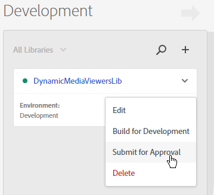

# Integrazione dei visualizzatori Dynamic Media con Adobe Analytics e Adobe Launch {#integrating-dynamic-media-viewers-with-adobe-analytics-and-adobe-launch}

## Cos’è l’integrazione dei visualizzatori per contenuti multimediali dinamici con Adobe Analytics e Adobe Launch? {#what-is-dynamic-media-viewers-integration-with-adobe-analytics-and-adobe-launch}

The new *Dynamic Media Viewers* extension for Adobe Launch, along with the recent release of Dynamic Media Viewers 5.13, lets customers of Dynamic Media, Adobe Analytics, and Adobe Launch to use events and data specific for the Dynamic Media Viewers in their Adobe Launch configuration.

Questa integrazione consente di tenere traccia dell’utilizzo dei visualizzatori per contenuti multimediali dinamici sul sito Web con Adobe Analytics. Allo stesso tempo, potete utilizzare gli eventi e i dati esposti dai visualizzatori con qualsiasi altra estensione Launch proveniente da Adobe o da terzi.

Per ulteriori informazioni sulle estensioni, consulta [Adobe Extension](https://docs.adobe.com/content/help/en/launch/using/extensions-ref/overview.html) nella Guida utente di avvio della piattaforma Experience.

**Chi dovrebbe leggere questa documentazione:** amministratori di siti, sviluppatori sulla piattaforma AEM e addetti alle operazioni.

### Limitazioni dell&#39;integrazione {#limitations-of-the-integration}

* L’integrazione di Adobe Launch per i visualizzatori per contenuti multimediali dinamici non funziona nel nodo di creazione di AEM. Non è possibile visualizzare alcun tracciamento da una pagina WCM finché non viene pubblicata.
* L’integrazione di Adobe Launch per visualizzatori per contenuti multimediali dinamici non è supportata per la modalità di funzionamento a comparsa, in cui l’URL del visualizzatore viene ottenuto utilizzando il pulsante &quot;URL&quot; nella pagina Dettagli risorsa.
* L&#39;integrazione di Adobe Launch non può essere utilizzata simultaneamente con l&#39;integrazione dei visualizzatori precedenti di Analytics (tramite il `config2=` parametro).
* Il supporto per il tracciamento video è limitato solo al tracciamento della riproduzione di base, come descritto in Panoramica tracciamento. In particolare, il monitoraggio di QoS, Annunci, Capitolo/Segmenti o Errori non è supportato.
* La configurazione della durata dell&#39;archiviazione per gli elementi dati non è supportata per gli elementi dati che utilizzano l&#39;estensione *Dynamic Media Viewers* . La durata dell&#39;archiviazione deve essere impostata su **[!UICONTROL Nessuno]**.

### Casi di utilizzo per l&#39;integrazione {#use-cases-for-the-integration}

L’integrazione con Adobe Launch è un caso d’uso principale per i clienti che utilizzano AEM Assets e AEM Sites. In questi scenari, puoi impostare un’integrazione standard tra il nodo di creazione di AEM e Adobe Launch, quindi associare l’istanza di Siti alla proprietà Adobe Launch. In seguito, qualsiasi componente WCM per contenuti multimediali dinamici aggiunto a una pagina Siti terrà traccia dei dati e degli eventi dei visualizzatori.

Consultate [Il tracciamento dei visualizzatori per contenuti multimediali dinamici in AEM Sites](https://wiki.corp.adobe.com/display/~oufimtse/Dynamic+Media+Viewers+integration+with+Adobe+Launch#DynamicMediaViewersintegrationwithAdobeLaunch-TrackingDynamicMediaViewersinAEMSites).

Un caso d’uso secondario supportato dall’integrazione sono i clienti che utilizzano solo Risorse AEM o Dynamic Media Classic. In questi casi, potete ottenere il codice da incorporare per il visualizzatore e aggiungerlo alla pagina del sito Web. Quindi, ottenete l’URL di produzione della libreria Adobe Launch da Adobe Launch e aggiungetelo manualmente al codice della pagina Web.

Consultate [Il tracciamento dei visualizzatori per contenuti multimediali dinamici tramite codice](https://wiki.corp.adobe.com/display/~oufimtse/Dynamic+Media+Viewers+integration+with+Adobe+Launch#DynamicMediaViewersintegrationwithAdobeLaunch-TrackingDynamicMediaViewersusingEmbedcode)incorporato.

## Funzionamento del tracciamento dei dati e degli eventi nell&#39;integrazione {#how-data-and-event-tracking-works-in-the-integration}

L’integrazione sfrutta due tipi distinti e indipendenti di tracciamento dei visualizzatori per contenuti multimediali dinamici: *Adobe Analytics* e *Adobe Analytics per audio e video*.

### Informazioni sul tracciamento con Adobe Analytics  {#about-tracking-using-adobe-analytics}

Adobe Analytics consente di tenere traccia delle azioni eseguite dall’utente finale quando interagisce con i visualizzatori per contenuti multimediali dinamici presenti sul sito Web. Adobe Analytics consente inoltre di tenere traccia dei dati specifici del visualizzatore. Ad esempio, potete tenere traccia e registrare gli eventi di caricamento della visualizzazione insieme al nome della risorsa, le azioni di zoom che si sono verificate, le azioni di riproduzione video e così via.

In Adobe Launch, i concetti di Elementi ** dati e *Regole* lavorano insieme per abilitare il tracciamento di Adobe Analytics.

#### Informazioni su Data Elements in Adobe Launch {#about-data-elements-in-adobe-launch}

Un elemento dati in Adobe Launch è una proprietà denominata il cui valore è definito in modo statico o calcolato in modo dinamico in base allo stato di una pagina Web o ai dati di visualizzatori di contenuti multimediali dinamici.

Le opzioni disponibili per una definizione di elemento dati dipendono dall&#39;elenco delle estensioni installate nella proprietà Adobe Launch. L&#39;estensione &quot;Core&quot; è preinstallata ed è disponibile in qualsiasi configurazione. Questa estensione &quot;Core&quot; consente di definire un elemento dati che proviene da cookie, codice JavaScript, stringa di query e molte altre origini.

Per il tracciamento di Adobe Analytics è necessario installare diverse estensioni aggiuntive, come descritto in [Installazione e configurazione delle estensioni](#installing-and-setup-of-extensions). L’estensione dei visualizzatori per contenuti multimediali dinamici consente di definire un elemento dati che rappresenta un argomento dell’evento per visualizzatori dinamici. Ad esempio, è possibile fare riferimento al tipo di visualizzatore, o al nome della risorsa riportato dal visualizzatore al momento del caricamento, al livello di zoom riportato quando l’utente finale esegue lo zoom e molto altro ancora.

Con l’estensione Dynamic Media Viewer i valori degli elementi dati restano automaticamente aggiornati.

Dopo averlo definito, un elemento dati può essere utilizzato in altre aree dell&#39;interfaccia utente di Adobe Launch utilizzando il widget del selettore Elemento dati. In particolare, agli elementi dati definiti ai fini del tracciamento dei visualizzatori per contenuti multimediali dinamici verrà fatto riferimento da Imposta azione variabili dell’estensione Adobe Analytics nella regola (vedi sotto).

Per ulteriori informazioni, consulta Elementi [di](https://docs.adobe.com/content/help/it-IT/launch/using/reference/manage-resources/data-elements.html) dati nella Guida utente di Launch della piattaforma Experience.

#### Informazioni sulle regole in Adobe Launch {#about-rules-in-adobe-launch}

Una regola in Adobe Launch è una configurazione agnostica che definisce tre aree che compongono una regola: *Eventi*, *condizioni* e *azioni*:

* *Gli eventi* (se) informano Adobe Launch quando attivare una regola.
* *Le condizioni* (se presente) indicano ad Adobe Launch quali ulteriori restrizioni consentire o rifiutare quando si attiva una regola.
* *Azioni* (quindi) per comunicare ad Adobe Launch cosa fare quando si attiva una regola.

Le opzioni disponibili nella sezione Eventi, Condizioni e Azioni dipendono dalle estensioni installate in Adobe Launch Property. L’estensione *Core* è preinstallata ed è disponibile out-of-the-box in qualsiasi configurazione. L&#39;estensione offre diverse opzioni per gli eventi, ad esempio azioni di base a livello di browser che includono la modifica dello stato attivo, la pressione di tasti, l&#39;invio di moduli e così via. Include inoltre opzioni per Condizioni, come il valore del cookie, il tipo di browser e altro. Per le azioni, è disponibile solo l&#39;opzione Codice personalizzato.

Per il tracciamento di Adobe Analytics, è necessario installare diverse estensioni aggiuntive, come descritto in [Installazione e configurazione delle estensioni](#installing-and-setup-of-extensions). In particolare:

* L’estensione dei visualizzatori per contenuti multimediali dinamici estende l’elenco degli eventi supportati agli eventi specifici per i visualizzatori per contenuti multimediali dinamici quali caricamento del visualizzatore, sostituzione delle risorse, zoom avanti e riproduzione video.
* L&#39;estensione Adobe Analytics estende l&#39;elenco delle azioni supportate con due azioni necessarie per inviare dati ai server di tracciamento: *Imposta variabili* e *invia beacon*.

Per tenere traccia dei visualizzatori per contenuti multimediali dinamici, è possibile utilizzare uno dei seguenti tipi:

* Eventi dai visualizzatori per contenuti multimediali dinamici, dalle estensioni core o da qualsiasi altra estensione.
* Condizioni nella definizione della regola. In alternativa, è possibile lasciare vuota l&#39;area delle condizioni.

Nella sezione Azioni è necessaria un&#39;azione *Imposta variabili* . Questa azione indica ad Adobe Analytics come compilare le variabili di tracciamento con i dati. Allo stesso tempo, l’azione *Imposta variabili* non invia nulla al server di tracciamento.

L&#39;azione *Imposta variabili* deve essere seguita da un&#39;azione *Invia beacon* . L&#39;azione *Invia beacon* invia in realtà dati al server di tracciamento analisi. Entrambe le azioni, *Set Variables* e *Send Beacon*, provengono dall&#39;estensione Adobe Analytics.

Per ulteriori informazioni, consulta [Regole](https://docs.adobe.com/content/help/it-IT/launch/using/reference/manage-resources/rules.html) nella Guida utente di Launch della piattaforma Experience.

#### Configurazione di esempio {#sample-configuration}

La seguente configurazione di esempio all’interno di Adobe Launch illustra come tenere traccia del nome di una risorsa al caricamento del visualizzatore.

1. Dalla scheda **[!UICONTROL Elementi]** dati, definite un elemento dati `AssetName` che faccia riferimento `asset` al parametro dell’ `LOAD` evento dall’estensione dei visualizzatori per elementi multimediali dinamici.

   

1. Dalla scheda **[!UICONTROL Regole]** , definire una regola *TrackAssetOnLoad*.

   In questa regola, il campo **[!UICONTROL Evento]** utilizza l’evento **[!UICONTROL LOAD]** dell’estensione dei visualizzatori per contenuti multimediali dinamici.

   

1. La configurazione Azione include due tipi di azioni dall&#39;estensione Adobe Analytics:

   *Impostate Variabili*, che associano una variabile di analisi di vostra scelta al valore di Elemento `AssetName` dati.

   *Invia beacon*, che invia le informazioni di tracciamento ad Adobe Analytics.

   

1. La configurazione della regola risultante sarà simile alla seguente:

   

### Informazioni su Adobe Analytics per audio e video {#about-adobe-analytics-for-audio-and-video}

Quando un account Experience Cloud è sottoscritto per utilizzare Adobe Analytics per audio e video, è sufficiente per abilitare il tracciamento video nelle impostazioni di estensione dei visualizzatori *per contenuti multimediali* dinamici. Le metriche video diventano disponibili in Adobe Analytics. Il tracciamento video dipende dalla presenza di Adobe Media Analytics per l’estensione Audio e Video.

Consultate [Installazione e configurazione delle estensioni](#installing-and-setup-of-extensions).

Al momento, il supporto per il tracciamento video è limitato solo al tracciamento della &quot;riproduzione di base&quot;, come descritto in Panoramica tracciamento. In particolare, il monitoraggio di QoS, Annunci, Capitolo/Segmenti o Errori non è supportato.

## Utilizzo dell’estensione visualizzatori per contenuti multimediali dinamici {#using-the-dynamic-media-viewers-extension}

Come indicato in [Casi d’uso per l’integrazione](#use-cases-for-the-integration), è possibile monitorare i visualizzatori per contenuti multimediali dinamici con la nuova integrazione Adobe Launch in AEM Sites e utilizzando il codice da incorporare.

### Tracciamento dei visualizzatori per contenuti multimediali dinamici in AEM Sites {#tracking-dynamic-media-viewers-in-aem-sites}

Per tenere traccia dei visualizzatori per contenuti multimediali dinamici in AEM Sites, è necessario eseguire tutti i passaggi elencati nella sezione [Configurazione di tutti i componenti](#configuring-all-the-integration-pieces) di integrazione. In particolare, devi creare la configurazione IMS e Adobe Launch Cloud Configuration.

In base alla configurazione corretta, qualsiasi visualizzatore per contenuti multimediali dinamici aggiunto a una pagina Siti, utilizzando un componente WCM supportato da Dynamic Media, tiene traccia automaticamente dei dati in Adobe Analytics, Adobe Analytics per video o entrambi.

Consultate [Aggiunta di risorse multimediali dinamiche alle pagine tramite Adobe Sites](/help/assets/dynamic-media/adding-dynamic-media-assets-to-pages.md).

### Tracciamento dei visualizzatori per contenuti multimediali dinamici tramite codice da incorporare {#tracking-dynamic-media-viewers-using-embed-code}

I clienti che non utilizzano AEM Sites o che incorporano visualizzatori per contenuti multimediali dinamici in pagine Web esterne ad AEM Sites o a entrambi possono comunque utilizzare l&#39;integrazione Adobe Launch.

Devi completare i passaggi di configurazione delle sezioni [Configurazione di Adobe Analytics](#configuring-adobe-analytics-for-the-integration) e [Configurazione di Adobe Launch](#configuring-adobe-launch-for-the-integration). Tuttavia, i passaggi di configurazione relativi ad AEM non sono necessari.

Dopo la corretta configurazione, potete aggiungere il supporto per Adobe Launch a una pagina Web con un visualizzatore per contenuti multimediali dinamici.

Consultate [Aggiungere il codice](https://docs.adobe.com/content/help/en/launch/using/implement/configure/implement-the-launch-install-code.html) di incorporamento di Launch per ulteriori informazioni sull’utilizzo del codice di incorporamento della libreria Adobe Launch.

Consultate [Incorporamento di video o visualizzatori di immagini in una pagina](/help/assets/dynamic-media/embed-code.md) Web per ulteriori informazioni sull’utilizzo della funzione codice da incorporare di AEM Dynamic Media.

**Per tenere traccia dei visualizzatori per contenuti multimediali dinamici mediante il codice da incorporare**

1. Tenete pronta una pagina Web per incorporare un visualizzatore per contenuti multimediali dinamici.
1. Ottenete il codice da incorporare per la libreria Adobe Launch effettuando il login ad Adobe Launch (consultate [Configurazione di Adobe Launch](#configuring-adobe-launch-for-the-integration)).
1. Fate clic su **[!UICONTROL Proprietà]**, quindi sulla scheda **[!UICONTROL Ambienti]** .
1. Consente di alzare il livello Ambiente in base all&#39;ambiente della pagina Web. Quindi, nella colonna **[!UICONTROL Installa]** , fate clic sull&#39;icona della casella.
1. **[!UICONTROL Nella finestra di dialogo Istruzioni]** per l&#39;installazione Web, copiate il codice da incorporare della libreria Adobe Launch, insieme ai `<script/>` tag circostanti.

## Guida di riferimento per l’estensione dei visualizzatori per contenuti multimediali dinamici {#reference-guide-for-the-dynamic-media-viewers-extension}

### Informazioni sulla configurazione dei visualizzatori per contenuti multimediali dinamici {#about-the-dynamic-media-viewers-configuration}

L’estensione Dynamic Media Viewer si integra automaticamente con la libreria Adobe Launch se tutte le seguenti condizioni sono soddisfatte:

* L&#39;oggetto globale della libreria Adobe Launch ( `_satellite`) è presente nella pagina.
* La funzione di estensione dei visualizzatori per contenuti multimediali dinamici `_dmviewers_v001()` è definita in `_satellite`.

* `config2=` il parametro del visualizzatore non è specificato, il che significa che il visualizzatore non utilizza l&#39;integrazione Analytics precedente.

Inoltre, è disponibile un’opzione per disabilitare esplicitamente l’integrazione di Adobe Launch nel visualizzatore specificando `launch=0` i parametri nella configurazione del visualizzatore. Il valore predefinito di questo parametro è `1`.

### Configurazione dell’estensione dei visualizzatori per contenuti multimediali dinamici {#configuring-the-dynamic-media-viewers-extension}

L’unica opzione di configurazione per l’estensione dei visualizzatori per contenuti multimediali dinamici è **[!UICONTROL Abilita Adobe Media Analytics per audio e video]**.

Quando selezionate (attivate o &quot;attivate&quot;) questa opzione e se Adobe Media Analytics for Audio and Video extension è installato e configurato correttamente, le metriche di riproduzione video vengono inviate alla soluzione Adobe Analytics per Audio e Video. La disattivazione di questa opzione disattiva il tracciamento video.

Tenete presente che se abilitate questa opzione *senza* l&#39;installazione dell&#39;estensione Adobe Media Analytics for Audio e Video, l&#39;opzione non ha alcun effetto.

### Gli elementi dati nell’estensione dei visualizzatori per contenuti multimediali dinamici {#about-data-elements-in-the-dynamic-media-viewers-extension}

L’unico tipo di elemento di dati fornito dall’estensione Dynamic Media Viewers è **[!UICONTROL Evento visualizzatore]**, proveniente dall’elenco a discesa **[!UICONTROL Data Element Type (Tipo di elemento dati)]**.

Quando è selezionato, l&#39;Editor elemento dati esegue il rendering di un modulo con due campi:

* **[!UICONTROL DM viewers event data type (Tipo di dati evento visualizzatori DM)]**: un elenco a discesa che identifica tutti gli eventi visualizzatore supportati dall’estensione Dynamic Media Viewers che presentano argomenti, con l’aggiunta di un elemento **[!UICONTROL COMMON]** speciale. Un elemento **[!UICONTROL COMMON]** rappresenta un elenco di parametri evento che sono comuni a tutti i tipi di eventi inviati dai visualizzatori.
* **[!UICONTROL Parametro]** di tracciamento - argomento dell&#39;evento del visualizzatore per elementi multimediali dinamici selezionato.

Consultate la guida [di riferimento dei visualizzatori per contenuti multimediali](https://marketing.adobe.com/resources/help/en_US/s7/viewers_ref/c_html5_s7_aem_asset_viewers.html) dinamici per l’elenco degli eventi supportati per ciascun tipo di visualizzatore; andate a una sezione specifica del visualizzatore, quindi fate clic sulla sottosezione Supporto per il tracciamento di Adobe Analytics. Attualmente, la guida di riferimento dei visualizzatori per contenuti multimediali dinamici non documenta gli argomenti relativi agli eventi.

Consideriamo ora il ciclo di vita dei visualizzatori *dati multimediali dinamici*. Il valore di tale elemento dati viene popolato dopo che l&#39;evento visualizzatore per elementi multimediali dinamici corrispondente si verifica sulla pagina. Ad esempio, se l&#39;elemento dati punta all&#39;evento **[!UICONTROL LOAD]** e al relativo argomento &quot;asset&quot;, il valore di tale elemento dati riceverà dati validi dopo che il visualizzatore avrà eseguito per la prima volta l&#39;evento LOAD. Se l&#39;elemento dati punta all&#39;evento **[!UICONTROL ZOOM]** e al relativo argomento &quot;scala&quot;, il valore di tale elemento dati resterà vuoto finché il visualizzatore non invia per la prima volta un evento **[!UICONTROL ZOOM]** .

Allo stesso modo, i valori di Elementi dati vengono aggiornati automaticamente quando il visualizzatore invia un evento corrispondente sulla pagina. L’aggiornamento del valore si verifica anche se l’evento specifico non è indicato nella configurazione Regola. Ad esempio, se l’elemento dati **[!UICONTROL ZoomScale]** è definito per il parametro “scale” dell’evento ZOOM, ma l’unica regola presente nella configurazione Regola è attivata dall’evento **[!UICONTROL LOAD]**, il valore di **[!UICONTROL ZoomScale]** viene comunque aggiornato ogni volta che un utente esegue lo zoom all’interno del visualizzatore.

Qualsiasi visualizzatore Dynamic Media è dotato di un identificatore univoco sulla pagina web. L’elemento dati tiene traccia del valore stesso e del visualizzatore che lo ha popolato. In altre parole, se sulla stessa pagina vi sono diversi visualizzatori ed è presente un elemento dati **[!UICONTROL AssetName]** che punta all’evento **[!UICONTROL LOAD]** e al relativo argomento “asset”, l’elemento dati **[!UICONTROL AssetName]** mantiene una raccolta di nomi di risorse che sono associati a ciascun visualizzatore caricato sulla pagina.

Il valore esatto restituito dall&#39;elemento dati dipende dal contesto. Se l&#39;elemento dati è richiesto in una regola attivata da un evento visualizzatore per elementi multimediali dinamici, il valore dell&#39;elemento dati viene restituito per il visualizzatore che ha avviato la regola. Inoltre, se l&#39;elemento dati è richiesto in una regola attivata da un evento da un&#39;altra estensione di Adobe Launch, il valore dell&#39;elemento dati è il valore del visualizzatore che è stato l&#39;ultimo ad aggiornare l&#39;elemento dati.

**Considerate la seguente impostazione** di esempio:

* Una pagina Web con due visualizzatori di zoom per contenuti multimediali dinamici; verranno utilizzati come *visualizzatore1* e *visualizzatore2*.

* **[!UICONTROL Elemento dati ZoomScale]** punta all’evento **[!UICONTROL ZOOM]** e al relativo argomento &quot;scala&quot;.
* **[!UICONTROL Regola TrackPan]** con le seguenti caratteristiche:

   * Utilizza l’evento **[!UICONTROL PAN]** del visualizzatore per contenuti multimediali dinamici come attivatore.
   * Invia il valore di **[!UICONTROL ZoomScale]** Data Element ad Adobe Analytics.

* 
   * **[!UICONTROL Regola TrackKey]** con le seguenti caratteristiche:

   * Utilizza l&#39;evento di pressione tasti dell&#39;estensione Core Adobe Launch come attivatore.
   * Invia il valore di **[!UICONTROL ZoomScale]** Data Element ad Adobe Analytics.

A questo punto, si supponga che l’utente finale carichi la pagina Web con i due visualizzatori. Nel *visualizzatore1*, viene applicato lo zoom in una scala del 50%; quindi, in *viewer2*, viene applicato lo zoom in una scala del 25%. Nel *visualizzatore1*, l&#39;immagine viene ingrandita e infine viene premuto un tasto sulla tastiera.

L&#39;attività dell&#39;utente finale determina l&#39;effettuazione delle due seguenti chiamate di tracciamento ad Adobe Analytics:

* La prima chiamata si verifica perché la regola **[!UICONTROL TrackPan]** viene attivata quando l&#39;utente esegue il panning nel *visualizzatore1*. Tale chiamata invia il 50% come valore dell&#39;elemento dati **[!UICONTROL ZoomScale]** perché l&#39;elemento dati sa che la regola viene attivata da *viewer1* e recupera il valore di scala corrispondente;
* La seconda chiamata si verifica perché la regola **[!UICONTROL TrackKey]** viene attivata quando l&#39;utente preme un tasto sulla tastiera. Tale chiamata invia il 25% come valore dell’elemento dati **[!UICONTROL ZoomScale]** perché la regola non è stata attivata dal visualizzatore. Di conseguenza, l&#39;elemento dati restituisce il valore più aggiornato.

Il campione impostato sopra incide anche sulla durata del valore Data Element. Il valore dell’elemento dati gestito da Dynamic Media Viewer è memorizzato nel codice della libreria Adobe Launch anche dopo che il visualizzatore stesso è stato eliminato dalla pagina Web. Questo significa che se è presente una regola attivata da un’estensione del visualizzatore multimediale non dinamico e fa riferimento a tale elemento dati, l’elemento dati restituisce l’ultimo valore noto, anche se il visualizzatore non è più presente sulla pagina Web.

In ogni caso, i valori degli elementi dati guidati dai visualizzatori per contenuti multimediali dinamici non sono memorizzati nell’archivio locale o sul server; vengono invece conservati solo nella libreria Adobe Launch lato client. I valori di tale Data Element scompaiono quando la pagina Web viene ricaricata.

In genere, l&#39;editor Data Element supporta la selezione della durata [dell&#39;archiviazione](https://docs.adobe.com/content/help/it-IT/launch/using/reference/manage-resources/data-elements.html#create-a-data-element). Tuttavia, gli elementi dati che utilizzano l’estensione visualizzatori per contenuti multimediali dinamici supportano solo l’opzione di durata dell’archiviazione **[!UICONTROL Nessuno]**. L&#39;impostazione di qualsiasi altro valore è possibile nell&#39;interfaccia utente, ma in questo caso il comportamento Elemento dati non è definito. L&#39;estensione gestisce il valore dell&#39;elemento dati autonomamente: l&#39;elemento dati che mantiene il valore dell&#39;argomento evento del visualizzatore durante l&#39;intero ciclo di vita del visualizzatore.

### Informazioni sulle regole nell’estensione dei visualizzatori per contenuti multimediali dinamici {#about-rules-in-the-dynamic-media-viewers-extension}

Nell&#39;editor Regola, l&#39;estensione aggiunge nuove opzioni di configurazione per l&#39;editor Eventi. Inoltre, fornisce un&#39;opzione per fare riferimento manualmente ai parametri dell&#39;evento nell&#39;Editor azione come opzione di breve durata, anziché utilizzare elementi dati preconfigurati.

#### Informazioni sull&#39;editor Eventi {#about-the-events-editor}

Nell’editor evento, l’estensione Dynamic Media Viewers aggiunge un nuovo **[!UICONTROL Tipo evento]** denominato **[!UICONTROL Evento visualizzatore]**.

Quando è selezionato, l’editor evento esegue il rendering degli eventi **[!UICONTROL del visualizzatore]** Dynamic Media Viewer a discesa, elencando tutti gli eventi disponibili supportati dai visualizzatori Dynamic Media.

#### Informazioni sull&#39;editor Azioni {#about-the-actions-editor}

L’estensione Visualizzatori per contenuti multimediali dinamici consente di utilizzare i parametri evento dei visualizzatori per contenuti multimediali dinamici per mappare le variabili di analisi nell’editor Imposta variabili dell’estensione Adobe Analytics.

Il metodo più semplice per farlo consiste nel completare il seguente processo in due fasi:

* Innanzitutto, definite uno o più elementi di dati, in cui ogni elemento di dati rappresenta un parametro di un evento di visualizzatore di contenuti multimediali dinamici.
* Infine, nell’editor Imposta variabili dell’estensione Adobe Analytics, fai clic sull’icona del selettore degli elementi dati (tre dischi sovrapposti) per aprire la finestra di dialogo Seleziona elemento dati, quindi seleziona un elemento dati da esso.

È tuttavia possibile adottare un approccio alternativo e ignorare la creazione di elementi dati. Per fare riferimento diretto a un argomento di un evento Dynamic Media Viewer: inserisci il nome completo dell’argomento dell’evento nel campo di immissione del **[!UICONTROL valore]** dell’assegnazione della variabile Analytics, circondato dai segni di percentuale (%). Ad esempio,

`%event.detail.dm.LOAD.asset%`

Si noti che esiste una differenza importante tra l&#39;utilizzo di Elementi dati e il riferimento dell&#39;argomento dell&#39;evento diretto. Per l&#39;elemento dati, non importa quale evento attivi l&#39;azione Imposta variabili, l&#39;evento che attiva la regola può essere correlato al visualizzatore dinamico (come un clic del mouse sulla pagina Web dall&#39;estensione Core). Tuttavia, quando si utilizza un riferimento a un argomento diretto, è importante garantire che l&#39;evento che attiva la regola corrisponda all&#39;argomento evento a cui fa riferimento.

Ad esempio, il riferimento a `%event.detail.dm.LOAD.asset%` restituisce il nome corretto della risorsa se la regola viene attivata dall’evento **[!UICONTROL LOAD]** dell’estensione Dynamic Media Viewer. Tuttavia, restituisce un valore vuoto per qualsiasi altro evento.

Nella tabella seguente sono elencati gli eventi del visualizzatore di contenuti multimediali dinamici e i relativi argomenti supportati:

<table>
 <tbody>
  <tr>
   <td>Nome evento visualizzatore</td>
   <td>Riferimento argomento</td>
  </tr>
  <tr>
   <td><code>COMMON</code></td>
   <td><code>%event.detail.dm.objID%</code></td>
  </tr>
  <tr>
   <td> </td>
   <td><code>%event.detail.dm.compClass%</code></td>
  </tr>
  <tr>
   <td> </td>
   <td><code>%event.detail.dm.instName%</code></td>
  </tr>
  <tr>
   <td> </td>
   <td><code>%event.detail.dm.timeStamp%</code></td>
  </tr>
  <tr>
   <td><code>BANNER</code> </td>
   <td><code>%event.detail.dm.BANNER.asset%</code></td>
  </tr>
  <tr>
   <td> </td>
   <td><code>%event.detail.dm.BANNER.frame%</code></td>
  </tr>
  <tr>
   <td> </td>
   <td><code>%event.detail.dm.BANNER.label%</code></td>
  </tr>
  <tr>
   <td><code>HREF</code></td>
   <td><code>%event.detail.dm.HREF.rollover%</code></td>
  </tr>
  <tr>
   <td><code>ITEM</code></td>
   <td><code>%event.detail.dm.ITEM.rollover%</code></td>
  </tr>
  <tr>
   <td><code>LOAD</code></td>
   <td><code>%event.detail.dm.LOAD.applicationname%</code></td>
  </tr>
  <tr>
   <td><strong> </strong></td>
   <td><code>%event.detail.dm.LOAD.asset%</code></td>
  </tr>
  <tr>
   <td><strong> </strong></td>
   <td><code>%event.detail.dm.LOAD.company%</code></td>
  </tr>
  <tr>
   <td><strong> </strong></td>
   <td><code>%event.detail.dm.LOAD.sdkversion%</code></td>
  </tr>
  <tr>
   <td><strong> </strong></td>
   <td><code>%event.detail.dm.LOAD.viewertype%</code></td>
  </tr>
  <tr>
   <td><strong> </strong></td>
   <td><code>%event.detail.dm.LOAD.viewerversion%</code></td>
  </tr>
  <tr>
   <td><code>METADATA</code></td>
   <td><code>%event.detail.dm.METADATA.length%</code></td>
  </tr>
  <tr>
   <td> </td>
   <td><code>%event.detail.dm.METADATA.type%</code></td>
  </tr>
  <tr>
   <td><code>MILESTONE</code></td>
   <td><code>%event.detail.dm.MILESTONE.milestone%</code></td>
  </tr>
  <tr>
   <td><code>PAGE</code></td>
   <td><code>%event.detail.dm.PAGE.frame%</code></td>
  </tr>
  <tr>
   <td> </td>
   <td><code>%event.detail.dm.PAGE.label%</code></td>
  </tr>
  <tr>
   <td><code>PAUSE</code></td>
   <td><code>%event.detail.dm.PAUSE.timestamp%</code></td>
  </tr>
  <tr>
   <td><code>PLAY</code></td>
   <td><code>%event.detail.dm.PLAY.timestamp%</code></td>
  </tr>
  <tr>
   <td><code>SPIN</code></td>
   <td><code>%event.detail.dm.SPIN.framenumber%</code></td>
  </tr>
  <tr>
   <td><code>STOP</code></td>
   <td><code>%event.detail.dm.STOP.timestamp%</code></td>
  </tr>
  <tr>
   <td><code>SWAP</code></td>
   <td><code>%event.detail.dm.SWAP.asset%</code></td>
  </tr>
  <tr>
   <td><code>SWATCH</code></td>
   <td><code>%event.detail.dm.SWATCH.frame%</code></td>
  </tr>
  <tr>
   <td> </td>
   <td><code>%event.detail.dm.SWATCH.label%</code></td>
  </tr>
  <tr>
   <td><code>TARG</code></td>
   <td><code>%event.detail.dm.TARG.frame%</code></td>
  </tr>
  <tr>
   <td> </td>
   <td><code>%event.detail.dm.TARG.label%</code></td>
  </tr>
  <tr>
   <td><code>ZOOM</code></td>
   <td><code>%event.detail.dm.ZOOM.scale%</code></td>
  </tr>
 </tbody>
</table>

## Configurazione di tutti gli elementi di integrazione {#configuring-all-the-integration-pieces}

**PRIMA DI INIZIARE**

Se non lo avete ancora fatto, Adobe consiglia di consultare tutta la documentazione fornita prima di questa sezione per comprendere l&#39;integrazione completa.

Questa sezione descrive i passaggi di configurazione necessari per integrare i visualizzatori per contenuti multimediali dinamici con Adobe Analytics e Adobe Analytics per audio e video. Anche se è possibile utilizzare l’estensione visualizzatori per contenuti multimediali dinamici per altri scopi in Adobe Launch, scenari non descritti in questa documentazione.

L&#39;integrazione verrà configurata nei seguenti prodotti Adobe:

* Adobe Analytics: configurerai le variabili di tracciamento e i rapporti.
* Adobe Launch: definirete una proprietà, una o più regole e uno o più elementi dati per abilitare il tracciamento del visualizzatore.

Inoltre, se questa soluzione di integrazione viene utilizzata con AEM Sites, è necessario eseguire anche la seguente configurazione:

* Adobe I/O Console: l&#39;integrazione viene creata per Adobe Launch.
* Nodo autore AEM - Configurazione IMS e configurazione cloud Adobe Launch.

Come parte della configurazione, accertati di avere accesso a una società in Adobe Experience Cloud in cui sono già abilitati Adobe Analytics e Adobe Launch.

## Configurazione di Adobe Analytics per l&#39;integrazione {#configuring-adobe-analytics-for-the-integration}

Dopo aver configurato Adobe Analytics, per l&#39;integrazione verrà impostato quanto segue:

* Una suite di rapporti è inserita e selezionata.
* Le variabili di Analytics sono disponibili per ricevere i dati di tracciamento.
* I report sono disponibili per visualizzare i dati raccolti in Adobe Analytics.

Consultate anche Guida all&#39;implementazione di [Analytics](https://docs.adobe.com/content/help/en/analytics/implementation/home.html).

**Per configurare Adobe Analytics per l&#39;integrazione**:

1. Per iniziare, accedi ad Adobe Analytics dalla [home page](https://exc-home.experiencecloud.adobe.com/exc-home/home.html#/)di Experience Cloud. Nella barra dei menu, fai clic sull&#39;icona Soluzioni (una tabella di punti tre per tre) accanto all&#39;angolo superiore destro della pagina, quindi fai clic su **[!UICONTROL Analytics]**.

   

   Ora selezionerete una suite di rapporti.

### Selezione di una suite di rapporti {#selecting-a-report-suite}

1. Nell’angolo in alto a destra della pagina Adobe Analytics, alla destra del campo **[!UICONTROL Search Reports (Cerca rapporti)]**, seleziona la report suite corretta dall’elenco a discesa. Se sono disponibili più report suite e non sai quale utilizzare, contatta l’amministratore Adobe Analytics che ti fornirà supporto al riguardo.

   Nell&#39;illustrazione seguente, un utente ha creato una suite di rapporti denominata *DynamicMediaViewersExtensionDoc* e l&#39;ha selezionata dall&#39;elenco a discesa. Il nome della suite di rapporti è solo a scopo illustrativo; il nome della suite di rapporti selezionata differisce.

   Se non è disponibile alcuna suite di rapporti, devi crearne una o più prima di procedere con la configurazione.

   Consulta [Report e suite](https://docs.adobe.com/content/help/en/analytics/implementation/analytics-basics/ref-reports-report-suites.html) di rapporti e [Crea una suite](https://docs.adobe.com/content/help/en/analytics/admin/admin-console/create-report-suite.html)di rapporti.

   In Adobe Analytics, le suite di rapporti sono gestite in **[!UICONTROL Amministratore > Suite]** di rapporti.

   

   Verranno ora configurate le variabili di Adobe Analytics.

### Impostazione delle variabili di Adobe Analytics {#setting-up-adobe-analytics-variables}

1. Ora specificate una o più variabili di Adobe Analytics da usare per monitorare il comportamento dei visualizzatori per file multimediali dinamici nella pagina Web.

   È possibile utilizzare qualsiasi tipo di variabile supportata da Adobe Analytics. La decisione relativa al tipo di variabile (come [proprietà]Traffico personalizzato, [eVar]conversione) deve essere determinata da esigenze specifiche dell&#39;implementazione di Analytics.

   Consultate [Panoramica delle proprietà e delle eVar](https://docs.adobe.com/content/help/en/analytics/implementation/analytics-basics/traffic-props-evars/props-evars.html).

   Ai fini di questa documentazione, verrà utilizzata solo una variabile Traffico personalizzato (prop), poiché diventano disponibili in un report di Analytics entro pochi minuti dall&#39;esecuzione di un&#39;azione su una pagina Web.

   Per abilitare una nuova variabile Custom Traffic (Traffico personalizzato), in Adobe Analytics, sulla barra degli strumenti fate clic su **[!UICONTROL Admin (Amministratore) > Report Suites (Suite di rapporti)]**.

1. Nella pagina **[!UICONTROL Report Suite Manager]**, seleziona il rapporto corretto, quindi fai clic su **[!UICONTROL Edit Settings (Modifica impostazioni) > Traffic (Traffico) > Traffic Variables (Variabili traffico)]**.
1. Qui, individuate la variabile non utilizzata, assegnatele un nome descrittivo (risorsa **[!UICONTROL Visualizzatore (prop 30)]**) e modificate la casella combinata in &quot;Abilitato&quot; nella colonna Abilitato.

   La schermata seguente è un esempio di variabile Traffico personalizzato ( **[!UICONTROL prop30]**) per tenere traccia del nome di una risorsa utilizzata dal visualizzatore:

   

1. Nella parte inferiore dell’elenco delle variabili, fate clic su **[!UICONTROL Salva]**.

### Impostazione di un rapporto {#setting-up-a-report}

1. In genere, l&#39;impostazione di un report in Adobe Analytics è guidata da esigenze specifiche del progetto. Di conseguenza, la configurazione dettagliata dei report non rientra nell&#39;ambito di questa integrazione.

   È tuttavia sufficiente sapere che i report Traffico personalizzato diventano automaticamente disponibili in Adobe Analytics dopo l&#39;impostazione delle variabili Traffico personalizzato in **[Impostazione delle variabili](#setting-up-adobe-analytics-variables)**Adobe Analytics.

   Ad esempio, il rapporto per la variabile di **[!UICONTROL Viewer asset (Risorsa visualizzatore) (prop 30)]** è disponibile dal menu Rapporti di **[!UICONTROL Traffico personalizzato > Traffico personalizzato 21-30 > Viewer asset (Risorsa visualizzatore) (prop 30)]**.

   Se accedi a questo rapporto subito dopo la creazione di **[!UICONTROL Viewer asset (Risorsa visualizzatore) (prop 30)]** non troverai alcun dato, il che è piuttosto normale a questo punto dell’integrazione.

   

## Configurazione di Adobe Launch per l&#39;integrazione {#configuring-adobe-launch-for-the-integration}

Dopo aver configurato Adobe Launch, per l&#39;integrazione verranno configurate le seguenti impostazioni:

* La creazione di una nuova proprietà per mantenere tutte le configurazioni unite.
* Installazione e configurazione delle estensioni. Il codice lato client di tutte le estensioni installate nella proprietà viene compilato insieme in una libreria. Questa libreria viene utilizzata dalla pagina Web in un secondo momento.
* Configurazione di elementi e regole dati. Questa configurazione definisce i dati da acquisire dai visualizzatori per contenuti multimediali dinamici, quando attivare la logica di tracciamento e dove inviare i dati del visualizzatore in Adobe Analytics.
* Pubblicazione della libreria.

**Per configurare Adobe Launch per l&#39;integrazione**:

1. Per iniziare, accedi ad Adobe Launch dalla [home page](https://exc-home.experiencecloud.adobe.com/exc-home/home.html#/)di Experience Cloud. Nella barra dei menu, fate clic sull&#39;icona Soluzioni (tre per tre tabelle di punti) vicino all&#39;angolo superiore destro della pagina, quindi fate clic su **[!UICONTROL Avvia]**.

   Puoi anche [aprire Adobe Launch direttamente](https://launch.adobe.com/).

   

### Creazione di una proprietà in Adobe Launch {#creating-a-property-in-adobe-launch}

Una proprietà in Adobe Launch è una configurazione denominata che mantiene tutte le impostazioni insieme. Una libreria delle impostazioni di configurazione viene generata e pubblicata su diversi livelli di ambiente (sviluppo, staging e produzione).

Consultate anche [Creare una proprietà](https://docs.adobe.com/content/help/en/launch/using/implement/configure/create-a-property.html).

1. In Adobe Launch, fai clic su **[!UICONTROL Nuova proprietà]**.
1. Nella finestra di dialogo **[!UICONTROL Crea proprietà]**, digita un nome descrittivo nel campo **[!UICONTROL Nome]**, ad esempio il titolo del tuo sito web. Esempio, `DynamicMediaViewersProp.`
1. Nel campo **[!UICONTROL Domini]** , immetti il dominio del tuo sito Web.
1. Se l’estensione da utilizzare, in questo caso **[!UICONTROL Dynamic Media Viewers]**, non è ancora stata rilasciata, abilita **[!UICONTROL Configure for extension development (Configura per lo sviluppo dell’estensione) (l’opzione non può essere modificata in seguito)]** nel menu a discesa *Opzioni avanzate*.

   

1. Fai clic su **[!UICONTROL Salva]**.

   Fare clic sulla proprietà appena creata, quindi procedere all&#39; *installazione e all&#39;impostazione delle estensioni*.

### Installazione e configurazione delle estensioni {#installing-and-setup-of-extensions}

Tutte le estensioni disponibili in Adobe Launch sono elencate in **[!UICONTROL Estensioni > Catalogo]**.

Per installare un’estensione, fate clic su **[!UICONTROL Installa]**. Se necessario, eseguite una configurazione di estensione una tantum, quindi fate clic su **[!UICONTROL Salva]**.

Se necessario, devono essere installate e configurate le seguenti estensioni:

* (Obbligatorio) Estensione del servizio ** Experience Cloud ID

Non è necessaria alcuna configurazione aggiuntiva, accettare per eventuali valori proposti. Al termine, fate clic su **[!UICONTROL Salva]**.

Consulta Estensione [del servizio](https://docs.adobe.com/content/help/en/launch/using/extensions-ref/adobe-extension/id-service-extension/overview.html)Experience Cloud ID.

* (Obbligatorio) Estensione *Adobe Analytics*

Per configurare questa estensione, è innanzitutto necessario disporre dell’ID report suite presente all’interno di Adobe Analytics, accedendo ad **[!UICONTROL Admin > Report Suite]** e selezionando l’intestazione della colonna **[!UICONTROL ID report suite]**.

L’ID report suite di **[!UICONTROL DynamicMediaViewersExtensionDoc]** viene utilizzato nelle schermate seguenti solo a scopo dimostrativo. Questo ID è stato creato e utilizzato nella precedente sezione [Selezione di una report suite](#selecting-a-report-suite).

Nella pagina Installa estensione, immetti l’ID Report Suite nel campo **[!UICONTROL Development Report Suites]** (Report Suite di sviluppo), nel campo **[!UICONTROL Staging Report Suites]** (Report Suite di staging) e nel campo **[!UICONTROL Production Report Suites]** (Report Suite di produzione).

*Configurate il seguente elemento solo se intendete utilizzare il tracciamento video:*

Nella pagina **[!UICONTROL Installa estensione]** , espandete **[!UICONTROL Generale]**, quindi specificate il server di tracciamento. Il server di tracciamento segue il modello `<trackingNamespace>.sc.omtrdc.net`, dove `<trackingNamespace>` sono le informazioni ottenute nel messaggio e-mail di provisioning.

Fai clic su **[!UICONTROL Salva]**.

Consultate [Adobe Analytics Extension](https://docs.adobe.com/content/help/en/launch/using/extensions-ref/adobe-extension/analytics-extension/overview.html).

* (Facoltativo. Richiesto solo se è necessario il tracciamento video) *Adobe Media Analytics per l’estensione Audio e Video*

Compilare il campo del server di tracciamento. Il server di tracciamento per l’estensione *Adobe Media Analytics per audio e video* è diverso dal server di tracciamento utilizzato per Adobe Analytics. Segue il modello `<trackingNamespace>.hb.omtrdc.net`, dove `<trackingNamespace>` sono le informazioni contenute nel messaggio e-mail di provisioning.

Tutti gli altri campi sono facoltativi.

Consultate [Adobe Media Analytics for Audio and Video Extension](https://docs.adobe.com/content/help/en/launch/using/extensions-ref/adobe-extension/media-analytics-extension/overview.html).

* (Obbligatorio) Estensione visualizzatori *per contenuti multimediali* dinamici

Per attivare il tracking Video Heartbeat, seleziona **[!UICONTROL enable Adobe Analytics for Video (Abilita Adobe Analytics per video)]**.

Al momento di questa scrittura, l’estensione *Dynamic Media Viewers* è disponibile solo se per lo sviluppo è stata creata la proprietà Adobe Launch.

Vedere [Creazione di una proprietà in Adobe Launch](#creating-a-property-in-adobe-launch).

Dopo che le estensioni sono installate e configurate, almeno, le seguenti cinque estensioni (quattro se non si sta monitorando video) saranno elencate nell&#39;area Estensioni > Installate.

### Impostazione di elementi e regole dati {#setting-up-data-elements-and-rules}

In Adobe Launch, crea elementi dati e regole necessari per il tracciamento dei visualizzatori per contenuti multimediali dinamici.

Per una panoramica del tracciamento con Adobe Launch, consulta [Funzionamento del tracciamento dei dati e degli eventi nell’integrazione](#how-data-and-event-tracking-works-in-the-integration) .

Consultate Configurazione [di](#sample-configuration) esempio per una configurazione di esempio in Adobe Launch che illustra come tenere traccia del nome di una risorsa al caricamento del visualizzatore.

Consultate [Configurazione dell’estensione](#configuring-the-dynamic-media-viewers-extension) dei visualizzatori per contenuti multimediali dinamici per informazioni approfondite sulle capacità dell’estensione.

### Pubblicazione di una libreria {#publishing-a-library}

Per apportare modifiche alla configurazione di Adobe Launch (inclusa la configurazione di proprietà, estensioni, regole ed elementi dati), è necessario *pubblicare* tali modifiche. La pubblicazione in Adobe Launch viene eseguita dalla scheda Pubblicazione nella configurazione Proprietà.

Adobe Launch può disporre di più ambienti di sviluppo, di un ambiente di gestione e di un ambiente di produzione. Per impostazione predefinita, Adobe Launch Cloud Configuration in AEM punta il nodo di creazione AEM all’ambiente Stage di Adobe Launch e il nodo di pubblicazione AEM all’ambiente Produzione di Adobe Launch. Questo significa che con le impostazioni predefinite di AEM, è necessario pubblicare la libreria Adobe Launch nell&#39;ambiente di gestione temporanea in modo da utilizzarla per l&#39;authoring di AEM, quindi pubblicarla nell&#39;ambiente di produzione in modo che possa essere utilizzata nella pubblicazione AEM.

Consulta [Ambienti](https://docs.adobe.com/content/help/en/launch/using/reference/publish/environments.html) per ulteriori informazioni sugli ambienti di Adobe Launch.

La pubblicazione di una libreria comporta i due passaggi seguenti:

* Aggiunta e creazione di una nuova libreria, includendo tutte le modifiche necessarie (nuove e aggiornate) nella libreria.
* Spostamento della libreria verso l&#39;alto nei diversi livelli di ambiente (dallo sviluppo allo sviluppo allo sviluppo e alla produzione)

#### Aggiunta e creazione di una nuova libreria {#adding-and-building-a-new-library}

1. La prima volta che aprite la scheda Pubblicazione in Adobe Launch, l’elenco della libreria è vuoto.

   Nella colonna sinistra, fate clic su **[!UICONTROL Aggiungi nuova libreria]**.

   

1. Nella pagina Crea nuova libreria, nel campo **[!UICONTROL Nome]** , immettete un nome descrittivo per la nuova libreria. Ad esempio,

   *DynamicMediaViewersLib*

   Dall’elenco a discesa Ambiente, scegliete il livello Ambiente. Inizialmente, solo il livello di sviluppo è disponibile per la selezione. Nell’area in basso a sinistra della pagina, fate clic su **[!UICONTROL Aggiungi tutte le risorse]** modificate.

   

1. Near the upper-right corner of the page, click **[!UICONTROL Save &amp; Build for Development]**.

   In pochi minuti la libreria viene creata e pronta per l&#39;uso.

   

   >[!NOTE]
   >
   >Alla prossima modifica della configurazione di Adobe Launch, vai alla scheda **[!UICONTROL Pubblicazione]** nella configurazione di **[!UICONTROL Proprietà]**, quindi fai clic sulla libreria creata in precedenza.
   >
   >
   >Dalla schermata di pubblicazione della libreria, fate clic su **[!UICONTROL Aggiungi tutte le risorse]** modificate, quindi fate clic su **[!UICONTROL Salva e crea per lo sviluppo]**.

#### Spostamento di una libreria verso l&#39;alto attraverso i livelli dell&#39;ambiente {#moving-a-library-up-through-environment-levels}

1. Dopo l&#39;aggiunta di una nuova libreria, questa si trova inizialmente nell&#39;ambiente di sviluppo. Per spostarlo al livello dell&#39;ambiente di gestione temporanea (corrispondente alla colonna Inviato), scegliere **[!UICONTROL Invia per approvazione dal menu a discesa della libreria]**.

   

1. Nella finestra di dialogo di conferma, fare clic su **[!UICONTROL Invia]**.

   Quando la libreria si sposta sulla colonna Inviato, dal menu a discesa della libreria, fate clic su **[!UICONTROL Genera per stato]**.

   

1. Seguite un processo simile per spostare la libreria dall&#39;ambiente di gestione temporanea all&#39;ambiente di produzione (che è la colonna Pubblicato).

   Innanzitutto, dal menu a discesa, fate clic su **[!UICONTROL Approva per la pubblicazione]**.

   

1. Dal menu a discesa, fate clic su **[!UICONTROL Genera e pubblica in produzione]**.

   

   Consultate [Pubblicazione](https://docs.adobe.com/content/help/en/launch/using/reference/publish/overview.html) per ulteriori informazioni sul processo di pubblicazione in Adobe Launch.

## Configurazione di Adobe Experience Manager per l&#39;integrazione {#configuring-adobe-experience-manager-for-the-integration}

<!-- Prerequisites lost below should be verified by Sasha -->

Prerequisiti:

* AEM esegue le istanze Author e Publish.
* Il nodo di authoring di AEM è configurato in Contenuti multimediali dinamici. <!-- Scene7 run mode (dynamicmedia_s7) -->
* I componenti WCM per elementi multimediali dinamici sono abilitati in AEM Sites.

La configurazione di AEM comprende i due passaggi principali seguenti:

* Configurazione di AEM IMS.
* Configurazione di Adobe Launch Cloud.

### Configurazione di AEM IMS {#configuring-aem-ims}

1. In AEM Author, fai clic sull’icona Strumenti (martello), quindi fai clic su **[!UICONTROL Protezione > Adobe IMS Configurations]**.

   

1. Nella pagina Configurazione Adobe IMC, nell’angolo in alto a sinistra, fate clic su **[!UICONTROL Crea]**.
1. Nella pagina **[!UICONTROL Configurazione account tecnico Adobe IMS]**, seleziona l’elenco a discesa **[!UICONTROL Soluzione Cloud]**, quindi fai clic su **[!UICONTROL Adobe Launch]**.
1. Abilita **[!UICONTROL Crea nuovo certificato]**, quindi nel campo di testo immetti qualsiasi valore significativo per il certificato. Ad esempio, *AdobeLaunchIMSCert*. Fai clic su **[!UICONTROL Crea certificato]**.

   Viene visualizzato il seguente messaggio Informazioni:

   *Per recuperare un token di accesso valido, la nuova chiave pubblica del certificato deve essere aggiunta all&#39;account tecnico in Adobe I/O!*.

   Fate clic su **[!UICONTROL OK]** per chiudere la finestra di dialogo Informazioni.

   

1. Fate clic su **[!UICONTROL Scarica chiave]** pubblica per scaricare un file di chiave pubblica (`*.crt`) nel sistema locale.

   >[!NOTE]
   >
   >A questo punto, ***lascia aperta*** la pagina **[!UICONTROL Adobe IMS Technical Account Configuration]**, ***non*** chiuderla e ***non*** fare clic su Avanti. Tornerai a questa pagina in un secondo momento.

   

1. In una nuova scheda del browser, andate alla console [I/O di](https://console.adobe.io/integrations)Adobe.

1. Dalla pagina **[!UICONTROL Adobe I/O Console Integrations]** (Integrazioni **[!UICONTROL console I/O Adobe), fate clic su]** Nuova integrazionein alto a destra.
1. Nella finestra di dialogo **[!UICONTROL Create a new integration (Crea una nuova integrazione)]**, accertati che sia selezionato il pulsante di scelta **[!UICONTROL Access an API (Accesso a un API)]**, quindi fai clic su **[!UICONTROL Continua]**.

   

1. Nella seconda pagina **[!UICONTROL Crea una nuova integrazione]**, abilita (attiva) il pulsante di scelta **[!UICONTROL Experience Platform Launch API (API di Experience Platform Launch)]**. Nell’angolo inferiore destro della pagina, fai clic su **[!UICONTROL Continua]**.

   

1. Nella terza **[!UICONTROL pagina di integrazione]** , effettuate le seguenti operazioni:

   * Nel campo **[!UICONTROL Nome]** , immettete un nome descrittivo. Ad esempio, *DynamicMediaViewersIO*.

   * Nel campo **[!UICONTROL Descrizione]** , immettere la descrizione per l&#39;integrazione.

   * Nell’area Certificati **[!UICONTROL di chiave]** pubblica, caricate il file di chiave pubblica (`*.crt`) scaricato in precedenza in questi passaggi.

   * Under the **[!UICONTROL Select a role for Experience Platform Launch API]** heading, select **[!UICONTROL Admin]**.

   * In **[!UICONTROL Seleziona uno o più profili di prodotto per l&#39;API]** di avvio della piattaforma esperienza, seleziona il profilo di prodotto **[!UICONTROL Launch - &lt;nome_azienda_azienda>]**.

   

1. Click **[!UICONTROL Create integration]**.
1. Nella pagina **[!UICONTROL Integrazione creata]** , fate clic su **[!UICONTROL Continua per i dettagli]** di integrazione.

   

1. Viene visualizzata una pagina dei dettagli relativi alle integrazioni, simile alla seguente:

   >[!NOTE]
   >
   >***Lascia aperta la pagina dei dettagli di integrazione***. Tra poco ti occorreranno varie informazioni provenienti dalle schede **[!UICONTROL Panoramica]** e **[!UICONTROL JWT]**.

   
   _Pagina dei dettagli dell&#39;integrazione_

1. Torna alla pagina **[!UICONTROL Configurazione account tecnico Adobe IMS]** che hai lasciato aperta in precedenza. Nell’angolo superiore destro della pagina, fai clic su **[!UICONTROL Avanti]** per aprire la pagina **[!UICONTROL Account]** alla finestra **[!UICONTROL Configurazione account tecnico Adobe IMS]**.

   Se hai chiuso la pagina accidentalmente, torna ad AEM Author e fai clic su **[!UICONTROL Strumenti > Protezione > Configurazioni Adobe IMS]**. Fai clic su **[!UICONTROL Crea]**. Nell’elenco a discesa **[!UICONTROL Soluzione Cloud]**, seleziona **[!UICONTROL Adobe Launch]**. Nell’elenco a discesa **[!UICONTROL Certificato]**, fai clic sul nome del certificato creato in precedenza.

   
   _Pagina Configurazione account tecnico Adobe IMS - Certificato_

1. La pagina **[!UICONTROL Account]** include cinque campi che dovranno essere compilati utilizzando le informazioni contenute nella pagina dei dettagli Integrazione del passaggio precedente.

   
   _Configurazione account tecnico Adobe IMS - Pagina Account_

1. Nella pagina **[!UICONTROL Account]** , compila i campi seguenti:

   * **[!UICONTROL Titolo]** - Immettete un titolo di account descrittivo.
   * **[!UICONTROL Server]** autorizzazioni - Torna alla pagina dei dettagli dell&#39;integrazione aperta in precedenza. Click the **[!UICONTROL JWT]** tab. Copiate il nome del server, senza il percorso, come evidenziato di seguito.
Torna alla pagina **[!UICONTROL Account]**, quindi incolla il nome nel rispettivo campo.
Ad esempio, `https://ims-na1.adobelogin.com/`(il nome del server di esempio è solo a scopo illustrativo)   
]**`https://ims-na1.adobelogin.com/`

   _Pagina dei dettagli dell&#39;integrazione - scheda JWT_   **[!UICONTROL Chiave API]**: torna alla pagina dei dettagli di integrazione. Fai clic sulla scheda **[!UICONTROL Panoramica]**, quindi, a destra del campo **[!UICONTROL Chiave API (ID client)]**, fai clic su **[!UICONTROL Copia]**._

1. Torna alla pagina **[!UICONTROL Account]**, quindi incolla la chiave nel rispettivo campo.************

   
]**

   _Pagina dei dettagli dell&#39;integrazione_   **[!UICONTROL Segreto client]**: torna alla pagina dei dettagli di integrazione. Nella scheda **[!UICONTROL Panoramica]**, fai clic su **[!UICONTROL Retrieve Client Secret (Recupera segreto client)]**. A destra del campo **[!UICONTROL Segreto client]**, fai clic su **[!UICONTROL Copia]**._

1. Torna alla pagina **[!UICONTROL Account]**, quindi incolla la chiave nel rispettivo campo.****************

   **[!UICONTROL Payload]** - Torna alla pagina dei dettagli dell&#39;integrazione. Dalla scheda **[!UICONTROL JWT]** , nel campo Payload JWT, copiare l&#39;intero codice oggetto JSON.

1. Torna alla pagina **[!UICONTROL Account]**, quindi incolla il codice nel rispettivo campo.****

   
]**

   _Pagina dei dettagli dell&#39;integrazione - scheda JWT_   _La pagina Account, con tutti i campi compilati, avrà un aspetto simile al seguente:_

   

   Near the upper-right corner of the **[!UICONTROL Account]** page, click **[!UICONTROL Create]**.](assets/2019-07-25_22-08-30.png)

1. Con AEM IMS configurato, ora è presente un nuovo account IMSA elencato in **[!UICONTROL Adobe IMS Configurations]**.****

   ]**

   Configurazione di Adobe Launch Cloud per l&#39;integrazione {#configuring-adobe-launch-cloud-for-the-integration}](assets/image2019-7-15_14-17-54.png)

## In AEM Author, accanto all’angolo in alto a sinistra, fai clic sull’icona Strumenti (martello), quindi fai clic su Servizi **[!UICONTROL cloud > Adobe Launch Configurations]**(Configurazioni di avvio Adobe).

1. ]**

   Nella pagina Configurazioni **[!UICONTROL di]** Adobe Launch, nel pannello a sinistra, seleziona un sito AEM per il quale vuoi applicare la configurazione di Adobe Launch.](assets/2019-07-26_12-10-38.png)

1. Solo a scopo illustrativo, il sito **[!UICONTROL We.Retail]** è selezionato nella schermata sottostante.

   ]**

   Fai clic su **[!UICONTROL Crea]** nell’angolo superiore sinistro della pagina.](assets/2019-07-26_12-20-06.png)

1. Nella pagina **[!UICONTROL Generale]** (1/3 pagine) della finestra **[!UICONTROL Crea configurazione di Adobe Launch]**, compila i campi seguenti:
1. **[!UICONTROL Titolo]** - Immettete un titolo di configurazione descrittivo. Esempio, `We.Retail Launch cloud configuration`.]**

   * **[!UICONTROL Configurazione]** Adobe IMS associata - Selezionate la configurazione IMS creata in precedenza in [Configurazione di AEM IMS](#configuring-aem-ims).

   * **[!UICONTROL Società]** - Dall’elenco a discesa **[!UICONTROL Società]** , seleziona la tua società Experience Cloud. L&#39;elenco viene compilato automaticamente.](#configuring-aem-ims)

   * **[!UICONTROL Proprietà]** - Dall&#39;elenco a discesa Proprietà, selezionate la proprietà Adobe Launch creata in precedenza. L&#39;elenco viene compilato automaticamente.****

   * Dopo aver completato tutti i campi, la pagina **[!UICONTROL Generale]** avrà un aspetto simile al seguente:
   ]**

   Nell&#39;angolo superiore sinistro, fare clic su **[!UICONTROL Avanti]**.](assets/image2019-7-15_14-34-23.png)

1. Nella pagina **[!UICONTROL Staging]** (2/3 pagine) della finestra **[!UICONTROL Crea configurazione di Adobe Launch]**, compila il seguente campo:
1. Nel campo **[!UICONTROL URI libreria]**, verifica il percorso della versione di staging della libreria di Adobe Launch. AEM compila automaticamente questo campo.****

   Solo a scopo illustrativo, questo passaggio utilizza le librerie Adobe Launch distribuite in Adobe CDN.****

   [!NOTE]

   >[!NOTE]Verificare che l&#39;URI della libreria popolata automaticamente (Uniform Resource Identifier) non sia danneggiato. Se necessario, correggetelo in modo che l&#39;URI rappresenti un URI relativo al protocollo. Ovvero, inizia da una doppia barra in avanti.
   >
   >Esempio: `//assets.adobetm.com/launch-xxxx`.
   >
   >
   >La pagina **[!UICONTROL Staging]** deve avere un aspetto simile a quella riportata di seguito. Le opzioni **[!UICONTROL Archive (Archivia)]** e **[!UICONTROL Load Library Asynchronously (Carica libreria in modo asincrono)]** ***non*** sono impostate:

   ]****************

   Nell&#39;angolo superiore destro, fate clic su **[!UICONTROL Avanti]**.](assets/image2019-7-15_15-21-8.png)

1. se necessario, nella pagina **[!UICONTROL Produzione]** (3/3 pagine) della finestra **[!UICONTROL Crea configurazione di Adobe Launch]**, correggi l’URI di produzione con compilazione automatica con una procedura simile a quanto già fatto nella pagina precedente di **[!UICONTROL Staging]**.
1. Nell&#39;angolo superiore destro, fate clic su **[!UICONTROL Crea]**.********
1. La nuova configurazione di Adobe Launch Cloud ora viene creata ed elencata accanto al sito Web.****

   Seleziona la nuova configurazione di Adobe Launch Cloud (quando è selezionata, viene visualizzato un segno di spunta a sinistra del titolo della configurazione). Nella barra degli strumenti, fate clic su **[!UICONTROL Pubblica]**.

1. ]**

   

È tuttavia supportato nel nodo AEM Publish. Utilizzando le impostazioni predefinite di Adobe Launch Cloud Configuration, AEM Publish utilizza l&#39;ambiente di produzione di Adobe Launch. Di conseguenza, durante il test è necessario inviare gli aggiornamenti della libreria Adobe Launch dallo sviluppo all&#39;ambiente di produzione ogni volta.

È possibile ovviare a questo limite specificando l&#39;URL di sviluppo o di gestione temporanea della libreria Adobe Launch nella configurazione Adobe Launch Cloud per la pubblicazione AEM di cui sopra. In questo modo il nodo AEM Publish utilizza la versione Sviluppo o Gestione temporanea della libreria Adobe Launch.

Consultate [Integrare AEM con Adobe Launch tramite Adobe I/O[#$tu398] per ulteriori informazioni sulla configurazione di Adobe Launch Cloud.

See [Integrate AEM with Adobe Launch Via Adobe I/O-ERR:REF-NOT-FOUND- for more information about setting up Adobe Launch Cloud Configuration.