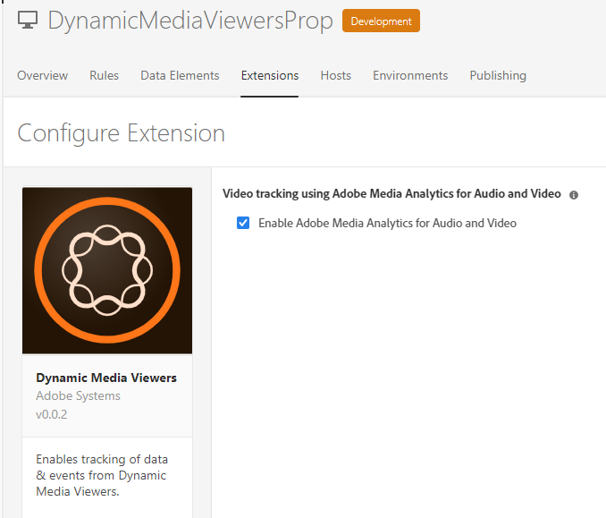

# Integrazione dei visualizzatori Dynamic Media con Adobe Analytics ed Experience Platform Launch {#integrating-dynamic-media-viewers-with-adobe-analytics-and-adobe-launch}

## Cos’è l’integrazione dei visualizzatori Dynamic Media con Adobe Analytics ed Experience Platform Launch? {#what-is-dynamic-media-viewers-integration-with-adobe-analytics-and-adobe-launch}

La nuova estensione *Dynamic Media Viewers* per Platform Launch e Dynamic Media Viewers 5.13 consente ai clienti di Adobe Analytics e Platform Launch di utilizzare eventi e dati specifici per i visualizzatori nella configurazione di Platform Launch.

Questa integrazione consente di tenere traccia dell’utilizzo dei visualizzatori Dynamic Media sul sito web con Adobe Analytics. Allo stesso tempo, puoi utilizzare gli eventi e i dati esposti dai visualizzatori con qualsiasi altra estensione Platform Launch proveniente da Adobe o da terze parti.

Per ulteriori informazioni sulle estensioni, consulta [Adobe extensions](https://experienceleague.adobe.com/docs/launch/using/extensions-ref/overview.html#adobe-extension) nella guida utente di Experience Platform Launch.

**Questo argomento è destinato agli amministratori di sito, agli sviluppatori sulla piattaforma Adobe Experience Manager e alle persone nelle operazioni** .

### Limitazioni dell&#39;integrazione {#limitations-of-the-integration}

* L’integrazione di Experience Platform Launch per i visualizzatori Dynamic Media non funziona nel nodo di authoring di Experience Manager. Non puoi visualizzare alcun tracciamento da una pagina WCM finché non viene pubblicata.
* L’integrazione di Experience Platform Launch per i visualizzatori Dynamic Media non è supportata per la modalità operativa &quot;pop-up&quot;, in cui l’URL del visualizzatore viene ottenuto utilizzando il pulsante &quot;URL&quot; nella pagina Dettagli risorsa.
* L’integrazione di Experience Platform Launch non può essere utilizzata simultaneamente con l’integrazione dei visualizzatori legacy Analytics (tramite il parametro `config2=` ).
* Il supporto per il tracciamento video è limitato solo al tracciamento della riproduzione di base, come descritto in [Panoramica tracciamento](https://experienceleague.adobe.com/docs/media-analytics/using/sdk-implement/track-av-playback/track-core-overview.html#player-events). In particolare, il tracciamento di QoS, annunci, capitoli/segmenti o errori non è supportato.
* La configurazione della durata di archiviazione per gli elementi dati non è supportata per gli elementi dati che utilizzano l&#39;estensione *Dynamic Media Viewers* . La durata dell&#39;archiviazione deve essere impostata su **[!UICONTROL None]**.

### Casi di utilizzo per l’integrazione {#use-cases-for-the-integration}

L’integrazione con Experience Platform Launch è un caso d’uso principale per i clienti che utilizzano sia Experience Manager Assets che Experience Manager Sites. In questi scenari, puoi impostare un’integrazione standard tra il nodo di authoring di Experience Manager e Experience Platform Launch, quindi associare l’istanza di Sites alla proprietà Experience Platform Launch. In seguito, qualsiasi componente WCM di Dynamic Media aggiunto a una pagina Sites terrà traccia dei dati e degli eventi dei visualizzatori.

Consulta [Informazioni sul tracciamento dei visualizzatori Dynamic Media in Experience Manager Sites](https://wiki.corp.adobe.com/display/~oufimtse/Dynamic+Media+Viewers+integration+with+Adobe+Launch#DynamicMediaViewersintegrationwithAdobeLaunch-TrackingDynamicMediaViewersinAEMSites).

Un caso d’uso secondario supportato dall’integrazione è quello dei clienti che utilizzano solo Experience Manager Assets o Dynamic Media Classic. In questi casi, ottieni il codice di incorporamento per il visualizzatore e lo aggiungi alla pagina del sito web. Quindi, ottieni l’URL di produzione della libreria Experience Platform Launch da Experience Platform Launch e aggiungilo manualmente al codice della pagina web.

Consulta [Informazioni sul tracciamento dei visualizzatori Dynamic Media tramite codice di incorporamento](https://wiki.corp.adobe.com/display/~oufimtse/Dynamic+Media+Viewers+integration+with+Adobe+Launch#DynamicMediaViewersintegrationwithAdobeLaunch-TrackingDynamicMediaViewersusingEmbedcode).

## Funzionamento del tracciamento di dati ed eventi nell’integrazione {#how-data-and-event-tracking-works-in-the-integration}

L’integrazione sfrutta due tipi distinti e indipendenti di tracciamento dei visualizzatori Dynamic Media: *Adobe Analytics* e *Adobe Analytics for Audio and Video*.

### Informazioni sul tracciamento con Adobe Analytics {#about-tracking-using-adobe-analytics}

Adobe Analytics consente di tenere traccia delle azioni eseguite dall’utente finale quando interagisce con i visualizzatori Dynamic Media sul sito web. Adobe Analytics consente inoltre di tenere traccia dei dati specifici del visualizzatore. Ad esempio, puoi tenere traccia e registrare gli eventi di caricamento della visualizzazione insieme al nome della risorsa, alle azioni di zoom che si sono verificate e alle azioni di riproduzione video.

In Experience Platform Launch, i concetti di *Elementi dati* e *Regole* funzionano insieme per abilitare il tracciamento di Adobe Analytics.

#### Informazioni sugli elementi dati in Experience Platform Launch {#about-data-elements-in-adobe-launch}

Un elemento dati in Experience Platform Launch è una proprietà denominata il cui valore è definito staticamente o calcolato dinamicamente in base allo stato di una pagina web o dei dati dei visualizzatori Dynamic Media.

Le opzioni disponibili per una definizione di elemento dati dipendono dall’elenco delle estensioni installate nella proprietà Experience Platform Launch. L&#39;estensione &quot;Core&quot; è preinstallata ed è disponibile out-of-the-box in qualsiasi configurazione. Questa estensione &quot;Core&quot; consente di definire un elemento dati che viene dal cookie, dal codice JavaScript, dalla stringa di query e da molte altre sorgenti.

Per il tracciamento di Adobe Analytics è necessario installare diverse altre estensioni, come descritto in [Installazione e configurazione di estensioni](#installing-and-setup-of-extensions). L’estensione Dynamic Media Viewers aggiunge la possibilità di definire un elemento dati il cui valore è un argomento dell’evento Dynamic Viewer. Ad esempio, è possibile fare riferimento al tipo di visualizzatore, o al nome della risorsa segnalato dal visualizzatore al momento del caricamento, al livello di zoom riportato quando l’utente finale effettua uno zoom e molto altro.

L’estensione Dynamic Media Viewer mantiene automaticamente i valori dei suoi elementi dati aggiornati.

Dopo aver definito l’elemento, puoi utilizzarlo in altre aree dell’interfaccia utente di Experience Platform Launch utilizzando il widget Selettore elemento dati . In particolare, agli elementi dati definiti ai fini del tracciamento dei visualizzatori Dynamic Media viene fatto riferimento dall’estensione Set Variables Action of Adobe Analytics nella regola (vedi di seguito).

Consulta [Elementi dati](https://experienceleague.adobe.com/docs/launch/using/reference/manage-resources/data-elements.html#reference) nella Guida utente di Experience Platform Launch.

#### Informazioni sulle regole in Experience Platform Launch {#about-rules-in-adobe-launch}

Una regola in Experience Platform Launch è una configurazione agnostica che definisce tre aree che compongono una regola: *Eventi*, *Condizioni* e *Azioni*:

* *Gli eventi*  (if) dicono a Experience Platform Launch quando attivare una regola.
* *Le condizioni*  (if) dicono a Experience Platform Launch quali altre restrizioni consentire o meno quando si attiva una regola.
* *Azioni*  (quindi) di dire a Experience Platform Launch cosa fare quando viene attivata una regola.

Le opzioni disponibili nella sezione Eventi, condizioni e azioni dipendono dalle estensioni installate in Experience Platform Launch Property. L&#39;estensione *Core* è preinstallata ed è disponibile come impostazione predefinita in qualsiasi configurazione. L&#39;estensione fornisce diverse opzioni per Eventi, ad esempio azioni di base a livello di browser che includono la modifica dello stato attivo, la pressione dei tasti e l&#39;invio di moduli. Include inoltre opzioni per le Condizioni, ad esempio il valore del cookie, il tipo di browser e altro ancora. Per Azioni, è disponibile solo l’opzione Codice personalizzato .

Per il tracciamento di Adobe Analytics, è necessario installare diverse altre estensioni, come descritto in [Installazione e configurazione di estensioni](#installing-and-setup-of-extensions). In particolare:

* L’estensione Dynamic Media Viewers estende l’elenco degli eventi supportati agli eventi specifici dei visualizzatori Dynamic Media quali caricamento del visualizzatore, scambio di risorse, zoom in e riproduzione video.
* L&#39;estensione Adobe Analytics estende l&#39;elenco delle azioni supportate con due azioni necessarie per l&#39;invio di dati ai server di tracciamento: *Imposta variabili* e *Invia beacon*.

Per tenere traccia dei visualizzatori Dynamic Media, è possibile utilizzare uno qualsiasi dei seguenti tipi:

* Eventi da estensione Dynamic Media Viewers, estensione Core o qualsiasi altra estensione.
* Condizioni nella definizione della regola. In alternativa, è possibile lasciare vuota l’area delle condizioni.

Nella sezione Azioni è necessaria un&#39;azione *Imposta variabili*. Questa azione indica ad Adobe Analytics come popolare le variabili di tracciamento con i dati. Allo stesso tempo, l&#39;azione *Imposta variabili* non invia nulla al server di tracciamento.

L&#39;azione *Imposta variabili* deve essere seguita da un&#39;azione *Invia beacon*. L&#39;azione *Invia beacon* invia effettivamente i dati al server di tracciamento di Analytics. Entrambe le azioni, *Imposta variabili* e *Invia beacon*, provengono dall&#39;estensione Adobe Analytics.

Consulta [Regole](https://experienceleague.adobe.com/docs/launch/using/reference/manage-resources/rules.html#reference) nella Guida utente di Experience Platform Launch.

#### Configurazione di esempio {#sample-configuration}

La seguente configurazione di esempio all’interno di Experience Platform Launch illustra come tenere traccia del nome di una risorsa al caricamento del visualizzatore.

1. Dalla scheda **[!UICONTROL Elementi dati]** , definisci un elemento dati `AssetName` che fa riferimento al parametro `asset` dell’evento `LOAD` dall’estensione Dynamic Media Viewers .

   

1. Dalla scheda **[!UICONTROL Rules]** , definisci una regola *TrackAssetOnLoad*.

   In questa regola, il campo **[!UICONTROL Event]** utilizza l&#39;evento **[!UICONTROL LOAD]** dall&#39;estensione Dynamic Media Viewers.

   

1. La configurazione dell’azione dispone di due tipi di azione dall’estensione Adobe Analytics:

   *Imposta Variabili*, che mappa una variabile di analisi di tua scelta sul valore di  `AssetName` Data Element.

   *Invia beacon*, che invia informazioni di tracciamento ad Adobe Analytics.

   

1. La configurazione della regola risultante avrà il seguente aspetto:

   

### Informazioni su Adobe Analytics per audio e video {#about-adobe-analytics-for-audio-and-video}

Quando un account Experience Cloud è abbonato per utilizzare Adobe Analytics per audio e video, è sufficiente abilitare il tracciamento video nelle impostazioni di estensione *Dynamic Media Viewers* . Le metriche video diventano disponibili in Adobe Analytics. Il tracciamento video dipende dalla presenza dell’estensione Adobe Media Analytics for Audio and Video .

Consulta [Installazione e configurazione di estensioni](#installing-and-setup-of-extensions).

Attualmente, il supporto per il tracciamento video è limitato solo al tracciamento &quot;core playback&quot;, come descritto in [Panoramica tracciamento](https://experienceleague.adobe.com/docs/media-analytics/using/sdk-implement/track-av-playback/track-core-overview.html#player-events). In particolare, il tracciamento di QoS, annunci, capitoli/segmenti o errori non è supportato.

## Utilizzo dell’estensione Dynamic Media Viewers {#using-the-dynamic-media-viewers-extension}

Come indicato in [Casi di utilizzo per l’integrazione](#use-cases-for-the-integration), è possibile tenere traccia dei visualizzatori Dynamic Media con la nuova integrazione Experience Platform Launch in Experience Manager Sites e utilizzando il codice di incorporamento.

### Tracciamento dei visualizzatori Dynamic Media nei siti Experience Manager {#tracking-dynamic-media-viewers-in-aem-sites}

Per tenere traccia dei visualizzatori Dynamic Media in Experience Manager Sites, è necessario eseguire tutti i passaggi elencati nella sezione [Configurazione di tutti gli elementi di integrazione](#configuring-all-the-integration-pieces) . In particolare, devi creare la configurazione IMS e la configurazione cloud di Experience Platform Launch.

In base alla configurazione corretta, qualsiasi visualizzatore Dynamic Media aggiunto a una pagina Sites, utilizzando un componente WCM supportato da Dynamic Media, tiene traccia automaticamente dei dati in Adobe Analytics, Adobe Analytics for Video o entrambi.

Consulta [Aggiunta di risorse Dynamic Media alle pagine tramite Adobe Sites](/help/assets/dynamic-media/adding-dynamic-media-assets-to-pages.md).

### Tracciamento dei visualizzatori Dynamic Media tramite codice di incorporamento {#tracking-dynamic-media-viewers-using-embed-code}

I clienti che non utilizzano Experience Manager Sites o che incorporano visualizzatori Dynamic Media in pagine web al di fuori di Experience Manager Sites, o in entrambe, possono comunque utilizzare l’integrazione Experience Platform Launch.

Completa i passaggi di configurazione delle sezioni [Configurazione di Adobe Analytics](#configuring-adobe-analytics-for-the-integration) e [Configurazione di Experience Platform Launch](#configuring-adobe-launch-for-the-integration) . Tuttavia, i passaggi di configurazione relativi a Experience Manager non sono necessari.

Seguendo la configurazione corretta, puoi aggiungere il supporto Experience Platform Launch a una pagina web con un visualizzatore Dynamic Media.

Per ulteriori informazioni sull’utilizzo del codice di incorporamento della libreria Experience Platform Launch, consulta [Aggiungi codice di incorporamento di Experience Platform Launch](https://experienceleague.adobe.com/docs/launch-learn/implementing-in-websites-with-launch/configure-launch/launch-add-embed.html#configure-launch) .

Per ulteriori informazioni su come utilizzare la funzione di codice da incorporare di Experience Manager Dynamic Media, consulta [Incorporare il visualizzatore di video o immagini in una pagina web](/help/assets/dynamic-media/embed-code.md).

**Per tenere traccia dei visualizzatori Dynamic Media utilizzando il codice** di incorporamento:

1. Avere una pagina web pronta per l’incorporazione di un visualizzatore Dynamic Media.
1. Per ottenere il codice di incorporamento per la libreria Experience Platform Launch, accedi prima a Experience Platform Launch (consulta [Configurazione di Experience Platform Launch](#configuring-adobe-launch-for-the-integration)).
1. Fai clic su **[!UICONTROL Proprietà]**, quindi fai clic sulla scheda **[!UICONTROL Ambienti]** .
1. Scegli il livello Ambiente appropriato per l’ambiente della pagina web. Quindi, nella colonna **[!UICONTROL Installa]**, fai clic sull&#39;icona della casella.
1. **[!UICONTROL Nella finestra di dialogo]** Istruzioni di installazione web , copia il codice di incorporamento della libreria Experience Platform Launch completo, insieme ai  `<script/>` tag circostanti.

## Guida di riferimento per l’ estensione Dynamic Media Viewers {#reference-guide-for-the-dynamic-media-viewers-extension}

### Informazioni sulla configurazione dei visualizzatori Dynamic Media {#about-the-dynamic-media-viewers-configuration}

L’estensione Dynamic Media Viewer si integra automaticamente con la libreria Experience Platform Launch se le seguenti condizioni sono vere:

* L’oggetto globale della libreria Experience Platform Launch ( `_satellite`) è presente nella pagina.
* La funzione di estensione dei visualizzatori Dynamic Media `_dmviewers_v001()` è definita in `_satellite`.

* `config2=` il parametro del visualizzatore non è specificato, il che significa che il visualizzatore non utilizza l’integrazione legacy di Analytics.

Inoltre, esiste un’opzione per disabilitare esplicitamente l’integrazione Experience Platform Launch nel visualizzatore specificando il parametro `launch=0` nella configurazione del visualizzatore. Il valore predefinito di questo parametro è `1`.

### Configurazione dell’estensione Dynamic Media Viewers {#configuring-the-dynamic-media-viewers-extension}

L&#39;unica opzione di configurazione per l&#39;estensione Dynamic Media Viewers è **[!UICONTROL Abilita Adobe Media Analytics for Audio and Video]**.

Quando selezioni (attiva) questa opzione e l’estensione Adobe Media Analytics for Audio and Video è installata e configurata, le metriche di riproduzione video vengono inviate alla soluzione Adobe Analytics for Audio and Video . La disattivazione di questa opzione disattiva il tracciamento video.

Se abiliti questa opzione *senza* aver installato l’estensione Adobe Media Analytics for Audio and Video , l’opzione non ha alcun effetto.

### Informazioni sugli elementi dati nell’estensione Dynamic Media Viewers {#about-data-elements-in-the-dynamic-media-viewers-extension}

L’unico tipo di elemento di dati fornito dall’estensione Dynamic Media Viewers è **[!UICONTROL Evento visualizzatore]**, proveniente dall’elenco a discesa **[!UICONTROL Data Element Type (Tipo di elemento dati)]**.

Quando è selezionato, l’editor Elemento dati esegue il rendering di un modulo con due campi:

* **[!UICONTROL DM viewers event data type (Tipo di dati evento visualizzatori DM)]**: un elenco a discesa che identifica tutti gli eventi visualizzatore supportati dall’estensione Dynamic Media Viewers che presentano argomenti, con l’aggiunta di un elemento **[!UICONTROL COMMON]** speciale. Un elemento **[!UICONTROL COMMON]** rappresenta un elenco di parametri evento che sono comuni a tutti i tipi di eventi inviati dai visualizzatori.
* **[!UICONTROL Parametro di tracciamento]** : argomento dell’evento di visualizzatore Dynamic Media selezionato.

Consulta la [guida di riferimento visualizzatori Dynamic Media](https://experienceleague.adobe.com/docs/dynamic-media-developer-resources/library/viewers-aem-assets-dmc/c-html5-s7-aem-asset-viewers.html) per l’elenco degli eventi supportati per ciascun tipo di visualizzatore; vai a una sezione specifica del visualizzatore, quindi fai clic sulla sottosezione Supporto per il tracciamento di Adobe Analytics . Attualmente, la guida di riferimento visualizzatori Dynamic Media non documenta gli argomenti relativi agli eventi.

Consideriamo ora il ciclo di vita dei visualizzatori Dynamic Media *Elemento dati*. Il valore di tale elemento dati viene popolato dopo che l’evento corrispondente del visualizzatore Dynamic Media si verifica sulla pagina. Ad esempio, supponiamo che l’elemento dati punti all’evento **[!UICONTROL LOAD]** e al relativo argomento &quot;risorsa&quot;. Il valore di tale elemento dati riceve dati validi dopo che il visualizzatore esegue l’evento LOAD per la prima volta. Se l’elemento dati punta all’evento **[!UICONTROL ZOOM]** e al relativo argomento &quot;scala&quot;, il valore di tale elemento dati rimane vuoto finché il visualizzatore non invia per la prima volta un evento **[!UICONTROL ZOOM]** .

Allo stesso modo, i valori di Elementi dati vengono aggiornati automaticamente quando il visualizzatore invia un evento corrispondente sulla pagina. L’aggiornamento del valore si verifica anche se l’evento specifico non è indicato nella configurazione Regola. Ad esempio, supponiamo che l&#39;elemento dati **[!UICONTROL ZoomScale]** sia definito per il parametro &quot;scale&quot; dell&#39;evento ZOOM. Tuttavia, l&#39;unica regola presente nella configurazione della regola viene attivata dall&#39;evento **[!UICONTROL LOAD]** . Il valore di **[!UICONTROL ZoomScale]** viene comunque aggiornato ogni volta che un utente esegue uno zoom all’interno del visualizzatore.

Qualsiasi visualizzatore Dynamic Media è dotato di un identificatore univoco sulla pagina web. L’elemento dati tiene traccia del valore stesso e del visualizzatore che lo ha popolato. Ad esempio, supponiamo che ci siano diversi visualizzatori sulla stessa pagina e un elemento dati **[!UICONTROL AssetName]** che punta all&#39;evento **[!UICONTROL LOAD]** e al relativo argomento &quot;asset&quot;. L’ elemento dati **[!UICONTROL NomeRisorsa]** mantiene una raccolta di nomi di risorse associati a ciascun visualizzatore caricato sulla pagina.

Il valore esatto restituito dall’elemento dati dipende dal contesto. Se l’elemento dati è richiesto in una regola attivata da un evento visualizzatore Dynamic Media , viene restituito il valore dell’elemento dati per il visualizzatore che ha avviato la regola. Inoltre, l’elemento dati è richiesto in una regola attivata da un evento da un’altra estensione Platform Launch. A quel punto, il valore dell’elemento dati proviene dal visualizzatore che è stato l’ultimo ad aggiornare questo elemento dati.

**Considera la seguente impostazione** di esempio:

* Una pagina web con due visualizzatori di zoom Dynamic Media: *visualizzatore1* e *visualizzatore2*.

* **** L&#39;elemento ZoomScaleData punta all&#39;evento  **** ZOOMe al relativo argomento &quot;scale&quot;.
* **** TrackPanRule con quanto segue:

   * Utilizza l’evento Visualizzatore elementi multimediali dinamici **[!UICONTROL PAN]** come attivatore.
   * Invia il valore di **[!UICONTROL ZoomScale]** Data Element ad Adobe Analytics.

* **** TrackKeyRule con quanto segue:

   * Utilizza l’evento di pressione chiave dell’estensione Core Experience Platform Launch come trigger.
   * Invia il valore di **[!UICONTROL ZoomScale]** Data Element ad Adobe Analytics.

Ora, si supponga che l’utente finale carichi la pagina web con i due visualizzatori. In *visualizzatore1*, zoom in scala 50%; poi, in *viewer2*, zoom in 25% scala. In *viewer1*, l&#39;immagine viene riprodotta in orizzontale e infine premere un tasto sulla tastiera.

L’attività dell’utente finale si traduce in due chiamate di tracciamento ad Adobe Analytics:

* La prima chiamata si verifica perché la regola **[!UICONTROL TrackPan]** viene attivata quando l&#39;utente effettua il panning in *visualizzatore1*. Questa chiamata invia il 50% come valore di **[!UICONTROL ZoomScale]** Data Element perché l&#39;elemento dati sa che la regola viene attivata da *viewer1* e recupera il valore di scala corrispondente;
* La seconda chiamata si verifica perché **[!UICONTROL TrackKey]** Rule viene attivata quando l&#39;utente preme un tasto sulla tastiera. Questa chiamata invia il 25% come valore di **[!UICONTROL ZoomScale]** Data Element perché la regola non è stata attivata dal visualizzatore. Di conseguenza, l’elemento dati restituisce il valore più aggiornato.

Il campione impostato sopra influisce anche sulla durata del valore dell’elemento dati. Il valore dell’elemento dati gestito dal visualizzatore Dynamic Media è memorizzato nel codice della libreria Experience Platform Launch anche dopo l’eliminazione del visualizzatore stesso sulla pagina web. Questa funzionalità significa che se è presente una regola attivata da un’estensione del visualizzatore di elementi multimediali non dinamici e fa riferimento a tale elemento dati, l’elemento dati restituisce l’ultimo valore noto. Anche se il visualizzatore non è più presente sulla pagina web.

In ogni caso, i valori degli elementi dati guidati dai visualizzatori Dynamic Media non vengono memorizzati nell’archivio locale o sul server; vengono invece conservati solo nella libreria Experience Platform Launch lato client. I valori di tali elementi dati scompaiono quando la pagina web viene ricaricata.

In genere, l&#39;editor di elementi dati supporta la selezione della durata di archiviazione [a1/>. ](https://experienceleague.adobe.com/docs/launch/using/reference/manage-resources/data-elements.html?lang=en#create-a-data-element) Tuttavia, gli elementi dati che utilizzano l’estensione Dynamic Media Viewers supportano solo l’opzione della durata di archiviazione di **[!UICONTROL None]**. L’impostazione di qualsiasi altro valore è possibile nell’interfaccia utente, ma in questo caso il comportamento Elemento dati non è definito. L&#39;estensione gestisce il valore dell&#39;elemento dati da sola: l’elemento dati che mantiene il valore dell’argomento evento visualizzatore durante l’intero ciclo di vita del visualizzatore.

### Informazioni sulle regole nell’estensione Dynamic Media Viewers {#about-rules-in-the-dynamic-media-viewers-extension}

Nell’editor delle regole, l’estensione aggiunge nuove opzioni di configurazione per l’editor Eventi. Inoltre, l’editor fornisce un’opzione per fare riferimento manualmente ai parametri dell’evento nell’editor azioni come opzione di breve durata invece di utilizzare elementi dati preconfigurati.

#### Informazioni sull&#39;editor di eventi {#about-the-events-editor}

Nell’editor evento, l’estensione Dynamic Media Viewers aggiunge un **[!UICONTROL Tipo evento]** denominato **[!UICONTROL Evento visualizzatore]**.

Quando è selezionato, l’editor eventi esegue il rendering del menu a discesa **[!UICONTROL Eventi visualizzatore Dynamic Media]**, elencando tutti gli eventi disponibili supportati dai visualizzatori Dynamic Media.

#### Informazioni sull&#39;editor Azioni {#about-the-actions-editor}

L’estensione Dynamic Media Viewers consente di utilizzare i parametri evento dei visualizzatori Dynamic Media per eseguire la mappatura sulle variabili di Analytics nell’editor Imposta variabili dell’estensione Adobe Analytics.

Il metodo più semplice per farlo è quello di completare il seguente processo in due fasi:

* Innanzitutto, definisci uno o più elementi dati, in cui ogni elemento dati rappresenta un parametro di un evento Dynamic Media Viewer.
* Infine, nell’editor Imposta variabili dell’estensione Adobe Analytics fai clic sull’icona del selettore Elemento dati (tre dischi sovrapposti) per aprire la finestra di dialogo Seleziona elemento dati , quindi seleziona un elemento dati da esso.

È tuttavia possibile adottare un approccio alternativo e ignorare la creazione di elementi dati. È possibile fare riferimento direttamente a un argomento da un evento Dynamic Media Viewer. Immetti il nome completo dell&#39;argomento dell&#39;evento nel campo di input **[!UICONTROL value]** dell&#39;assegnazione della variabile Analytics. Assicurati di circondare i segni di percentuale (%). Esempio,

`%event.detail.dm.LOAD.asset%`

C&#39;è una differenza importante tra l&#39;utilizzo di Elementi dati e il riferimento diretto all&#39;argomento evento. Per l’elemento dati, non importa quale evento attiva l’azione Imposta variabili . L’evento che attiva la regola può non essere correlato al visualizzatore dinamico (come fare clic sulla pagina web dall’estensione Core). Tuttavia, quando si utilizza un riferimento a un argomento diretto, è importante garantire che l&#39;evento che attiva la regola corrisponda all&#39;argomento evento a cui fa riferimento.

Ad esempio, il riferimento a `%event.detail.dm.LOAD.asset%` restituisce il nome corretto della risorsa se la regola viene attivata dall’evento **[!UICONTROL LOAD]** dell’estensione Dynamic Media Viewer. Tuttavia, restituisce un valore vuoto per qualsiasi altro evento.

Nella tabella seguente sono elencati gli eventi del visualizzatore Dynamic Media e i relativi argomenti supportati:

<table>
 <tbody>
  <tr>
   <td>Nome evento del visualizzatore</td>
   <td>Riferimento argomento</td>
  </tr>
  <tr>
   <td><code>COMMON</code></td>
   <td><code>%event.detail.dm.objID%</code></td>
  </tr>
  <tr>
   <td> </td>
   <td><code>%event.detail.dm.compClass%</code></td>
  </tr>
  <tr>
   <td> </td>
   <td><code>%event.detail.dm.instName%</code></td>
  </tr>
  <tr>
   <td> </td>
   <td><code>%event.detail.dm.timeStamp%</code></td>
  </tr>
  <tr>
   <td><code>BANNER</code> </td>
   <td><code>%event.detail.dm.BANNER.asset%</code></td>
  </tr>
  <tr>
   <td> </td>
   <td><code>%event.detail.dm.BANNER.frame%</code></td>
  </tr>
  <tr>
   <td> </td>
   <td><code>%event.detail.dm.BANNER.label%</code></td>
  </tr>
  <tr>
   <td><code>HREF</code></td>
   <td><code>%event.detail.dm.HREF.rollover%</code></td>
  </tr>
  <tr>
   <td><code>ITEM</code></td>
   <td><code>%event.detail.dm.ITEM.rollover%</code></td>
  </tr>
  <tr>
   <td><code>LOAD</code></td>
   <td><code>%event.detail.dm.LOAD.applicationname%</code></td>
  </tr>
  <tr>
   <td><strong> </strong></td>
   <td><code>%event.detail.dm.LOAD.asset%</code></td>
  </tr>
  <tr>
   <td><strong> </strong></td>
   <td><code>%event.detail.dm.LOAD.company%</code></td>
  </tr>
  <tr>
   <td><strong> </strong></td>
   <td><code>%event.detail.dm.LOAD.sdkversion%</code></td>
  </tr>
  <tr>
   <td><strong> </strong></td>
   <td><code>%event.detail.dm.LOAD.viewertype%</code></td>
  </tr>
  <tr>
   <td><strong> </strong></td>
   <td><code>%event.detail.dm.LOAD.viewerversion%</code></td>
  </tr>
  <tr>
   <td><code>METADATA</code></td>
   <td><code>%event.detail.dm.METADATA.length%</code></td>
  </tr>
  <tr>
   <td> </td>
   <td><code>%event.detail.dm.METADATA.type%</code></td>
  </tr>
  <tr>
   <td><code>MILESTONE</code></td>
   <td><code>%event.detail.dm.MILESTONE.milestone%</code></td>
  </tr>
  <tr>
   <td><code>PAGE</code></td>
   <td><code>%event.detail.dm.PAGE.frame%</code></td>
  </tr>
  <tr>
   <td> </td>
   <td><code>%event.detail.dm.PAGE.label%</code></td>
  </tr>
  <tr>
   <td><code>PAUSE</code></td>
   <td><code>%event.detail.dm.PAUSE.timestamp%</code></td>
  </tr>
  <tr>
   <td><code>PLAY</code></td>
   <td><code>%event.detail.dm.PLAY.timestamp%</code></td>
  </tr>
  <tr>
   <td><code>SPIN</code></td>
   <td><code>%event.detail.dm.SPIN.framenumber%</code></td>
  </tr>
  <tr>
   <td><code>STOP</code></td>
   <td><code>%event.detail.dm.STOP.timestamp%</code></td>
  </tr>
  <tr>
   <td><code>SWAP</code></td>
   <td><code>%event.detail.dm.SWAP.asset%</code></td>
  </tr>
  <tr>
   <td><code>SWATCH</code></td>
   <td><code>%event.detail.dm.SWATCH.frame%</code></td>
  </tr>
  <tr>
   <td> </td>
   <td><code>%event.detail.dm.SWATCH.label%</code></td>
  </tr>
  <tr>
   <td><code>TARG</code></td>
   <td><code>%event.detail.dm.TARG.frame%</code></td>
  </tr>
  <tr>
   <td> </td>
   <td><code>%event.detail.dm.TARG.label%</code></td>
  </tr>
  <tr>
   <td><code>ZOOM</code></td>
   <td><code>%event.detail.dm.ZOOM.scale%</code></td>
  </tr>
 </tbody>
</table>

## Configurazione di tutti i pezzi di integrazione {#configuring-all-the-integration-pieces}

**PRIMA DI INIZIARE**

Adobe consiglia di rivedere tutta la documentazione prima di questa sezione per comprendere l’integrazione completa.

Questa sezione descrive i passaggi di configurazione necessari per integrare i visualizzatori Dynamic Media con Adobe Analytics e Adobe Analytics per audio e video. Anche se è possibile utilizzare l’estensione Dynamic Media Viewers per altri scopi in Experience Platform Launch, tali scenari non sono descritti in questa documentazione.

Stai per utilizzare i seguenti prodotti Adobe per configurare la tua integrazione:

* Adobe Analytics : utilizzato per configurare variabili di tracciamento e rapporti.
* Experience Platform Launch : utilizzato per definire una proprietà, una o più regole e uno o più elementi dati per abilitare il tracciamento del visualizzatore.

Inoltre, se questa soluzione di integrazione viene utilizzata con Experience Manager Sites, è necessario eseguire la seguente configurazione:

* Console Adobe I/O: l’integrazione viene creata per Experience Platform Launch.
* Nodo di authoring di Experience Manager: configurazione IMS e configurazione cloud di Experience Platform Launch.

Come parte della configurazione, assicurati di avere accesso a una società in Adobe Experience Cloud con Adobe Analytics e Experience Platform Launch già abilitati.

## Configurazione di Adobe Analytics per l’integrazione {#configuring-adobe-analytics-for-the-integration}

Dopo aver configurato Adobe Analytics, per l’integrazione verrà impostato quanto segue:

* Una suite di rapporti è inserita e selezionata.
* Le variabili di Analytics sono disponibili per ricevere i dati di tracciamento.
* I rapporti sono disponibili per visualizzare i dati raccolti in Adobe Analytics.

Vedi anche [Guida all&#39;implementazione di Analytics](https://experienceleague.adobe.com/docs/analytics/implementation/home.html).

**Per configurare Adobe Analytics per l’integrazione**:

1. Per iniziare, accedi ad Adobe Analytics dalla home page di Experience Cloud [a1/>. ](https://exc-home.experiencecloud.adobe.com/exc-home/home.html#/) Nella barra dei menu, fai clic sull&#39;icona Soluzioni (una tabella di punti tre per tre) vicino all&#39;angolo superiore destro della pagina, quindi fai clic su **[!UICONTROL Analytics]**.

   

   Ora seleziona una suite di rapporti.

### Selezione di una suite di rapporti {#selecting-a-report-suite}

1. Nell’angolo in alto a destra della pagina Adobe Analytics, alla destra del campo **[!UICONTROL Search Reports (Cerca rapporti)]**, seleziona la report suite corretta dall’elenco a discesa. Se sono disponibili più report suite e non sai quale utilizzare, contatta l’amministratore Adobe Analytics che ti fornirà supporto al riguardo.

   Nell&#39;illustrazione seguente, un utente ha creato una suite di rapporti denominata *DynamicMediaViewersExtensionDoc* e l&#39;ha selezionata dall&#39;elenco a discesa. Il nome della suite di rapporti ha solo scopo illustrativo. Il nome della suite di rapporti selezionata in ultima analisi dipende da te.

   Se non è disponibile alcuna suite di rapporti, devi crearne una o un amministratore Adobe Analytics prima di procedere con la configurazione.

   Consulta [Report e suite per report](https://experienceleague.adobe.com/docs/analytics/admin/manage-report-suites/report-suites-admin.html#manage-report-suites) e [Creare una suite per report](https://experienceleague.adobe.com/docs/analytics/admin/admin-console/create-report-suite.html#admin-console).

   In Adobe Analytics, le suite di rapporti sono gestite in **[!UICONTROL Amministratore > Suite di rapporti]**.

   

   Ora configura le variabili Adobe Analytics.

### Configurazione delle variabili di Adobe Analytics {#setting-up-adobe-analytics-variables}

1. Designa una o più variabili Adobe Analytics da utilizzare per monitorare il comportamento dei visualizzatori Dynamic Media sulla pagina web.

   È possibile utilizzare qualsiasi tipo di variabile supportata da Adobe Analytics. La decisione relativa al tipo di variabile (come Traffico personalizzato [props], Conversione [eVar]) è determinata dalle esigenze specifiche dell&#39;implementazione di Analytics.

   Consulta [Panoramica di prop ed eVar](https://experienceleague.adobe.com/docs/analytics/implementation/vars/page-vars/evar.html#vars).

   Ai fini di questa documentazione, verrà utilizzata solo una variabile Traffico personalizzato (proprietà) perché diventano disponibili in un rapporto di Analytics entro pochi minuti dall’esecuzione di un’azione su una pagina web.

   Per abilitare una nuova variabile Traffico personalizzato, nella barra degli strumenti di Adobe Analytics fai clic su **[!UICONTROL Amministratore > Suite di rapporti]**.

1. Nella pagina **[!UICONTROL Report Suite Manager]**, seleziona il rapporto corretto, quindi fai clic su **[!UICONTROL Edit Settings (Modifica impostazioni) > Traffic (Traffico) > Traffic Variables (Variabili traffico)]**.
1. Scegli una variabile non utilizzata, assegnagli un nome descrittivo ( **[!UICONTROL Risorsa visualizzatore (prop 30)]**) e cambia la casella combinata in &quot;Abilitato&quot; nella colonna Abilitato.

   La schermata seguente è un esempio di variabile Traffico personalizzato ( **[!UICONTROL prop30]**) per il tracciamento del nome di una risorsa utilizzata dal visualizzatore:

   

1. Nella parte inferiore dell’elenco delle variabili, fai clic su **[!UICONTROL Salva]**.

### Impostazione di un report {#setting-up-a-report}

1. In genere, l’impostazione di un rapporto in Adobe Analytics dipende dalle esigenze specifiche del progetto. Di conseguenza, una configurazione dettagliata dei rapporti va oltre lo scopo di questa integrazione.

   È tuttavia sufficiente sapere che i rapporti Traffico personalizzato diventano automaticamente disponibili in Adobe Analytics dopo aver impostato le variabili Traffico personalizzato in **[Configurazione delle variabili Adobe Analytics](#setting-up-adobe-analytics-variables)**.

   Ad esempio, il rapporto per la variabile di **[!UICONTROL Viewer asset (Risorsa visualizzatore) (prop 30)]** è disponibile dal menu Rapporti di **[!UICONTROL Traffico personalizzato > Traffico personalizzato 21-30 > Viewer asset (Risorsa visualizzatore) (prop 30)]**.

   Se accedi a questo rapporto subito dopo la creazione di **[!UICONTROL Viewer asset (Risorsa visualizzatore) (prop 30)]** non troverai alcun dato, il che è piuttosto normale a questo punto dell’integrazione.

   

## Configurazione di Experience Platform Launch per l’integrazione {#configuring-adobe-launch-for-the-integration}

Dopo aver configurato Experience Platform Launch, verrà configurato quanto segue per l’integrazione:

* La creazione di una nuova proprietà per mantenere tutte le configurazioni insieme.
* Installazione e configurazione di estensioni. Il codice lato client di tutte le estensioni installate nella Proprietà viene compilato insieme in una libreria. Questa libreria viene utilizzata dalla pagina web in un secondo momento.
* Configurazione di elementi dati e regole. Questa configurazione definisce i dati da acquisire dai visualizzatori Dynamic Media, quando attivare la logica di tracciamento e dove inviare i dati del visualizzatore in Adobe Analytics.
* Pubblicazione della libreria.

**Per configurare Experience Platform Launch per l’integrazione**:

1. Per iniziare, accedi a Experience Platform Launch dalla home page di Experience Cloud [a1/>. ](https://exc-home.experiencecloud.adobe.com/exc-home/home.html#/) Nella barra dei menu, fai clic sull&#39;icona Soluzioni (tre per tre tabelle di punti) vicino all&#39;angolo superiore destro della pagina, quindi fai clic su **[!UICONTROL Launch]**.

   Puoi anche [aprire Experience Platform Launch direttamente](https://launch.adobe.com/).

   

### Creazione di una proprietà in Experience Platform Launch {#creating-a-property-in-adobe-launch}

Una proprietà in Experience Platform Launch è una configurazione denominata che mantiene tutte le impostazioni insieme. Viene generata e pubblicata una libreria delle impostazioni di configurazione a diversi livelli di ambiente (sviluppo, staging e produzione).

Consulta anche [Creare una proprietà Launch](https://experienceleague.adobe.com/docs/launch-learn/implementing-in-mobile-android-apps-with-launch/configure-launch/launch-create-a-property.html#configure-launch).

1. In Experience Platform Launch, fai clic su **[!UICONTROL Nuova proprietà]**.
1. Nella finestra di dialogo **[!UICONTROL Crea proprietà]**, digita un nome descrittivo nel campo **[!UICONTROL Nome]**, ad esempio il titolo del tuo sito web. Esempio, `DynamicMediaViewersProp.`
1. Nel campo **[!UICONTROL Domains]** , immetti il dominio del sito web.
1. Se l’estensione da utilizzare, in questo caso **[!UICONTROL Dynamic Media Viewers]**, non è ancora stata rilasciata, abilita **[!UICONTROL Configure for extension development (Configura per lo sviluppo dell’estensione) (l’opzione non può essere modificata in seguito)]** nel menu a discesa *Opzioni avanzate*.

   

1. Fai clic su **[!UICONTROL Salva]**.

   Fai clic sulla nuova proprietà creata, quindi procedi a *Installazione e configurazione di estensioni*.

### Installazione e configurazione delle estensioni {#installing-and-setup-of-extensions}

Tutte le estensioni disponibili in Experience Platform Launch sono elencate in **[!UICONTROL Estensioni > Catalogo]**.

Per installare un&#39;estensione, fai clic su **[!UICONTROL Installa]**. Se necessario, esegui una configurazione di estensione una tantum, quindi fai clic su **[!UICONTROL Salva]**.

Se necessario, è necessario installare e configurare le seguenti estensioni:

* (Obbligatorio) Estensione *Servizio Experience Cloud ID*

Non è necessaria alcuna configurazione aggiuntiva, accetta per eventuali valori proposti. Al termine, assicurati di fare clic su **[!UICONTROL Salva]**.

Consulta [Estensione del servizio Experience Cloud ID](https://experienceleague.adobe.com/docs/launch/using/extensions-ref/adobe-extension/id-service-extension/overview.html#extensions-ref).

* (Obbligatorio) Estensione *Adobe Analytics*

Per configurare questa estensione, devi disporre dell’ID suite di rapporti presente in Adobe Analytics, alla voce **[!UICONTROL Amministratore > Suite di rapporti]**, nell’intestazione di colonna **[!UICONTROL ID suite di rapporti]** .

(Solo a scopo dimostrativo, l’ID suite di rapporti di **[!UICONTROL DynamicMediaViewersExtensionDoc]** viene utilizzato nelle schermate seguenti. Questo ID è stato creato e utilizzato nella precedente sezione [Selezione di una report suite](#selecting-a-report-suite).

Nella pagina Installa estensione, immetti l’ID Report Suite nel campo **[!UICONTROL Development Report Suites]** (Report Suite di sviluppo), nel campo **[!UICONTROL Staging Report Suites]** (Report Suite di staging) e nel campo **[!UICONTROL Production Report Suites]** (Report Suite di produzione).

*Configura l’elemento seguente solo se intendi usare il tracciamento video:*

Nella pagina **[!UICONTROL Installa estensione]** , espandi **[!UICONTROL Generale]**, quindi specifica il server di tracciamento. Il server di tracciamento segue il modello `<trackingNamespace>.sc.omtrdc.net`, dove `<trackingNamespace>` sono le informazioni ottenute nell&#39;e-mail di provisioning.

Fai clic su **[!UICONTROL Salva]**.

Consulta [Estensione Adobe Analytics](https://experienceleague.adobe.com/docs/launch/using/extensions-ref/adobe-extension/analytics-extension/overview.html#extensions-ref).

* (Facoltativo. Obbligatorio solo se è necessario il tracciamento video) *Estensione Adobe Media Analytics for Audio and Video*

Compila il campo del server di tracciamento . Il server di tracciamento per l&#39;estensione *Adobe Media Analytics for Audio and Video* è diverso dal server di tracciamento utilizzato per Adobe Analytics. Segue il modello `<trackingNamespace>.hb.omtrdc.net`, dove `<trackingNamespace>` sono le informazioni contenute nel messaggio e-mail di provisioning.

Tutti gli altri campi sono facoltativi.

Consulta [Estensione Adobe Media Analytics for Audio and Video](https://experienceleague.adobe.com/docs/launch/using/extensions-ref/adobe-extension/media-analytics-extension/overview.html#extensions-ref).

* (Obbligatorio) Estensione *Dynamic Media Viewers*

Per attivare il tracking Video Heartbeat, seleziona **[!UICONTROL enable Adobe Analytics for Video (Abilita Adobe Analytics per video)]**.

A partire da questa scrittura, l’estensione *Dynamic Media Viewers* è disponibile solo se per lo sviluppo viene creata la proprietà Experience Platform Launch .

Consulta [Creazione di una proprietà in Experience Platform Launch](#creating-a-property-in-adobe-launch).

Una volta installate e configurate le estensioni, almeno le seguenti cinque estensioni (quattro se non stai monitorando il video) saranno elencate nell&#39;area Estensioni > Installate .

### Impostazione di elementi dati e regole {#setting-up-data-elements-and-rules}

In Experience Platform Launch, crea elementi dati e regole necessari per monitorare i visualizzatori Dynamic Media.

Per una panoramica del tracciamento con Experience Platform Launch, consulta [Funzionamento del tracciamento di dati e eventi nell’integrazione](#how-data-and-event-tracking-works-in-the-integration) .

Consulta [Configurazione di esempio](#sample-configuration) per una configurazione di esempio in Experience Platform Launch che illustra come tenere traccia del nome di una risorsa al caricamento del visualizzatore.

Per informazioni approfondite sulle funzionalità dell’estensione, consulta [Configurazione dell’estensione Dynamic Media Viewers](#configuring-the-dynamic-media-viewers-extension) .

### Pubblicazione di una libreria {#publishing-a-library}

Per modificare la configurazione di Experience Platform Launch (compresa la configurazione di Proprietà, Estensioni, Regole ed Elementi dati), devi *pubblicare* tali modifiche. La pubblicazione in Experience Platform Launch viene eseguita dalla scheda Pubblicazione nella configurazione Proprietà.

Platform Launch può avere potenzialmente più ambienti di sviluppo, un ambiente di staging e un ambiente di produzione. Per impostazione predefinita, la configurazione cloud di Platform Launch in Experience Manager indirizza il nodo di authoring di Experience Manager all’ambiente stage di Platform Launch. Il nodo di pubblicazione di Experience Manager punta all’ambiente di produzione di Platform Launch. Questo significa che, con le impostazioni predefinite di Experience Manager, è necessario pubblicare la libreria Platform Launch nell’ambiente di staging. In questo modo puoi utilizzarlo nell’istanza di authoring di Experience Manager. Puoi quindi pubblicarlo nell’ambiente di produzione in modo che possa essere utilizzato nella pubblicazione in Experience Manager.

Per ulteriori informazioni sugli ambienti Experience Platform Launch, consulta [Ambienti](https://experienceleague.adobe.com/docs/launch/using/reference/publish/environments/environments.html#environment-types) .

La pubblicazione di una libreria prevede i due passaggi seguenti:

* Aggiunta e creazione di una nuova libreria includendo tutte le modifiche necessarie (nuove e aggiornate) nella libreria.
* Spostamento della libreria nei diversi livelli di ambiente (da Sviluppo a Staging e Produzione).

#### Aggiunta e creazione di una nuova libreria {#adding-and-building-a-new-library}

1. La prima volta che apri la scheda Pubblicazione in Experience Platform Launch, l’elenco delle librerie è vuoto.

   Nella colonna a sinistra, fai clic su **[!UICONTROL Aggiungi nuova libreria]**.

   

1. Nella pagina Crea nuova libreria , immetti un nome descrittivo per la nuova libreria nel campo **[!UICONTROL Name]** . Esempio,

   *DynamicMediaViewersLib*

   Dall’elenco a discesa Ambiente , scegli il livello Ambiente . Inizialmente, è disponibile solo il livello di sviluppo per la selezione. Fai clic su **[!UICONTROL Aggiungi tutte le risorse modificate]** nell’angolo in basso a sinistra della pagina.

   

1. Fai clic su **[!UICONTROL Salva e genera per sviluppo]** nell’angolo in alto a destra della pagina.

   In pochi minuti, la libreria viene creata e pronta per l&#39;uso.

   

   >[!NOTE]
   >
   >La prossima volta che modifichi la configurazione di Experience Platform Launch, vai alla scheda **[!UICONTROL Pubblicazione]** nella configurazione **[!UICONTROL Proprietà]**, quindi fai clic sulla libreria creata in precedenza.
   >
   >
   >Dalla schermata di pubblicazione della libreria, fai clic su **[!UICONTROL Aggiungi tutte le risorse modificate]**, quindi fai clic su **[!UICONTROL Salva e genera per sviluppo]**.

#### Spostamento di una libreria attraverso i livelli di ambiente {#moving-a-library-up-through-environment-levels}

1. Dopo l&#39;aggiunta di una nuova libreria, questa viene trovata nell&#39;ambiente di sviluppo. Per spostarlo a livello di ambiente di staging (corrispondente alla colonna Inviato), dal menu a discesa della libreria fare clic su **[!UICONTROL Invia per approvazione]**.

   

1. Nella finestra di dialogo di conferma, fai clic su **[!UICONTROL Invia]**.

   Una volta che la libreria si sposta nella colonna Inviato, fai clic su **[!UICONTROL Genera per staging]** dal menu a discesa della libreria.

   

1. Per spostare la libreria dall’ambiente di staging all’ambiente di produzione (colonna Pubblicato ), segui un processo simile.

   Innanzitutto, dal menu a discesa, fai clic su **[!UICONTROL Approva per la pubblicazione]**.

   

1. Dal menu a discesa, fai clic su **[!UICONTROL Genera e pubblica in produzione]**.

   

   Per ulteriori informazioni sul processo di pubblicazione in Experience Platform Launch, consulta [Pubblicazione](https://experienceleague.adobe.com/docs/launch/using/reference/publish/overview.html#reference) .

## Configurazione di Adobe Experience Manager per l’integrazione {#configuring-adobe-experience-manager-for-the-integration}

<!-- Prerequisites list below should be verified by Sasha -->

Prerequisiti:

* Experience Manager esegue sia le istanze Author che Publish.
* Il nodo di authoring di Experience Manager è configurato in Dynamic Media. <!-- Scene7 run mode (dynamicmedia_s7) -->
* I componenti WCM per elementi multimediali dinamici sono abilitati in Experience Manager Sites.

La configurazione di Experience Manager consiste dei due passaggi principali seguenti:

* Configurazione di Experience Manager IMS.
* Configurazione di Experience Platform Launch Cloud.

### Configurazione di Experience Manager IMS {#configuring-aem-ims}

1. In Experience Manager Author, fai clic sull’icona Strumenti (martello), quindi fai clic su **[!UICONTROL Sicurezza > Configurazioni Adobe IMS]**.

   

1. Nella pagina Configurazione Adobe IMC, nell’angolo in alto a sinistra, fai clic su **[!UICONTROL Crea]**.
1. Nella pagina **[!UICONTROL Configurazione account tecnico Adobe IMS]**, nell’elenco a discesa **[!UICONTROL Soluzione cloud]** , fai clic su **[!UICONTROL Experience Platform Launch]**.
1. Abilita **[!UICONTROL Crea nuovo certificato]**, quindi inserisci qualsiasi valore significativo per il certificato nel campo di testo. Ad esempio, *AdobeLaunchIMSCert*. Fai clic su **[!UICONTROL Crea certificato]**.

   Viene visualizzato il seguente messaggio Info:

   *Per recuperare un token di accesso valido, è necessario aggiungere la chiave pubblica del nuovo certificato all’account tecnico in Adobe I/O!*

   Per chiudere la finestra di dialogo Informazioni, fare clic su **[!UICONTROL OK]**.

   

1. Fai clic su **[!UICONTROL Scarica chiave pubblica]** per scaricare un file di chiave pubblica (`*.crt`) nel sistema locale.

   >[!NOTE]
   >
   >A questo punto, ***lascia aperta*** la pagina **[!UICONTROL Adobe IMS Technical Account Configuration]**, ***non*** chiuderla e ***non*** fare clic su Avanti. Tornerai a questa pagina più avanti nei passaggi successivi.

   

1. In una nuova scheda del browser, accedi alla [Console Adobe I/O](https://console.adobe.io/integrations).

1. Dalla pagina **[!UICONTROL Integrazioni console Adobe I/O]**, nell’angolo in alto a destra, fai clic su **[!UICONTROL Nuova integrazione]**.
1. Nella finestra di dialogo **[!UICONTROL Create a new integration (Crea una nuova integrazione)]**, accertati che sia selezionato il pulsante di scelta **[!UICONTROL Access an API (Accesso a un API)]**, quindi fai clic su **[!UICONTROL Continua]**.

   

1. Nella seconda pagina **[!UICONTROL Crea una nuova integrazione]**, abilita (attiva) il pulsante di scelta **[!UICONTROL Experience Platform Launch API (API di Experience Platform Launch)]**. Nell’angolo inferiore destro della pagina, fai clic su **[!UICONTROL Continua]**.

   

1. Nella terza pagina **[!UICONTROL Crea una nuova integrazione]**, procedi come segue:

   * Nel campo **[!UICONTROL Nome]**, immetti un nome descrittivo. Ad esempio, *DynamicMediaViewersIO*.

   * Nel campo **[!UICONTROL Descrizione]** , immetti la descrizione dell’integrazione.

   * Nell&#39;area **[!UICONTROL Certificati a chiave pubblica]**, carica il file di chiave pubblica (`*.crt`) scaricato in precedenza in questi passaggi.

   * Nell’intestazione **[!UICONTROL Seleziona un ruolo per l’API di Experience Platform Launch]**, seleziona **[!UICONTROL Amministratore]**.

   * Nell’intestazione **[!UICONTROL Seleziona uno o più profili di prodotto per l’intestazione API di Experience Platform Launch]** , seleziona il profilo di prodotto denominato **[!UICONTROL Launch - &lt;nome_azienda>]**.

   

1. Fai clic su **[!UICONTROL Crea integrazione]**.
1. Nella pagina **[!UICONTROL Integrazione creata]**, fai clic su **[!UICONTROL Continue to integration details]** (Passa a dettagli integrazione).

   

1. Viene visualizzata una pagina dei dettagli delle integrazioni, simile alla seguente:

   >[!NOTE]
   >
   >***Lascia aperta la pagina dei dettagli di integrazione***. Tra poco avrai bisogno di varie informazioni dalle schede **[!UICONTROL Panoramica]** e **[!UICONTROL JWT]** .

   
   _Pagina dei dettagli di integrazione_

1. Torna alla pagina **[!UICONTROL Configurazione account tecnico Adobe IMS]** che hai lasciato aperta in precedenza. Nell’angolo superiore destro della pagina, fai clic su **[!UICONTROL Avanti]** per aprire la pagina **[!UICONTROL Account]** alla finestra **[!UICONTROL Configurazione account tecnico Adobe IMS]**.

   Se hai chiuso la pagina in precedenza, torna all’autore di Experience Manager, quindi fai clic su **[!UICONTROL Strumenti > Protezione > Configurazioni Adobe IMS]**. Fai clic su **[!UICONTROL Crea]**. Nell’elenco a discesa **[!UICONTROL Soluzione cloud]** , seleziona **[!UICONTROL Experience Platform Launch]**. Nell’elenco a discesa **[!UICONTROL Certificato]**, fai clic sul nome del certificato creato in precedenza.

   
   _Configurazione dell’account tecnico Adobe IMS - Pagina del certificato_

1. La pagina **[!UICONTROL Account]** contiene cinque campi che richiedono di compilare utilizzando le informazioni della pagina dei dettagli di integrazione del passaggio precedente.

   
   _Configurazione account tecnico Adobe IMS - Pagina Account_

1. Nella pagina **[!UICONTROL Account]** , compila i campi seguenti:

   * **[!UICONTROL Titolo]**  - Inserisci un titolo descrittivo per l’account.
   * **[!UICONTROL Server autorizzazioni]** : torna alla pagina dei dettagli di integrazione aperta in precedenza. Fare clic sulla scheda **[!UICONTROL JWT]**. Copia il nome del server, senza il percorso, come evidenziato di seguito.

(il nome del server di esempio è solo a scopo illustrativo)   Torna alla pagina **[!UICONTROL Account]**, quindi incolla il nome nel rispettivo campo.
Ad esempio, `https://ims-na1.adobelogin.com/`
(il nome del server di esempio è solo a scopo illustrativo)

   
   _Pagina dei dettagli dell’integrazione - Scheda JWT_

1. **[!UICONTROL Chiave API]**: torna alla pagina dei dettagli di integrazione. Fai clic sulla scheda **[!UICONTROL Panoramica]**, quindi, a destra del campo **[!UICONTROL Chiave API (ID client)]**, fai clic su **[!UICONTROL Copia]**.

   Torna alla pagina **[!UICONTROL Account]**, quindi incolla la chiave nel rispettivo campo.

   
   _Pagina dei dettagli di integrazione_

1. **[!UICONTROL Segreto client]**: torna alla pagina dei dettagli di integrazione. Nella scheda **[!UICONTROL Panoramica]**, fai clic su **[!UICONTROL Retrieve Client Secret (Recupera segreto client)]**. A destra del campo **[!UICONTROL Segreto client]**, fai clic su **[!UICONTROL Copia]**.

   Torna alla pagina **[!UICONTROL Account]**, quindi incolla la chiave nel rispettivo campo.

1. **[!UICONTROL Payload]** : torna alla pagina dei dettagli di integrazione. Dalla scheda **[!UICONTROL JWT]**, nel campo Payload JWT, copia l’intero codice oggetto JSON.

   Torna alla pagina **[!UICONTROL Account]**, quindi incolla il codice nel rispettivo campo.

   
   _Pagina dei dettagli di integrazione - Scheda JWT_

   La pagina Account , con tutti i campi compilati, ha un aspetto simile al seguente:

   

1. Fai clic su **[!UICONTROL Crea]** nell’angolo in alto a destra della pagina **[!UICONTROL Account]**.

   Con Experience Manager IMS configurato, ora hai un nuovo account IMSA elencato in **[!UICONTROL Configurazioni Adobe IMS]**.

   

## Configurazione di Experience Platform Launch Cloud per l’integrazione {#configuring-adobe-launch-cloud-for-the-integration}

1. In Experience Manager Author, nell’angolo in alto a sinistra, fai clic sull’icona Strumenti (martello), quindi fai clic su **[!UICONTROL Cloud Services > Configurazioni di Experience Platform Launch]**.

   

1. Nella pagina **[!UICONTROL Configurazioni di Experience Platform Launch]**, seleziona un sito Experience Manager per il quale desideri applicare la configurazione di Experience Platform Launch.

   Solo a scopo illustrativo, il sito **[!UICONTROL We.Retail]** è selezionato nella schermata seguente.

   

1. Fai clic su **[!UICONTROL Crea]** nell’angolo superiore sinistro della pagina.
1. Nella pagina **[!UICONTROL Generale]** (1/3 pagine) della finestra **[!UICONTROL Crea configurazione lancio Experience Platform]** , compila i campi seguenti:

   * **[!UICONTROL Titolo]**  - Inserisci un titolo di configurazione descrittivo. Esempio, `We.Retail Launch cloud configuration`.

   * **[!UICONTROL Configurazione Adobe IMS associata]** : seleziona la configurazione IMS creata in precedenza in  [Configurazione di Experience Manager IMS](#configuring-aem-ims).

   * **[!UICONTROL Società]** : dall’elenco a discesa  **** Società, seleziona la tua azienda Experience Cloud. L’elenco viene compilato automaticamente.

   * **[!UICONTROL Proprietà]** : dall’elenco a discesa Proprietà , seleziona la proprietà Experience Platform Launch creata in precedenza. L’elenco viene compilato automaticamente.
   Dopo aver completato tutti i campi, la pagina **[!UICONTROL Generale]** avrà un aspetto simile al seguente:

   

1. Fai clic su **[!UICONTROL Avanti]** nell&#39;angolo in alto a sinistra.
1. Nella pagina **[!UICONTROL Staging]** (2/3 pagine) della finestra **[!UICONTROL Crea configurazione Experience Platform Launch]** , compila il seguente campo:

   Nel campo **[!UICONTROL URI libreria]** , controlla il percorso della versione di staging della libreria Experience Platform Launch. Experience Manager compila automaticamente questo campo.

   Solo a scopo illustrativo, questo passaggio utilizza le librerie Experience Platform Launch distribuite in Adobe CDN.

   >[!NOTE]
   >
   >Controlla che l&#39;URI della libreria popolata automaticamente (Uniform Resource Identifier) non sia malformato. Se necessario, correggilo in modo che l’URI rappresenti un URI relativo al protocollo. Cioè, inizia da una doppia barra in avanti.
   >
   >
   >Esempio: `//assets.adobetm.com/launch-xxxx`.

   La pagina **[!UICONTROL Staging]** probabilmente sarà simile alla seguente. Le opzioni **[!UICONTROL Archivia]** e **[!UICONTROL Carica libreria in modo asincrono]** sono impostate come ***non***:

   

1. Nell&#39;angolo in alto a destra, fai clic su **[!UICONTROL Avanti]**.
1. Nella pagina **[!UICONTROL Produzione]** (3/3 pagine) della finestra **[!UICONTROL Crea configurazione lancio Experience Platform]**, se necessario, correggi l’URI di produzione con compilazione automatica in modo simile a come è stato fatto nella pagina precedente **[!UICONTROL Staging]** .
1. Fai clic su **[!UICONTROL Crea]** nell&#39;angolo in alto a destra.

   La nuova configurazione cloud di Experience Platform Launch viene ora creata ed elencata accanto al sito web.

1. Seleziona la nuova configurazione cloud di Experience Platform Launch (viene visualizzato un segno di spunta a sinistra del titolo della configurazione quando è selezionato). Sulla barra degli strumenti, fai clic su **[!UICONTROL Pubblica]**.

   

Al momento, l’autore di Experience Manager non supporta l’integrazione dei visualizzatori Dynamic Media con Experience Platform Launch.

È tuttavia supportato nel nodo di pubblicazione di Experience Manager. Utilizzando le impostazioni predefinite di Experience Platform Launch Cloud Configuration, Experience Manager pubblica utilizza l’ambiente di produzione di Experience Platform Launch. Di conseguenza, è necessario inviare ogni volta durante il test gli aggiornamenti della libreria Experience Platform Launch da Sviluppo all’ambiente di produzione.

È possibile aggirare questa limitazione. Specifica l’URL di sviluppo o staging della libreria Experience Platform Launch nella configurazione Experience Platform Launch Cloud per Experience Manager, pubblicata qui sopra. In questo modo il nodo di pubblicazione Experience Manager utilizza la versione di sviluppo o staging della libreria Experience Platform Launch.

Per ulteriori informazioni sulla configurazione della configurazione di Experience Platform Launch, consulta [Integrare Experience Platform Launch e Experience Manager](https://experienceleague.adobe.com/docs/experience-manager-learn/sites/integrations/experience-platform-launch/overview.html#integrations) .