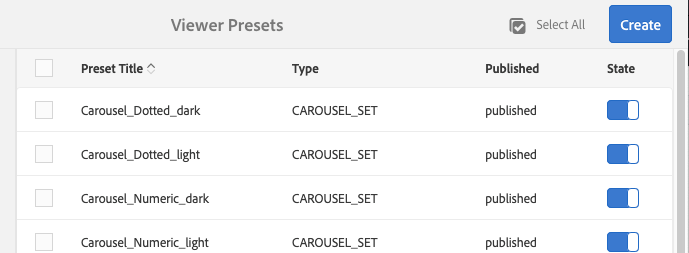

# Gestire i predefiniti per visualizzatori{#managing-viewer-presets}

Un predefinito per visualizzatori è una raccolta di impostazioni che determinano il modo in cui gli utenti visualizzano le risorse multimediali sullo schermo del computer e sui dispositivi mobili. Gli amministratori possono creare i predefiniti visualizzatore. Le impostazioni sono disponibili per una serie di opzioni di configurazione del visualizzatore. Ad esempio, puoi modificare le dimensioni di visualizzazione o il comportamento di zoom del visualizzatore.

<!-- OBSOLETE SDK withdrawn from public view. Available internally only at `http://staging.scene7.com/s7sdk/3.8/docs/jsdoc/symbols/_s7sdk.html` 

For instructions on creating and customizing your own HTML5 viewer presets, see the *Adobe Scene7 HTML5 Viewer SDK*. The SDK is available on the IS publish server embedded in the SDK itself. Each library version has its own SDK documentation included.

Path: `<scene7_domain>/s7sdk/<library_version>/docs/jsdocs/index.html`.
For example, 3.5 SDK: [https://s7d1.scene7.com/s7sdk/3.5/docs/jsdoc/index.html](https://s7d1.scene7.com/s7sdk/3.5/docs/jsdoc/index.html)

-->

Vedi anche [Guida di riferimento per i visualizzatori Dynamic Media](https://experienceleague.adobe.com/docs/dynamic-media-developer-resources.html).

Questa sezione descrive come creare, modificare e gestire i predefiniti per visualizzatori. Puoi applicare un predefinito visualizzatore a una risorsa ogni volta che la visualizzi in anteprima. Vedi [Applica predefiniti visualizzatore](#applying-a-viewer-preset-to-an-asset).

>[!NOTE]
>
>Modifica di qualsiasi *predefiniti per visualizzatori pronti all’uso* non è uno scenario supportato. Se tenti di modificare un predefinito visualizzatore predefinito, ti viene richiesto di salvare il predefinito visualizzatore con un nuovo nome.

## Accessibilità della tastiera per i visualizzatori {#keyboard-accessibility-for-viewers}

Tutti i visualizzatori predefiniti supportano l’accessibilità da tastiera.

Vedi anche [Accesso facilitato alla tastiera e navigazione](https://experienceleague.adobe.com/docs/dynamic-media-developer-resources/library/c-keyboard-accessibility.html).

## Gestire i predefiniti per visualizzatori {#managing-viewer-presets-1}

Per aggiungere, modificare, eliminare, pubblicare, annullare la pubblicazione e visualizzare in anteprima i predefiniti visualizzatore in Adobe Experience Manager, vai a **[!UICONTROL Strumenti]** (icona a forma di martello) > **[!UICONTROL Risorse] > [!UICONTROL Predefiniti visualizzatore]**.

>[!NOTE]
>
>Per impostazione predefinita, quando selezioni Visualizzatori nella vista Dettaglio di una risorsa, il sistema mostra 15 predefiniti visualizzatore. Puoi aumentare questo limite. Vedi [Aumenta il numero di predefiniti visualizzatore da visualizzare](#increasing-the-number-of-viewer-presets-that-display).

### Supporto visualizzatore per pagine web reattive {#viewer-support-for-responsive-designed-web-pages}

Pagine web diverse hanno esigenze diverse. Ad esempio, a volte si desidera una pagina web che fornisca un collegamento che apra il visualizzatore HTML5 in una finestra separata del browser. In altri casi, è necessario incorporare il visualizzatore HTML5 direttamente nella pagina di hosting. In quest&#39;ultimo caso, la pagina web ha un layout statico. Oppure, è &quot;reattivo&quot; e viene visualizzato in modo diverso su diversi dispositivi o per diverse dimensioni della finestra del browser. Per soddisfare queste esigenze, tutti i visualizzatori HTML5 predefiniti forniti con Dynamic Media supportano sia pagine web statiche che pagine web reattive.

Vedi [Libreria di immagini statiche reattive](https://experienceleague.adobe.com/docs/dynamic-media-developer-resources/image-serving-api/image-serving-api/responsive-static-image-library/c-about-responsive-static-image-library.html#about-responsive-image-library) in *Guida API di Dynamic Media Image Serving e Rendering* per ulteriori informazioni su come incorporare visualizzatori reattivi nelle pagine web.

>[!NOTE]
>
>Pubblica tutti i visualizzatori predefiniti prima di utilizzarli per i primi.
>Vedi [Pubblicare i predefiniti per visualizzatori](#publishing-viewer-presets).

### Compatibilità del sistema con i predefiniti per visualizzatori  {#viewer-preset-system-compatibility}

Tutti i predefiniti visualizzatore forniti con Dynamic Media sono completamente compatibili con i seguenti sistemi:

* Desktop
* Apple iPhone
* Apple iPad
* Smartphone Android™
* Tablet Android™

<!-- OUTDATED 2/25/22 * For video, extra support for MP4 playback is provided for [BlackBerry&reg;](https://developer.blackberry.com/devzone/develop/supported_media/bb_media_support_at_a_glance.html#kba1328730952678) and [Windows&reg; Phone](https://docs.microsoft.com/en-us/windows/uwp/audio-video-camera/supported-codecs). -->

### Tipi di contenuti multimediali per predefiniti visualizzatore {#rich-media-types-for-viewer-presets}

Gli amministratori possono aggiungere e personalizzare i seguenti tipi di contenuti multimediali durante la creazione di predefiniti per visualizzatori.

<table>
 <tbody>
  <tr>
   <td><strong>Set carosello</strong>  </td>
   <td>
I punti attivi, le mappe immagine o entrambi vengono aggiunti a una serie di due o più immagini. Un cliente può scorrere le immagini a sinistra o a destra e quindi selezionare un punto attivo su un'immagine per ulteriori dettagli o per l'acquisto diretto dalle pagine di destinazione, categoria o home di un sito web.
 </td>
  </tr>
    <tr>
   <td><strong>Dimensionale</strong>  </td>
   <td>
Consente di visualizzare scene 3D che consentono di girare, scorrere, ingrandire o reinserire la fotocamera.
 </td>
  </tr>
  <tr>
   <td><strong>Zoom a comparsa</strong></td>
   <td>
Visualizza una seconda immagine dell'area ingrandita accanto all'immagine originale. Nessun controllo da utilizzare: gli utenti spostano la selezione sull’area da visualizzare.
 
Nel determinare l’utilizzo completo della larghezza di banda per questo visualizzatore, considera che sia l’immagine principale che l’immagine a comparsa siano servite nel visualizzatore. Le dimensioni dell’immagine principale (larghezza e altezza dello stage) e il fattore di zoom determinano le dimensioni dell’immagine a comparsa. Per evitare che la dimensione del file a comparsa diventi troppo grande, bilanciare i due valori seguenti: in caso di dimensioni dell'immagine principale grandi, abbassare il valore del fattore di zoom. (La larghezza a comparsa e l’altezza a comparsa determinano le dimensioni della finestra a comparsa, ma non le dimensioni dell’immagine a comparsa fornita nel visualizzatore.)
 
Ad esempio, se la dimensione dell’immagine principale è di 350 x 350 pixel con un fattore di zoom di 3, l’immagine a comparsa risultante sarà di 1050 x 1050 pixel. Se le dimensioni dell'immagine principale sono 300 x 300 pixel, con un fattore di zoom di 4, l'immagine a comparsa è 1200 x 1200 pixel. A seconda dell’impostazione della qualità JPEG (le impostazioni consigliate sono comprese tra 80 e 90), è possibile ridurre notevolmente la dimensione del file. I fattori di zoom consigliati sono da 2,5 a 4, a seconda delle dimensioni dell'immagine principale.
 </td>
  </tr>
  <tr>
   <td><strong>Zoom in linea</strong></td>
   <td>Visualizza un'immagine dell'area ingrandita all'interno del visualizzatore originale. Nessun controllo da utilizzare. In altre parole, gli utenti spostano la selezione sull’area da visualizzare.</td>
  </tr>
  <tr>
   <td><strong>Set immagini</strong></td>
   <td>Nel visualizzatore per set di immagini, gli utenti possono vedere diverse viste o varianti di colore di un elemento selezionando una miniatura. Questo visualizzatore offre anche strumenti di zoom per esaminare attentamente le immagini.</td>
  </tr>
  <tr>
   <td><strong>Immagine interattiva</strong></td>
   <td>Gli hotspot vengono aggiunti alle parti di un'immagine che un cliente può quindi selezionare per ulteriori dettagli o per l'acquisto diretto dalle pagine di destinazione, categoria o home di un sito web.</td>
  </tr>
  <tr>
   <td><strong>Video interattivo</strong></td>
   <td>Le miniature vengono aggiunte ai segmenti della timeline di un video che un cliente può quindi selezionare per ulteriori dettagli o per l’acquisto diretto dalle pagine di destinazione, categoria o home di un sito web.</td>
  </tr>
  <tr>
   <td><strong>File multimediali diversi</strong></td>
   <td>Visualizza diversi tipi di contenuti multimediali in un visualizzatore. Puoi includere set 360 gradi, set di immagini, immagini e video.</td>
  </tr>
  <tr>
   <td><strong>Immagine panoramica</strong></td>
   <td>
I visualizzatori Panoramic Image (Immagine panoramica) e Panoramic VR (VR panoramico) consentono di riprodurre immagini panoramiche sferiche per immergere gli utenti in un'esperienza di visualizzazione a 360° di una stanza, di una proprietà, di una posizione o di un paesaggio.
 
Affinché un'immagine caricata possa essere definita come panorama sferico, deve avere uno o entrambi i seguenti elementi:

    <ul>
     <li>Rapporto di formato 2:1.</li>
     <li>Etichettate con le parole chiave <code>equirectangular</code>oppure <code>spherical</code> e <code>panorama</code>oppure <code>spherical </code>e <code>panoramic</code>. Vedi <a href="/help/sites-cloud/authoring/features/tags.md">Utilizzo dei tag</a>.</li>
    </ul> 
Sia le proporzioni che i criteri delle parole chiave si applicano alle risorse panoramiche della pagina dei dettagli delle risorse che il componente WCM "Elemento multimediale panoramico".
</td>
  </tr>
    <tr>
   <td><strong>Ritaglio video automatico</strong>  </td>
   <td>
Utilizza questo visualizzatore per rilevare e ritagliare automaticamente il punto focale in qualsiasi video.
 </td>
  </tr>
  <tr>
   <td><strong>Set 360 gradi</strong></td>
   <td>Fornisce diverse viste di un'immagine in modo che gli utenti possano ruotare l'oggetto per esaminare i diversi lati e angoli.</td>
  </tr>
  <tr>
   <td><strong>Video a 360°</strong></td>
   <td>
Utilizza il visualizzatore video 360/VR per riprodurre video equirettangolari per un’esperienza di visualizzazione immersiva di una stanza, una proprietà, un luogo, un paesaggio o una procedura medica.
 
Durante la riproduzione su un display piatto, l'utente ha il controllo dell'angolo di visualizzazione. La riproduzione su dispositivi mobili utilizza i controlli giroscopici incorporati.
 
Il visualizzatore include il supporto nativo per la distribuzione di 360 risorse video. Per impostazione predefinita, non è necessaria alcuna configurazione aggiuntiva per la visualizzazione o la riproduzione. È possibile distribuire video 360 utilizzando estensioni video standard come .mp4, .mkv e .mov. Il codec più comune è H.264.
 </td>
  </tr>
  <tr>
   <td><strong>Video</strong></td>
   <td>
Riproduce video utilizzando lo streaming a bit rate progressivo o adattivo. Lo streaming a bit rate adattivo esegue automaticamente il rilevamento del dispositivo e della larghezza di banda per fornire la qualità video corretta nel formato giusto.
 </td>
  </tr>
  <tr>
   <td><strong>Zoom verticale</strong></td>
   <td>
Il visualizzatore Zoom verticale consente di massimizzare l’esperienza di visualizzazione delle immagini di un prodotto per offrire agli utenti la migliore rappresentazione di un prodotto. La posizione verticale dei campioni effettua le seguenti operazioni:

    <ul>
     <li>Garantisce che i campioni siano "al di sopra della piega".  Con i campioni orizzontali, a seconda delle dimensioni dello schermo del desktop dell’utente, i campioni non sono visibili finché l’utente non scorre la pagina verso il basso. Posizionando i campioni in verticale nel visualizzatore, questi saranno visibili indipendentemente dalle dimensioni dello schermo dell’utente.</li>
     <li>Massimizza le dimensioni dell'immagine principale.  Con i campioni orizzontali, è necessario riservare spazio sulla pagina per garantirne la visibilità. Questo posizionamento ha ridotto le dimensioni dell'immagine principale. Con un layout di campioni verticali, tuttavia, non è necessario allocare questo spazio. È quindi possibile massimizzare le dimensioni dell'immagine principale.</li>
    </ul> </td>
  </tr>
  <tr>
   <td><strong>Zoom</strong></td>
   <td>Consente agli utenti di ingrandire l’area selezionandola. Gli utenti possono selezionare i controlli per ingrandire, ridurre e ripristinare le dimensioni predefinite dell'immagine.</td>
  </tr>
 </tbody>
</table>

### Elenco dei predefiniti per visualizzatori predefiniti {#list-of-out-of-the-box-viewer-presets}

La tabella seguente identifica tutti i predefiniti visualizzatore predefiniti forniti con Dynamic Media.

Vedi anche [Demo live](https://landing.adobe.com/en/na/dynamic-media/ctir-2755/live-demos.html).

Per informazioni sulle versioni supportate del browser web e del sistema operativo per i visualizzatori, consulta le Note sulla versione dei visualizzatori.

Consulta &quot;Note sulla versione dei visualizzatori&quot; nel sommario [Guida di riferimento visualizzatori](https://experienceleague.adobe.com/docs/dynamic-media-developer-resources.html).

>[!NOTE]
>
>Tutti i predefiniti visualizzatore predefiniti in Dynamic Media vengono attivati (on), ma è necessario pubblicarli.
>Vedi [Pubblicare i predefiniti visualizzatore](#publishing-viewer-presets).
>
>Eventuali nuovi predefiniti visualizzatore creati e aggiunti devono essere attivati sia *che *pubblicati.
>Vedi [Attivare o disattivare i predefiniti visualizzatore](#activating-or-deactivating-viewer-presets) e [Pubblicazione dei predefiniti per visualizzatori](#publishing-viewer-presets).

<table>
 <tbody>
  <tr>
   <td><strong>Titolo predefinito visualizzatore</strong></td>
   <td><strong>Tipo</strong></td>
   <td><strong>Nome file CSS</strong>  </td>
  </tr>
  <tr>
   <td>Carosello_Punteggiato_scuro</td>
   <td>Set_carosello</td>
   <td><code>html5_carouselviewer_dotted_dark.css</code></td>
  </tr>
  <tr>
   <td>Carosello_Punteggiato_light</td>
   <td>Set_carosello</td>
   <td><code>html5_carouselviewer_dotted_light.css</code></td>
  </tr>
  <tr>
   <td>Carousel_Numeric_dark</td>
   <td>Set_carosello</td>
   <td><code>html5_carouselviewer_numeric_dark.css</code></td>
  </tr>
  <tr>
   <td>Carousel_Numeric_light</td>
   <td>Set_carosello</td>
   <td><code>html5_carouselviewer_numeric_light.css</code></td>
  </tr>
  <tr>
   <td>A comparsa</td>
   <td>Zoom_A_comparsa</td>
   <td><code>html5_flyoutviewer.css</code></td>
  </tr>
  <tr>
   <td>ImageSet_dark</td>
   <td>Set immagini</td>
   <td><code>html5_zoomviewer_dark.css</code></td>
  </tr>
  <tr>
   <td>ImageSet_light</td>
   <td>Set immagini</td>
   <td><code>html5_zoomviewer_light.css</code></td>
  </tr>
  <tr>
   <td>InlineMixedMedia_dark</td>
   <td>File multimediali diversi</td>
   <td><code>html5_inlinemixedmediaviewer_dark.css</code></td>
  </tr>
  <tr>
   <td>InlineMixedMedia_light</td>
   <td>File multimediali diversi</td>
   <td><code>html5_inlinemixedmediaviewer_light.css</code></td>
  </tr>
  <tr>
   <td>InlineZoom</td>
   <td>Zoom_A_comparsa</td>
   <td><code>html5_inlinezoomviewer.css</code></td>
  </tr>
  <tr>
   <td>MixedMedia_dark</td>
   <td>File multimediali diversi</td>
   <td><code>html5_mixedmediaviewer_dark.css</code></td>
  </tr>
  <tr>
   <td>MixedMedia_light</td>
   <td>File multimediali diversi</td>
   <td><code>html5_mixedmediaviewer_light.css</code></td>
  </tr>
  <tr>
   <td>Immagine panoramica</td>
   <td>Panoramic_Image</td>
   <td><code>html5_panoramicimage.css</code></td>
  </tr>
  <tr>
   <td>PanoramicImageVR</td>
   <td>Panoramic_Image</td>
   <td><code>html5_panoramicimage.css</code></td>
  </tr>
  <tr>
   <td>Banner_Shoppable</td>
   <td>Immagine interattiva</td>
   <td><code>html5_interactiveimage.css</code></td>
  </tr>
  <tr>
   <td>Shoppable_Video_dark</td>
   <td>Video interattivo</td>
   <td><code>html5_interactivevideoviewer_dark.css</code></td>
  </tr>
  <tr>
   <td>Shoppable_Video_light</td>
   <td>Video interattivo</td>
   <td><code>html5_interactivevideovewer_light.css</code></td>
  </tr>
  <tr>
   <td>SpinSet_dark</td>
   <td>Set_Spin</td>
   <td><code>html5_spinviewer_dark.css</code></td>
  </tr>
  <tr>
   <td>SpinSet_light</td>
   <td>Set_Spin</td>
   <td><code>html5_spinviewer_light.css</code></td>
  </tr>
  <tr>
   <td>
Video
 
(include il supporto per sottotitoli codificati)
 </td>
   <td>Video</td>
   <td><code>html5_videoviewer.css</code></td>
  </tr>
  <tr>
   <td>
Video360_social
 
(Comprende i controlli di riproduzione video di base, il rendering video viene eseguito in modalità stereo, il controllo manuale del punto di vista è disattivato ma il controllo giroscopico è attivato e nessuna funzione di social media)
 </td>
   <td>Video_360</td>
   <td><code>html5_video360viewersocial.css</code></td>
  </tr>
  <tr>
   <td>
Video360VR
 
(Progettato per gli utenti finali che utilizzano occhiali di realtà virtuale. Include controlli di base sulla riproduzione video e funzioni di social media)
 </td>
   <td>Video_360</td>
   <td><code>html5_video360viewer.css</code></td>
  </tr>
  <tr>
   <td>
Video_social
 
(include il supporto per sottotitoli codificati e social media)
 </td>
   <td>Video</td>
   <td><code>html5_videoviewersocial.css</code></td>
  </tr>
  <tr>
   <td>Zoom_scuro  </td>
   <td>Zoom  </td>
   <td><code>html5_basiczoomviewer_dark.css</code></td>
  </tr>
  <tr>
   <td>Zoom_light  </td>
   <td>Zoom</td>
   <td><code>html5_basiczoomviewer_light.css</code></td>
  </tr>
  <tr>
   <td>ZoomVerticale_scura  </td>
   <td>Zoom_verticale</td>
   <td><code>html5_zoomverticalviewer_dark.css</code></td>
  </tr>
  <tr>
   <td>Zoom_Verticale</td>
   <td>Zoom_verticale</td>
   <td><code>html5_zoomverticalviewer_light.css</code></td>
  </tr>
 </tbody>
</table>

### Matrice di gesti dei visualizzatori per dispositivi mobili supportati {#supported-mobile-viewers-gestures-matrix}

La tabella seguente identifica i movimenti dei visualizzatori mobili supportati sui dispositivi iOS, Android™ 2.x e Android™ 3.x.

<table>
 <tbody>
  <tr>
   <td><strong>Gesto</strong></td>
   <td><strong>Zoom a comparsa</strong></td>
   <td><strong>Zoom</strong></td>
   <td><strong>Set 360 gradi</strong></td>
  </tr>
  <tr>
   <td>
<strong>Trascina</strong>
 </td>
   <td>
Pannelli
 </td>
   <td>
Pannelli
 </td>
   <td>
Pannelli
 </td>
  </tr>
  <tr>
   <td>
<strong>Toccare</strong>
 </td>
   <td>
Mostra la finestra a comparsa
 </td>
   <td>
Mostra o nasconde l’interfaccia utente
 </td>
   <td>
Mostra o nasconde l’interfaccia utente
 </td>
  </tr>
  <tr>
   <td>
<strong>Doppio tocco</strong>
 </td>
   <td>
Non applicabile
 </td>
   <td>
Ingrandisce o reimposta
 </td>
   <td>
Ingrandisce o reimposta
 </td>
  </tr>
  <tr>
   <td>
<strong>Apri il pizzico</strong>
 </td>
   <td>
Non applicabile
 </td>
   <td>
Ingrandisce (solo iOS e Android™ 3x)
 </td>
   <td>
Ingrandisce (solo iOS e Android™ 3x)
 </td>
  </tr>
  <tr>
   <td>
<strong>Chiudi</strong>
 </td>
   <td>
Non applicabile
 </td>
   <td>
Esegue lo zoom indietro (solo iOS e Android™ 3x)
 </td>
   <td>
Esegue lo zoom indietro (solo iOS e Android™ 3x)
 </td>
  </tr>
  <tr>
   <td>
<strong>Passaggio del dito</strong>
 </td>
   <td>
Barra dei campioni a scorrimento
 </td>
   <td>
Scorre le immagini
 </td>
   <td>
Giri
 </td>
  </tr>
  <tr>
   <td>
<strong>Flick</strong>
 </td>
   <td>
Barra dei campioni a scorrimento
 </td>
   <td>
Scorre le immagini
 </td>
   <td>
Giri
 </td>
  </tr>
 </tbody>
</table>

## Aumenta il numero di predefiniti visualizzatore visualizzati {#increasing-the-number-of-viewer-presets-that-display}

Experience Manager mostra un’ampia varietà di predefiniti visualizzatore quando visualizzi le risorse da **[!UICONTROL Vista dettagli]** > **[!UICONTROL Visualizzatori]**. È possibile aumentare o diminuire il numero di visualizzatori visualizzati.

**Per aumentare il numero di predefiniti visualizzatore visualizzati:**

1. Passa a CRXDE Lite ([https://localhost:4502/crx/de](https://localhost:4502/crx/de)).
1. Passa al nodo di elenco dei predefiniti visualizzatore in `/libs/dam/gui/coral/content/commons/sidepanels/viewerpresets/viewerpresetslist`

   

1. Nella proprietà **[!UICONTROL limit]**, modifica **[!UICONTROL Valore]**, che corrisponde a 15 per impostazione predefinita, inserendo un numero a piacere.
1. Passa alla sorgente dati predefinita visualizzatore in `/libs/dam/gui/coral/content/commons/sidepanels/viewerpresets/viewerpresetslist/datasource`

   

1. Nella proprietà limit , modifica il numero in base al numero desiderato, ad esempio `{empty requestPathInfo.selectors[1] ? "20" : requestPathInfo.selectors[1]}`
1. Seleziona **[!UICONTROL Salva tutto]**.

## Creare predefiniti per visualizzatori {#creating-a-new-viewer-preset}

La creazione di predefiniti per visualizzatori consente di applicare diverse impostazioni per visualizzare e interagire con le risorse. Tuttavia, non è necessario creare predefiniti per visualizzatori. Se lo preferisci, puoi utilizzare i predefiniti predefiniti per visualizzatori già forniti con Experience Manager Assets.

Se scegli di creare un predefinito visualizzatore, dopo averlo salvato lo stato del visualizzatore viene attivato automaticamente (impostato su **[!UICONTROL On]**) nella pagina Predefiniti visualizzatore . Questo stato significa che è visibile nel componente Dynamic Media e nel componente File multimediali interattivi e ogni volta che si visualizza l’anteprima di un’immagine o di un video.

Alcuni predefiniti per visualizzatori hanno impostazioni esclusive che possono influenzare l’uso e il comportamento generale del visualizzatore. A seconda del predefinito per visualizzatori creato, è importante tenere presente queste considerazioni speciali.

Vedi [Considerazioni speciali per la creazione di un predefinito visualizzatore interattivo](#special-considerations-for-creating-an-interactive-viewer-preset).

Vedi [Considerazioni speciali per la creazione di un predefinito visualizzatore banner carosello](#special-considerations-for-creating-a-carousel-banner-viewer-preset).

**Per creare i predefiniti visualizzatore:**

1. Nell’angolo in alto a sinistra dell’Experience Manager, seleziona il logo dell’Experience Manager, quindi nella barra a sinistra vai a **[!UICONTROL Strumenti]** (icona a forma di martello) > **[!UICONTROL Risorse]** > **[!UICONTROL Predefiniti visualizzatore]**.

   

1. Nella pagina Predefiniti visualizzatore, seleziona nella barra degli strumenti **[!UICONTROL Crea]**.
1. In **[!UICONTROL Nuovo predefinito per visualizzatori]** nella finestra di dialogo **[!UICONTROL Nome predefinito]** immetti il nome del nuovo predefinito. Scegli attentamente un nome, che non potrà essere modificato dopo aver selezionato **[!UICONTROL Crea]**.

   Quando salvi il predefinito in seguito in questi passaggi, il nome viene visualizzato nella pagina Predefiniti visualizzatore , sotto l’intestazione della colonna Titolo predefinito .

1. Seleziona il tipo di predefinito visualizzatore da creare dal menu a discesa Tipo di contenuti multimediali avanzati, quindi seleziona nell’angolo in alto a destra della pagina **[!UICONTROL Crea]**.

   Vedi [Tipi di contenuti multimediali avanzati per i predefiniti per visualizzatori](#rich-media-types-for-viewer-presets).

1. Nella pagina Editor predefiniti per visualizzatori , seleziona la **[!UICONTROL Aspetto]** scheda .
1. Effettua una delle operazioni seguenti:

   * In **[!UICONTROL Tipo selezionato]** dal menu a discesa, selezionate un componente di cui desiderate personalizzare la progettazione visiva. In alternativa, puoi selezionare qualsiasi elemento visivo nel visualizzatore per selezionarlo per la configurazione.

      L’editor visivo consente di vedere l’effetto di una determinata proprietà su uno stile. Imposta o regola qualsiasi proprietà per vedere immediatamente quale effetto ha sul visualizzatore utilizzando il campione a sinistra dell’editor.

      Le proprietà di stile CSS per ciascun tipo di predefinito visualizzatore sono descritte in &quot;Personalizzazione *`<viewer name>`* Argomento della Guida del visualizzatore in [Guida di riferimento visualizzatori](https://experienceleague.adobe.com/docs/dynamic-media-developer-resources.html). Ad esempio, se stai creando un predefinito visualizzatore del tipo `Mixed_Media`, vedi [Personalizzare il visualizzatore di file multimediali diversi](https://experienceleague.adobe.com/docs/dynamic-media-developer-resources/library/viewers-aem-assets-dmc/mixed-media/customing-mixed-media/c-html5-mixedmedia-viewer-customizingviewer.html) per un elenco e una descrizione di ciascuna proprietà.

   * Se hai definito le impostazioni di stile in un file CSS separato, puoi caricarlo in Experience Manager Assets. Per trovare il file CSS caricato e associarlo al predefinito visualizzatore, seleziona **[!UICONTROL Importa CSS]** sotto **[!UICONTROL Tipo selezionato]** menu a discesa (se necessario, scorri l’editor visivo verso l’alto per visualizzarlo).

      Quando importi un file CSS, l’editor visivo controlla se il CSS utilizza gli indicatori di visualizzatore corretti. Ad esempio, se crei un visualizzatore zoom, tutte le regole CSS importate devono essere definite utilizzando il nome della classe del visualizzatore corrispondente `.s7mixedmediaviewer` definito su un elemento visualizzatore principale.

      È possibile importare CSS arbitrari creati a mano, purché definiscano correttamente i marcatori CSS per un determinato visualizzatore. (I marcatori CSS sono descritti in qualsiasi &quot;Personalizzazione *&lt;viewer name=&quot;&quot;>* Argomento della Guida del visualizzatore in [Guida di riferimento visualizzatori](https://experienceleague.adobe.com/docs/dynamic-media-developer-resources.html). Ad esempio, per informazioni sui marcatori CSS per il visualizzatore zoom, consulta [Personalizzazione del visualizzatore zoom](https://experienceleague.adobe.com/docs/dynamic-media-developer-resources/library/viewers-aem-assets-dmc/zoom/customizing-zoom/c-html5-20-zoom-viewer-customizingviewer.html).) È tuttavia possibile che l’editor visivo non comprenda alcuni valori CSS. In questi casi, l’editor visivo tenta di ignorare gli errori in modo che il CSS possa ancora funzionare.
   >[!NOTE]
   >
   >Se preferisci modificare il CSS direttamente nel relativo modulo non elaborato, seleziona **[!UICONTROL Mostra/Nascondi CSS]** dal menu a discesa Tipo selezionato (se necessario, scorri l’editor visivo verso l’alto per visualizzarlo).
   >Come l’editor visivo, quando modifichi una proprietà direttamente nel CSS, puoi vedere istantaneamente quale effetto ha sull’esempio del visualizzatore. Inoltre, la stessa proprietà viene aggiornata automaticamente nello stesso momento nell’editor visivo. Puoi quindi utilizzare l’editor CSS non elaborato o l’editor visivo oppure entrambi in modo intercambiabile.

   >[!NOTE]
   >
   >Per l&#39;immagine pulsante, scegli l&#39;immagine 2x e carica opere d&#39;arte ad alta risoluzione. Quando si lavora con immagini interattive e banner shoppable, è anche possibile selezionare tra vari pulsanti pronti all’uso.

1. (Facoltativo) Nella parte superiore della pagina Modifica predefinito visualizzatore, seleziona **[!UICONTROL Desktop]**, **[!UICONTROL Tablet]** oppure **[!UICONTROL Telefono]** per definire in modo univoco gli stili visivi per dispositivi e tipi di schermo diversi.
1. Nella pagina Editor predefiniti per visualizzatori , seleziona la **[!UICONTROL Comportamento]** scheda . In alternativa, puoi selezionare qualsiasi elemento visivo nel visualizzatore per selezionarlo per la configurazione.
Ad esempio, per *VideoPlayer* tipo, sotto **[!UICONTROL Modificatori]** > **[!UICONTROL Riproduzione]**, puoi scegliere tra una delle tre opzioni di streaming adattivo:

   * **[!UICONTROL sciocco]** - I video vengono trasmessi solo come trattino.
   * **[!UICONTROL hls]** - I video vengono trasmessi solo come hls.
   * **[!UICONTROL auto]** - Best practice. La creazione di flussi DASH e HLS è ottimizzata per lo storage. Pertanto, l’Adobe consiglia di selezionare sempre **[!UICONTROL auto]** come tipo di riproduzione. I video vengono trasmessi come trattini, hls o progressivi, come illustrato di seguito:
      * Se il browser supporta DASH, viene prima utilizzato lo streaming DASH.
      * Se il browser non supporta DASH, viene utilizzato lo streaming HLS, secondo.
      * Se il browser non supporta DASH o HLS, si utilizza infine la riproduzione progressiva.

   >[!NOTE]
   >
   >Per visualizzare e utilizzare il **[!UICONTROL sciocco]** deve prima essere attivato dal supporto tecnico Adobe sul tuo account. Vedi [Abilita DASH sul tuo account](/help/assets/dynamic-media/video.md#enable-dash).

1. Dal menu a discesa **[!UICONTROL Tipo selezionato]**, scegli un componente di cui vuoi modificare i comportamenti.

   A molti componenti nell’editor visivo è associata una descrizione dettagliata. Queste descrizioni vengono visualizzate in caselle blu quando espandi un componente per visualizzarne i parametri associati.

   Alcuni tipi di Visualizzatore dispongono di componenti che consentono di specificare i comandi Image Server in un campo di testo **[!UICONTROL Comando IS]**. Per un elenco dei comandi utilizzabili, consulta la sezione [Riferimento API di Server immagini](https://experienceleague.adobe.com/docs/dynamic-media-developer-resources/image-serving-api/image-serving-api/c-is-home.html).

   >[!NOTE]
   >
   >**Se utilizzi un dispositivo touch, ad esempio un telefono o un tablet...**
   >
   >
   >Dopo aver digitato un valore nel campo di testo, selezionare un&#39;altra opzione nell&#39;interfaccia utente per inviare la modifica e chiudere la tastiera virtuale. Se si seleziona **[!UICONTROL Invio]**, non si verifica alcuna azione.

1. Nell’angolo in alto a destra della pagina, seleziona **[!UICONTROL Salva]**.
1. Pubblica il nuovo predefinito per visualizzatori. È necessario pubblicare il predefinito in modo da poter utilizzare il suo URL risultante sul tuo sito web.

   Vedi [Pubblicazione dei predefiniti per visualizzatori](#publishing-viewer-presets).

   >[!IMPORTANT]
   >
   >Per i vecchi video che utilizzano un profilo di streaming adattivo, l’URL continua a essere riprodotto come al solito, con streaming HLS, fino a quando non si [rielaborare le risorse video](/help/assets/dynamic-media/about-image-video-profiles.md#reprocessing-assets). Dopo la rielaborazione, lo stesso URL continuerà a funzionare ma ora con *entrambi* Streaming DASH e HLS abilitato.

### Considerazioni speciali per la creazione di un predefinito visualizzatore interattivo {#special-considerations-for-creating-an-interactive-viewer-preset}

**Modalità di visualizzazione per le miniature delle immagini nel pannello:**

Quando crei o modifichi un predefinito visualizzatore video interattivo, puoi scegliere l’impostazione della modalità di visualizzazione da utilizzare. Questa scelta si verifica quando si seleziona `InteractiveSwatches` dal **[!UICONTROL Componente selezionato]** menu a discesa sotto la **[!UICONTROL Comportamento]** scheda . La modalità di visualizzazione selezionata influisce su come e quando vengono visualizzate le miniature durante la riproduzione del video. Puoi scegliere la Modalità di visualizzazione `segment` (predefinita) o `continuous`.

<table>
 <tbody>
  <tr>
   <td><strong>Modalità di visualizzazione</strong></td>
   <td><strong>Descrizione</strong></td>
  </tr>
  <tr>
   <td>Segmento</td>
   <td>
<code>Segment </code>è la modalità di visualizzazione predefinita per i predefiniti visualizzatore video interattivo pronti all’uso <code>Shoppable_Video_light</code> e <code>Shoppable_Video_dark</code> e tutti i predefiniti per visualizzatori video interattivi creati dall’utente.
 
In questa modalità, supponiamo che a un segmento video siano assegnate meno miniature del numero di punti visibili nel pannello di visualizzazione. In questi casi, le miniature dei sottosegmenti successivi o precedenti sono <i>not </i>estratto per riempire eventuali punti vuoti nel pannello. In altre parole, conserva la visualizzazione dei campioni assegnati al particolare segmento video.
 </td>
  </tr>
  <tr>
   <td>Continuo</td>
   <td>
In <code>continuous </code>supponiamo che il numero di miniature in un segmento sia inferiore al numero visibile nel pannello. In questi casi, il visualizzatore include automaticamente la visualizzazione delle miniature dal segmento successivo o dal segmento precedente, in cui viene visualizzata l’ultima miniatura.
 
La <a href="/help/assets/dynamic-media/interactive-videos.md">video in questo argomento</a> è un esempio di <code>continuous </code>modalità di visualizzazione.
 </td>
  </tr>
 </tbody>
</table>

**Informazioni sul comportamento di scorrimento automatico nel visualizzatore video interattivo:**

Il comportamento di scorrimento automatico delle miniature nel visualizzatore video interattivo funziona indipendentemente dalla modalità di visualizzazione scelta.

Quando crei o modifichi un predefinito visualizzatore video interattivo, puoi accedere a Scorrimento automatico dalla scheda Comportamento. Nella scheda Comportamento , dalla scheda **[!UICONTROL Componenti selezionati]** menu a discesa, seleziona **[!UICONTROL InteractiveSwatches]**. La casella di controllo Scorrimento automatico è elencata sotto il campo di testo Comando IS.

Se nel predefinito visualizzatore disattivi **[!UICONTROL Scorrimento automatico]** deselezionando la casella di controllo, durante la riproduzione del video da parte dell’utente il pannello visualizza solo la prima miniatura per l’intera durata del video. Tuttavia, un utente può scorrere manualmente le miniature utilizzando le icone di freccia su e giù, se necessario.

Durante la riproduzione del video, se hai abilitato tramite selezione l’opzione **[!UICONTROL Scorrimento automatico]** nel predefinito visualizzatore, le immagini in miniatura assegnate a un segmento video scorrono all’inizio di un segmento. Tuttavia, in alcuni casi, determinate miniature all’interno di un segmento vengono visualizzate con una durata raddoppiata rispetto alle altre miniature precedenti o successive. Questo comportamento si verifica perché il numero di miniature in un segmento è maggiore rispetto al numero visibile nel pannello e non è divisibile in modo uniforme.

Ad esempio, supponiamo di avere un segmento video di 30 secondi. E ci sono in totale nove miniature da visualizzare in 30 secondi. Il browser viene ridimensionato in modo tale che nel pannello di visualizzazione siano presenti quattro miniature visibili. Il segmento di tempo video di 30 secondi è suddiviso in tre sottosegmenti. La tabella seguente mostra il raggruppamento di cui vengono visualizzate le miniature per un determinato sottosegmento di tempo:

| **Sottosegmento video** | **Tempo del sottosegmento in secondi** | **Miniature visibili nel pannello** |
|---|---|---|
| 1 | 0-10 | 1, 2, 3, 4 |
| 2 | 10-20 | 4, 5, 6, 7 |
| 3 | 20-30 | 6, 7, 8, 9 |

Il sottosegmento video 3 non si estende oltre le miniature ad esso assegnate. Inoltre, le miniature 4, 6 e 7 sono visibili nel pannello con una durata doppia rispetto alle altre miniature.

La logica utilizzata dal visualizzatore per il numero di miniature visualizzate nel pannello in base al numero di posizioni disponibili è la seguente:

* Numero di sottosegmenti = da un sottosegmento all’altro (numero di miniature/numero di slot visibili nel pannello miniature, in base alle dimensioni della finestra del browser).
Utilizzando l&#39;esempio nella tabella precedente, 9 miniature / 4 slot = 2,25; la logica del visualizzatore la arrotonda a tre sottosegmenti.

* Numero di miniature = da arrotondare alla miniatura successiva (numero di miniature/numero di sottosegmenti video).
Utilizzando l’esempio nella tabella precedente, 9 miniature / 3 sottosegmenti video = 3 miniature.

* Durata del sottosegmento = durata video totale/numero di sottosegmenti video.
Utilizzando l’esempio nella tabella precedente, 30 secondi / 3 sottosegmenti video = 10 secondi di visualizzazione di ciascun sottosegmento video.

#### Considerazioni speciali per la creazione di predefiniti visualizzatore per banner carosello {#special-considerations-for-creating-a-carousel-banner-viewer-preset}

Quando si creano i predefiniti visualizzatore per banner carosello, è possibile accedere alle seguenti modifiche dello stile degli hotspot:

|  | **Descrizione** | **Azioni** |
|---|---|---|
| **[!UICONTROL Icona punto attivo]** | Modificare l’icona utilizzata per il punto attivo | Per modificare l’immagine dell’icona del punto attivo, nella **[!UICONTROL Aspetto]** scheda in **[!UICONTROL Componente selezionato]**, seleziona **[!UICONTROL ImageMapEffect]**. Seleziona **[!UICONTROL Sfondo]** alla voce **[!UICONTROL Icona]** e, nel campo **[!UICONTROL Immagine]**, individua l’immagine di sfondo desiderata. |

## Attivare o disattivare i predefiniti visualizzatore {#activating-or-deactivating-viewer-presets}

I predefiniti per visualizzatori disponibili nell’interfaccia utente dipendono da quelli attivi nella modalità Creazione. Per impostazione predefinita, dopo la creazione un predefinito visualizzatore è &quot;attivato&quot;. Se disattiva il predefinito, questo non verrà visualizzato in modalità Autore. Se il predefinito viene pubblicato, viene sempre pubblicato indipendentemente dal fatto che sia attivato o disattivato. Disattiva i predefiniti per visualizzatori se l’elenco diventa troppo ingombrante o se non desideri che un predefinito per visualizzatori sia disponibile per l’uso.

**Per attivare o disattivare i predefiniti visualizzatore:**

1. Nell’angolo in alto a sinistra dell’Experience Manager, seleziona il logo dell’Experience Manager, quindi seleziona nella barra a sinistra **[!UICONTROL Strumenti]** (icona a forma di martello) > **[!UICONTROL Risorse]** > **[!UICONTROL Predefiniti visualizzatore]**.
1. Nella pagina Predefinito visualizzatore , sotto la sezione **[!UICONTROL Stato]** intestazione di colonna, seleziona l’opzione per attivare o disattivare un predefinito visualizzatore.

   I predefiniti visualizzatore attivati presentano l’interruttore a destra, all’interno di una casella blu; i predefiniti visualizzatore disattivati presentano l’interruttore a sinistra, all’interno di una casella di colore grigio chiaro.

## Pubblicare i predefiniti visualizzatore {#publishing-viewer-presets}

Attivando (o attivando) lo stato di un predefinito visualizzatore significa che è visibile nel componente Dynamic Media, nel componente File multimediali interattivi e ogni volta che visualizzi una risorsa.

Tuttavia, *distribuire* una risorsa con un predefinito visualizzatore, deve essere pubblicata anche il predefinito visualizzatore . Tutti i predefiniti visualizzatore devono essere attivati *e* pubblicato per ottenere l’URL o il codice di incorporamento per una risorsa. Attiva e pubblica tutti i predefiniti visualizzatore forniti con Dynamic Media. I predefiniti visualizzatore personalizzati che crei e aggiungi vengono attivati automaticamente, ma devono anche essere pubblicati.

Vedi [Attivazione o disattivazione dei predefiniti per visualizzatori](#activating-or-deactivating-viewer-presets).

Vedi anche [Anteprima delle risorse](/help/assets/dynamic-media/previewing-assets.md).

**Per pubblicare i predefiniti visualizzatore:**

1. Nell’angolo in alto a sinistra dell’Experience Manager, seleziona il logo dell’Experience Manager, quindi seleziona nella barra a sinistra **[!UICONTROL Strumenti]** (icona a forma di martello) > **[!UICONTROL Risorse] > [!UICONTROL Predefiniti visualizzatore]**.
1. Seleziona uno o più predefiniti visualizzatore da pubblicare.
1. Nella barra degli strumenti, seleziona la **[!UICONTROL Pubblica]** icona.

## Ordinare i predefiniti visualizzatore {#sorting-viewer-presets}

1. Nell’angolo in alto a sinistra dell’Experience Manager, seleziona il logo dell’Experience Manager, quindi seleziona nella barra a sinistra **[!UICONTROL Strumenti]** (icona a forma di martello) > **[!UICONTROL Risorse] > [!UICONTROL Predefiniti visualizzatore]**.
1. Seleziona **[!UICONTROL Titolo predefinito]**, **[!UICONTROL Tipo]**, **[!UICONTROL Pubblicato]** oppure **[!UICONTROL Stato]** per ordinare in base all’intestazione della colonna. Ad esempio, seleziona **[!UICONTROL Tipo]**  per ordinare i tipi di predefiniti visualizzatore in ordine alfabetico o inverso.

## Modificare i predefiniti per visualizzatori {#editing-viewer-presets}

Modifica di qualsiasi *predefiniti per visualizzatori pronti all’uso* non è uno scenario supportato. Se modifichi un predefinito per visualizzatori preconfigurato, viene richiesto di salvarlo con un nuovo nome.

**Per modificare i predefiniti visualizzatore:**

1. Nell’angolo in alto a sinistra dell’Experience Manager, seleziona il logo dell’Experience Manager, quindi seleziona nella barra a sinistra **[!UICONTROL Strumenti]** (icona a forma di martello) > **[!UICONTROL Risorsa]** > **[!UICONTROL Predefiniti visualizzatore]**.
1. Seleziona un predefinito selezionando la casella a sinistra del titolo del predefinito visualizzatore.
1. Sulla barra degli strumenti, seleziona **[!UICONTROL Modifica]**.
1. Sulla **[!UICONTROL Editor predefiniti visualizzatore]** apporta le modifiche desiderate al predefinito visualizzatore, utilizzando le opzioni disponibili nella **[!UICONTROL Aspetto]** e **[!UICONTROL Comportamento]** schede.

   Da **[!UICONTROL Aspetto]** nell’angolo in alto a sinistra della pagina Editor predefiniti per visualizzatore, seleziona **[!UICONTROL Desktop]**, **[!UICONTROL Tablet]** oppure **[!UICONTROL Telefono]** per modificare la modalità di presentazione della risorsa.

1. Nell’angolo in alto a destra della pagina, effettuare una delle seguenti operazioni:

   * Seleziona **[!UICONTROL Salva]** per salvare le modifiche e tornare alla pagina Predefinito visualizzatore .
   * Seleziona **[!UICONTROL Annulla]** per evitare le modifiche apportate e tornare alla pagina Predefinito visualizzatore .

## Eliminare i predefiniti visualizzatore personalizzati {#deleting-custom-viewer-presets}

È possibile eliminare i predefiniti per visualizzatori creati e aggiunti a Dynamic Media.

**Per eliminare i predefiniti visualizzatore personalizzati:**

1. Nell’angolo in alto a sinistra dell’Experience Manager, seleziona il logo dell’Experience Manager, quindi seleziona nella barra a sinistra **[!UICONTROL Strumenti]** (icona a forma di martello) > **[!UICONTROL Risorse] > [!UICONTROL Predefiniti visualizzatore]**.
1. Nella pagina Predefiniti visualizzatore , seleziona un titolo predefinito e quindi seleziona la **[!UICONTROL Cestino]** icona.
1. Seleziona **[!UICONTROL Elimina]**.

## Applicare un predefinito visualizzatore a una risorsa {#applying-a-viewer-preset-to-an-asset}

Se hai già pubblicato sia la risorsa che il visualizzatore selezionato, dopo aver selezionato un predefinito visualizzatore vengono visualizzati i pulsanti **[!UICONTROL URL]** e **[!UICONTROL Incorpora]**.

**Per applicare un predefinito visualizzatore a una risorsa:**

1. Apri la risorsa e, vicino all’angolo in alto a sinistra della pagina, seleziona il menu a discesa, quindi seleziona **[!UICONTROL Visualizzatori]**.

   >[!NOTE]
   >
   >Se hai già pubblicato sia la risorsa che il visualizzatore selezionato, dopo aver selezionato un predefinito visualizzatore vengono visualizzati i pulsanti **[!UICONTROL URL]** e **[!UICONTROL Incorpora]**.

1. Per applicarlo alla risorsa, seleziona un predefinito visualizzatore dal riquadro a sinistra.

   È possibile [copia l’URL da condividere](/help/assets/dynamic-media/linking-urls-to-yourwebapplication.md) con altri utenti.

## Fornire le risorse con i predefiniti per visualizzatori {#delivering-assets-with-viewer-presets}

Per ottenere gli URL per i predefiniti per visualizzatori, vedi [Collegare gli URL all’applicazione Web](/help/assets/dynamic-media/linking-urls-to-yourwebapplication.md). Vedi anche [Incorporare il visualizzatore video in una pagina web](/help/assets/dynamic-media/embed-code.md).

Se utilizzi Experience Manager come WCM, puoi aggiungere risorse utilizzando i predefiniti visualizzatore direttamente nella pagina. Vedi [Aggiungere risorse Dynamic Media alle pagine](/help/assets/dynamic-media/adding-dynamic-media-assets-to-pages.md).
