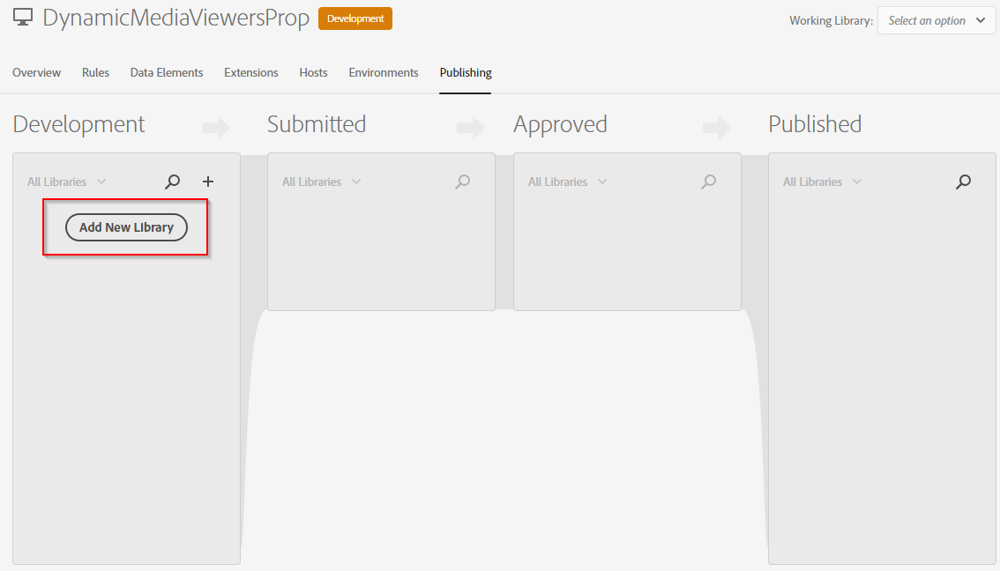

# Integrare i visualizzatori Dynamic Media con i tag Analytics e Adobe Experience Platform {#integrating-dynamic-media-viewers-with-adobe-analytics-and-adobe-launch}

## Cos’è l’integrazione dei visualizzatori Dynamic Media con Adobe Analytics e i tag Experience Platform? {#what-is-dynamic-media-viewers-integration-with-adobe-analytics-and-adobe-launch}

<!-- Leave this hidden path here; it points to the topic source from Sasha https://wiki.corp.adobe.com/pages/viewpage.action?spaceKey=~oufimtse&title=Dynamic+Media+Viewers+integration+with+Adobe+Launch 

name used to be Experience Platform Launch. Changed to Experience Platform Data Collection-->

*Visualizzatori Dynamic Media* L’estensione per Experienci Platform di Tag e visualizzatori Dynamic Media 5.13, consente ai clienti di Adobe Analytics e Experience Platform Tag di utilizzare eventi e dati specifici per visualizzatori Dynamic Media nella propria configurazione di Tag Experienci Platform.

Grazie a questa integrazione è possibile tenere traccia dell’utilizzo dei visualizzatori Dynamic Media sul sito web con Adobe Analytics. Allo stesso tempo, puoi utilizzare gli eventi e i dati esposti dai visualizzatori con qualsiasi altra estensione di Tag di Experience Platform che provenga da Adobe o da una terza parte.

Per ulteriori informazioni sulle estensioni Adobe o di terze parti, consulta [Estensioni di Adobe](https://experienceleague.adobe.com/docs/experience-platform/tags/extensions/overview.html) nella Guida utente dei tag di Experience Platform.

**Questo argomento è destinato a:** Amministratori di siti, sviluppatori nel programma Adobe Experience Manager e persone nelle operazioni.

### Limitazioni dell’integrazione {#limitations-of-the-integration}

* L’integrazione dei tag di Experience Platform per i visualizzatori Dynamic Media non funziona nel nodo dell’autore Experience Manager. Non puoi visualizzare alcun tracciamento da una pagina WCM finché non viene pubblicata.
* L’integrazione di tag di Experience Platform per i visualizzatori Dynamic Media non è supportata per la modalità operativa &quot;pop-up&quot;, in cui l’URL del visualizzatore viene ottenuto utilizzando il pulsante &quot;URL&quot; nella pagina Dettagli risorsa.
* Experience Platform L’integrazione dei tag non può essere utilizzata contemporaneamente con i visualizzatori legacy Integrazione di Analytics (tramite il `config2=` parametro ).
* Il supporto per il tracciamento video è limitato solo al tracciamento della riproduzione di base, come descritto in [Panoramica del tracciamento](https://experienceleague.adobe.com/docs/media-analytics/using/tracking/track-av-playback/track-core-overview.html?lang=en#player-events). In particolare, il monitoraggio di QoS, annunci, capitoli/segmenti o errori non è supportato.
* La configurazione della durata di archiviazione per gli elementi dati non è supportata per gli elementi dati che utilizzano *Visualizzatori Dynamic Media* estensione. La durata di archiviazione deve essere impostata su **[!UICONTROL Nessuno]**.

### Casi d’uso per l’integrazione {#use-cases-for-the-integration}

Il caso d’uso principale per l’integrazione con i tag Experience Platform è costituito dai clienti che utilizzano sia Experience Manager Assets che Experience Manager Sites. In tali scenari, puoi impostare un’integrazione standard tra il nodo di authoring dell’Experience Manager e i tag dell’Experience Platform, quindi associare l’istanza Sites alla proprietà dei tag dell’Experience Platform. Successivamente, qualsiasi componente WCM di Dynamic Media aggiunto a una pagina Sites terrà traccia dei dati e degli eventi provenienti dai visualizzatori.

Consulta [Tracciare i visualizzatori Dynamic Media in Experience Manager Sites](#tracking-dynamic-media-viewers-in-aem-sites).

Un caso d’uso secondario supportato dall’integrazione è quello dei clienti che utilizzano solo Experience Manager Assets o Dynamic Media Classic. In questi casi, ottieni il codice di incorporamento per il visualizzatore e lo aggiungi alla pagina del sito web. Quindi, ottieni l’URL di produzione della libreria di tag Experience Platform da Tag Experienci Platform e aggiungilo manualmente al codice della pagina web.

Consulta [Tracciare i visualizzatori Dynamic Media utilizzando il codice di incorporamento](#tracking-dynamic-media-viewers-using-embed-code).

## Funzionamento del tracciamento di dati ed eventi nell’integrazione {#how-data-and-event-tracking-works-in-the-integration}

L’integrazione sfrutta due tipi separati e indipendenti di tracciamento dei visualizzatori Dynamic Media: *Adobe Analytics* e *Adobe Analytics per audio e video*.

### Informazioni sul tracciamento con Adobe Analytics  {#about-tracking-using-adobe-analytics}

Adobe Analytics consente di tenere traccia delle azioni eseguite dall’utente finale quando interagiscono con i visualizzatori Dynamic Media sul sito web. Adobe Analytics consente inoltre di tenere traccia dei dati specifici del visualizzatore. Ad esempio, puoi tenere traccia e registrare gli eventi di caricamento della visualizzazione insieme al nome della risorsa, alle azioni di zoom che si sono verificate e alle azioni di riproduzione video.

In Experience Platform Tags, i concetti di *Elementi dati* e *Regole* collabora per abilitare il tracciamento di Adobe Analytics.

#### Informazioni sugli elementi dati nei tag di Experience Platform {#about-data-elements-in-adobe-launch}

Un elemento dati nei tag Experience Platform è una proprietà denominata il cui valore è definito in modo statico o calcolato in modo dinamico in base allo stato di una pagina web o dei dati dei visualizzatori Dynamic Media.

Le opzioni disponibili per la definizione di un elemento dati dipendono dall’elenco delle estensioni installate nella proprietà Experience Platform Tags. L’estensione &quot;Core&quot; è preinstallata ed è disponibile come strumento predefinito in qualsiasi configurazione. Questa estensione &quot;Core&quot; consente di definire un elemento dati il cui valore proviene da cookie, codice JavaScript, stringa di query e molte altre origini.

Per il tracciamento di Adobe Analytics, è necessario installare diverse altre estensioni, come descritto in [Installazione e configurazione delle estensioni](#installing-and-setup-of-extensions). L’estensione Dynamic Media Viewers consente di definire un elemento dati; tale valore è un argomento dell’evento Dynamic Viewer. Ad esempio, è possibile fare riferimento al tipo di visualizzatore o al nome della risorsa indicato dal visualizzatore al momento del caricamento, al livello di zoom indicato quando l’utente finale esegue lo zoom e molto altro.

L’estensione Dynamic Media Viewer mantiene automaticamente aggiornati i valori degli elementi dati.

Dopo averlo definito, un elemento dati può essere utilizzato in altre posizioni dell’interfaccia utente dei tag di Experience Platform, utilizzando il widget del selettore Elemento dati. In particolare, per gli elementi dati definiti ai fini del tracciamento dei visualizzatori Dynamic Media, si fa riferimento all’azione Imposta variabili dell’estensione Adobe Analytics nella regola (vedi di seguito).

Consulta [Elementi dati](https://experienceleague.adobe.com/docs/experience-platform/tags/ui/data-elements.html) nella Guida utente dei tag di Experience Platform.

#### Informazioni sulle regole nei tag Experience Platform {#about-rules-in-adobe-launch}

Una regola in Experience Platform Tags è una configurazione agnostica che definisce tre aree che compongono una regola: *Eventi*, *Condizioni*, e *Azioni*:

* *Eventi* (se) indica a Tag Experience Platform quando attivare una regola.
* *Condizioni* (se) indica all’Experience Platform Tag quali altre restrizioni consentire o non consentire all’attivazione di una regola.
* *Azioni* (then) indica all’Experience Platform Tag cosa fare quando viene attivata una regola.

Le opzioni disponibili nella sezione Eventi, Condizioni e Azioni dipendono dalle estensioni installate nella proprietà Experience Platform Tags. Il *Core* l’estensione è preinstallata ed è disponibile come strumento predefinito in qualsiasi configurazione. L’estensione fornisce diverse opzioni per Eventi, come azioni di base a livello di browser che includono modifiche dello stato attivo, pressioni di tasti e invio di moduli. Include inoltre opzioni per le Condizioni, come valore del cookie, tipo di browser e altro ancora. Per Azioni, è disponibile solo l’opzione Codice personalizzato.

Per il tracciamento di Adobe Analytics, è necessario installare diverse altre estensioni, come descritto in [Installazione e configurazione delle estensioni](#installing-and-setup-of-extensions). In particolare:

* L’estensione Dynamic Media Viewers estende l’elenco degli eventi supportati agli eventi specifici dei visualizzatori Dynamic Media, come il caricamento del visualizzatore, lo scambio di risorse, lo zoom in e la riproduzione video.
* L’estensione Adobe Analytics estende l’elenco delle azioni supportate con due azioni necessarie per inviare dati ai server di tracciamento: *Imposta variabili* e *Invia beacon*.

Per tenere traccia dei visualizzatori Dynamic Media, è possibile utilizzare uno dei seguenti tipi:

* Eventi dall’estensione Dynamic Media Viewers, dall’estensione Core o da qualsiasi altra estensione.
* Condizioni nella definizione della regola. In alternativa, è possibile lasciare vuota l&#39;area delle condizioni.

Nella sezione Azioni è necessario disporre di un&#39; *Imposta variabili* azione. Questa azione spiega ad Adobe Analytics come popolare le variabili di tracciamento con i dati. Allo stesso tempo, il *Imposta variabili* L&#39;azione non invia nulla al server di tracciamento.

Il *Imposta variabili* l&#39;azione deve essere seguita da un *Invia beacon* azione. Il *Invia beacon* action invia effettivamente i dati al server di tracciamento di analytics. Entrambe le azioni *Imposta variabili* e *Invia beacon*, provengono dall’estensione Adobe Analytics.

Consulta [Regole](https://experienceleague.adobe.com/docs/experience-platform/tags/ui/rules.html) nella Guida utente dei tag di Experience Platform.

#### Configurazione di esempio {#sample-configuration}

La seguente configurazione di esempio in Tag di Experience Platform illustra come tenere traccia del nome di una risorsa al caricamento del visualizzatore.

1. Dalla sezione **[!UICONTROL Elementi dati]** , definire un elemento dati `AssetName` che fa riferimento a `asset` parametro di `LOAD` dall&#39;estensione Dynamic Media Viewers.

   

1. Dalla sezione **[!UICONTROL Regole]** , definire una regola *TrackAssetOnLoad*.

   In questa regola, il **[!UICONTROL Evento]** utilizza il **[!UICONTROL CARICA]** dall&#39;estensione Dynamic Media Viewers.

   

1. La configurazione dell&#39;azione dispone di due tipi di azione dell&#39;estensione Adobe Analytics:

   *Imposta variabili*, che mappa una variabile di analisi a tua scelta al valore di `AssetName` Elemento dati.

   *Invia beacon*, che invia informazioni di tracciamento ad Adobe Analytics.

   

1. La configurazione della regola risultante viene visualizzata come segue:

   

### Informazioni su Adobe Analytics per audio e video {#about-adobe-analytics-for-audio-and-video}

Quando un account di Experience Cloud è abbonato per utilizzare Adobe Analytics for Audio and Video, è sufficiente abilitare il tracciamento video in *Visualizzatori Dynamic Media* impostazioni dell&#39;estensione. Le metriche video diventano disponibili in Adobe Analytics. Il tracciamento video dipende dalla presenza dell’estensione Analytics for Audio and Video di Adobe Medium.

Consulta [Installazione e configurazione delle estensioni](#installing-and-setup-of-extensions).

Attualmente, il supporto per il tracciamento video è limitato solo al tracciamento della &quot;riproduzione di base&quot;, come descritto in [Panoramica del tracciamento](https://experienceleague.adobe.com/docs/media-analytics/using/tracking/track-av-playback/track-core-overview.html?lang=en#player-events). In particolare, il monitoraggio di QoS, annunci, capitoli/segmenti o errori non è supportato.

## Utilizzare l’estensione Dynamic Media Viewers {#using-the-dynamic-media-viewers-extension}

Come indicato in [Casi d’uso per l’integrazione](#use-cases-for-the-integration), è possibile tenere traccia dei visualizzatori Dynamic Media con la nuova integrazione di Tag Experienci Platform in Experience Manager Sites e utilizzando il codice di incorporamento.

### Tracciare i visualizzatori Dynamic Media in Experience Manager Sites {#tracking-dynamic-media-viewers-in-aem-sites}

Per tenere traccia dei visualizzatori Dynamic Media in Experience Manager Sites, tutti i passaggi sono elencati in [Configurare tutte le parti dell’integrazione](#configuring-all-the-integration-pieces) deve essere eseguita. In particolare, devi creare la configurazione IMS e la configurazione cloud dei tag di Experience Platform.

Dopo aver eseguito la configurazione corretta, qualsiasi visualizzatore Dynamic Media aggiunto a una pagina Sites utilizzando un componente WCM supportato da Dynamic Media tiene traccia automaticamente dei dati su Adobe Analytics, Adobe Analytics for Video o entrambi.

Consulta [Aggiungere risorse Dynamic Media alle pagine utilizzando Adobe Sites](/help/assets/dynamic-media/adding-dynamic-media-assets-to-pages.md).

### Tracciare i visualizzatori Dynamic Media utilizzando il codice di incorporamento {#tracking-dynamic-media-viewers-using-embed-code}

I clienti che non utilizzano Experience Manager Sites o che non incorporano i visualizzatori Dynamic Media in pagine web al di fuori di Experience Manager Sites, o in entrambi i casi, possono comunque utilizzare l’integrazione Experience Platform di tag.

Completa i passaggi di configurazione dalla sezione [Configurare Adobe Analytics](#configuring-adobe-analytics-for-the-integration) e [Configurare i tag Experience Platform](#configuring-adobe-launch-for-the-integration) sezioni. Tuttavia, i passaggi di configurazione relativi agli Experienci Manager non sono necessari.

Dopo aver configurato correttamente il sistema, puoi aggiungere il supporto dei tag di Experience Platform a una pagina web con un visualizzatore Dynamic Media.

Consulta [Aggiungi l&#39;Experience Platform di codice di incorporamento dei tag](https://experienceleague.adobe.com/docs/platform-learn/implement-in-websites/configure-tags/add-embed-code.html) per ulteriori informazioni su come utilizzare il codice di incorporamento della libreria Experience Platform Tags.

Per ulteriori informazioni su come utilizzare la funzione di incorporamento del codice di Experience Manager Dynamic Media, consulta [Incorporare il visualizzatore di video o immagini in una pagina web](/help/assets/dynamic-media/embed-code.md).

**Tieni traccia dei visualizzatori Dynamic Media utilizzando il codice di incorporamento:**

1. Prepara una pagina web per incorporare un visualizzatore Dynamic Media.
1. Ottieni il codice di incorporamento per la libreria di tag Experience Platform effettuando prima l’accesso a Tag Experience Platform (consulta [Configurare i tag Experience Platform](#configuring-adobe-launch-for-the-integration)).
1. Seleziona **[!UICONTROL Proprietà]**, quindi seleziona la **[!UICONTROL Ambienti]** scheda.
1. Scegli il livello di ambiente pertinente all’ambiente della pagina web. Quindi, nella **[!UICONTROL Installa]** , selezionare l&#39;icona della casella.
1. **[!UICONTROL Nelle istruzioni di installazione Web]** , copia il codice di incorporamento completo della libreria di tag di Experience Platform, insieme al `<script/>` tag.

## Guida di riferimento per l’estensione Dynamic Media Viewers {#reference-guide-for-the-dynamic-media-viewers-extension}

### Informazioni sulla configurazione dei visualizzatori Dynamic Media {#about-the-dynamic-media-viewers-configuration}

L’estensione Dynamic Media Viewer si integra automaticamente con la libreria di tag di Experience Platform se sono soddisfatte le seguenti condizioni:

* Experience Platform Oggetto globale della libreria Tag ( `_satellite`) è presente sulla pagina.
* Funzione di estensione dei visualizzatori Dynamic Media `_dmviewers_v001()` è definito il `_satellite`.

* `config2=` il parametro viewer non è specificato, il che significa che viewer non utilizza l’integrazione legacy di Analytics.

Inoltre, è disponibile un’opzione per disabilitare esplicitamente l’integrazione dei tag di Experience Platform nel visualizzatore specificando `launch=0` nella configurazione del visualizzatore. Il valore predefinito di questo parametro è `1`.

### Configurare l’estensione Dynamic Media Viewers {#configuring-the-dynamic-media-viewers-extension}

L’unica opzione di configurazione per l’estensione Dynamic Media Viewers è **[!UICONTROL Abilita Adobe Medium Analytics per audio e video]**.

Quando selezioni (abilita) questa opzione e l’estensione Adobe Medium Analytics for Audio and Video viene installata e configurata, le metriche di riproduzione video vengono inviate alla soluzione Adobe Analytics for Audio and Video. La disattivazione di questa opzione disattiva il tracciamento video.

Se si attiva questa opzione *senza* se è installata l’estensione Adobe Medium Analytics for Audio and Video, l’opzione non ha alcun effetto.

### Informazioni sugli elementi dati nell’estensione Dynamic Media Viewers {#about-data-elements-in-the-dynamic-media-viewers-extension}

L’unico tipo di elemento di dati fornito dall’estensione Dynamic Media Viewers è **[!UICONTROL Evento visualizzatore]**, proveniente dall’elenco a discesa **[!UICONTROL Data Element Type (Tipo di elemento dati)]**.

Quando è selezionato, l’editor elementi dati esegue il rendering di un modulo con due campi:

* **[!UICONTROL DM viewers event data type (Tipo di dati evento visualizzatori DM)]**: un elenco a discesa che identifica tutti gli eventi visualizzatore supportati dall’estensione Dynamic Media Viewers che presentano argomenti, con l’aggiunta di un elemento **[!UICONTROL COMMON]** speciale. Un elemento **[!UICONTROL COMMON]** rappresenta un elenco di parametri evento che sono comuni a tutti i tipi di eventi inviati dai visualizzatori.
* **[!UICONTROL Parametro di tracciamento]** : un argomento dell’evento visualizzatore Dynamic Media selezionato.

Consulta la [Guida di riferimento per i visualizzatori Dynamic Media](https://experienceleague.adobe.com/docs/dynamic-media-developer-resources/library/viewers-aem-assets-dmc/c-html5-s7-aem-asset-viewers.html) per l’elenco degli eventi supportati da ciascun tipo di visualizzatore; passa a sezione visualizzatore specifica, quindi seleziona Supporto per il tracciamento di Adobe Analytics sottosezione. Attualmente, la guida di riferimento per i visualizzatori Dynamic Media non documenta gli argomenti dell’evento.

Consideriamo ora il ciclo di vita dei visualizzatori Dynamic Media *Elemento dati*. Il valore di tale elemento dati viene popolato dopo che l’evento visualizzatore Dynamic Media corrispondente si verifica sulla pagina. Ad esempio, supponiamo che l’elemento dati punti al **[!UICONTROL CARICA]** e il relativo argomento &quot;asset&quot;. Il valore di tale elemento dati riceve dati validi dopo che il visualizzatore ha eseguito l&#39;evento LOAD per la prima volta. Se l’elemento dati punta al **[!UICONTROL ZOOM]** e il relativo argomento &quot;scale&quot;, il valore di tale elemento dati rimane vuoto fino a quando il visualizzatore non invia un **[!UICONTROL ZOOM]** per la prima volta.

Allo stesso modo, i valori di Elementi dati vengono aggiornati automaticamente quando il visualizzatore invia un evento corrispondente sulla pagina. L’aggiornamento del valore si verifica anche se l’evento specifico non è indicato nella configurazione Regola. Supponiamo ad esempio un elemento dati **[!UICONTROL ZoomScale]** è definito per il parametro &quot;scale&quot; dell’evento ZOOM. Tuttavia, l’unica regola presente nella configurazione Regola viene attivata da **[!UICONTROL CARICA]** evento. Il valore di **[!UICONTROL ZoomScale]** viene comunque aggiornato ogni volta che un utente esegue lo zoom all’interno del visualizzatore.

Qualsiasi visualizzatore Dynamic Media è dotato di un identificatore univoco sulla pagina web. L’elemento dati tiene traccia del valore stesso e del visualizzatore che lo ha popolato. Ad esempio, supponiamo che vi siano più visualizzatori sulla stessa pagina e un **[!UICONTROL AssetName]** Elemento dati che punta al **[!UICONTROL CARICA]** e il relativo argomento &quot;asset&quot;. Il **[!UICONTROL AssetName]** L’elemento dati mantiene una raccolta di nomi di risorse associati a ciascun visualizzatore caricato sulla pagina.

Il valore esatto restituito dall’elemento dati dipende dal contesto. Se l’elemento dati è richiesto in una regola che è stata attivata da un evento visualizzatore Dynamic Media, viene restituito il valore dell’elemento dati per il visualizzatore che ha avviato la regola. Inoltre, l’elemento dati è richiesto in una regola che è stata attivata da un evento di un’altra estensione di tag di Experience Platform. A quel punto, il valore dell’elemento dati proviene dal visualizzatore che è stato l’ultimo ad aggiornare questo elemento dati.

**Prendi in considerazione la seguente configurazione di esempio:**

* Pagina Web con due visualizzatori zoom Dynamic Media: *visualizzatore1* e *visualizzatore2*.

* **[!UICONTROL ZoomScale]** L’elemento dati punta al **[!UICONTROL ZOOM]** e il relativo argomento &quot;scale&quot;.
* **[!UICONTROL TrackPan]** Regola con quanto segue:

   * Utilizza il visualizzatore Dynamic Media **[!UICONTROL PANORAMICA]** come trigger.
   * Invia il valore di **[!UICONTROL ZoomScale]** Elemento dati in Adobe Analytics.

* **[!UICONTROL TrackKey]** Regola con quanto segue:

   * Utilizza come attivatore l’evento di pressione del tasto dall’estensione Core Experience Platform Tags.
   * Invia il valore di **[!UICONTROL ZoomScale]** Elemento dati in Adobe Analytics.

Ora, supponiamo che l’utente finale carichi la pagina web con i due visualizzatori. In entrata *visualizzatore1*, ingrandiscono fino al 50% della scala; quindi, in *visualizzatore2*, ingrandiscono fino al 25% della scala. In entrata *visualizzatore1*, spostano l&#39;immagine e infine premendo un tasto sulla tastiera.

L’attività dell’utente finale comporta l’esecuzione delle due chiamate di tracciamento seguenti ad Adobe Analytics:

* La prima chiamata si verifica perché **[!UICONTROL TrackPan]** La regola viene attivata quando l’utente effettua una panoramica *visualizzatore1*. Tale chiamata invia il 50% come valore di **[!UICONTROL ZoomScale]** Elemento dati perché l’elemento dati sa che la regola è attivata da *visualizzatore1* e recupera il valore di scala corrispondente;
* La seconda chiamata si verifica perché **[!UICONTROL TrackKey]** La regola viene attivata quando l’utente preme un tasto sulla tastiera. La chiamata invia il 25% come valore di **[!UICONTROL ZoomScale]** Elemento dati perché la regola non è stata attivata dal visualizzatore. Di conseguenza, l’elemento dati restituisce il valore più aggiornato.

Il campione impostato sopra influisce anche sulla durata del valore dell’elemento dati. Il valore dell’elemento dati gestito dal visualizzatore Dynamic Media viene memorizzato nel codice della libreria di Tag Experienci Platform anche dopo che il visualizzatore stesso viene eliminato sulla pagina web. Questa funzionalità significa che se esiste una regola attivata da un’estensione non Dynamic Media Viewer e fa riferimento a tale elemento dati, l’elemento dati restituisce l’ultimo valore noto. Anche se il visualizzatore non è più presente nella pagina web.

In ogni caso, i valori di Elementi dati guidati da Visualizzatori Dynamic Media non vengono memorizzati nell’archiviazione locale o sul server, ma solo nella libreria di tag di Experience Platform lato client. I valori di tale elemento dati scompaiono quando la pagina web viene ricaricata.

In generale, l’editor di elementi dati supporta [selezione durata di archiviazione](https://experienceleague.adobe.com/docs/experience-platform/tags/ui/data-elements.html#create-a-data-element). Tuttavia, gli elementi dati che utilizzano l’estensione Dynamic Media Viewers supportano solo l’opzione di durata di archiviazione **[!UICONTROL Nessuno]**. Nell’interfaccia utente è possibile impostare qualsiasi altro valore, ma in questo caso il comportamento dell’elemento dati non è definito. L’estensione gestisce il valore dell’elemento dati singolarmente: l’elemento dati che mantiene il valore dell’argomento evento visualizzatore durante l’intero ciclo di vita del visualizzatore.

### Informazioni sulle regole nell’estensione Dynamic Media Viewers {#about-rules-in-the-dynamic-media-viewers-extension}

Nell’editor delle regole, l’estensione aggiunge nuove opzioni di configurazione per l’editor degli eventi. Inoltre, l’editor fornisce un’opzione per fare riferimento manualmente ai parametri dell’evento nell’editor azioni come opzione a breve termine invece di utilizzare elementi dati preconfigurati.

#### Informazioni sull’editor eventi {#about-the-events-editor}

Nell’editor evento, l’estensione Dynamic Media Viewers aggiunge un’ **[!UICONTROL Tipo di evento]** ha chiamato **[!UICONTROL Evento visualizzatore]**.

Quando è selezionato, l’editor eventi esegue il rendering del menu a discesa **[!UICONTROL Eventi visualizzatore Dynamic Media]**, in cui sono elencati tutti gli eventi disponibili supportati dai visualizzatori Dynamic Media.

#### Informazioni sull’editor delle azioni {#about-the-actions-editor}

L’estensione Dynamic Media Viewers consente di utilizzare i parametri evento dei visualizzatori Dynamic Media per la mappatura sulle variabili di analisi nell’editor Set Variables dell’estensione Adobe Analytics.

Il metodo più semplice per farlo consiste nel completare il seguente processo in due fasi:

* Innanzitutto, definisci uno o più elementi dati, in cui ogni elemento dati rappresenta un parametro di un evento Dynamic Media Viewer.
* Infine, nell’editor Set Variables dell’estensione Adobe Analytics, seleziona l’icona del selettore Elemento dati (tre dischi sovrapposti) per aprire la finestra di dialogo Seleziona elemento dati, quindi seleziona un elemento dati da essa.

È tuttavia possibile adottare un approccio alternativo e ignorare la creazione di elementi dati. È possibile fare riferimento diretto a un argomento da un evento Dynamic Media Viewer. Immettere il nome completo dell&#39;argomento dell&#39;evento in **[!UICONTROL valore]** campo di input dell’assegnazione della variabile di Analytics. Assicurarsi di racchiudere i segni di percentuale (%). Ad esempio:

`%event.detail.dm.LOAD.asset%`

Esiste una differenza importante tra l’utilizzo degli elementi dati e il riferimento diretto agli argomenti dell’evento. Per l’elemento dati, non importa quale evento attiva l’azione Imposta variabili. L’evento che attiva la Regola può non essere correlato al Visualizzatore dinamico (come la selezione della pagina web dall’estensione Core). Tuttavia, quando si utilizza un riferimento diretto all’argomento, è importante assicurarsi che l’evento che attiva la regola corrisponda all’argomento dell’evento a cui fa riferimento.

Ad esempio, il riferimento a `%event.detail.dm.LOAD.asset%` restituisce il nome corretto della risorsa se la regola viene attivata dall’evento **[!UICONTROL LOAD]** dell’estensione Dynamic Media Viewer. Tuttavia, restituisce un valore vuoto per qualsiasi altro evento.

Nella tabella seguente sono elencati gli eventi di Dynamic Media Viewer e i relativi argomenti supportati:

<table>
 <tbody>
  <tr>
   <td>Nome evento visualizzatore</td>
   <td>Riferimento argomento</td>
  </tr>
  <tr>
   <td><code>COMMON</code></td>
   <td><code>%event.detail.dm.objID%</code></td>
  </tr>
  <tr>
   <td> </td>
   <td><code>%event.detail.dm.compClass%</code></td>
  </tr>
  <tr>
   <td> </td>
   <td><code>%event.detail.dm.instName%</code></td>
  </tr>
  <tr>
   <td> </td>
   <td><code>%event.detail.dm.timeStamp%</code></td>
  </tr>
  <tr>
   <td><code>BANNER</code> </td>
   <td><code>%event.detail.dm.BANNER.asset%</code></td>
  </tr>
  <tr>
   <td> </td>
   <td><code>%event.detail.dm.BANNER.frame%</code></td>
  </tr>
  <tr>
   <td> </td>
   <td><code>%event.detail.dm.BANNER.label%</code></td>
  </tr>
  <tr>
   <td><code>HREF</code></td>
   <td><code>%event.detail.dm.HREF.rollover%</code></td>
  </tr>
  <tr>
   <td><code>ITEM</code></td>
   <td><code>%event.detail.dm.ITEM.rollover%</code></td>
  </tr>
  <tr>
   <td><code>LOAD</code></td>
   <td><code>%event.detail.dm.LOAD.applicationname%</code></td>
  </tr>
  <tr>
   <td><strong> </strong></td>
   <td><code>%event.detail.dm.LOAD.asset%</code></td>
  </tr>
  <tr>
   <td><strong> </strong></td>
   <td><code>%event.detail.dm.LOAD.company%</code></td>
  </tr>
  <tr>
   <td><strong> </strong></td>
   <td><code>%event.detail.dm.LOAD.sdkversion%</code></td>
  </tr>
  <tr>
   <td><strong> </strong></td>
   <td><code>%event.detail.dm.LOAD.viewertype%</code></td>
  </tr>
  <tr>
   <td><strong> </strong></td>
   <td><code>%event.detail.dm.LOAD.viewerversion%</code></td>
  </tr>
  <tr>
   <td><code>METADATA</code></td>
   <td><code>%event.detail.dm.METADATA.length%</code></td>
  </tr>
  <tr>
   <td> </td>
   <td><code>%event.detail.dm.METADATA.type%</code></td>
  </tr>
  <tr>
   <td><code>MILESTONE</code></td>
   <td><code>%event.detail.dm.MILESTONE.milestone%</code></td>
  </tr>
  <tr>
   <td><code>PAGE</code></td>
   <td><code>%event.detail.dm.PAGE.frame%</code></td>
  </tr>
  <tr>
   <td> </td>
   <td><code>%event.detail.dm.PAGE.label%</code></td>
  </tr>
  <tr>
   <td><code>PAUSE</code></td>
   <td><code>%event.detail.dm.PAUSE.timestamp%</code></td>
  </tr>
  <tr>
   <td><code>PLAY</code></td>
   <td><code>%event.detail.dm.PLAY.timestamp%</code></td>
  </tr>
  <tr>
   <td><code>SPIN</code></td>
   <td><code>%event.detail.dm.SPIN.framenumber%</code></td>
  </tr>
  <tr>
   <td><code>STOP</code></td>
   <td><code>%event.detail.dm.STOP.timestamp%</code></td>
  </tr>
  <tr>
   <td><code>SWAP</code></td>
   <td><code>%event.detail.dm.SWAP.asset%</code></td>
  </tr>
  <tr>
   <td><code>SWATCH</code></td>
   <td><code>%event.detail.dm.SWATCH.frame%</code></td>
  </tr>
  <tr>
   <td> </td>
   <td><code>%event.detail.dm.SWATCH.label%</code></td>
  </tr>
  <tr>
   <td><code>TARG</code></td>
   <td><code>%event.detail.dm.TARG.frame%</code></td>
  </tr>
  <tr>
   <td> </td>
   <td><code>%event.detail.dm.TARG.label%</code></td>
  </tr>
  <tr>
   <td><code>ZOOM</code></td>
   <td><code>%event.detail.dm.ZOOM.scale%</code></td>
  </tr>
 </tbody>
</table>

## Configurare tutte le parti dell’integrazione {#configuring-all-the-integration-pieces}

**PRIMA DI INIZIARE**

L’Adobe consiglia di esaminare attentamente tutta la documentazione che precede questa sezione in modo da comprendere l’integrazione completa.

Questa sezione descrive i passaggi di configurazione necessari per integrare i visualizzatori Dynamic Media con Adobe Analytics e Adobe Analytics for Audio and Video. Anche se è possibile utilizzare l’estensione Dynamic Media Viewers per altri scopi nei tag Experience Platform, tali scenari non sono trattati in questa documentazione.

Stai per utilizzare i seguenti prodotti di Adobe per configurare la tua integrazione:

* Adobe Analytics: utilizzato per configurare variabili e rapporti di tracciamento.
* Tag di Experience Platform: utilizzati per definire una proprietà, una o più regole e uno o più elementi dati per abilitare il tracciamento del visualizzatore.

Inoltre, se questa soluzione di integrazione viene utilizzata con Experience Manager Sites, è necessario eseguire la configurazione seguente:

* [Console Adobe Developer](https://developer.adobe.com/console/home) : viene creata l’integrazione, ad Experience Platform Tag.
* Nodo di authoring di Experienci Manager: configurazione IMS e configurazione cloud di tag di Experienci Platform.

Come parte della configurazione, accertati di avere accesso a una società in Adobe Experience Cloud per la quale sono già abilitati Adobe Analytics e Tag Experienci Platform.

## Configurare Adobe Analytics per l’integrazione {#configuring-adobe-analytics-for-the-integration}

Dopo aver configurato Adobe Analytics, per l’integrazione verrà impostato quanto segue:

* Una suite di rapporti è attiva e selezionata.
* Le variabili di Analytics sono disponibili per ricevere i dati di tracciamento.
* I rapporti sono disponibili per visualizzare i dati raccolti all’interno di Adobe Analytics.

Vedi anche [Guida all’implementazione di Analytics](https://experienceleague.adobe.com/docs/analytics/implementation/home.html).

**Per configurare Adobe Analytics per l’integrazione:**

1. Per iniziare, accedi ad Adobe Analytics dall’Experience Cloud [home page](https://experience.adobe.com/#/home). Sulla barra dei menu, seleziona l’icona Soluzioni (una tabella di punti tre per tre) nell’angolo superiore destro della pagina, quindi fai clic su **[!UICONTROL Analytics]**.

   

   Ora seleziona una suite di rapporti.

### Seleziona una suite di rapporti {#selecting-a-report-suite}

1. Nell’angolo in alto a destra della pagina Adobe Analytics, alla destra del campo **[!UICONTROL Search Reports (Cerca rapporti)]**, seleziona la report suite corretta dall’elenco a discesa. Se sono disponibili più report suite e non sai quale utilizzare, contatta l’amministratore Adobe Analytics che ti fornirà supporto al riguardo.

   Nell’esempio seguente, un utente ha creato una suite di rapporti denominata *DynamicMediaViewersExtensionDoc* e selezionarlo dall’elenco a discesa. Il nome della suite di rapporti è solo un esempio. Spetta a te scegliere il nome della suite di rapporti da selezionare.

   Adobe Analytics Se non è disponibile alcuna suite di rapporti, è necessario crearne una prima di poter procedere con la configurazione.

   Consulta [Report e suite per report](https://experienceleague.adobe.com/docs/analytics/admin/admin-tools/manage-report-suites/report-suites-admin.html) e [Creare una suite di rapporti](https://experienceleague.adobe.com/docs/analytics/admin/admin-tools/manage-report-suites/c-new-report-suite/t-create-a-report-suite.html).

   In Adobe Analytics, le suite di rapporti sono gestite in **[!UICONTROL Amministratore]** > **[!UICONTROL Suite di rapporti]**.

   

   Ora imposta le variabili Adobe Analytics.

### Configurare le variabili Adobe Analytics {#setting-up-adobe-analytics-variables}

1. Designa una o più variabili Adobe Analytics da utilizzare per monitorare il comportamento dei visualizzatori Dynamic Media sulla pagina web.

   È possibile utilizzare qualsiasi tipo di variabile supportata da Adobe Analytics. La decisione sul tipo di variabile (come Traffico personalizzato) [prop], Conversione [eVar]) è determinato da esigenze specifiche dell’implementazione di Analytics.

   Consulta [Panoramica di prop ed eVar](https://experienceleague.adobe.com/docs/analytics/implementation/vars/page-vars/evar.html#vars).

   Ai fini di questa documentazione, verrà utilizzata solo una variabile Traffico personalizzato (prop) perché diventano disponibili in un rapporto di Analytics entro pochi minuti dopo che si è verificata un’azione su una pagina web.

   Per abilitare una nuova variabile di traffico personalizzata, in Adobe Analytics, nella barra degli strumenti, vai a **[!UICONTROL Amministratore]** > **[!UICONTROL Suite di rapporti]**.

1. Il giorno **[!UICONTROL Report Suite Manager]** , seleziona il rapporto corretto, quindi sulla barra degli strumenti passa a **[!UICONTROL Modifica impostazioni]** > **[!UICONTROL Traffico]** > **[!UICONTROL Variabili di traffico]**.
1. Scegli una variabile inutilizzata, assegnale un nome descrittivo ( **[!UICONTROL Risorsa visualizzatore (prop 30)]**), quindi modificare la casella combinata in &quot;Enabled&quot; nella colonna Enabled.

   La schermata seguente è un esempio di variabile di traffico personalizzata ( **[!UICONTROL prop30]**) per tenere traccia del nome di una risorsa utilizzato dal visualizzatore:

   

1. Nella parte inferiore dell’elenco delle variabili, seleziona **[!UICONTROL Salva]**.

### Configurare un rapporto {#setting-up-a-report}

1. In generale, la configurazione di un rapporto in Adobe Analytics è guidata da esigenze specifiche del progetto. Di conseguenza, la configurazione dettagliata dei rapporti va oltre lo scopo di questa integrazione.

   È tuttavia sufficiente sapere che i rapporti Traffico personalizzato diventano automaticamente disponibili in Adobe Analytics dopo aver impostato le variabili di traffico personalizzate in **[Configurare le variabili Adobe Analytics](#setting-up-adobe-analytics-variables)**.

   Ad esempio, il rapporto per **[!UICONTROL Risorsa visualizzatore (prop 30)]** è disponibile dal menu Rapporti in **[!UICONTROL Traffico personalizzato]** > **[!UICONTROL Traffico personalizzato 21-30]** > **[!UICONTROL Risorsa visualizzatore (prop 30)]**.

   Se accedi a questo rapporto subito dopo la creazione di **[!UICONTROL Viewer asset (Risorsa visualizzatore) (prop 30)]** non troverai alcun dato, il che è piuttosto normale a questo punto dell’integrazione.

   

## Configurare i tag di Experience Platform per l’integrazione {#configuring-adobe-launch-for-the-integration}

Dopo aver configurato i Tag di Experience Platform, per l’integrazione verrà impostato quanto segue:

* La creazione di una nuova Proprietà per mantenere unite tutte le configurazioni.
* Installazione e configurazione delle estensioni. Il codice lato client di tutte le estensioni installate nella proprietà viene compilato insieme in una libreria. Questa libreria viene utilizzata dalla pagina web in un secondo momento.
* Configurazione di elementi dati e regole. Questa configurazione definisce quali dati acquisire dai visualizzatori Dynamic Media, quando attivare la logica di tracciamento e dove inviare i dati del visualizzatore in Adobe Analytics.
* Pubblicazione della libreria.

**Per configurare i tag di Experience Platform per l’integrazione:**

1. Per iniziare, accedi ai tag di Experience Platform dall’Experience Cloud [home page](https://experience.adobe.com/#/home). Sulla barra dei menu, seleziona l’icona Soluzioni (tre per tre tabella di punti) nell’angolo superiore destro della pagina, quindi seleziona **[!UICONTROL Tag]**.

   È inoltre possibile [apri direttamente i tag di Experience Platform](https://launch.adobe.com/).

   

### Creare una proprietà in Experience Platform Tags {#creating-a-property-in-adobe-launch}

Una proprietà in Experience Platform Tags è una configurazione denominata che mantiene tutte le impostazioni unite. Viene generata e pubblicata una libreria delle impostazioni di configurazione a diversi livelli di ambiente (sviluppo, staging e produzione).

Vedi anche [Configurare una proprietà di tocco](https://experienceleague.adobe.com/docs/platform-learn/implement-mobile-sdk/initial-configuration/configure-tags.html).

**Per creare una proprietà in Experience Platform Tags:**

1. In Tag Experience Platform, seleziona **[!UICONTROL Nuova proprietà]**.
1. Nella finestra di dialogo **[!UICONTROL Crea proprietà]**, digita un nome descrittivo nel campo **[!UICONTROL Nome]**, ad esempio il titolo del tuo sito web. Esempio, `DynamicMediaViewersProp.`
1. In **[!UICONTROL Domini]** , immetti il dominio del tuo sito web.
1. Se l’estensione da utilizzare, in questo caso **[!UICONTROL Dynamic Media Viewers]**, non è ancora stata rilasciata, abilita **[!UICONTROL Configure for extension development (Configura per lo sviluppo dell’estensione) (l’opzione non può essere modificata in seguito)]** nel menu a discesa *Opzioni avanzate*.

   

1. Seleziona **[!UICONTROL Salva]**.

   Seleziona la proprietà appena creata e procedi come segue: *Installazione e configurazione delle estensioni*.

### Installazione e configurazione delle estensioni {#installing-and-setup-of-extensions}

Tutte le estensioni disponibili in Experience Platform Tags sono elencate in **[!UICONTROL Estensioni]** > **[!UICONTROL Catalogo]**.

Per installare un&#39;estensione, fai clic su **[!UICONTROL Installa]**. Se necessario, esegui una configurazione di estensione una tantum, quindi seleziona **[!UICONTROL Salva]**.

Se necessario, è necessario installare e configurare le seguenti estensioni:

* (Obbligatorio) *Servizio ID Experience Cloud* estensione

Non è necessaria alcuna configurazione aggiuntiva, accetta tutti i valori proposti. Al termine, assicurati di selezionare **[!UICONTROL Salva]**.

Consulta [Estensione del servizio Experience Cloud Identity](https://experienceleague.adobe.com/docs/experience-platform/tags/extensions/client/id-service/overview.html).

* (Obbligatorio) *Adobe Analytics* estensione

Per configurare questa estensione, è necessario disporre dell’ID Report Suite presente in Adobe Analytics, in **[!UICONTROL Amministratore]** > **[!UICONTROL Suite di rapporti]**, sotto il **[!UICONTROL ID suite di rapporti]** intestazione di colonna.

(Solo a scopo dimostrativo, l’ID suite di rapporti del **[!UICONTROL DynamicMediaViewersExtensionDoc]** Report Suite viene utilizzato nelle schermate seguenti. Questo ID è stato creato e utilizzato nella precedente sezione [Selezione di una report suite](#selecting-a-report-suite).

Nella pagina Installa estensione, immetti l’ID Report Suite nel campo **[!UICONTROL Development Report Suites]** (Report Suite di sviluppo), nel campo **[!UICONTROL Staging Report Suites]** (Report Suite di staging) e nel campo **[!UICONTROL Production Report Suites]** (Report Suite di produzione).

*Configura il seguente elemento solo se intendi utilizzare il tracciamento video:*

Il giorno **[!UICONTROL Installa estensione]** page, espandi **[!UICONTROL Generale]**, quindi specifica il tracking server. Il tracking server segue il modello `<trackingNamespace>.sc.omtrdc.net`, dove `<trackingNamespace>` sono le informazioni ottenute nell’e-mail di provisioning.

Seleziona **[!UICONTROL Salva]**.

Consulta [Estensione Adobe Analytics](https://experienceleague.adobe.com/docs/experience-platform/tags/extensions/client/analytics/overview.html).

* (Facoltativo. Obbligatorio solo se è necessario il tracciamento video) *Adobi Medium di Analytics per audio e video* estensione

Compila il campo del server di tracciamento. Server di tracciamento per *Adobi Medium di Analytics per audio e video* L&#39;estensione è diversa dal server di tracciamento utilizzato per Adobe Analytics. Segue il modello `<trackingNamespace>.hb.omtrdc.net`, dove `<trackingNamespace>` sono le informazioni contenute nell’e-mail di provisioning.

Tutti gli altri campi sono facoltativi.

Consulta [Estensione Adobe Medium Analytics for Audio and Video](https://experienceleague.adobe.com/docs/experience-platform/tags/extensions/client/media-analytics/overview.html).

* (Obbligatorio) *Visualizzatori Dynamic Media* estensione

Per attivare il tracking Video Heartbeat, seleziona **[!UICONTROL enable Adobe Analytics for Video (Abilita Adobe Analytics per video)]**.

A partire da questa data, il *Visualizzatori Dynamic Media* L&#39;estensione è disponibile solo se per lo sviluppo viene creata la proprietà Experience Platform Tags.

Consulta [Creare una proprietà in Experience Platform Tags](#creating-a-property-in-adobe-launch).

Dopo l’installazione e la configurazione delle estensioni, almeno le cinque estensioni seguenti (quattro se non stai tracciando il video) saranno elencate nell’area Estensioni > Installate.

### Impostare elementi dati e regole {#setting-up-data-elements-and-rules}

In Tag di Experience Platform, crea elementi dati e regole necessari per il tracciamento dei visualizzatori Dynamic Media.

Consulta [Funzionamento del tracciamento di dati ed eventi nell’integrazione](#how-data-and-event-tracking-works-in-the-integration) per una panoramica del tracciamento con i tag Experience Platform.

Consulta [Configurazione di esempio](#sample-configuration) per una configurazione di esempio in Tag Experience Platform che illustra come tenere traccia del nome di una risorsa al caricamento del visualizzatore.

Consulta [Configurare l’estensione Dynamic Media Viewers](#configuring-the-dynamic-media-viewers-extension) per informazioni approfondite sulle funzionalità dell’estensione.

### Pubblicare una libreria {#publishing-a-library}

Per modificare la configurazione dei tag Experience Platform (comprese le impostazioni di Proprietà, Estensioni, Regole ed Elementi dati), è necessario *pubblicare* tali modifiche. La pubblicazione in Tag di Experience Platform viene eseguita dalla scheda Pubblicazione nella configurazione di Proprietà.

I tag di Experience Platform possono potenzialmente avere più ambienti di sviluppo, un ambiente di staging e un ambiente di produzione. Per impostazione predefinita, l’Experience Platform Configurazione cloud dei tag in Experience Manager punta il nodo dell’autore dell’Experience Manager all’ambiente di stage dei tag della piattaforma. Il nodo Publish di Experience Manager punta all’ambiente di produzione dei tag di Experience Platform. Ciò significa che con le impostazioni di Experience Manager predefinite, è necessario pubblicare la libreria dei tag di Experience Platform nell’ambiente di staging. In questo modo puoi utilizzarlo in Experience Manager Author. Puoi quindi pubblicarlo nell’ambiente di produzione in modo che possa essere utilizzato in Experience Manager Publish.

Consulta [Ambienti](https://experienceleague.adobe.com/docs/experience-platform/tags/publish/environments/environments.html) per ulteriori informazioni sugli ambienti Tag di Experience Platform.

La pubblicazione di una libreria prevede i due passaggi seguenti:

* Aggiunta e creazione di una nuova libreria includendo tutte le modifiche necessarie (nuove e aggiornamenti) nella libreria.
* Spostarsi verso l’alto nella libreria attraverso i diversi livelli di ambiente (da Sviluppo a Staging e Produzione).

#### Aggiungere e creare una nuova libreria {#adding-and-building-a-new-library}

1. La prima volta che apri la scheda Pubblicazione in Tag Experience Platform, l’elenco delle librerie è vuoto.

   Nella colonna sinistra, seleziona **[!UICONTROL Aggiungi nuova libreria]**.

   

1. Nella pagina Crea nuova libreria, nella sezione **[!UICONTROL Nome]** , immetti un nome descrittivo per la nuova libreria. Ad esempio:

   *Libreria DynamicMediaViewers*

   Dall’elenco a discesa Ambiente, scegli il livello Ambiente. Inizialmente, solo il livello Sviluppo è disponibile per la selezione. Nella parte inferiore sinistra della pagina, seleziona **[!UICONTROL Aggiungi tutte le risorse modificate]**.

   

1. Nell’angolo superiore destro della pagina, seleziona **[!UICONTROL Salva e genera per sviluppo]**.

   In pochi minuti, la libreria viene creata ed è pronta per l’uso.

   

   >[!NOTE]
   >
   >La prossima volta che modifichi la configurazione dei tag di Experience Platform, passa a **[!UICONTROL Pubblicazione]** sotto il **[!UICONTROL Proprietà]** , quindi seleziona la libreria creata in precedenza.
   >
   >
   >Dalla schermata di pubblicazione della libreria, seleziona **[!UICONTROL Aggiungi tutte le risorse modificate]**, quindi seleziona **[!UICONTROL Salva e genera per sviluppo]**.

#### Spostarsi verso l’alto in una libreria attraverso i livelli di ambiente {#moving-a-library-up-through-environment-levels}

1. Dopo l’aggiunta di una nuova libreria, questa si trova nell’ambiente di sviluppo. Per spostarlo al livello dell’ambiente di staging (che corrisponde alla colonna Inviato), dal menu a discesa della libreria, seleziona **[!UICONTROL Invia per approvazione]**.

   

1. Nella finestra di dialogo di conferma, seleziona **[!UICONTROL Invia]**.

   Dopo aver spostato la libreria nella colonna Inviato, dal menu a discesa della libreria, seleziona **[!UICONTROL Generazione per staging]**.

   

1. Per spostare la libreria dall’ambiente di staging all’ambiente di produzione (che è la colonna Pubblicato), segui un processo simile.

   Innanzitutto, dal menu a discesa, seleziona **[!UICONTROL Approva per la pubblicazione]**.

   

1. Dal menu a discesa, seleziona **[!UICONTROL Genera e pubblica in produzione]**.

   

   Consulta [Pubblicazione](https://experienceleague.adobe.com/docs/experience-platform/tags/publish/overview.html) per ulteriori informazioni sul processo di pubblicazione in Experience Platform Tags.

## Configurare Adobe Experience Manager per l’integrazione {#configuring-adobe-experience-manager-for-the-integration}

<!-- Prerequisites list below should be verified by Sasha -->

Prerequisiti:

* L’Experience Manager esegue sia le istanze Author che Publish.
* Il nodo di authoring di Experienci Manager è configurato in Dynamic Media. <!-- Scene7 run mode (dynamicmedia_s7) -->
* I componenti WCM di Dynamic Media sono abilitati in Experience Manager Sites.

La configurazione di Experience Manager è costituita dai due passaggi principali seguenti:

* Configurazione di Experience Manager IMS.
* Configurazione di Experience Platform Tags Cloud.

### Configurare Experience Manager IMS {#configuring-aem-ims}

1. Nell’Experience Manager Autore, seleziona l’icona Strumenti (martello), quindi vai a **[!UICONTROL Sicurezza]** > **[!UICONTROL Configurazioni Adobe IMS]**.

   

1. Nella pagina Adobe IMC Configuration, vicino all’angolo superiore sinistro, seleziona **[!UICONTROL Crea]**.
1. Il giorno **[!UICONTROL Configurazione account tecnico Adobe IMS]** pagina, nella **[!UICONTROL Soluzione cloud]** elenco a discesa, seleziona **[!UICONTROL Raccolta dati di Experience Platform]**.
1. Abilita **[!UICONTROL Crea nuovo certificato]**, quindi nel campo di testo immetti un valore significativo per il certificato. Ad esempio: *AdobeLaunchIMSCert*. Seleziona **[!UICONTROL Crea certificato]**.

   Viene visualizzato il seguente messaggio informativo:

   *Per recuperare un token di accesso valido, è necessario aggiungere la nuova chiave pubblica del certificato all&#39;account tecnico in Adobe Developer.*

   Per chiudere la finestra di dialogo Info, selezionate **[!UICONTROL OK]**.

   

1. Seleziona **[!UICONTROL Scarica chiave pubblica]** per scaricare un file di chiave pubblica (`*.crt`) al sistema locale.

   >[!NOTE]
   >
   >A questo punto ***lascia aperto*** il **[!UICONTROL Configurazione account tecnico Adobe IMS]** pagina; ***non*** chiudi la pagina e ***non*** seleziona **[!UICONTROL Successivo]**. Tornerai a questa pagina più avanti nei passaggi.

   

1. In una nuova scheda del browser, passa a [Console Adobe Developer](https://developer.adobe.com/console/integrations).

1. Dalla sezione **[!UICONTROL Integrazioni della console Adobe I/O]** nell&#39;angolo superiore destro, seleziona **[!UICONTROL Nuova integrazione]**.
1. In **[!UICONTROL Creare una nuova integrazione]** , assicurati che **[!UICONTROL Accedere a un’API]** è selezionato, quindi seleziona **[!UICONTROL Continua]**.

1. Sul secondo **[!UICONTROL Creare una nuova integrazione]** , abilita (attiva) la pagina **[!UICONTROL API dei tag Experience Platform]** pulsante di opzione. Nell’angolo inferiore destro della pagina, seleziona **[!UICONTROL Continua]**.

   

1. Sul terzo **[!UICONTROL Creare una nuova integrazione]** eseguire le operazioni seguenti:

   * In **[!UICONTROL Nome]** , immettere un nome descrittivo. Ad esempio: *DynamicMediaViewersIO*.

   * In **[!UICONTROL Descrizione]** , immetti la descrizione dell’integrazione.

   * In **[!UICONTROL Certificati a chiave pubblica]** , carica il file della chiave pubblica (`*.crt`) scaricati in precedenza in questi passaggi.

   * Sotto **[!UICONTROL Seleziona un ruolo per l’API dei tag di Experience Platform]** intestazione, seleziona **[!UICONTROL Amministratore]**.

   * Sotto **[!UICONTROL Seleziona uno o più profili di prodotto per l’API dei tag di Experience Platform]** , seleziona il profilo di prodotto denominato **[!UICONTROL Tag - &lt;your_company_name>]**.

   

1. Seleziona **[!UICONTROL Creare l’integrazione]**.
1. Il giorno **[!UICONTROL Integrazione creata]** pagina, seleziona **[!UICONTROL Continua con i dettagli dell’integrazione]**.

   

1. Viene visualizzata una pagina dei dettagli delle integrazioni simile alla seguente:

   >[!NOTE]
   >
   >***Lascia aperta la pagina dei dettagli di integrazione***. Saranno necessarie varie informazioni provenienti dal **[!UICONTROL Panoramica]** e **[!UICONTROL JWT]** tra un attimo.

   
   *Pagina dei dettagli di integrazione*

1. Torna alla pagina **[!UICONTROL Configurazione account tecnico Adobe IMS]** che hai lasciato aperta in precedenza. Nell’angolo superiore destro della pagina, seleziona **[!UICONTROL Successivo]** per aprire **[!UICONTROL Account]** pagina in **[!UICONTROL Configurazione account tecnico Adobe IMS]** finestra.

   Se hai chiuso la pagina in precedenza, torna all’autore Experience Manager, quindi vai a **[!UICONTROL Strumenti]** > **[!UICONTROL Sicurezza]** > **[!UICONTROL Configurazioni Adobe IMS]**. Seleziona **[!UICONTROL Crea]**. In **[!UICONTROL Soluzione cloud]** elenco a discesa, seleziona **[!UICONTROL Tag Experience Platform]**. Nell’elenco a discesa **[!UICONTROL Certificato]**, fai clic sul nome del certificato creato in precedenza.

   
   *Pagina Configurazione account tecnico Adobe IMS - Certificato*

1. Il **[!UICONTROL Account]** La pagina include cinque campi che devono essere compilati utilizzando le informazioni della pagina dei dettagli di integrazione del passaggio precedente.

   
   *Pagina Configurazione account tecnico Adobe IMS - Account*

1. Il giorno **[!UICONTROL Account]** , compilare i campi seguenti:

   * **[!UICONTROL Titolo]** - Immettere un titolo di account descrittivo.
   * **[!UICONTROL Server autorizzazioni]** : torna alla pagina dei dettagli di integrazione aperta in precedenza. Seleziona la **[!UICONTROL JWT]** scheda. Copia il nome del server, senza il percorso, come evidenziato di seguito.

(il nome del server di esempio è solo a scopo illustrativo)   Torna alla pagina **[!UICONTROL Account]**, quindi incolla il nome nel rispettivo campo.
Ad esempio: `https://ims-na1.adobelogin.com/`
(il nome del server di esempio è solo a scopo illustrativo)

   
   *Pagina dei dettagli di integrazione: scheda JWT*

1. **[!UICONTROL Chiave API]**: torna alla pagina dei dettagli di integrazione. Seleziona la **[!UICONTROL Panoramica]** , quindi a destra della **[!UICONTROL Chiave API (ID client)]** campo, seleziona **[!UICONTROL Copia]**.

   Torna alla pagina **[!UICONTROL Account]**, quindi incolla la chiave nel rispettivo campo.

   
   *Pagina dei dettagli di integrazione*

1. **[!UICONTROL Segreto client]**: torna alla pagina dei dettagli di integrazione. Dalla sezione **[!UICONTROL Panoramica]** , seleziona **[!UICONTROL Recupera segreto client]**. A destra del **[!UICONTROL Segreto client]** campo, seleziona **[!UICONTROL Copia]**.

   Torna alla pagina **[!UICONTROL Account]**, quindi incolla la chiave nel rispettivo campo.

1. **[!UICONTROL Payload]** : torna alla pagina dei dettagli di integrazione. Dalla sezione **[!UICONTROL JWT]** nel campo Payload JWT, copia l’intero codice dell’oggetto JSON.

   Torna alla pagina **[!UICONTROL Account]**, quindi incolla il codice nel rispettivo campo.

   
   *Pagina dei dettagli di integrazione - Scheda JWT*

   La pagina Account, con tutti i campi compilati, è simile alla seguente:

   

1. Vicino all&#39;angolo superiore destro del **[!UICONTROL Account]** pagina, seleziona **[!UICONTROL Crea]**.

   Con Experience Manager IMS configurato, ora è presente un nuovo IMSAccount elencato in **[!UICONTROL Configurazioni Adobe IMS]**.

   

## Configurare Experience Platform Tags Cloud per l’integrazione {#configuring-adobe-launch-cloud-for-the-integration}

1. Nell’Experience Manager Autore, nell’angolo in alto a sinistra, seleziona l’icona Strumenti (martello), quindi vai a **[!UICONTROL Cloud Services]** > **[!UICONTROL Experience Platform configurazioni tag]**.

   

1. Il giorno **[!UICONTROL Experience Platform configurazioni tag]** nel pannello a sinistra, seleziona un sito di Experience Manager per il quale desideri applicare la configurazione dei tag di Experience Platform.

   Solo a scopo di esempio, il **`We.Retail`** Il sito è selezionato nella schermata seguente.

   

1. Nell’angolo in alto a sinistra della pagina, seleziona **[!UICONTROL Crea]**.
1. Il giorno **[!UICONTROL Generale]** pagina (1/3 pagine) del **[!UICONTROL Crea configurazione tag di Experience Platform]** , compilare i campi seguenti:

   * **[!UICONTROL Titolo]** - Inserisci un titolo di configurazione descrittivo. Esempio: `We.Retail Tags cloud configuration`.

   * **[!UICONTROL Configurazione Adobe IMS associata]** - Seleziona la configurazione IMS creata in precedenza in [Configurare Experience Manager IMS](#configuring-aem-ims).

   * **[!UICONTROL Azienda]** - Dal **[!UICONTROL Azienda]** , seleziona la tua società di Experience Cloud. L’elenco viene compilato automaticamente.

   * **[!UICONTROL Proprietà]** - Dall’elenco a discesa Proprietà, seleziona la proprietà Tag Experience Platform creata in precedenza. L’elenco viene compilato automaticamente.

Dopo aver completato tutti i campi, il tuo **[!UICONTROL Generale]** La pagina avrà un aspetto simile al seguente:

1. Nell&#39;angolo in alto a sinistra, seleziona **[!UICONTROL Successivo]**.
1. Il giorno **[!UICONTROL Staging]** pagina (2/3 pagine) del **[!UICONTROL Crea configurazione tag di Experience Platform]** , compila il seguente campo:

   In **[!UICONTROL URI libreria]** (Uniform Resource Identifier), controlla il percorso della versione di staging della libreria di tag di Experience Platform. Experience Manager compila automaticamente questo campo.

   Solo a scopo illustrativo, questo passaggio utilizza le librerie di tag Experience Platform distribuite in Adobe CDN.

   >[!NOTE]
   >
   >Verifica che l’URI della libreria con compilazione automatica (Uniform Resource Identifier) non abbia un formato valido. Se necessario, correggerlo in modo che l’URI rappresenti un URI relativo al protocollo. In altre parole, inizia da una doppia barra in avanti.
   >
   >
   >Esempio: `//assets.adobetm.com/launch-xxxx`.

   Il tuo **[!UICONTROL Staging]** La pagina sarà simile a quella riportata di seguito. Il **[!UICONTROL Archivia]** e **[!UICONTROL Carica libreria in modo asincrono]** le opzioni sono ***non*** imposta:

   

1. Nell&#39;angolo superiore destro, seleziona **[!UICONTROL Successivo]**.
1. Il giorno **[!UICONTROL Produzione]** pagina (3/3 pagine) del **[!UICONTROL Crea configurazione tag di Experience Platform]** Se necessario, correggi l’URI di produzione con compilazione automatica con una procedura simile a quella del precedente **[!UICONTROL Staging]** pagina.
1. Nell&#39;angolo superiore destro, seleziona **[!UICONTROL Crea]**.

   Il nuovo Experience Platform Configurazione cloud tag viene ora creato ed elencato accanto al sito web.

1. Seleziona il nuovo Experience Platform Configurazione cloud di tag (quando è selezionato, a sinistra del titolo della configurazione compare un segno di spunta). Sulla barra degli strumenti, seleziona **[!UICONTROL Pubblica]**.

   

Attualmente, Experience Manager Author non supporta l’integrazione dei visualizzatori Dynamic Media con i tag Experience Platform.

Tuttavia, è supportato nel nodo Publish di Experience Manager. Utilizzando le impostazioni predefinite di Configurazione cloud tag Experience Platform, Experience Manager Publish utilizza l’ambiente di produzione dei tag Experience Platform. Di conseguenza, ogni volta durante il test è necessario inviare gli aggiornamenti della libreria di tag di Experience Platform da Sviluppo all’ambiente di produzione.

È possibile aggirare questo limite. Specifica l’URL di sviluppo o staging della libreria di tag di Experience Platform nella configurazione cloud di tag di Experience Platform, ad Experience Manager Pubblica qui sopra. In questo modo il nodo Publish di Experience Manager utilizza la versione di sviluppo o staging della libreria Tag di Experience Platform.

Consulta [Integrare tag Experience Platform e Experience Manager](https://experienceleague.adobe.com/docs/experience-manager-learn/sites/integrations/experience-platform-launch/overview.html#integrations) per ulteriori informazioni sulla configurazione di Experience Platform Tags Cloud Configuration.
