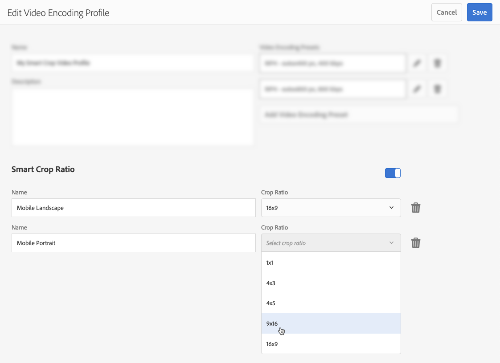
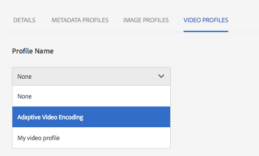

# Profili video di Dynamic Media{#video-profiles}

Dynamic Media è già dotato di un profilo di codifica video adattivo predefinito. Le impostazioni in questo profilo preconfigurato sono ottimizzate per fornire ai clienti la migliore esperienza di visualizzazione possibile. Quando codifichi i video sorgente principali utilizzando il profilo di codifica video adattiva, durante la riproduzione il lettore video regola automaticamente la qualità del flusso video in base alla velocità di connessione Internet dei clienti. Questa azione è nota come streaming bitrate adattivo.

Di seguito sono riportati altri fattori che determinano la qualità dei video:

* **Risoluzione del video sorgente principale caricato**

   Se il video MP4 è stato registrato a una risoluzione inferiore, ad esempio 240p o 360p, non può essere trasmesso in streaming in alta definizione.

* **Dimensioni lettore video**

   Per impostazione predefinita, la &quot;Larghezza&quot; nel profilo di codifica video adattiva è impostata su &quot;Automatico&quot;. Anche in questo caso, durante la riproduzione, viene utilizzata la qualità migliore in base alle dimensioni del lettore.

Consulta [Tecniche consigliate per la codifica video](/help/assets/dynamic-media/video.md#best-practices-for-encoding-videos).

Vedi anche [Best practice per organizzare le risorse digitali per l’utilizzo dei profili di elaborazione](/help/assets/organize-assets.md).

>[!NOTE]
>
>Per generare i metadati di un video e le miniature delle immagini video associate, il video stesso deve seguire il processo di codifica in Dynamic Media. In Adobe Experience Manager, il **[!UICONTROL Codifica video Dynamic Media]** se hai attivato Dynamic Media e hai impostato Cloud Services video, workflow codifica video. Questo flusso di lavoro acquisisce la cronologia del processo del flusso di lavoro e le informazioni di errore. Consulta [Monitorare la codifica video e l’avanzamento della pubblicazione in YouTube](/help/assets/dynamic-media/video.md#monitoring-video-encoding-and-youtube-publishing-progress). Se hai attivato Dynamic Media e configurato Cloud Services video, il **[!UICONTROL Codifica video Dynamic Media]** il flusso di lavoro viene applicato automaticamente al caricamento di un video. Se non utilizzi Dynamic Media, il **[!UICONTROL Aggiorna risorsa DAM]** il flusso di lavoro ha effetto.)
>
>I metadati sono utili quando cerchi risorse. Le miniature sono immagini video statiche generate durante la codifica. Sono richieste dall’Experience Manager e vengono utilizzate nell’interfaccia utente per identificare visivamente i video nelle viste Schede, Risultati ricerca e Elenco risorse. Puoi visualizzare le miniature generate quando selezioni l’icona Copie trasformate (una palette per pittori) di un video codificato.

Al termine della creazione del profilo video, lo applichi a una o più cartelle. Consulta [Applicare un profilo video alle cartelle](#applying-a-video-profile-to-folders).

Per definire parametri di elaborazione avanzati per altri tipi di risorse, consulta [Configurare l’elaborazione delle risorse](/help/assets/dynamic-media/config-dm.md#configuring-asset-processing).

Vedi anche [Profili per l’elaborazione di metadati, immagini e video](/help/assets/dynamic-media/about-image-video-profiles.md).

## Predefiniti codifica video adattiva {#adaptive-video-encoding-presets}

La tabella seguente identifica le best practice per la codifica di profili per lo streaming video adattivo su dispositivi mobili e tablet e su computer desktop. È possibile utilizzare questi predefiniti per video con qualsiasi proporzione.

<table>
 <tbody>
  <tr>
   <td><strong>Codec formato video</strong></td>
   <td><strong>Dimensioni video - Larghezza (px)</strong></td>
   <td><strong>Dimensioni video - Altezza (px)</strong></td>
   <td><strong>Mantieni proporzioni?</strong></td>
   <td><strong>Bitrate video (Kbps)</strong></td>
   <td><strong>Frame Rate Video (Fps)</strong></td>
   <td><strong>Codec audio</strong></td>
   <td><strong>Bitrate audio (Kbps)</strong></td>
  </tr>
  <tr>
   <td>
MP4 H.264 (mp4)
 </td>
   <td>auto</td>
   <td>360</td>
   <td>Sì</td>
   <td>730</td>
   <td>30</td>
   <td>Dolby HE-AAC</td>
   <td>128</td>
  </tr>
  <tr>
   <td>
MP4 H.264 (mp4)
 </td>
   <td>auto</td>
   <td>540</td>
   <td>Sì</td>
   <td>2000  </td>
   <td>30</td>
   <td>Dolby HE-AAC</td>
   <td>128</td>
  </tr>
  <tr>
   <td>
MP4 H.264 (mp4)
 </td>
   <td>auto</td>
   <td>720  </td>
   <td>Sì</td>
   <td>3000  </td>
   <td>30</td>
   <td>Dolby HE-AAC</td>
   <td>128</td>
  </tr>
 </tbody>
</table>

## Informazioni sull’utilizzo del ritaglio avanzato nei profili video {#about-smart-crop-video}

Il ritaglio avanzato per i video è una funzione opzionale disponibile in Profili video. Si tratta di uno strumento che utilizza Adobe Sensei per rilevare e ritagliare automaticamente il punto focale in qualsiasi video adattivo o video progressivo caricato, indipendentemente dalle dimensioni.

I formati video supportati per il ritaglio avanzato includono MP4, MKV, MOV, AVI, FLV e WMV.

Le dimensioni massime supportate per i file video con ritaglio avanzato sono i seguenti criteri:

* Durata di cinque minuti.
* 30 fps.
* Dimensione del file: 300 MB.

Adobe Sensei è limitato a 9000 fotogrammi. ovvero cinque minuti a 30 FPS. Se il video ha un FPS più alto, la durata video massima supportata diminuisce. Ad esempio, un video a 60 FPS deve avere una durata di due minuti e mezzo per essere supportato da Adobe Sensei e SmartCrop.

>[!IMPORTANT]
>
>Affinché il ritaglio avanzato video funzioni, è necessario includere nel profilo video uno o più predefiniti di codifica video.

Per utilizzare il ritaglio avanzato per i video, crea un profilo di codifica video adattivo o progressivo. Come parte del profilo, utilizza **[!UICONTROL Smart Crop Ratio]** per selezionare rapporti di formato predefiniti. Ad esempio, dopo aver definito i predefiniti di codifica video, potete aggiungere una definizione &quot;Mobile Landscape&quot; con proporzioni di 16x9 e una definizione &quot;Mobile Portrait&quot; con proporzioni di 9x16. Altri rapporti di ritaglio o di aspetto tra i quali è possibile scegliere di includere 1x1, 4x3 e 4x5.

Puoi attivare o disattivare il ritaglio avanzato video nel profilo video, utilizzando il cursore posto all’estrema destra di **[!UICONTROL Smart Crop Ratio]** nell’interfaccia utente di.

Dopo aver creato e salvato il profilo video, puoi applicarlo alle cartelle desiderate.

Consulta [Applicare profili video a cartelle specifiche](#applying-video-profiles-to-specific-folders) o [Applicare un profilo video a livello globale](#applying-a-video-profile-globally).

Vedi anche [Ritaglio avanzato per immagini](image-profiles.md).

## Creare un profilo video per lo streaming con bitrate adattivo {#creating-a-video-encoding-profile-for-adaptive-streaming}

Dynamic Media è già dotato di un profilo di codifica video adattivo predefinito, un gruppo di impostazioni di caricamento video per MP4 H.264 ottimizzate per una migliore esperienza di visualizzazione. Puoi usare questo profilo quando carichi i video.

Tuttavia, se questo profilo predefinito non soddisfa le tue esigenze, puoi scegliere di creare un tuo profilo di codifica video adattivo. Come best practice, quando utilizzi l’impostazione **[!UICONTROL Codifica per streaming adattivo]**, tutti i predefiniti di codifica aggiunti al profilo vengono convalidati. Questa funzionalità garantisce che tutti i video abbiano le stesse proporzioni. Inoltre, i video codificati vengono trattati come set multibitrate per lo streaming.

Quando crei il profilo di codifica video, la maggior parte delle opzioni di codifica sono precompilate con le impostazioni predefinite consigliate. Tuttavia, se si seleziona un valore diverso da quello predefinito consigliato, la qualità video durante la riproduzione potrebbe risultare scadente e si potrebbero verificare altri problemi di prestazioni.

Pertanto, per tutti i predefiniti di codifica video MP4 H.264 nel profilo, i seguenti valori vengono convalidati per garantire che siano uguali tra i singoli predefiniti di codifica nel profilo, rendendo possibile lo streaming del bitrate adattivo:

* Codec formato video - MP4 H.264 (.mp4)
* Codec audio
* Bitrate audio
* Mantieni proporzioni
* Codifica a due passate
* Bitrate costante
* Profilo H264
* Frequenza di campionamento audio

Se i valori non sono uguali, puoi continuare a creare il profilo così com’è. Tuttavia, lo streaming con bitrate adattivo non è possibile. Al contrario, gli utenti possono utilizzare lo streaming a bitrate singolo. È consigliabile modificare le impostazioni di codifica per utilizzare gli stessi valori nei singoli predefiniti di codifica nel profilo. Se è abilitata l’opzione &quot;Codifica per streaming adattivo&quot;, l’editor di profili video/predefiniti applica la parità delle impostazioni di codifica dei video adattivi.

Vedi anche [Creare un profilo di codifica video per lo streaming progressivo](#creating-a-video-encoding-profile-for-progressive-streaming).

Vedi anche [Best practice per la codifica video](/help/assets/dynamic-media/video.md#best-practices-for-encoding-videos).

Per definire parametri di elaborazione avanzati per altri tipi di risorse, consulta [Configurare l’elaborazione delle risorse](/help/assets/dynamic-media/config-dm.md#configuring-asset-processing).

**Per creare un profilo video per lo streaming con bitrate adattivo**,

1. Seleziona il logo di Experience Manager e passa a **[!UICONTROL Strumenti]** > **[!UICONTROL Risorse]** > **[!UICONTROL Profili video]**.
1. Seleziona **[!UICONTROL Crea]**.
1. Immettere un nome e una descrizione per il profilo.
1. Nella pagina Crea/Modifica predefiniti di codifica video, seleziona **[!UICONTROL Aggiungi predefinito di codifica video]**.
1. Il giorno **[!UICONTROL Base]** , impostare le opzioni video e audio.
Per ulteriori descrizioni o impostazioni consigliate per il codec del formato video selezionato, fai clic sull&#39;icona delle informazioni posta accanto a ciascuna opzione.
1. Nell’intestazione Dimensione video, assicurati che: **[!UICONTROL Mantieni proporzioni]** è selezionato.
1. Imposta la risoluzione delle dimensioni del fotogramma video in pixel. Utilizza il **[!UICONTROL Automatico]** valore per ridimensionare automaticamente in modo che corrisponda alle proporzioni sorgente (rapporto larghezza per altezza). Ad esempio, Auto x 480 o 640 x Auto.

1. Effettua una delle operazioni seguenti:

   * In **[!UICONTROL Larghezza]** campo, immetti **[!UICONTROL auto]**. In **[!UICONTROL Altezza]** immettere un valore in pixel.

   * Per visualizzare le dimensioni del video, seleziona l’icona Informazioni (i) a destra di **[!UICONTROL Altezza]** per aprire la pagina Calcolatore dimensioni. Utilizzare **[!UICONTROL Calcolatore dimensioni]** per impostare le dimensioni video desiderate (rappresentate dalla casella blu). Seleziona **[!UICONTROL X]** nell’angolo in alto a destra al termine dell’operazione.

1. (Facoltativo) Seleziona la **[!UICONTROL Avanzate]** e assicurarsi che il **[!UICONTROL Usa valori predefiniti]** è selezionata (scelta consigliata). In alternativa, è possibile modificare le impostazioni audio e video avanzate.
1. Nell’angolo superiore destro della pagina, seleziona **[!UICONTROL Salva]** per salvare il predefinito.
1. Effettua una delle operazioni seguenti:
   * Ripeti i passaggi 4-10 per creare altri predefiniti di codifica. Lo streaming video adattivo richiede più di un predefinito video.
   * Procedi al passaggio successivo.

1. (Facoltativo) Per aggiungere il ritaglio avanzato video ai video a cui è applicato questo profilo, effettua le seguenti operazioni:
   * Nella pagina Modifica profilo video, a destra dell’intestazione Smart Crop Ratio (Proporzioni ritaglio avanzate), seleziona **[!UICONTROL Aggiungi nuovo]**.
   * Nel campo Nome, digita un nome per le proporzioni di ritaglio che ti consenta di identificarlo facilmente.
   * Dalla sezione **[!UICONTROL Proporzioni di ritaglio]** selezionare la proporzione che si desidera utilizzare.

1. Effettua una delle operazioni seguenti:

   * Continua ad aggiungere nuovi rapporti di ritaglio in base alle esigenze.
   * Procedi al passaggio successivo.

1. Nell’angolo superiore destro della pagina, seleziona **[!UICONTROL Salva]** per salvare il profilo.

Ora puoi applicare il profilo alle cartelle che contengono video. Consulta [Applicazione di un profilo video alle cartelle](#applying-a-video-profile-to-folders) o [Applicazione di un profilo video a livello globale](#applying-a-video-profile-globally).

## Creare un profilo video per lo streaming progressivo {#creating-a-video-encoding-profile-for-progressive-streaming}

Se scegli di non utilizzare l’opzione **[!UICONTROL Codifica per streaming adattivo]**, tutti i predefiniti di codifica aggiunti al profilo vengono trattati come singole rappresentazioni video per lo streaming a bitrate singolo o per la distribuzione di video progressivi. Inoltre, non esiste una convalida per garantire che tutte le rappresentazioni video abbiano le stesse proporzioni.

I codec di formato video supportati sono H.264 (.mp4) e WebM.

Vedi anche [Creare un profilo di codifica video per lo streaming con bitrate adattivo](#creating-a-video-encoding-profile-for-adaptive-streaming).

Vedi anche [Tecniche consigliate per la codifica video](/help/assets/dynamic-media/video.md#best-practices-for-encoding-videos).

Per definire parametri di elaborazione avanzati per altri tipi di risorse, consulta [Configurazione dell’elaborazione delle risorse](/help/assets/dynamic-media/config-dm.md#configuring-asset-processing).

**Per creare un profilo video per lo streaming progressivo:**

1. Seleziona il logo di Experience Manager e passa a **[!UICONTROL Strumenti]** > **[!UICONTROL Risorse]** > **[!UICONTROL Profili video]**.
1. Seleziona **[!UICONTROL Crea]**.
1. Immettere un nome e una descrizione per il profilo.
1. Nella pagina Crea/Modifica predefiniti di codifica video, seleziona **[!UICONTROL Aggiungi predefinito di codifica video]**.
1. Il giorno **[!UICONTROL Base]** , impostare le opzioni video e audio.
Per ulteriori descrizioni o impostazioni consigliate per il codec del formato video selezionato, fai clic sull&#39;icona delle informazioni posta accanto a ciascuna opzione.
1. (Facoltativo) Sotto l’intestazione Dimensione video, deseleziona **[!UICONTROL Mantieni proporzioni]**.
1. Effettua le seguenti operazioni:
   * In **[!UICONTROL Larghezza]** campo, immetti **[!UICONTROL auto]**.
   * In **[!UICONTROL Altezza]** immettere un valore in pixel.
Per visualizzare le dimensioni del video, seleziona l’icona Informazioni altezza per aprire la **[!UICONTROL Calcolatore dimensioni]** pagina. Utilizza il **[!UICONTROL Calcolatore dimensioni]** per impostare ulteriormente le dimensioni del video (casella blu) in base alle proprie esigenze. Al termine, nell&#39;angolo superiore destro della finestra di dialogo, selezionare **[!UICONTROL X]**.
1. (Facoltativo) Effettuate una delle seguenti operazioni:

   * Seleziona la **[!UICONTROL Avanzate]** e accertarsi che il **[!UICONTROL Usa valori predefiniti]** è selezionata (scelta consigliata).

   * Cancella **[!UICONTROL Usa valori predefiniti]** e specificare le impostazioni video e audio desiderate.
Per ulteriori descrizioni o impostazioni consigliate per il codec del formato video selezionato, fai clic sull&#39;icona delle informazioni posta accanto a ciascuna opzione.

1. Nell’angolo superiore destro della pagina, seleziona **[!UICONTROL Salva]** per salvare il predefinito.
1. Effettua una delle operazioni seguenti:

   * Ripetere i passaggi 4-9 per creare altri predefiniti di codifica.
   * Procedi al passaggio successivo.

1. (Facoltativo) Per aggiungere il ritaglio avanzato video ai video a cui è applicato questo profilo, effettua le seguenti operazioni:

   * Nella pagina Modifica profilo video, a destra dell’intestazione Smart Crop Ratio (Proporzioni ritaglio avanzate), seleziona **[!UICONTROL Aggiungi nuovo]**.
   * Nel campo Nome, digita un nome per le proporzioni di ritaglio che ti consenta di identificarle facilmente.
   * Dalla sezione **[!UICONTROL Proporzioni di ritaglio]** selezionare la proporzione che si desidera utilizzare.

1. Effettua una delle operazioni seguenti:

   * Continua ad aggiungere nuovi rapporti di ritaglio in base alle esigenze.
   * Procedi al passaggio successivo.

1. Nell’angolo superiore destro della pagina, seleziona **[!UICONTROL Salva]** per salvare il profilo.

Ora puoi applicare il profilo alle cartelle che contengono video. Consulta [Applicare un profilo video alle cartelle](#applying-a-video-profile-to-folders) o [Applicare un profilo video a livello globale](#applying-a-video-profile-globally).

## Utilizzare parametri di codifica video personalizzati {#using-custom-added-video-encoding-parameters}

Puoi modificare un profilo di codifica video esistente per sfruttare parametri di codifica video avanzati che non erano disponibili nell’interfaccia utente al momento della creazione o della modifica di un profilo video in Experience Manager. Puoi aggiungere al profilo esistente uno o più parametri avanzati, ad esempio minBitrate e maxBitrate.

**Per utilizzare parametri di codifica video personalizzati:**

1. Seleziona il logo di Experience Manager, quindi passa a **[!UICONTROL Strumenti]** > **[!UICONTROL Generale]** > **[!UICONTROL CRXDE Lite]**.
1. Dalla pagina CRXDE Lite, nel pannello Esplora a sinistra, passa a:

   `/conf/global/settings/dam/dm/presets/video/*name_of_video_encoding_profile_to_edit`

1. Nel pannello in basso a destra della pagina, dalla scheda Proprietà, specifica **[!UICONTROL Nome]**, **[!UICONTROL Tipo]** e **[!UICONTROL Valore]** del parametro da utilizzare.

   Sono disponibili i seguenti parametri avanzati:

<table>
 <tbody>
  <tr>
   <td><strong>Nome</strong></td>
   <td><strong>Descrizione</strong>  </td>
   <td><strong>Tipo</strong>  </td>
   <td><strong>Valore</strong></td>
  </tr>
  <tr>
   <td><code>h264Level</code></td>
   <td>Livello H.264 da utilizzare per la codifica. Normalmente questo livello viene determinato automaticamente in base alle impostazioni di codifica in uso.</td>
   <td><code>String</code></td>
   <td>
10 * livello h264
 
Ad esempio, 3,0 = 30, 1,3 = 13)
 
Nessun valore predefinito.
 </td>
  </tr>
  <tr>
   <td><code>keyframe</code></td>
   <td>Numero di fotogrammi di destinazione tra fotogrammi chiave. Calcolate questo valore in modo da poter generare un fotogramma chiave ogni 2-10 secondi. Ad esempio, a 30 fotogrammi al secondo, l'intervallo dei fotogrammi chiave è 60-300.    Intervalli di fotogrammi chiave inferiori migliorano il comportamento di ricerca e passaggio di streaming per le codifiche video adattivi e possono anche migliorare la qualità dei video con molto movimento. Tuttavia, poiché i fotogrammi chiave aumentano le dimensioni di un file, un intervallo di fotogrammi chiave inferiore di solito determina una qualità video complessiva inferiore a un determinato bitrate.</td>
   <td><code>String</code></td>
   <td>
Numero positivo.
 
Il valore predefinito è 300.
 
Il valore consigliato per HLS o DASH (streaming bitrate adattivo) è 60-90. Per utilizzare DASH per i video, è necessario prima abilitarlo tramite il supporto tecnico Adobe sul tuo account. Consulta <a href="/help/assets/dynamic-media/video.md#enable-dash">Abilita DASH sul tuo account</a>.)
 </td>
  </tr>
  <tr>
   <td><code>minBitrate</code></td>
   <td>
Bitrate minimo per consentire le codifiche del bitrate variabile, in Kbps (kilobit al secondo).
 
Questo parametro si applica solo quando<strong> Usa bitrate costante</strong> viene deselezionato nella scheda Avanzate quando crei o modifichi un profilo di codifica video.
 
Vedi anche <a href="/help/assets/dynamic-media/video.md#bitrate">Bitrate</a>.
 </td>
   <td><code>String</code></td>
   <td>
Numero positivo, in Kbps.
 
Nessun valore predefinito.
 </td>
  </tr>
  <tr>
   <td><code>maxBitrate</code></td>
   <td>
Bitrate massimo per consentire le codifiche del bitrate variabile, in Kbps.
 
Questo parametro si applica solo quando<strong> Usa bitrate costante</strong> viene deselezionato nella scheda Avanzate quando crei o modifichi un profilo di codifica video.
 
Vedi anche <a href="/help/assets/dynamic-media/video.md#bitrate">Bitrate</a>.
 </td>
   <td><code>String</code></td>
   <td>
Numero positivo, in Kbps.
 
Nessun valore predefinito. Tuttavia, il valore consigliato è fino a due volte il bitrate di codifica.
 </td>
  </tr>
  <tr>
   <td><code>audioBitrateCustom</code></td>
   <td>Imposta valore su <code>true</code> per forzare un bitrate costante per lo streaming audio, se supportato dal codec audio.</td>
   <td><code>String</code></td>
   <td>
<code>true</code>/<code>false</code>
 
Il valore predefinito è <code>false</code>.
 
Il valore consigliato per HLS o DASH è <code>false</code>. Per utilizzare DASH per i video, è necessario prima abilitarlo tramite il supporto tecnico Adobe sul tuo account. Consulta <a href="/help/assets/dynamic-media/video.md#enable-dash">Abilita DASH sul tuo account</a>.)
 
 
 </td>
  </tr>
 </tbody>
</table>

1. Nell’angolo inferiore destro della pagina, seleziona **[!UICONTROL Aggiungi]**.
1. Effettua una delle operazioni seguenti:

   * Ripeti i passaggi 3 e 4 per aggiungere un altro parametro al profilo di codifica video.
   * Nell’angolo in alto a sinistra della pagina, seleziona **[!UICONTROL Salva tutto]**.

1. Nell&#39;angolo superiore sinistro della pagina CRXDE Lite, seleziona la **[!UICONTROL Torna alla pagina principale]** per tornare all&#39;Experience Manager.

### Modificare un profilo video {#editing-a-video-encoding-profile}

È possibile modificare qualsiasi profilo video creato per aggiungere, modificare o eliminare predefiniti video all’interno di tale profilo.

Per impostazione predefinita, non è possibile modificare il predefinito **[!UICONTROL Codifica video adattiva]** profilo fornito con Dynamic Media. È invece possibile copiare facilmente il profilo e salvarlo con un nuovo nome. Potete quindi modificare i predefiniti desiderati nel profilo copiato.

Vedi anche [Tecniche consigliate per la codifica video](/help/assets/dynamic-media/video.md#best-practices-for-encoding-videos).

Per definire parametri di elaborazione avanzati per altri tipi di risorse, consulta [Configurare l’elaborazione delle risorse](/help/assets/dynamic-media/config-dm.md#configuring-asset-processing).

**Per modificare un profilo video:**

1. Seleziona il logo di Experience Manager e passa a **[!UICONTROL Strumenti]** > **[!UICONTROL Risorse]** > **[!UICONTROL Profili video]**.
1. Nella pagina Profili video, seleziona un nome di profilo video.
1. Sulla barra degli strumenti, seleziona **[!UICONTROL Modifica]**.
1. Nella pagina Profilo di codifica video, modifica il nome e la descrizione, come desiderato.
1. Come best practice, accertati che la casella di controllo **[!UICONTROL Codifica per streaming adattivo]** sia selezionata.
Per una descrizione dello streaming con bitrate adattivo, seleziona l’icona delle informazioni. Se si sta modificando un profilo video progressivo, non selezionare questa casella di controllo.
1. Nell’intestazione Predefiniti di codifica video, aggiungi, modifica o elimina i predefiniti di codifica video che compongono il profilo.

   Seleziona l’icona delle informazioni accanto a ciascuna opzione nella **[!UICONTROL Base]** e **[!UICONTROL Avanzate]** schede per ulteriori descrizioni o impostazioni consigliate in base al codec del formato video selezionato.

1. Nell’angolo superiore destro della pagina, seleziona **[!UICONTROL Salva]**.

### Copiare un profilo video {#copying-a-video-encoding-profile}

1. Seleziona il logo di Experience Manager e passa a **[!UICONTROL Strumenti]** > **[!UICONTROL Risorse]** > **[!UICONTROL Profili video]**.
1. Nella pagina Profili video, seleziona un nome di profilo video.
1. Sulla barra degli strumenti, seleziona **[!UICONTROL Copia]**.
1. Nella pagina Profilo di codifica video, inserisci un nuovo nome per il profilo.
1. Come best practice, accertati che la casella di controllo **[!UICONTROL Codifica per streaming adattivo]** sia selezionata. Per una descrizione dello streaming con bitrate adattivo, seleziona l’icona delle informazioni. Se copi un profilo video progressivo, non selezionare la casella di controllo.

   In modalità Dynamic Media - Ibrido, se un predefinito video WebM fa parte del profilo video, **[!UICONTROL Codifica per streaming adattivo]** non è possibile perché tutti i predefiniti devono essere MP4.
1. Nell’intestazione Predefiniti di codifica video, aggiungi, modifica o elimina i predefiniti di codifica video che compongono il profilo.

   Seleziona l’icona delle informazioni accanto a ciascuna opzione nelle schede Base e Avanzate per le impostazioni e le descrizioni consigliate.

1. Nell’angolo superiore destro della pagina, seleziona **[!UICONTROL Salva]**.

### Eliminare un profilo video {#deleting-a-video-encoding-profile}

1. Seleziona il logo di Experience Manager e passa a **[!UICONTROL Strumenti]** > **[!UICONTROL Risorse]** > **[!UICONTROL Profili video]**.
1. Nella pagina Profili video, seleziona uno o più nomi di profili video.
1. Sulla barra degli strumenti, seleziona **[!UICONTROL Elimina]**.
1. Seleziona **[!UICONTROL OK]**.

## Applicare un profilo video alle cartelle {#applying-a-video-profile-to-folders}

Quando si assegna un profilo video a una cartella, tutte le sottocartelle ereditano automaticamente il profilo dalla cartella principale. È quindi possibile assegnare un solo profilo video a una cartella. Considera quindi con attenzione la struttura di cartelle in cui caricare, archiviare, utilizzare e archiviare le risorse.

Se hai assegnato un profilo video diverso a una cartella, il nuovo profilo sostituisce quello precedente. Le risorse della cartella esistenti in precedenza rimangono invariate. Il nuovo profilo viene applicato alle risorse che vengono aggiunte alla cartella in un secondo momento.

Le cartelle a cui è assegnato un profilo sono indicate nell’interfaccia utente utilizzando il nome del profilo visualizzato nel nome della scheda.

Puoi applicare i profili video a cartelle specifiche o a livello globale a tutte le risorse.

Puoi rielaborare le risorse in una cartella che dispone già di un profilo video modificato in seguito. Consulta [Rielaborazione delle risorse in una cartella](/help/assets/dynamic-media/about-image-video-profiles.md#reprocessing-assets).

### Applicare un profilo video a cartelle specifiche {#applying-video-profiles-to-specific-folders}

È possibile applicare un profilo video a una cartella dall’interno di **[!UICONTROL Strumenti]** o se ti trovi nella cartella, dal menu **[!UICONTROL Proprietà]**. Questa sezione descrive come applicare i profili video alle cartelle con entrambe le soluzioni.

Le cartelle a cui è già stato assegnato un profilo sono indicate dalla visualizzazione del nome del profilo che è posto direttamente sotto il nome della cartella.

Vedi anche [Rielaborazione delle risorse in una cartella dopo averne modificato il profilo di elaborazione](/help/assets/dynamic-media/about-image-video-profiles.md#reprocessing-assets).

#### Applicare un profilo video alle cartelle tramite l’interfaccia utente Profili {#applying-video-profiles-to-folders-by-way-of-the-profiles-user-interface}

1. Seleziona il logo di Experience Manager e passa a **[!UICONTROL Strumenti]** > **[!UICONTROL Risorse]** > **[!UICONTROL Profili video]**.
1. Seleziona il profilo video da applicare a una o più cartelle.
1. Seleziona **[!UICONTROL Applica profilo alle cartelle]** e seleziona la cartella o le cartelle da utilizzare per ricevere le risorse appena caricate, quindi fai clic su **[!UICONTROL Applica]**. Le cartelle a cui è già stato assegnato un profilo sono indicate dalla visualizzazione del nome del profilo che è posto direttamente sotto il nome della cartella in **[!UICONTROL Vista a schede]**.
È possibile [monitorare l’avanzamento di un processo di elaborazione del profilo video](#monitoring-the-progress-of-an-encoding-job).

#### Applicare un profilo video alle cartelle da Proprietà {#applying-video-profiles-to-folders-from-properties}

1. Seleziona il logo di Experience Manager e passa a **[!UICONTROL Risorse]** e quindi alla cartella a cui desideri applicare un profilo video.
1. Sulla cartella, seleziona il segno di spunta per selezionarla, quindi seleziona **[!UICONTROL Proprietà]**.
1. Seleziona la **[!UICONTROL Profili video]** e selezionare il profilo dal menu a discesa, quindi selezionare **[!UICONTROL Salva e chiudi]**. Le cartelle a cui è già stato assegnato un profilo sono indicate dalla visualizzazione del nome del profilo che è posto direttamente sotto il nome della cartella.

   
È possibile [monitorare l’avanzamento di un processo di elaborazione del profilo video](#monitoring-the-progress-of-an-encoding-job).

### Applicare un profilo video a livello globale {#applying-a-video-profile-globally}

Oltre ad applicare un profilo a una cartella, puoi applicarne uno a livello globale, in modo che il profilo selezionato venga applicato a qualsiasi contenuto caricato nelle risorse Experience Manager in qualsiasi cartella.

Vedi anche [Rielaborazione delle risorse in una cartella](/help/assets/dynamic-media/about-image-video-profiles.md#reprocessing-assets).

**Per applicare un profilo video a livello globale:**

* Passa a CRXDE Lite al seguente nodo: `/content/dam/jcr:content`. Aggiungi la proprietà `videoProfile:/libs/settings/dam/video/dynamicmedia/<name of video encoding profile>` e seleziona **[!UICONTROL Salva tutto]**.

   
* È possibile [monitorare l’avanzamento di un processo di elaborazione del profilo video](#monitoring-the-progress-of-an-encoding-job).

## Monitorare l’avanzamento di un processo di elaborazione di profili video {#monitoring-the-progress-of-an-encoding-job}

Viene visualizzato un indicatore di elaborazione (o barra di avanzamento) che consente di monitorare visivamente l’avanzamento di un processo di elaborazione di un profilo video.

È inoltre possibile visualizzare `error.log` per monitorare l&#39;avanzamento di un processo di codifica, per verificare se la codifica è terminata o per visualizzare eventuali errori del processo. Il `error.log` si trova in `logs` cartella in cui è installata l’istanza di Experience Manager.

## Rimuovere un profilo video dalle cartelle {#removing-a-video-profile-from-folders}

Quando rimuovi un profilo video da una cartella, tutte le sottocartelle ereditano automaticamente la rimozione del profilo dalla relativa cartella principale. Tuttavia, qualsiasi elaborazione dei file che si è verificata all’interno delle cartelle rimane intatta.

È possibile rimuovere un profilo video da una cartella direttamente dal **[!UICONTROL Strumenti]** o se ti trovi nella cartella, dal menu **[!UICONTROL Impostazioni cartella]**. Questa sezione descrive come rimuovere i profili video dalle cartelle con entrambe le soluzioni.

### Rimuovere un profilo video dalle cartelle tramite l’interfaccia utente Profili {#removing-video-profiles-from-folders-by-way-of-the-profiles-user-interface}

1. Seleziona il logo di Experience Manager e passa a **[!UICONTROL Strumenti]** > **[!UICONTROL Risorse]** > **[!UICONTROL Profili video]**.
1. Seleziona il profilo video da rimuovere da una o più cartelle.
1. Seleziona **[!UICONTROL Rimuovi profilo da cartelle]** e seleziona la cartella o le cartelle da cui vuoi rimuovere il profilo e fai clic su **[!UICONTROL Rimuovi]**.

   Puoi confermare che il profilo video non è più applicato a una cartella perché il nome non viene più visualizzato sotto il nome della cartella.

### Rimuovere un profilo video dalle cartelle tramite Proprietà {#removing-video-profiles-from-folders-by-way-of-properties}

1. Seleziona il logo di Experience Manager e passa a **[!UICONTROL Risorse]** e quindi alla cartella da cui desideri rimuovere un profilo video.
1. Sulla cartella, seleziona il segno di spunta per selezionarla, quindi seleziona **[!UICONTROL Proprietà]**.
1. Seleziona la **[!UICONTROL Profili video]** e seleziona **[!UICONTROL Nessuno]** dal menu a discesa e seleziona **[!UICONTROL Salva e chiudi]**. Le cartelle a cui è già stato assegnato un profilo sono indicate dalla visualizzazione del nome del profilo che è posto direttamente sotto il nome della cartella.
