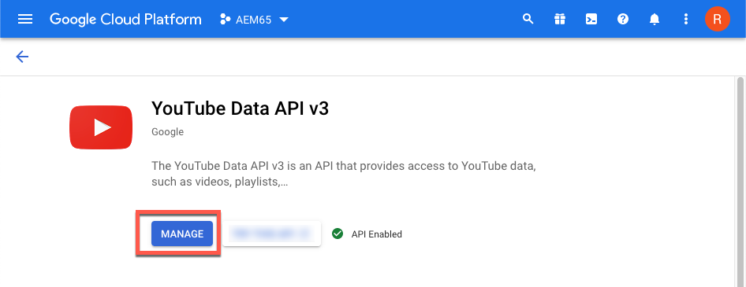

# Video {#video}

Questa sezione descrive come lavorare con i video in Dynamic Media.

## Avvio rapido: Video {#quick-start-videos}

La seguente descrizione dettagliata del flusso di lavoro è stata progettata per aiutarti a iniziare rapidamente a usare i set di video adattivi in Dynamic Media. Dopo ogni passaggio, sono presenti riferimenti incrociati alle intestazioni degli argomenti in cui è possibile trovare ulteriori informazioni.

>[!NOTE]
>
>Prima di lavorare con i video in Dynamic Media, accertati che il tuo amministratore Adobe Experience Manager abbia già abilitato e configurato i Cloud Services Dynamic Media.
>
>* Vedi [Configurare Cloud Services Dynamic Media](/help/assets/dynamic-media/config-dm.md#configuring-dynamic-media-cloud-services) in Configurazione di Dynamic Media e [Risolvere i problemi relativi a Dynamic Media](/help/assets/dynamic-media/troubleshoot-dm.md).
>


1. **Caricare i video Dynamic Media** eseguendo le operazioni seguenti:

   * Crea il tuo profilo di codifica video. Oppure, puoi semplicemente utilizzare i predefiniti _Codifica video adattiva_ profilo fornito con Dynamic Media.

      * [Creare un profilo di codifica video](/help/assets/dynamic-media/video-profiles.md#creating-a-video-encoding-profile-for-adaptive-streaming).
      * Ulteriori informazioni [Best practice per la codifica video](#best-practices-for-encoding-videos).
   * Associa il profilo di elaborazione video a una o più cartelle in cui stai per caricare i video sorgente principali.

      * [Applicare un profilo video alle cartelle](/help/assets/dynamic-media/video-profiles.md#applying-a-video-profile-to-folders).
      * Ulteriori informazioni [Organizzare le risorse digitali](/help/assets/organize-assets.md).
   * Carica i video sorgente principali nelle cartelle. Quando aggiungi dei video alla cartella, questi vengono codificati in base al profilo di elaborazione video assegnato alla cartella.

      * Dynamic Media supporta principalmente video in formato breve con una lunghezza massima di 30 minuti e una risoluzione minima superiore a 25 x 25.
      * Puoi caricare file video fino a 15 GB ciascuno.
      * [Caricare i video](/help/assets/manage-video-assets.md#upload-and-preview-video-assets).
      * Ulteriori informazioni [Formati di file di input supportati](/help/assets/file-format-support.md).
   * Monitorare come [la codifica video è in corso](#monitoring-video-encoding-and-youtube-publishing-progress) dalla visualizzazione della risorsa o del flusso di lavoro.


1. **Gestire i video Dynamic Media** eseguendo una delle operazioni seguenti:

   * Organizzare, sfogliare ed eseguire ricerche nelle risorse video

      * [Organizzare le risorse digitali](/help/assets/organize-assets.md)
      * [Cercare risorse video](/help/assets/search-assets.md#custompredicates) o [Ricerca delle risorse](/help/assets/manage-digital-assets.md#search-assets)
   * Anteprima e pubblicazione delle risorse video

      * Visualizzare il video sorgente e le rappresentazioni codificate del video insieme alle miniature associate:
         [Anteprima video](/help/assets/manage-video-assets.md#upload-and-preview-video-assets) o [Anteprima delle risorse](/help/assets/dynamic-media/previewing-assets.md)
         [Gestire le rappresentazioni video](/help/assets/manage-digital-assets.md#managing-renditions)

      * [Gestire i predefiniti per visualizzatori](/help/assets/dynamic-media/managing-viewer-presets.md)
      * [Pubblicazione delle risorse](/help/assets/dynamic-media/publishing-dynamicmedia-assets.md)
   * Utilizzare i metadati video

      * Modifica le proprietà del video quali titolo, descrizione e tag, campi di metadati personalizzati:
         [Modifica delle proprietà video](/help/assets/manage-digital-assets.md#editing-properties)

      * [Gestione dei metadati per le risorse digitali](/help/assets/manage-metadata.md)
      * [Schemi metadati](/help/assets/metadata-schemas.md)
   * Rivedi, approva e annota i video e mantieni un controllo completo della versione

      * [Aggiunta di annotazioni ai video](/help/assets/manage-video-assets.md#annotate-video-assets) o [Aggiunta di annotazioni alle risorse](/help/assets/manage-digital-assets.md#annotating)

      * [Creazione di una versione](/help/assets/manage-digital-assets.md#asset-versioning)
      * [Avvio di un flusso di lavoro su una risorsa](/help/assets/manage-digital-assets.md#starting-a-workflow-on-an-asset)

      * [Esaminare le risorse delle cartelle](/help/assets/bulk-approval.md)
      * [Progetti](/help/sites-cloud/authoring/projects/overview.md)


1. **Pubblicare i video Dynamic Media** eseguendo una delle operazioni seguenti:

   * Se utilizzi Experience Manager come sistema WCM (Web Content Management), puoi aggiungere video direttamente alle pagine web.

      * [Aggiungere video alle pagine web](/help/assets/dynamic-media/adding-dynamic-media-assets-to-pages.md).
   * Se utilizzi un sistema di gestione dei contenuti web di terze parti, puoi collegare o incorporare video alle tue pagine web.

      * Integra i video utilizzando l’URL:
         [Collegamento degli URL all’applicazione Web](/help/assets/dynamic-media/linking-urls-to-yourwebapplication.md).

      * Integra i video utilizzando il codice di incorporamento sulla pagina web:
         [Incorporare il visualizzatore video in una pagina web](/help/assets/dynamic-media/embed-code.md).
   * [Pubblicare video in YouTube](#publishing-videos-to-youtube).
   * [Generare report video](#viewing-video-reports).

   * [Aggiungere sottotitoli al video](#adding-captions-to-video).


## Utilizzare i video in Dynamic Media {#working-with-video-in-dynamic-media}

Video in Dynamic Media è una soluzione end-to-end che semplifica la pubblicazione di video adattivi di alta qualità per lo streaming su più schermi, compresi desktop, tablet e dispositivi mobili. Un Adaptive Video Set raggruppa versioni dello stesso video codificate con diversi bit rate e formati come 400 kbps, 800 kbps e 1000 kbps. Il computer desktop o il dispositivo mobile rileva la larghezza di banda disponibile.

Ad esempio, su un dispositivo mobile iOS, rileva una larghezza di banda come 3G, 4G o Wi-Fi. Quindi, seleziona automaticamente il video codificato a destra tra i vari bit rate video all&#39;interno del set video adattivo. Il video viene inviato in streaming a desktop, dispositivi mobili o tablet.

Inoltre, la qualità video viene commutata in modo dinamico automaticamente se le condizioni di rete cambiano sul desktop o sul dispositivo mobile. Inoltre, se un cliente entra in modalità a schermo intero su un desktop, il set video adattivo risponde utilizzando una risoluzione migliore, migliorando l’esperienza di visualizzazione del cliente. L’utilizzo di Adaptive Video Sets offre la migliore riproduzione possibile per i clienti che riproducono video Dynamic Media su schermi e dispositivi multipli.

La logica utilizzata da un lettore video per determinare quale video codificato riprodurre o selezionare durante la riproduzione si basa sul seguente algoritmo:

1. Il lettore video carica il frammento video iniziale in base al bit rate più vicino al valore impostato per il &quot;bitrate iniziale&quot; nel lettore stesso.
1. Il lettore video commuta in base ai cambiamenti della velocità della larghezza di banda utilizzando i seguenti criteri:

   1. Player sceglie il flusso di banda più alto sotto o uguale alla larghezza di banda stimata.
   1. Il lettore considera solo l&#39;80% della larghezza di banda disponibile. Tuttavia, se sta cambiando, è più conservativo solo al 70% per evitare sovrastimazioni e immediatamente tornare indietro.

Per informazioni tecniche dettagliate sull’algoritmo, consulta [https://android.googlesource.com/platform/frameworks/av/+/master/media/libstagefright/httplive/LiveSession.cpp](https://android.googlesource.com/platform/frameworks/av/+/master/media/libstagefright/httplive/LiveSession.cpp)

Per la gestione di set video singoli e di set video adattivi, sono supportati i seguenti elementi:

* Caricamento di video da numerosi formati video e formati audio supportati e codifica di video in formato MP4 H.264 per la riproduzione su più schermi. È possibile utilizzare predefiniti per video adattivi, predefiniti di codifica per video singoli o personalizzare la propria codifica per controllare la qualità e le dimensioni del video.

   * Quando viene generato un set video adattivo, questo include video MP4.
   * **Nota**: I video principali/sorgente non vengono aggiunti a un set video adattivo.

* sottotitoli video in tutti i visualizzatori video HTML5.
* Organizza, sfoglia e cerca video con il supporto completo dei metadati per una gestione efficiente delle risorse video.
* Distribuisci set video adattivi su web e desktop, tablet e dispositivi mobili.

Lo streaming video adattivo è supportato su varie piattaforme iOS. Vedi [Guida di riferimento per i visualizzatori Dynamic Media](https://experienceleague.adobe.com/docs/dynamic-media-developer-resources/library/viewers-aem-assets-dmc/video/c-html5-video-reference.html).

<!-- OUTDATED 2/28/22 BASED ON CQDOC-18692 Dynamic Media supports mobile video playback for MP4 H.264 video. You can find BlackBerry&reg; devices that support this video format at the following: [Supported video formats on BlackBerry&reg;](https://support.blackberry.com/kb/articleDetail?ArticleNumber=000005482).

OUTDATED 2/28/22 BASED ON CQDOC-18692 You can find Windows&reg; devices that support this video format at the following [Supported video formats on Windows&reg; Phone](https://docs.microsoft.com/en-us/windows/uwp/audio-video-camera/supported-codecs). -->

* Riproduci il video utilizzando i predefiniti per visualizzatori video di Dynamic Media, tra cui:

   * Visualizzatori video singoli.
   * Visualizzatori per file multimediali diversi che combinano contenuti video e immagine.

* Configura i lettori video per soddisfare le tue esigenze di branding.
* Integra i video sul tuo sito web, sito mobile o applicazione mobile con un semplice URL o codice di incorporamento.

Vedi [Riproduzione video dinamica](https://s7d9.scene7.com/s7/uvideo.jsp?asset=GeoRetail/Mop_AVS&amp;config=GeoRetail/Universal_Video1&amp;stageSize=640,480) campione.

Vedi anche [Visualizzatori per Experience Manager Assets e Dynamic Media Classic](https://experienceleague.adobe.com/docs/dynamic-media-developer-resources/library/viewers-aem-assets-dmc/c-html5-s7-aem-asset-viewers.html#viewers-aem-assets-dmc) e [Solo visualizzatori per Experience Manager Assets](https://experienceleague.adobe.com/docs/dynamic-media-developer-resources/library/viewers-for-aem-assets-only/c-html5-aem-asset-viewers.html#viewers-for-aem-assets-only) in [Guida di riferimento per i visualizzatori Dynamic Media](https://experienceleague.adobe.com/docs/dynamic-media-developer-resources.html).

## Procedure consigliate: Utilizzo del visualizzatore video HTML5 {#best-practice-using-the-html-video-viewer}

I predefiniti per visualizzatori video Dynamic Media HTML5 sono lettori video affidabili. È possibile utilizzarli per evitare molti problemi comuni relativi alla riproduzione video di HTML5 e problemi associati ai dispositivi mobili. Ad esempio, mancanza di distribuzione in streaming adattivo e portata limitata del browser desktop.

Dal lato del design del lettore, è possibile progettare le funzionalità del lettore video utilizzando gli strumenti standard di sviluppo web. Ad esempio, puoi progettare pulsanti, controlli e sfondo personalizzato dell’immagine miniatura utilizzando HTML5 e CSS per aiutarti a raggiungere i clienti con un aspetto personalizzato.

Dal lato della riproduzione del visualizzatore, rileva automaticamente la funzionalità video del browser. Il video viene quindi trasmesso utilizzando HLS o DASH, noto anche come streaming video adattivo. Oppure, se tali metodi di consegna non sono presenti, viene invece utilizzato HTML5 progressive.

>[!NOTE]
>
>Per utilizzare DASH per i video, deve prima essere attivato dal supporto tecnico Adobe sul tuo account. Vedi [Abilita DASH sul tuo account](#enable-dash).)

È possibile combinare in un unico lettore la possibilità di progettare i componenti di riproduzione utilizzando HTML5 e CSS. Può avere una riproduzione incorporata e utilizzare lo streaming adattivo e progressivo a seconda della capacità del browser. Tutte queste funzionalità consentono di estendere la portata dei contenuti rich media sia agli utenti desktop che ai dispositivi mobili e di garantire un’esperienza video semplificata.

Vedi anche [Solo visualizzatori per Experience Manager Assets](https://experienceleague.adobe.com/docs/dynamic-media-developer-resources/library/viewers-for-aem-assets-only/c-html5-aem-asset-viewers.html#viewers-for-aem-assets-only) in [Guida di riferimento per i visualizzatori Dynamic Media](https://experienceleague.adobe.com/docs/dynamic-media-developer-resources.html).


### Riproduzione di video su computer desktop e dispositivi mobili utilizzando il visualizzatore video HTML5 {#playback-of-video-on-desktop-computers-and-mobile-devices-using-the-html-video-viewer}

Per lo streaming video adattivo per desktop e dispositivi mobili, i video utilizzati per la commutazione del bit rate si basano su tutti i video MP4 nel set video adattivo.

La riproduzione video si verifica utilizzando HLS o DASH, o il download progressivo del video. Nelle versioni precedenti di Experience Manager, ad esempio 6.0, 6.1 e 6.2, i video venivano trasmessi in streaming via HTTP.

Tuttavia, all’Experience Manager 6.3 e versioni successive, i video vengono ora trasmessi in streaming su HTTPS (ovvero HLS o DASH) perché l’URL del servizio gateway DM utilizza sempre anche HTTPS. Questo comportamento predefinito non ha alcun impatto sui clienti. In altre parole, lo streaming video si verifica sempre su HTTPS a meno che non sia supportato dal browser. (vedere la tabella seguente).

>[!NOTE]
>
>Per utilizzare DASH per i video, deve prima essere attivato dal supporto tecnico Adobe sul tuo account. Vedi [Abilita DASH sul tuo account](#enable-dash).)

Quindi,

* Se disponi di un sito web HTTPS con streaming video HTTPS, lo streaming è a posto.
* Se disponi di un sito web HTTP con streaming video HTTPS, lo streaming è a posto e il browser Web non presenta problemi di contenuto misto.

HLS è uno standard Apple per lo streaming video adattivo che regola automaticamente la riproduzione in base alla capacità della larghezza di banda della rete. Permette inoltre al cliente di &quot;cercare&quot; in qualsiasi punto del video senza dover attendere che il resto del video venga scaricato.

Il video progressivo viene distribuito scaricando e memorizzando il video localmente sul sistema desktop o sul dispositivo mobile di un utente.

La tabella seguente descrive il dispositivo, il browser e il metodo di riproduzione dei video su computer desktop e dispositivi mobili che utilizzano [Visualizzatore video Dynamic Media HTML5](https://experienceleague.adobe.com/docs/dynamic-media-developer-resources/library/viewers-for-aem-assets-only/interactive-video/c-html5-aem-int-video.html#interactive-video).

<table>
 <tbody>
  <tr>
   <td><strong>Dispositivo</strong></td>
   <td><strong>Browser</strong></td>
   <td><strong>Modalità di riproduzione video</strong></td>
  </tr>
  <tr>
   <td>Desktop</td>
   <td>Internet Explorer 9 e 10</td>
   <td>Download progressivo.</td>
  </tr>
  <tr>
   <td>Desktop</td>
   <td>Internet Explorer 11+</td>
   <td>Su Windows® 8 e Windows® 10 - Imponi l'uso di HTTPS ogni volta che viene richiesto DASH o HLS. Limitazione nota: HTTP su DASH o HLS non funziona in questa combinazione browser/sistema operativo<br /> <br /> Su Windows® 7 - Download progressivo. Utilizza la logica standard per selezionare il protocollo HTTP rispetto a quello HTTPS.</td>
  </tr>
  <tr>
   <td>Desktop</td>
   <td>Firefox 23-44</td>
   <td>Download progressivo.</td>
  </tr>
  <tr>
   <td>Desktop</td>
   <td>Firefox 45 o versione successiva</td>
   <td>Streaming adattivo HLS o DASH*</td>
  </tr>
  <tr>
   <td>Desktop</td>
   <td>Chrome</td>
   <td>Streaming adattivo HLS o DASH*</td>
  </tr>
  <tr>
   <td>Desktop</td>
   <td>Safari (Mac)</td>
   <td>Streaming adattivo HLS o DASH*</td>
  </tr>
  <tr>
   <td>Mobile</td>
   <td>Chrome (Android™ 6 o precedente)</td>
   <td>Download progressivo.</td>
  </tr>
  <tr>
   <td>Mobile</td>
   <td>Chrome (Android™ 7 o successivo)</td>
   <td>HLS o DASH* streaming adattivo/td&gt;
  </tr>
  <tr>
   <td>Mobile</td>
   <td>Android™ (browser predefinito)</td>
   <td>Download progressivo.</td>
  </tr>
  <tr>
   <td>Mobile</td>
   <td>Safari (iOS)</td>
   <td>Streaming adattivo HLS o DASH*</td>
  </tr>
  <tr>
   <td>Mobile</td>
   <td>Chrome (iOS)</td>
   <td>Streaming adattivo HLS o DASH*</td>
  </tr>
 </tbody>
</table>

>[!IMPORTANT]
>
>*Per utilizzare DASH per i video, deve essere attivato innanzitutto dal supporto tecnico Adobe sul tuo account. Vedi [Abilita DASH sul tuo account](#enable-dash).)

<!--  THIS LINE WAS REMOVED FROM THE TABLE ABOVE ON FEB 28, 2022 BASED ON CQDOC 18692 -RSB <tr>
   <td>Mobile</td>
   <td>BlackBerry&reg;</td>
   <td>HLS or DASH</td>
  </tr>
 -->

## Architettura della soluzione video Dynamic Media {#architecture-of-dynamic-media-video-solution}

L’immagine seguente mostra il flusso di lavoro di authoring complessivo dei video caricati e codificati tramite DMGGateway (in modalità ibrida di Dynamic Media) e resi disponibili per il consumo pubblico.


## Architettura di pubblicazione ibrida per i video {#hybrid-publishing-architecture-for-videos}


## Best practice per la codifica dei video {#best-practices-for-encoding-videos}

La **Codifica video Dynamic Media** se hai abilitato Dynamic Media e hai impostato Cloud Services video, il flusso di lavoro codifica i video. Questo flusso di lavoro acquisisce la cronologia del processo del flusso di lavoro e le informazioni di errore. Vedi [Monitorare la codifica video e lo stato di pubblicazione di YouTube](#monitoring-video-encoding-and-youtube-publishing-progress). Se hai abilitato Dynamic Media e hai impostato Cloud Services video, la **[!UICONTROL Codifica video Dynamic Media]** il flusso di lavoro ha effetto automaticamente al momento del caricamento di un video. Se non utilizzi Dynamic Media, la **[!UICONTROL Risorsa di aggiornamento DAM]** il flusso di lavoro ha effetto).

Di seguito sono riportati alcuni suggerimenti utili per la codifica dei file video di origine.

<!-- For advice about video encoding, see the following:

* [Streaming 101: The Basics — Codecs, Bandwidth, Data Rate, and Resolution](https://www.adobe.com/go/learn_s7_streaming101_en).
* [Video Encoding Basics](https://www.adobe.com/go/learn_s7_encoding_en). -->

### File video di origine {#source-video-files}

Quando codifichi un file video, utilizza un file video sorgente della massima qualità possibile. Evita di utilizzare file video codificati in precedenza perché sono già compressi e un’ulteriore codifica crea un video di qualità scadente.

* Dynamic Media supporta principalmente video in formato breve con una lunghezza massima di 30 minuti e una risoluzione minima superiore a 25 x 25.
* È possibile caricare file video di origine primaria fino a 15 GB ciascuno.

La tabella seguente descrive le dimensioni, le proporzioni e il bit rate minimo consigliati che i file video sorgente devono avere prima di codificarli:

| Dimensione | Proporzioni | Bit rate minimo |
|--- |--- |--- |
| 1024 X 768 | 4:3 | 4500 kbps per la maggior parte dei video. |
| 1280 X 720 | 16:9 | 3000 - 6000 kbps, a seconda della quantità di movimento nel video. |
| 1920 X 1080 | 16:9 | 6000 - 8000 kbps, a seconda della quantità di movimento nel video. |

### Ottenere i metadati di un file {#obtaining-a-file-s-metadata}

È possibile ottenere i metadati di un file visualizzandone i metadati utilizzando uno strumento di modifica per i video o un&#39;applicazione progettata per ottenere i metadati. Di seguito sono riportate le istruzioni per l&#39;utilizzo di MediaInfo, un&#39;applicazione di terze parti, per ottenere i metadati di un file video:

1. Vai a [Download di MediaInfo](https://mediaarea.net/en/MediaInfo/Download).
1. Selezionare e scaricare il programma di installazione per la versione GUI e seguire le istruzioni di installazione.
1. Dopo l&#39;installazione, fare clic con il pulsante destro del mouse sul file video (solo Windows®) e selezionare MediaInfo oppure aprire MediaInfo e trascinare il file video nell&#39;applicazione. Vengono visualizzati tutti i metadati associati al file video, inclusi larghezza, altezza e fps.

### Proporzioni {#aspect-ratio}

Quando scegli o crei un predefinito di codifica video per il file video sorgente principale, accertati che il predefinito abbia le stesse proporzioni del file video sorgente principale. Il rapporto di formato è il rapporto tra la larghezza e l&#39;altezza del video.

Per determinare le proporzioni di un file video, ottieni i metadati del file e prendi nota della larghezza e dell’altezza del file (vedi Ottenere i metadati di un file qui sopra). Quindi utilizzare questa formula per determinare le proporzioni:

larghezza/altezza = proporzioni

La tabella seguente descrive come i risultati delle formule si traducono in scelte di proporzioni comuni:

| Risultato della formula | Proporzioni |
|--- |--- |
| 1.33 | 4:3 |
| 0.75 | 3:4 |
| 1.78 | 16:9 |
| 0.56 | 9:16 |

Ad esempio, un video con una larghezza x 1080 di 1440 ha un rapporto di formato di 1440/1080 o 1,33. In questo caso, scegli un predefinito di codifica video con un rapporto di formato 4:3 per codificare il file video.

### Bitrate {#bitrate}

Il bitrate è la quantità di dati codificati per creare un secondo di riproduzione video. Il bitrate viene misurato in kilobit al secondo (Kbps).

>[!NOTE]
>
>Poiché tutti i codec utilizzano la compressione con perdita di dati, il bitrate è il fattore più importante nella qualità video. Con la compressione con perdita di dati, più si comprime un file video, più la qualità è degradata. Per questo motivo, tutte le altre caratteristiche sono uguali (la risoluzione, il frame rate e il codec), più basso è il bitrate, minore è la qualità del file compresso.

Quando si seleziona una codifica a bit rate, è possibile scegliere due tipi:

* **[!UICONTROL Codifica a bit rate costante]** (CBR) - Durante la codifica CBR, il bitrate o il numero di bit al secondo viene mantenuto lo stesso durante tutto il processo di codifica. La codifica CBR persiste quando la velocità dei dati impostata viene impostata sull’impostazione per l’intero video. Inoltre, la codifica CBR non ottimizza i file multimediali per la qualità, ma salva lo spazio di archiviazione.
Utilizzare CBR se il video contiene un livello di movimento simile per l&#39;intero video. CBR viene utilizzato più comunemente per lo streaming di contenuti video. Vedi anche [Utilizzare parametri di codifica video personalizzati](/help/assets/dynamic-media/video-profiles.md#using-custom-added-video-encoding-parameters).

* **[!UICONTROL Codifica a bit rate variabile]** (VBR) - La codifica VBR regola il tasso di dati verso il basso e al limite superiore impostato, in base ai dati richiesti dal compressore. Questa funzionalità significa che durante un processo di codifica VBR il bitrate del file multimediale aumenta o diminuisce dinamicamente a seconda delle esigenze del bitrate dei file multimediali.
VBR richiede più tempo per codificare ma produce i risultati più favorevoli; la qualità del file multimediale è superiore. VBR è utilizzato più comunemente per la distribuzione http progressiva dei contenuti video.

Quando utilizzi VBR o CRB?
Quando selezioni VBR rispetto a CBR, si consiglia quasi sempre di utilizzare VBR per i file multimediali. VBR offre file di qualità superiore a bit rate competitivi. Quando si utilizza il VBR, assicurarsi di utilizzare con la codifica a due passaggi e impostare il bitrate massimo su 1,5 volte il bitrate video di destinazione.

Quando scegli un predefinito di codifica video, accertati di tenere conto della velocità di connessione dell’utente finale di destinazione. Scegli un predefinito con una velocità dati pari all&#39;80% di quella velocità. Ad esempio, se la velocità di connessione dell&#39;utente finale target è di 1000 Kbps, la preimpostazione migliore è quella con una velocità dati video di 800 Kbps.

Questa tabella descrive la velocità dati delle velocità di connessione tipiche.

| Velocità (Kbps) | Tipo di connessione |
|--- |--- |
| 256 | Connessione remota. |
| 800 | Connessione mobile tipica. Per questa connessione, esegui il targeting di una velocità dati compresa tra 400 e un massimo di 800 per le esperienze 3G. |
| 2000 | Connessione desktop a banda larga tipica. Per questa connessione, eseguire il targeting di una velocità dati nell&#39;intervallo 800-2000 Kbps, con la maggior parte delle destinazioni con una media di 1200-1500 Kbps. |
| 5000 | Connessione a banda larga tipica. La codifica in questo intervallo superiore non è consigliata perché la distribuzione video a questa velocità non è disponibile per la maggior parte dei consumatori. |

### Risoluzione {#resolution}

**Risoluzione** descrive l’altezza e la larghezza in pixel di un file video. La maggior parte dei video sorgente viene memorizzata ad alta risoluzione (ad esempio, 1920 x 1080). A scopo di streaming, il video sorgente viene compresso in una risoluzione più piccola (640 x 480 o inferiore).

La risoluzione e la velocità dei dati sono due fattori strettamente collegati che determinano la qualità video. Per mantenere la stessa qualità video, più alto è il numero di pixel in un file video (più alta è la risoluzione), più alta deve essere la velocità dei dati. Ad esempio, considera il numero di pixel per fotogramma in una risoluzione 320 x 240 e un file video con risoluzione 640 x 480:

| Risoluzione | Pixel per frame |
|--- |--- |
| 320 x 240 | 76,800 |
| 640 x 480 | 307,200 |

Il file 640 x 480 ha quattro volte più pixel per frame. Per ottenere la stessa velocità dati per queste due risoluzioni di esempio, si applica una compressione quattro volte maggiore al file 640 x 480, che può ridurre la qualità del video. Pertanto, una velocità dati video di 250 Kbps produce una visualizzazione di alta qualità con una risoluzione di 320 x 240, ma non con una risoluzione di 640 x 480.

In generale, maggiore è la velocità dei dati utilizzata, migliore sarà l&#39;aspetto del video e maggiore è la risoluzione utilizzata, maggiore è la velocità dei dati che è necessario mantenere la qualità di visualizzazione (rispetto alle risoluzioni più basse).

Poiché la risoluzione e la velocità dei dati sono collegate, durante la codifica dei video sono disponibili due opzioni:

* Scegli una velocità dati e quindi codifica alla risoluzione più alta che appare buona alla velocità dati scelta.
* Scegliete una risoluzione e quindi codificate alla velocità di dati necessaria per ottenere video di alta qualità alla risoluzione scelta.

Quando scegli (o crei) un predefinito di codifica video per il file video sorgente principale, utilizza questa tabella per impostare la risoluzione corretta:

| Risoluzione | Altezza (pixel) | Dimensioni dello schermo |
|--- |--- |--- |
| 240p | 240 | Schermo compatto |
| 300p | 300 | Schermo piccolo in genere per dispositivi mobili |
| 360p | 360 | Schermo piccolo |
| 480p | 480 | Schermo medio |
| 720p | 720 | Schermo grande |
| 1080p | 1080 | Schermo grande ad alta definizione |

### Fps (fotogrammi al secondo) {#fps-frames-per-second}

Negli Stati Uniti e in Giappone la maggior parte dei video viene girata a 29,97 fotogrammi al secondo (fps); in Europa, la maggior parte dei video viene girata a 25 fps. Il film è girato a 24 fps.

Scegli un predefinito di codifica video che corrisponda alla frequenza fps del file video sorgente principale. Ad esempio, se il video sorgente principale è 25 fps, scegli un predefinito di codifica con 25 fps. Per impostazione predefinita, tutte le codifiche personalizzate utilizzano la frequenza fps del file video sorgente principale. Per questo motivo, non è necessario specificare esplicitamente l’impostazione fps quando si crea un predefinito di codifica video.

### Dimensioni di codifica video {#video-encoding-dimensions}

Per risultati ottimali, seleziona dimensioni di codifica tali che il video sorgente sia un intero multiplo di tutti i video codificati.

Per calcolare questo rapporto, dividete la larghezza sorgente per la larghezza codificata per ottenere il rapporto di larghezza. Poi, dividi l&#39;altezza della sorgente per l&#39;altezza codificata per ottenere il rapporto di altezza.

Se il rapporto risultante è un numero intero, significa che il video viene ridimensionato in modo ottimale. Se il rapporto risultante non è un numero intero, influisce sulla qualità video lasciando sul display gli artefatti dei pixel rimasti. Questo effetto è più evidente quando il video ha del testo.

Ad esempio, supponiamo che il video sorgente sia 1920 x 1080. Nella tabella seguente, i tre video codificati forniscono le impostazioni di codifica ottimali da utilizzare.

| Tipo video | Larghezza x altezza | Rapporto larghezza | Rapporto altezza |
|--- |--- |--- |--- |
| Sorgente | 1920x1080 | 1 | 1 |
| Codificato | 960 x 540 | 2 | 2 |
| Codificato | 640 x 360 | 3 | 3 |
| Codificato | 480 x 270 | 4 | 4 |

### Formato del file video codificato {#encoded-video-file-format}

Dynamic Media consiglia di utilizzare i predefiniti di codifica video MP4 H.264. Poiché i file MP4 utilizzano il codec video H.264, fornisce video di alta qualità ma in dimensioni file compresse.

### Abilita DASH sul tuo account {#enable-dash}

DASH (Digital Adaptive Streaming via HTTP) è lo standard internazionale per lo streaming video ed è ampiamente adottato tra diversi visualizzatori video. Quando abiliti DASH, puoi scegliere tra HLS o DASH per lo streaming video adattivo. È inoltre possibile scegliere per entrambi con il passaggio automatico tra i giocatori.

Alcuni vantaggi principali dell’abilitazione di DASH sul tuo account includono:

* Crea un pacchetto video di streaming DASH per lo streaming adattivo. Questo metodo porta ad una maggiore efficienza della consegna. Lo streaming adattivo assicura la migliore esperienza di visualizzazione per i clienti.
* Streaming ottimizzato dal browser con lettori Dynamic Media passa tra lo streaming HLS e DASH per garantire la migliore qualità del servizio. Il lettore video passa automaticamente a HLS quando viene utilizzato un browser Safari.
* Puoi configurare il metodo di streaming preferito (HLS o DASH) modificando il predefinito visualizzatore video.
* La codifica video ottimizzata assicura che non venga utilizzato spazio di archiviazione aggiuntivo durante l’abilitazione della funzionalità DASH. Viene creato un singolo set di codifiche video sia per HLS che per DASH per ottimizzare i costi di archiviazione video.
* Consente di rendere la distribuzione video più accessibile ai clienti.
* Ottieni anche l’URL in streaming tramite API.

Avvii una richiesta per utilizzare DASH; non viene attivato automaticamente sul tuo account.

>[!IMPORTANT]
>
>L’abilitazione di DASH sul tuo account è attualmente disponibile solo in Nord America.

Crea un caso di assistenza come descritto di seguito. Nel tuo caso di assistenza, assicurati di aver detto che desideri che DASH sia abilitato sul tuo account.

**Per abilitare DASH sul tuo account:**

1. [Utilizza l’Admin Console per avviare la creazione di un nuovo caso di supporto](https://helpx.adobe.com/it/enterprise/using/support-for-experience-cloud.html).
1. Segui le istruzioni per creare un caso di assistenza e assicurati di fornire le seguenti informazioni:

   * Nome contatto principale, e-mail, telefono.
   * Vuoi che DASH sia abilitato sul tuo account Dynamic Media.

1. L’Assistenza clienti di Adobe ti aggiunge all’Elenco di attesa clienti DASH in base all’ordine in cui vengono inviate le richieste.
1. Quando Adobe è pronto per gestire la tua richiesta, l&#39;Assistenza clienti ti contatta per coordinare e impostare una data di destinazione per l&#39;abilitazione DASH.
1. Dopo il completamento dell’attività, riceverai una notifica dall’Assistenza clienti.
1. Crea il tuo [predefinito visualizzatore video](/help/assets/dynamic-media/managing-viewer-presets.md#creating-a-new-viewer-preset) come al solito.

## Pubblicare video in YouTube {#publishing-videos-to-youtube}

Puoi pubblicare risorse video gestite in Experience Manager Assets direttamente su un canale YouTube creato in precedenza.

Per pubblicare le risorse video in YouTube, taggate le risorse video in Experience Manager Assets con i tag . Puoi associare questi tag a un canale YouTube. Se il tag di una risorsa video corrisponde al tag di un canale YouTube, il video viene pubblicato in YouTube. La pubblicazione in YouTube avviene insieme a una normale pubblicazione del video, purché venga utilizzato un tag associato.

YouTube esegue la propria codifica. Pertanto, il file video originale caricato in Experience Manager viene pubblicato in YouTube invece di qualsiasi rendering video creato dalla codifica di Dynamic Media. Sebbene non sia necessario elaborare i video con Dynamic Media, è previsto che lo facciano nel caso in cui sia necessario un predefinito visualizzatore per la riproduzione.

Quando bypassi il profilo di elaborazione video e lo pubblichi direttamente in YouTube, significa semplicemente che la risorsa video in Experience Manager Asset non riceve una miniatura visibile. Significa anche che i video non codificati non funzionano con nessuno dei tipi di risorse Dynamic Media.

La pubblicazione delle risorse video sui server YouTube comporta il completamento delle seguenti attività per garantire una verifica server-to-server sicura con YouTube:

1. [Configurare le impostazioni Google Cloud](#configuring-google-cloud-settings)
1. [Creare un canale YouTube](#creating-a-youtube-channel)
1. [Aggiungi tag per la pubblicazione](#adding-tags-for-publishing)
1. [Configurare YouTube nell’Experience Manager](#setting-up-youtube-in-aem)
1. [(Facoltativo) Automatizza l&#39;impostazione delle proprietà predefinite di YouTube per i video caricati](#optional-automating-the-setting-of-default-youtube-properties-for-your-uploaded-videos)
1. [Pubblicare video sul canale YouTube](#publishing-videos-to-your-youtube-channel)
1. [(Facoltativo) Verifica il video pubblicato su YouTube](/help/assets/dynamic-media/video.md#optional-verifying-the-published-video-on-youtube)
1. [Collegare gli URL di YouTube all’applicazione Web](#linking-youtube-urls-to-your-web-application)

È inoltre possibile [annullare la pubblicazione dei video per rimuoverli da YouTube](#unpublishing-videos-to-remove-them-from-youtube).

### Configurare le impostazioni Google Cloud {#configuring-google-cloud-settings}

Per pubblicare su YouTube, è necessario un account Google. Se disponi di un account GMAIL, disponi già di un account Google; se non disponi di un account Google, puoi facilmente crearne uno. È necessario l’account perché sono necessarie le credenziali per pubblicare le risorse video in YouTube. <!-- hidden March 3 2022 If you have an account already created, then skip this task and proceed directly to [Create a YouTube channel](#creating-a-youtube-channel). -->

L’account utilizzato con Google Cloud e l’account Google utilizzato per YouTube non deve essere lo stesso.

Google cambia periodicamente la propria interfaccia utente. Di conseguenza, i passaggi per pubblicare i video in YouTube possono variare leggermente rispetto a quanto descritto di seguito. Questa avvertenza si applica anche ad YouTube quando tenti di verificare se i video sono caricati su di esso.

>[!NOTE]
>
>I seguenti passaggi erano accurati al momento della scrittura. Tuttavia, Google aggiorna periodicamente le proprie pagine web cloud senza preavviso. Di conseguenza, alcune opzioni di configurazione possono essere denominate in modo leggermente diverso nell’interfaccia utente di Google rispetto al nome utilizzato nei passaggi.

**Per configurare le impostazioni Google Cloud:**

1. Crea un account Google.
   [https://accounts.google.com/signup/v2?service=mail&amp;flowName=GlifWebSignIn&amp;flowEntry=SignUp](https://accounts.google.com/signup/v2?service=mail&amp;flowName=GlifWebSignIn&amp;flowEntry=SignUp)

   Se disponi già di un account Google, puoi passare al passaggio successivo.

1. Vai a [https://cloud.google.com/](https://cloud.google.com/).
1. Sulla **[!UICONTROL Google Cloud]** nell’angolo in alto a destra, seleziona **[!UICONTROL Console]**.

   Se necessario, **[!UICONTROL Accedere]** utilizzo delle credenziali del tuo account Google per visualizzare **[!UICONTROL Console]** opzione .

1. Sulla **[!UICONTROL Dashboard]** a destra di **[!UICONTROL Piattaforma Google Cloud]**, seleziona **[!UICONTROL Progetto]** elenco a discesa per aprire **[!UICONTROL Selezionare un progetto]** finestra di dialogo.
1. In **[!UICONTROL Selezionare un progetto]** finestra di dialogo, seleziona **[!UICONTROL Nuovo progetto]**.
1. In **[!UICONTROL Nuovo progetto]** nella finestra di dialogo **[!UICONTROL Nome del progetto]** digitare il nome del nuovo progetto.

   L&#39;ID progetto si basa sul nome del progetto. Scegliere con attenzione il nome del progetto; non può essere modificato dopo la creazione. Inoltre, devi immettere nuovamente lo stesso ID progetto quando configuri YouTube in Experience Manager successivo. Quindi, annotalo.

1. Seleziona **[!UICONTROL Crea]**.

1. Effettua una delle seguenti operazioni:

   * Nella dashboard del progetto, nella sezione **[!UICONTROL Introduzione]** scheda, seleziona **[!UICONTROL Esplorare e abilitare le API]**.
   * Nella dashboard del progetto, nella sezione **[!UICONTROL API]** scheda, seleziona **[!UICONTROL Panoramica su API]**.

1. Vicino al centro superiore del **[!UICONTROL API e servizi]** pagina, seleziona **[!UICONTROL ABILITARE API E SERVIZI]**.<!-- NEXT STEP BELOW IS STEP 10 -->
1. Sulla **[!UICONTROL Libreria API]** pagina, a sinistra, sotto **[!UICONTROL Categoria]**, seleziona **[!UICONTROL YouTube]**. Sul lato destro della pagina, seleziona **[!UICONTROL YouTube]**.
1. Sulla **[!UICONTROL YouTube]** pagina, seleziona **[!UICONTROL API dati YouTube v3]**.
1. Sulla **[!UICONTROL API dati YouTube v3]** pagina, seleziona **[!UICONTROL GESTIONE]**.

   

1. Per utilizzare l’API, sono necessarie le credenziali. Se necessario, sul lato sinistro del **[!UICONTROL API e servizi]** pagina, seleziona **[!UICONTROL Credenziali]**.
1. Sulla **[!UICONTROL Credenziali]** nella parte superiore della pagina, seleziona **[!UICONTROL CREDENZIALI]**, quindi seleziona **[!UICONTROL ID client OAuth]**.
1. Sulla **[!UICONTROL Crea ID client OAuth]** nella pagina **[!UICONTROL Tipo di applicazione]** elenco a discesa, seleziona **[!UICONTROL Applicazione Web]**.

   

1. Effettua una delle operazioni seguenti:

   * In **[!UICONTROL Nome]** immetti un nome univoco per il client OAuth 2.0.
   * Usa il nome predefinito già fornito da Google nel **[!UICONTROL Nome]** campo .

1. Sotto la **[!UICONTROL Origini JavaScript autorizzate]** intestazione, selezionare **[!UICONTROL AGGIUNGI URI]**.

   

1. In **[!UICONTROL URI]** campo di testo, immettere il seguente percorso, sostituendo il proprio dominio e il proprio numero di porta nel percorso, quindi premere **[!UICONTROL Invio]** per aggiungere il percorso all’elenco:

   `https://<servername.domain>:<port_number>`

   Esempio, `https://1a2b3c.mycompany.com:4321`

   >[!NOTE]
   >
   >L’esempio di percorso URI riportato sopra è ipotetico e solo a scopo di spiegazione.

1. Sotto la **[!UICONTROL URI di reindirizzamento autorizzati]** selezionare ADD URI.
1. In **[!UICONTROL URI]** campo di testo, immettere il seguente percorso, sostituendo il proprio dominio e il proprio numero di porta nel percorso, quindi premere **[!UICONTROL Invio]** per aggiungere il percorso all’elenco:

   `https://<servername.domain>:<port_number>/etc/cloudservices/youtube.youtubecredentialcallback.json`

   Esempio, `https://1a2b3c.mycompany.com:4321/etc/cloudservices/youtube.youtubecredentialcallback.json`

   >[!NOTE]
   >
   >L’esempio di percorso URI riportato sopra è ipotetico e solo a scopo di spiegazione.

1. Vicino al fondo del **[!UICONTROL Crea ID client OAuth]** pagina, seleziona **[!UICONTROL Crea]**.
1. Sulla **[!UICONTROL Client OAuth creato]** effettuare le seguenti operazioni:

   * (Facoltativo) Copia i valori nella **[!UICONTROL ID cliente]** e **[!UICONTROL Segreto client]** e salvare.
   * Seleziona **[!UICONTROL SCARICA JSON]**, quindi salva il file JSON.

   È necessario scaricare questo file JSON quando si configura YouTube in Adobe Experience Manager in un secondo momento.

   

1. Sulla **[!UICONTROL Client OAuth creato]** finestra di dialogo, seleziona **[!UICONTROL OK]**.
1. Esci dal tuo account Google. Ora crea un canale YouTube.

### Creare un canale YouTube {#creating-a-youtube-channel}

Per pubblicare video in YouTube è necessario disporre di uno o più canali. Se hai già creato un canale YouTube, puoi saltare questa attività e passare a [Aggiungi tag per la pubblicazione](/help/assets/dynamic-media/video.md#adding-tags-for-publishing).

>[!CAUTION]
>
>Assicurati di aver già configurato uno o più canali in YouTube *prima* aggiungi canali in Impostazioni YouTube in Experience Manager (vedi [Configurare YouTube nell’Experience Manager](#setting-up-youtube-in-aem) qui sotto). Se non riesci a eseguire la configurazione del canale, non riceverai alcun avviso di canali esistenti. Tuttavia, la verifica Google si verifica ancora quando aggiungi un canale, ma non è possibile scegliere quale canale viene inviato il video.

**Per creare un canale YouTube:**

1. Vai a [https://www.youtube.com](https://www.youtube.com/) e accedi utilizzando le credenziali del tuo account Google.
1. Nell’angolo in alto a destra della pagina YouTube, seleziona l’immagine del profilo (può anche essere visualizzata come lettera all’interno di un cerchio colorato), quindi seleziona **[!UICONTROL Impostazioni di YouTube]** (icona a forma di ingranaggio circolare).
1. Nella pagina Panoramica , seleziona l’intestazione Altre funzioni . **[!UICONTROL Visualizza tutti i miei canali o crea un canale]**.
1. Nella pagina Canali, seleziona **[!UICONTROL Crea un nuovo canale]**.
1. Nella pagina Account marchio , immetti il nome di un’azienda o un altro nome di canale scelto per la pubblicazione delle risorse video nel campo Nome account marchio , quindi seleziona **[!UICONTROL Crea]**.

   Ricordare il nome che si immette qui; è necessario immetterlo nuovamente quando è necessario configurare YouTube in Experience Manager.

1. (Facoltativo) Se necessario, aggiungi altri canali.

   Ora è possibile aggiungere tag per la pubblicazione.

### Aggiungi tag per la pubblicazione {#adding-tags-for-publishing}

Per pubblicare nei video in YouTube, Experience Manager associa i tag a uno o più canali YouTube. Per aggiungere tag per la pubblicazione, consulta [Amministrare i tag](/help/sites-cloud/authoring/features/tags.md).

Oppure, se si desidera utilizzare i tag predefiniti in Experience Manager, è possibile saltare questa attività e passare a [Configurare YouTube nell’Experience Manager](#setting-up-youtube-in-aem).

>[!NOTE]
>
>Una volta configurato il Cloud Service, non è necessaria un’altra configurazione per abilitare l’agente di replica di YouTube Publish a questo punto. Il motivo è che è stato attivato al momento del salvataggio della configurazione del Cloud Service.

<!-- ### Enabling the YouTube Publish replication agent {#enabling-the-youtube-publish-replication-agent}

After you enable the YouTube Publish replication agent, if you want to test the connection to the Google Cloud account, select **[!UICONTROL Test Connection]**. A browser tab displays the connection results. If you have added YouTube Channels, then a listing of those is displayed as part of the test.

1. In the upper-left corner of Experience Manager, select the Experience Manager logo, then in the left rail, navigate to **[!UICONTROL Tools]** > **[!UICONTROL Deployment]** > **[!UICONTROL Replication]** > **[!UICONTROL Agents on Author]**.
1. On the Agents of Author page, select **[!UICONTROL YouTube Publish (youtube)]**.
1. On the toolbar, to the right of Settings, select **[!UICONTROL Edit]**.
1. Select the **[!UICONTROL Enabled]** checkbox to turn on the replication agent.
1. Select **[!UICONTROL OK]**. -->

### Configurare YouTube nell’Experience Manager {#setting-up-youtube-in-aem}

A partire da Experience Manager 6.4, è stato introdotto un nuovo metodo di interfaccia utente touch per configurare la pubblicazione YouTube in Experience Manager. In base all’istanza installata dell’Experience Manager in uso, effettua una delle seguenti operazioni:

* Per configurare YouTube in Experience Manager prima della versione 6.4, vedi [Configurare YouTube in Experience Manager prima della versione 6.4](/help/assets/dynamic-media/video.md#setting-up-youtube-in-aem-before).
* Per configurare YouTube in Experience Manager 6.4 o versione successiva, vedi [Configurare YouTube in Experience Manager 6.4 e versioni successive](#setting-up-youtube-in-aem-and-later).

#### Configurare YouTube in Experience Manager 6.4 e versioni successive {#setting-up-youtube-in-aem-and-later}

1. Assicurati di accedere alla tua istanza di Dynamic Media come amministratore.
1. Nell’angolo in alto a sinistra dell’Experience Manager, seleziona il logo dell’Experience Manager, quindi nella barra a sinistra individua **[!UICONTROL Strumenti]**(icona a forma di martello) > **[!UICONTROL Cloud Services]** > **[!UICONTROL Configurazione pubblicazione YouTube]**.
1. Seleziona **[!UICONTROL globale]** (non selezionarlo).

1. Nell’angolo in alto a destra della pagina globale, seleziona **[!UICONTROL Crea]**.
1. Nella pagina Crea configurazione YouTube, seleziona Impostazioni piattaforma Google Cloud, quindi immetti l’ID progetto Google nel campo **[!UICONTROL Nome applicazione]**.

   Hai specificato l’ID del progetto quando hai inizialmente configurato le impostazioni di Google Cloud in precedenza.
Lascia aperta la pagina Crea configurazione YouTube; ci ritornate tra un momento.

   

1. Utilizzando un editor di testo normale, apri il file JSON scaricato e salvato in precedenza nell’attività [Configurare le impostazioni Google Cloud](/help/assets/dynamic-media/video.md#configuring-google-cloud-settings).
1. Seleziona e copia l’intero testo JSON.
1. Torna alla finestra di dialogo Impostazioni account YouTube. Nel campo **[!UICONTROL Configurazione JSON]**, incolla il testo JSON.
1. Nell’angolo in alto a destra della pagina, seleziona **[!UICONTROL Salva]**.

   Ora configura i canali YouTube nell’Experience Manager.

1. Seleziona **[!UICONTROL Aggiungi canale]**.
1. Nel campo Nome canale , immetti il nome del canale creato nell’attività **[!UICONTROL Aggiunta di uno o più canali ad YouTube]** prima.

   Facoltativamente, puoi aggiungere una descrizione.

1. Seleziona **[!UICONTROL Aggiungi]**.
1. Viene visualizzata la verifica YouTube/Google. Se non hai già effettuato l’accesso all’account Google Cloud, salta questo passaggio.

   * Immetti il nome utente e la password Google associati all’ID progetto Google e al testo JSON sopra riportato.
   * A seconda del numero di canali di cui dispone l’account, vengono visualizzati due o più elementi. Seleziona un canale. Non selezionare l&#39;indirizzo di posta elettronica; non è un canale.
   * Nella pagina successiva, seleziona **[!UICONTROL Accetta]** per consentire l&#39;accesso a questo canale.

1. Seleziona **[!UICONTROL Consenti]**.

   Ora imposta i tag per la pubblicazione.

1. **[!UICONTROL Impostazione dei tag per la pubblicazione]** - Nella pagina Cloud Services > YouTube , seleziona l’icona a forma di matita per modificare l’elenco dei tag da utilizzare.
1. Per visualizzare l’elenco dei tag disponibili in Experience Manager, seleziona l’icona dell’elenco a discesa (cursore verso il basso).
1. Per aggiungerli, selezionare uno o più tag.

   Per eliminare un tag aggiunto, selezionalo e seleziona **[!UICONTROL X]**.

1. Dopo aver aggiunto i tag desiderati, seleziona **[!UICONTROL Salva]**.

   Ora pubblichi i video sul tuo canale YouTube.

#### Configurare YouTube in Experience Manager prima della versione 6.4 {#setting-up-youtube-in-aem-before}

1. Assicurati di accedere alla tua istanza di Dynamic Media come amministratore.

1. Nell’angolo in alto a sinistra dell’Experience Manager, seleziona il logo dell’Experience Manager, quindi nella barra a sinistra individua **[!UICONTROL Strumenti]** (icona a forma di martello) > **[!UICONTROL Distribuzione]** > **[!UICONTROL Cloud Services]**.
1. Nell’intestazione Servizi di terze parti, in YouTube, seleziona **[!UICONTROL Configura ora]**.
1. Nella finestra di dialogo Crea configurazione, immetti un titolo (obbligatorio) e un nome (facoltativo) nei rispettivi campi.
1. Seleziona **[!UICONTROL Crea]**.
1. Nella finestra di dialogo Impostazioni account di YouTube, immetti l’ID progetto Google nel campo **[!UICONTROL Nome applicazione]**.

   Hai specificato l&#39;ID progetto all&#39;inizio [impostazioni Google Cloud configurate](/help/assets/dynamic-media/video.md#configuring-google-cloud-settings) prima.
Lascia aperta la finestra di dialogo Impostazione account YouTube; ci ritornate tra un momento.

1. Utilizzando un editor di testo normale, apri il file JSON scaricato e salvato in precedenza nell’attività Configurazione delle impostazioni di Google Cloud .
1. Seleziona e copia l’intero testo JSON.
1. Torna alla finestra di dialogo Impostazioni account YouTube. Nel campo **[!UICONTROL Configurazione JSON]**, incolla il testo JSON.
1. Seleziona **[!UICONTROL OK]**.

   Ora configura i canali YouTube nell’Experience Manager.

1. A destra di **[!UICONTROL Canali disponibili]**, seleziona **+** (icona del segno più).
1. Nella finestra di dialogo Impostazioni canale YouTube, fai clic sul campo Titolo e immetti il nome del canale creato nell’attività precedente **[!UICONTROL Aggiunta di uno o più canali a YouTube]**.

   Facoltativamente, puoi aggiungere una descrizione.

1. Seleziona **[!UICONTROL OK]**.
1. Viene visualizzata la verifica YouTube/Google. Se non hai già effettuato l’accesso all’account Google Cloud, salta questo passaggio.

   * Immetti il nome utente e la password Google associati all’ID progetto Google e al testo JSON sopra riportato.
   * A seconda del numero di canali di cui dispone l’account, vengono visualizzati due o più elementi. Seleziona un canale. Non selezionare l&#39;indirizzo di posta elettronica; non è un canale.
   * Nella pagina successiva, seleziona **[!UICONTROL Accetta]** per consentire l&#39;accesso a questo canale.

1. Seleziona **[!UICONTROL Consenti]**.

   Ora imposta i tag per la pubblicazione.

1. **[!UICONTROL Impostazione dei tag per la pubblicazione]** - Nella pagina Cloud Services > YouTube , seleziona l’icona a forma di matita per modificare l’elenco dei tag da utilizzare.
1. Per visualizzare l’elenco dei tag disponibili in Experience Manager, seleziona l’icona dell’elenco a discesa (cursore verso il basso).
1. Per aggiungerli, selezionare uno o più tag.

   Per eliminare un tag aggiunto, selezionalo e seleziona **X**.

1. Dopo aver aggiunto i tag desiderati, seleziona **[!UICONTROL OK]**.

   Ora pubblichi i video sul tuo canale YouTube.

### (Facoltativo) Automatizza l&#39;impostazione delle proprietà predefinite di YouTube per i video caricati {#optional-automating-the-setting-of-default-youtube-properties-for-your-uploaded-videos}

Facoltativamente, puoi automatizzare l’impostazione delle proprietà di YouTube al caricamento dei video. Crea un profilo di elaborazione dei metadati in Experience Manager.

Per creare il profilo di elaborazione dei metadati, devi prima copiare i valori dai campi **[!UICONTROL Etichetta campo]**, **[!UICONTROL Mappa su proprietà]** e **[!UICONTROL Scelte]**, tutti disponibili in Schemi metadati per i video. Quindi, puoi creare il tuo profilo di elaborazione dei metadati video YouTube aggiungendo tali valori a esso.

**Per automatizzare l’impostazione delle proprietà predefinite di YouTube per i video caricati:**

1. Nell’angolo in alto a sinistra dell’Experience Manager, seleziona il logo dell’Experience Manager, quindi nella barra a sinistra individua **[!UICONTROL Strumenti]** (icona a forma di martello) > **[!UICONTROL Risorse]** > **[!UICONTROL Schemi metadati]**.
1. Seleziona **[!UICONTROL default]**. (Non aggiungere un segno di spunta alla casella di selezione a sinistra di &quot;default&quot;.)
1. Sulla **[!UICONTROL default]** , seleziona la casella a sinistra di **[!UICONTROL video]**, quindi seleziona **[!UICONTROL Modifica]**.
1. Nella pagina Editor schema metadati , seleziona la **[!UICONTROL Avanzate]** scheda .
1. Nell’intestazione Pubblicazione YouTube, seleziona **[!UICONTROL Categoria YouTube]**.
1. Sul lato destro della pagina, sotto il **[!UICONTROL Impostazioni]** esegui le seguenti operazioni:

   * In **[!UICONTROL Mappa su proprietà]** campo di testo, selezionare e copiare il valore.
Incolla il valore copiato nell’editor di testo aperto. Questo valore sarà necessario in un secondo momento quando crei il profilo di elaborazione dei metadati. Lascia aperto l’editor di testo.

   * Sotto **[!UICONTROL Scelte]**, seleziona e copia il valore predefinito da utilizzare (ad esempio Persone e blog o Scienza e tecnologia).
Incolla il valore copiato nell’editor di testo aperto. Questo valore sarà necessario in un secondo momento quando crei il profilo di elaborazione dei metadati. Lascia aperto l’editor di testo.

1. Nell’intestazione Pubblicazione YouTube, seleziona **[!UICONTROL Privacy di YouTube]**.
1. Sul lato destro della pagina, sotto il **[!UICONTROL Impostazioni]** esegui le seguenti operazioni:

   * In **[!UICONTROL Mappa su proprietà]** campo di testo, selezionare e copiare il valore.
Incolla il valore copiato nell’editor di testo aperto. Questo valore sarà necessario in un secondo momento quando crei il profilo di elaborazione dei metadati. Lascia aperto l’editor di testo.

   * Sotto **[!UICONTROL Scelte]**, seleziona e copia il valore predefinito da utilizzare. Le scelte sono raggruppate in coppie di due. Il campo inferiore della coppia è il valore predefinito che si desidera copiare, ad esempio pubblico, non elencato o privato.
Incolla il valore copiato nell’editor di testo aperto. Questo valore sarà necessario in un secondo momento quando crei il profilo di elaborazione dei metadati. Lascia aperto l’editor di testo.

1. Nell’angolo in alto a destra della pagina Editor schema metadati, seleziona **[!UICONTROL Annulla]**.
1. Nell’angolo in alto a sinistra dell’Experience Manager, seleziona il logo dell’Experience Manager, quindi seleziona nella barra a sinistra **[!UICONTROL Strumenti]** (icona a forma di martello) > **[!UICONTROL Risorse]** > **[!UICONTROL Profili metadati]**.

1. Nella pagina Profili metadati , seleziona nell’angolo superiore destro della pagina **[!UICONTROL Crea]**.
1. Nella finestra di dialogo Aggiungi profilo metadati, nella finestra di dialogo **[!UICONTROL Titolo del profilo]** campo di testo, immettere il nome `YouTube Video` quindi seleziona **[!UICONTROL Crea]**.
1. Nella pagina Editor profilo metadati , seleziona la **[!UICONTROL Avanzamento]** scheda .
1. Aggiungi i valori di pubblicazione YouTube copiati al profilo facendo quanto segue:

   * Sul lato destro della pagina, seleziona la **[!UICONTROL Crea modulo]** scheda .
   * (Facoltativo) Trascina il componente con etichetta **[!UICONTROL Intestazione sezione]** a sinistra e rilasciarla nell’area del modulo.
   * (Facoltativo) Seleziona **[!UICONTROL Etichetta campo]** per selezionare il componente.
   * (Facoltativo) Sul lato destro della pagina, sotto la scheda Impostazioni, nel campo di testo Etichetta campo, immetti . `YouTube Publishing`.
   * Seleziona la **[!UICONTROL Crea modulo]** , quindi trascina il componente etichettato **[!UICONTROL Testo con più valori]** e rilasciarlo sotto il **[!UICONTROL Pubblicazione YouTube]** intestazione creata.

   * Per selezionare il componente, seleziona **[!UICONTROL Etichetta campo]**.
   * Sul lato destro della pagina, nella scheda Impostazioni , incolla i valori di Pubblicazione YouTube (Valore etichetta campo e Mappa su valore proprietà) copiati in precedenza, nei rispettivi campi del modulo. Incolla il valore di Scelte nel campo Valore predefinito .

1. Aggiungi i valori di YouTube Privacy copiati al profilo facendo quanto segue:

   * Sul lato destro della pagina, seleziona la **[!UICONTROL Crea modulo]** scheda .
   * (Facoltativo) Trascina il componente con etichetta **[!UICONTROL Intestazione sezione]** a sinistra e rilasciarla nell’area del modulo.
   * (Facoltativo) Seleziona **[!UICONTROL Etichetta campo]** per selezionare il componente.
   * (Facoltativo) Sul lato destro della pagina, sotto la scheda Impostazioni, nel campo di testo Etichetta campo, immetti . `YouTube Privacy`.
   * Seleziona la **[!UICONTROL Crea modulo]** , quindi trascina il componente etichettato **[!UICONTROL Testo con più valori]** e rilasciarlo sotto il **[!UICONTROL Privacy di YouTube]** intestazione creata.

   * Per selezionare il componente, seleziona **[!UICONTROL Etichetta campo]**.
   * Sul lato destro della pagina, nella scheda Impostazioni , incolla i valori di Pubblicazione YouTube (Valore etichetta campo e Mappa su valore proprietà) copiati in precedenza, nei rispettivi campi del modulo. Incolla il valore di Scelte nel campo Valore predefinito .

1. Nell’angolo in alto a destra della pagina, seleziona **[!UICONTROL Salva]**.
1. Applica il profilo metadati Pubblicazione YouTube alle cartelle in cui stai per caricare i video. È necessario disporre sia del profilo metadati che del profilo video impostato.

   Consulta le sezioni [Profili di metadati](/help/assets/metadata-profiles.md) e [Profili video](/help/assets/dynamic-media/video-profiles.md).

### Pubblicare video sul canale YouTube {#publishing-videos-to-your-youtube-channel}

Ora puoi associare i tag aggiunti in precedenza alle risorse video. Questo processo consente ad Experience Manager di sapere quali risorse pubblicare sul tuo canale YouTube.

>[!NOTE]
>
>La pubblicazione immediata non viene pubblicata automaticamente in YouTube. Quando si imposta Dynamic Media, è possibile scegliere tra due opzioni di pubblicazione: **[!UICONTROL Immediatamente]** o **[!UICONTROL All’attivazione]**.
>
>**[!UICONTROL Pubblica immediatamente]** significa che la risorsa caricata dopo la sincronizzazione con IPS viene pubblicata automaticamente nel sistema di consegna. Anche se questo vale per Dynamic Media, non è vero per YouTube. Per pubblicare in YouTube, devi pubblicarlo tramite Experience Manager Author.

>[!NOTE]
Per pubblicare contenuti da YouTube, Experience Manager utilizza la funzione **[!UICONTROL Pubblicare su YouTube]** , che consente di monitorare l’avanzamento e visualizzare eventuali informazioni di errore.
Vedi [Monitorare la codifica video e lo stato di pubblicazione di YouTube](#monitoring-video-encoding-and-youtube-publishing-progress).
Per informazioni più dettagliate sullo stato, è possibile monitorare il log YouTube sotto replica. Tuttavia, tale monitoraggio richiede l’accesso dell’amministratore.

**Per pubblicare i video sul tuo canale YouTube:**

1. Ad Experience Manager, accedi a una risorsa video da pubblicare sul tuo canale YouTube.
1. Seleziona la risorsa video (il set video adattivo).
1. Sulla barra degli strumenti, seleziona **[!UICONTROL Proprietà]**.
1. Nella scheda Base, sotto l’intestazione Metadati, selezionare **[!UICONTROL Finestra di dialogo Apri selezione]** a destra del campo Tag .
1. Nella pagina Seleziona tag individua i tag da utilizzare, quindi seleziona uno o più tag.

   I tag devono essere associati al canale YouTube.

1. Nell’angolo in alto a destra della pagina, seleziona **[!UICONTROL Seleziona]**.
1. Nell’angolo in alto a destra della pagina delle proprietà del video, seleziona **[!UICONTROL Salva e chiudi]**.
1. Sulla barra degli strumenti, seleziona **[!UICONTROL Pubblicazione rapida]**.

   Vedi anche [Utilizzare la gestione della pubblicazione con Experience Manager Sites](https://experienceleague.adobe.com/docs/experience-manager-learn/sites/page-authoring/publication-management-feature-video-use.html#page-authoring).

   Facoltativamente, puoi verificare il video pubblicato sul tuo canale YouTube.

### (Facoltativo) Verifica il video pubblicato su YouTube {#optional-verifying-the-published-video-on-youtube}

Facoltativamente, puoi monitorare l’avanzamento della pubblicazione di YouTube (o l’annullamento della pubblicazione).

Vedi [Monitorare la codifica video e lo stato di pubblicazione di YouTube](#monitoring-video-encoding-and-youtube-publishing-progress).

I tempi di pubblicazione possono variare notevolmente a seconda di numerosi fattori che includono il formato del video sorgente principale, la dimensione del file e il traffico di caricamento. Il processo di pubblicazione può richiedere da qualche minuto a diverse ore. Inoltre, i formati a risoluzione più elevata vengono resi molto più lentamente. Ad esempio, 720p e 1080p richiedono più tempo per apparire di 480p.

Dopo otto ore, se vedi ancora un messaggio di stato che dice **[!UICONTROL Caricato (elaborazione, attendi)]**, prova a rimuovere il video dal sito e caricarlo di nuovo.

### Collegare gli URL di YouTube all’applicazione Web {#linking-youtube-urls-to-your-web-application}

Puoi ottenere una stringa URL YouTube generata da Dynamic Media dopo la pubblicazione del video. Quando copi l’URL di YouTube, questo viene inserito negli Appunti, in modo da poterlo incollare come necessario nelle pagine del sito web o dell’applicazione.

>[!NOTE]
L’URL di YouTube non è disponibile per la copia finché non avrai pubblicato la risorsa video in YouTube.

Per collegare gli URL YouTube alla tua applicazione web:

1. Passa a *YouTube pubblicato* risorsa video di cui desideri copiare l’URL, quindi selezionalo.

   Gli URL di YouTube sono disponibili solo per la copia *dopo* hai il primo *pubblicato* le risorse video in YouTube.

1. Sulla barra degli strumenti, seleziona **[!UICONTROL Proprietà]**.
1. Seleziona la **[!UICONTROL Avanzate]** scheda .
1. Sotto l’intestazione Pubblicazione YouTube, nell’elenco URL di YouTube, seleziona e copia il testo dell’URL nel browser web per visualizzare l’anteprima della risorsa o per aggiungerla alla pagina del contenuto web.

### Annullare la pubblicazione di video in modo da poterli rimuovere da YouTube {#unpublishing-videos-to-remove-them-from-youtube}

Quando si annulla la pubblicazione di una risorsa video in Experience Manager, il video viene rimosso da YouTube.

>[!CAUTION]
Se rimuovi un video direttamente da YouTube, Experience Manager ignora e continua a comportarsi come se il video fosse ancora pubblicato in YouTube. Per Experience Manager, annulla sempre la pubblicazione di una risorsa video da YouTube.

>[!NOTE]
Per rimuovere contenuti da YouTube, Experience Manager utilizza la funzione **[!UICONTROL Annullare la pubblicazione da YouTube]** , che consente di monitorare l’avanzamento e visualizzare eventuali informazioni di errore.
Vedi [Monitorare la codifica video e lo stato di pubblicazione di YouTube](#monitoring-video-encoding-and-youtube-publishing-progress).

**Per annullare la pubblicazione dei video e rimuoverli da YouTube:**

1. Passa alle risorse video da cui desideri annullare la pubblicazione dal canale YouTube.
1. In una modalità di selezione delle risorse, seleziona una o più risorse video pubblicate.
1. Sulla barra degli strumenti, seleziona **[!UICONTROL Gestisci pubblicazione]**. Se necessario, seleziona l’icona dei tre punti (`. . .`) sulla barra degli strumenti da visualizzare **[!UICONTROL Gestisci pubblicazione]**.
1. Nella pagina Gestisci pubblicazione, seleziona **[!UICONTROL Annulla pubblicazione]**.
1. Nell’angolo in alto a destra della pagina, seleziona **[!UICONTROL Successivo]**.
1. Nell’angolo in alto a destra della pagina, seleziona **[!UICONTROL Annulla pubblicazione]**.

## Monitorare la codifica video e lo stato di pubblicazione di YouTube {#monitoring-video-encoding-and-youtube-publishing-progress}

Quando carichi un nuovo video in una cartella a cui è stata applicata la codifica video o, pubblichi il video in YouTube, monitora l’avanzamento (o il mancato funzionamento) della codifica video/pubblicazione su Youtube. L’avanzamento effettivo della pubblicazione in YouTube è disponibile solo tramite i registri. Tuttavia, indipendentemente dal suo esito positivo o negativo, viene elencato in altri modi descritti nella procedura seguente. Inoltre, ricevi notifiche e-mail quando un flusso di lavoro o una codifica video di pubblicazione di YouTube viene completata o interrotta.

### Avanzamento monitor {#monitoring-progress}

Puoi monitorare l’avanzamento, inclusa la codifica non riuscita/pubblicazione YouTube.

1. Visualizza l’avanzamento della codifica video nella cartella delle risorse:

   * Nella vista a schede, l’avanzamento della codifica video viene visualizzato per percentuale sulla risorsa. In caso di errore, queste informazioni vengono visualizzate anche sulla risorsa.

   

   * Nella vista a elenco, l’avanzamento della codifica video viene visualizzato nella **[!UICONTROL Stato di elaborazione]** colonna. In caso di errore, il messaggio viene visualizzato nella stessa colonna.

   

   Questa colonna non viene visualizzata per impostazione predefinita. Per abilitare la colonna, seleziona **[!UICONTROL Visualizza impostazioni]** dal menu a discesa delle viste e aggiungi il **[!UICONTROL Stato di elaborazione]** e seleziona **[!UICONTROL Aggiorna]**.

   

1. Visualizza l’avanzamento nei dettagli della risorsa. Quando selezioni una risorsa, apri il menu a discesa e seleziona **[!UICONTROL Timeline]**. Per limitare l’attività al flusso di lavoro, ad esempio la codifica o la pubblicazione in YouTube, seleziona **[!UICONTROL Flussi di lavoro]**.

   

   Tutte le informazioni sul flusso di lavoro, ad esempio la codifica, vengono visualizzate nella timeline. Per la pubblicazione in YouTube, la timeline del flusso di lavoro include anche il nome del canale YouTube e l’URL video YouTube. Inoltre, puoi visualizzare eventuali notifiche di errore nella timeline del flusso di lavoro al termine della pubblicazione.

   >[!NOTE]
   Potrebbero essere necessari tempi lunghi per la registrazione dei messaggi di errore o di errore a causa di più configurazioni del flusso di lavoro in **[!UICONTROL tentativi]**, **[!UICONTROL ritardo]** e **[!UICONTROL timeout]** da [https://localhost:4502/system/console/configMgr](https://localhost:4502/system/console/configMgr)ad esempio:
   * Configurazione della coda dei processi Sling Apache
   * Adobe Granite Workflow External Process Job Handler
   * Coda timeout flusso di lavoro Granite

   È possibile regolare le **[!UICONTROL tentativi]**, **[!UICONTROL ritardo]** e **[!UICONTROL timeout]** in queste configurazioni.

1. Per i flussi di lavoro in corso, vedi l’opzione Istanze flusso di lavoro accedendo a **[!UICONTROL Strumenti]** > **[!UICONTROL Flusso]** di lavoro > **[!UICONTROL Istanze]**.

   >[!NOTE]
   Per accedere al **[!UICONTROL Strumenti]** menu.

   

   Seleziona l’istanza e seleziona **[!UICONTROL Cronologia aperta]**.

   

   Dall’area Istanze flusso di lavoro puoi anche sospendere, terminare o rinominare i flussi di lavoro. Vedi [Amministrare i flussi di lavoro](/help/sites-cloud/authoring/workflows/overview.md) per ulteriori informazioni.

1. Per i processi non riusciti, consulta l’opzione Errori di flusso di lavoro, accessibile da **[!UICONTROL Strumenti]** > **[!UICONTROL Flusso di lavoro]** > **[!UICONTROL Errori]**. In **[!UICONTROL Errore flusso di lavoro]** sono elencate tutte le attività del flusso di lavoro che hanno generato errori.

   >[!NOTE]
   Per accedere al **[!UICONTROL Strumenti]** menu.

   

   >[!NOTE]
   Potrebbero essere necessari tempi lunghi per la registrazione del messaggio di errore a causa di più configurazioni del flusso di lavoro nelle **[!UICONTROL tentativi]**, **[!UICONTROL ritardo]** e **[!UICONTROL timeout]** da [https://localhost:4502/system/console/configMgr](https://localhost:4502/system/console/configMgr)ad esempio:
   * Configurazione della coda dei processi Sling Apache
   * Adobe Granite Workflow External Process Job Handler
   * Coda timeout flusso di lavoro Granite

   È possibile regolare le **[!UICONTROL tentativi]**, **[!UICONTROL ritardo]** e **[!UICONTROL timeout]** in queste configurazioni.

1. Per i flussi di lavoro completati, consulta Archivio flussi di lavoro, accessibile da **[!UICONTROL Strumenti]** > **[!UICONTROL Flusso di lavoro]** > **[!UICONTROL Archivio]**. **[!UICONTROL Archivio flussi di lavoro]** elenca tutte le attività del flusso di lavoro che sono state completate.

   >[!NOTE]
   Per accedere al **[!UICONTROL Strumenti]** menu.

   

1. Ricevi notifiche e-mail sui processi del flusso di lavoro interrotti o non riusciti. Queste notifiche e-mail sono configurabili da un amministratore. Vedi [Configurare le notifiche e-mail](#configuring-e-mail-notifications).

<!-- EMAIL NOT AVAILABLE IN SKYLINE

#### Configuring e-mail notifications {#configuring-e-mail-notifications}

>[!NOTE]
>
>You may need administrative rights to access the **[!UICONTROL Tools]** menu.

How you configure notification depends on whether you want notifications for YouTube publishing jobs.

* For encoding jobs, you can access the configuration page for all Experience Manager workflow email notifications at **[!UICONTROL Tools]** > **[!UICONTROL Operations]** > **[!UICONTROL Web Console]** and by searching for **[!UICONTROL Day CQ Workflow Email Notification Service]**. You can select or clear the check boxes for **[!UICONTROL Notify on Abort]** or **[!UICONTROL Notify on Complete]** accordingly.

For YouTube publishing jobs, do the following:

1. In Experience Manager, navigate to **[!UICONTROL Tools]** > **[!UICONTROL Workflow]** > **[!UICONTROL Models]**.
1. On the Workflow Models page, select **[!UICONTROL Publish to YouTube]**, then select **[!UICONTROL Edit]** on the toolbar.
1. Near the upper-right corner of the Publish to YouTube workflow page, select **[!UICONTROL Edit]**.
1. Hover the mouse pointer on the YouTube Upload component, then select once to display the inline toolbar.

   

1. On the inline toolbar, select the Configuration icon (wrench). Select the **[!UICONTROL Arguments]** tab.

   

1. In the YouTube Upload Process - Step Properties dialog box, select the **[!UICONTROL Arguments]** tab.

   

1. You can select or clear the following check boxes:

    * Publish Start
    * Publish Failure
    * Publish Completion - includes information on channels and URLs

   Clearing a check box means that you will not receive the specified email notification from the YouTube Publish workflow.

   >[!NOTE]
   >
   >These emails are specific to YouTube and are in addition to the generic workflow email notifications. As a result, you may receive two sets of email notification - the generic notification available in the **[!UICONTROL Day CQ Workflow Email Notification Service]** and one specific to YouTube depending on your configuration settings.

1. When you are finished, near the upper-right corner of the dialog box, select the **[!UICONTROL Done]** icon (check mark).
1. On the Publish to YouTube workflow page, near the upper-right corner, select **[!UICONTROL Sync]**.

-->

## Visualizzare i rapporti video {#viewing-video-reports}

>[!NOTE]
I rapporti video sono disponibili solo quando si esegue Dynamic Media - Modalità ibrida.

I rapporti video mostrano diverse metriche aggregate in un determinato periodo per aiutarti a monitorare *pubblicato* le prestazioni dei video singoli e aggregati sono quelle previste. I seguenti dati di metriche principali sono aggregati per tutti i video pubblicati sull’intero sito web:

* Inizio video
* Percentuale completata
* Tempo medio sul video
* Tempo totale sul video
* Video per visita

Un tavolo di tutti *pubblicato* i video sono elencati anche per consentire di tenere traccia dei video più visualizzati sul sito web in base al numero di avvii video totali.

Quando selezioni un nome video nell’elenco, questo ti mostra il rapporto di fidelizzazione (a discesa) del video sotto forma di grafico a linee. Il grafico mostra il numero di visualizzazioni per un dato momento di tempo durante la riproduzione del video. Quando si riproduce il video, la barra verticale traccia in sincronizzazione con l&#39;indicatore del tempo nel lettore. Le perdite nei dati del grafico a linee indicano dove il pubblico si allontana dal disinteresse.

Se il video è stato codificato al di fuori di Adobe Experience Manager Dynamic Media, il grafico a discesa di conservazione del pubblico e i dati in percentuale di riproduzione nella tabella non sono disponibili.

>[!NOTE]
Il tracciamento e il reporting dei dati si basano esclusivamente sull’utilizzo del lettore video di Dynamic Media e del lettore video associato preimpostato. Di conseguenza, non è possibile tenere traccia e generare rapporti sui video riprodotti da altri lettori video.

Per impostazione predefinita, al primo accesso a Rapporti video, il rapporto visualizza i dati video a partire dal primo del mese corrente e termina con la data del mese corrente. Tuttavia, puoi ignorare l’intervallo di date predefinito specificando il tuo intervallo di date. Alla successiva immissione di Rapporti video, viene utilizzato l’intervallo di date specificato.

Affinché i rapporti video funzionino correttamente, viene automaticamente creato un ID suite di rapporti quando sono configurati Cloud Services Dynamic Media. Allo stesso tempo, l’ID suite di rapporti viene inviato al server di pubblicazione in modo che sia disponibile per la funzione Copia URL quando visualizzi l’anteprima delle risorse. Tuttavia, questa funzionalità richiede che il server di pubblicazione sia già configurato. Se il server di pubblicazione non è configurato, puoi comunque pubblicare per visualizzare il rapporto video. Tuttavia, devi tornare alla configurazione di Dynamic Media Cloud e selezionare **[!UICONTROL OK]**.

**Per visualizzare i rapporti video:**

1. Nell’angolo in alto a sinistra dell’Experience Manager, seleziona il logo dell’Experience Manager, quindi nella barra a sinistra individua **[!UICONTROL Strumenti]** (icona a forma di martello) > **[!UICONTROL Risorse]** > **[!UICONTROL Rapporti video]**.
1. Nella pagina Rapporti video , effettua una delle seguenti operazioni:

   * Nell’angolo in alto a destra, seleziona la **[!UICONTROL Aggiorna rapporto video]** icona.
Utilizzare Aggiorna solo se la data di fine del rapporto è il giorno corrente. Questa funzione ti assicura di visualizzare il tracciamento video che si è verificato dall’ultima volta che hai eseguito il rapporto.

   * Nell’angolo in alto a destra, seleziona la **[!UICONTROL Selettore data]** icona.
Specifica l’intervallo di date iniziale e finale per il quale vuoi visualizzare i dati video, quindi seleziona **[!UICONTROL Esegui rapporto]**.

   La casella del gruppo Metriche principali identifica varie misurazioni aggregate per tutti *pubblicato* video nel sito.

1. Nella tabella in cui sono elencati i video più pubblicati, seleziona un nome video per riprodurre il video e guarda anche il rapporto di fidelizzazione (drop-off) del video.

<!-- OBSOLETE CONTENT OBSOLETE CONTENT - SDK ONLY AVAILABLE INTERNALLY NOW 
### Viewing video reports based on a video viewer that you created using the Dynamic Media HTML5 Viewer SDK {#viewing-video-reports-based-on-a-video-viewer-that-you-created-using-the-scene-hmtl-viewer-sdk}

If you are using an out-of-box video viewer provided by Dynamic Media, or if you created a custom viewer preset based off of an out-of-box video viewer, then no additional steps are required to view video reports. However, if you have created your own video viewer based off the Dynamic Media HTML5 Viewer SDK, then use the following steps to ensure the your video viewer is sending tracking events to Dynamic Media Video Reports.

Use the Dynamic Media Viewers Reference and the Dynamic Media HTML5 Viewers SDK to create your own video viewers.

See [Dynamic Media Viewers Reference Guide](https://experienceleague.adobe.com/docs/dynamic-media-developer-resources/library/home.html).

Download the Scene7 HTML Viewer SDK from Adobe Developer Connection.

See [Adobe Developer Connection](https://help.adobe.com/en_US/scene7/using/WSef8d5860223939e2-43dedf7012b792fc1d5-8000.html).

**To view Video Reports based on a video viewer that you created using the Dynamic Media HTML5 Viewer SDK:**

1. Navigate to any published video asset.
1. Near the upper-left corner of the asset's page, from the drop-down list, select **[!UICONTROL Viewers]**.
1. Select any video viewer preset and copy the embed code.
1. In the embed code, find the line with the following:

   `videoViewer.setParam("config2", "<value>");`

   The `config2` parameter enables tracking in HTML5 Viewers. It is also a company-specific preset that contains the configuration information for Video Reporting, and for customer-specific Adobe Analytics configurations.

   The correct value for the config2 parameter is found in both the **[!UICONTROL Embed Code]** and in the copy **[!UICONTROL URL]** function. In the URL from the copy **[!UICONTROL URL]** command, the parameter to look for is `&config2=<value>` . The value is almost always `companypreset`, but in some instances it can also be `companypreset-1`, `companypreset-2`, and so forth.

1. In your custom video viewer code, add AppMeasurementBridge .jsp to the viewer page by doing the following:

    * First, determine if you need the `&preset` parameter.
      If the `config2` parameter is `companypreset`, you do *not *need `&preset=parameter`.
      If `config2` is anything else, set the preset parameter the same as the `config2` parameter. For example, if `config2=companypreset-2`, add `&param2=companypreset-2` to the AppMeasurmentBridge.jsp URL.

    * Then, add the AppMeasurementBridge.jsp script:
      `<script language="javascript" type="text/javascript" src="https://s7d1.scene7.com/s7viewers/AppMeasurementBridge.jsp?company=robindallas&preset=companypreset-2"></script>`

1. Create the TrackingManager component by doing the following:

    * After calling `s7sdk.Utils.init();` create a TrackingManager instance to track events by adding the following:
      `var trackingManager = new s7sdk.TrackingManager();`

    * Connect components to TrackingManager by doing the following:
      In the `s7sdk.Event.SDK_READY` event handler, attach the component you want to track to the TrackingManager.
      For example, if the component is `videoPlayer`, add
      `trackingManager.attach(videoPlayer);`
      to attach the component to the trackingManager. To track multiple viewers on a page, use multiple tracking mangaer components.

    * Create the AppMeasurementBridge object by adding the following:

      ```
      var appMeasurementBridge = new AppMeasurementBridge(); appMeasurementBridge.setVideoPlayer(videoPlayer);
      ```

    * Add the tracking function by adding the following:

      ```
      trackingManager.setCallback(appMeasurementBridge.track,
       appMeasurementBridge);
      ```

   The appMeasurementBridge object has a built-in track function. OBSOLETE However, you can provide your own to support multiple tracking systems or other functionality.

   For more information, see *Using the TrackingManager Component* in the *Scene7 HTML5 Viewer SDK User Guide* available for download from [Adobe Developer Connection](https://help.adobe.com/en_US/scene7/using/WSef8d5860223939e2-43dedf7012b792fc1d5-8000.html).
 -->

## Aggiungere sottotitoli o sottotitoli codificati al video {#adding-captions-to-video}

Puoi estendere la portata dei tuoi video sui mercati globali aggiungendo sottotitoli codificati a singoli video o a set di video adattivi. Aggiungendo sottotitoli codificati, si evita la necessità di duplicare l&#39;audio o la necessità di utilizzare gli altoparlanti nativi per registrare nuovamente l&#39;audio per ogni lingua diversa. Il video viene riprodotto nella lingua in cui è stato registrato. I sottotitoli in lingua straniera vengono visualizzati in modo che le persone di lingue diverse possano ancora comprendere la porzione audio.

I sottotitoli codificati consentono inoltre una maggiore accessibilità per le persone non udenti o ipoudenti.

>[!NOTE]
Il lettore video utilizzato deve supportare la visualizzazione di sottotitoli codificati.

Vedi anche [Accessibilità in Dynamic Media](/help/assets/dynamic-media/accessibility-dm.md).

Dynamic Media può convertire i file di didascalia in formato JSON (JavaScript Object Notation). Questa conversione significa che puoi incorporare il testo JSON in una pagina web come trascrizione nascosta ma completa del video. I motori di ricerca possono quindi eseguire ricerche per indicizzazione o per indicizzazione del contenuto per rendere i video più facilmente individuabili e fornire ai clienti ulteriori dettagli sul contenuto video.

Vedi [Distribuzione di contenuti statici (non immagine)](https://experienceleague.adobe.com/docs/dynamic-media-developer-resources/image-serving-api/image-serving-api/c-serving-static-nonimage-contents.html#image-serving-api) per ulteriori informazioni sull’utilizzo della funzione JSON in un URL.

**Per aggiungere sottotitoli o sottotitoli al video:**

1. Utilizza un&#39;applicazione o un servizio di terze parti per creare il file di sottotitoli/sottotitoli video.

   Assicurati che il file creato sia conforme allo standard WebVTT (Web Video Text Tracks). L’estensione del nome del file dei sottotitoli è .VTT. Per ulteriori informazioni sullo standard WebVTT per i sottotitoli, consulta

   Vedi [WebVTT: Formato Tracce testo video web](https://w3c.github.io/webvtt/).

   Sono disponibili strumenti e servizi gratuiti e premium da utilizzare per creare file di sottotitoli/sottotitoli all’esterno di Dynamic Media. Ad esempio, per creare un semplice file di sottotitoli video senza stili, è possibile utilizzare il seguente strumento online gratuito per la creazione e modifica di sottotitoli:

   [WebVTT Caption Maker](https://testdrive-archive.azurewebsites.net/Graphics/CaptionMaker/Default.html)

   Per ottenere risultati ottimali, utilizza lo strumento in Internet Explorer 9 o versioni successive, Google Chrome o Safari.

   Nello strumento , nella **[!UICONTROL Immettere l&#39;URL del file video]** incolla l’URL copiato del file video, quindi seleziona **[!UICONTROL Load]**. Vedi [Ottenere un URL per una risorsa](/help/assets/dynamic-media/linking-urls-to-yourwebapplication.md#obtaining-a-url-for-an-asset) per ottenere l’URL del file video stesso, che puoi quindi incollare nel **[!UICONTROL Immettere l&#39;URL del campo del file video]**. A quel punto, Internet Explorer, Chrome o Safari possono riprodurre il video in modalità nativa.

   Segui ora le istruzioni visualizzate sul sito per creare e salvare il file WebVTT. Al termine, copia il contenuto del file della didascalia e incollalo in un editor di testo normale e salvalo con un’estensione del nome del file VTT.

   >[!NOTE]
   Per il supporto globale dei sottotitoli video in più lingue, lo standard WebVTT richiede la creazione di file .vtt separati e di chiamate per ogni lingua che si desidera supportare.

   In genere, è consigliabile denominare il file VTT della didascalia con lo stesso nome del file video e aggiungerlo con le impostazioni internazionali della lingua, ad esempio -EN, o -FR o -DE. In questo modo è possibile automatizzare la generazione degli URL video utilizzando il sistema di gestione dei contenuti web esistente.

1. Ad Experience Manager, carica il file della didascalia WebVTT in DAM.
1. Passa a *pubblicato* risorsa video da associare al file di didascalia caricato.

   Gli URL sono disponibili per la copia solo *dopo* la prima *pubblicazione* delle risorse.

   Vedi [Pubblicare le risorse](/help/assets/dynamic-media/publishing-dynamicmedia-assets.md).

1. Effettua una delle operazioni seguenti:

   * Per un’esperienza di visualizzazione video a comparsa, seleziona **[!UICONTROL URL]**. Nella finestra di dialogo URL, seleziona e copia l’URL negli Appunti, quindi passa l’URL a un semplice editor di testo. Aggiungi l’URL copiato del video con la seguente sintassi:

      `&caption=<server_path>/is/content/<path_to_caption.vtt_file,1>`

      Tieni presente che `,1` alla fine del percorso della didascalia. Immediatamente dopo l’estensione del nome del file VTT nel percorso, è possibile abilitare (attivare) o disabilitare (disattivare) il pulsante dei sottotitoli nella barra del lettore video impostando su `,1` o `,0`, rispettivamente.

   * Per un’esperienza di visualizzazione video incorporata, seleziona **[!UICONTROL Codice di incorporamento]**. Nella finestra di dialogo Incorpora codice selezionare e copiare il codice da incorporare negli Appunti, quindi incollare il codice in un semplice editor di testo. Aggiungi il codice di incorporamento copiato con la seguente sintassi:

      `videoViewer.setParam("caption","<path_to_caption.vtt_file,1>");`

      Tieni presente che `,1` alla fine del percorso della didascalia. Immediatamente dopo l’estensione del nome del file VTT nel percorso, è possibile abilitare (attivare) o disabilitare (disattivare) il pulsante dei sottotitoli nella barra del lettore video impostando su `,1` o `,0`, rispettivamente.

## Aggiungere marcatori capitolo al video {#adding-chapter-markers-to-video}

Per rendere più semplice la visualizzazione e la navigazione dei video in formato esteso, è possibile aggiungere marcatori capitolo a singoli video o a set di video adattivi. Quando un utente riproduce il video, può selezionare i marcatori capitolo nella timeline del video (nota anche come scorrimento video). Possono navigare facilmente fino al loro punto di interesse, oppure passare immediatamente a nuovi contenuti, corsi di formazione e dimostrazioni.

>[!NOTE]
Il lettore video utilizzato deve supportare l&#39;uso di marcatori capitolo. I lettori video Dynamic Media supportano i marcatori capitolo, ma l&#39;utilizzo di lettori video di terze parti potrebbe non essere supportato.

<!-- OBSOLETE CONTENT OBSOLETE CONTENT If desired, you can create and brand your own custom video viewer with chapters instead of using a video viewer preset. For instructions on creating your own HTML5 viewer with chapter navigation, in the Adobe Scene7 Viewer SDK for HTML5 guide, reference the heading "Customizing Behavior Using Modifiers" under the classes `s7sdk.video.VideoPlayer` and `s7sdk.video.VideoScrubber`. The Adobe Scene7 Viewer SDK is available as a download from [Adobe Developer Connection](https://help.adobe.com/en_US/scene7/using/WSef8d5860223939e2-43dedf7012b792fc1d5-8000.html). -->

È possibile creare un elenco di capitoli per il video nello stesso modo in cui si creano le didascalie. In altre parole, si crea un file WebVTT. Tuttavia, questo file deve essere separato da qualsiasi file di didascalia WebVTT. Non è possibile combinare didascalie e capitoli in un unico file WebVTT.

È possibile utilizzare l&#39;esempio seguente come esempio del formato utilizzato per creare un file WebVTT con spostamento dei capitoli:

### File WebVTT con navigazione dei capitoli video {#webvtt-file-with-video-chapter-navigation}

```xml {.line-numbers}
WEBVTT
Chapter 1
00:00.000 --> 01:04.364
The bicycle store behind it all.
Chapter 2
01:04.364 --> 02:00.944
Creative Cloud.
Chapter 3
02:00.944 --> 03:02.937
Ease of management for a working solution.
Chapter 4
03:02.937 --> 03:35.000
Cost-efficient access to rapidly evolving technology.
```

Nell’esempio precedente, `Chapter 1` è l’identificatore del cue ed è facoltativo. Il tempo di cue di `00:00:000 --> 01:04:364` specifica l&#39;ora di inizio e di fine del capitolo, in `00:00:000` formato. Le ultime tre cifre sono millisecondi e possono essere lasciate come `000`, se necessario. Titolo del capitolo `The bicycle store behind it all` è la descrizione effettiva del contenuto del capitolo. L’identificatore di cue, il tempo di cue iniziale e il titolo del capitolo vengono visualizzati in un pop-up nel lettore video quando un utente passa il puntatore del mouse su un punto di cue visivo nella timeline.

Poiché si utilizza un visualizzatore video HTML5, assicurarsi che il file capitolo creato segua lo standard WebVTT (Web Video Text Tracks). L&#39;estensione del nome del capitolo è .VTT. Per ulteriori informazioni sullo standard WebVTT per i sottotitoli, consulta

Vedi [WebVTT: Formato Tracce testo video web](https://w3c.github.io/webvtt/).

**Per aggiungere marcatori capitolo al video:**

1. Salva il file VTT nella codifica UTF8 in modo da evitare problemi con il rendering dei caratteri nel testo del titolo del capitolo.

   Generalmente, si desidera assegnare al file VTT capitolo lo stesso nome del file video e aggiungerlo con capitoli. In questo modo è possibile automatizzare la generazione degli URL video utilizzando il sistema di gestione dei contenuti web esistente.
1. Ad Experience Manager, carica il file del capitolo WebVTT.

   Vedi [Caricare le risorse](/help/assets/manage-digital-assets.md#uploading-assets).

1. Effettua una delle operazioni seguenti:

   <table>
     <tbody>
      <tr>
       <td>Per un’esperienza di visualizzazione video a comparsa</td>
       <td>
       <ol>
       <li>Passa a <i>pubblicato </i>risorsa video da associare al file capitolo caricato. Gli URL sono disponibili per la copia solo <i>dopo</i> la prima <i>pubblicazione</i> delle risorse. Vedi <a href="/help/assets/dynamic-media/publishing-dynamicmedia-assets.md">Pubblicazione delle risorse.</a></li>
       <li>Dal menu a discesa, seleziona <strong>Visualizzatori</strong>.</li>
       <li>Nella barra a sinistra, seleziona il nome del predefinito visualizzatore video. Un’anteprima del video viene aperta in una pagina separata.</li>
       <li>Nella barra a sinistra, nella parte inferiore, seleziona <strong>URL</strong>.</li>
       <li>Nella finestra di dialogo URL, seleziona e copia l’URL negli Appunti, quindi passa l’URL in un semplice editor di testo.</li>
       <li>Aggiungi l'URL copiato del video con la seguente sintassi in modo da poterlo associare all'URL copiato al file del capitolo:<br /> <br /> <code>&navigation=<<i>full_copied_URL_path_to_chapter_file</i>.vtt></code><br /> </li>
       </ol> </td>
      </tr>
      <tr>
       <td>Per un’esperienza di visualizzazione video incorporata<br /> </td>
       <td>
       <ol>
       <li>Passa a <i>pubblicato </i>risorsa video da associare al file capitolo caricato. Gli URL sono disponibili per la copia solo <i>dopo</i> la prima <i>pubblicazione</i> delle risorse. Vedi <a href="/help/assets/dynamic-media/publishing-dynamicmedia-assets.md">Pubblicazione delle risorse.</a></li>
       <li>Dal menu a discesa, seleziona <strong>Visualizzatori</strong>.</li>
       <li>Nella barra a sinistra, seleziona il nome del predefinito visualizzatore video. Un’anteprima del video viene aperta in una pagina separata.</li>
       <li>Nella barra a sinistra, nella parte inferiore, seleziona <strong>Incorpora</strong>.</li>
       <li>Nella finestra di dialogo Incorpora codice selezionare e copiare l’intero codice negli Appunti, quindi incollarlo in un semplice editor di testo.</li>
       <li>Aggiungi il codice di incorporamento del video con la seguente sintassi in modo da poterlo associare all'URL copiato al file del capitolo:<br /> <br /> <code>videoViewer.setParam("navigation","&lt;<i>full_copied_URL_path_to_chapter_file</i>.vtt>"</code></li>
       </ol> </td>
      </tr>
     </tbody>
   </table>

<!--

## About video thumbnails {#about-video-thumbnails}

A video thumbnail is a reduced-size version of a video frame or an image asset representing the video to the customer. The thumbnail should serve to encourage a customer to select the video.

All videos in Experience Manager must have an associated thumbnail; you cannot delete a thumbnail without replacing it. By default, when you upload a video to Experience Manager, the first frame is used as the thumbnail. However, you can customize the thumbnail for branding purposes or visual search, for example. When you customize a video thumbnail, you can either play the video and pause on the frame you want to use, or you can select an image asset that you have already uploaded and *published* in your digital asset manager.

Note that a custom video thumbnail image that you select from a video is not extracted and saved in the DAM as a separate and distinct asset. However, a custom video thumbnail that you select from an existing image asset is saved to the JCR. The path of the selected asset gets stored under the video asset's node as in the following example path:

`/content/dam/*<folder_name*>/<*video_name*>/jcr:content/manualThumbnail`

The ability to customize a video thumbnail is only available after you have applied a video profile to the folder where the video is located.

### Adding a custom video thumbnail {#adding-a-custom-video-thumbnail}

1. Be sure you have already done the following:

    * Created a folder for your video assets.
    * [Applied a video profile to the folder](/help/assets/dynamic-media/video-profiles.md#applying-a-video-profile-to-folders).

    * [Uploaded your videos to the folder](/help/assets/manage-video-assets.md#upload-and-preview-video-assets).

1. Navigate to an uploaded video asset whose thumbnail image you want to change.
1. In asset selection mode either from **[!UICONTROL List View]** or **[!UICONTROL Card View]**, select the video asset.
1. On the toolbar, select the **[!UICONTROL Properties** icon (a circle with an "i" in it).
1. On the video's Properties page, select **[!UICONTROL Change Thumbnail]**.
1. On the Change Thumbnail page, do one of the following:

    * To use a frame from the video as the new thumbnail:

        * On the toolbar, select **[!UICONTROL Select Frame from video]**.
        * Select the Play button, then select the Pause button on the frame you want to capture as the video's new thumbnail.

    * To use an image asset as the new thumbnail:

        * On the toolbar, select **[!UICONTROL Select Thumbnail from Assets]**.
        * Select **[!UICONTROL Select Thumbnail]**.
        * Navigate to a previously uploaded and published image asset you want to use. Note that the asset will automatically be resized to serve as a thumbnail image for the video.
        * Select the image asset, then select **[!UICONTROL Select]**.

1. On the Change Thumbnail page, select **[!UICONTROL Save Change]**.
1. On the video's Properties page, in the upper-right corner, select **[!UICONTROL Save & Close]**.

-->

<!--

## About video thumbnails in Dynamic Media Hybrid mode{#about-video-thumbnails-in-dynamic-media-hybrid-mode}

You can choose from one of ten thumbnail images automatically generated by Dynamic Media to add to your video. The video player displays your selected thumbnail when a video asset is used with the Dynamic Media component in the authoring environment of Experience Manager Sites, Experience Manager Mobile, or Experience Manager Screens. The thumbnail serves as a static picture that best represents the contents of your entire video and further encourages users to select the Play button.

Based on the total time of the video, Dynamic Media captures ten (default) thumbnail images at 1%, 11%, 21%, 31%, 41%, 51%, 61%, 71%, 81%, and 91% into the video. The ten thumbnails persist meaning that if you decide to choose a different thumbnail later on, you do not need to regenerate the series. You preview the ten thumbnail images and then select the one you want to use with your video. If you want to change to default you can use CRXDE Lite to configure the time interval that thumbnail images are generated. For example, if you only wanted to generate a series of four evenly spaced thumbnail images from your video, you can configure the interval time at 24%, 49%, 74%, and 99%.

Ideally, you can add a video thumbnail anytime after you upload your video but before you publish the video on your website.

If you prefer, you can choose to upload a custom thumbnail to represent your video instead of using a thumbnail generated by Dynamic Media. For example, you could create a custom thumbnail image that has the title of your video, an eye-catching opening image, or a very specific image captured from your video. The custom video thumbnail image that you upload should have a maximum resolution of 1280 x 720 pixels (minimum width of 640 pixels) and be no larger than 2MB.

See also [About video thumbnails](/help/assets/dynamic-media/video.md#about-video-thumbnails-in-dynamic-media-scene-mode).

-->

<!--

### Adding a video thumbnail {#adding-a-video-thumbnail}

1. Navigate to an uploaded video asset that you want to add a video thumbnail.
1. In asset selection mode either from the List View or the Card View, select the video asset.
1. On the toolbar, select the **[!UICONTROL View Properties]** icon (a circle with an "i" in it).
1. On the video's Properties page, select **[!UICONTROL Change Thumbnail]**.
1. On the Change Thumbnail page, on the toolbar, select **[!UICONTROL Select Frame]**.

   Dynamic Media generates a series thumbnail images from your video, based on the default time interval or time interval you customized.

1. Preview the generated thumbnail images, then select the one you want to add to your video.
1. Select **[!UICONTROL Save Change]**.

   The video's thumbnail image is updated to use the thumbnail you selected. If you later decide to change the thumbnail image, you can return to the **[!UICONTROL Change Thumbnail]** page and select a new one.

   If you configured new default time intervals, or you uploaded a new video to replace the existing video, you will need to have Dynamic Media regenerate the thumbnails.

   See [Configuring the default time interval that video thumbnails are generated](#configuring-the-default-time-interval-that-video-thumbnails-are-generated).

-->

<!--

#### Configuring the default time interval that video thumbnails are generated {#configuring-the-default-time-interval-that-video-thumbnails-are-generated}

When you configure and save the new default time interval, your change automatically applies only to videos that you upload in the future. It does not automatically apply the new default to videos that you previously uploaded. For existing videos, you must regenerate the thumbnails.

See [Adding a video thumbnail](#adding-a-video-thumbnail).

**To configure the default time interval that video thumbnails are generated,**

1. In Experience Manager, navigate to **[!UICONTROL Tools]** > **[!UICONTROL General]** > **[!UICONTROL CRXDE Lite]**.

1. In the CRXDE Lite page, in the directory panel on the left, navigate t `o etc/dam/imageserver/configuration/jcr:content/settings.`

   if the directory panel is not visible, you may need to select the >> icon to the left of the Home tab.

1. On the lower-right panel, in the Properties tab, double-tap `thumbnailtime`.
1. In the Edit thumbnailtime dialog box, use the text fields to enter interval values as percentages.

    * Select the plus sign (+) icon to add one or more interval value fields. You may need to scroll to the bottom of the dialog box to see the icon.
    * Select the minus sign (-) icon to the right of an interval value field to delete it from the list.
    * Select the up arrow icon and the down arrow icon to reorder the interval values.

1. Select **[!UICONTROL OK]** to return to the Properties tab.
1. Near the upper-left corner of the CRXDE Lite page, select **[!UICONTROL Save All]**, then select the Back Home icon in the upper-left corner to return to Experience Manager.

   See [Adding a video thumbnail](#adding-a-video-thumbnail).

-->

<!--

### Adding a custom video thumbnail {#adding-a-custom-video-thumbnail-1}

These steps apply only to Dynamic Media running in Hybrid mode.

T**o add a custom video thumbnail**,

1. Navigate to an uploaded video asset that you want to add a custom video thumbnail.
1. In asset selection mode either from the List View or the Card View, select the video asset.
1. On the toolbar, select the **[!UICONTROL View Properties]** icon (a circle with an "i" in it).
1. On the video's Properties page, select **[!UICONTROL Change Thumbnail]**.
1. On the Change Thumbnail page, on the toolbar, select **[!UICONTROL Upload New Thumbnail]**.
1. Navigate to a thumbnail image you want to use, select it, then select **[!UICONTROL Open]** to begin uploading the image into Experience Manager. Following the upload, be sure you publish the image.
1. After you have successfully uploaded and published the image, in the Change Thumbnail page, select **[!UICONTROL Save Changes]**.

   The custom thumbnail is added to your video.

-->

## Modificare l’URL Dynamic Media per le risorse Dynamic Media

I video elaborati in Dynamic Media possono essere utilizzati tramite visualizzatori predefiniti e anche tramite l’accesso diretto agli URL manifest e la riproduzione tramite i visualizzatori personalizzati. Di seguito è riportata l’API per il recupero degli URL manifest di un video.

### Informazioni sull’API getVideoManifestURI

La `getVideoManifestURI`L’API viene esposta tramite c`q-scene7-api:com.day.cq.dam.scene7.api` e può essere utilizzato per generare i seguenti URL manifest:

```java
/**   
* Returns the manifest url for videos 
* @param resource video resource 
* @param manifestType type of video streaming manifest being requested 
* @param onlyIfPublished return a manifest only if the video is published 
* @return the manifest url for videos 
* 
* @throws Exception 
*/
@Nullable 
String getVideoManifestURI(Resource resource, ManifestType manifestType, boolean onlyIfPublished) throws Exception;
```

#### Parametri API getVideoManifestURI

Questa API acquisisce i tre parametri seguenti:

| Parametro | Descrizione |
| --- | --- |
| `resource` | La risorsa corrispondente al video acquisito da Dynamic Media. |
| `manifestType` | Può essere `ManifestType.DASH` o `ManifestType.HLS` |
| `onlyIfPublished` | Imposta su true nel caso in cui l&#39;URI manifesto venga generato solo se pubblicato e disponibile sul livello di consegna. |

Per recuperare gli URL manifest dei video utilizzando il metodo precedente, aggiungi un [profilo di codifica video](/help/assets/dynamic-media/video-profiles.md#creating-a-video-encoding-profile-for-adaptive-streaming) in una cartella &quot;carica video&quot;. Dynamic Media elabora questi video in base alle codifiche presenti nel file di codifica video assegnato alla cartella. Ora puoi richiamare l’API di cui sopra per recuperare gli URL manifest per i video caricati.

### Scenari di errore

L&#39;API restituisce null se si verificano degli errori. Le eccezioni vengono registrate nei registri degli errori di Experience Manager. Tutti gli errori registrati iniziano con `Could not generate Video Manifest URI`. Gli scenari seguenti possono causare tali errori:

* Un `IllegalArgumentException` viene registrato per uno dei seguenti elementi:

   * La `resource` il parametro passato è nullo.
   * La `resource` Il parametro passato non è un video.
   * La `manifestType` il parametro passato è nullo.
   * La `onlyIfPublished` viene passato come true, ma il video non viene pubblicato.
   * Il video non è stato acquisito utilizzando un set video adattivo da Dynamic Media.

* `IOException` viene registrato quando si verifica un problema di connessione a Dynamic Media.
* `UnsupportedOperationException` viene registrato quando un `manifestType` è passato il parametro `ManifestType.DASH`, mentre il video non è stato elaborato utilizzando il formato DASH.

Di seguito è riportato un esempio dell’API di cui sopra utilizzando i servlet scritti in *SchedaHiteTPW* specifica. Seleziona ciascuna scheda per la sintassi del codice.

>[!BEGINTABS]

>[!TAB Aggiungi dipendenza in pom.xml]

+++**Aggiungi dipendenza in pom.xml**

```java
dependency> 
     <groupId>com.day.cq.dam</groupId> 
     <artifactId>cq-scene7-api</artifactId> 
     <version>5.12.64</version> 
     <scope>provided</scope> 
</dependency> 
```

+++

>[!TAB Servlet di esempio]

+++**Servlet di esempio**

```java
@Component
        service = Servlet.class 
) 
@HttpWhiteboardServletPattern(value = ManifestServlet.SERVLET_PATTERN) 
@HttpWhiteboardContextSelect(value = Constants.SERVLET_CONTEXT_SELECTOR) 
public class ManifestServlet extends HttpServlet { 

   private static final Logger LOGGER = LoggerFactory.getLogger(ManifestServlet.class); 

   private final ObjectMapper objectMapper; 

    @Reference 
    private Scene7Service scene7Service; 

   public static final String SERVLET_PATTERN = Constants.VIDEO_API_PREFIX + "/manifestUrl"; 

   public ManifestServlet() {
         this.objectMapper = new ObjectMapper(); 
         objectMapper.setSerializationInclusion(JsonInclude.Include.NON_NULL); 
   }

   @Override 

   protected void doGet(HttpServletRequest request, HttpServletResponse response) throws IOException {
        final ResourceResolver resolver = getResourceResolver(request); 
        String assetPath = request.getParameter("assetPath"); 
        String manifest = request.getParameter("manifestType"); 
        String onlyIfPublished = request.getParameter("onlyIfPublished"); 
        Resource resource = resolver.getResource(assetPath); 
        response.setCharacterEncoding(StandardCharsets.UTF_8.toString()); 
        response.setContentType("application/json"); 
        if(resource == null) { 
            LOGGER.info("could not retrieve the resource from JCR"); 
            error("could not retrieve the resource from JCR", response); 
            return; 
        }

        String manifestUri = null; 

        try{ 
            ManifestType manifestType =  ManifestType.DASH; 
            if(manifest != null) { 
                manifestType = ManifestType.valueOf(manifest); 
            } 
            manifestUri = scene7Service.getVideoManifestURI(resource, manifestType, onlyIfPublished != null); 
            objectMapper.writeValue(response.getWriter(), new ManifestUrl(manifestUri)); 
            response.setContentType("application/json"); 
        } catch (Exception e) { 
            LOGGER.error(e.getMessage(), e); 
            error(String.format("Unable to get the manifest url for %s. %s", assetPath, e.getMessage()), response); 
        } 
    } 

    private ResourceResolver getResourceResolver(HttpServletRequest request) { 
        Object rr = request.getAttribute(AuthenticationSupport.REQUEST_ATTRIBUTE_RESOLVER); 
        if (!(rr instanceof ResourceResolver)) { 
            throw new IllegalStateException( 
                    "The request does not seem to have been created via Apache Sling's authentication mechanism."); 
        } else { 
            return (ResourceResolver) rr; 
        } 
    } 

    private void error(String errorMessage, HttpServletResponse response) throws IOException { 
        ManifestUrl errorManifest = new ManifestUrl(null); 
        errorManifest.setErrorMessage(errorMessage); 
        response.setStatus(HttpServletResponse.SC_INTERNAL_SERVER_ERROR); 
        objectMapper.writeValue(response.getWriter(), errorManifest); 
    } 
} 
```

+++

>[!TAB Classe di risposta per il servlet]

+++**Classe di risposta per il servlet**

```java
public class ManifestUrl extends VideoResponse { 
     String manifestUrl; 
     public ManifestUrl(String manifestUrl) { 
         this.manifestUrl = manifestUrl; 
     } 
     public String getManifestUrl() { 
         return manifestUrl; 
     } 
} 

public abstract class VideoResponse { 
     String errorString; 

     public String getErrorString() { 
         return errorString; 
     } 

     public void setErrorMessage(String errorString) { 
         this.errorString = errorString; 
     } 
} 
```

+++

>[!TAB File di costanti a cui si fa riferimento nel servlet]

+++**File di costanti a cui si fa riferimento nel servlet**

```java
public final class Constants { 

     private Constants() { 
     } 

     public static final String VIDEO_API_PREFIX = "/dynamicmedia/video"; 
     public static final String SERVLET_CONTEXT_SELECTOR = "(" + HttpWhiteboardConstants.HTTP_WHITEBOARD_CONTEXT_NAME + "=" + 
             DMSampleApiHttpContext.CONTEXT_NAME + ")"; 

 } 
```

+++

>[!TAB ServletContext]

+++**ServletContext**

Montare il servlet di cui sopra utilizzando un `servletContext`. Di seguito è riportato un esempio di `servletContext`.

```java
public class DMSampleApiHttpContext extends ServletContextHelper { 

 public static final String CONTEXT_NAME = "com.adobe.dmSample"; 
 public static final String CONTEXT_PATH = "/dmSample"; 

 private final MimeTypeService mimeTypeService; 

 private final AuthenticationSupport authenticationSupport; 

 /** 
  * Constructs a new context that will use the given dependencies. 
  * 
  * @param mimeTypeService Used when providing mime type of requests. 
  * @param authenticationSupport Used to authenticate requests with sling. 
  */ 
 @Activate 
 public DMSampleApiHttpContext(@Reference final MimeTypeService mimeTypeService, 
                               @Reference final AuthenticationSupport authenticationSupport) { 
     this.mimeTypeService = mimeTypeService; 
     this.authenticationSupport = authenticationSupport; 
 } 

 // ---------- HttpContext interface ---------------------------------------- 
 /** 
  * Returns the MIME type as resolved by the <code>MimeTypeService</code> or 
  * <code>null</code> if the service is not available. 
  */ 
 @Override 
 public String getMimeType(String name) { 
     MimeTypeService mtservice = mimeTypeService; 
     if (mtservice != null) { 
         return mtservice.getMimeType(name); 
     } 
     return null; 
 } 

 /** 
  * Returns the real context path that is used to mount this context. 
  * @param req servlet request 
  * @return the context path 
  */ 
 public static String getRealContextPath(HttpServletRequest req) { 
     final String path = req.getContextPath(); 
     if (path.equals(CONTEXT_PATH)) { 
         return ""; 
     } 
     return path.substring(CONTEXT_PATH.length()); 
 } 

 /** 
  * Returns a request wrapper that transforms the context path back to the original one 
  * @param req request 
  * @return the request wrapper 
  */ 
 public static HttpServletRequest createContextPathAdapterRequest(HttpServletRequest req) { 
     return new HttpServletRequestWrapper(req) { 

         @Override 
         public String getContextPath() { 
             return getRealContextPath((HttpServletRequest) getRequest()); 
         } 

     }; 

 } 

 /** 
  * Always returns <code>null</code> because resources are all provided 
  * through individual endpoint implementations. 
  */ 
 @Override 
 public URL getResource(String name) { 
     return null; 
 } 

 /** 
  * Tries to authenticate the request using the 
  * <code>SlingAuthenticator</code>. If the authenticator or the Repository 
  * is missing this method returns <code>false</code> and sends a 503/SERVICE 
  * UNAVAILABLE status back to the client. 
  */ 
 @Override 
 public boolean handleSecurity(HttpServletRequest request, 
                               HttpServletResponse response) throws IOException { 

     final AuthenticationSupport authenticator = this.authenticationSupport; 
     if (authenticator != null) { 
         return authenticator.handleSecurity(createContextPathAdapterRequest(request), response); 
     } 

     // send 503/SERVICE UNAVAILABLE, flush to ensure delivery 
     response.sendError(HttpServletResponse.SC_SERVICE_UNAVAILABLE, 
             "AuthenticationSupport service missing. Cannot authenticate request."); 
     response.flushBuffer(); 

     // terminate this request now 
     return false; 
 } 
}
```

+++

>[!ENDTABS]

+++**Aggiungi dipendenza in pom.xml**

```java
dependency> 
     <groupId>com.day.cq.dam</groupId> 
     <artifactId>cq-scene7-api</artifactId> 
     <version>5.12.64</version> 
     <scope>provided</scope> 
</dependency> 
```

+++

+++**Servlet di esempio**

```java
@Component
        service = Servlet.class 
) 
@HttpWhiteboardServletPattern(value = ManifestServlet.SERVLET_PATTERN) 
@HttpWhiteboardContextSelect(value = Constants.SERVLET_CONTEXT_SELECTOR) 
public class ManifestServlet extends HttpServlet { 

   private static final Logger LOGGER = LoggerFactory.getLogger(ManifestServlet.class); 

   private final ObjectMapper objectMapper; 

    @Reference 
    private Scene7Service scene7Service; 

   public static final String SERVLET_PATTERN = Constants.VIDEO_API_PREFIX + "/manifestUrl"; 

   public ManifestServlet() {
         this.objectMapper = new ObjectMapper(); 
         objectMapper.setSerializationInclusion(JsonInclude.Include.NON_NULL); 
   }

   @Override 

   protected void doGet(HttpServletRequest request, HttpServletResponse response) throws IOException {
        final ResourceResolver resolver = getResourceResolver(request); 
        String assetPath = request.getParameter("assetPath"); 
        String manifest = request.getParameter("manifestType"); 
        String onlyIfPublished = request.getParameter("onlyIfPublished"); 
        Resource resource = resolver.getResource(assetPath); 
        response.setCharacterEncoding(StandardCharsets.UTF_8.toString()); 
        response.setContentType("application/json"); 
        if(resource == null) { 
            LOGGER.info("could not retrieve the resource from JCR"); 
            error("could not retrieve the resource from JCR", response); 
            return; 
        }

        String manifestUri = null; 

        try{ 
            ManifestType manifestType =  ManifestType.DASH; 
            if(manifest != null) { 
                manifestType = ManifestType.valueOf(manifest); 
            } 
            manifestUri = scene7Service.getVideoManifestURI(resource, manifestType, onlyIfPublished != null); 
            objectMapper.writeValue(response.getWriter(), new ManifestUrl(manifestUri)); 
            response.setContentType("application/json"); 
        } catch (Exception e) { 
            LOGGER.error(e.getMessage(), e); 
            error(String.format("Unable to get the manifest url for %s. %s", assetPath, e.getMessage()), response); 
        } 
    } 

    private ResourceResolver getResourceResolver(HttpServletRequest request) { 
        Object rr = request.getAttribute(AuthenticationSupport.REQUEST_ATTRIBUTE_RESOLVER); 
        if (!(rr instanceof ResourceResolver)) { 
            throw new IllegalStateException( 
                    "The request does not seem to have been created via Apache Sling's authentication mechanism."); 
        } else { 
            return (ResourceResolver) rr; 
        } 
    } 

    private void error(String errorMessage, HttpServletResponse response) throws IOException { 
        ManifestUrl errorManifest = new ManifestUrl(null); 
        errorManifest.setErrorMessage(errorMessage); 
        response.setStatus(HttpServletResponse.SC_INTERNAL_SERVER_ERROR); 
        objectMapper.writeValue(response.getWriter(), errorManifest); 
    } 
} 
```

+++

+++**Classe di risposta per il servlet**

```java
public class ManifestUrl extends VideoResponse { 
     String manifestUrl; 
     public ManifestUrl(String manifestUrl) { 
         this.manifestUrl = manifestUrl; 
     } 
     public String getManifestUrl() { 
         return manifestUrl; 
     } 
} 

public abstract class VideoResponse { 
     String errorString; 

     public String getErrorString() { 
         return errorString; 
     } 

     public void setErrorMessage(String errorString) { 
         this.errorString = errorString; 
     } 
} 
```

+++

+++**File di costanti a cui si fa riferimento nel servlet**

```java
public final class Constants { 

     private Constants() { 
     } 

     public static final String VIDEO_API_PREFIX = "/dynamicmedia/video"; 
     public static final String SERVLET_CONTEXT_SELECTOR = "(" + HttpWhiteboardConstants.HTTP_WHITEBOARD_CONTEXT_NAME + "=" + 
             DMSampleApiHttpContext.CONTEXT_NAME + ")"; 

 } 
```

+++

+++**ServletContext**

Montare il servlet di cui sopra utilizzando un `servletContext`. Di seguito è riportato un esempio di `servletContext`.

```java
public class DMSampleApiHttpContext extends ServletContextHelper { 

 public static final String CONTEXT_NAME = "com.adobe.dmSample"; 
 public static final String CONTEXT_PATH = "/dmSample"; 

 private final MimeTypeService mimeTypeService; 

 private final AuthenticationSupport authenticationSupport; 

 /** 
  * Constructs a new context that will use the given dependencies. 
  * 
  * @param mimeTypeService Used when providing mime type of requests. 
  * @param authenticationSupport Used to authenticate requests with sling. 
  */ 
 @Activate 
 public DMSampleApiHttpContext(@Reference final MimeTypeService mimeTypeService, 
                               @Reference final AuthenticationSupport authenticationSupport) { 
     this.mimeTypeService = mimeTypeService; 
     this.authenticationSupport = authenticationSupport; 
 } 

 // ---------- HttpContext interface ---------------------------------------- 
 /** 
  * Returns the MIME type as resolved by the <code>MimeTypeService</code> or 
  * <code>null</code> if the service is not available. 
  */ 
 @Override 
 public String getMimeType(String name) { 
     MimeTypeService mtservice = mimeTypeService; 
     if (mtservice != null) { 
         return mtservice.getMimeType(name); 
     } 
     return null; 
 } 

 /** 
  * Returns the real context path that is used to mount this context. 
  * @param req servlet request 
  * @return the context path 
  */ 
 public static String getRealContextPath(HttpServletRequest req) { 
     final String path = req.getContextPath(); 
     if (path.equals(CONTEXT_PATH)) { 
         return ""; 
     } 
     return path.substring(CONTEXT_PATH.length()); 
 } 

 /** 
  * Returns a request wrapper that transforms the context path back to the original one 
  * @param req request 
  * @return the request wrapper 
  */ 
 public static HttpServletRequest createContextPathAdapterRequest(HttpServletRequest req) { 
     return new HttpServletRequestWrapper(req) { 

         @Override 
         public String getContextPath() { 
             return getRealContextPath((HttpServletRequest) getRequest()); 
         } 

     }; 

 } 

 /** 
  * Always returns <code>null</code> because resources are all provided 
  * through individual endpoint implementations. 
  */ 
 @Override 
 public URL getResource(String name) { 
     return null; 
 } 

 /** 
  * Tries to authenticate the request using the 
  * <code>SlingAuthenticator</code>. If the authenticator or the Repository 
  * is missing this method returns <code>false</code> and sends a 503/SERVICE 
  * UNAVAILABLE status back to the client. 
  */ 
 @Override 
 public boolean handleSecurity(HttpServletRequest request, 
                               HttpServletResponse response) throws IOException { 

     final AuthenticationSupport authenticator = this.authenticationSupport; 
     if (authenticator != null) { 
         return authenticator.handleSecurity(createContextPathAdapterRequest(request), response); 
     } 

     // send 503/SERVICE UNAVAILABLE, flush to ensure delivery 
     response.sendError(HttpServletResponse.SC_SERVICE_UNAVAILABLE, 
             "AuthenticationSupport service missing. Cannot authenticate request."); 
     response.flushBuffer(); 

     // terminate this request now 
     return false; 
 } 
}
```

+++

### Utilizzare il servlet di esempio

È possibile richiamare il servlet eseguendo un `GET` funzionamento a `/dmSample/dynamicmedia/video/manifestUrl`. Vengono passati i seguenti parametri di query:

| Parametro query | Descrizione |
| --- | --- |
| `assetPath` | Obbligatorio. Percorso del video per il quale `manifestUrl` viene generato. |
| `manifestType` | Facoltativo. Il parametro può essere DASH o HLS. Se non viene passato, viene impostato automaticamente su DASH. |
| `onlyIfPublished` | Facoltativo. Se passato, il `manifestUrl` viene restituito solo se il video è pubblicato. |

In questo esempio, supponiamo la seguente configurazione:

* L&#39;azienda è `samplecompany`.
* L’istanza di authoring è `http://sample-aem-author.com`.
* La cartella `/content/dam/video-example` presenta un profilo di codifica video applicato.
* Il video `scenery.mp4` viene caricato nella cartella `/content/dam/video-example`.

Puoi richiamare il servlet nei seguenti modi:

| Tipo | Descrizione |
| :--- | --- |
| HLS | `http://sample-aem-author.com/dmSample/dynamicmedia/video/manifestUrl?manifestType=HLS&assetPath=/content/dam/video-example/scenery.mp4`<br><br>Se la consegna DASH è abilitata:<br>`{"manifestUrl":"https://s7d1.scene7.com/is/content/samplecompany/scenery-AVS.m3u8?packagedStreaming=true"}`<br><br>Nel caso in cui la consegna DASH sia disabilitata:<br>`{"manifestUrl":"https://s7d1.scene7.com/is/content/samplecompany/scenery-AVS.m3u8"}` |
| DASH | `http://sample-aem-author.com/dmSample/dynamicmedia/video/manifestUrl?manifestType=DASH&assetPath=/content/dam/video-example/scenery.mp4`<br><br>Se la consegna DASH è abilitata:<br>`{"manifestUrl":"https://s7d1.scene7.com/is/content/samplecompany/scenery-AVS.mpd"}`<br><br>Nel caso in cui la consegna DASH sia disabilitata:<br>`{}` |
| Errore: percorso risorsa errato | `http://sample-aem-author.com/dmSample/dynamicmedia/video/manifestUrl?manifestType=DASH&assetPath=/content/dam/video-example/scennnnnnery.mp4`<br><br>`{"errorString":"could not retrieve the resource from JCR"}` |


