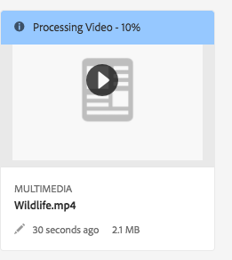

# Video{#video}

Questa sezione descrive come lavorare con i video in Dynamic Media.

## Avvio rapido: Video {#quick-start-videos}

The following step-by-step workflow description is designed to help you get up and running quickly with adaptive video sets in Dynamic Media. Dopo ogni passaggio sono presenti riferimenti incrociati alle intestazioni degli argomenti in cui è possibile trovare ulteriori informazioni.

>[!NOTE]
>
>Prima di lavorare con i video in Dynamic Media, accertatevi che l&#39;amministratore AEM abbia già attivato e configurato i servizi Dynamic Media Cloud.
>
>* See [Configuring Dynamic Media Cloud Services](/help/assets/dynamic-media/config-dm.md#configuring-dynamic-media-cloud-services) in Configuring Dynamic Media and [Troubleshooting Dynamic Media](/help/assets/dynamic-media/troubleshoot-dm.md).

>


1. **Upload your Dynamic Media videos** by doing the following:

   * Create your own video encoding profile. Or, you can simply use the predefined _Adaptive Video Encoding_ profile that comes with Dynamic Media.

      * [Creating a video encoding profile](/help/assets/dynamic-media/video-profiles.md#creating-a-video-encoding-profile-for-adaptive-streaming).
      * Ulteriori informazioni sulle [procedure ottimali per la codifica](#best-practices-for-encoding-videos)video.
   * Associate the video processing profile to one or more folders where you are going to upload your primary source videos.

      * [Applying a video profile to folders](/help/assets/dynamic-media/video-profiles.md#applying-a-video-profile-to-folders).
      * Ulteriori informazioni sulle [procedure ottimali per l&#39;organizzazione delle risorse digitali per l&#39;utilizzo dei profili](/help/assets/dynamic-media/best-practices-for-file-management.md)di elaborazione.
      * Ulteriori informazioni sull’ [organizzazione delle risorse](/help/assets/organize-assets.md)digitali.
   * Caricate i video sorgente principali nelle cartelle. Potete caricare file video fino a 15 GB ciascuno. Quando aggiungete dei video alla cartella, questi vengono codificati in base al profilo di elaborazione video assegnato alla cartella.

      * [Caricate i video](/help/assets/manage-video-assets.md#upload-and-preview-video-assets).
      * Ulteriori informazioni sui formati [di file di input](/help/assets/file-format-support.md)supportati.
   * Monitorate l’avanzamento [della codifica](#monitoring-video-encoding-and-youtube-publishing-progress) video dalla visualizzazione della risorsa o del flusso di lavoro.


1. **Per gestire i video** Dynamic Media, effettuate una delle seguenti operazioni:

   * Organizzare, sfogliare ed effettuare ricerche nelle risorse video

      * [Organizzazione delle risorse](/help/assets/organize-assets.md)digitali Ulteriori informazioni sulle [procedure ottimali per l’organizzazione delle risorse digitali per l’utilizzo dei profili di elaborazione](/help/assets/dynamic-media/best-practices-for-file-management.md)

      * [Ricerca di risorse](/help/assets/search-assets.md#custompredicates) video o [Ricerca di risorse](/help/assets/manage-digital-assets.md#search-assets)
   * Anteprima e pubblicazione delle risorse video

      * Visualizzate il video sorgente e le rappresentazioni codificate del video insieme alle miniature associate:
         [Anteprima dei video](/help/assets/manage-video-assets.md#upload-and-preview-video-assets) o [Anteprima delle risorse](/help/assets/dynamic-media/previewing-assets.md)
         [Gestione delle rappresentazioni video](/help/assets/manage-digital-assets.md#managing-renditions)


<!-- Commented video-renditions.md as the file is not published yet and will lead to broken link.
        * View the source video and encoded renditions of the video along with its associated thumbnails:
          [Previewing videos](/help/assets/manage-video-assets.md#upload-and-preview-video-assets) or [Previewing assets](/help/assets/dynamic-media/previewing-assets.md)
          [Viewing video renditions](/help/assets/video-renditions.md)
          [Managing video renditions](/help/assets/manage-digital-assets.md#managing-renditions) -->

    * [Gestisci predefiniti visualizzatore](/help/assets/dynamic-media/managing-viewer-presets.md)
    * [Pubblicazione delle risorse](/help/assets/dynamic-media/publishing-dynamicmedia-assets.md)
    
    * Utilizzare i metadati video

<!--      * View the properties of an encoded video rendition such as frame rate, audio and video bitrate, and codec:
          [Viewing video rendition properties](/help/assets/video-renditions.md) -->

    * Modificate le proprietà del video come titolo, descrizione e tag, campi di metadati personalizzati:
    [Modifica delle proprietà video](/help/assets/manage-digital-assets.md#editing-properties)
    
    * [Gestione dei metadati per le risorse digitali](/help/assets/manage-metadata.md)
    * [schemi di metadati](/help/assets/metadata-schemas.md)
    
    * Rivedere, approvare e annotare video e mantenere il controllo
    
    completo della versione* [Annotazione dei video](/help/assets/manage-video-assets.md#annotate-video-assets) o [Annotazione delle risorse](/help/assets/manage-digital-assets.md#Annotating)
    
    * [Creazione di una versione](/help/assets/manage-digital-assets.md#asset-versioning)
    * [Avvio di un flusso di lavoro su una risorsa](/help/assets/manage-digital-assets.md#start-a-workflow-on-an-asset)

<!-- Removing assets-workflow.md file link as it is not applicable anymore. Workflows are replaced by processing profiles.
        * [Creating a version](/help/assets/manage-digital-assets.md#asset-versioning)
        * [Applying workflows to assets](/help/assets/assets-workflow.md) or see [Starting a workflow on an asset](/help/assets/manage-digital-assets.md#starting-a-workflow-on-an-asset)
-->

    * [Rivedi risorse cartella](/help/assets/bulk-approval.md)
    * [Progetti](/help/sites-cloud/authoring/projects/overview.md)

1. **Pubblicate i video** Dynamic Media effettuando una delle seguenti operazioni:

   * Se utilizzate  Adobe Experience Manager come sistema WCM (Web Content Management), potete aggiungere video direttamente alle pagine Web.

      * [Aggiunta di video alle pagine](/help/assets/dynamic-media/adding-dynamic-media-assets-to-pages.md)Web.
   * Se utilizzate un sistema di gestione dei contenuti Web di terze parti, potete collegare o incorporare video nelle pagine Web.

      * Integrare video con l’URL:
         [Collegamento di URL all’applicazione web](/help/assets/dynamic-media/linking-urls-to-yourwebapplication.md).

      * Integrare video utilizzando il codice da incorporare nella pagina Web:
         [Incorporamento del visualizzatore video in una pagina](/help/assets/dynamic-media/embed-code.md)Web.
   * [Pubblicazione di video su YouTube](#publishing-videos-to-youtube).
   * [Generating video reports](#viewing-video-reports).

   * [Adding captions to video](#adding-captions-to-video).


## Working with video in Dynamic Media {#working-with-video-in-dynamic-media}

Video in Dynamic Media is an end-to-end solution that makes it easy to publish high-quality Adaptive Video for streaming across multiple screens, including desktop, iOS, Android, Blackberry, and Windows mobile devices. Un set video adattivo raggruppa versioni dello stesso video codificate con diversi bitrate e formati quali 400, 800 e 1000 kbps. The desktop computer or mobile device detects the available bandwidth.

For example, on an iOS mobile device, it detects a bandwidth such as 3G, 4G, or Wi-Fi. Quindi, seleziona automaticamente il video con la codifica corretta tra i vari bitrate video presenti nel set video adattivo. The video is streamed to desktops, mobile devices, or tablets.

In addition, video quality is dynamically switched automatically if network conditions change on the desktop or on the mobile device. Also, if a customer enters full-screen mode on a desktop, the Adaptive Video Set responds by using a better resolution, thereby improving the customer’s viewing experience. Using Adaptive Video Sets provides you with the best possible playback for customers playing Dynamic Media video on multiple screens and devices.

The logic that a video player uses to determine which encoded video to play or to select during playback is based on the following algorithm:

1. Il lettore video carica il frammento video iniziale in base al bitrate più vicino al valore impostato per il bitrate iniziale nel lettore stesso.
1. Video player switches based on changes to the bandwidth speed using the following criteria:

   1. Player picks the highest bandwidth stream below or equal to the estimated bandwidth.
   1. Il lettore considera solo l&#39;80% della larghezza di banda disponibile. Tuttavia, se sta cambiando, è più conservativo solo al 70% per evitare sopravvalutazioni e tornare immediatamente indietro.

For detailed technical information about the algorithm, see [https://android.googlesource.com/platform/frameworks/av/+/master/media/libstagefright/httplive/LiveSession.cpp](https://android.googlesource.com/platform/frameworks/av/+/master/media/libstagefright/httplive/LiveSession.cpp)

For managing single video and Adaptive Video Sets, the following is supported:

* Uploading video from numerous supported video formats and audio formats and encoding video to MP4 H.264 format for playback across multiple screens. You can use predefined adaptive video presets, single video encoding presets, or customize your own encoding to control the quality and size of the video.

   * When an adaptive video set is generated, it includes MP4 videos.
   * **Note**: Primary/source videos are not added to an Adaptive Video Set.

* Video captioning in all HTML5 video viewers.
* Organize, browse, and search video with full metadata support for efficient management of video assets.
* Deliver Adaptive Video Sets to the web as well as to desktops, and mobile devices, including the iPhone, iPad, Android, Blackberry, and Windows phone.

Adaptive video streaming is supported on a variety of iOS platforms. See [Scene7 Viewers Reference Guide](https://marketing.adobe.com/resources/help/en_US/s7/viewers_ref/c_html5_video_reference.html).

Dynamic Media supports mobile video playback for MP4 H.264 video. You can find Blackberry devices that support this video format at the following: [Supported video formats on Blackberry](https://support.blackberry.com/kb/articleDetail?ArticleNumber=000005482).

Per un elenco dei dispositivi Windows che supportano questo formato video, consultate: [Formati video supportati su Windows Phone](https://msdn.microsoft.com/library/windows/apps/ff462087%28v=vs.105%29.aspx)

* Play back the video using Dynamic Media Video Viewer Presets, including the following:

   * Single video viewers.
   * Mixed Media viewers that combine both video and image content.

* Configurate i lettori video per soddisfare le vostre esigenze di branding.
* Integrare video nel sito Web, nel sito mobile o nell’applicazione mobile con un semplice URL o codice da incorporare.

See [Dynamic video playback](https://s7d9.scene7.com/s7/uvideo.jsp?asset=GeoRetail/Mop_AVS&amp;config=GeoRetail/Universal_Video1&amp;stageSize=640,480) sample.

See also [Viewers for AEM and Scene7](https://marketing.adobe.com/resources/help/en_US/s7/viewers_ref/c_html5_s7_aem_asset_viewers.html) and [Viewers for AEM assets only](https://marketing.adobe.com/resources/help/en_US/s7/viewers_ref/c_html5_aem_asset_viewers.html) in the Adobe Scene7 Viewers Reference Guide.

## Best practice: Using the HTML5 video viewer {#best-practice-using-the-html-video-viewer}

I predefiniti per visualizzatori video Dynamic Media HTML5 sono lettori video affidabili. You can use them to avoid many common issues that are associated with HTML5 video playback and issues associated with mobile devices such as lack of adaptive streaming delivery and limited desktop browser reach.

On the design side of the player, you can design all of the video player’s functionality using standard web development tools. For example, you can design the buttons, controls, and custom poster image background using HTML5 and CSS to help you reach your customers with a customized appearance.

On the playback side of the viewer, it automatically detects the browser’s video capability. It then serves the video using HLS (HTTP Live Streaming), also known as adaptive video streaming. Oppure, se tali metodi di consegna non sono presenti, viene utilizzato lo progressivo HTML5.

Combinando in un singolo lettore la possibilità di progettare i componenti di riproduzione in HTML5 e CSS, di usufruire di riproduzione incorporata e di utilizzare lo streaming adattativo e progressivo a seconda delle funzionalità del browser, i contenuti multimediali potranno essere visti dagli utenti desktop e mobili e potranno così godere di un’esperienza video ottimizzata.

Consultate anche [I visualizzatori](https://marketing.adobe.com/resources/help/en_US/s7/viewers_ref/c_html5_viewers_about.html) HTML5 nella guida di riferimento dei visualizzatori Adobe Scene7.

### Riproduzione di video su computer desktop e dispositivi mobili mediante il visualizzatore video HTML5 {#playback-of-video-on-desktop-computers-and-mobile-devices-using-the-html-video-viewer}

For desktop and mobile adaptive video streaming, the videos used for bit rate switching are based on all MP4 videos in the Adaptive Video Set.

Video playback occurs using either HLS or progressive video download. In prior versions of AEM, such as 6.0, 6.1, and 6.2, videos were streamed over HTTP.

However, in AEM 6.3 and on, videos are now streamed over HTTPS (that is, HLS) because the DM gateway service URL always uses HTTPS as well. Note that there is no customer impact in this default behavior. That is, video streaming will always occur over HTTPS unless it is not supported by the browser. (see the following table). Quindi,

* If you have an HTTPS website with HTTPS video streaming, streaming is fine.
* If you have an HTTP website with HTTPS video streaming, streaming is fine and there are no mixed content issues from the web browser.

HLS is an Apple standard for adaptive video streaming that automatically adjusts playback based on network bandwidth capacity. It also lets the customer “seek” to any point in the video without the need to wait for the rest of the video to download.

Progressive video is delivered by downloading and storing the video locally on a user’s desktop system or mobile device.

The following table describes the device, browser, and playback method of videos on desktop computers and mobile devices using the Scene7 Video Viewer.

<table>
 <tbody>
  <tr>
   <td><strong>Dispositivo</strong></td>
   <td><strong>Browser</strong></td>
   <td><strong>Video playback mode</strong></td>
  </tr>
  <tr>
   <td>Desktop</td>
   <td>Internet Explorer 9 e 10</td>
   <td>Progressive download.</td>
  </tr>
  <tr>
   <td>Desktop</td>
   <td>Internet Explorer 11+</td>
   <td>On Windows 8 and Windows 10 - Force use of HTTPS whenever HLS is requested. Known limitation: HTTP on HLS does not work in this browser/operating system combination<br /> <br /> On Windows 7 - Progressive download. Utilizza la logica standard per selezionare il protocollo HTTP rispetto a HTTPS.</td>
  </tr>
  <tr>
   <td>Desktop</td>
   <td>Firefox 23-44</td>
   <td>Progressive download.</td>
  </tr>
  <tr>
   <td>Desktop</td>
   <td>Firefox 45 or later</td>
   <td>HLS</td>
  </tr>
  <tr>
   <td>Desktop</td>
   <td>Chrome</td>
   <td>HLS</td>
  </tr>
  <tr>
   <td>Desktop</td>
   <td>Safari (Mac)</td>
   <td>HLS</td>
  </tr>
  <tr>
   <td>Mobile</td>
   <td>Chrome (Android 6 or earlier)</td>
   <td>Progressive download.</td>
  </tr>
  <tr>
   <td>Mobile</td>
   <td>Chrome (Android 7 or later)</td>
   <td>HLS</td>
  </tr>
  <tr>
   <td>Mobile</td>
   <td>Android (default browser)</td>
   <td>Progressive download.</td>
  </tr>
  <tr>
   <td>Mobile</td>
   <td>Safari (iOS)</td>
   <td>HLS</td>
  </tr>
  <tr>
   <td>Mobile</td>
   <td>Chrome (iOS)</td>
   <td>HLS</td>
  </tr>
  <tr>
   <td>Mobile</td>
   <td>Blackberry</td>
   <td>HLS</td>
  </tr>
 </tbody>
</table>

## Architecture of Dynamic Media video solution {#architecture-of-dynamic-media-video-solution}

The following graphic shows the overall authoring workflow of videos that are uploaded and encoded by way of DMGateway (in Dynamic Media Hybrid mode) and made available for public consumption.


## Architettura di pubblicazione ibrida per i video {#hybrid-publishing-architecture-for-videos}


## Best practices for encoding videos {#best-practices-for-encoding-videos}

Se hai attivato gli elementi multimediali dinamici e hai impostato Cloud Services per i video flusso di lavoro, **Codifica video elementi multimediali dinamici** ti consente di eseguire la codifica dei video. Questo flusso di lavoro acquisisce la cronologia del processo del flusso di lavoro e le informazioni di errore. Consulta la sezione [Monitoraggio della codifica video e stato della pubblicazione su YouTube](#monitoring-video-encoding-and-youtube-publishing-progress). Se hai attivato gli elementi multimediali dinamici e hai impostato Cloud Services per i video, il flusso di lavoro **[!UICONTROL Codifica video elementi multimediali dinamici]** viene applicato automaticamente al momento di caricare un video. Se non utilizzi gli elementi multimediali dinamici, viene applicato il flusso di lavoro **[!UICONTROL Risorsa di aggiornamento DAM]**.

The following are best-practice tips for encoding source video files.

For advice about video encoding, see the following:

* [Streaming 101: The Basics — Codecs, Bandwidth, Data Rate, and Resolution](https://www.adobe.com/go/learn_s7_streaming101_en).
* [Nozioni di base sulla codifica video](https://www.adobe.com/go/learn_s7_encoding_en).

### File video sorgente {#source-video-files}

When you encode a video file, use a source video file of the highest possible quality. Avoid using previously encoded video files because these files are already compressed, and further encoding creates a subpar quality video.

The following table describes the recommended size, aspect ratio, and minimum bit rate that your source video files should have before you encode them:

| Dimensione | Proporzioni | Bitrate minimo |
|--- |--- |--- |
| 1024x768 | 4:3 | 4500 kbps for most videos. |
| 1280x720 | 16:9 | 3000 - 6000 kbps, depending on the amount of motion in the video. |
| 1920 X 1080 | 16:9 | 6000 - 8000 kbps, depending on the amount of motion in the video. |

### Obtaining a file&#39;s metadata {#obtaining-a-file-s-metadata}

You can obtain a file’s metadata by viewing its metadata using a video editing tool, or using an application designed for obtaining metadata. Seguono istruzioni per l’utilizzo di MediaInfo, un’applicazione di terze parti che consente di ottenere i metadati di un file video:

1. Vai a questa pagina Web: [https://mediainfo.sourceforge.net/en/Download](https://mediainfo.sourceforge.net/en/Download).
1. Selezionate e scaricate il programma di installazione per la versione GUI, quindi seguite le istruzioni di installazione.
1. Dopo l’installazione, fate clic con il pulsante destro del mouse sul file video (solo Windows) e selezionate MediaInfo oppure aprite MediaInfo e trascinate il file video nell’applicazione. Vengono visualizzati tutti i metadati associati al file video, inclusi larghezza, altezza e fotogrammi al secondo.

### Proporzioni {#aspect-ratio}

Quando scegliete o create un predefinito di codifica video per il file video sorgente principale, accertatevi che il predefinito abbia le stesse proporzioni del file video sorgente principale. The aspect ratio is the ratio of the width to the height of the video.

Per determinare le proporzioni di un file video, ottenete i metadati del file e prendete nota dei valori di larghezza e altezza (consultate Ottenimento dei metadati di un file sopra). Then use this formula to determine the aspect ratio:

width/height = aspect ratio

Nella tabella seguente è illustrato come i risultati della formula si traducono in scelte di proporzioni comuni:

| Formula result | Proporzioni |
|--- |--- |
| 1.33 | 4:3 |
| 0.75 | 3:4 |
| 1.78 | 16:9 |
| 0.56 | 9:16 |

Ad esempio, un video di 1440 larghezza x 1080 altezza ha proporzioni pari a 1440/1080 o 1,33. In questo caso, scegliete un predefinito di codifica video con proporzioni 4:3 per codificare il file video.

### Bitrate {#bitrate}

Bitrate è la quantità di dati codificati per creare un secondo di riproduzione video. Il bitrate viene misurato in kilobit al secondo (Kbps).

>[!NOTE]
>
>Poiché tutti i codec usano la compressione con perdita di dati, il bitrate è il fattore più importante nella qualità video. Con la compressione con perdita di dati, più comprimete un file video, più la qualità viene ridotta. For this reason, all other characteristics being equal (the resolution, frame rate, and codec), the lower the bitrate, the lower the quality of the compressed file.

When selecting a bitrate encoding, there are two types you can choose:

* **[!UICONTROL Codifica]** a bitrate costante (CBR) - Durante la codifica CBR, il bitrate o il numero di bit al secondo viene mantenuto invariato durante tutto il processo di codifica. La codifica CBR persiste quando la velocità dati impostata viene impostata sull’intero video. Inoltre, la codifica CBR non ottimizza i file multimediali per la qualità, ma consente di risparmiare spazio di archiviazione.
Usate CBR se il video contiene un livello di movimento simile per l’intero video. CBR è utilizzato soprattutto per lo streaming di contenuti video. Consultate anche [Utilizzo di parametri](/help/assets/dynamic-media/video-profiles.md#using-custom-added-video-encoding-parameters)di codifica video personalizzati.

* **[!UICONTROL Codifica]** a bitrate variabile (VBR) - La codifica VBR regola la velocità dati verso il basso e il limite superiore impostato, in base ai dati richiesti dal compressore. Ciò significa che durante un processo di codifica VBR il bitrate del file multimediale aumenta o diminuisce dinamicamente in base alle esigenze del bitrate dei file multimediali.
La codifica VBR richiede più tempo, ma produce i risultati più favorevoli; la qualità del file multimediale è superiore. VBR è utilizzato soprattutto per la distribuzione http progressiva dei contenuti video.

Quando utilizzare VBR e CRB?
Quando si tratta di selezionare VBR e CBR, si consiglia quasi sempre di utilizzare VBR per i file multimediali. VBR offre file di qualità superiore con bitrate competitivi. Quando usate il VBR, accertatevi di utilizzarlo con una codifica a due passate e impostate il bitrate massimo su 1,5 volte il bitrate video di destinazione.

Quando scegliete un predefinito di codifica video, prendete in considerazione la velocità di connessione dell’utente finale di destinazione. Scegliete un predefinito con una velocità dati pari all’80% di quella velocità. Ad esempio, se la velocità di connessione dell’utente finale di destinazione è di 1000 Kbps, il predefinito migliore è uno con una velocità dati video di 800 Kbps.

Questa tabella descrive la velocità dati delle velocità di connessione tipiche.

| Velocità (Kbps) | Tipo di connessione |
|--- |--- |
| 256 | Connessione remota. |
| 800 | Connessione mobile tipica. Per questa connessione, eseguite il targeting di una velocità dati compresa tra 400 e 800 per esperienze 3G. |
| 2000 | Connessione desktop tipica a banda larga. Per questa connessione, eseguite il targeting di una velocità dati nell&#39;intervallo 800-2000 Kbps, con una media di 1200-1500 Kbps per la maggior parte delle destinazioni. |
| 5000 | Connessione a banda larga elevata tipica. La codifica in questo intervallo superiore non è consigliata perché la maggior parte dei consumatori non può distribuire video a questa velocità. |

### Risoluzione {#resolution}

**La risoluzione **descrive l&#39;altezza e la larghezza di un file video, in pixel. La maggior parte dei video sorgente viene memorizzata ad alta risoluzione (ad esempio, 1920 x 1080). Per lo streaming, il video sorgente viene compresso in una risoluzione più piccola (640 x 480 o inferiore).

La risoluzione e la velocità dati sono due fattori strettamente correlati che determinano la qualità video. Per mantenere la stessa qualità video, più elevato è il numero di pixel in un file video (più alta è la risoluzione), più alta deve essere la velocità dati. Ad esempio, considerate il numero di pixel per fotogramma in una risoluzione 320x240 e un file video con risoluzione 640x480:

| Risoluzione | Pixel per fotogramma |
|--- |--- |
| 320 x 240 | 76,800 |
| 640 x 480 | 307,200 |

Il file da 640x480 ha quattro volte più pixel per fotogramma. Per ottenere la stessa velocità dati per queste due risoluzioni, occorre applicare una compressione quattro volte maggiore al file da 640x480, riducendo la qualità del video. Pertanto, una velocità dati video di 250 Kbps produce una visualizzazione di alta qualità a una risoluzione di 320 x 240, ma non a una risoluzione di 640 x 480.

In generale, maggiore è la velocità dati utilizzata, migliore sarà l’aspetto del video e maggiore sarà la risoluzione utilizzata, maggiore sarà la velocità dati necessaria per mantenere la qualità di visualizzazione (rispetto a risoluzioni più basse).

Poiché risoluzione e velocità dati sono collegati, durante la codifica video sono disponibili due opzioni:

* Scegliete una velocità dati e quindi effettuate la codifica alla risoluzione più elevata, in base alla velocità dati scelta.
* Scegliete una risoluzione e quindi effettuate la codifica alla velocità dati necessaria per ottenere video di alta qualità alla risoluzione scelta.

Quando scegliete (o create) un predefinito di codifica video per il file video sorgente principale, usate questa tabella per ottenere la risoluzione corretta:

| Risoluzione | Altezza (pixel) | Dimensione schermo |
|--- |--- |--- |
| 240p | 240 | Schermo molto piccolo |
| 300p | 300 | Schermo piccolo tipico per dispositivi mobili |
| 360p | 360 | Schermo piccolo |
| 480p | 480 | Schermo medio |
| 720p | 720 | Schermo grande |
| 1080p | 1080 | Schermo grande ad alta definizione |

### Fps (fotogrammi al secondo) {#fps-frames-per-second}

Negli Stati Uniti e in Giappone, la maggior parte dei video è riprodotta a 29,97 fotogrammi al secondo (fps); in Europa, la maggior parte dei video viene riprodotta a 25 fps. I film sono ripresi a 24 fps.

Scegliete un predefinito di codifica video con un valore fps pari a quello del file video sorgente principale. Ad esempio, se il video sorgente principale è 25 fps, scegliete un predefinito di codifica da 25 fps. Per impostazione predefinita, per tutte le codifiche personalizzate viene utilizzato il valore fps del file video sorgente principale. Per questo motivo, non è necessario specificare l’impostazione fps quando create un predefinito di codifica video.

### Dimensioni di codifica video {#video-encoding-dimensions}

Per risultati ottimali, selezionate dimensioni di codifica tali che il video sorgente sia un multiplo intero di tutti i video codificati.

Per calcolare questo rapporto, dividete la larghezza sorgente per la larghezza codificata per ottenere il rapporto di larghezza. Quindi, dividete l’altezza sorgente per l’altezza codificata per ottenere il rapporto di altezza.

Se il rapporto risultante è un numero intero, significa che il video viene ridimensionato in modo ottimale. Se il rapporto risultante non è un numero intero, influisce sulla qualità del video e gli artefatti di pixel superflui vengono visualizzati. Questo effetto è particolarmente evidente quando il video contiene del testo.

Ad esempio, supponete che il video sorgente sia 1920 x 1080. Nella tabella seguente, i tre video codificati forniscono le impostazioni di codifica ottimali da usare.

| Tipo video | Larghezza x altezza | Rapporto larghezza | Rapporto altezza |
|--- |--- |--- |--- |
| Origine | 1920x1080 | 1 | 1 |
| Codificato | 960 x 540 | 2 | 2 |
| Codificato | 640 x 360 | 3 | 3 |
| Codificato | 480 x 270 | 4 | 4 |

### Formato di file video codificato {#encoded-video-file-format}

Dynamic Media consiglia di utilizzare i predefiniti di codifica video MP4 H.264. Poiché i file MP4 utilizzano il codec video H.264, il video è di alta qualità ma la dimensione file è ridotta.

## Pubblicazione di video su YouTube {#publishing-videos-to-youtube}

Potete pubblicare risorse video AEM locali direttamente su un canale YouTube precedentemente creato.

Per pubblicare le risorse video su YouTube, potete impostare AEM Assets con tag. Potete associare questi tag a un canale YouTube. Se il tag di una risorsa video corrisponde al tag di un canale YouTube, il video viene pubblicato su YouTube. La pubblicazione su YouTube avviene insieme alla normale pubblicazione del video, purché venga utilizzato un tag associato.

YouTube esegue la propria codifica. Pertanto, il file video originale caricato in AEM viene pubblicato su YouTube invece di qualsiasi rappresentazione video creata dalla codifica di Dynamic Media. Anche se non è necessario elaborare i video con Dynamic Media, è probabile che lo faranno qualora sia necessario un predefinito per visualizzatori per la riproduzione.

Se si bypassa il profilo di elaborazione video e lo si pubblica direttamente su YouTube, significa semplicemente che la risorsa video in Risorse AEM potrebbe non ottenere una miniatura visualizzabile. Significa anche che i video non codificati non funzioneranno con nessuno dei tipi di risorse Dynamic Media.

La pubblicazione di risorse video sui server YouTube comporta l’esecuzione delle seguenti attività per garantire l’autenticazione sicura da server a server con YouTube:

1. [Configurazione delle impostazioni di Google Cloud](#configuring-google-cloud-settings)
1. [Creazione di un canale YouTube](#creating-a-youtube-channel)
1. [Aggiunta di tag per la pubblicazione](#adding-tags-for-publishing)
1. [Abilitazione dell&#39;agente di replica di pubblicazione di YouTube](#enabling-the-youtube-publish-replication-agent)
1. [Configurazione di YouTube in AEM](#setting-up-youtube-in-aem)
1. [(Facoltativo) Automatizzare l’impostazione delle proprietà predefinite di YouTube per i video caricati](#optional-automating-the-setting-of-default-youtube-properties-for-your-uploaded-videos)
1. [Pubblicazione di video sul canale YouTube](#publishing-videos-to-your-youtube-channel)
1. [(Facoltativo) Verifica del video pubblicato su YouTube](/help/assets/dynamic-media/video.md#optional-verifying-the-published-video-on-youtube)
1. [Collegamento degli URL di YouTube all’applicazione Web](#linking-youtube-urls-to-your-web-application)

Potete anche [annullare la pubblicazione dei video per rimuoverli da YouTube](#unpublishing-videos-to-remove-them-from-youtube).

### Configurazione delle impostazioni di Google Cloud {#configuring-google-cloud-settings}

Per pubblicare contenuti su YouTube, è necessario un account Google. Se avete un account GMAIL allora avete già un account Google; se non avete un account Google, potete facilmente crearne uno. L’account è necessario perché sono necessarie le credenziali per pubblicare le risorse video su YouTube. Se avete già creato un account, saltate questa attività e passate direttamente a [Creazione di un canale](#creating-a-youtube-channel)YouTube.

L&#39;account utilizzato con Google Cloud e l&#39;account Google utilizzato per YouTube non deve essere lo stesso.

Tenete presente che Google apporta periodicamente delle modifiche alla propria interfaccia utente. Di conseguenza, i passaggi per pubblicare i video su YouTube possono variare leggermente rispetto a quanto descritto di seguito. Questo avviso si applica anche a YouTube quando si tenta di verificare se i video sono caricati in esso.

>[!NOTE]
>
>I seguenti passaggi erano accurati al momento di questa scrittura. Tuttavia, Google aggiorna periodicamente i loro siti web senza preavviso. Di conseguenza, questi passaggi possono essere leggermente diversi.

Per configurare le impostazioni di Google Cloud:

1. Create un nuovo account Google.
   [https://accounts.google.com/SignUp?service=mail](https://accounts.google.com/SignUp?service=mail)

   Se disponete già di un account Google, passate al passaggio successivo.

1. Andate a [https://cloud.google.com/](https://cloud.google.com/).
1. Nella pagina Google Cloud, nell’angolo superiore destro, fai clic su **[!UICONTROL Console]**.

   Se necessario, potrebbe essere necessario **[!UICONTROL accedere]** utilizzando le credenziali dell&#39;account Google per visualizzare l&#39;opzione **[!UICONTROL Console]** .

1. Nella pagina Dashboard, a destra di **[!UICONTROL Google Cloud Platform]**, fai clic sull’elenco a discesa Progetto per aprire la finestra di dialogo Seleziona un progetto.
1. Nella finestra di dialogo Selezionare un progetto, toccate **[!UICONTROL Nuovo progetto]**.

   

1. Nella finestra di dialogo Nuovo progetto, digitare il nome del nuovo progetto nel campo Nome progetto.

   L&#39;ID progetto si basa sul nome del progetto. Scegliere con attenzione il nome del progetto; non può essere modificato dopo la creazione. Inoltre, dovrete immettere di nuovo lo stesso ID progetto quando successivamente avrete impostato YouTube in AEM; potrebbe voler annotarla.

1. Fai clic su **[!UICONTROL Crea]**.

1. Effettuate una delle seguenti operazioni:

   * Nel dashboard del progetto, nella scheda Guida introduttiva, toccate **[!UICONTROL Esplora e abilitate le API]**.
   * Nel dashboard del progetto, nella scheda API, toccate **[!UICONTROL Vai alla panoramica]** delle API.

   

1. Nella parte superiore della pagina API e servizi, toccate **[!UICONTROL Abilita API e servizi]**.
1. Nella pagina Libreria API, a sinistra, nella sezione **[!UICONTROL Categoria]**, toccate **[!UICONTROL YouTube]**. Sul lato destro della pagina, toccate **[!UICONTROL YouTube Data API]**.
1. Nella pagina YouTube Data API v3, toccate **[!UICONTROL Abilita]**.

   

1. Per utilizzare l&#39;API, potrebbero essere necessarie delle credenziali. Se necessario, fate clic su **[!UICONTROL Crea credenziali]**.

   

1. Nella pagina **[!UICONTROL Aggiungi credenziali al progetto]** , punto 1, eseguite le seguenti operazioni:

   * Da **[!UICONTROL quale API utilizzi?]** dall&#39;elenco a discesa, selezionate **[!UICONTROL YouTube Data API v3]**.

   * Da **[!UICONTROL dove chiamerete l&#39;API?]** elenco a discesa, selezionate Server **[!UICONTROL Web (ad esempio, node.js, Tomcat)]**

   * From the **[!UICONTROL What data will you be accessing?]** dall&#39;elenco a discesa, toccate Dati **** utente.

   

1. Toccare **[!UICONTROL Quali credenziali sono necessarie?]**
1. Inserisci un nome univoco nel campo Nome della pagina **[!UICONTROL Add credentials to your project (Aggiungi credenziali alla pagina del progetto)]**, al passaggio 2, sotto l’intestazione **[!UICONTROL Create an OAuth 2.0 client ID (Crea un ID client OAuth 2.0)]**. Oppure puoi utilizzare il nome predefinito specificato da Google.
1. Nell’intestazione Origini **[!UICONTROL Javascript]** Autorizzate, nel campo di testo, immettere il percorso seguente, sostituendo il proprio dominio e numero di porta nel percorso, quindi premere **[!UICONTROL Invio]** per aggiungere il percorso all’elenco:

   `https://<servername.domain>:<port_number>`

   Esempio, `https://1a2b3c.mycompany.com:4321`

   **Nota**: Gli esempi di percorso riportati sopra sono destinati esclusivamente a scopo illustrativo.

   

1. Nell&#39;intestazione URIs **[!UICONTROL di reindirizzamento]** autorizzati, nel campo di testo, immettere il percorso seguente, sostituendo il proprio dominio e numero di porta nel percorso, quindi premere **[!UICONTROL Invio]** per aggiungere il percorso all&#39;elenco:

   `https://<servername.domain>:<port_number>/etc/cloudservices/youtube.youtubecredentialcallback.json`

   Esempio, `https://1a2b3c.mycompany.com:4321/etc/cloudservices/youtube.youtubecredentialcallback.json`

   **Nota**: L’esempio di percorso riportato sopra è solo a scopo illustrativo.

1. Fate clic su **[!UICONTROL Crea ID]** client OAuth.
1. Nella pagina **[!UICONTROL Add credentials to your project (Aggiungi credenziali al progetto)]**, al passaggio 3, vai all’intestazione **[!UICONTROL Set up the OAuth 2.0 consent screen (Imposta la schermata di autorizzazione OAuth 2.0)]** e seleziona l’indirizzo e-mail di Gmail che è in uso.

   

1. Sotto il nome del **[!UICONTROL prodotto visualizzato all’intestazione degli utenti]** , nel campo di testo, immettete ciò che desiderate visualizzare nella schermata del consenso.

   La schermata di consenso viene visualizzata all’amministratore AEM quando esegue l’autenticazione su YouTube; AEM contatterà YouTube per l’autorizzazione.

1. Fate clic su **[!UICONTROL Continua]**.
1. Nella pagina Add credentials to your project (Aggiungi credenziali al progetto), passaggio 4, nell’intestazione **[!UICONTROL Download credentials (Scarica credenziali)]**, tocca **[!UICONTROL Download]**.

   

1. Salvate il `client_id.json` file.

   Sarà necessario questo file json scaricato quando si configura YouTube  Adobe Experience Manager successivo.

1. Fate clic su **[!UICONTROL Fine]**.

   Esci dal tuo account Google. Ora creerete un canale YouTube.

### Creazione di un canale YouTube {#creating-a-youtube-channel}

Per pubblicare i video su YouTube è necessario disporre di uno o più canali. Se avete già creato un canale YouTube, potete saltare questa attività e passare all&#39; [Aggiunta di tag per la pubblicazione](/help/assets/dynamic-media/video.md#adding-tags-for-publishing).

>[!CAUTION]
>
>Accertatevi di aver già impostato uno o più canali in YouTube *prima* di aggiungere i canali in Impostazioni YouTube in AEM (consultate [Configurazione di YouTube in AEM](#setting-up-youtube-in-aem) di seguito). In caso contrario, non viene visualizzato alcun avviso di nessun canale esistente. Tuttavia, l&#39;autenticazione Google continua a verificarsi quando aggiungete un canale, ma non è possibile scegliere quale canale viene inviato.

Per creare un canale YouTube:

1. Andate a [https://www.youtube.com](https://www.youtube.com/) ed effettuate l&#39;accesso utilizzando le credenziali del vostro account Google.
1. Nell&#39;angolo superiore destro della pagina di YouTube, fai clic sull&#39;immagine del profilo (può anche apparire come una lettera all&#39;interno di un cerchio colorato in tinta unita), quindi fai clic sulle impostazioni **[!UICONTROL di]** YouTube (icona circolare a forma di ingranaggio).
1. Nella pagina Panoramica, sotto l’intestazione Funzioni aggiuntive, fai clic su **[!UICONTROL Visualizza tutti i canali o crea un nuovo canale]**.
1. Nella pagina Canali, fai clic su **[!UICONTROL Crea un nuovo canale]**.
1. Nella pagina Account marchio, nel campo Nome account marchio, immettete un nome commerciale o un altro nome di canale scelto per pubblicare le risorse video, quindi fate clic su **[!UICONTROL Crea]**.

   Ricorda il nome immesso qui perché dovrai immetterlo di nuovo quando configuri YouTube in AEM.

1. (Facoltativo) Se necessario, aggiungete altri canali.

   A questo punto potrete aggiungere dei tag per la pubblicazione.

### Aggiunta di tag per la pubblicazione {#adding-tags-for-publishing}

Per pubblicare i video su YouTube, AEM associa i tag a uno o più canali YouTube. Per aggiungere tag per la pubblicazione, consultate [Amministrazione dei tag](/help/sites-cloud/authoring/features/tags.md).

Oppure, se intendete utilizzare i tag predefiniti in AEM, potete saltare questa attività e passare a [Abilitazione dell&#39;agente](#enabling-the-youtube-publish-replication-agent)di replica di pubblicazione di YouTube.

### Abilitazione dell&#39;agente di replica di pubblicazione di YouTube {#enabling-the-youtube-publish-replication-agent}

Dopo aver attivato l&#39;agente di replica di pubblicazione di YouTube, se desiderate testare la connessione all&#39;account Google Cloud, toccate **[!UICONTROL Test della connessione]**. Una scheda del browser visualizza i risultati della connessione. Se avete aggiunto Canali di YouTube, un elenco di tali canali viene visualizzato come parte del test.

1. Fai clic sul logo AEM nell’angolo in alto a sinistra di AEM, quindi seleziona **[!UICONTROL Strumenti]** > **[!UICONTROL Deployment]** > **[!UICONTROL Replica]** > **[!UICONTROL Agenti per creazione]** dalla barra a sinistra.
1. Nella pagina Agenti di autore, fate clic su **[!UICONTROL YouTube Publish (youtube)]**.
1. Nella barra degli strumenti, a destra di Impostazioni, fate clic su **[!UICONTROL Modifica]**.
1. Selezionare la casella di controllo **[!UICONTROL Abilitato]** per attivare l&#39;agente di replica.
1. Fai clic su **[!UICONTROL OK]**. 

   A questo punto YouTube verrà configurato in AEM.

### Setting up YouTube in AEM {#setting-up-youtube-in-aem}

A partire da AEM 6.4, è stato introdotto un nuovo metodo di interfaccia utente touch per configurare la pubblicazione su YouTube all’interno di AEM. In base all’istanza installata di AEM in uso, effettua una delle seguenti operazioni:

* Per configurare YouTube nelle versioni di AEM antecedenti alla 6.4, consulta la sezione [Configurazione di YouTube in AEM prima della versione 6.4](/help/assets/dynamic-media/video.md#setting-up-youtube-in-aem-before).
* Per configurare YouTube in AEM 6.4 o versione successiva, consultate [Configurazione di YouTube in AEM 6.4 e versioni successive](#setting-up-youtube-in-aem-and-later).

#### Configurazione di YouTube in AEM 6.4 e versioni successive {#setting-up-youtube-in-aem-and-later}

1. Assicuratevi di accedere all’istanza di Dynamic Media come amministratore.
1. Nell’angolo in alto a sinistra di AEM, tocca il logo AEM, quindi sulla barra a sinistra tocca **[!UICONTROL Strumenti]**(icona a forma di martello) > **[!UICONTROL Cloud Services]** > **[!UICONTROL Configurazione pubblicazione su YouTube]**.
1. Toccate **[!UICONTROL globale]** (non selezionatelo).

1. Near the upper-right corner of the global page, tap **[!UICONTROL Create]**.
1. Nella pagina Crea configurazione YouTube, seleziona Impostazioni piattaforma Google Cloud, quindi immetti l’ID progetto Google nel campo **[!UICONTROL Nome applicazione]**.

   Hai specificato l&#39;ID progetto quando hai inizialmente configurato le impostazioni di Google Cloud in precedenza.
Lasciate aperta la pagina Crea configurazione YouTube; ritornerete su di esso tra un momento.

   

1. Utilizzando un editor di testo normale, aprite il file JSON scaricato e salvato in precedenza nell&#39;attività [Configurazione delle impostazioni](/help/assets/dynamic-media/video.md#configuring-google-cloud-settings)di Google Cloud.
1. Selezionate e copiate l’intero testo JSON.
1. Torna alla finestra di dialogo Impostazioni account YouTube. Nel campo **[!UICONTROL Configurazione JSON]**, incolla il testo JSON.
1. Near the upper-right corner of the page, tap **[!UICONTROL Save]**.

   Ora configurerete i canali YouTube in AEM.

1. Toccate **[!UICONTROL Aggiungi canale]**.
1. In the Channel Name field, enter the name of the channel that you created in the task **[!UICONTROL Adding one or more channels to YouTube]** earlier.

   Se necessario, potete aggiungere una descrizione.

1. Toccate **[!UICONTROL Aggiungi]**.
1. Viene visualizzata l&#39;autenticazione YouTube/Google. Se non hai ancora effettuato l&#39;accesso all&#39;account Google Cloud, salta questo passaggio.

   * Immettete il nome utente e la password Google associati all’ID progetto Google e il testo JSON sopra.
   * A seconda di quanti canali l’account dispone di due o più elementi. Selezionate un canale. non selezionate l’indirizzo e-mail; non è un canale.
   * Nella pagina successiva, toccate **[!UICONTROL Accetta]** per consentire l’accesso a questo canale.

1. Toccate **[!UICONTROL Consenti]**.

   Ora verranno impostati i tag per la pubblicazione.

1. **[!UICONTROL Impostazione dei tag per la pubblicazione]** - Nella pagina Servizi cloud > YouTube, toccate l&#39;icona a forma di matita per modificare l&#39;elenco dei tag da utilizzare.
1. Toccate l’icona dell’elenco a discesa (verso il basso) per visualizzare l’elenco dei tag disponibili in AEM.
1. Toccate uno o più tag per aggiungerli.

   Per eliminare un tag aggiunto, selezionatelo e toccate **[!UICONTROL X]**.

1. Dopo aver aggiunto i tag desiderati, toccate **[!UICONTROL Salva]**.

   Ora potete pubblicare i video sul vostro canale YouTube.

#### Configurazione di YouTube in AEM prima della 6.4 {#setting-up-youtube-in-aem-before}

1. Assicuratevi di accedere all’istanza di Dynamic Media come amministratore.

1. Nell’angolo in alto a sinistra di AEM, tocca il logo AEM, quindi nella barra a sinistra tocca **[!UICONTROL Strumenti]** (icona a forma di martello) > **[!UICONTROL Distribuzione]** > **[!UICONTROL Cloud Services]**.
1. Sotto l&#39;intestazione Servizi di terze parti, sotto YouTube, tocca **[!UICONTROL Configura ora]**.
1. Nella finestra di dialogo Crea configurazione, immettete un titolo (obbligatorio) e un nome (facoltativo) nei rispettivi campi.
1. Toccate **[!UICONTROL Crea]**.
1. Nella finestra di dialogo Impostazioni account di YouTube, immetti l’ID progetto Google nel campo **[!UICONTROL Nome applicazione]**.

   Hai specificato l&#39;ID progetto al momento della [configurazione iniziale delle impostazioni](/help/assets/dynamic-media/video.md#configuring-google-cloud-settings) Google Cloud.
Lasciate aperta la finestra di dialogo Impostazioni account di YouTube; ritornerete su di esso tra un momento.

1. Utilizzando un editor di testo normale, aprite il file JSON scaricato e salvato in precedenza nell&#39;attività Configurazione delle impostazioni di Google Cloud.
1. Selezionate e copiate l’intero testo JSON.
1. Torna alla finestra di dialogo Impostazioni account YouTube. Nel campo **[!UICONTROL Configurazione JSON]**, incolla il testo JSON.
1. Toccate **[!UICONTROL OK]**.

   Ora configurerete i canali YouTube in AEM.

1. A destra di **[!UICONTROL Canali disponibili]**, tocca **+** (icona del segno più).
1. Nella finestra di dialogo Impostazioni canale YouTube, fai clic sul campo Titolo e immetti il nome del canale creato nell’attività precedente **[!UICONTROL Aggiunta di uno o più canali a YouTube]**.

   Se necessario, potete aggiungere una descrizione.

1. Toccate **[!UICONTROL OK]**.
1. Viene visualizzata l&#39;autenticazione YouTube/Google. Se non hai ancora effettuato l&#39;accesso all&#39;account Google Cloud, salta questo passaggio.

   * Immettete il nome utente e la password Google associati all’ID progetto Google e il testo JSON sopra.
   * A seconda di quanti canali l’account dispone di due o più elementi. Selezionate un canale. non selezionate l’indirizzo e-mail; non è un canale.
   * Nella pagina successiva, toccate **[!UICONTROL Accetta]** per consentire l’accesso a questo canale.

1. Toccate **[!UICONTROL Consenti]**.

   Ora verranno impostati i tag per la pubblicazione.

1. **[!UICONTROL Impostazione dei tag per la pubblicazione]** - Nella pagina Servizi cloud > YouTube, toccate l&#39;icona a forma di matita per modificare l&#39;elenco dei tag da utilizzare.
1. Toccate l’icona dell’elenco a discesa (verso il basso) per visualizzare l’elenco dei tag disponibili in AEM.
1. Toccate uno o più tag per aggiungerli.

   Per eliminare un tag aggiunto, selezionatelo e toccate **X**.

1. Dopo aver aggiunto i tag desiderati, toccate **[!UICONTROL OK]**.

   Ora potete pubblicare i video sul vostro canale YouTube.

### (Facoltativo) Automatizzare l’impostazione delle proprietà predefinite di YouTube per i video caricati {#optional-automating-the-setting-of-default-youtube-properties-for-your-uploaded-videos}

Facoltativamente potete automatizzare l’impostazione delle proprietà di YouTube al caricamento dei video. A questo scopo, in AEM è possibile creare un profilo di elaborazione metadati.

Per creare il profilo di elaborazione dei metadati, devi prima copiare i valori dai campi **[!UICONTROL Etichetta campo]**, **[!UICONTROL Mappa su proprietà]** e **[!UICONTROL Scelte]**, tutti disponibili in Schemi metadati per i video. Quindi, puoi aggiungere i valori per creare il tuo profilo di elaborazione dei metadati video di YouTube.

Per automatizzare l’impostazione delle proprietà predefinite di YouTube per i video caricati:

1. Nell’angolo in alto a sinistra di AEM, tocca il logo AEM, quindi nella barra a sinistra fai clic su **[!UICONTROL Strumenti]** (icona a forma di martello) > **[!UICONTROL Risorse]** > **[!UICONTROL Schemi di metadati]**.
1. Click **[!UICONTROL default]**. (Non aggiungere un segno di spunta alla casella di selezione a sinistra di &quot;default&quot;).
1. Nella pagina **[!UICONTROL predefinita]**, seleziona la casella a sinistra del **[!UICONTROL video]**, quindi fai clic su **Modifica]**.
1. Nella pagina Editor schema metadati, fate clic sulla scheda **[!UICONTROL Avanzate]** .
1. Nell’intestazione Pubblicazione su YouTube, fai clic su **[!UICONTROL Categoria YouTube]**.
1. Sul lato destro della pagina, nella scheda **[!UICONTROL Impostazioni]** , effettuate le seguenti operazioni:

   * Nel campo di testo **[!UICONTROL Mappa sulla proprietà]** , selezionate e copiate il valore.
Incollate il valore copiato nell’editor di testo aperto. Questo valore sarà necessario in seguito, al momento della creazione del profilo di elaborazione dei metadati. Lasciate aperto l’editor di testo.

   * In **[!UICONTROL Scelte]**, selezionate e copiate il valore predefinito che desiderate utilizzare (ad esempio Persone e blog o Scienza e tecnologia).
Incollate il valore copiato nell’editor di testo aperto. Questo valore sarà necessario in seguito, al momento della creazione del profilo di elaborazione dei metadati. Lasciate aperto l’editor di testo.

1. Under the YouTube Publishing heading, click **[!UICONTROL YouTube Privacy]**.
1. Sul lato destro della pagina, nella scheda **[!UICONTROL Impostazioni]** , effettuate le seguenti operazioni:

   * Nel campo di testo **[!UICONTROL Mappa sulla proprietà]** , selezionate e copiate il valore.
Incollate il valore copiato nell’editor di testo aperto. Questo valore sarà necessario in seguito, al momento della creazione del profilo di elaborazione dei metadati. Lasciate aperto l’editor di testo.

   * In **[!UICONTROL Scelte]**, selezionare e copiare il valore predefinito che si desidera utilizzare. Tenere presente che le opzioni sono raggruppate in coppie di due. Il campo inferiore della coppia è il valore predefinito che si desidera copiare, ad esempio pubblico, non elencato o privato.
Incollate il valore copiato nell’editor di testo aperto. Questo valore sarà necessario in seguito, al momento della creazione del profilo di elaborazione dei metadati. Lasciate aperto l’editor di testo.

1. Nell’angolo superiore destro della pagina Editor schema metadati, fate clic su **[!UICONTROL Annulla]**.
1. Nell’angolo in alto a sinistra di AEM, tocca il logo AEM, quindi nella barra a sinistra fai clic su **[!UICONTROL Strumenti]** (icona a forma di martello) > **[!UICONTROL Risorse]** > **[!UICONTROL Profili metadati]**.

1. Nella pagina Profili metadati, fate clic su **[!UICONTROL Crea]** nell’angolo in alto a destra della pagina.
1. Nella finestra di dialogo Aggiungi profilo metadati, vai al campo di testo **[!UICONTROL Titolo profilo]**, immetti il nome `YouTube Video` e fai clic su **[!UICONTROL Crea]**.
1. Nella pagina Editor profilo metadati, fate clic sulla scheda **[!UICONTROL Avanzate]** .
1. Aggiungete i valori di Pubblicazione su YouTube copiati al profilo effettuando le seguenti operazioni:

   * Sul lato destro della pagina, fare clic sulla scheda **[!UICONTROL Genera modulo]** .
   * (Facoltativo) Trascinare il componente **[!UICONTROL Intestazione]** sezione a sinistra e rilasciarlo nell’area del modulo.
   * (Optional) Click **[!UICONTROL Field Label]** to select the component.
   * (Facoltativo) Sul lato destro della pagina, nella scheda Impostazioni, immettere `YouTube Publishing`.
   * Click the **[!UICONTROL Build Form]** tab, then drag the component labeled **[!UICONTROL Multi Value Text]** and drop it below the **[!UICONTROL YouTube Publishing]** heading that you just created.

   * Click **[!UICONTROL Field Label** to select the component.
   * Sul lato destro della pagina, nella scheda Impostazioni, incollate i valori di Pubblicazione su YouTube (valore Etichetta campo e Mappa su valore proprietà) precedentemente copiati nei rispettivi campi del modulo. Incolla il valore di Scelte nel campo Valore predefinito.

1. Aggiungete i valori di privacy di YouTube copiati al profilo effettuando le seguenti operazioni:

   * Sul lato destro della pagina, fare clic sulla scheda **[!UICONTROL Genera modulo]** .
   * (Facoltativo) Trascinare il componente **[!UICONTROL Intestazione]** sezione a sinistra e rilasciarlo nell’area del modulo.
   * (Optional) Click **[!UICONTROL Field Label]** to select the component.
   * (Facoltativo) Sul lato destro della pagina, nella scheda Impostazioni, immettere `YouTube Privacy`.
   * Click the **[!UICONTROL Build Form]** tab, then drag the component labeled **[!UICONTROL Multi Value Text]** and drop it below the **[!UICONTROL YouTube Privacy]** heading you just created.

   * Click **[!UICONTROL Field Label]** to select the component.
   * Sul lato destro della pagina, nella scheda Impostazioni, incollate i valori di Pubblicazione su YouTube (valore Etichetta campo e Mappa su valore proprietà) precedentemente copiati nei rispettivi campi del modulo. Incolla il valore di Scelte nel campo Valore predefinito.

1. Fai clic su **[!UICONTROL Salva]** nell’angolo superiore destro della pagina.
1. Applicate il profilo di metadati Pubblicazione su YouTube alle cartelle in cui desiderate caricare i video. Dovrete avere sia il profilo metadati che il profilo video impostato.

   Consulta le sezioni [Profili di metadati](/help/assets/metadata-profiles.md) e [Profili video](/help/assets/dynamic-media/video-profiles.md).

### Pubblicazione di video sul canale YouTube {#publishing-videos-to-your-youtube-channel}

A questo punto potete associare i tag aggiunti in precedenza alle risorse video. Questo processo consente ad AEM di sapere quali risorse pubblicare sul canale YouTube.

>[!NOTE]
>
>La pubblicazione immediata non viene automaticamente pubblicata su YouTube. Quando si imposta Dynamic Media, è possibile scegliere tra due opzioni di pubblicazione: **[!UICONTROL Immediatamente]** o **[!UICONTROL All’attivazione]**.
>
>**[!UICONTROL Pubblica Immediatamente]** significa che la risorsa caricata, una volta sincronizzata con IPS, viene pubblicata automaticamente nel sistema di distribuzione. Anche se questo è vero per Dynamic Media, non è vero per YouTube. Per pubblicare contenuti su YouTube, devi pubblicarli tramite AEM Author.

>[!NOTE]
>
>Per pubblicare contenuti da YouTube, AEM utilizza il flusso di lavoro **[!UICONTROL Pubblica su YouTube]** , che consente di monitorare l’avanzamento e visualizzare eventuali informazioni sugli errori.
>
>Consulta la sezione [Monitoraggio della codifica video e stato della pubblicazione su YouTube](#monitoring-video-encoding-and-youtube-publishing-progress).
>
>Per informazioni più dettagliate sullo stato di avanzamento, potete monitorare il registro di YouTube nella replica. Tuttavia, tale monitoraggio richiede l&#39;accesso dell&#39;amministratore.

Per pubblicare i video sul canale YouTube:

1. In AEM, individuate una risorsa video da pubblicare sul canale YouTube.
1. Selezionate la risorsa video (il set video adattivo).
1. Sulla barra degli strumenti, fare clic su **[!UICONTROL Proprietà]**.
1. Nella scheda Base, nell’intestazione Metadati, fate clic su **[!UICONTROL Apri finestra di dialogo]** di selezione a destra del campo Tag.
1. Nella pagina Seleziona tag, individuate i tag da usare e selezionate uno o più tag.

   I tag devono essere associati al canale YouTube.

1. In the upper-right corner of the page, click **[!UICONTROL Select]**.
1. Nell’angolo superiore destro della pagina delle proprietà del video, fate clic su **[!UICONTROL Salva e chiudi]**.
1. Nella barra degli strumenti, fate clic su **[!UICONTROL Pubblicazione]** rapida.

   Consultate anche [Utilizzo della gestione della pubblicazione con i AEM Sites](https://helpx.adobe.com/experience-manager/kt/sites/using/publication-management-feature-video-use.html).

   Facoltativamente, potete verificare il video pubblicato sul canale YouTube.

### (Facoltativo) Verifica del video pubblicato su YouTube {#optional-verifying-the-published-video-on-youtube}

Facoltativamente potete monitorare l’avanzamento della pubblicazione su YouTube (o dell’annullamento della pubblicazione).

Consulta la sezione [Monitoraggio della codifica video e stato della pubblicazione su YouTube](#monitoring-video-encoding-and-youtube-publishing-progress).

I tempi di pubblicazione possono variare notevolmente a seconda dei numerosi fattori che includono il formato del video sorgente principale, la dimensione del file e il traffico di caricamento. Il processo di pubblicazione può richiedere da qualche minuto a diverse ore. Inoltre, tenete presente che il rendering di formati con risoluzione più elevata avviene molto più lentamente. Ad esempio, 720p e 1080p richiedono un tempo di visualizzazione notevolmente maggiore rispetto a 480p.

Dopo otto ore se viene ancora visualizzato un messaggio di stato con la dicitura **[!UICONTROL Caricato (elaborazione, attendere)]**, provate a rimuovere il video dal nostro sito e a caricarlo di nuovo.

### Linking YouTube URLs to your Web Application {#linking-youtube-urls-to-your-web-application}

Potete ottenere una stringa URL di YouTube generata da Dynamic Media dopo la pubblicazione del video. Quando copiate l’URL di YouTube, questo viene inserito negli Appunti e può quindi essere incollato nelle pagine del sito Web o dell’applicazione.

>[!NOTE]
>
>L’URL di YouTube non è disponibile per la copia finché non avete pubblicato la risorsa video su YouTube.

Per collegare gli URL di YouTube all’applicazione Web:

1. Andate alla risorsa video pubblicata *di* YouTube di cui desiderate copiare l’URL, quindi selezionatela.

   Remember that YouTube URLs are only available to copy *after* you have first *published* the video assets to YouTube.

1. Sulla barra degli strumenti, fare clic su **[!UICONTROL Proprietà]**.
1. Click the **[!UICONTROL Advanced]** tab.
1. In Pubblicazione su YouTube, nell’elenco URL di YouTube, selezionate e copiate il testo dell’URL nel browser Web per visualizzare l’anteprima della risorsa o per aggiungerlo alla pagina del contenuto Web.

### Annullamento della pubblicazione di video per rimuoverli da YouTube {#unpublishing-videos-to-remove-them-from-youtube}

Quando annullate la pubblicazione di una risorsa video in AEM, il video viene rimosso da YouTube.

>[!CAUTION]
>
>Se rimuovete un video direttamente da YouTube, AEM non è consapevole e continua a comportarsi come se il video fosse ancora pubblicato su YouTube. Annullate sempre la pubblicazione di una risorsa video da YouTube tramite AEM.

>[!NOTE]
>
>Per rimuovere contenuti da YouTube, AEM utilizza il flusso di lavoro **[!UICONTROL Annulla pubblicazione da YouTube]** , che consente di monitorare l’avanzamento e visualizzare eventuali informazioni sugli errori.
>
>Consulta la sezione [Monitoraggio della codifica video e stato della pubblicazione su YouTube](#monitoring-video-encoding-and-youtube-publishing-progress).

Per annullare la pubblicazione di un video e rimuoverlo da YouTube:

1. Andate alle risorse video che desiderate annullare la pubblicazione dal canale YouTube.
1. In una modalità di selezione delle risorse, selezionate una o più risorse video pubblicate.
1. Sulla barra degli strumenti, fate clic su **[!UICONTROL Gestisci pubblicazione]**. Potrebbe essere necessario toccare l&#39;icona dei tre punti (. . . sulla barra degli strumenti per vedere **[!UICONTROL Gestisci pubblicazione]**.
1. Nella pagina Gestisci pubblicazione, toccate **[!UICONTROL Annulla pubblicazione]**.
1. In the upper-right corner of the page, tap **[!UICONTROL Next]**.
1. In the upper-right corner of the page, tap **[!UICONTROL Unpublish]**.

## Monitoring video encoding and YouTube publishing progress {#monitoring-video-encoding-and-youtube-publishing-progress}

Quando caricate un nuovo video in una cartella con codifica video applicata o pubblicate il video su Youtube, potete monitorare l’avanzamento (o il fallimento) della codifica video o della pubblicazione su Youtube in diversi modi. L&#39;avanzamento effettivo della pubblicazione su YouTube è disponibile solo tramite i file di registro, ma se non riesce o ha esito positivo è elencato in modi aggiuntivi descritti nella procedura seguente. Inoltre, potete ricevere notifiche e-mail quando un flusso di lavoro di pubblicazione YouTube o una codifica video viene completata o interrotta.

### Monitoraggio dei progressi {#monitoring-progress}

Per monitorare l’avanzamento (compresa la codifica non riuscita/Pubblicazione su YouTube):

1. Visualizzate l’avanzamento della codifica video nella cartella delle risorse:

   * Nella vista a schede, l&#39;avanzamento della codifica video viene visualizzato per percentuale sulla risorsa. In caso di errore, queste informazioni vengono visualizzate anche sulla risorsa.

   

   * In list view, video encoding progress displays in the **[!UICONTROL Processing Status]** column. In caso di errore, il messaggio viene visualizzato nella stessa colonna.

   

   Questa colonna non viene visualizzata per impostazione predefinita. Per abilitare la colonna, dal menu a discesa delle viste seleziona **[!UICONTROL Visualizza impostazioni]**, quindi aggiungi la colonna **[!UICONTROL Stato elaborazione]** e tocca o fai clic su **[!UICONTROL Aggiorna]**.

   

1. Visualizzare l’avanzamento nei dettagli della risorsa. Quando toccate o fate clic su una risorsa, aprite il menu a discesa e selezionate **[!UICONTROL Timeline]**. Per restringere il campo alle attività del flusso di lavoro come la codifica o la pubblicazione su YouTube, selezionate **[!UICONTROL Flussi di lavoro]**.

   

   Eventuali informazioni sul flusso di lavoro, come la codifica, vengono visualizzate nella timeline. Per la pubblicazione su YouTube, la timeline del flusso di lavoro include anche il nome del canale YouTube e l’URL del video di YouTube. Inoltre, una volta completata la pubblicazione, nella timeline del flusso di lavoro vengono visualizzate eventuali notifiche di errore.

   >[!NOTE]
   >
   >Potrebbero essere necessari tempi lunghi per la registrazione dei messaggi di errore/guasto, a causa della presenza di più configurazioni di flusso di lavoro nei **[!UICONTROL nuovi tentativi]**, di **[!UICONTROL ritardi dei tentativi]** e per **[!UICONTROL timeout]** su [https://localhost:4502/system/console/configMgr](https://localhost:4502/system/console/configMgr), ad esempio:
   >
   >    * Configurazione coda di lavoro Apache Sling
   >    * Gestore processo esterno flusso di lavoro Adobe Granite
   >    * Coda timeout flusso di lavoro Granite

   >
   >In queste configurazioni è possibile regolare le proprietà dei **[!UICONTROL nuovi tentativi]**, dei **[!UICONTROL tentativi ritardati]** e del **[!UICONTROL timeout]**.

1. Per i flussi di lavoro in corso, vedi l’opzione Istanze flusso di lavoro accedendo a **[!UICONTROL Strumenti]** > **[!UICONTROL Flusso]** di lavoro > **[!UICONTROL Istanze]**.

   >[!NOTE]
   >
   >Per accedere al menu **[!UICONTROL Strumenti]** potrebbe essere necessario disporre dei diritti amministrativi.

   

   Selezionate l’istanza e toccate o fate clic su **[!UICONTROL Apri cronologia]**.

   

   Nell’area Istanze flusso di lavoro potete inoltre sospendere, terminare o rinominare i flussi di lavoro. Per ulteriori informazioni, consulta [Gestione dei flussi di lavoro](/help/sites-cloud/authoring/workflows/overview.md) .

1. Per i processi non riusciti, consulta l’opzione Errori di flusso di lavoro, accessibile da **[!UICONTROL Strumenti]** > **[!UICONTROL Flusso di lavoro]** > **[!UICONTROL Errori]**. In **[!UICONTROL Errore flusso di lavoro]** sono elencate tutte le attività del flusso di lavoro che hanno generato errori.

   >[!NOTE]
   >
   >Per accedere al menu **[!UICONTROL Strumenti]** potrebbe essere necessario disporre dei diritti amministrativi.

   

   >[!NOTE]
   >
   >Potrebbero essere necessari tempi lunghi per la registrazione del messaggio di errore, a causa della presenza di più configurazioni di flusso di lavoro nei **[!UICONTROL nuovi tentativi]**, di **[!UICONTROL ritardi dei tentativi]** e per **[!UICONTROL timeout]** su [https://localhost:4502/system/console/configMgr](https://localhost:4502/system/console/configMgr), ad esempio:
   >
   >
   >
   >    * Configurazione coda di lavoro Apache Sling
   >    * Gestore processo esterno flusso di lavoro Adobe Granite
   >    * Coda timeout flusso di lavoro Granite

   >
   >
   >In queste configurazioni è possibile regolare le proprietà dei **[!UICONTROL nuovi tentativi]**, dei **[!UICONTROL tentativi ritardati]** e del **[!UICONTROL timeout]**.

1. Per i flussi di lavoro completati, consulta Archivio flussi di lavoro, accessibile da **[!UICONTROL Strumenti]** > **[!UICONTROL Flusso di lavoro]** > **[!UICONTROL Archivio]**. **[!UICONTROL Archivio flussi di lavoro]** elenca tutte le attività del flusso di lavoro che sono state completate.

   >[!NOTE]
   >
   >Per accedere al menu **[!UICONTROL Strumenti]** potrebbe essere necessario disporre dei diritti amministrativi.

   

1. Potete ricevere notifiche e-mail relative a processi di workflow interrotti o non riusciti. Queste notifiche e-mail possono essere configurate da un amministratore. See [Configuring email notifications](#configuring-e-mail-notifications).

<!-- EMAIL NOT AVAILABLE IN SKYLINE

#### Configuring e-mail notifications {#configuring-e-mail-notifications}

>[!NOTE]
>
>You may need administrative rights to access the **[!UICONTROL Tools]** menu.

How you configure notification depends on whether you want notifications for YouTube publishing jobs.

* For encoding jobs, you can access the configuration page for all AEM workflow email notifications at **[!UICONTROL Tools]** &gt; **[!UICONTROL Operations]** &gt; **[!UICONTROL Web Console]** and by searching for **[!UICONTROL Day CQ Workflow Email Notification Service]**. You can select or clear the check boxes for **[!UICONTROL Notify on Abort]** or **[!UICONTROL Notify on Complete]** accordingly.

For YouTube publishing jobs, do the following:

1. In AEM, tap **[!UICONTROL Tools]** &gt; **[!UICONTROL Workflow]** &gt; **[!UICONTROL Models]**.
1. On the Workflow Models page, select **[!UICONTROL Publish to YouTube]**, then tap **[!UICONTROL Edit]** on the toolbar.
1. Near the upper-right corner of the Publish to YouTube workflow page, tap **[!UICONTROL Edit]**.
1. Hover the mouse pointer on the YouTube Upload component, then tap once to display the inline toolbar.

   

1. On the inline toolbar, tap the Configuration icon (wrench). Click the **[!UICONTROL Arguments]** tab.

   

1. In the YouTube Upload Process - Step Properties dialog box, tap the **[!UICONTROL Arguments]** tab.

   

1. You can select or clear the following check boxes:

    * Publish Start
    * Publish Failure
    * Publish Completion - includes information on channels and URLs

   Clearing a check box means that you will not receive the specified email notification from the YouTube Publish workflow.

   >[!NOTE]
   >
   >These emails are specific to YouTube and are in addition to the generic workflow email notifications. As a result, you may receive two sets of email notification - the generic notification available in the **[!UICONTROL Day CQ Workflow Email Notification Service]** and one specific to YouTube depending on your configuration settings.

1. When you are finished, near the upper-right corner of the dialog box, tap the **[!UICONTROL Done]** icon (check mark).
1. On the Publish to YouTube workflow page, near the upper-right corner, tap **[!UICONTROL Sync]**.

-->

## Visualizzazione dei rapporti video {#viewing-video-reports}

>[!NOTE]
>
>I rapporti video sono disponibili solo quando si esegue Dynamic Media - Modalità ibrida.

I rapporti video mostrano diverse metriche aggregate in un determinato periodo di tempo per monitorare che *i video pubblicati *singoli e aggregati abbiano le stesse prestazioni previste. I seguenti dati delle metriche principali sono aggregati per tutti i video pubblicati nell’intero sito Web:

* Inizio video
* Percentuale completata
* Tempo medio su video
* Tempo totale su video
* Video per visita

È anche elencata una tabella di tutti i video *pubblicati* , per consentire di tenere traccia dei video visualizzati più in alto sul sito Web, in base al totale degli avvii video.

Quando toccate un nome video nell’elenco, questo mostra il rapporto di mantenimento (a discesa) del video sotto forma di grafico a linee. Il grafico mostra il numero di visualizzazioni per un dato momento di tempo durante la riproduzione del video. Quando si riproduce il video, la barra verticale tiene traccia della sincronizzazione con l’indicatore del tempo presente nel lettore. Le perdite nei dati del grafico a linee indicano dove il pubblico si allontana dal suo disinteresse.

Se il video è stato codificato al di fuori  Dynamic Media Adobe Experience Manager, il grafico a discesa di mantenimento dell&#39;audience e i dati Percentuale di riproduzione nella tabella non sono disponibili.

>[!NOTE]
>
>I dati di monitoraggio e reporting si basano esclusivamente sull’utilizzo del lettore video Dynamic Media e del relativo predefinito per lettori video. Non è quindi possibile tenere traccia e generare rapporti sui video riprodotti da altri lettori video.

Per impostazione predefinita, la prima volta che inserite i rapporti video, il rapporto mostra i dati video a partire dal primo del mese corrente e termina con la data del mese corrente. Tuttavia, puoi ignorare l’intervallo di date predefinito specificando il tuo intervallo di date. La volta successiva che immettete Rapporti video, viene utilizzato l’intervallo di date specificato.

Affinché i rapporti video funzionino correttamente, viene automaticamente creato un ID Suite di rapporti quando Dynamic Media Cloud Services è configurato. Allo stesso tempo, l’ID suite di rapporti viene inviato al server di pubblicazione in modo che sia disponibile per la funzione Copia URL quando visualizzate in anteprima le risorse. Tuttavia, questo richiede che il server di pubblicazione sia già configurato. Se il server di pubblicazione non è configurato, potete comunque pubblicare il rapporto video, ma dovrete tornare alla configurazione di Dynamic Media Cloud e toccare **[!UICONTROL OK]**.

Per visualizzare i rapporti video:

1. Nell’angolo in alto a sinistra di AEM, tocca il logo AEM, quindi, nella barra a sinistra, seleziona **[!UICONTROL Strumenti]** (icona a forma di martello) > **[!UICONTROL Risorse]** > **[!UICONTROL Rapporti video]**.
1. Nella pagina Rapporti video, effettuate una delle seguenti operazioni:

   * Nell&#39;angolo superiore destro, toccate l&#39;icona **[UICONTROL Aggiorna rapporto]** video.
È necessario utilizzare Aggiorna solo se la data di fine del rapporto è il giorno corrente. In questo modo, potrai vedere il tracciamento video che si è verificato dall’ultima volta che hai eseguito il rapporto.

   * Vicino all&#39;angolo superiore destro, toccate l&#39;icona **[UICONTROL Date Picker]** (Selettore data UICONTROL).
Specificate l’intervallo di date iniziale e finale per il quale desiderate i dati video, quindi toccate **[!UICONTROL Esegui rapporto]**.

   La casella del gruppo Metriche principali identifica diverse misurazioni aggregate per tutti i *video pubblicati *in tutto il sito.

1. Nella tabella in cui sono elencati i primi video pubblicati, toccate un nome video per riprodurre il video e visualizzate il rapporto (a discesa) di mantenimento dell’audience del video.

### Visualizzazione di rapporti video basati su un visualizzatore video creato con l’SDK per visualizzatori HTML5 di Scene7 {#viewing-video-reports-based-on-a-video-viewer-that-you-created-using-the-scene-hmtl-viewer-sdk}

Se utilizzate un visualizzatore video fornito da Dynamic Media o se avete creato un predefinito per visualizzatori basato su un visualizzatore video preconfigurato, non è necessario effettuare ulteriori passaggi per visualizzare i rapporti video. Tuttavia, se avete creato un visualizzatore video personalizzato basato sull’SDK per visualizzatori HTML5 di Scene7, effettuate le seguenti operazioni per assicurarvi che il visualizzatore video invii eventi di tracciamento ad Dynamic Media Video Reports.

Per creare visualizzatori video personalizzati, usate Scene7 HTML5 Viewers Reference e Scene7 HTML5 Viewers SDK.

Consultate Guida [di riferimento visualizzatori di](https://marketing.adobe.com/resources/help/en_US/s7/viewers_ref/index.html)Scene7.

<!-- 

SDK ONLY AVAILABLE INTERNALLY NOW

Download the Scene7 HTML Viewer SDK from Adobe Developer Connection.

See [Adobe Developer Connection](https://help.adobe.com/en_US/scene7/using/WSef8d5860223939e2-43dedf7012b792fc1d5-8000.html).

-->

Per visualizzare i rapporti sui video basati su un visualizzatore video creato con l’SDK per visualizzatori HTML5 di Scene7:

1. Passate a qualsiasi risorsa video pubblicata.
1. Seleziona **[!UICONTROL Visualizzatori]** dall’elenco a discesa dell’angolo in alto a sinistra della pagina della risorsa.
1. Selezionate un predefinito per visualizzatori video e copiate il codice da incorporare.
1. Nel codice da incorporare, trovate la riga con quanto segue:

   `videoViewer.setParam("config2", "<value>");`

   Il `config2` parametro abilita il tracciamento nei visualizzatori HTML5. È anche un predefinito specifico per la società che contiene le informazioni di configurazione per Video Reporting e per le configurazioni Adobe  Analytics specifiche per i clienti.

   Il valore corretto per il parametro config2 si trova sia nella funzione **[!UICONTROL Incorpora codice]** che in copia **[UICONTROL URL]**. Nell’URL dal comando di copia **[UICONTROL URL]**, il parametro da cercare è `&config2=<value>`. Il valore è quasi sempre `companypreset`, ma in alcuni casi può anche essere `companypreset-1`, `companypreset-2` e così via.

1. Nel codice del visualizzatore video personalizzato, aggiungete AppMeasurementBridge .jsp alla pagina del visualizzatore effettuando le seguenti operazioni:

   * Innanzitutto, stabilite se il `&preset` parametro è necessario.
Se il `config2` parametro è `companypreset`, non è necessario * `&preset=parameter`.
In caso `config2` contrario, impostate il parametro predefinito allo stesso modo del `config2` parametro. Ad esempio, se `config2=companypreset-2`, aggiungi `&param2=companypreset-2` all’URL AppMeasurementBridge.jsp.

   * Quindi, aggiungete lo script AppMeasurementBridge.jsp:
      `<script language="javascript" type="text/javascript" src="https://s7d1.scene7.com/s7viewers/AppMeasurementBridge.jsp?company=robindallas&preset=companypreset-2"></script>`

1. Create il componente TrackingManager effettuando le seguenti operazioni:

   * Dopo aver chiamato `s7sdk.Utils.init();` create un&#39;istanza TrackingManager per tenere traccia degli eventi aggiungendo quanto segue:
      `var trackingManager = new s7sdk.TrackingManager();`

   * Connetti i componenti a TrackingManager effettuando le seguenti operazioni:
Nel gestore di `s7sdk.Event.SDK_READY` eventi, allegare il componente che si desidera tracciare a TrackingManager.
Ad esempio, se il componente è `videoPlayer`, aggiungete
      `trackingManager.attach(videoPlayer);`
per allegare il componente a trackingManager. Per tenere traccia di più visualizzatori su una pagina, utilizzate più componenti di gestione del tracciamento.

   * Create l&#39;oggetto AppMeasurementBridge aggiungendo quanto segue:

      ```
      var appMeasurementBridge = new AppMeasurementBridge(); appMeasurementBridge.setVideoPlayer(videoPlayer);
      ```

   * Aggiungete la funzione di tracciamento aggiungendo quanto segue:

      ```
      trackingManager.setCallback(appMeasurementBridge.track,
       appMeasurementBridge);
      ```
   L&#39;oggetto appMeasurementBridge dispone di una funzione di tracciamento incorporata. Tuttavia, puoi fornire un supporto personalizzato per più sistemi di monitoraggio o altre funzionalità.

   Per ulteriori informazioni, consultate *Utilizzo del componente* TrackingManager nella guida utente dell’SDK per visualizzatori HTML5 di *Scene7, disponibile per il download da* Adobe Developer Connection [](https://help.adobe.com/en_US/scene7/using/WSef8d5860223939e2-43dedf7012b792fc1d5-8000.html).

## Aggiunta di sottotitoli a video {#adding-captions-to-video}

Per ampliare il pubblico potenziale dei vostri video nel mercato globale, potete aggiungere sottotitoli a singoli video o a set di video adattivi. Aggiungendo i sottotitoli si evita la necessità di doppiare l’audio o di utilizzare gli altoparlanti nativi per registrare nuovamente l’audio per ogni lingua diversa. Il video viene riprodotto nella lingua in cui è stato registrato. I sottotitoli in lingua straniera vengono visualizzati in modo da consentire agli utenti di lingue diverse di comprendere la porzione audio.

I sottotitoli consentono inoltre una maggiore accessibilità mediante l’uso di sottotitoli codificati per utenti non udenti o non udenti.

>[!NOTE]
>
>Il lettore video utilizzato deve supportare la visualizzazione delle didascalie.

Dynamic Media è in grado di convertire i file di sottotitoli in formato JSON (JavaScript Object Notation). Questa conversione consente di incorporare il testo JSON in una pagina Web come trascrizione nascosta ma completa del video. I motori di ricerca possono quindi individuare e indicizzare i contenuti per rendere i video più facilmente individuabili e fornire ai clienti ulteriori dettagli sul contenuto video.

Per ulteriori informazioni sull’utilizzo della funzione JSON in un URL, consultate [Serving static (non-image) contents (Distribuzione di contenuti](https://marketing.adobe.com/resources/help/en_US/s7/is_ir_api/is_api/c_serving_static_nonimage_contents.html) statici (non immagini)) nella guida *API di* Scene7 Image Serving.

**Per aggiungere sottotitoli o sottotitoli al video**

1. Usate un’applicazione o un servizio di terze parti per creare il file di sottotitoli o sottotitoli video.

   Verificate che il file creato sia conforme allo standard WebVTT (Web Video Text Tracks). L’estensione dei file di sottotitoli è .vtt. Per ulteriori informazioni sullo standard per sottotitoli WebVTT,

   Vedere [WebVTT: Il formato](https://dev.w3.org/html5/webvtt/)Web Video Text Tracks.

   Esistono strumenti e servizi gratuiti e avanzati che potete utilizzare per creare file di sottotitoli o sottotitoli all’esterno di Dynamic Media. Ad esempio, per creare un semplice file di sottotitoli video senza alcuno stile, potete utilizzare il seguente strumento online gratuito per la creazione e modifica di sottotitoli:

   [WebVTT Caption Maker](https://testdrive-archive.azurewebsites.net/Graphics/CaptionMaker/Default.html)

   Per risultati ottimali, usate lo strumento in Internet Explorer 9 o versione successiva, Google Chrome o Safari.

   Nello strumento, incolla l’URL copiato del file video nel campo **[!UICONTROL Enter URL of video file (Inserisci URL del file video)]**, infine fai clic su **[!UICONTROL Load (Carica)**. Consulta la sezione [Ottenere l’URL per una risorsa](/help/assets/dynamic-media/linking-urls-to-yourwebapplication.md#obtaining-a-url-for-an-asset) per conoscere l’URL del file video stesso, che potrai incollare nel campo **[!UICONTROL Enter URL of video file (Inserisci URL del file video)]**. A quel punto, Internet Explorer, Chrome o Safari possono riprodurre il video in modalità nativa.

   Seguite ora le istruzioni visualizzate dal sito per creare e salvare il file WebVTT. Al termine, copiate il contenuto del file dei sottotitoli e incollatelo in un editor di testo normale, quindi salvatelo con l’estensione .vtt.

   >[!NOTE]
   >
   >Per il supporto globale dei sottotitoli video in più lingue, tenete presente che lo standard WebVTT richiede la creazione di file .vtt e chiamate separati per ogni lingua da supportare.

   In genere, è consigliabile assegnare al file VTT dei sottotitoli lo stesso nome del file video, aggiungendo il suffisso con le impostazioni internazionali della lingua, ad esempio -EN, -FR, -DE e così via. In questo modo è possibile automatizzare la generazione degli URL video utilizzando il sistema di gestione dei contenuti Web esistente.

1. In AEM, caricate il file di sottotitoli WebVTT in DAM.
1. Andate alla risorsa video *pubblicata* che desiderate associare al file di sottotitoli che avete caricato.

   Gli URL sono disponibili per la copia solo *dopo* la prima *pubblicazione* delle risorse.

   Consultate [Pubblicazione delle risorse.](/help/assets/dynamic-media/publishing-dynamicmedia-assets.md)

1. Effettua una delle operazioni seguenti:

   * Per un’esperienza di visualizzazione con video a comparsa, toccate **[!UICONTROL URL]**. Nella finestra di dialogo URL, selezionate e copiate l’URL negli Appunti, quindi passate l’URL in un semplice editor di testo. Aggiungete l’URL del video copiato con la sintassi seguente:

      `&caption=<server_path>/is/content/<path_to_caption.vtt_file,1>`

      Osservate la `,1` parte finale del percorso della didascalia. Subito dopo l’estensione .vtt nel percorso, potete attivare o disattivare (disattivare) il pulsante dei sottotitoli nella barra del lettore video impostando `,1` o `,0`, rispettivamente.

   * Per un’esperienza di visualizzazione video incorporata, toccate **[!UICONTROL Incorpora codice]**. Nella finestra di dialogo Incorpora codice, selezionate e copiate il codice da incorporare negli Appunti, quindi incollate il codice in un semplice editor di testo. Aggiungete il codice da incorporare copiato con la sintassi seguente:

      `videoViewer.setParam("caption","<path_to_caption.vtt_file,1>");`

      Osservate la `,1` parte finale del percorso della didascalia. Subito dopo l’estensione .vtt nel percorso, potete attivare o disattivare (disattivare) il pulsante dei sottotitoli nella barra del lettore video impostando `,1` o `,0`, rispettivamente.

## Aggiunta di marcatori capitolo a video {#adding-chapter-markers-to-video}

Per semplificare la visualizzazione e la navigazione dei video di formato esteso, potete aggiungere marcatori capitolo a singoli video o a set video adattivi. Quando un utente riproduce il video, può fare clic sui marcatori capitolo nella timeline del video (detta anche cursore di scorrimento video) per navigare facilmente fino al punto di interesse oppure passare immediatamente a nuovi contenuti, dimostrazioni, esercitazioni e così via.

>[!NOTE]
>
>Il lettore video utilizzato deve supportare l’uso di marcatori di capitolo. I lettori video Dynamic Media supportano i marcatori capitolo, ma l&#39;utilizzo di lettori video di terze parti potrebbe non essere supportato.

Potete anche creare e personalizzare con capitoli il vostro visualizzatore video anziché utilizzare un predefinito per visualizzatori video. Per istruzioni su come creare un visualizzatore HTML5 con navigazione dei capitoli, nella guida Adobe Scene7 Viewer SDK for HTML5 fate riferimento all’intestazione &quot;Customizing Behavior Using Modifiers&quot; (Personalizzazione del comportamento mediante modificatori) nelle classi `s7sdk.video.VideoPlayer` e `s7sdk.video.VideoScrubber`. L’SDK per visualizzatori Adobe Scene7 può essere scaricato da [Adobe Developer Connection](https://help.adobe.com/en_US/scene7/using/WSef8d5860223939e2-43dedf7012b792fc1d5-8000.html).

Potete creare un elenco di capitoli per il video nello stesso modo in cui create le didascalie. In altre parole, potete creare un file WebVTT. Tuttavia, si noti che questo file deve essere separato da qualsiasi file di sottotitoli WebVTT eventualmente utilizzato; non è possibile combinare didascalie e capitoli in un unico file WebVTT.

È possibile utilizzare l&#39;esempio seguente come esempio del formato utilizzato per creare un file WebVTT con navigazione dei capitoli:

### File WebVTT con navigazione dei capitoli video {#webvtt-file-with-video-chapter-navigation}

```xml
WEBVTT
Chapter 1
00:00.000 --> 01:04.364
The bicycle store behind it all.
Chapter 2
01:04.364 --> 02:00.944
Creative Cloud.
Chapter 3
02:00.944 --> 03:02.937
Ease of management for a working solution.
Chapter 4
03:02.937 --> 03:35.000
Cost-efficient access to rapidly evolving technology.
```

Nell’esempio precedente, `Chapter 1` è l’identificatore del cue point ed è facoltativo. Il cue point di `00:00:000 --> 01:04:364` specifica il tempo iniziale e finale del capitolo, in `00:00:000` formato. Le ultime tre cifre sono millisecondi e, se preferite, possono essere lasciate come `000`. Il titolo del capitolo `The bicycle store behind it all` è la descrizione effettiva del contenuto del capitolo. L’identificatore del cue point, il cue point iniziale e il titolo del capitolo vengono visualizzati in un pop-up del lettore video quando un utente passa il puntatore del mouse su un cue point visivo nella timeline del video.

Poiché usate un visualizzatore video HTML5, accertatevi che il file dei capitoli creato segua lo standard WebVTT (Web Video Text Tracks). L’estensione del nome file del capitolo è .vtt. Per ulteriori informazioni sullo standard per sottotitoli WebVTT,

Vedere [WebVTT: Formato Tracce testo video Web](https://dev.w3.org/html5/webvtt/)

**Per aggiungere marcatori capitolo al video:**

1. Salvate il file .vtt in codifica UTF8 per evitare problemi con la rappresentazione dei caratteri nel titolo del capitolo.

   In genere, è consigliabile assegnare al file VTT dei capitoli lo stesso nome del file video, aggiungendo il suffisso captions. In questo modo è possibile automatizzare la generazione degli URL video utilizzando il sistema di gestione dei contenuti Web esistente.
1. In AEM, caricate il file WebVTT dei capitoli.

   Consulta [Caricamento delle risorse](/help/assets/manage-digital-assets.md#uploading-assets).

1. Effettua una delle operazioni seguenti:

   <table>
     <tbody>
      <tr>
       <td>Per un’esperienza visualizzatore video a comparsa</td>
       <td>
       <ol>
       <li>Andate alla risorsa <i>video </i>pubblicata che desiderate associare al file dei capitoli che avete caricato. Gli URL sono disponibili per la copia solo <i>dopo</i> la prima <i>pubblicazione</i> delle risorse. Consultate <a href="/help/assets/dynamic-media/publishing-dynamicmedia-assets.md">Pubblicazione delle risorse.</a></li>
       <li>Dal menu a discesa, fate clic o toccate <strong>Visualizzatori</strong>.</li>
       <li>Nella barra a sinistra, toccate o fate clic sul nome del predefinito per visualizzatori video. L’anteprima del video viene aperta in una pagina separata.</li>
       <li>Nella barra a sinistra, in basso, fate clic su <strong>URL</strong>.</li>
       <li>Nella finestra di dialogo URL, selezionate e copiate l’URL negli Appunti, quindi passate l’URL in un semplice editor di testo.</li>
       <li>Aggiungete l’URL del video copiato con la sintassi seguente per associarlo all’URL copiato al file del capitolo:<br /> <br /> <code>&navigation=<<i>full_copied_URL_path_to_chapter_file</i>.vtt></code><br /> </li>
       </ol> </td>
      </tr>
      <tr>
       <td>Per un’esperienza visualizzatore video incorporata<br /> </td>
       <td>
       <ol>
       <li>Andate alla risorsa <i>video </i>pubblicata che desiderate associare al file dei capitoli che avete caricato. Gli URL sono disponibili per la copia solo <i>dopo</i> la prima <i>pubblicazione</i> delle risorse. Consultate <a href="/help/assets/dynamic-media/publishing-dynamicmedia-assets.md">Pubblicazione delle risorse.</a></li>
       <li>Dal menu a discesa, fate clic o toccate <strong>Visualizzatori</strong>.</li>
       <li>Nella barra a sinistra, toccate o fate clic sul nome del predefinito per visualizzatori video. L’anteprima del video viene aperta in una pagina separata.</li>
       <li>Nella barra a sinistra, nella parte inferiore, fate clic su <strong>Incorpora</strong>.</li>
       <li>Nella finestra di dialogo Incorpora codice, selezionate e copiate l’intero codice negli Appunti, quindi incollatelo in un semplice editor di testo.</li>
       <li>Aggiungete il codice da incorporare del video con la sintassi seguente per associarlo all’URL copiato al file del capitolo:<br /> <br /> <code>videoViewer.setParam("navigation","&lt;<i>full_copied_URL_path_to_chapter_file</i>.vtt&gt;"</code></li>
       </ol> </td>
      </tr>
     </tbody>
   </table>

<!--

## About video thumbnails {#about-video-thumbnails}

A video thumbnail is a reduced-size version of a video frame or an image asset representing the video to the customer. The thumbnail should serve to encourage a customer to click on the video.

All videos in AEM must have an associated thumbnail; you cannot delete a thumbnail without replacing it. By default, when you upload a video to AEM, the first frame is used as the thumbnail. However, you can customize the thumbnail for branding purposes or visual search, for example. When you customize a video thumbnail, you can either play the video and pause on the frame you want to use, or you can select an image asset that you have already uploaded and *published* in your digital asset manager.

Note that a custom video thumbnail image that you select from a video is not extracted and saved in the DAM as a separate and distinct asset. However, a custom video thumbnail that you select from an existing image asset is saved to the JCR. The path of the selected asset gets stored under the video asset's node as in the following example path:

`/content/dam/*<folder_name*>/<*video_name*>/jcr:content/manualThumbnail`

The ability to customize a video thumbnail is only available after you have applied a video profile to the folder where the video is located.

### Adding a custom video thumbnail {#adding-a-custom-video-thumbnail}

1. Be sure you have already done the following:

    * Created a folder for your video assets.
    * [Applied a video profile to the folder](/help/assets/dynamic-media/video-profiles.md#applying-a-video-profile-to-folders).

    * [Uploaded your videos to the folder](/help/assets/manage-video-assets.md#upload-and-preview-video-assets).

1. Navigate to an uploaded video asset whose thumbnail image you want to change.
1. In asset selection mode either from **[!UICONTROL List View]** or **[!UICONTROL Card View]**, tap the video asset.
1. On the toolbar, tap the **[!UICONTROL Properties** icon (a circle with an "i" in it).
1. On the video's Properties page, tap **[!UICONTROL Change Thumbnail]**.
1. On the Change Thumbnail page, do one of the following:

    * To use a frame from the video as the new thumbnail:

        * On the toolbar, tap **[!UICONTROL Select Frame from video]**.
        * Tap the Play button, then tap the Pause button on the frame you want to capture as the video's new thumbnail.

    * To use an image asset as the new thumbnail:

        * On the toolbar, tap **[!UICONTROL Select Thumbnail from Assets]**.
        * Tap **[!UICONTROL Select Thumbnail]**.
        * Navigate to a previously uploaded and published image asset you want to use. Note that the asset will automatically be resized to serve as a thumbnail image for the video.
        * Select the image asset, then tap **[!UICONTROL Select]**.

1. On the Change Thumbnail page, tap **[!UICONTROL Save Change]**.
1. On the video's Properties page, in the upper-right corner, tap **[!UICONTROL Save & Close]**.

-->

<!--

## About video thumbnails in Dynamic Media Hybrid mode{#about-video-thumbnails-in-dynamic-media-hybrid-mode}

You can choose from one of ten thumbnail images automatically generated by Dynamic Media to add to your video. The video player displays your selected thumbnail when a video asset is used with the Dynamic Media component in the authoring environment of AEM Sites, AEM Mobile, or AEM Screens. The thumbnail serves as a static picture that best represents the contents of your entire video and further encourages users to click the Play button.

Based on the total time of the video, Dynamic Media captures ten (default) thumbnail images at 1%, 11%, 21%, 31%, 41%, 51%, 61%, 71%, 81%, and 91% into the video. The ten thumbnails persist meaning that if you decide to choose a different thumbnail later on, you do not need to regenerate the series. You preview the ten thumbnail images and then select the one you want to use with your video. If you want to change to default you can use CRXDE Lite to configure the time interval that thumbnail images are generated. For example, if you only wanted to generate a series of four evenly spaced thumbnail images from your video, you can configure the interval time at 24%, 49%, 74%, and 99%.

Ideally, you can add a video thumbnail anytime after you upload your video but before you publish the video on your website.

If you prefer, you can choose to upload a custom thumbnail to represent your video instead of using a thumbnail generated by Dynamic Media. For example, you could create a custom thumbnail image that has the title of your video, an eye-catching opening image, or a very specific image captured from your video. The custom video thumbnail image that you upload should have a maximum resolution of 1280 x 720 pixels (minimum width of 640 pixels) and be no larger than 2MB.

See also [About video thumbnails](/help/assets/dynamic-media/video.md#about-video-thumbnails-in-dynamic-media-scene-mode).

-->

<!--

### Adding a video thumbnail {#adding-a-video-thumbnail}

1. Navigate to an uploaded video asset that you want to add a video thumbnail.
1. In asset selection mode either from the List View or the Card View, tap the video asset.
1. On the toolbar, tap the **[!UICONTROL View Properties]** icon (a circle with an "i" in it).
1. On the video's Properties page, tap **[!UICONTROL Change Thumbnail]**.
1. On the Change Thumbnail page, on the toolbar, tap **[!UICONTROL Select Frame]**.

   Dynamic Media generates a series thumbnail images from your video, based on the default time interval or time interval you customized.

1. Preview the generated thumbnail images, then select the one you want to add to your video.
1. Tap **[!UICONTROL Save Change]**.

   The video's thumbnail image is updated to use the thumbnail you selected. If you later decide to change the thumbnail image, you can return to the **[!UICONTROL Change Thumbnail]** page and select a new one.

   If you configured new default time intervals, or you uploaded a new video to replace the existing video, you will need to have Dynamic Media regenerate the thumbnails.

   See [Configuring the default time interval that video thumbnails are generated](#configuring-the-default-time-interval-that-video-thumbnails-are-generated).

-->

<!--

#### Configuring the default time interval that video thumbnails are generated {#configuring-the-default-time-interval-that-video-thumbnails-are-generated}

When you configure and save the new default time interval, your change automatically applies only to videos that you upload in the future. It does not automatically apply the new default to videos that you previously uploaded. For existing videos, you must regenerate the thumbnails.

See [Adding a video thumbnail](#adding-a-video-thumbnail).

**To configure the default time interval that video thumbnails are generated,**

1. In AEM, tap **[!UICONTROL Tools]** &gt; **[!UICONTROL General]** &gt; **[!UICONTROL CRXDE Lite]**.

1. In the CRXDE Lite page, in the directory panel on the left, navigate t `o etc/dam/imageserver/configuration/jcr:content/settings.`

   if the directory panel is not visible, you may need to tap the &gt;&gt; icon to the left of the Home tab.

1. On the lower-right panel, in the Properties tab, double-tap `thumbnailtime`.
1. In the Edit thumbnailtime dialog box, use the text fields to enter interval values as percentages.

    * Tap the plus sign (+) icon to add one or more interval value fields. You may need to scroll to the bottom of the dialog box to see the icon.
    * Tap the minus sign (-) icon to the right of an interval value field to delete it from the list.
    * Tap the up arrow icon and the down arrow icon to reorder the interval values.

1. Tap **[!UICONTROL OK]** to return to the Properties tab.
1. Near the upper-left corner of the CRXDE Lite page, tap **[!UICONTROL Save All]**, then tap the Back Home icon in the upper-left corner to return to AEM.

   See [Adding a video thumbnail.](#adding-a-video-thumbnail)

-->

<!--

### Adding a custom video thumbnail {#adding-a-custom-video-thumbnail-1}

These steps apply only to Dynamic Media running in Hybrid mode.

T**o add a custom video thumbnail**,

1. Navigate to an uploaded video asset that you want to add a custom video thumbnail.
1. In asset selection mode either from the List View or the Card View, tap the video asset.
1. On the toolbar, tap the **[!UICONTROL View Properties]** icon (a circle with an "i" in it).
1. On the video's Properties page, tap **[!UICONTROL Change Thumbnail]**.
1. On the Change Thumbnail page, on the toolbar, tap **[!UICONTROL Upload New Thumbnail]**.
1. Navigate to a thumbnail image you want to use, select it, then tap **[!UICONTROL Open]** to begin uploading the image into AEM. Following the upload, be sure you publish the image.
1. After you have successfully uploaded and published the image, in the Change Thumbnail page, tap **[!UICONTROL Save Changes]**.

   The custom thumbnail is added to your video.

-->
