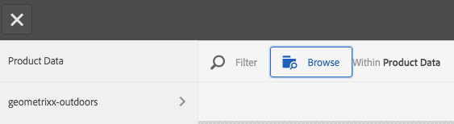

# Utilizzare i selettori in Dynamic Medie {#working-with-selectors}

Quando lavorate con un&#39;immagine interattiva, un video interattivo o un banner carosello, selezionate le risorse e i siti e i prodotti per i punti attivi e le mappe immagine a cui collegarvi. Quando si utilizzano i set di immagini, i set 360 gradi e i set multimediali, è possibile selezionare le risorse anche con il selettore risorse.

Questo argomento illustra come utilizzare i selettori Prodotto, Sito e Risorse, inclusa la possibilità di sfogliare, filtrare e ordinare all’interno dei selettori.

Puoi accedere ai selettori durante la creazione di set carosello, aggiungendo punti attivi e mappe immagine e creando video e immagini interattivi.

Ad esempio, in questo banner carosello, puoi utilizzare il selettore Prodotto se stai collegando un hotspot o una mappa immagine a una pagina Quickview. Utilizza il selettore Sito se stai collegando un punto attivo o una mappa immagine a un collegamento ipertestuale; utilizza il selettore Risorse quando crei una diapositiva.

Quando selezioni (anziché immettere manualmente) la posizione in cui si trovano i punti attivi o le mappe immagine, stai utilizzando il selettore. Il selettore Sito funziona solo se sei un [!DNL Adobe Experience Manager Sites] cliente. Il selettore di prodotto richiede inoltre [!DNL Experience Manager Commerce].

## Selezionare i prodotti in Dynamic Medie {#selecting-products}

Utilizza il selettore Prodotto per scegliere un prodotto quando desideri che un hotspot o una mappa immagine fornisca una Quickview a un prodotto specifico nel catalogo dei prodotti.

1. Passa al set carosello, all’immagine interattiva o al video interattivo e seleziona la **[!UICONTROL Azioni]** (disponibile solo se hai definito un punto attivo o una mappa immagine).

   Il selettore Prodotto è nel **[!UICONTROL Tipo di azione]** area.

   

1. Seleziona la **[!UICONTROL Selettore prodotti]** (lente di ingrandimento) e passare a un prodotto nel catalogo.

   

   Per filtrare per parola chiave o tag, tocca **[!UICONTROL Filtro]** e l&#39;immissione di parole chiave, la selezione di tag o entrambi.

   

   È possibile modificare la posizione [!DNL Experience Manager] cerca i dati di prodotto toccando **[!UICONTROL Sfoglia]** e passare a un’altra cartella.

   

   Seleziona **[!UICONTROL Ordina per]** per modificare se [!DNL Experience Manager] ordina per dal più recente al meno recente o dal meno recente al più recente.

   

   Seleziona **[!UICONTROL Visualizza come]** per modificare la modalità di visualizzazione dei prodotti: **[!UICONTROL Vista a elenco]** o **[!UICONTROL Vista a schede]**.

   

1. Dopo aver selezionato il prodotto, il campo viene compilato con la miniatura e il nome del prodotto.

   

1. In **[!UICONTROL Anteprima]** in modalità, è possibile selezionare il punto attivo o la mappa immagine e vedere come viene visualizzata la visualizzazione Quickview.

   

## Seleziona siti in Dynamic Medie {#selecting-sites}

Utilizzare il selettore del sito per scegliere una pagina Web quando si desidera che un punto attivo o una mappa immagine venga collegata a una pagina Web gestita in [!DNL Experience Manager] siti.

1. Passa al set carosello, all’immagine interattiva o al video interattivo e seleziona la **[!UICONTROL Azioni]** (disponibile solo se hai definito un punto attivo o una mappa immagine).

   Il selettore del sito si trova nell’area **[!UICONTROL Tipo di azione]**.

   

1. Seleziona la **[!UICONTROL Selettore sito]** (cartella con lente di ingrandimento) e passare a una pagina [!DNL Experience Manager] siti a cui vuoi collegare il punto attivo o la mappa immagine.

   

1. Dopo aver selezionato il sito, il campo viene compilato con il percorso.

   

1. In **[!UICONTROL Anteprima]** se selezioni il punto attivo o la mappa immagine, puoi passare alla [!DNL Experience Manager] pagina del sito specificata.

## Selezionare le risorse in Dynamic Medie {#selecting-assets}

Utilizza questo selettore per scegliere le immagini da utilizzare in un banner carosello, un video interattivo, set di immagini, set di file multimediali diversi e set 360 gradi. Nel video interattivo, il selettore delle risorse è disponibile quando selezioni **[!UICONTROL Seleziona risorse]** nel **[!UICONTROL Contenuto]** scheda. In Set carosello, il selettore risorse è disponibile quando crei una diapositiva. Nei set di immagini, nei set di file multimediali diversi e nei set 360 gradi, il selettore delle risorse è disponibile rispettivamente quando crei un set di immagini, un set di file multimediali diversi o un set 360 gradi.

Vedi anche [Selettore risorse](/help/assets/search-assets.md#asset-selector) per ulteriori informazioni.

1. Passa al set carosello e crea una diapositiva. Oppure, passa al video interattivo, vai al **[!UICONTROL Contenuto]** , quindi seleziona le risorse. In alternativa, crea un set di file multimediali diversi, un set di immagini o un set 360 gradi.
1. Seleziona la **[!UICONTROL Selettore risorse]** (cartella con lente di ingrandimento) e accedi a una risorsa.

   

   Filtra per parola chiave o tag toccando **[!UICONTROL Filtro]** e l’immissione di parole chiave, l’aggiunta di criteri o entrambi.

   

   È possibile modificare la posizione [!DNL Experience Manager] cerca le risorse spostandosi in un’altra cartella nel **[!UICONTROL Percorso]** campo.

   Seleziona **[!UICONTROL Raccolta]** per cercare solo le risorse all’interno delle raccolte.

   

   Seleziona **[!UICONTROL Visualizza come]** per modificare la modalità di visualizzazione dei prodotti: **[!UICONTROL Vista a elenco]**, **[!UICONTROL Vista a colonne]**, o **[!UICONTROL Vista a schede]**.

   

1. Per selezionare la risorsa, seleziona il segno di spunta. La risorsa viene visualizzata.

   
—>
