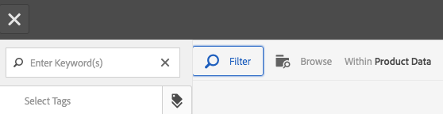

# Utilizzare i selettori in Dynamic Media {#working-with-selectors}

<table>
    <tr>
        <td>
            <i>Nuovo</i> <a href="/help/assets/dynamic-media/dm-prime-ultimate.md"><b>Dynamic Media Prime e Ultimate</b></a>
        </td>
        <td>
            <i>Nuovo</i> <a href="/help/assets/assets-ultimate-overview.md"><b>AEM Assets Ultimate</b></a>
        </td>
        <td>
            <i>Nuova</i> <a href="/help/assets/integrate-aem-assets-edge-delivery-services.md"><b>Integrazione di AEM Assets con Edge Delivery Services</b></a>
        </td>
        <td>
            <i>Nuovo</i> <a href="/help/assets/aem-assets-view-ui-extensibility.md"><b>Estensibilità interfaccia utente</b></a>
        </td>
          <td>
            <i>Nuovo</i> <a href="/help/assets/dynamic-media/enable-dynamic-media-prime-and-ultimate.md"><b>Abilita Dynamic Media Prime e Ultimate</b></a>
        </td>
    </tr>
    <tr>
        <td>
            <a href="/help/assets/search-best-practices.md"><b>Best practice per la ricerca</b></a>
        </td>
        <td>
            <a href="/help/assets/metadata-best-practices.md"><b>Best practice per i metadati</b></a>
        </td>
        <td>
            <a href="/help/assets/product-overview.md"><b>Content Hub</b></a>
        </td>
        <td>
            <a href="/help/assets/dynamic-media-open-apis-overview.md"><b>Dynamic Media con funzionalità OpenAPI</b></a>
        </td>
        <td>
            <a href="https://developer.adobe.com/experience-cloud/experience-manager-apis/"><b>Documentazione di AEM Assets per sviluppatori</b></a>
        </td>
    </tr>
</table>

Quando lavorate con un&#39;immagine interattiva, un video interattivo o un banner carosello, selezionate le risorse e i siti e i prodotti per i punti attivi e le mappe immagine a cui collegarvi. Quando si utilizzano i set di immagini, i set 360 gradi e i set multimediali, è possibile selezionare le risorse anche con il selettore risorse.

Questo argomento illustra come utilizzare i selettori Prodotto, Sito e Risorse, inclusa la possibilità di sfogliare, filtrare e ordinare all’interno dei selettori.

Puoi accedere ai selettori durante la creazione di set carosello, aggiungendo punti attivi e mappe immagine e creando video e immagini interattivi.

Ad esempio, in questo banner carosello, puoi utilizzare il selettore Prodotto se stai collegando un hotspot o una mappa immagine a una pagina Quickview. Utilizza il selettore Sito se stai collegando un punto attivo o una mappa immagine a un collegamento ipertestuale; utilizza il selettore Risorse quando crei una diapositiva.

Quando selezioni (anziché immettere manualmente) la posizione in cui si trovano i punti attivi o le mappe immagine, stai utilizzando il selettore. Il selettore del sito funziona solo se sei un cliente [!DNL Adobe Experience Manager Sites]. Il selettore di prodotto richiede anche [!DNL Experience Manager Commerce].

## Selezionare i prodotti in Dynamic Media {#selecting-products}

Utilizza il selettore Prodotto per scegliere un prodotto quando desideri che un hotspot o una mappa immagine fornisca una Quickview a un prodotto specifico nel catalogo dei prodotti.

1. Passa al set carosello, all&#39;immagine interattiva o al video interattivo e seleziona la scheda **[!UICONTROL Azioni]** (disponibile solo se hai definito un punto attivo o una mappa immagine).

   Il selettore prodotto si trova nell&#39;area **[!UICONTROL Tipo azione]**.

   

1. Selezionare l&#39;icona **[!UICONTROL Selettore prodotti]** (lente di ingrandimento) e passare a un prodotto nel catalogo.

   

   Per filtrare per parola chiave o tag, tocca **[!UICONTROL Filtro]** e immetti le parole chiave, seleziona i tag o entrambi.

   

   Per cambiare il percorso in cui [!DNL Experience Manager] cerca i dati di prodotto, tocca **[!UICONTROL Sfoglia]** e passa a un&#39;altra cartella.

   

   Seleziona **[!UICONTROL Ordina per]** per cambiare se [!DNL Experience Manager] ordina dal più recente al meno recente o dal meno recente al più recente.

   

   Seleziona **[!UICONTROL Visualizza come]** per modificare la modalità di visualizzazione dei prodotti - **[!UICONTROL Vista a elenco]** o **[!UICONTROL Vista a schede]**.

   

1. Dopo aver selezionato il prodotto, il campo viene compilato con la miniatura e il nome del prodotto.

   

1. In modalità **[!UICONTROL Anteprima]**, è possibile selezionare il punto attivo o la mappa immagine e visualizzare l&#39;aspetto di Quickview.

   

## Selezione di siti in Dynamic Media {#selecting-sites}

Utilizzare il selettore del sito per scegliere una pagina Web quando si desidera che un punto attivo o una mappa immagine venga collegata a una pagina Web gestita all&#39;interno di [!DNL Experience Manager] siti.

1. Passa al set carosello, all&#39;immagine interattiva o al video interattivo e seleziona la scheda **[!UICONTROL Azioni]** (disponibile solo se hai definito un punto attivo o una mappa immagine).

   Il selettore del sito si trova nell’area **[!UICONTROL Tipo di azione]**.

   

1. Selezionare l&#39;icona **[!UICONTROL Selettore siti]** (cartella con lente di ingrandimento) e passare a una pagina dei siti [!DNL Experience Manager] a cui si desidera collegare il punto attivo o la mappa immagine.

   

1. Dopo aver selezionato il sito, il campo viene compilato con il percorso.

   

1. In modalità **[!UICONTROL Anteprima]** se si seleziona il punto attivo o la mappa immagine, si passa alla pagina del sito [!DNL Experience Manager] specificata.

## Selezionare le risorse in Dynamic Media {#selecting-assets}

Utilizza questo selettore per scegliere le immagini da utilizzare in un banner carosello, un video interattivo, set di immagini, set di file multimediali diversi e set 360 gradi. Nel video interattivo, il selettore risorse è disponibile quando si seleziona **[!UICONTROL Seleziona Assets]** nella scheda **[!UICONTROL Contenuto]**. In Set carosello, il selettore risorse è disponibile quando crei una diapositiva. Nei set di immagini, nei set di file multimediali diversi e nei set 360 gradi, il selettore delle risorse è disponibile rispettivamente quando crei un set di immagini, un set di file multimediali diversi o un set 360 gradi.

Vedi anche [Selettore risorse](/help/assets/search-assets.md#asset-selector) per ulteriori informazioni.

1. Passa al set carosello e crea una diapositiva. In alternativa, passa al video interattivo, vai alla scheda **[!UICONTROL Contenuto]**, quindi seleziona le risorse. In alternativa, crea un set di file multimediali diversi, un set di immagini o un set 360 gradi.
1. Seleziona l&#39;icona **[!UICONTROL Selettore risorse]** (cartella con lente di ingrandimento) e accedi a una risorsa.

   

   Filtra per parola chiave o tag toccando **[!UICONTROL Filtro]** e immettendo parole chiave, aggiungendo criteri o entrambi.

   

   È possibile cambiare il percorso in cui [!DNL Experience Manager] cerca le risorse passando a un&#39;altra cartella nel campo **[!UICONTROL Percorso]**.

   Seleziona **[!UICONTROL Raccolta]** per cercare solo le risorse all&#39;interno delle raccolte.

   

   Seleziona **[!UICONTROL Visualizza come]** per modificare la modalità di visualizzazione dei prodotti: **[!UICONTROL Vista a elenco]**, **[!UICONTROL Vista a colonne]** o **[!UICONTROL Vista a schede]**.

   

1. Per selezionare la risorsa, seleziona il segno di spunta. La risorsa viene visualizzata.

   
—>
