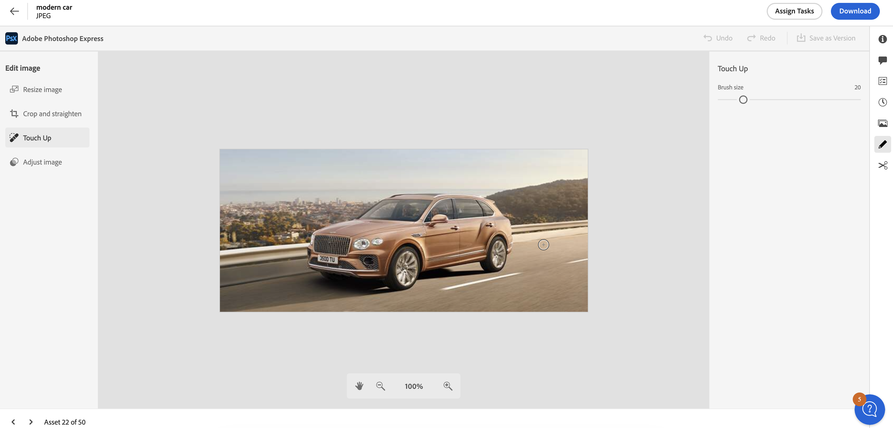

# Modificare le immagini in [!DNL Assets view] {#edit-images}

[!DNL Assets view] offre opzioni di modifica intuitive basate su [!DNL Adobe Express]. Le azioni di modifica disponibili tramite [!DNL Adobe Express] sono Ridimensiona immagine, Rimuovi sfondo, Ritaglia immagine e Converti JPEG in PNG o viceversa.

Dopo aver modificato un’immagine, puoi salvarla come nuova versione. Se necessario, il controllo delle versioni consente di ripristinare la risorsa originale in un secondo momento. Inoltre, il controllo delle versioni è disponibile solo per i tipi di file PNG, il che significa che quando si tenta di rimuovere lo sfondo da un tipo di file JPG, JPG viene automaticamente convertito in PNG. Per modificare un’immagine: [apri l’anteprima](navigate-assets-view.md) e fai clic su **[!UICONTROL Modifica immagine]**.

>[!NOTE]
>
>È possibile modificare le immagini PNG e JPEG utilizzando [!DNL Adobe Express].

<!--The editing actions that are available are Spot healing, Crop and straighten, Resize image, and Adjust image.-->

## Modificare le immagini con Adobe Express {#edit-using-express}

>[!CONTEXTUALHELP]
>id="assets_express_integration"
>title="Integrazione Adobe Express"
>abstract="Strumenti di editing delle immagini semplici e intuitivi gestiti da Adobe Express disponibili direttamente in AEM Assets per aumentare il riutilizzo dei contenuti e velocizzarne la creazione."

### Ridimensionare l’immagine {#resize-image-using-express}

Spesso occorre ridimensionare un’immagine a una dimensione specifica. [!DNL Assets view] consente di ridimensionare rapidamente le immagini per adattarle alle dimensioni comuni delle foto, fornendo nuove risoluzioni precalcolate per dimensioni specifiche. Per ridimensionare l’immagine utilizzando [!DNL Assets view], effettua le seguenti operazioni:

1. Seleziona un’immagine dal tuo [!DNL Experience Manager] Archivio delle risorse e fai clic su **Modifica**.
2. Fai clic su **[!UICONTROL Ridimensiona immagine]** dalle azioni rapide disponibili nel riquadro a sinistra.
3. Seleziona la piattaforma di social media appropriata dall’elenco a discesa **[!UICONTROL Ridimensiona per]** e seleziona le dimensioni dell’immagine tra le opzioni visualizzate.
4. Ridimensiona l’immagine, se necessario, utilizzando il campo **[!UICONTROL Scala immagine]**.
5. Fai clic su **[!UICONTROL Applica]** per applicare le modifiche.
   

   L’immagine modificata è disponibile per il download. Puoi salvare la risorsa modificata come nuova versione della stessa risorsa oppure salvarla come nuova risorsa.
   

### Rimuovere lo sfondo {#remove-background-using-express}

È possibile rimuovere lo sfondo da un’immagine in pochi semplici passaggi, come indicato di seguito:

1. Seleziona un’immagine dal tuo [!DNL Experience Manager] Archivio delle risorse e fai clic su **Modifica**.
2. Fai clic su **[!UICONTROL Rimuovi sfondo]** dalle azioni rapide disponibili nel riquadro a sinistra. In Experience Manager Assets l’immagine viene visualizzata senza sfondo.
3. Fai clic su **[!UICONTROL Applica]** per applicare le modifiche.
   

### Ritagliare un’immagine {#crop-image-using-express}

Utilizzando alcune azioni rapide di [!DNL Adobe Express], è facile trasformare un’immagine affinché sia di dimensioni perfette.

1. Seleziona un’immagine dal tuo [!DNL Experience Manager] Archivio delle risorse e fai clic su **Modifica**.
2. Fai clic su **[!UICONTROL Ritaglia immagine]** dalle azioni rapide nel riquadro a sinistra.
3. Trascina le maniglie agli angoli dell’immagine per creare il ritaglio desiderato.
4. Fai clic su **[!UICONTROL Applica]**.
   
L’immagine ritagliata è disponibile per il download. Puoi salvare la risorsa modificata come nuova versione della stessa risorsa oppure salvarla come nuova risorsa.

### Convertire da JPEG in PNG {#convert-jpeg-to-png-using-express}

Puoi convertire rapidamente un’immagine JPEG in formato PNG utilizzando Adobe Express. Esegui i passaggi seguenti:

1. Seleziona un’immagine dal tuo [!DNL Experience Manager] Archivio delle risorse e fai clic su **Modifica**.
2. Clic **[!UICONTROL Converti in PNG]** dalle azioni rapide disponibili nel riquadro a sinistra.
   <!---->
3. Fai clic su **[!UICONTROL Applica]**.
4. Accedi a **[!UICONTROL Salva con nome in alto a destra]** e fai clic su **[!UICONTROL Salva come nuova risorsa]**.

### Converti PNG in JPEG {#convert-png-to-jpeg-using-express}

Potete convertire rapidamente un&#39;immagine PNG in un formato JPEG utilizzando Adobi Express. Esegui i passaggi seguenti:

1. Seleziona un’immagine dal tuo [!DNL Experience Manager] Archivio delle risorse e fai clic su **Modifica**.
2. Clic **[!UICONTROL Converti in JPEG]** dalle azioni rapide disponibili nel riquadro a sinistra.
3. Fai clic su **[!UICONTROL Applica]**.
4. Accedi a **[!UICONTROL Salva con nome in alto a destra]** e fai clic su **[!UICONTROL Salva come nuova risorsa]**.

### Limitazioni {#limitations-adobe-express}

* Risoluzione immagine supportata: minima - 50 pixel, massima - 6000 pixel per dimensione

* Dimensione massima file supportata: 17 MB

## Modificare le immagine utilizzando l’editor integrato Adobe Express {#edit-using-embedded-editor}

Le organizzazioni con accesso ad Adobi Express possono utilizzare strumenti integrati di modifica e creazione di immagini da Adobi Express e Adobe Firefly disponibili direttamente nella vista Assets per migliorare il riutilizzo dei contenuti e accelerarne la velocità. Puoi anche utilizzare elementi predefiniti per migliorare la risorsa o eseguire azioni rapide per modificare l’immagine con pochi clic.

Per modificare le immagini mediante l’editor integrato [!DNL Adobe Express], effettua le seguenti operazioni:

1. Seleziona un’immagine dal tuo archivio di [!DNL Experience Manager] Assets.
1. Fai clic su **[!UICONTROL Apri in Adobe Express]**.

   

   Puoi sfruttare le funzionalità di [!DNL Adobe Express] per eseguire tutte le azioni correlate alla modifica delle immagini, ad esempio per [ridimensionare l’immagine](https://helpx.adobe.com/it/express/using/resize-image.html), [rimuovere o modificare il colore di sfondo](https://helpx.adobe.com/it/express/using/remove-background.html), [ritagliare l’immagine](https://helpx.adobe.com/it/express/using/crop-image.html) e molto altro.

1. Una volta completata la modifica dell’immagine, puoi scaricare una risorsa come nuova risorsa o salvarla come nuova versione.

## Creare nuove risorse con Adobe Express {#create-new-embedded-editor}

[!DNL Assets view] consente di creare un nuovo modello da zero utilizzando l’editor integrato [!DNL Adobe Express]. Per creare una nuova risorsa tramite [!DNL Adobe Express], effettua le seguenti operazioni:

1. Accedi a **[!UICONTROL Area di lavoro personale]** e fai clic su **[!UICONTROL Crea]** all’interno del banner di Adobe Express visualizzato nella parte superiore. Un’area di lavoro vuota di [!DNL Adobe Express] viene visualizzata all’interno dell’interfaccia utente di [!DNL Assets view].
1. Crea i contenuti utilizzando i [modelli](https://helpx.adobe.com/it/express/using/work-with-templates.html). In caso contrario, passa a **[!UICONTROL Le tue risorse]** per modificare contenuti esistenti.
1. Al termine, fai clic su **[!UICONTROL Salva come nuova risorsa]**.
1. Specifica il percorso di destinazione della risorsa creata e fai clic su **[!UICONTROL Salva]**.

>[!NOTE]
>
>* Puoi modificare solo le immagini in formato `JPEG` e `PNG`.
>* La dimensione della risorsa deve essere inferiore a 17 MB.
>* È possibile salvare un&#39;immagine in `PDF`, `JPEG`, o `PNG` formati; mentre, in presenza di più pagine, è possibile salvarle con `PDF`.

<!--
## Edit images using [!DNL Adobe Photoshop Express] {#edit-using-photoshop-express}

<!--
After editing an image, you can save the new image as a new version. Versioning helps you to revert to the original asset later, if needed. To edit an image, [open its preview](navigate-assets-view.md#preview-assets) and click **[!UICONTROL Edit Image]**  from the rail on the right.

*Figure: The options to edit images are powered by [!DNL Adobe Photoshop Express].*
-->
<!--
### Touch up images {#spot-heal-images-using-photoshop-express}

If there are minor spots or small objects on an image, you can edit and remove the spots using the spot healing feature provided by Adobe Photoshop.

The brush samples the retouched area and makes the repaired pixels blend seamlessly into the rest of the image. Use a brush size that is only slightly larger than the spot you want to fix.

<!-- 
TBD: See if we should give backlinks to PS docs for these concepts.
For more information about how Spot Healing works in Photoshop, see [retouching and repairing photos](https://helpx.adobe.com/photoshop/using/retouching-repairing-images.html). 
-->
<!-- 
### Crop and straighten images {#crop-straighten-images-using-photoshop-express}

Using the crop and straighten option that you can do basic cropping, rotate image, flip it horizontally or vertically, and crop it to dimensions suitable for popular social media websites.

To save your edits, click **[!UICONTROL Crop Image]**. After editing, you can save the new image as a version.

Many default options let you crop your image to the best proportions that fit various social media profiles and posts.

### Resize image {#resize-image-using-photoshop-express}

You can view the common photo sizes in centimeters or inches to know the dimensions. By default, the resizing method retains the aspect ratio. To manually override the aspect ratio, click .

Enter the dimensions and click **[!UICONTROL Resize Image]** to resize the image. Before you save the changes as a version, you can either undo all the changes done before saving by clicking [!UICONTROL Undo] or you can change the specific step in the editing process by clicking [!UICONTROL Revert].

### Adjust image {#adjust-image-using-photoshop-express}

[!DNL Assets view] lets you adjust the color, tone, contrast, and more, with just a few clicks. Click **[!UICONTROL Adjust image]** in the edit window. The following options are available in the right sidebar:

* **Popular**: [!UICONTROL High Contrast & Detail], [!UICONTROL Desaturated Contrast], [!UICONTROL Aged Photo], [!UICONTROL B&W Soft], and [!UICONTROL B&W Sepia Tone].
* **Color**: [!UICONTROL Natural], [!UICONTROL Bright], [!UICONTROL High Contrast], [!UICONTROL High Contrast & Detail], [!UICONTROL Vivid], and [!UICONTROL Matte].
* **Creative**: [!UICONTROL Desaturated Contrast], [!UICONTROL Cool Light], [!UICONTROL Turquoise & Red], [!UICONTROL Soft Mist], [!UICONTROL Vintage Instant], [!UICONTROL Warm Contrast], [!UICONTROL Flat & Green], [!UICONTROL Red Lift Matte], [!UICONTROL Warm Shadows], and [!UICONTROL Aged Photo].
* **B&W**: [!UICONTROL B&W Landscape], [!UICONTROL B&W High Contrast], [!UICONTROL B&W Punch], [!UICONTROL B&W Low Contrast], [!UICONTROL B&W Flat], [!UICONTROL B&W Soft], [!UICONTROL B&W Infrared], [!UICONTROL B&W Selenium Tone], [!UICONTROL B&W Sepia Tone], and [!UICONTROL B&W Split Tone].
* **Vignetting**: [!UICONTROL None], [!UICONTROL Light], [!UICONTROL Medium], and [!UICONTROL Heavy].

<!--
TBD: Insert a video of the available social media options.
-->

### Passaggi successivi {#next-steps}

* Fornisci feedback sui prodotti utilizzando l’opzione [!UICONTROL Feedback] disponibile nell’interfaccia utente della vista Risorse

* Fornisci feedback alla documentazione utilizzando [!UICONTROL Modifica questa pagina]  o [!UICONTROL Segnala un problema]  disponibile sulla barra laterale destra

* Contatta il [Servizio clienti](https://experienceleague.adobe.com/i?support-solution=General#support)

>[!MORELIKETHIS]
>
>* [Azioni rapide nell’Adobe Express](https://helpx.adobe.com/it/express/using/resize-image.html)
>* [Visualizzare la cronologia delle versioni di una risorsa](navigate-assets-view.md)
