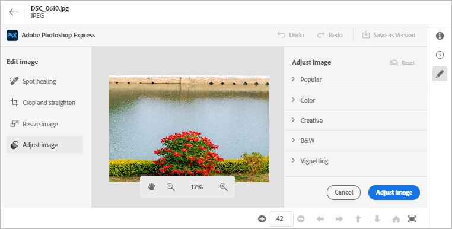

# Modificare le immagini in [!DNL Assets view] {#edit-images}

[!DNL Assets view] offre opzioni di modifica intuitive basate su [!DNL Adobe Photoshop Express]. Le azioni di modifica disponibili consentono di corregee al volo, ritagliare e raddrizzare, ridimensionare e regolare le immagini.

Dopo aver modificato un’immagine, puoi salvarla come nuova versione. Se necessario, il controllo delle versioni consente di ripristinare la risorsa originale in un secondo momento. Per modificare un’immagine, [apri l’anteprima](/help/assets/navigate-assets-view.md#preview-assets) e fai clic su **[!UICONTROL Modifica immagine]**  nella barra a destra.

*Figura: Le opzioni per la modifica delle immagini si basano su [!DNL Adobe Photoshop Express].*

## Correggere immagini al volo {#spot-heal-images}

Se in un’immagine sono presenti piccole macchie o oggetti indesiderati, puoi modificarli e rimuoverli utilizzando il pennello Correzione al volo fornito da Adobe Photoshop.

Il pennello campiona l’area ritoccata e fa sì che i pixel riparati si fondano perfettamente nel resto dell’immagine. Utilizza una dimensione del pennello solo leggermente più grande del punto da correggere.

<!-- 
TBD: See if we should give backlinks to PS docs for these concepts.
For more information about how Spot Healing works in Photoshop, see [retouching and repairing photos](https://helpx.adobe.com/photoshop/using/retouching-repairing-images.html). 
-->

## Ritagliare e raddrizzare le immagini {#crop-straighten-images}

Utilizzando l’opzione di ritaglio e raddrizzamento è possibile eseguire ritaglio di base, ruotare l’immagine, capovolgerla in orizzontale o in verticale e ritagliarla con le proporzioni più adatte per i social media più popolari.

Per salvare le modifiche, fai clic su **[!UICONTROL Ritaglia immagine]**. Dopo la modifica, puoi salvare la nuova immagine come versione.

Molte opzioni predefinite consentono di ritagliare l’immagine alle proporzioni più adatte a vari profili e post di social media.

## Ridimensionare l’immagine {#resize-image}

Spesso occorre ridimensionare un’immagine a una dimensione specifica. [!DNL Assets view] consente di ridimensionare rapidamente le immagini per adattarle alle dimensioni comuni delle foto, fornendo nuove risoluzioni precalcolate per dimensioni specifiche. Puoi visualizzare le dimensioni comuni delle foto in centimetri o pollici per conoscerne la grandezza. Per impostazione predefinita, il metodo di ridimensionamento mantiene le proporzioni originali. Per modificare manualmente le proporzioni, fai clic su .

Inserisci le dimensioni e fai clic su **[!UICONTROL Ridimensiona immagine]** per ridimensionare l’immagine. Prima di salvare le modifiche come versione, puoi fare clic su [!UICONTROL Annulla] per annullare tutte le modifiche apportate prima di salvarle; oppure, per modificare un passaggio di modifica specifico, fai clic su [!UICONTROL Ripristina].

## Regolare l’immagine {#adjust-image}

[!DNL Assets view] consente di regolare il colore, il tono, il contrasto e molto altro con pochi clic. Fai clic su **[!UICONTROL Regola immagine]** nella finestra di modifica. Nella barra laterale a destra sono disponibili le seguenti opzioni:

* **Popolare**: [!UICONTROL Contrasto e dettagli elevati], [!UICONTROL Contrasto insaturo], [!UICONTROL Foto invecchiata], [!UICONTROL Bianco e nero morbido] e [!UICONTROL Tonalità seppia bianco e nero].
* **Colore**: [!UICONTROL Naturale], [!UICONTROL Luminosità], [!UICONTROL Contrasto elevato], [!UICONTROL Contrasto elevato e dettagli], [!UICONTROL Vivace] e [!UICONTROL Opaco].
* **Creativo**: [!UICONTROL Contrasto insaturo], [!UICONTROL Luce fredda], [!UICONTROL Turchese e rosso], [!UICONTROL Foschia leggera], [!UICONTROL Istante vintage], [!UICONTROL Contrasto caldo], [!UICONTROL Semplice e verde], [!UICONTROL Opacità sollevata rossa], [!UICONTROL Ombre calde] e [!UICONTROL Foto invecchiata].
* **Bianco e nero**: [!UICONTROL Paesaggio bianco e nero], [!UICONTROL Bianco e nero con contrasto elevato], [!UICONTROL Risalto bianco e nero], [!UICONTROL Bianco e nero con contrasto ridotto], [!UICONTROL Bianco e nero semplice], [!UICONTROL Bianco e nero morbido], [!UICONTROL Bianco e nero infrarossi], [!UICONTROL Tonalità selenio bianco e nero], [!UICONTROL Tonalità seppia bianco e nero] e [!UICONTROL Divisioni toni bianco e nero].
* **Vignettatura**: [!UICONTROL Nessuna], [!UICONTROL Chiara], [!UICONTROL Media] e [!UICONTROL Scura].

<!--
TBD: Insert a video of the available social media options.
-->

## Passaggi successivi {#next-steps}

* Fornire feedback sul prodotto utilizzando [!UICONTROL Feedback] opzione disponibile nell’interfaccia utente di visualizzazione delle risorse

* Fornisci feedback alla documentazione utilizzando [!UICONTROL Modifica questa pagina]  o [!UICONTROL Segnala un problema]  disponibile sulla barra laterale destra

* Contatta il [Servizio clienti](https://experienceleague.adobe.com/?support-solution=General&amp;lang=it#support)

>[!MORELIKETHIS]
>
>* [Visualizzare la cronologia delle versioni di una risorsa](/help/assets/navigate-assets-view.md)
