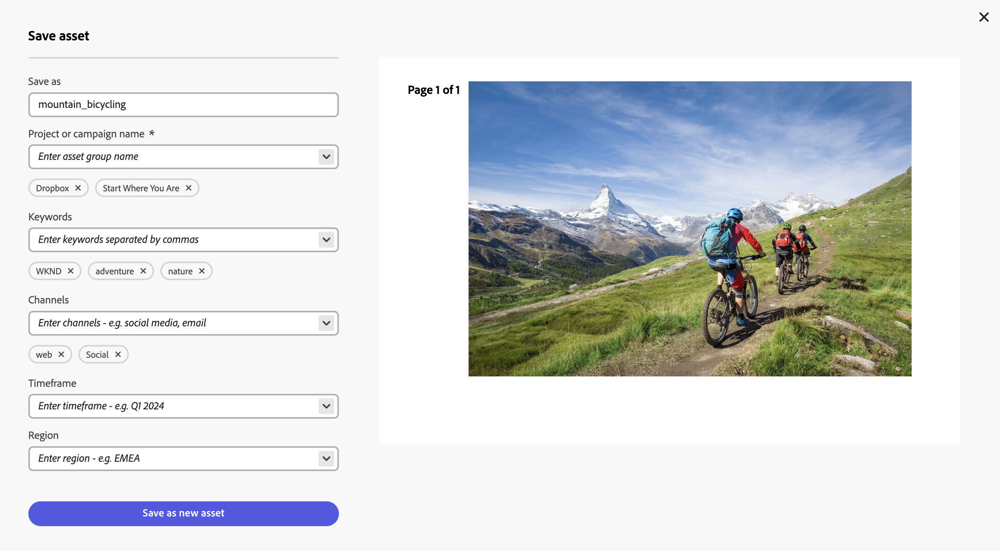

# Modificare le immagini in Content Hub {#edit-images-content-hub}

| [Best practice per la ricerca](/help/assets/search-best-practices.md) | [Best practice per i metadati](/help/assets/metadata-best-practices.md) | [Hub di contenuti](/help/assets/product-overview.md) | [Dynamic Media con funzionalità OpenAPI](/help/assets/dynamic-media-open-apis-overview.md) | [Documentazione di AEM Assets per sviluppatori](https://developer.adobe.com/experience-cloud/experience-manager-apis/) |
| ------------- | --------------------------- |---------|----|-----|

>[!AVAILABILITY]
>
>La guida di Content Hub è ora disponibile in formato PDF. Scarica l’intera guida e utilizza Adobe Acrobat AI Assistant per rispondere alle tue domande.
>
>[!BADGE Guida di Content Hub PDF]{type=Informative url="https://helpx.adobe.com/content/dam/help/en/experience-manager/aem-assets/content-hub.pdf"}

Content Hub consente di creare nuovi contenuti con Adobe Express. Puoi modificare i contenuti esistenti con strumenti facili da usare, produrre varianti on-brand con modelli ed elementi del brand e creare nuovi contenuti con le funzionalità GenAI più recenti di Adobe Firefly.

## Prerequisiti {#prereqs-edit-image-content-hub}

I diritti per accedere ad Adobe Express e [agli utenti Content Hub con diritti per il remix delle risorse in nuove varianti](/help/assets/deploy-content-hub.md#onboard-content-hub-users-remix-assets) possono modificare le immagini utilizzando Content Hub.

>[!NOTE]
>
È possibile modificare le immagini dei tipi di file PNG e JPG/JPEG utilizzando [!DNL Adobe Express].

## Modificare le immagini utilizzando [!DNL Adobe Express] {#edit-images-using-content-hub}

Per modificare le immagini con Content Hub:

1. Fai clic su **[!DNL Open in Adobe Express]** disponibile nella scheda delle risorse dell&#39;immagine da modificare. In alternativa, fare clic sull&#39;immagine per aprirne i dettagli e quindi fare clic sul logo [!DNL Adobe Express]. L’editor incorporato, ad Adobe Express, si carica senza mai uscire da Content Hub.

   Puoi sfruttare la funzionalità [!DNL Adobe Express] per eseguire tutte le azioni correlate alla modifica delle immagini, ad esempio [ridimensionare l&#39;immagine](https://helpx.adobe.com/express/using/resize-image.html), [rimuovere o modificare il colore di sfondo](https://helpx.adobe.com/express/using/remove-background.html), [ritagliare l&#39;immagine](https://helpx.adobe.com/express/using/crop-image.html), combinare l&#39;immagine con il testo o l&#39;immagine generata dall&#39;intelligenza artificiale e molto altro.

1. Esegui le modifiche e fai clic su **[!UICONTROL Salva]** per salvare la risorsa modificata in uno dei tipi di formato seguenti:

   * **[!UICONTROL PNG]** (utilizzato come formato immagine di buona qualità)
   * **[!UICONTROL JPG]** (adatto per file di piccole dimensioni)
   * **[!UICONTROL PDF]** (adatto per i documenti)

   

1. Specifica un nome per la risorsa nel campo **[!UICONTROL Salva con nome]**.

1. Specifica il nome della campagna per la risorsa utilizzando il campo **[!UICONTROL Nome campagna]**. Puoi usare un nome esistente o crearne uno nuovo. Il Content Hub offre più opzioni quando si digita il nome. <!--You can define multiple Campaign names for your upload. While you are typing a name, either click anywhere else within the dialog box or press the `,` (Comma) key to register the name.-->

   Come best practice, Adobe consiglia di specificare i valori negli altri campi e di migliorare l’esperienza di ricerca delle risorse caricate.

1. [Facoltativo] Definisci i valori per i campi **[!UICONTROL Parole chiave]**, **[!UICONTROL Canali]**, **[!UICONTROL Intervallo temporale]** e **[!UICONTROL Area]**. Assegnare tag e raggruppare le risorse per parole chiave, canali e posizione consente a tutti coloro che utilizzano il contenuto aziendale approvato di trovare tali risorse e mantenerle organizzate.

1. Fai clic su **[!UICONTROL Salva come nuova risorsa]** per salvare la risorsa.

Gli amministratori possono anche configurare i campi obbligatori e facoltativi da visualizzare durante l’aggiunta di risorse a Content Hub, ad esempio il nome della campagna, le parole chiave, i canali e così via. Per ulteriori informazioni, vedere [Configurare l&#39;interfaccia utente di Content Hub](configure-content-hub-ui-options.md#configure-upload-options-content-hub).
