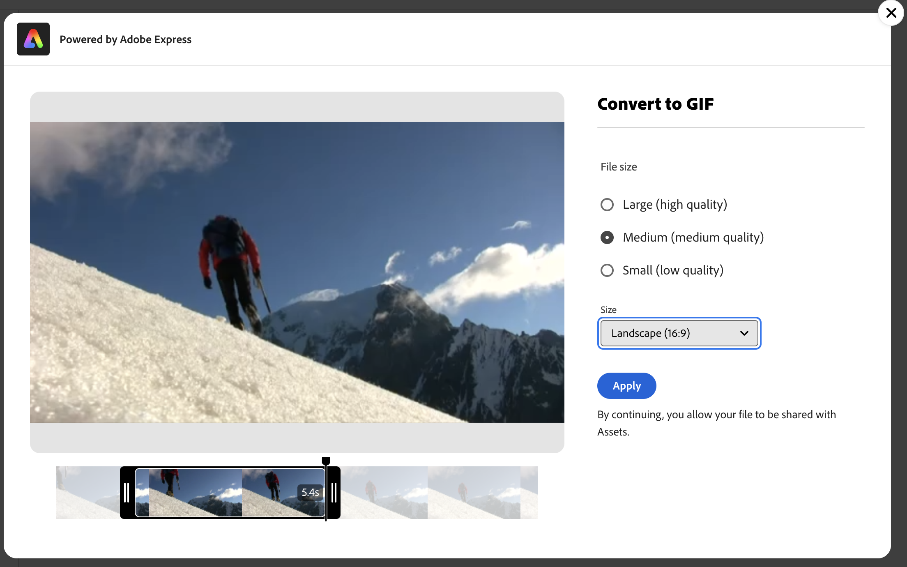

# Modifica video in [!DNL Assets Essentials] {#edit-videos}

La trasformazione di un video in una dimensione perfetta è facile utilizzando embedded [!DNL Adobe Express] azioni rapide. Azioni rapide in [!DNL Assets Essentials] con tecnologia [!DNL Adobe Express] offre opzioni di editing video intuitive, tra cui ritaglia video, ridimensiona video, ritaglia video e converti video in GIF.

Dopo aver modificato un video, puoi salvarlo come nuova versione. Se necessario, il controllo delle versioni consente di ripristinare la risorsa originale in un secondo momento. Per modificare un video, accedi ai relativi dettagli e fai clic su **[!UICONTROL Modifica video]**. In alternativa, seleziona la risorsa e fai clic su Dettagli, quindi fai clic su  disponibile nel riquadro a destra.

Ulteriori informazioni su [interfaccia di anteprima](navigate-assets-view.md).

## Prerequisiti {#prerequisites}

Diritti di accesso [!DNL Adobe Express] e almeno un ambiente in AEM Assets. L’ambiente può essere uno qualsiasi degli archivi in [!DNL Assets as a Cloud Service] o [!DNL Assets Essentials].

## Modifica video con Adobi Express {#edit-video-using-express}

La trasformazione di un video in una dimensione e un orientamento perfetti è facile grazie all&#39;utilizzo di [!DNL Adobe Express] azioni rapide.

### Ritaglia video {#crop-video-using-express}

È possibile eliminare parti indesiderate dal video utilizzando l&#39;opzione Incorporato (embedded) [!DNL Adobe Express] azioni rapide. A questo scopo, esegui i passaggi seguenti:

1. Seleziona un video e fai clic su **[!UICONTROL Modifica]**.
2. Clic **[!UICONTROL Ritaglia video]** dalle azioni rapide disponibili nel riquadro a sinistra.
3. Trascina le maniglie agli angoli del video per creare il ritaglio desiderato; oppure scegli una delle dimensioni dello schermo esistenti, a seconda delle esigenze.
4. È possibile scegliere di disattivare o attivare l&#39;audio del video.
5. Fai clic su **[!UICONTROL Applica]**.
   

   Il video ritagliato è disponibile per il download. Puoi salvare la risorsa modificata come nuova versione della stessa risorsa oppure salvarla come nuova risorsa. 

### Ridimensiona video {#resize-video-using-express}

Spesso è necessario ridimensionare un video a una dimensione specifica. [!DNL Assets Essentials] consente di ridimensionare rapidamente i video per adattarli alle dimensioni comuni, fornendo nuove risoluzioni precalcolate per dimensioni specifiche. Per ridimensionare il video utilizzando [!DNL Assets Essentials], effettua le seguenti operazioni:

1. Seleziona un video e fai clic su **[!UICONTROL Modifica]**.
2. Clic **[!UICONTROL Ridimensiona video]** dalle azioni rapide disponibili nel riquadro a sinistra.
3. Seleziona le dimensioni appropriate dalla piattaforma social media in **[!UICONTROL Ridimensiona per]** elenco a discesa. In alternativa, trascina le maniglie sugli angoli del video per creare il ritaglio desiderato.
4. Ridimensionare il video, se necessario, utilizzando **[!UICONTROL Scala video]** campo.
5. È possibile scegliere di disattivare o attivare l&#39;audio del video.
6. Fai clic su **[!UICONTROL Applica]** per applicare le modifiche.
   

Il video ridimensionato è disponibile per il download. Puoi salvare la risorsa modificata come nuova versione della stessa risorsa oppure salvarla come nuova risorsa.

### Ritaglia video {#trim-video-using-express}

Un trimmer video rapido in [!DNL Assets Essentials] con tecnologia [!DNL Adobe Express] consente di ritagliare il video senza sforzo. Effettua le seguenti operazioni:

1. Seleziona un video e fai clic su **[!UICONTROL Modifica]**.
2. Clic **[!UICONTROL Ritaglia video]** dalle azioni rapide disponibili nel riquadro a sinistra.
3. Specifica l’ora di inizio e di fine del video per ritagliare una parte specifica. In alternativa, trascinate le maniglie sugli angoli del video per creare il ritaglio desiderato.
4. Selezionate le quote appropriate dall&#39;elenco **[!UICONTROL Dimensione]** elenco a discesa.
5. È possibile scegliere di disattivare o attivare l&#39;audio del video.
6. Fai clic su **[!UICONTROL Applica]** per applicare le modifiche.
   

Il video ritagliato è disponibile per il download. Puoi salvare la risorsa modificata come nuova versione della stessa risorsa oppure salvarla come nuova risorsa.

### Converti video in GIF {#convert-mp4-to-gif-using-express}

È possibile convertire rapidamente un video MP4 in un formato GIF utilizzando Adobi Express. Esegui i passaggi seguenti:

1. Seleziona un video e fai clic su **[!UICONTROL Modifica]**.
2. Clic **[!UICONTROL Converti in GIF]** dalle azioni rapide disponibili nel riquadro a sinistra.
3. Seleziona la dimensione file appropriata in base alla qualità desiderata. Inoltre, scegliete l&#39;orientamento orizzontale, verticale o quadrato.
4. Trascina le maniglie sugli angoli del video per creare il ritaglio desiderato.
5. Fai clic su **[!UICONTROL Applica]**.

   

Il video è disponibile in formato GIF per il download. Puoi salvare la risorsa modificata come nuova versione della stessa risorsa oppure salvarla come nuova risorsa.

## Limitazioni {#limitations-video-adobe-express}

* È supportato solo il tipo video MP4.

* Dimensione massima file supportata: 200 MB

* Le dimensioni minima e massima del video sono rispettivamente di 46 e 3840 pixel.

* I browser web supportati sono Google Chrome, Firefox, Safari ed Edge.

* Non è possibile aprire la funzionalità in modalità di navigazione in incognito in un browser web.

### Passaggi successivi {#next-steps}

* Fornisci feedback sui prodotti utilizzando l’opzione [!UICONTROL Feedback] disponibile nell’interfaccia utente di Assets Essentials

* Fornisci feedback alla documentazione utilizzando [!UICONTROL Modifica questa pagina]  o [!UICONTROL Segnala un problema]  disponibile sulla barra laterale destra

* Contatta il [Servizio clienti](https://experienceleague.adobe.com/it?support-solution=General#support)

>[!MORELIKETHIS]
>
>* [Modificare le immagini negli Assets Essentials](edit-images-assets-view.md)
>* [Anteprima di una risorsa](navigate-assets-view.md)
