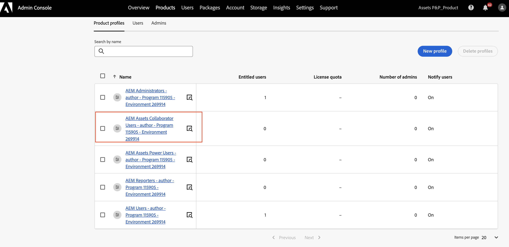

# Abilita [!DNL Assets] as a Cloud Service {#enable-assets-cloud-service-ultimate}

| [Best practice per la ricerca](/help/assets/search-best-practices.md) | [Best practice per i metadati](/help/assets/metadata-best-practices.md) | [Hub di contenuti](/help/assets/product-overview.md) | [Dynamic Media con funzionalità OpenAPI](/help/assets/dynamic-media-open-apis-overview.md) | [Documentazione di AEM Assets per sviluppatori](https://developer.adobe.com/experience-cloud/experience-manager-apis/) |
| ------------- | --------------------------- |---------|----|-----|

Assets as a Cloud Service Ultimate enables you to perform various key DAM capabilities, such as, asset management and library services, security and rights management, Creative and Experience Cloud connections, UI extensibility, API-driven automation, integrations with Adobe and non-Adobe applications, custom code deployment and many more. 

## Enable Assets Ultimate {#enable-assets-ultimate}

New Assets as a Cloud Service customers must first enable Assets Ultimate by creating a new program using Cloud Manager.

Esegui i passaggi seguenti:

1. Accedere a Cloud Manager come amministratore di sistema. Ensure that you select the right organization while logging in.

   >[!NOTE]
   >
   >Ensure that you are added to the appropriate Cloud Manager product profile to add a new program. 

1. 

   ******** ********

   

1. **** Assets Ultimate is now enabled for Experience Manager Assets as a Cloud Service.

The System Administrator is automatically entitled as an AEM Administrator on Assets Ultimate and receives an email to navigate to Admin Console to manage the available product profiles.

Your AEM as a Cloud Service instance on Admin Console comprises the following product profiles:

* Amministratori AEM

* Utenti AEM

* [AEM Assets Collaborator Users](#onboard-collaborator-users)

* [AEM Assets Power Users](#onboard-power-users)

  

`delivery`

>[!NOTE]
>
>`contenthub`

Tieni presente che il nome dell&#39;istanza per Content Hub non contiene `author` o `publish`.

Fare clic sul nome dell&#39;istanza per visualizzare il profilo di prodotto Content Hub `AEM Assets Limited Users`.

Puoi iniziare ad aggiungere utenti o gruppi di utenti a questo profilo di prodotto per consentire loro di accedere a Content Hub.

>[!NOTE]
>
>Se hai eseguito il provisioning di Content Hub prima del 14 agosto 2024, il profilo di prodotto Content Hub presenta `contenthub` menzionato dopo `Limited Users` invece di `delivery`.

## Abilita Assets Ultimate per i clienti esistenti {#enable-assets-ultimate-existing-customers}

I clienti esistenti di Assets as a Cloud Service possono effettuare l’aggiornamento ad Assets Ultimate eseguendo due semplici passaggi. Puoi passare al programma Assets as a Cloud Service in Cloud Manager e visualizzare lo stato dell’aggiornamento nella scheda Programma in base alla disponibilità dei crediti di Assets Ultimate. Se sono disponibili crediti sufficienti per l&#39;aggiornamento ad Assets Ultimate, è possibile visualizzare lo stato come `Assets license upgrade required`, come illustrato nell&#39;immagine seguente:

Se un cliente esistente acquista una nuova licenza per Assets Ultimate, lo stato di aggiornamento visualizzato è `Assets license upgrade available`.

### Prerequisiti per l’aggiornamento {#prerequisites-assets-upgrade}

Tutti gli ambienti devono essere aggiornati alla versione più recente di AEM as a Cloud Service o almeno alla versione `2024.10.18175`. Se non sono soddisfatti i requisiti minimi, contattare il rappresentante dell’Adobe per passare alla versione di rilascio dell’AEM richiesta.

### Esegui l’aggiornamento ad Assets Ultimate {#upgrade-assets-ultimate}

Esegui i passaggi seguenti:

1. After switching to the minimum requirements for the AEM release version, click the program name. ****

   

1. Fare clic su **[!UICONTROL Aggiungi profili prodotto]**. In Cloud Manager sono visualizzate le opzioni per aggiungere nuovi profili di prodotto a tutti gli ambienti disponibili nel programma o nei singoli ambienti.

   

1. Fai clic su **[!UICONTROL Tutti gli ambienti]** per aggiungere i nuovi profili di prodotto a tutti gli ambienti nel programma oppure su **[!UICONTROL Singoli ambienti]** per aggiungere i nuovi profili di prodotto agli ambienti selezionati.

   Facendo clic su **[!UICONTROL Singoli ambienti]** viene visualizzato l&#39;elenco di tutti gli ambienti disponibili nel programma.

1. Fai clic sull&#39;icona Altre opzioni corrispondente a un ambiente e seleziona **[!UICONTROL Aggiungi profili di prodotto]** per aggiungere i nuovi profili di prodotto all&#39;ambiente selezionato.

   

   Puoi anche aggiungere profili di prodotto agli ambienti selezionati passando alla sezione **[!UICONTROL Ambienti]**, facendo clic sull&#39;icona Altre opzioni corrispondente a un ambiente e selezionando **[!UICONTROL Aggiungi profili di prodotto]**.

   Lo stato dell&#39;ambiente visualizza `Adding Product Profiles` durante l&#39;aggiunta dei nuovi profili di prodotto e successivamente visualizza `Running` al termine del processo.

   Prima di eseguire il passaggio successivo, è necessario aggiungere profili di prodotto a tutti gli ambienti disponibili nel programma, singolarmente o in tutti gli ambienti insieme.

1. Fai clic su **[!UICONTROL Aggiorna]**. L&#39;opzione **[!UICONTROL Aggiorna]** viene visualizzata solo quando si aggiungono profili di prodotto a tutti gli ambienti disponibili.

   

   Il processo di aggiornamento è stato completato e l’as a Cloud Service Assets è stato aggiornato ad Assets Ultimate. Lo stato del programma visualizza `Assets Ultimate`.

   

Your AEM as a Cloud Service instance on Admin Console now comprises the following product profiles:

* Amministratori AEM

* Utenti AEM

* [Utenti AEM Assets Collaborator](#onboard-collaborator-users)

* [Utenti avanzati AEM Assets](#onboard-power-users)

Se è necessario abilitare Content Hub, fare clic sull&#39;icona Altre opzioni (...) sul nome del programma in Cloud Manager e selezionare **[!UICONTROL Modifica programma]**. ******** This step enables the Content Hub for Assets Ultimate. `delivery`

>[!NOTE]
>
>`contenthub`

`author``publish`

Fare clic sul nome dell&#39;istanza per visualizzare il profilo di prodotto Content Hub `AEM Assets Limited Users`.

You can start adding users or user groups to this product profile to provide them access to Content Hub.

>[!NOTE]
>
>`contenthub``Limited Users``delivery`

## Onboard AEM Assets Collaborator users {#onboard-collaborator-users}

AEM Assets Collaborator users can work with assets from Experience manager via integrations of Assets available to your organization in other Adobe products and non-Adobe applications, create and edit assets using built-in Adobe Express and Firefly leveraging professionally designed templates, brand kits, Adobe Stock assets, and so on, and access and leverage approved assets from your organization using AEM Assets Content Hub portal.

To onboard Collaborator users:

1. Access Experience Manager Assets product profiles by clicking the AEM as a Cloud Service product name in the list of products on Admin Console.

1. Click the production author instance for AEM as a Cloud Service:
   

1. Fare clic sul profilo di prodotto Utenti collaboratori e fare clic su **[!UICONTROL Aggiungi utenti]** per aggiungere utenti o gruppi di utenti al profilo di prodotto.
   

1. ****

You can also access and view the services assigned to Collaborator users, as depicted in the following image:

`Adobe Express``AEM Assets Collaborator Users`

>[!NOTE]
>
>You can turn the toggle off and on to enable or disable the available services, as per your requirements, however, Adobe recommends to use the default services enabled for the product profiles.

## Onboarding degli utenti AEM Assets Power {#onboard-power-users}

Gli utenti di AEM Assets Power possono accedere a tutte le funzionalità di AEM Assets, tra cui la gestione di risorse, autorizzazioni, metadati e la governance e l’automazione generali relative alle risorse digitali, lavorare con le risorse di Experience Manager tramite integrazioni di Assets disponibili per la tua organizzazione in altre applicazioni Adobe e non Adobe, creare e modificare le risorse utilizzando Adobi Express e Firefly incorporati utilizzando modelli progettati professionalmente, kit per il marchio, risorse Adobe Stock e così via, nonché accedere e sfruttare le risorse approvate dalla tua organizzazione tramite il portale AEM Assets Content Hub.

Per integrare gli utenti esperti:

1. Accedi ai profili di prodotto di Experience Manager Assets facendo clic sul nome del prodotto AEM as a Cloud Service nell’elenco dei prodotti di Admin Console.

1. Fai clic sull’istanza di authoring di produzione per AEM as a Cloud Service:
   

1. Fare clic sul profilo di prodotto Utenti avanzati e fare clic su **[!UICONTROL Aggiungi utenti]** per aggiungere utenti o gruppi di utenti al profilo di prodotto.
   

1. ****

You can also access and view the services assigned to Power users, as depicted in the following image:

`Adobe Express``AEM Assets Power Users`

>[!NOTE]
>
>You can turn the toggle off and on to enable or disable the available services, as per your requirements, however, Adobe recommends to use the default services enabled for the product profiles.
