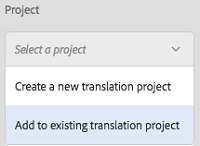

# Integrazione di AEM Assets con InDesign Server {#integrating-aem-assets-with-indesign-server}

Risorse Adobe Experience Manager (AEM) utilizza:

* Un proxy per distribuire il carico di alcune attività di elaborazione. Un proxy è un&#39;istanza di AEM che comunica con un proxy worker per eseguire un&#39;attività specifica, e altre istanze di AEM per fornire i risultati.
* Un lavoratore proxy per definire e gestire un&#39;attività specifica.
Questi possono coprire una vasta gamma di compiti; ad esempio, l&#39;utilizzo di InDesign Server per elaborare i file.

Per caricare completamente i file in AEM Assets creati con Adobe InDesign, viene utilizzato un proxy. Questo utilizza un lavoratore proxy per comunicare con Adobe InDesign Server, dove [gli script](https://www.adobe.com/devnet/indesign/documentation.html#idscripting) vengono eseguiti per estrarre i metadati e generare diverse rappresentazioni per Risorse AEM. Il lavoratore proxy abilita la comunicazione bidirezionale tra InDesign Server e le istanze AEM in una configurazione cloud.

>[!NOTE]
>
>Adobe InDesign è dotato di due prodotti:
>
>* [InDesign](https://www.adobe.com/products/indesign.html)
   >  Questo consente di progettare layout di pagina per la stampa e/o la distribuzione digitale.
   >
   >
* [InDesign Server](https://www.adobe.com/products/indesignserver.html)
   >  Questo motore consente di creare a livello di programmazione documenti automatizzati basati su ciò che avete creato con InDesign. Funziona come un servizio che offre un&#39;interfaccia al suo motore [ExtendScript](https://www.adobe.com/devnet/scripting.html) .
   >  Gli script sono scritti in extendscript, che è simile a javascript. Per informazioni sugli script Indesign, vedere [https://www.adobe.com/devnet/indesign/documentation.html#idscripting](https://www.adobe.com/devnet/indesign/documentation.html#idscripting).
>

## Come funziona l&#39;estrazione {#how-the-extraction-works}

Adobe InDesign Server può essere integrato con AEM Assets in modo che i file INDD creati con InDesign possano essere caricati, generati rappresentazioni, tutti i file multimediali estratti (ad esempio, video) e memorizzati come risorse:

>[!NOTE]
>
>Nelle versioni precedenti di AEM era possibile estrarre XMP e la miniatura, ora è possibile estrarre tutti i contenuti multimediali.

1. Carica il file INDD in AEM Assets.
1. Un framework invia script di comando a InDesign Server tramite SOAP (Simple Object Access Protocol).
Questo script di comando:

   * Recuperate il file INDD.
   * Eseguite i comandi di InDesign Server:

      * Vengono estratti la struttura, il testo e tutti i file multimediali.
      * Vengono generate rappresentazioni PDF e JPG.
      * Vengono generate rappresentazioni HTML e IDML.
   * Ripubblica i file risultanti in Risorse AEM.
   >[!NOTE]
   >
   >IDML è un formato basato su XML che esegue il rendering di *tutto* il contenuto del file InDesign. Viene memorizzato come pacchetto compresso utilizzando la compressione [Zip](https://www.techterms.com/definition/zip) .
   >
   >
   >Per ulteriori informazioni, consultate [Adobe Press - InDesign Interchange Formats INX e IDML](https://www.adobepress.com/articles/article.asp?p=1381880&seqNum=8) .

   >[!CAUTION]
   >
   >Se InDesign Server non è installato o non è configurato, potete comunque caricare un file INDD in AEM. Tuttavia, le rappresentazioni generate saranno limitate a PNG e JPEG. Non sarà possibile generare rappresentazioni HTML, .idml o di pagina.

1. Dopo la generazione di estrazione e rappresentazione:

   * La struttura viene replicata in un `cq:Page` (tipo di rappresentazione).
   * Il testo e i file estratti sono memorizzati in AEM Assets.
   * Tutte le rappresentazioni sono memorizzate in Risorse AEM, nella risorsa stessa.

## Integrazione di InDesign Server con AEM {#integrating-the-indesign-server-with-aem}

Per integrare InDesign Server per l’utilizzo con Risorse AEM e dopo aver configurato il proxy, è necessario:

1. [Installate InDesign Server](#installing-the-indesign-server).
1. Se necessario, [configura il flusso di lavoro](#configuring-the-aem-assets-workflow)Risorse AEM.
Ciò è necessario solo se i valori predefiniti non sono appropriati per l’istanza in uso.

1. Configurate un lavoratore [proxy per InDesign Server](#configuring-the-proxy-worker-for-indesign-server).

### Installazione di InDesign Server {#installing-the-indesign-server}

Per installare e avviare InDesign Server da usare con AEM:

1. Scaricate e installate Adobe InDesign Server.

   >[!NOTE]
   >
   >InDesign Server (CS6 e versioni successive).

1. Se necessario, potete personalizzare la configurazione dell&#39;istanza InDesign Server.

1. Dalla riga di comando, avviate il server:

   `<*ids-installation-dir*>/InDesignServer.com -port 8080`

   Verrà avviato il server con il plug-in SOAP in ascolto sulla porta 8080. Tutti i messaggi e gli output del registro vengono scritti direttamente nella finestra del comando.

   >[!NOTE]
   >
   >Se si desidera salvare i messaggi di output in un file, utilizzare redirection; ad esempio, in Windows:
   >
   >
   >`<ids-installation-dir>/InDesignServer.com -port 8080 > ~/temp/INDD-logfile.txt 2>&1`

### Configurazione del flusso di lavoro Risorse AEM {#configuring-the-aem-assets-workflow}

Risorse AEM dispone di un flusso di lavoro preconfigurato **DAM Update Asset**, con diversi passaggi di processo specifici per InDesign:

* [Estrazione file multimediali](#media-extraction)
* [Estrazione pagina](#page-extraction)

<!--
BROKEN LINK This workflow is setup with default values that can be adapted for your setup on the various author instances (this is a standard workflow, so further information is available under [Editing a Workflow](/help/sites-developing/workflows-models.md#configuring-a-workflow-step)). If you are using the default values (including the SOAP port), then no configuration is needed. BROKEN LINK
-->

Dopo l’impostazione, il caricamento di file InDesign in Risorse AEM (con uno dei metodi più comuni) attiverà il flusso di lavoro necessario per elaborare la risorsa e preparare le varie rappresentazioni. Verifica la configurazione caricando un `.indd` file in Risorse AEM per confermare la visualizzazione delle diverse rappresentazioni create da IDS in `<*your_asset*>.indd/Renditions`

#### Estrazione file multimediali {#media-extraction}

Questo passaggio controlla l’estrazione dei supporti dal file INDD.

Per personalizzare, potete modificare la scheda **Argomenti** del passaggio Estrazione **** file multimediali.

Argomenti di estrazione dei supporti e percorsi di script

* **ExtendScript library** Questa è una semplice libreria http get/post method, richiesta dagli altri script.

* **Estendi script**&#x200B;È possibile specificare diverse combinazioni di script. Se desiderate che gli script personalizzati vengano eseguiti in InDesign Server, salvate gli script in `/apps/settings/dam/indesign/scripts`.
Per informazioni sugli script Indesign, vedete:
   [https://www.adobe.com/devnet/indesign/documentation.html#idscripting](https://www.adobe.com/devnet/indesign/documentation.html#idscripting)

>[!CAUTION]
>
>Non **modificare** la libreria **ExtendScript**.

>Questa libreria fornisce la funzionalità HTTP necessaria per comunicare con Sling. Questa impostazione specifica la libreria da inviare a InDesign Server per l&#39;utilizzo in tale ambiente.
>
Lo `ThumbnailExport.jsx` script eseguito dal passaggio del flusso di lavoro Estrazione file multimediali genera una rappresentazione in miniatura in formato .jpg. Questa rappresentazione viene utilizzata dal passaggio del flusso di lavoro Miniature processo per generare le rappresentazioni statiche richieste da AEM.

Potete configurare il passaggio del flusso di lavoro Miniature di processo per generare rappresentazioni statiche di dimensioni diverse. Assicurati di non rimuovere i valori predefiniti, perché sono richiesti dall’interfaccia utente di Risorse AEM. Infine, il passaggio del flusso di lavoro Elimina anteprima immagine rimuove la rappresentazione in miniatura .jpg, in quanto non è più necessaria.

#### Estrazione pagina {#page-extraction}

Viene creata una pagina AEM dagli elementi estratti. Un gestore di estrazione viene utilizzato per estrarre i dati da una rappresentazione (attualmente HTML o IDML). Questi dati vengono quindi utilizzati per creare una pagina con PageBuilder.

Per personalizzare, è possibile modificare la scheda **Argomenti** del passaggio Estrazione **** pagina.

* **Gestore** estrazione pagina Dall&#39;elenco a discesa, selezionare il gestore che si desidera utilizzare. Un gestore di estrazione opera su una rappresentazione specifica, scelta da un elemento correlato `RenditionPicker` (consultate l&#39; `ExtractionHandler` API).
In un’installazione standard di AEM è disponibile quanto segue:

   * Gestore estrazione esportazione IDMLrota la `IDML` rappresentazione generata nel passaggio MediaExtract.

* **Nome** pagina Specificate il nome che desiderate assegnare alla pagina risultante. Se lasciato vuoto, il nome è &quot;page&quot; (o un derivato, se &quot;page&quot; esiste già).

* **Titolo** pagina Specificate il titolo che desiderate assegnare alla pagina risultante.

* **Percorso**directory principale pagina Il percorso della posizione principale della pagina risultante.
Se lasciato vuoto, verrà utilizzato il nodo che contiene le rappresentazioni della risorsa.

* **Modello** pagina Modello da utilizzare per la generazione della pagina risultante.

* **Progettazione** pagina La progettazione della pagina da utilizzare per generare la pagina risultante.

### Configurazione del Proxy Worker per InDesign Server {#configuring-the-proxy-worker-for-indesign-server}

>[!NOTE]
Il lavoratore risiede nell&#39;istanza proxy.

1. Nella console Strumenti, espandi Configurazioni **Servizi** cloud nel riquadro a sinistra. Quindi espandete Configurazione **proxy** Cloud.

1. Fare doppio clic sul lavoratore **** IDS per aprire la configurazione.

1. Fate clic su **[!UICONTROL Modifica]** per aprire la finestra di dialogo di configurazione e definire le impostazioni richieste:

   

   * **Pool** IDS Gli endpoint SOAP da utilizzare per comunicare con InDesign Server. È possibile aggiungere, rimuovere e ordinare gli elementi necessari.

1. Fai clic su OK per salvare.

### Configurazione di Day CQ Link Externalizer {#configuring-day-cq-link-externalizer}

Se il server InDesign e AEM vengono eseguiti su host diversi o entrambe le applicazioni non vengono eseguite sulle porte predefinite, configurate **Day CQ Link Externalizer** per impostare il nome host, la porta e il percorso del contenuto per il server InDesign.

1. Accedere a Configuration Manager dall&#39;URL `https://[aem_server]:[port]/system/console/configMgr`.
1. Individuate il **giorno di configurazione CQ Link Externalizer** e fate clic sull&#39;icona **Modifica** per aprirlo.
1. Specificate il nome host e il percorso contestuale per il server Indesign e fate clic su **Salva**.

   

### Abilitazione dell&#39;elaborazione processi paralleli per InDesign Server {#enabling-parallel-job-processing-for-indesign-server-s}

È ora possibile abilitare l&#39;elaborazione processi paralleli per gli ID.

Innanzitutto dovete determinare il numero massimo di processi paralleli (`x`) che un server InDesign può elaborare:

* Su un singolo computer multiprocessore, il numero massimo di processi paralleli (x) che un InDesign Server può elaborare è uno in meno del numero di processori che eseguono IDS.
* Quando si esegue IDS su più computer è necessario contare il numero totale di processori disponibili (ossia su tutti i computer), quindi sottrarre il numero totale di computer.

Per configurare il numero di processi IDS paralleli:

1. Aprite la scheda **Configurazioni** della console Felix; ad esempio: `https://[aem_server]:[port]/system/console/configMgr`.

1. Selezionate la coda di elaborazione IDS in:

   `Apache Sling Job Queue Configuration`

1. Imposta:

   * **Tipo** - `Parallel`
   * **Processi** paralleli massimi - `<*x*>` (come calcolato sopra)

1. Salvate queste modifiche.
1. Per abilitare il supporto multisessione per CS6 (e versioni successive), controllate:

   `enable.multisession.name` Casella

   In:

   `com.day.cq.dam.ids.impl.IDSJobProcessor.name configuration`

1. Create un [pool di lavoratori `<*x*>` IDS aggiungendo endpoint SOAP alla configurazione](#configuring-the-proxy-worker-for-indesign-server)IDS Worker.

   Se sono presenti più computer che eseguono i server InDesign, aggiungete endpoint SOAP (numero di processori per computer -1) per ciascun computer.

   >[!NOTE]
   È possibile scegliere di abilitare l&#39;inserimento in blacklist dei lavoratori IDS quando si lavora con un pool di lavoratori.
   A tale scopo, abilitare la casella di controllo &quot;enable.try.name&quot; nella `com.day.cq.dam.ids.impl.IDSJobProcessor.name` configurazione, che consente di recuperare i processi IDS.
   Inoltre, nella `com.day.cq.dam.ids.impl.IDSPoolImpl.name` configurazione, impostare un valore positivo per il `max.errors.to.blacklist` parametro che determina il numero di recuperi di processi prima di barrare un ID dall&#39;elenco dei gestori di processi
   Per impostazione predefinita, dopo l’ora configurabile (retry.interval.to.whitelist.name) in minuti, il lavoro IDS viene convalidato. Se il lavoratore viene trovato online, viene rimosso dalla lista nera

## Abilitazione del supporto per InDesign Server 10.0 o versione successiva {#enabling-support-for-indesign-server-or-higher}

Per InDesign Server 10.0 o versione successiva, eseguite i seguenti passaggi per abilitare il supporto per più sessioni.

1. Apri Configuration Manager dall’istanza di Risorse AEM `https://[aem_server]:[port]/system/console/configMgr`.
1. Modificate la configurazione `com.day.cq.dam.ids.impl.IDSJobProcessor.name`.
1. Selezionate l’opzione **[!UICONTROL ids.cc.enable]** e fate clic su **[!UICONTROL Salva]**.

>[!NOTE]
Per l’integrazione di InDesign Server con Risorse AEM, utilizzate un processore multi-core perché la funzione di supporto della sessione necessaria per l’integrazione non è supportata nei sistemi single core.

## Configurare le credenziali AEM {#configure-aem-credentials}

Potete modificare le credenziali di amministratore predefinite (nome utente e password) per accedere al server InDesign dall’istanza AEM senza interrompere l’integrazione con il server InDesign.

1. Passa a `/etc/cloudservices/proxy.html`.
1. Nella finestra di dialogo, specificate il nuovo nome utente e la nuova password.
1. Salvare le credenziali.
