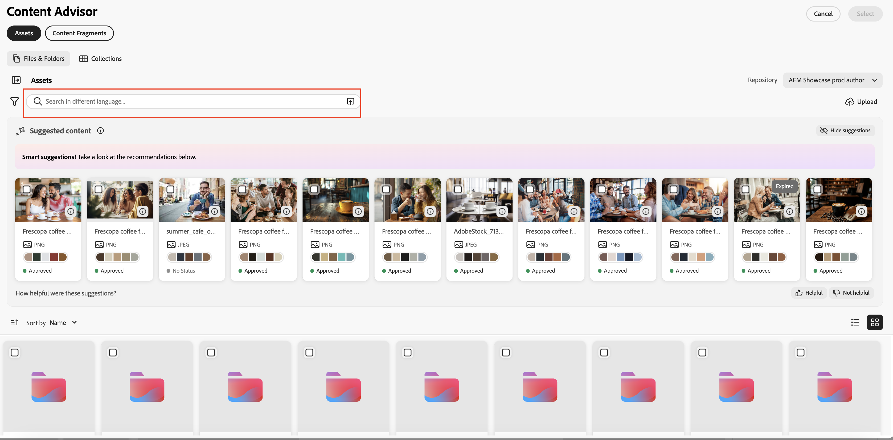

# Utilizzare Contenuto verificato per accedere ai contenuti di AEM nelle applicazioni Adobe e non Adobe{#content-advisor-aem-assets-adobe-non-Adobe-applications}

Contenuto verificato offre un&#39;esperienza di individuazione dei contenuti unificata per tutte le applicazioni Adobe e non Adobe. Integrato in modalità nativa con applicazioni quali Adobe Workfront, AJO B2C (disponibile a breve), AEM Sites e non Adobe, Content Advisor riunisce i contenuti (risorse e frammenti di contenuto) in un&#39;unica interfaccia intelligente. Consente di individuare, sfogliare e riutilizzare senza difficoltà i contenuti più rilevanti, direttamente all’interno del flusso di lavoro, per velocizzare le attività senza interrompere il contesto.

Contenuto verificato consente di eseguire il rilevamento intelligente e in base al contesto direttamente nell&#39;esperienza di authoring, consentendo di trovare rapidamente contenuti pertinenti e approvati in base alle proprie finalità. Grazie a funzioni quali suggerimenti avanzati, rappresentazioni Dynamic Media e metadati di risorse dettagliati, consente di valutare e riutilizzare in modo efficiente i contenuti senza uscire dall’interfaccia dell’applicazione, accelerando la creazione dei contenuti e mantenendo al contempo la coerenza del marchio.

Inoltre, Adobe Experience Manager (AEM) Assets si integra in modo nativo con Adobe Express, consentendo di individuare, accedere e utilizzare le risorse da AEM Assets direttamente nell&#39;interfaccia Express tramite Content Advisor. Per ulteriori informazioni, vedere [Utilizzare Contenuto verificato per accedere ad AEM Assets in Adobe Express](/help/assets/native-integration-adobe-express.md).

## Prerequisiti {#prerequisites}

* Accesso a un ambiente AEM Assets as a Cloud Service.

* Accesso a un ambiente AEM Sites con frammenti di contenuto creati (necessario solo per l’utilizzo con frammenti di contenuto). Questa opzione non è necessaria per accedere alle risorse binarie o ad AEM Assets.

## Individuazione intelligente delle risorse con Content Advisor {#intelligent-asset-discovery-content-advisor}

Contenuto verificato consente di individuare i contenuti rilevanti utilizzando consigli intelligenti e contestuali basati sul contenuto dell&#39;applicazione Adobe dell&#39;host o sul resoconto della campagna. Consente inoltre di selezionare le rappresentazioni Dynamic Media pronte per il canale ottimizzate per il tuo caso d’uso.

>[!IMPORTANT]
> 
>Accertati di selezionare un archivio **author** dall&#39;elenco a discesa **Repository**. Un repository **delivery** non visualizza le funzionalità di Contenuto verificato.
>
> Inoltre, nell&#39;archivio **delivery** non è presente contenuto organizzato in cartelle e raccolte. Il contenuto viene visualizzato a livello principale in una struttura piatta.

Contenuto verificato offre le seguenti funzionalità principali:

* [Ricerche IA per un&#39;individuazione più intelligente delle risorse](#content-advisor-ai-search)

* [Suggerimenti avanzati basati su contesto e intento](#smart-suggestions-content-advisor)

* [Documenti informativi sulle campagne per scoprire le risorse rilevanti](#campaign-briefs-content-advisor)

* [Rendering delle risorse Dynamic Media disponibili per l’uso](#dynamic-media-renditions-content-advisor)

* [Integrazione perfetta con i frammenti di contenuto](#content-fragments-integration-content-advisor)

* [Accedere ai metadati delle risorse in modo coerente con la vista Assets](#asset-metadata-content-advisor)

* [Filtri di accesso coerenti con la vista Assets](#filters-content-advisor)

* [Accedere e riutilizzare ricerche recenti e salvate](#saved-searches-content-advisor)

* [Cercare risorse tra e all’interno di raccolte](#search-collections-content-advisor)

### Ricerche IA per un&#39;individuazione più intelligente delle risorse {#content-advisor-ai-search}

Contenuto verificato utilizza una funzionalità di ricerca avanzata in grado di comprendere il significato e l&#39;intento alla base della query di un utente, anziché basarsi su corrispondenze esatte tra parole chiave. Utilizza l’intelligenza artificiale (IA) e l’apprendimento automatico per fornire risultati più precisi e in base al contesto.

A differenza della ricerca tradizionale basata su parole chiave, che cerca termini esatti, Ricerca IA interpreta le relazioni tra parole, concetti e intento dell&#39;utente. In questo modo gli utenti possono trovare ciò che stanno cercando, anche se la query è formulata in modo diverso, contiene errori di battitura o è in un’altra lingua.

Alcuni vantaggi, tra cui:

* Supporto multilingue: ricerca in più lingue senza richiedere traduzioni esatte. Gli utenti possono trovare contenuti rilevanti indipendentemente dal linguaggio di query.

* Gestisce gli errori di ortografia: interpreta gli errori di battitura e di ortografia, garantendo risultati accurati anche con input imperfetto.

* Comprende i sinonimi: fornisce risultati per termini e frasi correlati, pertanto gli utenti non devono indovinare la parola chiave giusta.

* Ricerca in base al contesto: riconosce l’intento alla base di una query, non solo le parole esatte.

>[!IMPORTANT]
> 
>* La versione di AEM release minima richiesta per accedere alle Ricerche IA in Contenuto verificato è `21994`
>* Il supporto per le ricerche IA sarà presto disponibile per i frammenti di contenuto.

### Suggerimenti avanzati basati su contesto e intento {#smart-suggestions-content-advisor}

Contenuto verificato visualizza suggerimenti avanzati in base al contesto dell&#39;applicazione Adobe host. Questo consente di individuare e utilizzare rapidamente le risorse in linea con le esigenze di contenuto senza dover ricorrere a lunghe ricerche manuali.

>[!IMPORTANT]
> 
>* Per accedere a questa funzione in Contenuto verificato, è necessario firmare un Rider GenAI. Per firmare GenAI rider, contatta il tuo rappresentante Adobe.
>* La versione minima richiesta di AEM per accedere a questa funzione è `21994`.
>* Contenuto verificato visualizza suggerimenti avanzati in base al contesto e all&#39;intento dei contenuti disponibili nell&#39;applicazione Adobe host. Non visualizza i risultati in base alle immagini. Per l&#39;elenco delle applicazioni Adobe supportate che supportano questa funzionalità, vedere [Supporto delle funzionalità di Content Advisor nelle applicazioni Adobe](#content-advisor-feature-support-adobe-applications).

### Documenti informativi sulle campagne per scoprire le risorse rilevanti {#campaign-briefs-content-advisor}

Contenuto verificato consente di caricare un documento di riepilogo della campagna per individuare le risorse rilevanti senza immettere manualmente le parole chiave di ricerca. Contenuto verificato analizza le informazioni contenute nel documento della campagna per comprenderne le finalità e consiglia le risorse pertinenti disponibili in AEM Assets.

>[!IMPORTANT]
>
>* Contenuto verificato analizza le informazioni disponibili come testo nella descrizione della campagna per consigliare le risorse pertinenti. Non analizza le informazioni disponibili come immagini nel resoconto della campagna.
>* I tipi di file supportati che è possibile caricare come descrizione della campagna includono documenti PDF, DOCX e TXT.
>* Per accedere a questa funzione in Contenuto verificato, è necessario firmare un Rider GenAI. Per firmare GenAI rider, contatta il tuo rappresentante Adobe.
>* La versione minima richiesta di AEM per accedere a questa funzione è `21994`.
>* Il supporto per il caricamento del resoconto della campagna sarà presto disponibile per i frammenti di contenuto.

### Rendering delle risorse Dynamic Media disponibili per l’uso {#dynamic-media-renditions-content-advisor}

Le rappresentazioni Dynamic Media forniscono versioni pronte per l&#39;uso e ottimizzate per il canale delle risorse, tra cui [predefiniti immagine](/help/assets/dynamic-media/managing-image-presets.md), [ritagli avanzati](/help/assets/dynamic-media/image-profiles.md), tipi di formato e profili colore. Queste rappresentazioni consentono di garantire che la risorsa selezionata soddisfi i requisiti di canale e progettazione senza richiedere la modifica manuale o la duplicazione delle risorse.

Puoi anche applicare i modificatori Dynamic Media alle regolazioni di anteprima in tempo reale prima di selezionare il rendering per l’applicazione Adobe host, consentendo una selezione più rapida del rendering più appropriato mantenendo al contempo la coerenza e la qualità delle risorse.

Fai clic sull&#39;icona  sulla scheda delle risorse e seleziona la scheda **[!UICONTROL Dynamic Media]** per visualizzare le rappresentazioni disponibili per una risorsa. Puoi scegliere di visualizzare [le rappresentazioni Scene7](/help/assets/dynamic-media/dynamic-media.md) di Dynamic Media o [Dynamic Media con le rappresentazioni OpenAPI](/help/assets/dynamic-media-open-apis-overview.md). Quando selezioni **[!UICONTROL OpenAPI]** per una risorsa, le rappresentazioni disponibili vengono visualizzate solo se la risorsa è approvata e disponibile in Dynamic Media con OpenAPI.

Per visualizzare la scheda Dynamic Media, è necessario disporre di una licenza AEM Dynamic Media valida.

Fai clic sull&#39;icona  per visualizzare l&#39;anteprima della copia trasformata oppure fai clic sul nome della copia trasformata e poi su **[!UICONTROL Seleziona]** per rendere la copia trasformata disponibile nell&#39;applicazione host.

Fai clic su **[!UICONTROL Aggiungi modificatori]**, specifica un modificatore nella casella di testo e premi Invio per applicare la trasformazione a tutte le rappresentazioni di risorse in tempo reale. Allo stesso modo, potete aggiungere più modificatori alle rappresentazioni e visualizzare in anteprima tali trasformazioni. Fai clic sul nome della copia trasformata e fai clic su **[!UICONTROL Seleziona]** per rendere la copia trasformata disponibile nell&#39;applicazione host. La rappresentazione dopo l’applicazione di tali modificatori non viene salvata. Consulta l&#39;elenco dei modificatori supportati per [Dynamic Media Scene7](https://experienceleague.adobe.com/en/docs/dynamic-media-developer-resources/image-serving-api/image-serving-api/http-protocol-reference/command-reference/c-command-reference) e [Dynamic Media con OpenAPI](https://developer.adobe.com/experience-cloud/experience-manager-apis/api/stable/assets/delivery/#operation/getAssetSeoFormat).

### Individuazione dei frammenti di contenuto {#content-fragments-discovery-content-advisor}

Contenuto verificato consente di individuare i frammenti di contenuto e di sfogliarli e incorporarli facilmente nelle applicazioni Adobe supportate. Cerca in un elenco di Frammenti di contenuto e seleziona i contenuti più rilevanti senza uscire dal flusso di lavoro corrente.

Ogni frammento di contenuto è rappresentato come una scheda con un’anteprima in miniatura live generata dal relativo contenuto, che consente di identificare rapidamente il frammento giusto. Nella scheda vengono inoltre visualizzati dettagli chiave quali il titolo e lo stato (Bozza, Modificato o Pubblicato). Per informazioni più approfondite, fai clic sull&#39;icona  per visualizzare proprietà dettagliate, riferimenti ad altri frammenti di contenuto e varianti disponibili, in modo da garantire una selezione e un riutilizzo informati dei contenuti.

>[!IMPORTANT]
> 
>* Le funzionalità ricerca IA, Suggerimenti avanzati, Carica resoconti delle campagne e Anteprima non sono ancora supportate per i frammenti di contenuto in Contenuto verificato.

### Accedere ai metadati delle risorse in modo coerente con la vista Assets {#asset-metadata-content-advisor}

Contenuto verificato consente di accedere alle proprietà delle risorse definite in AEM Assets, inclusi i metadati disponibili nella visualizzazione Assets. Contenuto verificato utilizza la stessa configurazione dei metadati della vista Assets, replicando l&#39;elenco delle schede di metadati e il contenuto nella pagina dei dettagli delle risorse della vista Assets. Questo consente di rivedere i dettagli chiave della risorsa come titolo, descrizione, formato, dimensione e altri metadati prima di selezionare una risorsa. L’accesso alle proprietà delle risorse consente di scegliere la risorsa corretta e approvata per il contenuto.

Fai clic sull&#39;icona  sulla scheda delle risorse e seleziona la scheda **[!UICONTROL Base]** per visualizzare i metadati della risorsa. Puoi anche visualizzare altre schede di metadati delle risorse, come Prodotto, Campagna e Tag, in modo coerente con i metadati delle risorse esistenti nella vista Assets.

Contenuto verificato visualizza le proprietà (metadati) dei file in una visualizzazione di sola lettura. Le proprietà non vengono visualizzate per raccolte e cartelle.

### Filtri di accesso coerenti con la vista Assets {#filters-content-advisor}

Contenuto verificato offre all&#39;interno dell&#39;applicazione Adobe host le stesse funzionalità di filtro disponibili nella vista Assets, consentendo di perfezionare le risorse utilizzando filtri predefiniti. Le stesse funzionalità di filtro disponibili nella vista Assets si applicano anche ai filtri specifici per i tipi di contenuto, come file, cartelle e raccolte. Questo garantisce un’esperienza di individuazione delle risorse coerente e consente di individuare in modo efficiente le risorse rilevanti all’interno dell’applicazione host Adobe.

Se non sono stati impostati filtri nella visualizzazione Assets tramite lo schema dei filtri, Content Advisor visualizza i filtri predefiniti, inclusi Tipo file, Formato file, Stato risorsa, Dimensione file, Larghezza immagine, Altezza immagine, Data di modifica e Data di creazione.

Lo schema di filtro personalizzato è supportato per Assets (file), ma non ancora per Cartelle e Raccolte.

### Accedere e riutilizzare ricerche recenti e salvate {#saved-searches-content-advisor}

Sono inoltre disponibili le ricerche salvate create nella vista Assets, che consentono di riutilizzare i criteri di ricerca predefiniti. Le ricerche salvate funzionano in modo coerente tra la vista Assets e Contenuto verificato nei vari browser. Questo consente di individuare in modo efficiente le risorse utilizzando modelli di ricerca coerenti in AEM Assets e altre applicazioni Adobe.

Per salvare la ricerca utilizzata di frequente utilizzando Contenuto verificato:

1. Specifica un termine di ricerca (facoltativo), fai clic sull’icona dei filtri e seleziona le opzioni in base ai tuoi requisiti per creare una query di ricerca.

1. Fai clic su **Gestisci ricerche salvate** > **Crea nuova ricerca salvata**.

1. Specifica il nome della ricerca e fai clic sull&#39;icona  per salvarla. La ricerca viene visualizzata nell’elenco degli elementi.

   

Per applicare uno degli elementi di ricerca salvati, selezionare l&#39;elemento di ricerca dall&#39;elenco a discesa **[!UICONTROL Ricerche salvate]**. Contenuto verificato visualizza i risultati in base alla query di ricerca.

Contenuto verificato consente di salvare le ricerche recenti e di salvare quelle utilizzate più di frequente per accedervi rapidamente in un secondo momento. L&#39;elenco delle ricerche recenti non è coerente tra la vista Assets e Contenuto verificato. Lo stesso utente può avere un diverso set di ricerche recenti nella vista Assets e in Contenuto verificato. Se si utilizza la modalità in incognito per accedere a Contenuto verificato, l&#39;elenco delle ricerche recenti non è disponibile. Inoltre, le ricerche recenti non vengono condivise tra browser diversi per lo stesso utente e sono specifiche per l’ambiente di AEM.

La funzione Ricerca salvata predefinita, disponibile nella visualizzazione Assets, non è ancora disponibile in Contenuto verificato.

### Cercare risorse tra e all’interno di raccolte {#search-collections-content-advisor}

Contenuto verificato consente di cercare risorse o raccolte in tutte le raccolte o di limitare la ricerca a una raccolta specifica. Questo consente di individuare e utilizzare rapidamente le risorse delle raccolte curate, preservando al contempo il contesto organizzativo previsto.

## Supporto delle funzioni di Content Advisor nelle applicazioni Adobe {#content-advisor-feature-support-adobe-applications}

Nella tabella seguente viene illustrato il supporto delle funzioni di Contenuto verificato nelle applicazioni Adobe.

>[!IMPORTANT]
> 
> Man mano che Content Advisor si espande ad altre applicazioni Adobe, questa tabella verrà aggiornata per riflettere il supporto più recente.

| Applicazione | Supporto per un breve caricamento per la ricerca in Assets | Supporto per il pannello dei contenuti suggeriti durante la ricerca in Assets | Supporto per il pannello Dynamic Media durante la ricerca in Assets | Supporto per la ricerca di frammenti di contenuto |
|--------------------------------------|----------------------------------------------|-----------------------------------------------------------|--------------------------------------------------------|------------------------------------------|
| [Adobe Express](/help/assets/native-integration-adobe-express.md) | ✓ | ✓ | ✓ | − |
| [AEM Sites - Authoring dei documenti](https://www.aem.live/docs/authoring-guide#document-authoring) | ✓ | ✓ | ✓ | − |
| [AEM Sites - Editor universale](https://www.aem.live/docs/authoring-guide#universal-editor-in-aem-sites) | ✓ | ✓ | ✓ | − |
| AEM Sites - [GoogleDrive](https://www.aem.live/docs/authoring-guide#google-drive)/[Authoring di Sharepoint](https://www.aem.live/docs/authoring-guide#microsoft-sharepoint) | ✓ | − | ✓ | − |
| AEM Sites - Editor frammento di contenuto (solo nel campo Riferimento contenuto) | ✓ | ✓ | ✓ | − |
| Flusso di lavoro di Adobe Workfront | ✓ | ✓ | − | ✓ |
| Adobe Workfront Planning | ✓ | ✓ | − | ✓ |

## Supporto delle funzioni di Contenuto verificato per le applicazioni non Adobe {#content-advisor-feature-support-non-adobe-applications}

Content Advisor è inoltre disponibile per l&#39;integrazione con applicazioni non Adobe (di terze parti), estendendo l&#39;individuazione intelligente delle risorse oltre le applicazioni Adobe. Lo stesso set di funzioni avanzate, tra cui ricerca basata sull’intelligenza artificiale, consigli in base al contesto, individuazione basata su resoconto della campagna, accesso alle rappresentazioni Dynamic Media, individuazione dei frammenti di contenuto, filtri e metadati di risorse, è supportato nelle integrazioni di terze parti.

Questo consente di scoprire, valutare e utilizzare le risorse approvate da AEM Assets direttamente all’interno delle applicazioni esterne, mantenendo al contempo la coerenza con l’esperienza disponibile in Adobe Express e in altre applicazioni Adobe.

Per ulteriori informazioni su integrazioni, proprietà e personalizzazioni, consulta i seguenti articoli:

* [Esempi di integrazione di Content Advisor](https://github.com/adobe/aem-assets-selectors-mfe-examples/tree/consolidate-docs-to-experience-league/examples)

* [Proprietà di Contenuto verificato](/help/assets/content-advisor-properties.md)

* [Personalizzazioni di Contenuto verificato](/help/assets/content-advisor-customization.md)
