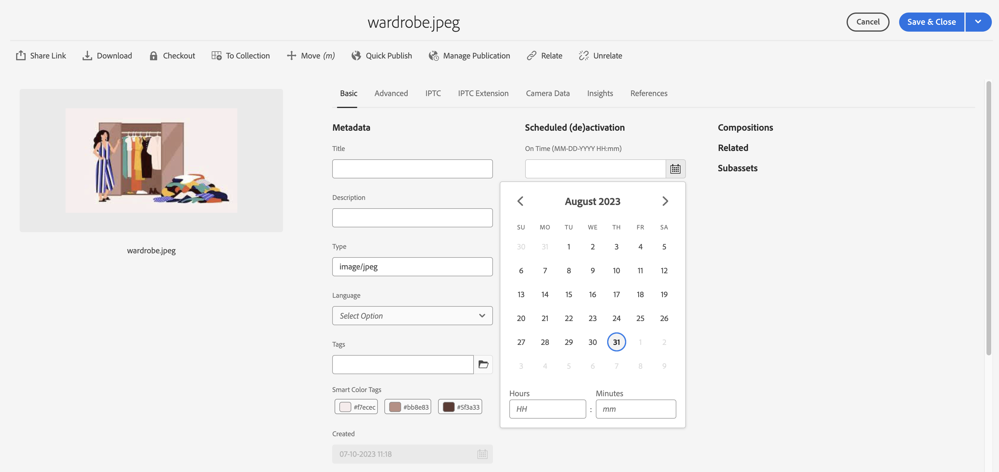
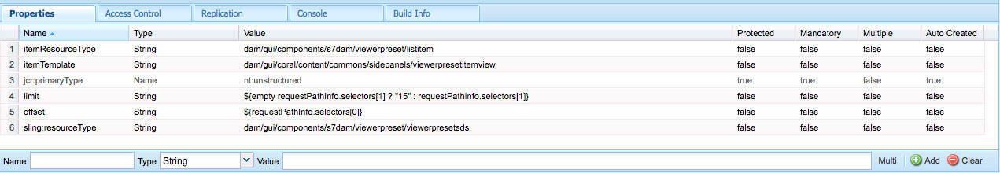
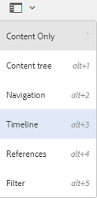
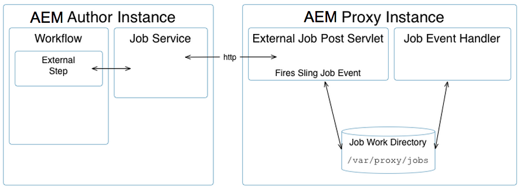

# Gestire le risorse {#manage-assets}

| Versione | Collegamento articolo |
| -------- | ---------------------------- |
| AEM 6.5 | [Fai clic qui](https://experienceleague.adobe.com/docs/experience-manager-65/assets/managing/manage-assets.html?lang=en) |
| AEM as a Cloud Service | Questo articolo |

Questo articolo descrive come gestire e modificare le risorse in [!DNL Adobe Experience Manager Assets]. Per gestire [!DNL Content Fragments], consulta [[!DNL Content Fragments]](content-fragments/content-fragments.md) risorse.

## Creare cartelle {#creating-folders}

Quando si organizza una raccolta di risorse, ad esempio tutte le immagini `Nature`, è possibile creare cartelle per mantenerle unite. Puoi utilizzare le cartelle per categorizzare e organizzare le risorse. [!DNL Experience Manager Assets] non richiede di organizzare le risorse in cartelle per funzionare meglio.

>[!NOTE]
>
>* La condivisione di una cartella Assets di tipo `sling:OrderedFolder` non è supportata durante la condivisione in Experience Cloud. Se desideri condividere una cartella, non selezionare [!UICONTROL Ordinato] durante la creazione di una cartella.
>* Experience Manager non consente di utilizzare `subassets` parola come nome di una cartella. È una parola chiave riservata ai nodi che contengono risorse secondarie per le risorse composte

1. Passa alla posizione nella cartella delle risorse digitali in cui desideri creare una cartella. Scegliere **[!UICONTROL Crea]** dal menu. Seleziona **[!UICONTROL Nuova cartella]**.
1. Nel campo **[!UICONTROL Titolo]**, fornisci un nome di cartella. Per impostazione predefinita, DAM utilizza il titolo fornito come nome della cartella. Una volta creata la cartella, puoi sovrascrivere l’impostazione predefinita e specificare un altro nome di cartella.
1. Fai clic su **[!UICONTROL Crea]**. La cartella viene visualizzata nella cartella delle risorse digitali.

I seguenti caratteri (separati da spazi) non sono supportati:

* Il nome di un file di risorse non può contenere i seguenti caratteri: `* / : [ \\ ] | # % { } ? &`
* Il nome di una cartella di risorse non può contenere i seguenti caratteri: `* / : [ \\ ] | # % { } ? \" . ^ ; + & \t`

## Caricare le risorse {#uploading-assets}

Consulta [aggiungere risorse digitali ad Experience Manager](add-assets.md).

## Estrai archivi ZIP {#extract-zip-archives}

Seleziona gli archivi ZIP gestiti in Experience Manager ed estrai i file direttamente in Experience Manager senza scaricarli.

Per estrarre i file ZIP, effettuare le seguenti operazioni:

1. Seleziona il tipo di file ZIP.
1. Fare clic sull&#39;opzione **[!UICONTROL Estrai archivio]** disponibile nella barra delle azioni.
1. Seleziona la cartella in cui salvare le risorse estratte disponibili nella cartella compressa.
1. Fai clic su **[!UICONTROL Avanti]**.
1. Seleziona il comportamento appropriato per gestire i conflitti di nome file durante l’estrazione. Puoi scegliere di creare una versione di una risorsa esistente, sostituirla, mantenere entrambe le risorse nella cartella di destinazione o saltare l’estrazione della nuova risorsa.
1. Fai clic su **[!UICONTROL Estrai]**. Il processo di estrazione ZIP viene avviato. Una volta completato il processo, puoi visualizzare le risorse estratte nella cartella di destinazione.

   

   >[!NOTE]
   >
   >* La dimensione massima supportata per il file ZIP è 15 GB.
   >* Puoi estrarre un massimo di tre file ZIP alla volta.

## Visualizzare l’anteprima delle risorse {#previewing-assets}

Per visualizzare in anteprima una risorsa, segui la procedura riportata di seguito.

1. Dall’interfaccia utente di Assets, individua il percorso della risorsa di cui vuoi visualizzare l’anteprima.
1. Seleziona la risorsa desiderata per aprirla.
1. In modalità anteprima sono disponibili opzioni di zoom per [tipi di immagini supportati](/help/assets/file-format-support.md) (con modifica interattiva).

   Per ingrandire una risorsa, seleziona `+` (o seleziona la lente di ingrandimento della risorsa). Per ridurre, selezionare `-`. Quando si esegue lo zoom avanti, è possibile esaminare attentamente qualsiasi area dell&#39;immagine eseguendo una panoramica. La freccia di ripristino consente di tornare alla visualizzazione originale.

   Selezionare **[!UICONTROL Reimposta]** per ripristinare le dimensioni originali della visualizzazione.

## Modifica proprietà {#editing-properties}

1. Passa alla posizione della risorsa di cui desideri modificare i metadati.
1. Seleziona la risorsa e fai clic su **[!UICONTROL Proprietà]** nella barra degli strumenti per visualizzarne le proprietà. In alternativa, scegli l&#39;azione rapida **[!UICONTROL Proprietà]** sulla scheda della risorsa.

   

1. Nella pagina [!UICONTROL Proprietà], modifica le proprietà dei metadati in varie schede. Ad esempio, nella scheda **[!UICONTROL Base]**, modifica il titolo, la descrizione e così via.

   >[!NOTE]
   >
   >Il layout della pagina [!UICONTROL Proprietà] e le proprietà dei metadati disponibili dipendono dallo schema metadati sottostante. Per informazioni su come modificare il layout della pagina [!UICONTROL Proprietà], vedere [Schemi metadati](/help/assets/metadata-schemas.md).

1. Per pianificare una data/ora specifica per l’attivazione della risorsa, utilizza il selettore data posto accanto al campo **[!UICONTROL On Time (All’ora)]**.

   

1. Per disattivare la risorsa dopo una determinata durata, scegli la data/ora di disattivazione dalla selezione della data accanto al campo **[!UICONTROL Ora di disattivazione]**. La data di disattivazione deve essere successiva alla data di attivazione di una risorsa. Dopo l&#39;[!UICONTROL Ora di disattivazione], una risorsa e le relative rappresentazioni non sono disponibili tramite l&#39;interfaccia Web di Assets o tramite l&#39;API HTTP.

   <!---->

1. Nel campo **[!UICONTROL Tag]**, seleziona uno o più tag. Per aggiungere un tag personalizzato, digitare il nome del tag nella casella e selezionare il tasto `Enter`. Il nuovo tag viene salvato in [!DNL Experience Manager].

   YouTube richiede che i tag siano pubblicati e che sia presente un collegamento ad YouTube (se disponibile).

   >[!NOTE]
   >
   >Per creare i tag, è necessario disporre dell&#39;autorizzazione di scrittura nel percorso `/content/cq:tags/default` nell&#39;archivio CRX.

1. Seleziona **[!UICONTROL Salva e chiudi]**.
1. Passa all’interfaccia utente di Assets. Le proprietà dei metadati modificate, tra cui titolo, descrizione e tag, vengono visualizzate nella scheda delle risorse nella vista a schede e nelle colonne pertinenti nella vista a elenco.

<!-- TBD: Uncomment after verification for Dec release.

## View asset usage and references {#usage-and-references}

[!DNL Experience Manager] lets you track statistics about usage of a digital asset. The usage statistics include the following:

    * Number of times the asset was viewed or downloaded
    * Channels/devices through which the asset was used
    * Creative solutions where the asset was recently used

To view usage statistics for an asset, in the [!UICONTROL Properties] page, click the **[!UICONTROL Insights]** tab. For more details, see [Assets Insights](assets-insights.md).

[!DNL Experience Manager] also lets you check all the incoming references to an asset, that is, the usage of an asset in remote [!DNL Sites] and in compound assets. Authors of webpages on [!DNL Experience Manager Sites] deployment can use an asset on a remote [!DNL Assets] deployment using the Connected Assets functionality. The [!UICONTROL References] tab in an asset's [!UICONTROL Properties] page lists the local and remote references of the asset. That is, the use of assets in compound assets in [!DNL Assets] and its use in remote [!DNL Sites] pages.

-->

## Copiare le risorse {#copying-assets}

Quando copi una risorsa o una cartella, viene copiata l’intera risorsa o cartella, insieme alla relativa struttura del contenuto. Una risorsa o una cartella copiata viene duplicata nel percorso di destinazione. La risorsa nel percorso di origine non viene modificata.

Alcuni attributi univoci di una particolare copia di una risorsa non vengono riportati. Alcuni esempi sono:

* ID risorsa, data e ora di creazione, versioni e cronologia delle versioni. Alcune di queste proprietà sono indicate dalle proprietà `jcr:uuid`, `jcr:created` e `cq:name`.

* Il tempo di creazione e i percorsi di riferimento sono univoci per ogni risorsa e per ogni relativa rappresentazione.

Le altre proprietà e le informazioni sui metadati vengono conservate. Una copia parziale non viene creata durante la copia di una risorsa.

1. Dall&#39;interfaccia utente di Assets, seleziona una o più risorse, quindi seleziona l&#39;icona **[!UICONTROL Copia]** dalla barra degli strumenti. In alternativa, seleziona l&#39;azione rapida **[!UICONTROL Copia]**  dalla scheda delle risorse.

   >[!NOTE]
   >
   >Se utilizzi l&#39;azione rapida [!UICONTROL Copia], puoi copiare una sola risorsa alla volta.

1. Passa alla posizione in cui desideri copiare le risorse.

   >[!NOTE]
   >
   >Se copi una risorsa nella stessa posizione, [!DNL Experience Manager] genera automaticamente una variante del nome. Ad esempio, se copi una risorsa con titolo `Square`, [!DNL Experience Manager] genera automaticamente il titolo della relativa copia come `Square1`.

1. Fai clic sull&#39;icona della risorsa **[!UICONTROL Incolla]** nella barra degli strumenti. Assets vengono copiati in questa posizione.

   <!---->

   >[!NOTE]
   >
   >L&#39;icona **[!UICONTROL Incolla]** è disponibile nella barra degli strumenti fino al completamento dell&#39;operazione Incolla.

### Spostare o rinominare le risorse {#moving-or-renaming-assets}

1. Passa alla posizione della risorsa da spostare.

1. Seleziona la risorsa e fai clic sull&#39;icona **[!UICONTROL Sposta]**  nella barra degli strumenti.

1. Nella procedura guidata Sposta Assets eseguire una delle operazioni seguenti:

   * Specifica il nome della risorsa dopo lo spostamento. Quindi seleziona **[!UICONTROL Avanti]** per procedere.

   * Selezionare **[!UICONTROL Annulla]** per interrompere il processo.

   >[!NOTE]
   >
   >* Se nella nuova posizione non è presente alcuna risorsa con lo stesso nome, è possibile specificare lo stesso nome per la risorsa. Tuttavia, se sposti la risorsa in una posizione in cui esiste già una risorsa con lo stesso nome, utilizza un nome diverso. Se utilizzate lo stesso nome, il sistema genera automaticamente una variante del nome. Ad esempio, se la risorsa è denominata Square, il sistema genera il nome Square1 per la relativa copia.
   >* Durante la ridenominazione, il nome del file non può contenere spazi.

1. Nella finestra di dialogo **[!UICONTROL Seleziona destinazione]** eseguire una delle operazioni seguenti:

   * Passa alla nuova posizione per le risorse, quindi seleziona **[!UICONTROL Avanti]** per continuare.

   * Seleziona **[!UICONTROL Indietro]** per tornare alla schermata **[!UICONTROL Rinomina]**.

1. Se le risorse da spostare hanno pagine, risorse o raccolte di riferimento, accanto alla scheda **[!UICONTROL Seleziona destinazione]** viene visualizzata la scheda **[!UICONTROL Regola riferimenti]**.

   Effettua una delle seguenti operazioni nella schermata **[!UICONTROL Regola riferimenti]**:

   * Specifica i riferimenti da modificare in base ai nuovi dettagli, quindi seleziona **[!UICONTROL Sposta]** per procedere.

   * Dalla colonna **[!UICONTROL Regola]**, seleziona/deseleziona i riferimenti alle risorse.
   * Seleziona **[!UICONTROL Indietro]** per tornare alla schermata **[!UICONTROL Seleziona destinazione]**.

   * Selezionare **[!UICONTROL Annulla]** per interrompere l&#39;operazione di spostamento.

   Se non aggiorni i riferimenti, questi continuano a puntare al percorso precedente della risorsa. Se regoli i riferimenti, questi vengono aggiornati al nuovo percorso della risorsa.

### Gestire le rappresentazioni {#managing-renditions}

1. Puoi aggiungere o rimuovere rappresentazioni per una risorsa, ad eccezione dell’originale. Passa alla posizione della risorsa per la quale desideri aggiungere o rimuovere rappresentazioni.

1. Seleziona la risorsa per aprirne la pagina.

   <!---->

1. Seleziona l&#39;icona GlobalNav e seleziona **[!UICONTROL Rappresentazioni]** dall&#39;elenco.

   

1. Nel pannello **[!UICONTROL Rappresentazioni]**, visualizza l&#39;elenco delle rappresentazioni generate per la risorsa.

   

   >[!NOTE]
   >
   >Per impostazione predefinita, [!DNL Experience Manager Assets] non visualizza la rappresentazione originale della risorsa in modalità anteprima. Se sei un amministratore, puoi utilizzare le sovrapposizioni per configurare [!DNL Assets] per visualizzare le rappresentazioni originali in modalità anteprima.

1. Selezionare una copia trasformata per visualizzarla o eliminarla.

   **Eliminazione di una rappresentazione**

   Seleziona una copia trasformata dal pannello **[!UICONTROL Copie trasformate]**, quindi seleziona l&#39;icona **[!UICONTROL Elimina copia trasformata]** dalla barra degli strumenti. Non è possibile eliminare le rappresentazioni in blocco al termine dell’elaborazione delle risorse. Per le singole risorse, puoi rimuovere manualmente le rappresentazioni dall’interfaccia utente. Per più risorse, puoi personalizzare [!DNL Experience Manager] per eliminare rappresentazioni specifiche o per eliminare le risorse e ricaricare quelle eliminate.

   

   **Caricamento di una nuova rappresentazione**

   Passa alla pagina dei dettagli della risorsa, quindi seleziona l&#39;icona **[!UICONTROL Aggiungi rappresentazione]** nella barra degli strumenti per caricare una nuova rappresentazione della risorsa.

   <!---->

   >[!NOTE]
   >
   >Se selezioni un rendering dal pannello **[!UICONTROL Rendering]**, la barra degli strumenti cambia contesto, visualizzando solo le azioni del rendering specifico. Le opzioni non sono visualizzate, ad esempio l’icona Carica rappresentazione. Per visualizzare queste opzioni nella barra degli strumenti, vai alla pagina dei dettagli della risorsa.

   Puoi configurare le dimensioni per la rappresentazione da visualizzare nella pagina dei dettagli di un’immagine o di una risorsa video. In base alle dimensioni specificate, Assets visualizza la rappresentazione con le dimensioni esatte o più vicine.

   Non è possibile creare copie trasformate con i seguenti prefissi, poiché sono interni di Adobe:

   * cq5

   * cqdam

   * cq5dam

   Per configurare le dimensioni di rendering di un’immagine a livello di dettaglio della risorsa, sovrapponi il nodo `renditionpicker` (`libs/dam/gui/content/assets/assetpage/jcr:content/body/content/content/items/assetdetail/items/col1/items/assetview/renditionpicker`) e configura il valore della proprietà larghezza.  Per personalizzare il rendering sulla pagina dei dettagli della risorsa in base alle dimensioni dell’immagine, configura la proprietà **[!UICONTROL size (Long) in KB (dimensione (lunga) in KB)]** al posto della larghezza. Per la personalizzazione basata sulle dimensioni, la proprietà `preferOriginal` assegna le preferenze all’originale se la dimensione del rendering corrispondente è maggiore.

   Allo stesso modo, è possibile personalizzare l&#39;immagine della pagina Annotation sovrapponendo `libs/dam/gui/content/assets/annotate/jcr:content/body/content/content/items/content/renditionpicker`.

   <!---->

   Per configurare le dimensioni di rendering per una risorsa video, passa al nodo `videopicker` nell&#39;archivio CRX nel percorso `/libs/dam/gui/content/assets/assetpage/jcr:content/body/content/content/items/assetdetail/items/col1/items/assetview/videopicker`, sovrapponi il nodo e quindi modifica la proprietà appropriata.

   >[!NOTE]
   >
   >Le annotazioni video sono supportate solo nei browser con formati video compatibili con HTML5. Inoltre, a seconda del browser, sono supportati diversi formati video. Tuttavia, il formato video MXF non è ancora supportato con le annotazioni video.

## Eliminare risorse {#delete-assets}

Per risolvere o rimuovere i riferimenti in entrata da altre pagine, aggiorna i riferimenti rilevanti prima di eliminare una risorsa.

Inoltre, disattiva il pulsante Forza eliminazione utilizzando una sovrapposizione, per impedire agli utenti di eliminare le risorse di riferimento e lasciare i collegamenti interrotti.

1. Passa alla posizione delle risorse da eliminare.

1. Seleziona la risorsa e fai clic su **[!UICONTROL Elimina]**  nella barra degli strumenti.

1. Nella finestra di dialogo di conferma, fai clic su:

   * **[!UICONTROL Annulla]** per interrompere l&#39;azione
   * **[!UICONTROL Elimina]** per confermare l’azione:

      * Se la risorsa non ha riferimenti, viene eliminata.
      * Se la risorsa contiene riferimenti, un messaggio di errore informa che **[!UICONTROL Si fa riferimento a una o più risorse]**. È possibile selezionare **[!UICONTROL Forza eliminazione]** o **[!UICONTROL Annulla]**.

   >[!NOTE]
   >
   >Per eliminare una risorsa è necessario disporre delle autorizzazioni di eliminazione per DAM/risorsa. Se disponi solo delle autorizzazioni di modifica, puoi modificare solo i metadati della risorsa e aggiungere annotazioni alla risorsa. Tuttavia, non puoi eliminare la risorsa o i relativi metadati.

   >[!NOTE]
   >
   >Per risolvere o rimuovere i riferimenti in entrata da altre pagine, aggiorna i riferimenti rilevanti prima di eliminare una risorsa. Puoi impedire l’eliminazione delle risorse di riferimento in quanto causa collegamenti interrotti. Disattiva il pulsante Forza eliminazione utilizzando una sovrapposizione.

## Scaricare le risorse {#download-assets}

Vedi [scarica risorse da [!DNL Experience Manager]](/help/assets/download-assets-from-aem.md).

## Pubblicare o annullare la pubblicazione delle risorse {#publish-assets}

1. Passa alla posizione della risorsa o della cartella di risorse da pubblicare o da rimuovere dall’ambiente di pubblicazione (annulla pubblicazione).

1. Seleziona la risorsa o la cartella da pubblicare o annullare la pubblicazione e seleziona l&#39;opzione **[!UICONTROL Gestisci pubblicazione]**  dalla barra degli strumenti. In alternativa, per pubblicare rapidamente, seleziona l&#39;opzione **[!UICONTROL Pubblicazione rapida]** nella barra degli strumenti. Se la cartella da pubblicare include una cartella vuota, questa non viene pubblicata.

1. Seleziona l&#39;opzione **[!UICONTROL Pubblica]** o **[!UICONTROL Annulla pubblicazione]** come richiesto.

   
   *Figura: opzioni di pubblicazione e annullamento della pubblicazione e opzione di pianificazione.*

1. Seleziona **[!UICONTROL Ora]** per agire immediatamente sulla risorsa oppure seleziona **[!UICONTROL Più tardi]** per pianificare l&#39;azione. Selezionare una data e un&#39;ora se si sceglie l&#39;opzione **[!UICONTROL Più tardi]**. Fai clic su **[!UICONTROL Avanti]**.

1. Durante la pubblicazione, se una risorsa fa riferimento ad altre risorse, i relativi riferimenti sono elencati nella procedura guidata. Vengono visualizzati solo i riferimenti non pubblicati o modificati dall&#39;ultima pubblicazione. Scegliete i riferimenti da pubblicare.

1. Quando annulli la pubblicazione, se una risorsa fa riferimento ad altre risorse, scegli i riferimenti da annullare la pubblicazione. Fai clic su **[!UICONTROL Annulla pubblicazione]**. Nella finestra di dialogo di conferma, fai clic su **[!UICONTROL Annulla]** per interrompere l&#39;azione o su **[!UICONTROL Annulla pubblicazione]** per confermare che la pubblicazione delle risorse verrà annullata alla data specificata.

Scopri le limitazioni e i suggerimenti seguenti relativi alla pubblicazione o all’annullamento della pubblicazione di risorse o cartelle:

* L&#39;opzione per [!UICONTROL Gestisci pubblicazione] è disponibile solo per gli account utente che dispongono di autorizzazioni di replica.
* Durante l’annullamento della pubblicazione di una risorsa complessa, annulla solo la pubblicazione della risorsa. Evita di annullare la pubblicazione dei riferimenti, poiché altre risorse pubblicate potrebbero farvi riferimento.
* Le cartelle vuote non vengono pubblicate.
* Se pubblichi una risorsa in fase di elaborazione, viene pubblicato solo il contenuto originale. Mancano le rappresentazioni. Attendi il completamento dell’elaborazione, quindi pubblica o ripubblica la risorsa al termine dell’elaborazione.

## Gruppo utenti chiuso {#closed-user-group}

Un gruppo utenti chiuso viene utilizzato per limitare l&#39;accesso a cartelle di risorse specifiche pubblicate da [!DNL Experience Manager]. Se si crea un gruppo utenti chiusi (CUG) per una cartella, l&#39;accesso alla cartella (incluse le risorse e le sottocartelle della cartella) è limitato solo ai membri o ai gruppi assegnati. Per accedere alla cartella, devono accedere utilizzando le credenziali di sicurezza.

I CUG sono un modo aggiuntivo per limitare l’accesso alle risorse. Puoi anche configurare una pagina di accesso per la cartella.

1. Seleziona una cartella dall’interfaccia utente di Assets, quindi fai clic sull’icona Proprietà nella barra degli strumenti per visualizzare la pagina delle proprietà.
1. Dalla scheda **[!UICONTROL Autorizzazioni]**, aggiungere membri o gruppi in **[!UICONTROL Gruppo utenti chiuso]**.

   

1. Per visualizzare una schermata di accesso quando gli utenti accedono alla cartella, selezionare l&#39;opzione **[!UICONTROL Abilita]**. Quindi, selezionare il percorso di una pagina di accesso in [!DNL Experience Manager] e salvare le modifiche.

   

   >[!NOTE]
   >
   >Se non si specifica il percorso di una pagina di accesso, [!DNL Experience Manager] visualizza la pagina di accesso predefinita nell&#39;istanza di pubblicazione.

1. Pubblica la cartella, quindi prova ad accedervi dall’istanza di pubblicazione. Viene visualizzata una schermata di accesso.
1. Se si è un membro del gruppo utenti chiusi, immettere le credenziali di sicurezza. La cartella viene visualizzata dopo l&#39;autenticazione di [!DNL Experience Manager].

## Cerca risorse {#search-assets}

La ricerca delle risorse è fondamentale per l’utilizzo di un sistema di gestione delle risorse digitali, che sia destinato a un ulteriore utilizzo da parte dei creativi, per la gestione affidabile delle risorse da parte degli utenti aziendali e dei professionisti del marketing o per l’amministrazione da parte degli amministratori DAM.

Per ricerche semplici, avanzate e personalizzate per individuare e utilizzare le risorse più appropriate, consulta [cercare le risorse in [!DNL Experience Manager]](/help/assets/search-assets.md).

## Azioni rapide {#quick-actions}

Le icone di azione rapida sono disponibili per una singola risorsa alla volta. A seconda del dispositivo in uso, eseguire le azioni seguenti per visualizzare le icone delle azioni rapide:

* Dispositivi touch: toccare e tenere premuto. In un’iPad, ad esempio, puoi selezionare e mantenere una risorsa in modo che vengano visualizzate le azioni rapide.
* Dispositivi non touch: puntatore del mouse. Ad esempio, su un dispositivo desktop, se passi il puntatore del mouse sulla miniatura della risorsa, viene visualizzata la barra di azione rapida.

<!-- Hiding this topic via cqdoc-18707

## Edit images {#editing-images}

The editing tools in the [!DNL Experience Manager Assets] interface let you perform small editing jobs on image assets. You can crop, rotate, flip, and perform other editing jobs on images. You can also add image maps to assets.

>[!NOTE]
>
>For some components, the Full Screen mode has additional options available.

1. Do one of the following to open an asset in edit mode:

    * Select the asset and then select the **[!UICONTROL Edit]** icon in the toolbar.
    * Select the **[!UICONTROL Edit]** icon that appears on an asset in the Card view.
    * In the asset page, select the **[!UICONTROL Edit]** icon in the toolbar.

   

1. To crop the image, select the **Crop** icon.

   

1. Select the desired option from the list. The crop area appears on the image based on the option you choose. The **Free Hand** option lets you crop the image without any aspect ratio restrictions.

   

1. Select the area to be cropped, and resize or reposition it on the image.
1. Use the **Finish** icon (top right corner) to crop the image. Clicking the **Finish** icon also triggers the regeneration of renditions.

   

1. Use the **Undo** and **Redo** icons on the top right to revert to the uncropped image or retain the cropped image, respectively.

   

1. Select the appropriate Rotate icon to rotate the image clockwise or anti-clockwise.

   

1. Select the appropriate Flip icon to flip the image horizontally or vertically.

   

1. Select the **Finish** icon to save the changes.

   

>[!NOTE]
>
>Image editing is supported for BMP, GIF, PNG, and JPEG files formats.

>[!NOTE]
>
>To edit a TXT file, set **Day CQ Link Externalizer** from Configuration Manager.
-->

## Timeline {#timeline}

La timeline consente di visualizzare vari eventi per un elemento selezionato, ad esempio flussi di lavoro attivi per una risorsa, commenti/annotazioni, registri attività e versioni.


*Figura: ordinare le voci della sequenza temporale per una risorsa*

>[!NOTE]
>
>Nella console [Raccolte](/help/assets/manage-collections.md#navigate-the-collections-console), l&#39;elenco **[!UICONTROL Mostra tutti]** fornisce le opzioni per visualizzare solo i commenti e i flussi di lavoro. Inoltre, la timeline viene visualizzata solo per le raccolte di livello superiore elencate nella console. Non viene visualizzato se ti sposti all’interno di una delle raccolte.

>[!NOTE]
>
>La timeline contiene diverse [opzioni specifiche per i frammenti di contenuto](content-fragments/content-fragments.md).

## Annotare risorse {#annotating}

Le annotazioni sono commenti o note esplicative aggiunti a immagini o video. Le annotazioni consentono agli addetti al marketing di collaborare e lasciare un feedback sulle risorse.

Le annotazioni video sono supportate solo nei browser con formati video compatibili con HTML5. I formati video supportati da Assets dipendono dal browser. Tuttavia, il formato video MXF non è ancora supportato con le annotazioni video.

>[!NOTE]
>
>Per i frammenti di contenuto, [le annotazioni vengono create nell&#39;editor frammenti](content-fragments/content-fragments.md).

1. Passa alla posizione della risorsa a cui desideri aggiungere annotazioni.
1. Selezionare l&#39;icona **[!UICONTROL Annota]** da una delle seguenti opzioni:

   * [Azioni rapide](#quick-actions)
   * Dalla barra degli strumenti, dopo aver selezionato la risorsa o essere passato alla pagina della risorsa

   <!---->

1. Aggiungi un commento nella casella **[!UICONTROL Commento]** posta nella parte inferiore della timeline. In alternativa, contrassegna un’area sull’immagine e aggiungi un’annotazione nella finestra di dialogo **[!UICONTROL Aggiungi annotazione]**.

<!-- -->

<!--
1. To notify a user about an annotation, specify the email address of the user and add the comment. For example, to notify Aaron MacDonald about an annotation, enter @aa. Hints for all matching users is displayed in a list. Select Aaron's email address from the list to tag her with the comment. Similarly, you can tag more users anywhere within the annotation or before or after it.
-->

>[!NOTE]
>
>Per un utente non amministratore, i suggerimenti vengono visualizzati solo se l&#39;utente dispone delle autorizzazioni di lettura in `/home` in CRXDE.

<!---->

1. Dopo aver aggiunto l&#39;annotazione, fare clic su **[!UICONTROL Aggiungi]** per salvarla. Viene inviata una notifica per l’annotazione ad Aaron.

   <!---->

   >[!NOTE]
   >
   >È possibile aggiungere più annotazioni prima di salvarle.

1. Seleziona **[!UICONTROL Chiudi]** per uscire dalla modalità Annotazione.
1. Per visualizzare la notifica, accedi ad Assets con le credenziali di Aaron MacDonald e fai clic sull&#39;icona **[!UICONTROL Notifiche]** per visualizzare la notifica.

   >[!NOTE]
   >
   >È inoltre possibile aggiungere annotazioni alle risorse video. Durante l’annotazione dei video, il lettore si interrompe per consentire l’annotazione su un fotogramma. Per informazioni dettagliate, consulta [gestione delle risorse video](manage-video-assets.md). Tuttavia, il formato video MXF non è ancora supportato con le annotazioni video.

1. Per scegliere un colore diverso in modo da poter distinguere gli utenti, seleziona l&#39;icona Profilo e seleziona **[!UICONTROL Preferenze]**.

   <!---->

   Specificare il colore desiderato nella casella **[!UICONTROL Colore annotazione]**, quindi selezionare **[!UICONTROL Accetta]**.

<!-- -->

>[!NOTE]
>
>Puoi anche aggiungere annotazioni a una raccolta. Tuttavia, se una raccolta contiene raccolte secondarie, è possibile aggiungere annotazioni o commenti solo alla raccolta principale. L’opzione Annota non è disponibile per le raccolte secondarie.

### Visualizzare le annotazioni salvate {#viewing-saved-annotations}

È possibile visualizzare una sola annotazione alla volta.

>[!NOTE]
>
>Se selezioni più annotazioni, l’ultima annotazione è visibile nell’interfaccia utente.
>
>La selezione multipla è supportata solo per la stampa della risorsa annotata come PDF.

1. Per visualizzare le annotazioni salvate per una risorsa, passa alla posizione della risorsa e apri la relativa pagina.

1. Seleziona l&#39;icona GlobalNav e scegli **[!UICONTROL Timeline]** dall&#39;elenco.

   <!---->

1. Dall’elenco **[!UICONTROL Mostra tutti]** nella timeline, seleziona **[!UICONTROL Commenti]** per filtrare i risultati in base alle annotazioni.

   <!---->

   Seleziona un commento nel pannello **[!UICONTROL Timeline]** per visualizzare l&#39;annotazione corrispondente nell&#39;immagine.

   <!---->

   Selezionare **[!UICONTROL Elimina]** per eliminare un commento specifico.

### Stampa annotazioni {#printing-annotations}

Se una risorsa contiene annotazioni o è stata soggetta a un flusso di lavoro di revisione, puoi stampare la risorsa insieme alle annotazioni e rivederne lo stato come file PDF per la revisione offline.

È inoltre possibile scegliere di stampare solo le annotazioni o lo stato di revisione.

>[!NOTE]
>
>È possibile selezionare più annotazioni durante la stampa della risorsa con annotazioni come PDF.

Per stampare le annotazioni e controllare lo stato, selezionare l&#39;icona **[!UICONTROL Stampa]** e seguire le istruzioni della procedura guidata. L&#39;icona **[!UICONTROL Stampa]** viene visualizzata nella barra degli strumenti solo quando alla risorsa è assegnato almeno uno stato di annotazione o revisione.

1. Dall’interfaccia utente di Assets, apri la pagina di anteprima di una risorsa.
1. Effettua una delle seguenti operazioni:

   * Per stampare tutte le annotazioni e lo stato di revisione, saltare il passaggio 3 e passare direttamente al passaggio 4.
   * Per stampare annotazioni specifiche e rivedere lo stato, aprire la [timeline](/help/assets/manage-digital-assets.md#timeline), quindi passare al passaggio 3.

1. Per stampare annotazioni specifiche, selezionarle dalla timeline.

   <!---->

   Per stampare solo lo stato di revisione, selezionarlo dalla timeline.

   <!---->

1. Seleziona l&#39;icona **[!UICONTROL Stampa]** dalla barra degli strumenti.

   <!---->

1. Nella finestra di dialogo Stampa, scegliere la posizione in cui si desidera visualizzare lo stato delle annotazioni o della revisione in PDF. Se ad esempio si desidera stampare le annotazioni o lo stato in alto a destra della pagina contenente l&#39;immagine stampata, utilizzare l&#39;impostazione **In alto a sinistra**. È selezionata per impostazione predefinita.

   <!---->

   È possibile scegliere altre impostazioni, a seconda della posizione in cui si desidera visualizzare le annotazioni o lo stato nel PDF stampato. Se vuoi che le annotazioni o lo stato vengano visualizzati in una pagina separata dalla risorsa stampata, scegli **[!UICONTROL Pagina successiva]**.

1. Fare clic su **[!UICONTROL Stampa]**. A seconda dell’opzione scelta al passaggio 2, il PDF generato visualizza annotazioni/stato nella posizione specificata. Ad esempio, se scegli di stampare sia le annotazioni che lo stato di revisione utilizzando l’impostazione **In alto a sinistra**, l’output generato sarà simile al file PDF qui riportato.

   <!---->

1. Scarica o stampa il PDF utilizzando le opzioni in alto a destra.

   <!---->

   Per modificare l&#39;aspetto del file PDF sottoposto a rendering, ad esempio il colore, la dimensione e lo stile del carattere e il colore di sfondo dei commenti e degli stati, aprire la **[!UICONTROL configurazione di Annotation PDF]** da Configuration Manager e modificare le opzioni desiderate. Ad esempio, per modificare il colore di visualizzazione dello stato approvato, modifica il codice del colore nel campo corrispondente. Per informazioni sulla modifica del colore del carattere delle annotazioni, vedere [Annotazione](/help/assets/manage-digital-assets.md#annotating).

   Torna al file PDF sottoposto a rendering e aggiornalo. Il PDF aggiornato riflette le modifiche apportate.

## Controllo delle versioni di una risorsa {#asset-versioning}

Il controllo delle versioni crea un’istantanea delle risorse digitali in un determinato momento. Il controllo delle versioni consente di ripristinare le risorse a uno stato precedente in un secondo momento. Ad esempio, per annullare una modifica apportata a una risorsa, ripristina la versione non modificata della risorsa.

Di seguito sono riportati gli scenari in cui si creano le versioni:

* Puoi modificare un’immagine in un’altra applicazione e caricarla in Assets. Viene creata una versione dell&#39;immagine in modo che l&#39;immagine originale non venga sovrascritta.
* Puoi modificare i metadati di una risorsa.
* Utilizza l&#39;app desktop [!DNL Experience Manager] per estrarre una risorsa esistente e salvare le modifiche. A ogni salvataggio della risorsa viene creata una nuova versione.

È inoltre possibile abilitare il controllo automatico delle versioni tramite un flusso di lavoro. Quando crei una versione per una risorsa, i metadati e le rappresentazioni vengono salvati insieme alla versione. Le rappresentazioni sono rappresentazioni alternative delle stesse immagini, ad esempio una rappresentazione PNG di un file JPEG caricato.

La funzionalità di controllo delle versioni consente di effettuare le seguenti operazioni:

* Crea una versione di una risorsa.
* Visualizzare la revisione corrente di una risorsa.
* Ripristina una versione precedente della risorsa.

1. Passa alla posizione della risorsa per la quale desideri creare una versione e selezionala per aprire la relativa pagina della risorsa.

1. Seleziona l&#39;icona GlobalNav e scegli **[!UICONTROL Timeline]** dal menu.

   

1. Seleziona l&#39;icona **[!UICONTROL Azioni]** (freccia) in basso per visualizzare le azioni disponibili che puoi eseguire sulla risorsa.

   <!---->

1. Seleziona **[!UICONTROL Salva come versione]** per creare una versione per la risorsa.

<!---->

1. Aggiungi un&#39;etichetta e un commento, quindi fai clic su **[!UICONTROL Crea]** per creare una versione. In alternativa, selezionare **Annulla** per uscire dall&#39;operazione.

   <!---->

1. Per visualizzare la nuova versione, apri l’elenco **[!UICONTROL Mostra tutti]** nella timeline dalla pagina dei dettagli della risorsa o dall’interfaccia utente Assets, quindi scegli **[!UICONTROL Versioni]**. Tutte le versioni create per una risorsa sono elencate nella scheda della timeline. Puoi filtrare l’elenco Versioni, facendo clic sulla freccia rivolta verso il basso e selezionando **[!UICONTROL Versioni]** dall’elenco.

   

1. Seleziona una versione specifica per la risorsa per visualizzarla in anteprima o per consentirne la visualizzazione nell&#39;interfaccia utente di Assets.

   

1. Aggiungi un’etichetta e un commento per la versione per ripristinare una versione specifica nell’interfaccia utente di Assets.

   

1. Per generare un&#39;anteprima per la versione, selezionare **[!UICONTROL Anteprima versione]**.
1. Per visualizzare questa versione nell&#39;interfaccia utente di Assets, selezionare **[!UICONTROL Ripristina questa versione]**.
1. Per confrontare due versioni, vai alla pagina della risorsa e seleziona la versione da confrontare con la versione corrente.

   

1. Dalla timeline, seleziona la versione da confrontare e trascina il cursore verso sinistra per sovrapporre questa versione alla versione corrente e confrontare.

   

### Avviare un flusso di lavoro su una risorsa {#starting-a-workflow-on-an-asset}

1. Passa alla posizione della risorsa per la quale vuoi avviare un flusso di lavoro e seleziona la risorsa per aprire la pagina della risorsa.
1. Seleziona l&#39;icona GlobalNav e scegli **[!UICONTROL Timeline]** dal menu per visualizzare la timeline.

   

1. Seleziona l&#39;icona **[!UICONTROL Azioni]** (freccia) in basso per aprire l&#39;elenco delle azioni disponibili per la risorsa.

   <!---->

1. Selezionare **[!UICONTROL Avvia flusso di lavoro]** dall&#39;elenco.

   <!---->

1. Nella finestra di dialogo **[!UICONTROL Avvia flusso di lavoro]**, seleziona un modello di flusso di lavoro dall&#39;elenco.

   <!---->

1. (Facoltativo) Specifica un titolo per il flusso di lavoro, che può essere utilizzato per fare riferimento all’istanza del flusso di lavoro.

   <!---->

1. Seleziona **[!UICONTROL Inizio]**, quindi seleziona **[!UICONTROL Procedi]** nella finestra di dialogo per confermare. Ciascun passaggio del flusso di lavoro viene visualizzato nella timeline come un evento.

   <!---->

## Raccolte {#collections}

Una raccolta è un set ordinato di risorse. Puoi utilizzare le raccolte per condividere le risorse tra i vari utenti.

* Una raccolta può includere risorse da posizioni diverse, perché contengono solo riferimenti a tali risorse. Ogni raccolta mantiene l’integrità referenziale delle risorse.
* Puoi condividere raccolte con più utenti con diversi livelli di privilegi, ad esempio per modificare, visualizzare e così via.

Per informazioni dettagliate sulla gestione della raccolta, vedere [gestire le raccolte](/help/assets/manage-collections.md).

## Nascondere le risorse scadute durante la visualizzazione delle risorse nell’app desktop o in Adobe Asset Link {#hide-expired-assets-via-acp-api}

L&#39;app desktop [!DNL Experience Manager] consente di accedere all&#39;archivio DAM dal desktop di Windows o Mac. Adobe Asset Link consente di accedere alle risorse dalle applicazioni desktop [!DNL Creative Cloud] supportate.

Quando si esplorano le risorse dall&#39;interfaccia utente di [!DNL Experience Manager], le risorse scadute non vengono visualizzate. Per evitare di visualizzare, cercare e recuperare le risorse scadute durante la navigazione dall’app desktop e da Asset Link, gli amministratori possono effettuare la seguente configurazione. La configurazione funziona per tutti gli utenti, indipendentemente dal privilegio di amministratore.

Eseguite il seguente comando CURL. Assicurati l&#39;accesso in lettura su `/conf/global/settings/dam/acpapi/` per gli utenti che accedono alle risorse. Per impostazione predefinita, gli utenti che fanno parte del gruppo `dam-user` dispongono dell&#39;autorizzazione.

```curl
curl -v -u admin:admin --location --request POST 'http://localhost:4502/conf/global/settings/dam/acpapi/configuration/_jcr_content' \
--header 'Content-Type: application/x-www-form-urlencoded' \
--data-urlencode 'jcr:title=acpapiconfig' \
--data-urlencode 'hideExpiredAssets=true' \
--data-urlencode 'hideExpiredAssets@TypeHint=Boolean' \
--data-urlencode 'jcr:primaryType=nt:unstructured' \
--data-urlencode '../../jcr:primaryType=sling:Folder'
```

Per ulteriori informazioni, consulta come [sfogliare le risorse DAM utilizzando l&#39;app desktop](https://experienceleague.adobe.com/docs/experience-manager-desktop-app/using/using.html#browse-search-preview-assets) e [come utilizzare Adobe Asset Link](https://helpx.adobe.com/enterprise/admin-guide.html/enterprise/using/manage-assets-using-adobe-asset-link.ug.html).

**Consulta anche**

* [Traduci risorse](translate-assets.md)
* [API HTTP di Assets](mac-api-assets.md)
* [Formati di file supportati dalle risorse](file-format-support.md)
* [Cerca risorse](search-assets.md)
* [Risorse collegate](use-assets-across-connected-assets-instances.md)
* [Rapporti sulle risorse](asset-reports.md)
* [Schemi di metadati](metadata-schemas.md)
* [Scaricare le risorse](download-assets-from-aem.md)
* [Gestire i metadati](manage-metadata.md)
* [Facet di ricerca](search-facets.md)
* [Gestire le raccolte](manage-collections.md)
* [Importazione in blocco dei metadati](metadata-import-export.md)
* [Pubblicare risorse in AEM e Dynamic Media](/help/assets/publish-assets-to-aem-and-dm.md)
