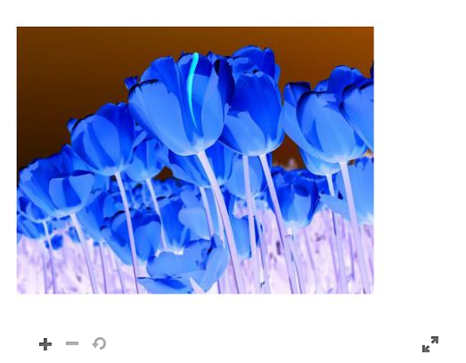

# Gestire le risorse {#manage-assets}

Questo articolo descrive come gestire e modificare le risorse in Adobe Experience Manager Assets. Per gestire i frammenti di contenuto, consulta le risorse [Frammenti di contenuto](content-fragments/content-fragments.md) .

## Crea cartelle {#creating-folders}

Quando organizzi una raccolta di risorse, ad esempio tutte le immagini `Nature`, puoi creare cartelle per mantenerle intatte. Puoi utilizzare le cartelle per suddividere in categorie e organizzare le risorse. [!DNL Experience Manager Assets] non richiede di organizzare meglio le risorse nelle cartelle.

>[!NOTE]
>
>* La condivisione di una cartella di risorse di tipo `sling:OrderedFolder` non è supportata quando si condivide con il Marketing Cloud. Per condividere una cartella, non selezionare [!UICONTROL Ordinato] durante la creazione di una cartella.
>* L&#39;Experience Manager non consente l&#39;utilizzo di `subassets` word come nome di una cartella. È una parola chiave riservata al nodo che contiene risorse secondarie per le risorse composte


1. Passa alla posizione nella cartella delle risorse digitali in cui desideri creare una nuova cartella. Nel menu, fai clic su **[!UICONTROL Crea]**. Selezionare **[!UICONTROL Nuova cartella]**.
1. Nel campo **[!UICONTROL Titolo]** , specifica il nome di una cartella. Per impostazione predefinita, DAM utilizza il titolo fornito come nome della cartella. Una volta creata la cartella, è possibile sostituire l’impostazione predefinita e specificare un altro nome di cartella.
1. Fai clic su **[!UICONTROL Crea]**. La cartella viene visualizzata nella cartella delle risorse digitali.

I seguenti caratteri (elenco separato da spazi) non sono supportati:

* Il nome di un file di risorsa non può contenere i seguenti caratteri: `* / : [ \\ ] | # % { } ? &`
* Il nome di una cartella di risorse non può contenere i seguenti caratteri: `* / : [ \\ ] | # % { } ? \" . ^ ; + & \t`

## Caricare risorse {#uploading-assets}

Consulta [aggiungere risorse digitali ad Experience Manager](add-assets.md).

## Rileva risorse duplicate {#detect-duplicate-assets}

<!-- TBD: This feature may not work as documented. See CQ-4283718. Get PM review done. -->

Se un utente DAM carica una o più risorse già esistenti nell’archivio, [!DNL Experience Manager] rileva la duplicazione e notifica l’utente. Il rilevamento dei duplicati è disattivato per impostazione predefinita in quanto può avere un impatto sulle prestazioni a seconda delle dimensioni dell’archivio e del numero di risorse caricate. Per abilitare la funzione, configura [!UICONTROL Adobe AEM Cloud Asset Duplication Detector]. Vedi [come eseguire le configurazioni OSGi](https://experienceleague.adobe.com/docs/experience-manager-cloud-service/implementing/deploying/configuring-osgi.html). Il rilevamento della duplicazione si basa sul valore univoco `dam:sha1` memorizzato in `jcr:content/metadata/dam:sha1`. Ciò significa che le risorse duplicate vengono rilevate anche se i nomi dei file sono diversi.


Puoi aggiungere il file di configurazione `/apps/example/config.author/com.adobe.cq.assetcompute.impl.assetprocessor.AssetDuplicationDetector.cfg.json` nel codice personalizzato e il file può contenere quanto segue:

```json
{
  "enabled":true,
  "detectMetadataField":"dam:sha1"
}
```

Una volta attivato, Experience Manager invia le notifiche delle risorse duplicate alla casella in entrata. È un risultato aggregato per più duplicati. Gli utenti possono scegliere di rimuovere le risorse in base ai risultati.


## Anteprima delle risorse {#previewing-assets}

Per visualizzare l’anteprima di una risorsa, effettua le seguenti operazioni.

1. Dall’interfaccia utente Assets, individua il percorso della risorsa da visualizzare in anteprima.
1. Tocca la risorsa desiderata per aprirla.

1. Nella modalità di anteprima, le opzioni di zoom sono disponibili per [tipi di immagine supportati](/help/assets/file-format-support.md) (con modifica interattiva).

   Per ingrandire una risorsa, tocca o fai clic su `+` (o tocca o fai clic sulla lente di ingrandimento sulla risorsa). Per ridurre lo zoom, tocca o fai clic su `-`. Quando ingrandisci, puoi osservare da vicino qualsiasi area dell&#39;immagine tramite panoramica. La freccia di reimpostazione dello zoom consente di tornare alla visualizzazione originale.

   Toccare **[!UICONTROL Reset]** per ripristinare la visualizzazione alle dimensioni originali.

## Modifica delle proprietà {#editing-properties}

1. Andate alla posizione della risorsa di cui desiderate modificare i metadati.

1. Seleziona la risorsa e tocca o fai clic su **[!UICONTROL Proprietà]** nella barra degli strumenti per visualizzare le proprietà della risorsa. In alternativa, scegli l’azione rapida **[!UICONTROL Proprietà]** sulla scheda delle risorse.

   

1. Nella pagina [!UICONTROL Proprietà] , modifica le proprietà dei metadati in varie schede. Ad esempio, nella scheda **[!UICONTROL Base]** , modifica il titolo, la descrizione e così via.

   >[!NOTE]
   >
   >Il layout della pagina [!UICONTROL Proprietà] e le proprietà dei metadati disponibili dipendono dallo schema di metadati sottostante. Per informazioni su come modificare il layout della pagina [!UICONTROL Proprietà], consulta [Schemi di metadati](/help/assets/metadata-schemas.md).

1. Per pianificare una data/ora specifica per l’attivazione della risorsa, utilizza il selettore data posto accanto al campo **[!UICONTROL On Time (All’ora)]**.

   

1. Per disattivare la risorsa dopo una determinata durata, scegli la data/ora di disattivazione dal selettore data accanto al campo **[!UICONTROL Ora di disattivazione]** . La data di disattivazione deve essere successiva alla data di attivazione di una risorsa. Dopo il [!UICONTROL Tempo di disattivazione], una risorsa e le relative rappresentazioni non sono disponibili tramite l’interfaccia web di Assets o tramite l’API HTTP.

   

1. Nel campo **[!UICONTROL Tag]** , seleziona uno o più tag. Per aggiungere un tag personalizzato, digita il nome del tag nella casella e seleziona la chiave `Enter` . Il nuovo tag viene salvato in [!DNL Experience Manager].

   YouTube richiede la pubblicazione di tag e un collegamento a YouTube (se è possibile trovare un collegamento appropriato).

   >[!NOTE]
   >
   >Per creare i tag, devi disporre dell&#39;autorizzazione di scrittura nel percorso `/content/cq:tags/default` dell&#39;archivio CRX.

1. Tocca o fai clic su **[!UICONTROL Salva e chiudi]**.

1. Passa all’interfaccia utente Assets. Le proprietà dei metadati modificate, inclusi titolo, descrizione e tag, vengono visualizzate sulla scheda delle risorse nella vista Scheda e nelle relative colonne nella vista Elenco.

<!-- TBD: Uncomment after verification for Dec release.

## View asset usage and references {#usage-and-references}

[!DNL Experience Manager] lets you track statistics about usage of a digital asset. The usage statistics include the following:

    * Number of times the asset was viewed or downloaded
    * Channels/devices through which the asset was used
    * Creative solutions where the asset was recently used

To view usage statistics for an asset, in the [!UICONTROL Properties] page, click the **[!UICONTROL Insights]** tab. For more details, see [Asset Insights](assets-insights.md).

[!DNL Experience Manager] also lets you check all the incoming references to an asset, that is, the usage of an asset in remote [!DNL Sites] and in compound assets. Authors of webpages on [!DNL Experience Manager Sites] deployment can use an asset on a remote [!DNL Assets] deployment using the Connected Assets functionality. The [!UICONTROL References] tab in an asset's [!UICONTROL Properties] page lists the local and remote references of the asset. That is, the use of assets in compound assets in [!DNL Assets] and its use in remote [!DNL Sites] pages.

-->

## Copia risorse {#copying-assets}

Quando copi una risorsa o una cartella, viene copiata l’intera risorsa o la cartella insieme alla relativa struttura del contenuto. Una risorsa o una cartella copiata viene duplicata nel percorso di destinazione. La risorsa nella posizione di origine non viene modificata.

Alcuni attributi univoci per una particolare copia di una risorsa non vengono riportati in avanti. Alcuni esempi sono:

* ID risorsa, data e ora di creazione, versioni e cronologia delle versioni. Alcune di queste proprietà sono indicate dalle proprietà `jcr:uuid`, `jcr:created` e `cq:name`.

* L’ora di creazione e i percorsi di riferimento sono univoci per ogni risorsa e per ogni suo rendering.

Le altre proprietà e informazioni sui metadati vengono mantenute. Non viene creata una copia parziale durante la copia di una risorsa.

1. Dall’interfaccia utente Assets, seleziona una o più risorse, quindi tocca o fai clic sull’icona **[!UICONTROL Copia]** nella barra degli strumenti. In alternativa, seleziona l’azione rapida **[!UICONTROL Copia]**  dalla scheda delle risorse.

   >[!NOTE]
   >
   >Se utilizzi l’azione rapida [!UICONTROL Copia], puoi copiare una sola risorsa alla volta.

1. Andate alla posizione in cui desiderate copiare le risorse.

   >[!NOTE]
   >
   >Se copi una risorsa nella stessa posizione, [!DNL Experience Manager] genera automaticamente una variante del nome. Ad esempio, se copi una risorsa denominata `Square`, [!DNL Experience Manager] genera automaticamente il titolo della relativa copia come `Square1`.

1. Fai clic sull&#39;icona della risorsa **[!UICONTROL Incolla]** nella barra degli strumenti. Le risorse vengono copiate in questa posizione.

   

   >[!NOTE]
   >
   >L’icona **[!UICONTROL Incolla]** è disponibile nella barra degli strumenti fino al completamento dell’operazione Incolla.

### Spostare o rinominare le risorse {#moving-or-renaming-assets}

1. Andate alla posizione della risorsa da spostare.

1. Seleziona la risorsa e tocca o fai clic sull&#39;icona **[!UICONTROL Sposta]**  nella barra degli strumenti.

1. Nella procedura guidata Sposta risorse , effettua una delle seguenti operazioni:

   * Specifica il nome della risorsa dopo averlo spostata. Quindi tocca o fai clic su **[!UICONTROL Avanti]** per procedere.

   * Tocca o fai clic su **[!UICONTROL Annulla]** per interrompere il processo.
   >[!NOTE]
   >
   >* Potete specificare lo stesso nome per la risorsa se nella nuova posizione non è presente alcuna risorsa con tale nome. Tuttavia, se sposti la risorsa in una posizione in cui esiste una risorsa con lo stesso nome, utilizza un nome diverso. Se utilizzi lo stesso nome, il sistema genera automaticamente una variante del nome. Ad esempio, se la risorsa ha il nome Square, il sistema genera il nome Square1 per la relativa copia.
   >* Durante la ridenominazione, lo spazio vuoto non è consentito nel nome del file.


1. Nella finestra di dialogo **[!UICONTROL Seleziona destinazione]**, effettua una delle seguenti operazioni:

   * Passa alla nuova posizione delle risorse, quindi tocca o fai clic su **[!UICONTROL Avanti]** per procedere.

   * Tocca o fai clic su **[!UICONTROL Indietro]** per tornare alla schermata **[!UICONTROL Rinomina]** .

1. Se le risorse spostate dispongono di pagine, risorse o raccolte di riferimento, la scheda **[!UICONTROL Regola riferimenti]** viene visualizzata accanto alla scheda **[!UICONTROL Seleziona destinazione]** .

   Effettua una delle seguenti operazioni nella schermata **[!UICONTROL Regola riferimenti]**:

   * Specifica i riferimenti da regolare in base ai nuovi dettagli, quindi tocca o fai clic su **[!UICONTROL Sposta]** per procedere.

   * Dalla colonna **[!UICONTROL Regola]** , seleziona o deseleziona i riferimenti alle risorse.
   * Tocca o fai clic su **[!UICONTROL Indietro]** per tornare alla schermata **[!UICONTROL Seleziona destinazione]**.

   * Tocca o fai clic su **[!UICONTROL Annulla]** per interrompere l’operazione di spostamento.

   Se non aggiorni i riferimenti, continuano a indicare il percorso precedente della risorsa. Se regoli i riferimenti, vengono aggiornati al nuovo percorso della risorsa.

### Gestire le rappresentazioni {#managing-renditions}

1. Puoi aggiungere o rimuovere rappresentazioni per una risorsa, tranne l’originale. Passa alla posizione della risorsa per la quale desideri aggiungere o rimuovere rappresentazioni.

1. Tocca o fai clic sulla risorsa per aprire la relativa pagina di risorse.

   

1. Tocca o fai clic sull’icona di navigazione globale e seleziona **[!UICONTROL Rappresentazioni]** dall’elenco.

   

1. Nel pannello **[!UICONTROL Rendering]** , visualizza l’elenco delle rappresentazioni generate per la risorsa.

   

   >[!NOTE]
   >
   >Per impostazione predefinita, [!DNL Experience Manager Assets] non visualizza il rendering originale della risorsa in modalità anteprima. Gli amministratori possono utilizzare le sovrapposizioni per configurare [!DNL Assets] per visualizzare le rappresentazioni originali in modalità di anteprima.

1. Selezionare un rendering per visualizzare o eliminare il rendering.

   **Eliminazione di un rendering**

   Seleziona un rendering dal pannello **[!UICONTROL Rendering]**, quindi tocca o fai clic sull&#39;icona **[!UICONTROL Elimina rappresentazione]** nella barra degli strumenti. Le rappresentazioni non possono essere eliminate in blocco al termine dell’elaborazione delle risorse. Per le singole risorse, puoi rimuovere manualmente i rendering dall’interfaccia utente. Per più risorse, puoi personalizzare [!DNL Experience Manager] per eliminare rappresentazioni specifiche o eliminare le risorse e ricaricare le risorse eliminate.

   

   **Caricamento di un nuovo rendering**

   Vai alla pagina dei dettagli della risorsa, quindi tocca o fai clic sull’icona **[!UICONTROL Aggiungi rappresentazione]** della barra degli strumenti per caricare una nuova rappresentazione della risorsa.

   

   >[!NOTE]
   >
   >Se selezioni un rendering dal pannello **[!UICONTROL Rendering]**, la barra degli strumenti cambia contesto, visualizzando solo le azioni del rendering specifico. Le opzioni non sono visualizzate, ad esempio l’icona Carica rappresentazione. Per visualizzare queste opzioni nella barra degli strumenti, vai alla pagina dei dettagli della risorsa.

   Puoi configurare le dimensioni per il rendering da visualizzare nella pagina dei dettagli di un’immagine o di una risorsa video. In base alle dimensioni specificate, Assets visualizza il rendering con le dimensioni esatte o più vicine.

   Per configurare le dimensioni di rendering di un’immagine a livello di dettaglio della risorsa, sovrapponi il nodo `renditionpicker` (`libs/dam/gui/content/assets/assetpage/jcr:content/body/content/content/items/assetdetail/items/col1/items/assetview/renditionpicker`) e configura il valore della proprietà larghezza.  Per personalizzare il rendering sulla pagina dei dettagli della risorsa in base alle dimensioni dell’immagine, configura la proprietà **[!UICONTROL size (Long) in KB (dimensione (lunga) in KB)]** al posto della larghezza. Per la personalizzazione basata sulle dimensioni, la proprietà `preferOriginal` assegna le preferenze all’originale se la dimensione del rendering corrispondente è maggiore.

   Allo stesso modo, è possibile personalizzare l&#39;immagine della pagina Annotazione sovrapponendo `libs/dam/gui/content/assets/annotate/jcr:content/body/content/content/items/content/renditionpicker`.

   

   Per configurare le dimensioni di rendering per una risorsa video, passa al nodo `videopicker` nell’archivio CRX nella posizione `/libs/dam/gui/content/assets/assetpage/jcr:content/body/content/content/items/assetdetail/items/col1/items/assetview/videopicker`, sovrapponi il nodo e quindi modifica la proprietà appropriata.

   >[!NOTE]
   >
   >Le annotazioni video sono supportate solo sui browser con formati video compatibili con HTML5. Inoltre, a seconda del browser, sono supportati diversi formati video.

## Eliminare le risorse {#delete-assets}

Per risolvere o rimuovere i riferimenti in entrata da altre pagine, aggiorna i riferimenti rilevanti prima di eliminare una risorsa.

Inoltre, disattiva il pulsante force delete utilizzando una sovrapposizione, per impedire agli utenti di eliminare le risorse di riferimento e di lasciare i collegamenti interrotti.

1. Andate alla posizione delle risorse che desiderate eliminare.

1. Seleziona la risorsa e tocca o fai clic sull’icona **[!UICONTROL Elimina]** nella barra degli strumenti.

   

1. Nella finestra di dialogo di conferma, fai clic su:

   * **** Annulla per interrompere l’azione
   * **[!UICONTROL Elimina]** per confermare l’azione:

      * Se la risorsa non ha riferimenti, viene eliminata.
      * Se la risorsa dispone di riferimenti, un messaggio di errore segnala che **Una o più risorse dispongono di riferimenti.** Potete selezionare **[!UICONTROL Forza eliminazione]** o **[!UICONTROL Annulla]**.

   >[!NOTE]
   >
   >Per poter eliminare una risorsa è necessario disporre delle autorizzazioni di eliminazione per dam/asset. Se disponi solo di autorizzazioni di modifica, puoi modificare solo i metadati della risorsa e aggiungere annotazioni alla risorsa. Tuttavia, non puoi eliminare la risorsa o i relativi metadati.

   >[!NOTE]
   >
   >Per risolvere o rimuovere i riferimenti in entrata da altre pagine, aggiorna i riferimenti rilevanti prima di eliminare una risorsa.
   >
   >
   >Inoltre, disattiva il pulsante force delete utilizzando una sovrapposizione, per impedire agli utenti di eliminare le risorse di riferimento e di lasciare i collegamenti interrotti.

## Scaricare le risorse {#download-assets}

Consulta [Scaricare risorse da [!DNL Experience Manager]](/help/assets/download-assets-from-aem.md).

## Pubblicare o annullare la pubblicazione delle risorse {#publish-assets}

1. Passa alla posizione della risorsa o della cartella di risorse che desideri pubblicare o che desideri rimuovere dall’ambiente di pubblicazione (Annulla pubblicazione).

1. Seleziona la risorsa o la cartella da pubblicare o di cui annullare la pubblicazione e seleziona l’opzione **[!UICONTROL Gestisci pubblicazione]**  nella barra degli strumenti. In alternativa, per pubblicare rapidamente, seleziona l’opzione **[!UICONTROL Pubblicazione rapida]** nella barra degli strumenti. Se la cartella da pubblicare include una cartella vuota, questa non verrà pubblicata.

1. Seleziona l&#39;opzione **[!UICONTROL Pubblica]** o **[!UICONTROL Annulla pubblicazione]** a seconda delle esigenze.

   
   *Figura: Opzioni di pubblicazione e annullamento della pubblicazione e opzione di pianificazione.*

1. Seleziona **[!UICONTROL Now]** per agire immediatamente sulla risorsa oppure seleziona **[!UICONTROL Later]** per pianificare l’azione. Selezionare una data e un&#39;ora se si sceglie l&#39;opzione **[!UICONTROL Più tardi]**. Fai clic su **[!UICONTROL Avanti]**.

1. Durante la pubblicazione, se una risorsa fa riferimento ad altre risorse, i relativi riferimenti sono elencati nella procedura guidata. Vengono visualizzati solo i riferimenti, che vengono annullati o modificati dall’ultima pubblicazione. Scegli i riferimenti da pubblicare.

1. Quando si annulla la pubblicazione, se una risorsa fa riferimento ad altre risorse, scegliete i riferimenti di cui desiderate annullare la pubblicazione. Fai clic su **[!UICONTROL Annulla pubblicazione]**. Nella finestra di dialogo di conferma, fai clic su **[!UICONTROL Annulla]** per interrompere l’azione oppure fai clic su **[!UICONTROL Annulla pubblicazione]** per confermare che le risorse devono essere annullate alla data specificata.

Scopri i seguenti limiti e suggerimenti relativi alla pubblicazione o all’annullamento della pubblicazione di risorse o cartelle:

* L&#39;opzione [!UICONTROL Gestisci pubblicazione] è disponibile solo per gli account utente che dispongono di autorizzazioni di replica.
* Quando si annulla la pubblicazione di una risorsa complessa, è necessario annullare la pubblicazione solo della risorsa. Evita di annullare la pubblicazione dei riferimenti, poiché altri contenuti pubblicati potrebbero farvi riferimento.
* Le cartelle vuote non vengono pubblicate.
* Se pubblichi una risorsa in fase di elaborazione, viene pubblicato solo il contenuto originale. Mancano i rendering. Attendi il completamento dell’elaborazione, quindi pubblica o ripubblica la risorsa al termine dell’elaborazione.

## Gruppo utenti chiuso {#closed-user-group}

Un gruppo utenti chiuso (CUG) viene utilizzato per limitare l’accesso a specifiche cartelle di risorse pubblicate da [!DNL Experience Manager]. Se si crea un CUG per una cartella, l’accesso alla cartella (incluse le risorse della cartella e le sottocartelle) è limitato solo ai membri o ai gruppi assegnati. Per accedere alla cartella, è necessario che accedano utilizzando le proprie credenziali di sicurezza.

I gruppi di utenti chiusi rappresentano un modo aggiuntivo per limitare l’accesso alle risorse. Puoi anche configurare una pagina di accesso per la cartella.

1. Seleziona una cartella dall’interfaccia utente Assets, quindi tocca o fai clic sull’icona Proprietà nella barra degli strumenti per visualizzare la pagina delle proprietà.
1. Dalla scheda **[!UICONTROL Autorizzazioni]**, aggiungi membri o gruppi in **[!UICONTROL Gruppo utenti chiuso]**.

   

1. Per visualizzare una schermata di accesso quando gli utenti accedono alla cartella, seleziona l&#39;opzione **[!UICONTROL Abilita]** . Quindi, seleziona il percorso di una pagina di accesso in [!DNL Experience Manager] e salva le modifiche.

   

   >[!NOTE]
   >
   >Se non specifichi il percorso di una pagina di accesso, [!DNL Experience Manager] visualizza la pagina di accesso predefinita nell’istanza di pubblicazione.

1. Pubblica la cartella e prova ad accedervi dall&#39;istanza di pubblicazione. Viene visualizzata una schermata di accesso.
1. Se sei un membro CUG, immetti le tue credenziali di protezione. La cartella viene visualizzata dopo l’autenticazione di [!DNL Experience Manager] .

## Cercare risorse {#search-assets}

La ricerca delle risorse è fondamentale per l’utilizzo di un sistema di gestione delle risorse digitali, sia per l’ulteriore utilizzo da parte dei creativi, per una gestione affidabile delle risorse da parte degli utenti aziendali e dei professionisti del marketing, sia per l’amministrazione da parte degli amministratori DAM.

Per ricerche semplici, avanzate e personalizzate per individuare e utilizzare le risorse più appropriate, consulta [cercare le risorse in [!DNL Experience Manager]](/help/assets/search-assets.md).

## Azioni rapide {#quick-actions}

Le icone delle azioni rapide sono disponibili per una singola risorsa alla volta. A seconda del dispositivo, esegui le seguenti azioni per visualizzare le icone delle azioni rapide:

* Dispositivi touch: Toccare e tenere premuto. Ad esempio, su un iPad, puoi toccare e tenere premuto un contenuto per visualizzare le azioni rapide.
* Dispositivi non touch: Puntatore al passaggio del mouse. Ad esempio, su un dispositivo desktop, se passi il puntatore sulla miniatura della risorsa viene visualizzata la barra delle azioni rapide.

## Modifica immagini {#editing-images}

Gli strumenti di modifica nell’ interfaccia [!DNL Experience Manager Assets] consentono di eseguire piccoli processi di modifica sulle risorse di immagini. È possibile ritagliare, ruotare, capovolgere ed eseguire altri lavori di modifica sulle immagini. Puoi anche aggiungere mappe immagine alle risorse.

>[!NOTE]
>
>Per alcuni componenti, la modalità a tutto schermo dispone di opzioni aggiuntive.

1. Effettua una delle seguenti operazioni per aprire una risorsa in modalità di modifica:

   * Seleziona la risorsa e tocca o fai clic sull’icona **[!UICONTROL Modifica]** nella barra degli strumenti.
   * Tocca o fai clic sull&#39;icona **[!UICONTROL Modifica]** che appare su una risorsa nella vista Scheda.
   * Nella pagina delle risorse, tocca o fai clic sull’icona **[!UICONTROL Modifica]** nella barra degli strumenti.

   

1. Per ritagliare l&#39;immagine, tocca o fai clic sull&#39;icona **Ritaglia** .

   

1. Seleziona l’opzione desiderata dall’elenco. L’area di ritaglio viene visualizzata sull’immagine in base all’opzione scelta. L’opzione **Mano libera** consente di ritagliare l’immagine senza limitazioni di proporzioni.

   

1. Selezionate l&#39;area da ritagliare e ridimensionatela o riposizionatela sull&#39;immagine.
1. Utilizza l&#39;icona **Fine** (angolo in alto a destra) per ritagliare l&#39;immagine. Facendo clic sull&#39;icona **Fine** si attiva anche la rigenerazione dei rendering.

   

1. Utilizza le icone **Annulla** e **Ripeti** in alto a destra rispettivamente per ripristinare l’immagine non ritagliata o mantenere l’immagine ritagliata.

   

1. Tocca o fai clic sull’icona Ruota appropriata per ruotare l’immagine in senso orario o antiorario.

   

1. Tocca o fai clic sull’icona Capovolgi appropriata per capovolgere l’immagine in orizzontale o verticale.

   

1. Tocca o fai clic sull&#39;icona **Fine** per salvare le modifiche.

   

>[!NOTE]
>
>La modifica delle immagini è supportata per i formati di file BMP, GIF, PNG e JPEG.

<!-- You can also add image maps using the image editor. For details, see [Adding Image Maps](/help/assets/image-maps.md). -->

>[!NOTE]
>
>Per modificare un file TXT, imposta **Day CQ Link Externalizer** da Configuration Manager.

## Timeline  {#timeline}

La timeline consente di visualizzare vari eventi per un elemento selezionato, ad esempio flussi di lavoro attivi per una risorsa, commenti/annotazioni, registri attività e versioni.


*risorsaFigura: Ordinare le voci della timeline per una risorsa*

>[!NOTE]
>
>Nella [console Raccolte](/help/assets/manage-collections.md#navigate-the-collections-console), l’elenco **[!UICONTROL Mostra tutto]** offre opzioni per visualizzare solo i commenti e i flussi di lavoro. Inoltre, la timeline viene visualizzata solo per le raccolte di primo livello elencate nella console. Non viene visualizzato se vi spostate all’interno di una qualsiasi delle raccolte.

>[!NOTE]
>
>La timeline contiene diverse opzioni [specifiche per i frammenti di contenuto](content-fragments/content-fragments.md).

## Annotazione {#annotating}

Le annotazioni sono commenti o note esplicative aggiunte a immagini o video. Le annotazioni consentono agli addetti al marketing di collaborare e lasciare un feedback sulle risorse.

Le annotazioni video sono supportate solo sui browser con formati video compatibili con HTML5. I formati video supportati da Assets dipendono dal browser.

>[!NOTE]
>
>Per i frammenti di contenuto, le [annotazioni vengono create nell’editor frammenti](content-fragments/content-fragments.md).

1. Andate alla posizione della risorsa alla quale desiderate aggiungere annotazioni.
1. Tocca o fai clic sull’icona **[!UICONTROL Annota]** da uno dei seguenti elementi:

   * [Azioni rapide](#quick-actions)
   * Dalla barra degli strumenti dopo aver selezionato la risorsa o essere passato alla pagina della risorsa

   

1. Aggiungi un commento nella casella **[!UICONTROL Commento]** posta nella parte inferiore della timeline. In alternativa, contrassegna un’area sull’immagine e aggiungi un’annotazione nella finestra di dialogo **[!UICONTROL Aggiungi annotazione]**.

   

<!--
1. To notify a user about an annotation, specify the email address of the user and add the comment. For example, to notify Aaron MacDonald about an annotation, enter @aa. Hints for all matching users is displayed in a list. Select Aaron's email address from the list to tag her with the comment. Similarly, you can tag more users anywhere within the annotation or before or after it.
-->

>[!NOTE]
>
>Per un utente non amministratore, i suggerimenti vengono visualizzati solo se l&#39;utente dispone delle autorizzazioni di lettura in `/home` in CRXDE.


1. Dopo aver aggiunto l’annotazione, fai clic su **[!UICONTROL Aggiungi]** per salvarla. Ad Aaron viene inviata una notifica relativa all’annotazione.

   

   >[!NOTE]
   >
   >È possibile aggiungere più annotazioni prima di salvarle.

1. Tocca o fai clic su **[!UICONTROL Chiudi]** per uscire dalla modalità Annotazione.
1. Per visualizzare la notifica, accedi a Risorse con le credenziali di Aaron MacDonald e fai clic sull&#39;icona **[!UICONTROL Notifiche]** per visualizzare la notifica.

   >[!NOTE]
   >
   >Le annotazioni possono essere aggiunte anche alle risorse video. Durante l&#39;annotazione dei video, il lettore si mette in pausa per consentirvi di annotare un fotogramma. Per informazioni dettagliate, consulta [Gestione delle risorse video](manage-video-assets.md).

1. Per scegliere un colore diverso per differenziare gli utenti, tocca o fai clic sull’icona Profilo e tocca o fai clic su **[!UICONTROL Preferenze]**.

   

   Nella casella **[!UICONTROL Colore annotazione]**, specifica il colore desiderato, infine tocca o fai clic su **[!UICONTROL Accetta]**.

   

>[!NOTE]
>
>È inoltre possibile aggiungere annotazioni a una raccolta. Tuttavia, se una raccolta contiene raccolte figlie, è possibile aggiungere annotazioni/commenti solo alla raccolta principale. L’opzione Annota non è disponibile per le raccolte figlio.

### Visualizzare le annotazioni salvate {#viewing-saved-annotations}

1. Per visualizzare le annotazioni salvate per una risorsa, accedi alla posizione della risorsa e apri la pagina della risorsa.

1. Tocca o fai clic sull&#39;icona di navigazione globale e scegli **[!UICONTROL Timeline]** dall&#39;elenco.

   

1. Dall’elenco **[!UICONTROL Mostra tutti]** nella timeline, seleziona **[!UICONTROL Commenti]** per filtrare i risultati in base alle annotazioni.

   

   Tocca o fai clic su un commento nel pannello **[!UICONTROL Timeline]** per visualizzare l’annotazione corrispondente sull’immagine.

   

   Tocca o fai clic su **[!UICONTROL Elimina]** per eliminare un particolare commento.

### Stampa annotazioni {#printing-annotations}

Se una risorsa dispone di annotazioni o è stata sottoposta a un flusso di lavoro di revisione, puoi stampare la risorsa insieme ad annotazioni e rivederla come file PDF per la revisione offline.

È inoltre possibile scegliere di stampare solo le annotazioni o lo stato di revisione.

Per stampare le annotazioni e controllare lo stato, tocca o fai clic sull&#39;icona **[!UICONTROL Stampa]** e segui le istruzioni della procedura guidata. L’icona **[!UICONTROL Stampa]** viene visualizzata nella barra degli strumenti solo se alla risorsa è assegnata almeno un’annotazione o uno stato di revisione.

1. Dall’interfaccia utente Assets, apri la pagina di anteprima per una risorsa.
1. Effettua una delle operazioni seguenti:

   * Per stampare tutte le annotazioni e lo stato di revisione, saltare il passaggio 3 e passare direttamente al passaggio 4.
   * Per stampare annotazioni specifiche e controllare lo stato, aprire la [timeline](/help/assets/manage-digital-assets.md#timeline) e quindi passare al punto 3.

1. Per stampare annotazioni specifiche, selezionate le annotazioni nella timeline.

   

   Per stampare solo lo stato di revisione, selezionarlo dalla timeline.

   

1. Tocca o fai clic sull’icona **[!UICONTROL Stampa]** nella barra degli strumenti.

   

1. Nella finestra di dialogo Stampa, scegliere la posizione in cui visualizzare le annotazioni o lo stato di revisione sul PDF. Ad esempio, se desideri che le annotazioni/lo stato vengano stampati in alto a destra della pagina contenente l’immagine stampata, utilizza l’impostazione **In alto a sinistra**. È selezionata per impostazione predefinita.

   

   È possibile scegliere altre impostazioni, a seconda della posizione in cui si desidera visualizzare le annotazioni o lo stato nel PDF stampato. Se vuoi che le annotazioni o lo stato vengano visualizzati in una pagina separata dalla risorsa stampata, scegli **[!UICONTROL Pagina successiva]**.

1. Fare clic su **[!UICONTROL Stampa]**. A seconda dell’opzione scelta al passaggio 2, il PDF generato visualizza annotazioni/stato nella posizione specificata. Ad esempio, se scegli di stampare sia le annotazioni che lo stato di revisione utilizzando l’impostazione **In alto a sinistra**, l’output generato sarà simile al file PDF qui riportato.

   

1. Scarica o stampa il PDF utilizzando le opzioni in alto a destra.

   

   Per modificare l&#39;aspetto del file PDF renderizzato, ad esempio il colore, la dimensione e lo stile del font, il colore di sfondo dei commenti e degli stati, aprire la **[!UICONTROL Configurazione PDF di annotazione]** in Gestione configurazione e modificare le opzioni desiderate. Ad esempio, per modificare il colore di visualizzazione dello stato approvato, modificare il codice del colore nel campo corrispondente. Per informazioni sulla modifica del colore del font delle annotazioni, vedere [Annotazione](/help/assets/manage-digital-assets.md#annotating).

   

   Torna al file PDF renderizzato e aggiornalo. Il PDF aggiornato riflette le modifiche apportate.

## Controllo delle versioni delle risorse {#asset-versioning}

Il controllo delle versioni crea un’istantanea delle risorse digitali in un momento preciso. Il controllo delle versioni consente di ripristinare le risorse a uno stato precedente in un secondo momento. Ad esempio, per annullare una modifica apportata a una risorsa, ripristina la versione non modificata della risorsa.

Di seguito sono riportati gli scenari in cui si creano versioni:

* Puoi modificare un’immagine in un’altra applicazione e caricarla in Assets. Viene creata una versione dell’immagine in modo che l’immagine originale non venga sovrascritta.
* Puoi modificare i metadati di una risorsa.
* Utilizza l’ app desktop [!DNL Experience Manager] per estrarre una risorsa esistente e salvare le modifiche. A ogni salvataggio della risorsa viene creata una nuova versione.

È inoltre possibile abilitare il controllo delle versioni automatico tramite un flusso di lavoro. Quando crei una versione per una risorsa, i metadati e le rappresentazioni vengono salvati insieme alla versione. Le rappresentazioni sono alternative di rendering delle stesse immagini, ad esempio, una rappresentazione PNG di un file JPEG caricato.

La funzionalità di controllo delle versioni consente di effettuare le seguenti operazioni:

* Crea una versione di una risorsa.
* Visualizza la revisione corrente per una risorsa.
* Ripristina una versione precedente della risorsa.

1. Andate alla posizione della risorsa per la quale desiderate creare una versione e toccatela o fate clic per aprire la relativa pagina delle risorse.

1. Tocca o fai clic sull&#39;icona di Navigazione globale e scegli **[!UICONTROL Timeline]** dal menu.

   

1. Tocca o fai clic sull’icona **[!UICONTROL Azioni]** (freccia) in basso per visualizzare le azioni disponibili che puoi eseguire sulla risorsa.

   

1. Tocca o fai clic su **[!UICONTROL Salva come versione]** per creare una versione per la risorsa.

   

1. Aggiungi un&#39;etichetta e un commento, quindi fai clic su **[!UICONTROL Crea]** per creare una versione. In alternativa, tocca o fai clic su **Annulla** per uscire dall&#39;operazione.

   

1. Per visualizzare la nuova versione, apri l’elenco **[!UICONTROL Mostra tutti]** nella timeline dalla pagina dei dettagli della risorsa o dall’interfaccia utente Assets, quindi scegli **[!UICONTROL Versioni]**. Tutte le versioni create per una risorsa sono elencate nella scheda della timeline. Puoi filtrare l’elenco Versioni, facendo clic sulla freccia rivolta verso il basso e selezionando **[!UICONTROL Versioni]** dall’elenco.

   

1. Seleziona una versione specifica per la risorsa da visualizzare in anteprima o abilitare per visualizzarla nell’interfaccia utente di Assets.

   

1. Aggiungi un’etichetta e un commento per la versione da ripristinare alla versione specifica nell’interfaccia utente di Assets.

   

1. Per generare un’anteprima per la versione, tocca o fai clic su **[!UICONTROL Anteprima versione]**.
1. Per visualizzare questa versione nell’interfaccia utente Assets, seleziona **[!UICONTROL Ripristina questa versione]**.
1. Per confrontare tra due versioni, vai alla pagina della risorsa e tocca o fai clic sulla versione da confrontare con la versione corrente.

   

1. Dalla timeline, seleziona la versione da confrontare e trascina il cursore a sinistra per sovrapporre questa versione alla versione corrente e confrontare.

   

### Avviare un flusso di lavoro su una risorsa {#starting-a-workflow-on-an-asset}

1. Andate alla posizione della risorsa per la quale desiderate avviare un flusso di lavoro, quindi toccate o fate clic sulla risorsa per aprire la pagina della risorsa.
1. Tocca o fai clic sull’icona Navigazione globale e scegli **[!UICONTROL Timeline]** dal menu per visualizzare la timeline.

   

1. Tocca o fai clic sull’icona **[!UICONTROL Azioni]** (freccia) in basso per aprire l’elenco delle azioni disponibili per la risorsa.

   

1. Tocca o fai clic su **[!UICONTROL Avvia flusso di lavoro]** dall’elenco.

   

1. Nella finestra di dialogo **[!UICONTROL Avvia flusso di lavoro]** , seleziona un modello di flusso di lavoro dall’elenco.

   

1. (Facoltativo) Specifica un titolo per il flusso di lavoro, che può essere utilizzato per fare riferimento all’istanza del flusso di lavoro.

   

1. Tocca o fai clic su **[!UICONTROL Avvia]**, quindi, per confermare, tocca o fai clic su **[!UICONTROL Procedi]** nella finestra di dialogo. Ciascun passaggio del flusso di lavoro viene visualizzato nella timeline come un evento.

   

## Raccolte {#collections}

Una raccolta è un set ordinato di risorse. Utilizza le raccolte per condividere le risorse tra gli utenti.

* Una raccolta può includere risorse provenienti da posizioni diverse, poiché contiene solo riferimenti a tali risorse. Ogni raccolta mantiene l’integrità referenziale delle risorse.
* Puoi condividere raccolte con più utenti con diversi livelli di privilegi, ad esempio per la modifica, la visualizzazione e così via.

Per informazioni sulla gestione della raccolta, consulta [Gestione delle raccolte](/help/assets/manage-collections.md) .
