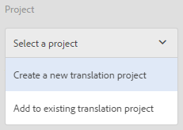

# Gestione delle risorse composte {#managing-compound-assets}

Risorse Adobe Experience Manager (AEM) può identificare se un file caricato contiene riferimenti a risorse già presenti nell’archivio. Questa funzione è disponibile solo per i formati di file supportati. Se la risorsa caricata contiene riferimenti a risorse AEM, viene creato un collegamento bidirezionale tra le risorse caricate e a cui viene fatto riferimento.

Oltre ad eliminare la ridondanza, il riferimento alle risorse AEM nelle applicazioni Adobe Creative Cloud migliora la collaborazione e aumenta l&#39;efficienza e la produttività degli utenti.

Risorse AEM supporta il riferimento **bidirezionale**. Potete trovare le risorse di riferimento nella pagina dei dettagli delle risorse del file caricato. Inoltre, potete visualizzare i file di riferimento per le risorse AEM nella pagina dei dettagli delle risorse della risorsa di riferimento.

I riferimenti vengono risolti in base a percorso, ID documento e ID istanza delle risorse a cui viene fatto riferimento.

## Aggiunta di Risorse AEM come riferimenti in Adobe Illustrator {#refai}

Potete fare riferimento a risorse AEM esistenti direttamente da un file Adobe Illustrator.

1. Utilizzando l’app [desktop](https://docs.adobe.com/content/help/en/experience-manager-desktop-app/using/using.html)AEM, installa l’archivio Risorse AEM come unità nel computer locale. Nell’unità montata, andate alla posizione della risorsa a cui desiderate fare riferimento.
1. Trascinate la risorsa dall’unità montata al file Illustrator.
1. Salvate il file Illustrator nell’unità montata o [caricatelo](/help/assets/manage-digital-assets.md#uploading-assets) nell’archivio di AEM.
1. Al termine del flusso di lavoro, passate alla pagina dei dettagli della risorsa. I riferimenti alle risorse AEM esistenti sono elencati in **Dipendenze** nella colonna **Riferimenti** .

   

1. Le risorse di riferimento visualizzate in **Dipendenze** possono essere utilizzate anche da file diversi da quello corrente. Per visualizzare un elenco dei file di riferimento per una risorsa, fai clic sulla risorsa in **Dipendenze**.

   

1. Fate clic sull’icona **Visualizza proprietà** dalla barra degli strumenti. Nella pagina delle proprietà, l’elenco dei file che fanno riferimento alla risorsa corrente viene visualizzato nella colonna **Riferimenti** della scheda **Base** .

   

## Aggiunta di risorse AEM come riferimenti in Adobe InDesign {#add-aem-assets-as-references-in-adobe-indesign}

Per fare riferimento a risorse AEM da un file InDesign, trascinate le risorse AEM nel file InDesign oppure esportate il file InDesign come file ZIP.

Le risorse di riferimento esistono già in AEM Assets. <!-- You can extract subassets by [configuring InDesign server](/help/assets/indesign.md). Embedded assets in an InDesign file are extracted as subassets. -->

>[!NOTE]
>
>Se il server InDesign è proxy, i file InDesign hanno la loro anteprima incorporata nei metadati XMP. In questo caso, l&#39;estrazione delle miniature non è obbligatoria in modo esplicito. Tuttavia, se il server InDesign non è proxy, le miniature devono essere estratte esplicitamente per i file InDesign.

### Creare riferimenti Trascinando le risorse AEM {#create-references-by-dragging-aem-assets}

Questa procedura è simile all’ [aggiunta di risorse AEM come riferimenti in Adobe Illustrator](#refai).

### Creare riferimenti a risorse AEM esportando un file ZIP {#create-references-to-aem-assets-by-exporting-a-zip-file}

1. Creare un nuovo modello di workflow.
1. Utilizzate la funzione Pacchetto di Adobe InDesign per esportare il documento.
Adobe InDesign può esportare come pacchetto un documento e le risorse collegate. In questo caso, la cartella esportata contiene una cartella Links che contiene risorse secondarie nel file InDesign.
1. Create un file ZIP e caricatelo nell’archivio AEM.
1. Avviate il flusso di lavoro Unarchiver.
1. Al termine del flusso di lavoro, i riferimenti nella cartella Links vengono automaticamente indicati come risorse secondarie. Per visualizzare un elenco delle risorse di riferimento, andate alla pagina dei dettagli delle risorse di InDesign e chiudete la [Barra](/help/sites-cloud/authoring/getting-started/basic-handling.md#rail-selector).

## Aggiungere risorse AEM come riferimenti in Adobe Photoshop {#refps}

1. Utilizzando un client WebDav, caricate Risorse AEM come unità.
1. Per creare riferimenti a risorse AEM in un file Photoshop, passa alle risorse corrispondenti nell’unità montata utilizzando la funzione Inserisci collegamento di Photoshop.

   

1. Salvate il file in Photoshop nell’unità montata o [caricatelo](/help/assets/manage-digital-assets.md#uploading-assets) nell’archivio AEM.
1. Al termine del flusso di lavoro, i riferimenti alle risorse AEM esistenti sono elencati nella pagina dei dettagli della risorsa.

   Per visualizzare le risorse a cui si fa riferimento, chiudete la [Barra](/help/sites-cloud/authoring/getting-started/basic-handling.md#rail-selector) nella pagina dei dettagli della risorsa.

1. Le risorse a cui viene fatto riferimento contengono anche l’elenco delle risorse a cui fanno riferimento. Per visualizzare un elenco delle risorse di riferimento, andate alla pagina dei dettagli delle risorse e chiudete la [Barra](/help/sites-cloud/authoring/getting-started/basic-handling.md#rail-selector).

>[!NOTE]
>
>È inoltre possibile fare riferimento alle risorse all’interno delle risorse composte in base al relativo ID documento e all’ID istanza. Questa funzionalità è disponibile solo nelle versioni Adobe Illustrator e Adobe Photoshop. Per altri, il riferimento viene fatto sulla base del percorso relativo delle risorse collegate nella risorsa composta principale, come già fatto nelle versioni precedenti di AEM.

## Visualizzare le pagine di un file con più pagine {#view-pages-of-a-multi-page-file}

La funzione Visualizzatore pagina di Risorse AEM consente di visualizzare singole pagine di file multipagina, inclusi file PDF, INDD, PPT, PPTX e Ai. Per InDesign, potete estrarre pagine utilizzando il server InDesign. Se le anteprime delle pagine vengono salvate durante la creazione di file InDesign, InDesign Server non è richiesto per l&#39;estrazione della pagina.

Potete sfogliare le singole pagine di un file dalla pagina della risorsa. È possibile utilizzare le opzioni della barra degli strumenti per annotare singole pagine del file. È inoltre possibile utilizzare l’opzione Panoramica **** pagina per visualizzare tutte le pagine contemporaneamente.

1. Passa alla cartella in Risorse AEM che contiene il file con più pagine.
1. Fate clic sulla risorsa per visualizzarne la pagina.

   

1. Fate clic sull&#39;icona Navigazione globale, quindi scegliete **Pagine** dal menu.

   

1. Fate clic sulle frecce verso sinistra o destra sotto l’immagine per passare alle singole pagine del file.

   

1. Per aggiungere annotazioni a una pagina, fate clic sull’icona **Annota** nella barra degli strumenti e aggiungete un commento.

   

1. Per scaricare il file, fate clic sull&#39;icona **Scarica** .

   

1. Per visualizzare tutte le pagine del file contemporaneamente, fare clic sull’icona Panoramica **** pagina.

   

1. Per visualizzare il flusso di attività per il file, comprese le annotazioni e i download, fate clic sull&#39;icona Navigazione globale e scegliete **Timeline** dal menu.

   

1. Per visualizzare e modificare le proprietà dei metadati della pagina, fate clic sull’icona **Visualizza proprietà** nella barra degli strumenti.

   
