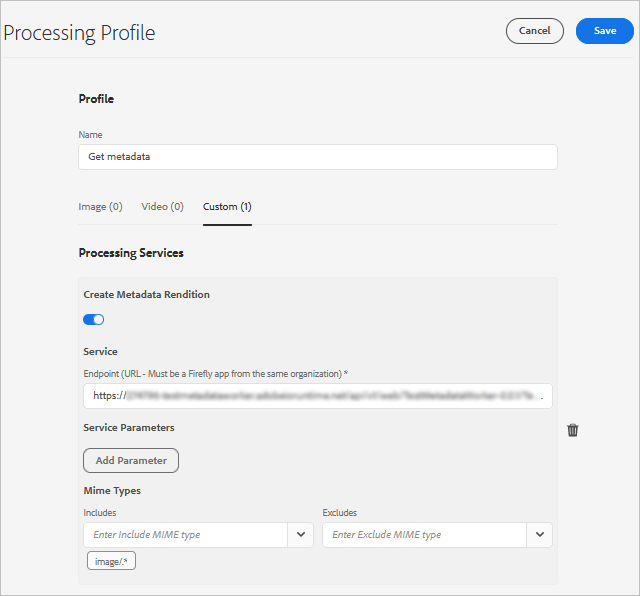

# Gestire i metadati delle risorse digitali {#managing-metadata-for-digital-assets}

| Versione | Collegamento articolo |
| -------- | ---------------------------- |
| AEM 6.5 | [Fai clic qui](https://experienceleague.adobe.com/docs/experience-manager-65/assets/using/metadata.html?lang=en) |
| AEM as a Cloud Service | Questo articolo |

[!DNL Adobe Experience Manager Assets] mantiene i metadati per ogni risorsa. Consente di categorizzare e organizzare più facilmente le risorse e aiuta le persone alla ricerca di una risorsa specifica. Grazie alla possibilità di estrarre i metadati dai file caricati in [!DNL Experience Manager Assets], la gestione dei metadati si integra con il flusso di lavoro creativo. Grazie alla possibilità di conservare e gestire i metadati con le risorse, è possibile organizzare ed elaborare automaticamente le risorse in base ai relativi metadati.

<!-- 
* [Metadata Schemata Reference](meta-ref.md)
-->

## Perché abbiamo bisogno dei metadati {#why-metadata}

I metadati indicano i dati sui dati. A questo proposito, i dati si riferiscono alla tua risorsa digitale, ad esempio un’immagine. I metadati sono fondamentali per una gestione efficiente delle risorse.

I metadati sono la raccolta di tutti i dati disponibili per una risorsa, ma che non sono necessariamente contenuti in tale immagine. Alcuni esempi di metadati sono:

* Nome della risorsa.
* Ora e data dell’ultima modifica.
* Dimensione della risorsa così come è stata memorizzata nell’archivio.
* Nome della cartella in cui è contenuto.
* Risorse correlate o tag applicati.

Le proprietà di metadati di base che [!DNL Experience Manager] può gestire per le risorse consentono agli utenti di visualizzare tutte le risorse. Ad esempio, ordinare le risorse per data dell’ultima modifica è utile quando si tenta di individuare le risorse aggiunte o modificate di recente.

Puoi aggiungere più dati di alto livello alle risorse digitali, ad esempio:

* Tipo di risorsa (si tratta di un’immagine, di un video, di una clip audio o di un documento?).
* Proprietario della risorsa.
* Titolo della risorsa.
* Descrizione della risorsa.
* Tag assegnati a una risorsa.

L&#39;utilizzo di più metadati consente di categorizzare ulteriormente le risorse ed è utile in caso di crescita della quantità di informazioni digitali. È possibile gestire alcune centinaia di file in base solo ai nomi dei file. Tuttavia, questo approccio non è scalabile. Non è sufficiente quando aumentano il numero di persone coinvolte e il numero di risorse gestite.

Con l’aggiunta dei metadati, il valore di una risorsa digitale aumenta, perché la risorsa diventa:

* Più accessibile: i sistemi e gli utenti possono trovarla facilmente.
* Più semplice da gestire: puoi trovare e modificare più facilmente le risorse che hanno uno stesso set di proprietà.
* Completa: la risorsa contiene più informazioni e contesto grazie a un maggior numero di metadati.

Per questi motivi, [!DNL Assets] offre i mezzi giusti per creare, gestire e scambiare metadati per le risorse digitali.

## Tipi di metadati {#types-of-metadata}

I metadati sono classificati come metadati tecnici, informativi e amministrativi.

### Metadati tecnici

I metadati tecnici si concentrano sugli aspetti tecnici delle risorse digitali, fornendo informazioni fondamentali relative a:

* Dimensione file
* Formato
* Risoluzione
* Dimensioni
* Metodo colore

Questo tipo di metadati aiuta gli utenti a comprendere e utilizzare in modo efficiente le risorse digitali.

### Metadati informativi

I metadati informativi forniscono informazioni descrittive per migliorare la comprensione dei contenuti, facilitando l’individuazione dei contenuti e la ricercabilità. Include parole chiave, didascalie e descrizioni.  Ad esempio, durante la gestione di un video in Experience Manager Assets, è possibile includere i seguenti metadati informativi:

* **Parole chiave**: marketing, lancio prodotto, promozione
* **Didascalia**: Presentazione del nostro prodotto più recente con caratteristiche entusiasmanti
* **Descrizione**: panoramica dettagliata del contenuto video.

### Metadati amministrativi

I metadati amministrativi trattano gli aspetti gestionali delle risorse digitali. Garantisce il controllo degli accessi, la conformità e la gestione del ciclo di vita complessivo delle risorse all’interno del sistema di gestione delle risorse digitali. Include informazioni relative a:

* Proprietà risorsa
* Diritti di utilizzo
* Autorizzazioni
* Altri dettagli amministrativi

Questo tipo di metadati garantisce una gestione efficace delle risorse, il controllo degli accessi e la conformità.

<!-- Learn more about [metadata best practices](metadata-best-practices.md) to manage your digital assets effectively. -->

<!-- The two basic types of metadata are technical metadata and descriptive metadata.

Technical metadata is useful for software applications that are dealing with digital assets and should not be maintained manually. [!DNL Experience Manager Assets] and other software automatically determine technical metadata and the metadata may change when the asset is modified. The available technical metadata of an asset depends largely on the file type of the asset. Some examples of technical metadata are:

* Size of a file.
* Dimensions (height and width) of an image.
* Bit rate of an audio or video file.
* Resolution (level of detail) of an image.

Descriptive metadata is metadata concerned with the application domain, for example, the business that an asset is coming from. Descriptive metadata cannot be determined automatically. It is created manually or semi-automatically. For example, a GPS-enabled camera can automatically track the latitude and longitude and add geotag the image.

The cost of manually creating descriptive metadata information is high. So, standards are established to ease the exchange of metadata across software systems and organizations. [!DNL Experience Manager Assets] supports all relevant standards for metadata management. -->

## Metadati e ultima modifica {#last-modification}

La data dell’ultima modifica di una risorsa corrisponde all’ultima modifica apportata al file originale di una risorsa. Di conseguenza, la data di modifica e l’utente cambiano solo quando:

* Viene caricata una nuova versione della risorsa
* Una risorsa viene rielaborata

La data dell’ultima modifica e l’utente non cambiano:

* Quando una risorsa viene spostata o rinominata
* Quando una risorsa viene estratta, archiviata o versione
* Quando una risorsa viene pubblicata o ne viene annullata la pubblicazione
* Sugli aggiornamenti dei metadati
* Aggiornamenti di riferimenti o raccolte

## Standard di codifica {#encoding-standards}

Esistono diversi modi per incorporare i metadati nei file. È disponibile il supporto di una serie di standard di codifica:

* XMP: utilizzato da [!DNL Assets] per memorizzare i metadati estratti all&#39;interno dell&#39;archivio.
* ID3: per file audio e video.
* Exif: per file di immagine.
* Altro/Legacy: da [!DNL Microsoft Word], [!DNL PowerPoint], [!DNL Excel] e così via.

### XMP {#xmp}

[!DNL Extensible Metadata Platform] (XMP) è uno standard aperto utilizzato da [!DNL Experience Manager Assets] per la gestione di tutti i metadati. Lo standard offre una codifica universale dei metadati che può essere incorporata in tutti i formati di file. Adobe e altre aziende supportano XMP Standard in quanto fornisce un modello di contenuti avanzati. Gli utenti di XMP Standard e di [!DNL Experience Manager Assets] hanno una piattaforma potente su cui basarsi. Per ulteriori informazioni, vedere [XMP](https://www.adobe.com/products/xmp.html).

### ID3 {#id}

I dati memorizzati in questi tag ID3 vengono visualizzati quando si riproduce un file audio digitale sul computer o su un lettore MP3 portatile.

I tag ID3 sono progettati per il formato di file MP3. Informazioni aggiuntive sui formati:

* I tag ID3 funzionano in file MP3 e mp3PRO.
* WAV non ha tag.
* WMA dispone di tag proprietari che non consentono l’implementazione open-source.
* Ogg Vorbis utilizza i commenti Xiph incorporati nel contenitore Ogg.
* AAC utilizza un formato di tag proprietario.

### Exif {#exif}

Exchangeable image file format (Exif) è il formato di metadati più diffuso nella fotografia digitale. Fornisce un modo per incorporare un vocabolario fisso di proprietà di metadati in molti formati di file, come JPEG, TIFF, RIFF e WAV. Exif memorizza i metadati come coppie di un nome di metadati e un valore di metadati. Queste coppie nome-valore-metadati sono anche denominate tag, da non confondere con l&#39;assegnazione tag in [!DNL Experience Manager]. Le moderne fotocamere digitali creano metadati Exif e i moderni software di grafica lo supportano. Il formato Exif è il minimo comune denominatore per la gestione dei metadati, in particolare per le immagini.

Una limitazione importante di Exif è che alcuni formati di file di immagine popolari come BMP, GIF o PNG non lo supportano.

I campi di metadati definiti da Exif sono tipicamente di natura tecnica e sono di uso limitato per la gestione dei metadati descrittivi. Per questo motivo, [!DNL Experience Manager Assets] offre la mappatura delle proprietà Exif in [schemi di metadati comuni](metadata-schemas.md) e in XMP.

#### Altri metadati {#other-metadata}

Altri metadati che possono essere incorporati dai file includono [!DNL Microsoft Word], [!DNL PowerPoint], [!DNL Excel] e così via.

## Gestire i metadati delle risorse digitali {#manage-assets-metadata}

Enterprise Manager Assets consente di modificare i metadati di più risorse contemporaneamente in modo da poter propagare rapidamente in blocco le modifiche ai metadati comuni alle risorse. Utilizzare la pagina [!UICONTROL Proprietà] per modificare le proprietà dei metadati in un valore comune o aggiungere o modificare tag. Per personalizzare la pagina Proprietà dei metadati, ad esempio per aggiungere, modificare ed eliminare le proprietà dei metadati, utilizzare l&#39;editor schema.

>[!NOTE]
>
>I metodi di modifica in blocco funzionano per le risorse disponibili in una cartella o in una raccolta. Per le risorse disponibili in più cartelle o che corrispondono a un criterio comune, è possibile [aggiornare in blocco i metadati dopo la ricerca](/help/assets/search-assets.md#metadata-updates).

1. Passa alla posizione delle risorse da modificare.
1. Seleziona le risorse per le quali desideri modificare le proprietà comuni.
1. Dalla barra degli strumenti, seleziona **[!UICONTROL Proprietà]** per aprire la pagina [!UICONTROL Proprietà] per le risorse selezionate.

   >[!NOTE]
   >
   >Quando selezioni più risorse, per queste viene selezionato il modulo principale comune più basso. In altre parole, nella pagina [!UICONTROL Proprietà] vengono visualizzati solo i campi di metadati comuni nelle pagine [!UICONTROL Proprietà] di tutte le singole risorse.

1. Modifica le proprietà dei metadati per le risorse selezionate nelle varie schede.
1. Per visualizzare l’editor dei metadati per una risorsa specifica, annulla la selezione delle risorse rimanenti nell’elenco. I campi dell’editor di metadati vengono compilati con i metadati di una particolare risorsa.

   >[!NOTE]
   >
   >* Nella pagina [!UICONTROL Proprietà] è possibile rimuovere le risorse dall&#39;elenco delle risorse annullando la selezione. Per impostazione predefinita, nell’elenco delle risorse sono selezionate tutte le risorse. I metadati delle risorse rimosse dall’elenco non vengono aggiornati.
   >* Nella parte superiore dell&#39;elenco delle risorse, seleziona la casella di controllo accanto a **[!UICONTROL Titolo]** per scegliere tra la selezione delle risorse e la cancellazione dell&#39;elenco.

1. Per selezionare uno schema metadati diverso per le risorse, seleziona **[!UICONTROL Impostazioni]** dalla barra degli strumenti e seleziona lo schema desiderato. Salva le modifiche.
1. Per aggiungere i nuovi metadati a quelli esistenti nei campi che contengono più valori, seleziona **[!UICONTROL Modalità di aggiunta]**. Se non selezioni questa opzione, i nuovi metadati sostituiranno quelli già esistenti nei campi. Seleziona **[!UICONTROL Invia]**.

   >[!CAUTION]
   >
   >Per i campi con valore singolo, i nuovi metadati non vengono aggiunti al valore esistente nel campo, nemmeno se selezioni **[!UICONTROL Modalità di aggiunta]**.

## Metadati personalizzati tramite profilo di elaborazione {#metadata-compute-service}

Assets as a [!DNL Cloud Service] può generare metadati personalizzati per una risorsa utilizzando servizi nativi per il cloud. Configura un profilo di elaborazione per generare metadati personalizzati. Consulta [come utilizzare il profilo di elaborazione](/help/assets/asset-microservices-configure-and-use.md#use-profiles).

>[!TIP]
>
>A una cartella è possibile applicare un solo profilo di elaborazione. Per applicare più elaborazioni alle risorse di una cartella, aggiungi ulteriori opzioni a un singolo profilo di elaborazione. Ad esempio, un singolo profilo può generare rappresentazioni, transcodificare le risorse, generare metadati personalizzati e così via. Puoi applicare filtri di tipo MIME a ogni attività in modo che l’attività appropriata venga attivata per il formato di file richiesto.

<!-- TBD: Commenting as Web Console is not available. Document the appropriate OSGi config method if available in CS.

## Configure limit for bulk metadata update {#configlimit}

To prevent DOS-like situation, [!DNL Experience Manager] limits the number of parameters supported in a Sling request. When updating metadata of many assets in one go, you may reach the limit and the metadata does not get updated for more assets. [!DNL Experience Manager] generates the following warning in the logs:

`org.apache.sling.engine.impl.parameters.Util Too many name/value pairs, stopped processing after 10000 entries`

To change the limit, access Web Console ( **[!UICONTROL Tools]** > **[!UICONTROL Operations]** > **[!UICONTROL Web Console]**) and change the value of **[!UICONTROL Maximum POST Parameters]** in **[!UICONTROL Apache Sling Request Parameter Handling]** OSGi configuration.
-->

## Schemi di metadati {#metadata-schemata}

Gli schemi di metadati sono insiemi predefiniti di definizioni di proprietà di metadati che possono essere utilizzati in varie applicazioni. Le proprietà sono sempre associate a una risorsa, il che significa che si riferiscono alla risorsa.

Puoi anche progettare i tuoi schemi di metadati se non ne esiste alcuno che soddisfi le tue esigenze. Non duplicare le informazioni esistenti. All’interno di un’organizzazione, la separazione dei dati di schema semplifica la condivisione dei metadati. [!DNL Experience Manager] fornisce un elenco predefinito degli schemi di metadati più comuni. L’elenco ti consente di avviare rapidamente la strategia per i metadati e di scegliere le proprietà dei metadati necessarie.

Di seguito sono elencati gli schemi di metadati supportati.

### Metadati standard {#standard-metadata}

* DC - [!DNL Dublin Core] è un insieme importante e ampiamente utilizzato di metadati.
* DICOM - Imaging digitale e comunicazioni nella medicina.
* `Iptc4xmpCore` e `iptc4xmpExt` - International Press Communications Standard contiene molti metadati specifici dell&#39;oggetto.
* RDF - Resource Description Framework - per metadati web semantici generici.
* XMP - [!DNL Extensible Metadata Platform].
* `xmpBJ` - Job ticket di base.

### Metadati specifici dell’applicazione {#application-specific-metadata}

I metadati specifici dell’applicazione includono metadati tecnici e descrittivi. Se si utilizzano tali metadati, è possibile che altre applicazioni non siano in grado di utilizzarli. Ad esempio, un&#39;altra applicazione per il rendering di immagini potrebbe non essere in grado di accedere ai metadati [!DNL Adobe Photoshop]. È possibile creare un passaggio del flusso di lavoro che modifichi una proprietà specifica dell&#39;applicazione in una proprietà standard.

* ACDSee: metadati gestiti dal programma [!DNL ACDSee]. Vedi [www.acdsee.com/](https://www.acdsee.com/).
* Album - [!DNL Adobe Photoshop Album].
* CQ - Utilizzato da [!DNL Experience Manager Assets].
* DAM - Utilizzato da [!DNL Experience Manager Assets].
* DEX - [Optima SC Description Explorer](https://www.optimasc.com/products/dex/index.html) è una raccolta di strumenti per la gestione dei metadati e dei file per i sistemi operativi Windows.
* CRS - [Adobe Photoshop Camera Raw](https://helpx.adobe.com/camera-raw/using/introduction-camera-raw.html).
* LR - [!DNL Adobe Lightroom].
* MediaPro - [iView MediaPro](https://en.wikipedia.org/wiki/Phase_One_Media_Pro).
* MicrosoftPhoto e MP - Foto Microsoft.
* PDF e PDF/X.
* Photoshop e psAux - [!DNL Adobe Photoshop].

### Metadati Digital Rights Management {#digital-rights-management-metadata}

* CC - [!DNL Creative Commons].
* [!DNL XMPRights].
* PLUS - [Sistema universale di licenze per le foto](https://www.useplus.com).
<!--THIS LINK IS 404 WITH NO SUITABLE REPLACEMENT * PRISM - [Publishing Requirements for Industry Standard Metadata](https://www.idealliance.org/prism-metadata). -->
* PRL - PriSM Rights Language.
* PUR - Diritti di utilizzo PRISM.
* `xmpPlus` - Integrazione di PLUS con XMP.

### Metadati specifici per la fotografia {#photography-specific-metadata}

* Exif - Informazioni tecniche dalla fotocamera, inclusa la posizione GPS.
* CRS - Schema [!DNL Camera Raw].
* `iptc4xmpCore` e `iptc4xmpExt`.
* TIFF: metadati di immagini (non solo per immagini TIFF).

### Metadati specifici per la stampa {#print-specific-metadata}

* PDF e PDF/X: applicazioni Adobe PDF e di terze parti.
<!--THIS LINK IS 404 WITH NO SUITABLE REPLACEMENT * PRISM - [Publishing Requirements for Industry Standard Metadata](https://www.idealliance.org/prism-metadata). -->
* XMP - [!DNL Extensible Metadata Platform].
* `xmpPG` - Metadati XMP per testo impaginato.

### Metadati specifici per contenuti multimediali {#multimedia-specific-metadata}

* `xmpDM` - [!DNL Dynamic Media].
* `xmpMM` - Gestione file multimediali.

## Flussi di lavoro basati sui metadati {#metadata-driven-workflows}

La creazione di flussi di lavoro basati sui metadati consente di automatizzare alcuni processi, migliorando l’efficienza. In un flusso di lavoro basato sui metadati, il sistema di gestione del flusso di lavoro legge il flusso di lavoro e di conseguenza esegue alcune azioni predefinite. Ad esempio, puoi utilizzare i flussi di lavoro basati sui metadati in alcuni modi:

* Il flusso di lavoro può verificare se un’immagine ha un titolo o meno. In caso contrario, il sistema notifica l&#39;aggiunta di un titolo.
* Il flusso di lavoro può verificare se un avviso di copyright su una risorsa ne consente la distribuzione o meno. In questo modo, il sistema invia la risorsa a un server o all&#39;altro.
* Un flusso di lavoro può verificare la presenza di risorse senza metadati predefiniti e obbligatori o risorse con metadati *non validi*.

**Consulta anche**

* [Traduci risorse](translate-assets.md)
* [API HTTP di Assets](mac-api-assets.md)
* [Formati di file supportati dalle risorse](file-format-support.md)
* [Cerca risorse](search-assets.md)
* [Risorse collegate](use-assets-across-connected-assets-instances.md)
* [Rapporti sulle risorse](asset-reports.md)
* [Schemi di metadati](metadata-schemas.md)
* [Scaricare le risorse](download-assets-from-aem.md)
* [Facet di ricerca](search-facets.md)
* [Gestire le raccolte](manage-collections.md)
* [Importazione in blocco dei metadati](metadata-import-export.md)
* [Pubblicare risorse in AEM e Dynamic Media](/help/assets/publish-assets-to-aem-and-dm.md)

>[!MORELIKETHIS]
>
>* [Metadati XMP](xmp-metadata.md)
>* [Come modificare o aggiungere metadati](meta-edit.md)
