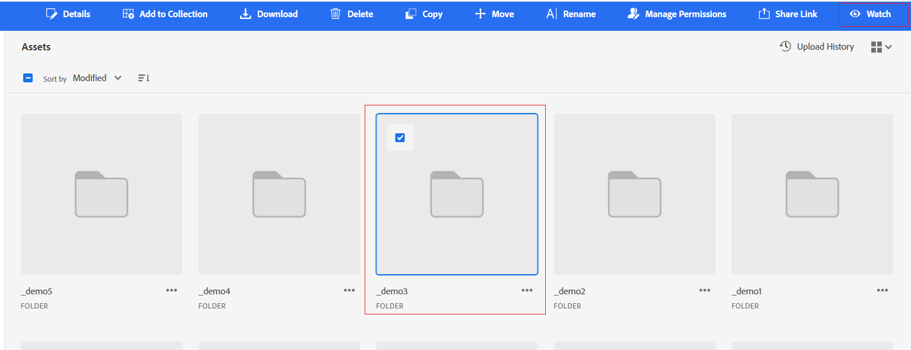

# Osservare risorse, cartelle e raccolte {#watch-assets-folders}

Le notifiche di visualizzazione di Assets consentono di monitorare le operazioni eseguite sulle risorse, cartelle o raccolte disponibili nell’archivio. Devi selezionare e iscriverti al contenuto per il quale ti vengono inviate le notifiche. Puoi anche configurare le categorie per le quali vengono inviate le notifiche.

## Iscriversi alle categorie di notifica {#subscribe-to-notification-categories}

Puoi scegliere un elenco di categorie e iscriverti per ricevere le notifiche. La vista Assets invia le notifiche solo per le categorie selezionate tra le opzioni disponibili:

<table>
    <tbody>
     <tr>
      <th><strong>Categoria di notifica</strong></th>
      <th><strong>Descrizione</strong></th>
     </tr>
     <tr>
      <td>Richieste</td>
      <td>Quando si assegna un’attività a un utente, si riceve una notifica quando l'utente esegue un’azione su tale attività.</td>
     </tr>
     <tr>
      <td>Assegnato a me</td>
      <td>Ricevi una notifica quando un’attività ti è stata assegnata da un altro utente.</td>
     </tr>
     <tr>
      <td>Commento a contenuti sottoscritti</td>
      <td>Ricevi una notifica quando un utente aggiunge un commento alla risorsa a cui ti sei iscritto.</td>
     </tr>
     <tr>
      <td>Eliminazione di contenuti sottoscritti</td>
      <td>Ricevi una notifica quando un utente elimina la risorsa, la cartella o la raccolta a cui ti sei iscritto.</td>
     </tr>
     <tr>
      <td>Condivisione esterna di contenuti sottoscritti</td>
      <td>Ricevi una notifica quando un utente genera un collegamento pubblico per la risorsa, la cartella o la raccolta a cui ti sei iscritto.</td>
     </tr>
     <tr>
      <td>Modifica di contenuti sottoscritti</td>
      <td>Ricevi una notifica quando un utente crea una nuova versione della risorsa a cui ti sei iscritto.</td>
     </tr>
     <tr>
      <td>Spostamento o ridenominazione di contenuti sottoscritti</td>
      <td>Ricevi una notifica quando un utente sposta o rinomina la risorsa o la cartella sottoscritta.</td>
     </tr>
     <tr>
      <td>Aggiornamenti alle cartelle e alle raccolte sottoscritte</td>
      <td>Ricevi una notifica quando un utente aggiunge o rimuove una risorsa da una cartella o raccolta sottoscritta.</td>
     </tr>    
    </tbody>
   </table>

Per iscriversi alle categorie di notifica:

1. Fai clic su  all&#39;estremità destra della barra dei menu nell&#39;interfaccia utente di visualizzazione di Assets.

1. Fai clic su  per visualizzare la pagina [!UICONTROL Preferenze di Experience Cloud].

1. Fai clic sul pulsante **[!UICONTROL Notifiche]** nel riquadro a sinistra.

1. Nella sezione **[!UICONTROL Notifiche]**, passa alla sezione [!UICONTROL Visualizzazione Assets] e assicurati che l&#39;opzione di attivazione sia attivata.

   

1. Fai clic su **[!UICONTROL Personalizza]** per visualizzare le categorie di notifiche.
   

1. Seleziona le categorie di notifica per le quali vuoi ricevere una notifica.

## Osservare e non osservare più cartelle, risorse o raccolte {#watch-unwatch-assets}

Puoi guardare e non guardare più cartelle, risorse o raccolte per tenerti informato, consentendo una migliore collaborazione sulle risorse che stai monitorando.

Dopo l’[iscrizione alle categorie di notifica](#subscribe-to-notification-categories), devi iscriverti al contenuto per iniziare a ricevere le notifiche.

>[!NOTE]
>
>* Per le categorie di notifiche **[!UICONTROL Richieste]** e **[!UICONTROL Assegnato a me]**, non è necessario iscriversi ai contenuti dopo l’iscrizione alle categorie di notifica. Le notifiche vengono inviate automaticamente per le richieste che crei e quando un&#39;attività viene assegnata a te.
>* La vista Assets invia notifiche solo quando altri utenti eseguono azioni sui contenuti a cui si è iscritti. Non si ricevono notifiche per le azioni eseguite personalmente sui contenuti a cui si è iscritti.

### Iscriviti al contenuto {#subscribe-to-content}

Per effettuare la sottoscrizione a cartelle, risorse o raccolte, segui la procedura riportata di seguito:

1. Sfoglia la cartella, la risorsa o la raccolta a cui vuoi abbonarti e fai clic su **[!UICONTROL Osserva]**.

1. Nella vista Assets viene visualizzato un messaggio di successo. Puoi fare clic su **[!UICONTROL Vai alle preferenze per le notifiche]** nel messaggio di successo per modificare la [sottoscrizione alle categorie di notifica](#subscribe-to-notification-categories).

   

La vista Assets ora invia notifiche per le categorie sottoscritte. Per risparmiare tempo, puoi anche selezionare più risorse, cartelle o raccolte e fare clic su **[!UICONTROL Osserva]**. Tuttavia, se selezioni più elementi e alcuni sono già abbonati, l&#39;opzione **[!UICONTROL Osserva]** non verrà visualizzata.

### Visualizza contenuti seguiti {#view-subscribed-content}

Per visualizzare i contenuti a cui ti sei iscritto, segui questi passaggi:

1. Passa a **[!UICONTROL Assets controllato]** in [!UICONTROL Gestione risorse].

1. Nella vista Assets viene visualizzato un elenco delle risorse sottoscritte, con nome, tipo e percorso. Seleziona una risorsa, una cartella o una raccolta dall&#39;elenco per visualizzarne i dettagli, la posizione o per [annullare l&#39;iscrizione](#unsubscribe-to-content).

   

### Visualizza gli abbonati al contenuto {#view-content-subscribers}

Per visualizzare gli abbonati ai contenuti, effettua le seguenti operazioni:

1. Passa alla cartella, alla risorsa o alla raccolta e seleziona **[!UICONTROL Dettagli]**.

1. Fai clic sull&#39;icona dell&#39;occhio nel riquadro di destra per visualizzare un elenco degli utenti che controllano il contenuto.

   In alternativa, fare clic sull&#39;icona  nel riquadro di destra per visualizzare i controlli contenuto.

### Annulla l’iscrizione al contenuto {#unsubscribe-to-content}

Per annullare l’abbonamento:

1. Vai a **[!UICONTROL Assets guardato]** in [!UICONTROL Gestione risorse].

1. Seleziona la risorsa, la cartella o la raccolta a cui vuoi annullare l&#39;iscrizione e fai clic su **[!UICONTROL Non osservare più]**.

   

In alternativa, sfoglia la cartella, la risorsa o la raccolta in [!UICONTROL Gestione risorse]. Seleziona la [risorsa sottoscritta](#subscribe-to-content) e fai clic su **[!UICONTROL Non osservare più]**.

## Visualizzare le notifiche {#view-notifications}

Le notifiche vengono visualizzate all’estremità destra della barra dei menu nell’interfaccia utente di visualizzazione di Assets.

Quando fai clic su una notifica, la vista Assets ti consente di passare alla risorsa o cartella appropriata a cui fa riferimento la notifica.
