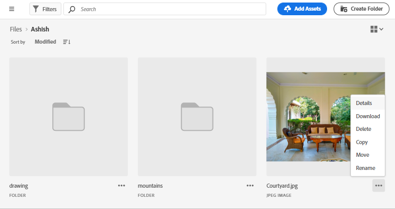

# Gestire le risorse {#manage-assets}

Puoi eseguire facilmente diverse attività di gestione delle risorse digitali (DAM) mediante l’interfaccia intuitiva di [!DNL Assets view]. Dopo aver aggiunto le risorse, puoi cercare, scaricare, spostare, copiare, rinominare, eliminare, aggiornare e modificare le risorse.

Utilizza [!DNL Assets view] per eseguire le seguenti attività di gestione risorse. Quando selezioni una risorsa, nella barra degli strumenti in alto vengono visualizzate le seguenti opzioni.

*Figura: Opzioni disponibili nella barra degli strumenti per un’immagine selezionata.*

*  Deseleziona la selezione.

* : trova una risorsa di immagine simile nell’interfaccia utente di Assets in base ai metadati e ai tag avanzati.

*  Fai clic sull’icona per visualizzare l’anteprima di una risorsa e i metadati dettagliati. In anteprima, puoi visualizzare le versioni e modificare un’immagine.

*  Scarica nel file system locale la risorsa selezionata.

* : aggiungi la risorsa selezionata a una raccolta.

* : fissa una risorsa per un accesso più rapido quando necessario in un secondo momento. Tutti gli elementi fissati vengono visualizzati nella sezione **Accesso rapido** della tua area di lavoro.

*  Modifica un’immagine nell’editor Adobe Express integrato in Adobe Experience Manager Assets.

*  Modifica l’immagine utilizzando Adobe Express.

*  Condividi una risorsa con altri utenti così che possano accedervi e scaricarla.

*  Elimina la risorsa o la cartella selezionata.

*  Copia il file o la cartella selezionati.

*  Sposta la risorsa o la cartella selezionata in una posizione diversa nella gerarchia dell’archivio.

*  Rinomina la risorsa o la cartella selezionata. Utilizza un nome univoco; in caso contrario la ridenominazione non riesce e viene visualizzato un’avvertenza. Riprova con un nuovo nome.
Inoltre, puoi fare clic sul titolo di una risorsa o di una cartella per rinominarla. Menziona il nuovo testo nella casella di testo **Rinomina risorsa** e fai clic su **Salva**. Questa funzionalità è disponibile nelle viste griglia, galleria, cascata ed elenco.

*  [!UICONTROL Vista cascata].

*  Aggiungi una risorsa alla libreria.

*  Assegna attività ad altri utenti per collaborare a una risorsa.

*  Monitora le operazioni eseguite su una risorsa.

Le stesse opzioni sono disponibili anche sulle miniature delle risorse.

[!DNL Assets view] mostra nella barra degli strumenti solo le opzioni pertinenti in base al tipo di risorsa selezionata.

*Figura: Opzioni disponibili nella barra degli strumenti per una cartella selezionata.*

*Figura: Opzioni disponibili nella barra degli strumenti per un file PDF selezionato.*

## Scaricare e distribuire le risorse {#download}

Puoi selezionare una o più risorse o cartelle o una combinazione di entrambe, e scaricare la selezione nel file system locale. Puoi modificare le risorse e caricarle nuovamente o distribuirle all’esterno di [!DNL Assets view]. Inoltre, puoi [scaricare le rappresentazioni](/help/assets/add-delete-assets-view.md#renditions) di una risorsa.

## Controllo delle versioni di una risorsa {#versions-of-assets}

<!-- 
TBD: query for engineering: How many versions are maintained. What happens when we reach that limit? Are old versions automatically removed? -->

[!DNL Assets view] crea versioni delle risorse quando queste vengono caricate di nuovo dopo essere state aggiornate o modificate. Puoi visualizzare la cronologia delle versioni precedenti e, se necessario, ripristinare una versione delle risorse precedente come versione più recente. Le versioni delle risorse vengono create nei seguenti scenari:

* Quando si carica una nuova risorsa con lo stesso nome file e nella stessa cartella della risorsa esistente. [!DNL Assets view] richiede di sovrascrivere la risorsa precedente o di salvare la nuova risorsa come versione. Consulta [Caricare risorse duplicate](/help/assets/add-delete-assets-view.md).

  

  *Figura: Quando carichi una risorsa con lo stesso nome di una risorsa esistente, puoi crearne una versione.*

* Quando modifichi un’immagine e fai clic su **[!UICONTROL Salva come versione]**. Consulta [Modificare le immagini](/help/assets/edit-images-assets-view.md).

  

  *Figura: Salvare un’immagine modificata come versione.*

* Quando apri le versioni di una risorsa esistente. Fai clic su **[!UICONTROL Nuova versione]** e carica una versione più recente della risorsa nell’archivio.

  

### Visualizzare e confrontare le versioni di una risorsa {#view-and-compare-versions}

Carica una copia duplicata o modificata di una risorsa per crearne le versioni. Il controllo delle versioni consente di tenere traccia delle modifiche apportate a una risorsa nel tempo e, se necessario, di ripristinare una versione precedente.

Per visualizzare e confrontare le versioni:

1. Passa alla pagina dei dettagli della risorsa.
1. Fai clic su  nel riquadro a destra per visualizzare il pannello **[!UICONTROL Versioni]**. In questo pannello vengono visualizzate le miniature della risorsa originale e delle versioni caricate.
1. Selezionate una versione nel pannello per visualizzarla in anteprima nell&#39;area di anteprima.
1. Selezionare una versione diversa da quella più recente e fare clic su **[!UICONTROL Rendi più recente]** per impostarla come versione più recente.
1. Trascina il cursore nell’anteprima verso sinistra e destra per vedere rapidamente in un’unica anteprima la versione selezionata di un’immagine e quella più recente. Questo consente di confrontare rapidamente la versione selezionata dell’immagine con la versione più recente.

   >[!NOTE]
   >
   > Il confronto delle versioni è abilitato solo per le risorse immagine.

   

<!-- old content
To view versions, open an asset's preview and click **[!UICONTROL Versions]**  from the right sidebar. To preview a specific version, select it. To revert to it, click **[!UICONTROL Make Latest]**. 
-->

Seleziona la versione più recente e fai clic su **[!UICONTROL Nuova versione]** per caricare una nuova copia della risorsa dal file system locale e creare una versione della risorsa.

<!-- old content
You can also create versions from the versions timeline. Select the latest version, click **[!UICONTROL New Version]**, and upload a new copy of the asset from your local file system.

*Figure: View versions of an asset, revert to a previous version, or upload another new version.* 
-->

## Gestire lo stato delle risorse {#manage-asset-status}

**Autorizzazioni richieste:** `Can Edit`, `Owner` o le autorizzazioni di amministratore per una risorsa.

La vista Assets consente di impostare lo stato delle risorse disponibili nell’archivio. Imposta lo stato di una risorsa per gestire meglio il consumo a valle di risorse digitali.

Puoi assegnare alle risorse i seguenti stati:

* Approvato

* Rifiutato

* Nessuno stato

### Impostare lo stato di una risorsa {#set-asset-status}

Per impostare lo stato di una risorsa:

1. Seleziona la risorsa e fai clic su **[!UICONTROL Dettagli]** nella barra degli strumenti.

1. Nella scheda **[!UICONTROL Base]**, seleziona lo stato della risorsa dall&#39;elenco a discesa **[!UICONTROL Stato]**. I valori possibili sono Approvato, Rifiutato e Nessuno stato (per impostazione predefinita).
Se per il tuo ambiente è stato eseguito il provisioning di Dynamic Media con funzionalità OpenAPI, Experience Manager Assets genera un URL pubblico non appena la risorsa viene contrassegnata come `Approved`.

   >[!VIDEO](https://video.tv.adobe.com/v/342495)

### Impostare il target di approvazione {#set-approval-target}

La vista Assets consente di pubblicare le risorse approvate in Dynamic Media con funzionalità OpenAPI, Content Hub o entrambe in base al valore impostato nel campo **Destinazione approvazione** disponibile nella pagina Dettagli risorsa.

Per impostare il target di approvazione:

1. Seleziona la risorsa e fai clic su **[!UICONTROL Dettagli]** nella barra degli strumenti.

1. Nella scheda **[!UICONTROL Base]**, seleziona lo stato della risorsa dall&#39;elenco a discesa **[!UICONTROL Stato]**. I valori possibili sono Approvato, Rifiutato e Nessuno stato (impostazione predefinita).

1. Se nel passaggio 2 si seleziona **Approvato**, selezionare una destinazione di approvazione. I valori possibili includono Delivery e Content Hub.

   * **Delivery** è l&#39;opzione predefinita selezionata nel menu a discesa e pubblica la risorsa in [Dynamic Media con OpenAPI](/help/assets/dynamic-media-open-apis-overview.md) e [Content Hub](/help/assets/product-overview.md), se entrambi sono abilitati per Experience Manager Assets.

   * Selezionando **Content Hub** la risorsa viene pubblicata solo in Content Hub. Content Hub viene visualizzato come opzione solo se è abilitato per Experience Manager Assets.

   * Se non selezioni un’opzione dall’elenco a discesa, l’opzione predefinita abilitata per il tuo ambiente AEM as a Cloud Service viene applicata automaticamente alla risorsa.

   Per ulteriori informazioni sulle opzioni disponibili, consulta [Destinazione approvazione predefinita e destinazioni di pubblicazione per risorse approvate](#default-approval-target-options-publish-destinations).

   

1. Specifica altre proprietà della risorsa e fai clic su **[!UICONTROL Salva]**.

Alcuni punti aggiuntivi da notare includono:

* Quando non utilizzi il modulo metadati predefinito e non riesci a visualizzare il campo **[!UICONTROL Destinazione approvazione]**, [modifica il modulo metadati](/help/assets/metadata-assets-view.md#metadata-forms) per trascinare il campo **[!UICONTROL Approvazione per]** dai componenti disponibili al modulo metadati e fai clic su **[!UICONTROL Salva]**.

* Quando selezioni la destinazione di approvazione come `Content Hub` utilizzando la vista Assets, le risorse vengono rese disponibili in Content Hub agli utenti che fanno parte della stessa organizzazione.

#### Destinazione di approvazione e destinazioni di pubblicazione predefinite per le risorse approvate {#default-approval-target-options-publish-destinations}

Nella tabella seguente sono illustrati i prerequisiti per la visualizzazione dell&#39;elenco a discesa `Approval Target` e del target di approvazione predefinito in base all&#39;abilitazione di DM con OpenAPI e Content Hub nell&#39;ambiente AEM as a Cloud Service:

| Dynamic Media con OpenAPI | Content Hub | Viene visualizzato l’elenco a discesa Approval Target (Destinazione approvazione)? | Target di approvazione predefinito per le risorse approvate | Destinazione di pubblicazione |
| --- | --- | --- | --- |---|
| Abilitato | Abilitato | Sì | Distribuzione | Dynamic Media con OpenAPI e Content Hub |
| Non abilitato | Abilitato | Sì | Content Hub | Content Hub |
| Abilitato | Non abilitato | Sì | Distribuzione | Dynamic Media con OpenAPI |
| Non abilitato | Non abilitato | No | N/D | N/D |

### Impostare la data di scadenza di una risorsa {#set-asset-expiration-date}

La vista Assets consente inoltre di impostare la data di scadenza delle risorse disponibili nell’archivio. È quindi possibile [filtrare i risultati della ricerca](search-assets-view.md#refine-search-results) in base allo stato `Expired` delle risorse. Inoltre, è possibile specificare un intervallo di date di scadenza per le risorse per filtrare ulteriormente i risultati della ricerca.

Per impostare la data di scadenza di una risorsa:

1. Seleziona la risorsa e fai clic su **[!UICONTROL Dettagli]** nella barra degli strumenti.

1. Nella scheda **[!UICONTROL Base]**, imposta la data di scadenza della risorsa utilizzando il campo **[!UICONTROL Data di scadenza]**.

L’indicatore `Expired` nella scheda delle risorse sostituisce l’indicatore `Approved` o `Rejected` impostato per una risorsa.

Puoi anche filtrare le risorse in base allo stato. Per ulteriori informazioni, consulta [Cercare le risorse nella vista Assets](search-assets-view.md).

## Personalizzare i moduli di metadati per includere il campo dello stato delle risorse {#customize-asset-status-metadata-form}

**Autorizzazioni richieste:** Amministratore

La vista Assets fornisce molti campi di metadati standard per impostazione predefinita. Spesso le organizzazioni hanno l’esigenza di aggiungere altri metadati, specifici per l’azienda. I moduli di metadati consentono alle aziende di aggiungere campi di metadati personalizzati alla pagina [!UICONTROL Dettagli] di una risorsa. I metadati specifici per l’azienda migliorano la governance e l’individuazione delle risorse.

Per ulteriori informazioni su come aggiungere ulteriori campi di metadati al modulo, consulta [Moduli di metadati](metadata-assets-view.md#metadata-forms).

**Aggiungere al modulo il campo di metadati Stato risorsa**

Per aggiungere al modulo il campo di metadati Stato risorsa, trascina al suo interno il componente **[!UICONTROL Stato risorsa]** dalla barra a sinistra. La proprietà di mappatura viene precompilata automaticamente. Salva il modulo per confermare le modifiche.

**Aggiungere al modulo il campo di metadati Data di scadenza**

Per aggiungere al modulo il campo di metadati Data di scadenza, trascina nel modulo il componente **[!UICONTROL Data]** dalla barra di sinistra. Specifica **Data di scadenza** come etichetta e `pur:expirationDate` come proprietà di mappatura. Salva il modulo per confermare le modifiche.

## Passaggi successivi {#next-steps}

* [Guarda un video per gestire le risorse nella visualizzazione Assets](https://experienceleague.adobe.com/it/docs/experience-manager-learn/assets-essentials/basics/managing)

* Fornisci feedback sui prodotti utilizzando l’opzione [!UICONTROL Feedback] disponibile nell’interfaccia utente della vista Risorse

* Fornisci feedback alla documentazione utilizzando [!UICONTROL Modifica questa pagina]  o [!UICONTROL Segnala un problema]  disponibile sulla barra laterale destra

* Contatta il [Servizio clienti](https://experienceleague.adobe.com/it?support-solution=General#support)

