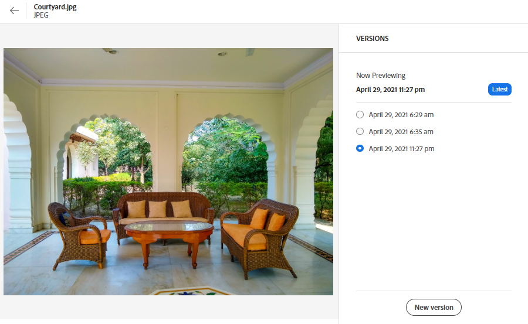

# Gestire le risorse {#manage-assets}

Puoi eseguire facilmente diverse attività di gestione delle risorse digitali (DAM) mediante l’interfaccia intuitiva di [!DNL Assets view]. Dopo aver aggiunto le risorse, puoi cercare, scaricare, spostare, copiare, rinominare, eliminare, aggiornare e modificare le risorse.

Utilizza [!DNL Assets view] per eseguire le seguenti attività di gestione risorse. Quando selezioni una risorsa, nella barra degli strumenti in alto vengono visualizzate le seguenti opzioni.

*Figura: Opzioni disponibili nella barra degli strumenti per un’immagine selezionata.*

*  Deseleziona la selezione.
*  Fai clic sull’icona per visualizzare l’anteprima di una risorsa e i metadati dettagliati. In anteprima, puoi visualizzare le versioni e modificare un’immagine.
*  Scarica nel file system locale la risorsa selezionata.
*  Elimina la risorsa o la cartella selezionata.
*  Ritira la risorsa selezionata.
*  Copia il file o la cartella selezionati.
*  Sposta la risorsa o la cartella selezionata in una posizione diversa nella gerarchia dell’archivio.
*  Rinomina la risorsa o la cartella selezionata. Utilizza un nome univoco; in caso contrario la ridenominazione non riesce e viene visualizzato un’avvertenza. Riprova con un nuovo nome.
*  Assegna attività ad altri utenti per collaborare a una risorsa.

Le stesse opzioni sono disponibili anche sulle miniature delle risorse.

[!DNL Assets view] mostra nella barra degli strumenti solo le opzioni pertinenti in base al tipo di risorsa selezionata.

*Figura: Opzioni disponibili nella barra degli strumenti per una cartella selezionata.*

*Figura: Opzioni disponibili nella barra degli strumenti per un file PDF selezionato.*

## Scaricare e distribuire le risorse {#download}

Puoi selezionare una o più risorse o cartelle o una combinazione di entrambe, e scaricare la selezione nel file system locale. Puoi modificare le risorse e caricarle nuovamente o distribuirle all’esterno di [!DNL Assets view]. Inoltre, puoi [scaricare le rappresentazioni](/help/assets/add-delete-assets-view.md#renditions) di una risorsa.

## Controllo delle versioni di una risorsa {#versions-of-assets}

<!-- 
TBD: query for engineering: How many versions are maintained. What happens when we reach that limit? Are old versions automatically removed? -->

[!DNL Assets view] crea versioni delle risorse quando queste vengono caricate di nuovo dopo essere state aggiornate o modificate. Puoi visualizzare la cronologia delle versioni precedenti e, se necessario, ripristinare una di queste come versione più recente. Le versioni delle risorse vengono create nei seguenti scenari:

* Quando si carica una nuova risorsa con lo stesso nome file e nella stessa cartella della risorsa esistente. [!DNL Assets view] richiede di sovrascrivere la risorsa precedente o di salvare la nuova risorsa come versione. Consulta [Caricare risorse duplicate](/help/assets/add-delete-assets-view.md).

  

  *Figura: Quando carichi una risorsa con lo stesso nome di una risorsa esistente, puoi crearne una versione.*

* Quando modifichi un’immagine e fai clic su **[!UICONTROL Salva come versione]**. Consulta [Modificare le immagini](/help/assets/edit-images-assets-view.md).

  

  *Figura: Salvare un’immagine modificata come versione.*

* Quando apri le versioni di una risorsa esistente. Fai clic su **[!UICONTROL Nuova versione]** e carica una versione più recente della risorsa nell’archivio.

  

### Visualizzare le versioni di una risorsa {#view-versions}

Quando carichi una copia duplicata o modificata di una risorsa, puoi crearne le versioni. Il controllo delle versioni consente di rivedere le risorse storiche e, se necessario, ripristinare una versione precedente.

Per visualizzare le versioni, apri l’anteprima di una risorsa e fai clic su **[!UICONTROL Versioni]**  nella barra laterale a destra. Per visualizzare in anteprima una versione specifica, selezionala. Per ripristinarla, fai clic su **[!UICONTROL Rendi più recente]**.

Puoi anche creare versioni dalla timeline delle versioni. Seleziona la versione più recente e fai clic su **[!UICONTROL Nuova versione]**, quindi carica una nuova copia della risorsa dal file system locale.

*Figura: Visualizzare le versioni di una risorsa, ripristinare una versione precedente o caricare un’altra nuova versione.*

## Gestire lo stato delle risorse {#manage-asset-status}

**Autorizzazioni richieste:** `Can Edit`, `Owner` o le autorizzazioni di amministratore per una risorsa.

La vista Risorse consente di impostare lo stato delle risorse disponibili nell’archivio. Imposta lo stato di una risorsa per gestire meglio il consumo a valle di risorse digitali.

Puoi assegnare alle risorse i seguenti stati:

* Approvato

* Rifiutato

* Nessuno stato

### Impostare lo stato di una risorsa {#set-asset-status}

Per impostare lo stato di una risorsa:

1. Seleziona la risorsa e fai clic su **[!UICONTROL Dettagli]** nella barra degli strumenti.

1. Nella scheda **[!UICONTROL Base]** seleziona lo stato della risorsa dall’elenco a discesa **[!UICONTROL Stato]**. I valori possibili sono Approvato, Rifiutato e Nessuno stato (impostazione predefinita).

   >[!VIDEO](https://video.tv.adobe.com/v/342495)

### Impostare la data di scadenza di una risorsa {#set-asset-expiration-date}

La vista Risorse consente inoltre di impostare la data di scadenza delle risorse disponibili nell’archivio. È quindi possibile [filtrare i risultati della ricerca](search-assets-view.md#refine-search-results) in base allo stato `Expired` delle risorse. Inoltre, è possibile specificare un intervallo di date di scadenza per le risorse per filtrare ulteriormente i risultati della ricerca.

Per impostare la data di scadenza di una risorsa:

1. Seleziona la risorsa e fai clic su **[!UICONTROL Dettagli]** nella barra degli strumenti.

1. Nella scheda **[!UICONTROL Base]**, imposta la data di scadenza della risorsa utilizzando il campo **[!UICONTROL Data di scadenza]**.

L’indicatore `Expired` nella scheda delle risorse sostituisce l’indicatore `Approved` o `Rejected` impostato per una risorsa.

Per ulteriori informazioni, consulta la sezione su come filtrare le risorse in base allo stato [Cercare le risorse nella vista Risorse](search-assets-view.md).

## Personalizzare i moduli di metadati per includere il campo dello stato delle risorse {#customize-asset-status-metadata-form}

**Autorizzazioni richieste:** Amministratore

La vista Risorse fornisce molti campi di metadati standard per impostazione predefinita. Spesso le organizzazioni hanno l’esigenza di aggiungere altri metadati, specifici per l’azienda. I moduli di metadati consentono alle aziende di aggiungere campi di metadati personalizzati alla pagina [!UICONTROL Dettagli] di una risorsa. I metadati specifici per l’azienda migliorano la governance e l’individuazione delle risorse.

Per ulteriori informazioni su come aggiungere ulteriori campi di metadati al modulo, consulta [Moduli di metadati](metadata-assets-view.md#metadata-forms).

**Aggiungere al modulo il campo di metadati Stato risorsa**

Per aggiungere al modulo il campo di metadati Stato risorsa, trascina al suo interno il componente **[!UICONTROL Stato risorsa]** dalla barra a sinistra. La proprietà di mappatura viene precompilata automaticamente. Salva il modulo per confermare le modifiche.

**Aggiungere al modulo il campo di metadati Data di scadenza**

Per aggiungere al modulo il campo di metadati Data di scadenza, trascina nel modulo il componente **[!UICONTROL Data]** dalla barra di sinistra. Specifica **Data di scadenza** come etichetta e `pur:expirationDate` come proprietà di mappatura. Salva il modulo per confermare le modifiche.

## Passaggi successivi {#next-steps}

* [Guarda un video per gestire le risorse nella vista Risorse](https://experienceleague.adobe.com/docs/experience-manager-learn/assets-essentials/basics/managing.html?lang=it)

* Fornire feedback sul prodotto utilizzando [!UICONTROL Feedback] opzione disponibile nell’interfaccia utente di visualizzazione delle risorse

* Fornisci feedback alla documentazione utilizzando [!UICONTROL Modifica questa pagina]  o [!UICONTROL Segnala un problema]  disponibile sulla barra laterale destra

* Contatta il [Servizio clienti](https://experienceleague.adobe.com/?support-solution=General&amp;lang=it#support)
