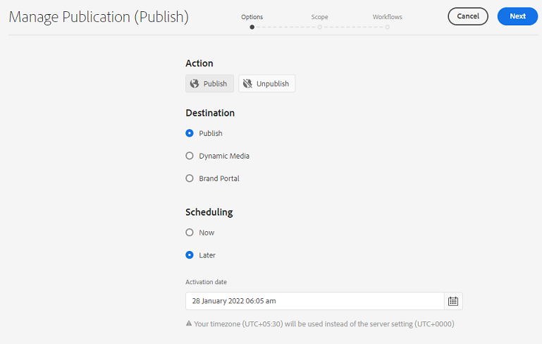

# Gestire la pubblicazione in Experience Manager Assets {#manage-publication-in-aem}

In qualità di amministratore di [!DNL Adobe Experience Manager Assets], puoi pubblicare risorse e cartelle contenenti risorse dall&#39;istanza di authoring a [!DNL Experience Manager Assets], [!DNL Dynamic Media] e [!DNL Brand Portal]. Inoltre, puoi pianificare la pubblicazione di una risorsa o cartella in una data o in un’ora successiva. Dopo la pubblicazione, gli utenti possono accedere e distribuire ulteriormente le risorse ad altri utenti. Per impostazione predefinita, è possibile pubblicare risorse e cartelle in [!DNL Experience Manager Assets]. È tuttavia possibile configurare [!DNL Experience Manager Assets] per abilitare la pubblicazione in [[!DNL Dynamic Media]](https://experienceleague.adobe.com/docs/experience-manager-cloud-service/content/assets/dynamicmedia/config-dm.html) e [[!DNL Brand Portal]](https://experienceleague.adobe.com/docs/experience-manager-cloud-service/content/assets/brand-portal/configure-aem-assets-with-brand-portal.html).

Puoi pubblicare o annullare la pubblicazione delle risorse a livello di risorsa o cartella utilizzando l&#39;opzione **[!UICONTROL Pubblicazione rapida]** o **[!UICONTROL Gestisci pubblicazione]** disponibile nell&#39;interfaccia [!DNL Experience Manager Assets]. Se si apportano modifiche successive alla risorsa o alla cartella originale in [!DNL Experience Manager Assets], tali modifiche non verranno applicate nell&#39;istanza di pubblicazione fino alla ripubblicazione da [!DNL Experience Manager Assets]. In questo modo le modifiche in corso di lavorazione non sono disponibili nell’istanza di pubblicazione. Nell’istanza di pubblicazione sono disponibili solo le modifiche approvate pubblicate da un amministratore.

* [Pubblicare le risorse tramite la pubblicazione rapida](#quick-publish)
* [Pubblicare risorse tramite Gestisci pubblicazione](#manage-publication)
* [Pubblicare le risorse in un secondo momento](#publish-assets-later)
* [Pubblicare risorse in Dynamic Media](#publish-assets-to-dynamic-media)
* [Pubblicare risorse in Brand Portal](#publish-assets-to-brand-portal)
* [Richiedi pubblicazione](#request-publication)
* [Limitazioni e suggerimenti](#limitations-and-tips)

## Pubblicare le risorse tramite la pubblicazione rapida {#quick-publish}

La pubblicazione rapida consente di pubblicare immediatamente il contenuto nella destinazione selezionata. Dalla console [!DNL Experience Manager Assets], passa alla cartella principale e seleziona tutte le risorse o cartelle che desideri pubblicare. Fai clic sull&#39;opzione **[!UICONTROL Pubblicazione rapida]** nella barra degli strumenti e seleziona la destinazione dall&#39;elenco a discesa in cui desideri pubblicare le risorse.

## Pubblicare risorse tramite Gestisci pubblicazione {#manage-publication}

Gestisci pubblicazione consente di pubblicare o annullare la pubblicazione dei contenuti da e verso la destinazione selezionata, [aggiungere contenuto](#add-content) all&#39;elenco di pubblicazione dall&#39;archivio DAM, [includere le impostazioni della cartella](#include-folder-settings) per pubblicare il contenuto delle cartelle selezionate e applicare i filtri e [pianificare la pubblicazione](#publish-assets-later) a una data o un&#39;ora successiva.

Dalla console [!DNL Experience Manager Assets], passa alla cartella principale e seleziona tutte le risorse o cartelle che desideri pubblicare. Fai clic sull&#39;opzione **[!UICONTROL Gestisci pubblicazione]** nella barra degli strumenti. Se nella tua istanza di [!DNL Dynamic Media] non hai configurato [!DNL Brand Portal] e [!DNL Experience Manager Assets], puoi pubblicare risorse e cartelle solo in [!DNL Experience Manager Assets].

Nell&#39;interfaccia [!UICONTROL Gestisci pubblicazione] sono disponibili le opzioni seguenti:

* [!UICONTROL Azioni]
   * `Publish`: pubblica risorse e cartelle nella destinazione selezionata
   * `Unpublish`: annullamento della pubblicazione di risorse e cartelle dalla destinazione

* [!UICONTROL Destinazione]
   * `Publish`: pubblicazione di risorse e cartelle in [!DNL Experience Manager Assets] (`AEM`)
   * `Dynamic Media`: pubblica risorse in [!DNL Dynamic Media]
   * `Brand Portal`: pubblica risorse e cartelle in [!DNL Brand Portal]

* [!UICONTROL Pianificazione]
   * `Now`: pubblica immediatamente le risorse
   * `Later`: pubblicazione delle risorse in base alla data o all&#39;ora `Activation`

Per continuare, fare clic su **[!UICONTROL Avanti]**. In base alla selezione, la scheda **[!UICONTROL Ambito]** riflette opzioni diverse. Le opzioni per **[!UICONTROL Aggiungi contenuto]** e **[!UICONTROL Includi impostazioni cartella]** sono disponibili solo per la pubblicazione di risorse e cartelle in [!DNL Experience Manager Assets] (`Destination: Publish`).

### Aggiungi contenuto {#add-content}

La pubblicazione in [!DNL Experience Manager Assets] consente di aggiungere ulteriore contenuto (risorse e cartelle) all&#39;elenco di pubblicazione. Puoi aggiungere più risorse o cartelle all’elenco negli archivi DAM. Fai clic sul pulsante **[!UICONTROL Aggiungi contenuto]** per aggiungere altro contenuto.

Puoi aggiungere più risorse da una cartella o più cartelle alla volta. Tuttavia, non è possibile aggiungere risorse da più cartelle alla volta.

### Impostazioni cartelle da includere {#include-folder-settings}

Per impostazione predefinita, quando si pubblica una cartella in [!DNL Experience Manager Assets] vengono pubblicate tutte le risorse, le sottocartelle e i relativi riferimenti.

Per filtrare il contenuto della cartella che si desidera pubblicare, fare clic su **[!UICONTROL Includi impostazioni cartella]**:

* `Include folder contents`

   * Abilitato: vengono pubblicate tutte le risorse della cartella selezionata, delle sottocartelle (comprese tutte le risorse delle sottocartelle) e dei riferimenti.
   * Disabilitato: vengono pubblicati solo la cartella selezionata (vuota) e i riferimenti. Le risorse della cartella selezionata non vengono pubblicate.

* `Include folder contents` e `Include only immediate folder contents`

  Se sono selezionate entrambe le opzioni, vengono pubblicate tutte le risorse della cartella selezionata, delle sottocartelle (vuote) e dei riferimenti. Le risorse delle sottocartelle non vengono pubblicate.

<!--
* [!UICONTROL Include only immediate folder contents]: Only the subfolders content and references are published. 

Only the selected folder content and references are published.
-->

Dopo aver applicato i filtri, fare clic su **[!UICONTROL OK]** e quindi su **[!UICONTROL Pubblica]**. Facendo clic sul pulsante di pubblicazione, viene visualizzato un messaggio di conferma `Resource(s) have been scheduled for publication`. Le risorse e/o le cartelle selezionate vengono pubblicate nella destinazione definita in base alla pianificazione (`Now` o `Later`). Accedi all’istanza di pubblicazione per verificare che le risorse e/o le cartelle siano state pubblicate correttamente.

Nell&#39;illustrazione precedente è possibile visualizzare valori diversi per l&#39;attributo **[!UICONTROL Destinazione pubblicazione]**. Ricordiamo che hai scelto di pubblicare su [!DNL Experience Manager Assets] (`Destination: Publish`). Quindi, perché viene visualizzato che solo una cartella e una risorsa sono pubblicate in `AEM` e che le altre due risorse sono pubblicate sia in `AEM` che in `Dynamic Media`?

In questo caso, è necessario comprendere il ruolo delle proprietà della cartella. La proprietà **[!UICONTROL Dynamic Media Publishing mode]** di una cartella svolge un ruolo importante nella pubblicazione. Per visualizzare le proprietà di una cartella, selezionare una cartella e fare clic su **[!UICONTROL Proprietà]** nella barra degli strumenti. Per una risorsa, vedi le proprietà della relativa cartella principale.

La tabella seguente spiega come si verifica la pubblicazione a seconda della **[!UICONTROL Destinazione]** e della **[!UICONTROL modalità di pubblicazione Dynamic Media]** definite:

| [!UICONTROL Destinazione] | [!UICONTROL Modalità di pubblicazione Dynamic Media] | [!UICONTROL Destinazione pubblicazione] | Contenuto consentito |
| --- | --- | --- | --- |
| Pubblicazione | Pubblicazione selettiva | `AEM` | Assets e/o cartelle |
| Pubblicazione | Immediato | `AEM` e `Dynamic Media` | Assets e/o cartelle |
| Pubblicazione | All&#39;attivazione | `AEM` e `Dynamic Media` | Assets e/o cartelle |
| Dynamic Media | Pubblicazione selettiva | `Dynamic Media` | Risorse |
| Dynamic Media | Immediato | `None` | Impossibile pubblicare le risorse |
| Dynamic Media | All&#39;attivazione | `None` | Impossibile pubblicare le risorse |

>[!NOTE]
>
>Solo le risorse vengono pubblicate in [!DNL Dynamic Media].
>
>La pubblicazione di una cartella in [!DNL Dynamic Media] non è supportata.
>
>Se si seleziona una cartella (`Selective Publish`) e si sceglie la destinazione [!DNL Dynamic Media], l&#39;attributo [!UICONTROL Destinazione pubblicazione] riflette `None`.

Cambiiamo ora la **[!UICONTROL Destinazione]** nel caso d&#39;uso precedente in **[!UICONTROL Dynamic Media]** e verifichiamo i risultati. In questo modo, solo la risorsa della cartella `Selective Publish` viene pubblicata in [!DNL Dynamic Media]. Le risorse di `Immediate` e `Upon Activation` cartelle non sono pubblicate e riflettono `None`.

>[!NOTE]
>
>Se [!DNL Dynamic Media] non è configurato nell&#39;istanza [!DNL Experience Manager Assets] e la **[!UICONTROL Destinazione]** è **[!UICONTROL Pubblica]**, le risorse e le cartelle vengono sempre pubblicate in `AEM`.
>
>La pubblicazione in [!DNL Brand Portal] è indipendente dalle proprietà della cartella. Tutte le risorse, le cartelle e le raccolte possono essere pubblicate in Brand Portal. Vedi [pubblicare risorse in Brand Portal](#publish-assets-to-brand-portal).

>[!NOTE]
>
>Se la procedura guidata [!DNL Manage Publication] è stata personalizzata, la personalizzazione continua a funzionare con le funzionalità esistenti.
>
>Tuttavia, è possibile rimuovere la personalizzazione esistente per utilizzare le nuove funzionalità di [!DNL Manager Publication].

## Pubblicare le risorse in un secondo momento {#publish-assets-later}

Per pianificare il flusso di lavoro di pubblicazione delle risorse in una data o in un’ora successiva:

1. Dalla console [!UICONTROL Experience Manager Assets], passa alla cartella principale e seleziona tutte le risorse o cartelle che desideri pianificare per la pubblicazione.
1. Fai clic sull&#39;opzione **[!UICONTROL Gestisci pubblicazione]** nella barra degli strumenti.
1. Fai clic su **[!UICONTROL Pubblica]** da **[!UICONTROL Azione]**, quindi seleziona la **[!UICONTROL Destinazione]** in cui desideri pubblicare il contenuto.
1. Seleziona **[!UICONTROL Più tardi]** in **[!UICONTROL Pianificazione]**.
1. Seleziona un **[!UICONTROL Data di attivazione]** e specifica la data e l&#39;ora. Fai clic su **[!UICONTROL Avanti]**.

   

1. Nella scheda **[!UICONTROL Ambito]**, **[!UICONTROL Aggiungi contenuto]** (se necessario). Fai clic su **[!UICONTROL Avanti]**.
1. Nella scheda **[!UICONTROL Flussi di lavoro]**, specifica un titolo del flusso di lavoro. Fai clic su **[!UICONTROL Pubblica più tardi]**.

   

   Accedi all’istanza di destinazione per verificare le risorse pubblicate (a seconda della data o dell’ora pianificata).

## Pubblicare risorse in Dynamic Media {#publish-assets-to-dynamic-media}

Solo le risorse vengono pubblicate in [!DNL Dynamic Media]. Tuttavia, il comportamento di pubblicazione varia in base alle proprietà della cartella. Una cartella può avere **[!UICONTROL Modalità di pubblicazione Dynamic Media]** configurata per la pubblicazione selettiva che può essere una delle seguenti:

* `Selective Publish`
* `Immediate`
* `Upon Activation`

Il processo di pubblicazione per la modalità **[!UICONTROL Immediata]** e **[!UICONTROL All&#39;attivazione]** è coerente, tuttavia è diverso per **[!UICONTROL Pubblicazione selettiva]**. Vedi [configurare la pubblicazione selettiva a livello di cartella in Dynamic Media](https://experienceleague.adobe.com/docs/experience-manager-cloud-service/content/assets/dynamicmedia/selective-publishing.html). Dopo aver configurato la pubblicazione selettiva in una cartella, puoi effettuare una delle seguenti operazioni:

* [Pubblicare selettivamente le risorse in Dynamic Media o Experience Manager tramite Gestisci pubblicazione](https://experienceleague.adobe.com/docs/experience-manager-cloud-service/content/assets/dynamicmedia/selective-publishing.html?lang=en#selective-publish-manage-publication)
* [Annullamento selettivo della pubblicazione di risorse da Dynamic Media o Experience Manager tramite Gestisci pubblicazione](https://experienceleague.adobe.com/docs/experience-manager-cloud-service/content/assets/dynamicmedia/selective-publishing.html?lang=en#selective-unpublish-manage-publication)
* [Pubblicare risorse in Dynamic Media o Experience Manager tramite Pubblicazione rapida](https://experienceleague.adobe.com/docs/experience-manager-cloud-service/content/assets/dynamicmedia/selective-publishing.html?lang=en#quick-publish-aem-dm)
* [Pubblicare o annullare la pubblicazione selettiva delle risorse in base ai risultati della ricerca](https://experienceleague.adobe.com/docs/experience-manager-cloud-service/content/assets/dynamicmedia/selective-publishing.html?lang=en#selective-publish-unpublish-search-results)

## Pubblicare risorse in Brand Portal {#publish-assets-to-brand-portal}

È possibile pubblicare risorse, cartelle e raccolte nell&#39;istanza [!DNL Experience Manager Assets Brand Portal].

* [Pubblicare risorse su Brand Portal](https://experienceleague.adobe.com/docs/experience-manager-cloud-service/content/assets/brand-portal/publish-to-brand-portal.html?lang=en#publish-assets-to-bp)
* [Pubblicare cartelle su Brand Portal](https://experienceleague.adobe.com/docs/experience-manager-cloud-service/content/assets/brand-portal/publish-to-brand-portal.html?lang=en#publish-folders-to-brand-portal)
* [Pubblicare raccolte su Brand Portal](https://experienceleague.adobe.com/docs/experience-manager-cloud-service/content/assets/brand-portal/publish-to-brand-portal.html?lang=en#publish-collections-to-brand-portal)

## Richiedi pubblicazione {#request-publication}

L&#39;opzione `Request Publication` consente di autenticare il flusso di lavoro di Assets prima di pubblicarlo nell&#39;ambiente Assets [!DNL AEM]. [!DNL AEM] fornisce un diverso livello di autorizzazioni a vari utenti. Puoi essere un *collaboratore* che sta caricando risorse ma non può pubblicarle finché i caricamenti non vengono verificati. Inoltre, essendo un *Amministratore* puoi gestire i flussi di lavoro di lettura e scrittura di Assets.

L’opzione Richiedi pubblicazione è disponibile per i seguenti utenti:

* **Collaboratore:** Se sei un utente che può contribuire a [!DNL AEM] Assets, hai accesso limitato al flusso di lavoro di [!DNL AEM] Assets. Il pulsante `Manage publication` è nascosto. In qualità di collaboratore, puoi contribuire solo aggiungendo Assets, ma non puoi pubblicarlo o avere accesso in lettura al flusso di lavoro.

* **Utente flusso di lavoro:** questo utente non può pubblicare risorse, ma ha accesso in lettura al flusso di lavoro. In qualità di utente del flusso di lavoro, puoi:
   * richiedi pubblicazione
   * visualizza pulsante `Manage publication`
   * pianificare il flusso di lavoro e visualizzare le opzioni `schedule now` e `schedule later`

* **Amministratore:** In qualità di utente amministratore, puoi gestire i passaggi generali del flusso di lavoro per Assets. Il pulsante `Manage publication` è visibile. Se è selezionata la destinazione `publish`, puoi pianificare una risorsa in un secondo momento per il passaggio del flusso di lavoro.

>[!NOTE]
>
>Se [!DNL Dynamic Media] è selezionato come destinazione, il passaggio del flusso di lavoro è disabilitato per **utente flusso di lavoro** e **amministratore** utenti.
>

## Limitazioni e suggerimenti {#limitations-and-tips}

* `Manage publication` è disponibile per gli utenti che dispongono almeno delle autorizzazioni di lettura per il flusso di lavoro.
* Le cartelle vuote non vengono pubblicate.
* Se pubblichi una risorsa in fase di elaborazione, viene pubblicato solo il contenuto originale. Mancano le rappresentazioni. Attendi il completamento dell’elaborazione, quindi pubblica o ripubblica la risorsa al termine dell’elaborazione.
* Durante l’annullamento della pubblicazione di una risorsa complessa, annulla solo la pubblicazione della risorsa. Evita di annullare la pubblicazione dei riferimenti, poiché altre risorse pubblicate potrebbero farvi riferimento.
