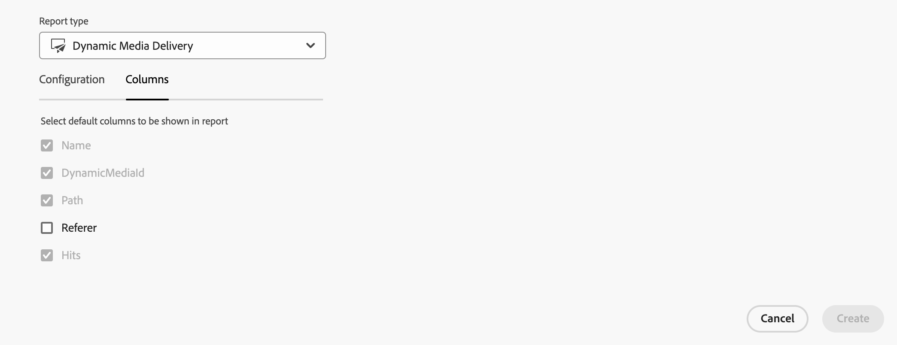

# Gestire i rapporti {#manage-reports}

Il reporting delle risorse offre agli amministratori visibilità sulle attività dell’ambiente Adobe Experience Manager Assets View. Questi dati forniscono informazioni utili su come gli utenti interagiscono con i contenuti e il prodotto. Tutti gli utenti possono accedere alla dashboard Insight e quelli assegnati al profilo di prodotto Amministratori possono creare rapporti definiti dall’utente.

## Accedere ai rapporti {#access-reports}

Tutti gli utenti assegnati al profilo di prodotto Amministratori di AEM possono accedere alla dashboard Approfondimenti o creare rapporti definiti dall’utente nella vista Assets.

Per accedere ai rapporti, passa a **[!UICONTROL Rapporti]** in **[!UICONTROL Impostazioni]**.

<!--
In the **[!UICONTROL Reports]** screen, various components are shown in the tabular format which includes the following:

* **Title**: Title of the report
* **Type**: Determines whether the report is uploaded or downloaded to the repository
* **Description**: Provide details of the report that was given during uploading/downloading the report
* **Status**: Determines whether the report is completed, under progress, or deleted.
* **Author**: Provides email of the author who has uploaded/downloaded the report.
* **Created**: Gives information of the date when the report was generated.
-->

## Creare un rapporto {#create-report}

L’ambiente di visualizzazione AEM Assets offre funzionalità di reporting complete tramite il dashboard Rapporti. Questa funzionalità consente agli utenti di generare e scaricare rapporti CSV che descrivono nel dettaglio i caricamenti e i download delle risorse entro intervalli di tempo specifici, che vanno da una tantum a intervalli giornalieri, settimanali, mensili o annuali.

**Per creare un rapporto:**

1. Passa a **Rapporti** e fai clic su **Crea rapporto** (in alto a destra). La finestra di dialogo **crea rapporto** mostra i campi seguenti:
   

   **Nella scheda Configurazione:**

   1. **Tipo di report:** seleziona un tipo tra [!UICONTROL caricamento], [!UICONTROL download] o [Rapporto di consegna Dynamic Media](#dynamic-media-delivery-reports).
   1. **Titolo:** aggiungi un titolo al rapporto.
   1. **Descrizione**: specifica una descrizione facoltativa per il rapporto.
   1. **Seleziona il percorso della cartella:** seleziona un percorso della cartella per generare il rapporto delle risorse caricate e scaricate all’interno di quella cartella specifica. Ad esempio, se hai bisogno del rapporto sulle risorse caricate in una cartella, specifica il percorso di tale cartella.
   1. **Seleziona intervallo date:** seleziona l’intervallo di date per visualizzare l’attività di caricamento o download nella cartella.

    

   >[!NOTE]
   >
   > Vista Risorse converte tutti i fusi orari locali nel Tempo coordinato universale (UTC).

   **Nella scheda Colonne:** seleziona i nomi delle colonne da visualizzare nel rapporto. Nella tabella seguente viene illustrato l’utilizzo di tutte le colonne:

   <table>
    <tbody>
     <tr>
      <th><strong>Nome colonna</strong></th>
      <th><strong>Descrizione</strong></th>
      <th><strong>Tipo di rapporto</strong></th>
     </tr>
     <tr>
      <td>Titolo</td>
      <td>Titolo della risorsa.</td>
      <td>Carica e scarica</td>
     </tr>
     <tr>
      <td>Percorso</td>
      <td>Percorso della cartella in cui la risorsa è disponibile in vista Risorse.</td>
      <td>Caricare, scaricare e distribuire contenuti Dynamic Media</td>
     </tr>
     <tr>
      <td>Tipo MIME</td>
      <td>Tipo MIME della risorsa.</td>
      <td>Carica e scarica</td>
     </tr>
     <tr>
      <td>Dimensione</td>
      <td>Dimensione della risorsa in byte.</td>
      <td>Carica e scarica</td>
     </tr>
     <tr>
      <td>Scaricato da</td>
      <td>ID e-mail dell’utente che ha scaricato la risorsa.</td>
      <td>Download</td>
     </tr>
     <tr>
      <td>Data di download</td>
      <td>Data in cui è stata eseguita l’azione di download della risorsa.</td>
      <td>Download</td>
     </tr>
     <tr>
      <td>Autore</td>
      <td>Autore della risorsa.</td>
      <td>Carica e scarica</td>
     </tr>
     <tr>
      <td>Data creazione</td>
      <td>La data in cui la risorsa è stata caricata in vista Risorse.</td>
      <td>Carica e scarica</td>
     </tr>
     <tr>
      <td>Data di modifica</td>
      <td>Data dell’ultima modifica apportata alla risorsa.</td>
      <td>Carica e scarica</td>
     </tr>
     <tr>
      <td>Scaduta</td>
      <td>Stato di scadenza della risorsa.</td>
      <td>Carica e scarica</td>
     </tr>
     <tr>
      <td>Scaricato da nome utente</td>
      <td>Nome dell’utente che ha scaricato la risorsa.</td>
      <td>Download</td>
     </tr> 
     <tr>
      <td>Referrer</td>
      <td>URL in cui la risorsa viene consegnata o inclusa</td>
      <td>Consegna Dynamic Media</td>
     </tr>  
     <tr>
      <td>Hit</td>
      <td>Numero di volte in cui la risorsa viene consegnata (conteggio consegne)</td>
      <td>Consegna Dynamic Media</td>
     </tr>          
    </tbody>
   </table>

## Rapporti sulle consegne Dynamic Media {#dynamic-media-delivery-reports}

Ottieni informazioni dettagliate sulla consegna delle risorse effettuata con Dynamic Media, con numero di consegna a livello di risorsa, informazioni sul referrer, percorso della risorsa in AEM Assets e ID univoco della risorsa. È possibile generare rapporti per tutte le risorse consegnate tramite Dynamic Media all’archivio AEM Assets o a una specifica gerarchia di cartelle in AEM Assets. Inoltre, le informazioni approfondite sui rapporti di consegna Dynamic Media consentono di misurare il ROI delle risorse consegnate, le prestazioni dei canali e di intraprendere attività di gestione delle risorse informate.

<!--
>[!NOTE]
> 
>To get early access to the Dynamic Media Delivery Report on your Dynamic Media account, [create and submit an Adobe Customer Support case](https://helpx.adobe.com/it/enterprise/using/support-for-experience-cloud.html).
-->

### Prerequisiti {#prereqs-dynamic-media-delivery-reports}

Per la creazione e l’utilizzo di questo rapporto, è necessario disporre di una licenza Dynamic Media.

>[!IMPORTANT]
> 
>* Vengono forniti rapporti per le risorse consegnate tramite Dynamic Media.
>* I rapporti vengono generati per il primo milione di righe. Per acquisire tutti i file entro questo limite, è consigliabile includere la colonna del referrer per le cartelle più piccole.
>* I rapporti possono essere generati solo per gli ultimi 3 mesi.

### Creare un rapporto di consegna Dynamic Media{#create-dynamic-media-delivery-report}

1. Crea un rapporto di consegna Dynamic Media, seguendo i passaggi indicati in [Creare un rapporto](#create-report).

1. Seleziona **[!UICONTROL Consegna Dynamic Media]** dall’elenco a discesa **[!UICONTROL Tipo di rapporto]**.

   

1. Nella scheda **[!UICONTROL Colonne]**, puoi selezionare la colonna **[!UICONTROL Referrer]** per includerla nel rapporto.

   

   Tutte le colonne del rapporto scaricato sono di sola lettura, ad eccezione della colonna **Referrer**, che è possibile modificare per includerla o escluderla dal rapporto. <!--Choosing a referrer displays the number of visitors received from each referred report that directs traffic to the site. It offers insights into the sources of traffic and the origin of the visitors. Such insights help measure ROI of delivered assets, measure channel performance, and help take informed asset management tasks for assets.-->

### Azioni eseguite sul rapporto di consegna di Dynamic Media {#actions-performed-dynamic-media-delivery-reports}

Dopo aver creato il rapporto, puoi effettuare le seguenti operazioni:

* **[!UICONTROL Elimina]**: è possibile eliminare il rapporto selezionato.
* **[!UICONTROL Scarica CSV]**: puoi scaricare il rapporto selezionato in formato CSV. Il rapporto scaricato è costituito dalle colonne Nome, Percorso, DynamicMediaID, Referrer, Hit.
   * La colonna **Referrer** riporta l’URL in cui la risorsa viene consegnata o inclusa.

   * La colonna **Hit** elenca il numero di volte in cui la risorsa viene consegnata (conteggio consegne).

Per eliminare o scaricare come CSV il rapporto di consegna di Dynamic Media, consulta [Visualizzare e scaricare il rapporto esistente](#View-and-download-existing-report).

## Visualizzare e scaricare il rapporto esistente {#View-and-download-existing-report}

I rapporti esistenti vengono visualizzati nella scheda **Rapporti eseguiti**. Fai clic su **Rapporti** e seleziona **Rapporti eseguiti** per visualizzare tutti i rapporti creati con lo stato **Completati**, indicando che sono pronti per il download. Per scaricare il rapporto in formato CSV o eliminarlo, seleziona la riga corrispondente. Quindi seleziona **Scarica CSV** o **Elimina**.

## Pianificare un rapporto {#schedule-report}

Nell&#39;interfaccia utente di visualizzazione di AEM Assets, **Pianifica report** imposta una generazione automatica di report a intervalli futuri specificati, ad esempio giornalieri, settimanali, mensili o annuali. Questa funzione consente di semplificare le esigenze di reporting ricorrenti e assicura aggiornamenti tempestivi dei dati. Mentre **Crea rapporto** genera rapporti per le date passate. I rapporti completati sono elencati in **Rapporti eseguiti** e i rapporti futuri si trovano in **Rapporti pianificati**.

Per pianificare un rapporto, effettua le seguenti operazioni:

1. Fai clic su Rapporti nel riquadro a sinistra e quindi su Crea rapporto (in alto a destra).
1. Nella finestra di dialogo del rapporto vengono visualizzate le informazioni riportate di seguito:
   1. **Tipo di rapporto:** seleziona tra il tipo di caricamento e quello di download.
   1. **Titolo:** aggiungi un titolo al rapporto.
   1. **Descrizione**: aggiungi una descrizione facoltativa al rapporto.
   1. **Seleziona il percorso della cartella:** seleziona il percorso di una cartella per generare un rapporto per le risorse che verranno caricate o scaricate in futuro da tale cartella specifica.
   1. Attiva/disattiva **Pianifica rapporto:** attiva/disattiva la pianificazione del rapporto per un momento successivo o per la sua occorrenza ripetuta.

      

   1. **Scegli la frequenza:** specifica l’intervallo di generazione del rapporto (ad esempio giornaliero, settimanale, mensile, annuale o una volta) e imposta la data e l’ora di esecuzione del rapporto insieme alla data di fine per la ricorrenza. Per un rapporto una tantum, seleziona l’intervallo di date per il rapporto sul tipo di attività selezionato nell’ambiente AEM. Ad esempio, se hai bisogno di un rapporto sulle risorse scaricate dal 10 al 29 (date future) di un mese specifico, seleziona queste date nel campo **Seleziona intervallo date**.

   >[!NOTE]
   >
   > Vista Risorse converte tutti i fusi orari locali nel Tempo coordinato universale (UTC).

## Visualizzare rapporti pianificati {#view-scheduled-reports}

I rapporti pianificati vengono visualizzati nella scheda **Rapporti pianificati** in modo ben organizzato. Tutti i rapporti completati per ogni rapporto pianificato vengono memorizzati in una singola cartella di rapporto. Fai clicper visualizzare i report completati. Ad esempio, se hai pianificato un rapporto giornaliero, tutti i rapporti completati sono raggruppati in un’unica cartella. Questa organizzazione semplifica sia la navigazione che la reperibilità dei rapporti. Per visualizzare i rapporti pianificati, fai clic su **Rapporti** e quindi su **Rapporti pianificati**. Vengono visualizzati tutti i rapporti pianificati con il relativo stato in corso o completato. I rapporti completati sono pronti per il download.\

## Modificare e annullare i rapporti pianificati {#edit-cancel-scheduled-reports}

1. Passa alla scheda **Rapporti pianificati**.
1. Seleziona la riga del rapporto.
1. Fai clic su **Modifica**.
1. Fai clic su **Annulla pianificazione** e quindi fai clic su **Conferma** per annullare il rapporto pianificato. Per i rapporti annullati, la fase di esecuzione successiva diventa vuota e lo stato viene visualizzato come annullato.
   

### Riprendi pianificazione {#resume-schedule}

Per riprendere la pianificazione annullata, seleziona la riga del rapporto e fai clic su **Riprendi pianificazione**. Quando viene ripresa, le voci di runtime successive vengono nuovamente visualizzate e lo stato è su In corso.

>[!NOTE]
>
> Se si riprende un rapporto annullato prima della data di fine pianificata, vengono generati automaticamente i rapporti dalla data di annullamento alla data di ripresa.

## Visualizzare gli approfondimenti {#view-live-statistics}

Vista Risorse consente di visualizzare in tempo reale i dati del tuo ambiente vista Risorse, con la dashboard Insight. Puoi visualizzare le metriche degli eventi in tempo reale negli ultimi 30 giorni o negli ultimi 12 mesi.

<!---->

Fai clic su **[!UICONTROL Insight]** nel riquadro di navigazione a sinistra per visualizzare i seguenti grafici generati automaticamente:

* **Download**: numero di risorse scaricate dall&#39;ambiente di visualizzazione di Assets negli ultimi 30 giorni o 12 mesi rappresentato da un grafico a linee.
  

* **Caricamenti**: numero di risorse caricate nell&#39;ambiente di visualizzazione di Assets negli ultimi 30 giorni o 12 mesi rappresentato da un grafico a linee.
  
  <!--* **Asset Count by Size**: The division of count of assets based on their range of various sizes from 0 MB to 100 GB.-->

* **Utilizzo spazio di archiviazione**: utilizzo spazio di archiviazione, in byte, per l&#39;ambiente di visualizzazione Assets rappresentato da un grafico a barre.
  
  <!--* **Delivery**: The graph depicts the count of assets as the delivery dates.-->

<!--* **Asset Count by Asset Type**: Represents count of various MIME types of the available assets. For example, application/zip, image/png, video/mp4, application/postscripte.-->

* **Ricerche principali**: visualizza i termini più cercati e il numero di volte in cui tali termini sono stati cercati nell’ambiente vista Risorse negli ultimi 30 giorni o 12 mesi rappresentato in formato tabulare.
  
  <!--
   
   
   -->
* **Conteggio risorse per dimensione:** suddivide il conteggio totale delle risorse nell’ambiente vista Assets in intervalli di dimensioni diversi, evidenziando il conteggio e la percentuale delle risorse in ciascun intervallo di dimensioni, rappresentate utilizzando un grafico ad anello.
  
* **Conteggio risorse per tipo di risorsa:** Segmenta il conteggio totale delle risorse nell&#39;ambiente di visualizzazione Assets, evidenziando il conteggio e la percentuale delle risorse in base ai relativi tipi di file, rappresentati da un grafico ad anello.
  