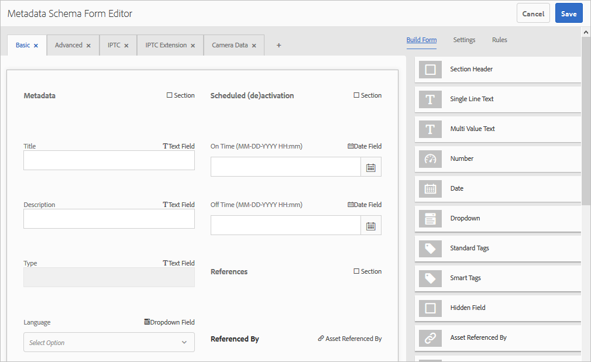

# Schemi metadati {#metadata-schemas}

<table>
    <tr>
        <td>
            <i>Nuovo</i> <a href="/help/assets/dynamic-media/dm-prime-ultimate.md"><b>Dynamic Media Prime e Ultimate</b></a>
        </td>
        <td>
            <i>Nuovo</i> <a href="/help/assets/assets-ultimate-overview.md"><b>AEM Assets Ultimate</b></a>
        </td>
        <td>
            <i>Nuova</i> <a href="/help/assets/integrate-aem-assets-edge-delivery-services.md"><b>Integrazione di AEM Assets con Edge Delivery Services</b></a>
        </td>
        <td>
            <i>Nuovo</i> <a href="/help/assets/aem-assets-view-ui-extensibility.md"><b>Estensibilità interfaccia utente</b></a>
        </td>
          <td>
            <i>Nuovo</i> <a href="/help/assets/dynamic-media/enable-dynamic-media-prime-and-ultimate.md"><b>Abilita Dynamic Media Prime e Ultimate</b></a>
        </td>
    </tr>
    <tr>
        <td>
            <a href="/help/assets/search-best-practices.md"><b>Best practice per la ricerca</b></a>
        </td>
        <td>
            <a href="/help/assets/metadata-best-practices.md"><b>Best practice per i metadati</b></a>
        </td>
        <td>
            <a href="/help/assets/product-overview.md"><b>Content Hub</b></a>
        </td>
        <td>
            <a href="/help/assets/dynamic-media-open-apis-overview.md"><b>Dynamic Media con funzionalità OpenAPI</b></a>
        </td>
        <td>
            <a href="https://developer.adobe.com/experience-cloud/experience-manager-apis/"><b>Documentazione di AEM Assets per sviluppatori</b></a>
        </td>
    </tr>
</table>

| Versione | Collegamento articolo |
| -------- | ---------------------------- |
| AEM 6.5 | [Fai clic qui](https://experienceleague.adobe.com/docs/experience-manager-65/assets/administer/metadata-schemas.html?lang=it) |
| AEM as a Cloud Service | Questo articolo |

Le organizzazioni propongono un modello di metadati che migliora l’individuazione delle risorse, l’utilizzo, l’interoperabilità e così via. L’applicazione corretta dei metadati è indispensabile per mantenere i flussi di lavoro e i processi basati sui metadati. Per rispettare la strategia e gli standard per i metadati a livello di organizzazione, puoi utilizzare schemi di metadati che consentono agli utenti DAM di allinearsi. [!DNL Adobe Experience Manager] consente di creare, gestire e applicare schemi di metadati in modo semplice e flessibile.

In [!DNL Adobe Experience Manager Assets], gli schemi contengono campi specifici per informazioni specifiche da compilare. Contiene inoltre informazioni di layout per visualizzare i campi di metadati in modo semplice e intuitivo. Le proprietà dei metadati includono titolo, descrizione, tipi MIME, tag e altro ancora. È possibile utilizzare l&#39;editor di schema di metadati [!UICONTROL Forms] per modificare gli schemi esistenti o aggiungere schemi di metadati personalizzati.

Per visualizzare e modificare la pagina delle proprietà di una risorsa, effettua le seguenti operazioni:

1. Fai clic sull&#39;opzione **[!UICONTROL Visualizza proprietà]** dalle azioni rapide nella sezione della risorsa nella vista a schede. In alternativa, seleziona una risorsa e fai clic su **[!UICONTROL Proprietà]**  nella barra degli strumenti.

1. Puoi modificare le varie proprietà dei metadati modificabili nelle schede disponibili. Tuttavia, non puoi modificare la risorsa [!UICONTROL Type] nella scheda [!UICONTROL Basic] della pagina delle proprietà.

   

   *Figura: scheda Base della risorsa [!UICONTROL Proprietà].*

   Per modificare il tipo MIME di una risorsa, utilizza un modulo schema metadati personalizzato o modifica un modulo esistente. Per ulteriori informazioni, vedere [Modifica schema metadati Forms](#edit-metadata-schema-forms). Se modifichi lo schema metadati di un tipo MIME, viene modificato il layout della pagina delle proprietà per le risorse e tutti i sottotipi. Ad esempio, la modifica di uno schema jpeg in `default/image` modifica solo il layout dei metadati (proprietà della risorsa) per le risorse con tipo MIME `image/jpeg`. Tuttavia, se modifichi lo schema predefinito, le modifiche modificano il layout dei metadati per tutti i tipi di risorse.

## Moduli schema metadati {#default-metadata-schema-forms}

Per visualizzare un elenco di moduli o modelli, nell&#39;interfaccia [!DNL Experience Manager] passare a **[!UICONTROL Strumenti]** > **[!UICONTROL Assets]** > **[!UICONTROL Schemi metadati]**.

[!DNL Experience Manager] fornisce i seguenti modelli di modulo schema metadati.

| Modelli | | Descrizione |
|---|---|---|
| [!UICONTROL predefinito] | | Modulo schema metadati di base per le risorse. |
| | I seguenti moduli figlio ereditano le proprietà del modulo [!UICONTROL default]: | |
| | <ul><li>[!UICONTROL video] dm</li></ul> | Modulo schema per video Dynamic Media. |
| | <ul><li>[!UICONTROL immagine]</li></ul> | Modulo schema per immagini con tipo MIME come `image/jpeg` e `image/png`.   Il modulo [!UICONTROL image] contiene i seguenti modelli di modulo figlio: <ul><li> [!UICONTROL jpeg]: modulo schema per risorse con sottotipo [!UICONTROL jpeg].</li> <li>[!UICONTROL tiff]: modulo schema per le risorse con sottotipo TIFF.</li></ul> |
| | <ul><li>[!UICONTROL applicazione]</li></ul> | Modulo schema per risorse con tipo MIME come `application/pdf` e `application/zip`.  [!UICONTROL pdf]: modulo schema per risorse con sottotipo PDF. |
| | <ul><li>[!UICONTROL video]</li></ul> | Modulo schema per risorse video con tipo MIME come `video/avi` e `video/mp4`. |
| [!UICONTROL raccolta] | | Modulo schema per le raccolte. |
| [!UICONTROL contentfragment] | | Modulo schema per frammenti di contenuto. |
| [!UICONTROL moduli] | | Questo modulo schema fa riferimento a [!DNL Adobe Experience Manager Forms]. |
| [!UICONTROL ugc_contentfragment] | | Modulo schema per contenuti e risorse generati dagli utenti e integrati in Experience Manager dai social media. |

>[!NOTE]
>
>Per visualizzare i moduli figlio di un modulo schema, fare clic sul nome del modulo schema.

## Aggiungere un modulo schema metadati {#add-a-metadata-schema-form}

Per aggiungere un modulo schema metadati, effettua le seguenti operazioni:

1. Per aggiungere un modello personalizzato all&#39;elenco, fare clic su **[!UICONTROL Crea]** nella barra degli strumenti.

   >[!NOTE]
   >
   >Viene visualizzato un simbolo di blocco con i modelli non modificati. Se personalizzi un modello, non verrà bloccato .

1. Nella finestra di dialogo, specifica il titolo del modulo schema e fai clic su **[!UICONTROL Crea]** per completare il processo di creazione del modulo.

## Modificare i moduli schema metadati {#edit-metadata-schema-forms}

Puoi modificare un modulo schema metadati appena aggiunto o esistente. Il modulo schema metadati include schede ed elementi modulo all’interno di schede. Puoi mappare/configurare questi elementi modulo su un campo all’interno di un nodo di metadati nell’archivio CRX. È possibile aggiungere schede o elementi del modulo al modulo schema metadati. Le schede e gli elementi modulo derivati dall&#39;elemento padre sono nello stato bloccato. Non è possibile modificarli a livello di elemento secondario.

1. Nella pagina [!UICONTROL Schema metadati Forms], seleziona un modulo e fai clic su **[!UICONTROL Modifica]** nella barra degli strumenti.

1. Nella pagina **[!UICONTROL Editor modulo schema metadati]**, personalizzare il modulo metadati. Trascina i componenti necessari dalla scheda **[!UICONTROL Genera modulo]** in una delle schede.

   

   *Figura: una pagina [!UICONTROL Editor modulo schema metadati] con schede disponibili.*

1. Per configurare un componente, selezionarlo e modificarne le proprietà nella scheda **[!UICONTROL Impostazioni]**.

### Componenti nella scheda [!UICONTROL Genera modulo] {#components-within-the-build-form-tab}

Nella scheda **[!UICONTROL Genera modulo]** sono elencati gli elementi del modulo utilizzati nel modulo schema. La scheda **[!UICONTROL Impostazioni]** fornisce gli attributi di ogni elemento selezionato nella scheda **[!UICONTROL Genera modulo]**. Nella tabella seguente sono elencati gli elementi modulo disponibili nella scheda **[!UICONTROL Genera modulo]**:

| Nome componente | Descrizione |
| -------------------------------- | ----------------------------------------------------------------------------------- |
| [!UICONTROL Intestazione sezione] | Aggiungi un’intestazione di sezione per un elenco di componenti comuni. |
| [!UICONTROL Testo su riga singola] | Aggiungi una proprietà di testo a riga singola. Viene memorizzato come stringa. |
| [!UICONTROL Testo con più valori] | Aggiungi una proprietà di testo con più valori. Viene memorizzato come array di stringhe. |
| [!UICONTROL Numero] | Aggiungi un componente numero. |
| [!UICONTROL Data] | Aggiungi un componente data. |
| [!UICONTROL Elenco a discesa] | Aggiungi un elenco a discesa. |
| [!UICONTROL Tag standard] | Aggiungi un tag. |
| [!UICONTROL Tag avanzati] | Migliora le funzionalità di ricerca aggiungendo automaticamente tag di metadati. |
| [!UICONTROL Campo nascosto] | Aggiungi un campo nascosto. Viene inviato come parametro POST al salvataggio della risorsa. |
| [!UICONTROL Risorsa A Cui Fa Riferimento] | Aggiungi questo componente per visualizzare l’elenco delle risorse a cui fa riferimento la risorsa. |
| [!UICONTROL Riferimento a risorsa] | Aggiungi per visualizzare un elenco di risorse che fanno riferimento alla risorsa. |
| [!UICONTROL Riferimenti prodotti] | Aggiungi per visualizzare l’elenco dei prodotti collegati alla risorsa. |
| [!UICONTROL Metadati contestuali] | Aggiungi per controllare la visualizzazione di altre schede di metadati nella pagina delle proprietà delle risorse. |

<!-- TBD: Ratings are not available in Experience Manager as a Cloud Service. Removed via cqdoc-18089 ticket. 
| [!UICONTROL Asset Rating]        | Add to display options for rating the asset.                                       |
-->

#### Modificare il componente metadati {#edit-the-metadata-component}

Per modificare le proprietà di un componente metadati nel modulo, fare clic sul componente per modificare tutte o un sottoinsieme delle seguenti proprietà nella scheda **[!UICONTROL Impostazioni]**. Si consiglia di mappare un solo campo a una determinata proprietà nello schema metadati. In caso contrario, il sistema seleziona l’ultimo campo aggiunto mappato alla proprietà.

**Etichetta campo**: nome della proprietà dei metadati visualizzata nella pagina delle proprietà della risorsa.

**Mappa su proprietà**: questa proprietà specifica il percorso relativo o il nome del nodo della risorsa in cui viene salvato nell&#39;archivio di CRX. Inizia con `./` per indicare che il percorso si trova sotto il nodo della risorsa.

Di seguito sono riportati alcuni esempi di valori validi per una proprietà:

* `./jcr:content/metadata/dc:title`: memorizza il valore come proprietà nel nodo di metadati della risorsa `dc:title`.

* `./jcr:created`: memorizza la data e l&#39;ora di creazione di una risorsa. È una proprietà protetta. Se configuri queste proprietà, Adobe consiglia di contrassegnarle come Disattiva modifica. In caso contrario, al momento di salvare le proprietà della risorsa si verifica l’errore “Impossibile modificare le risorse”.

Per garantire che il componente venga visualizzato correttamente nel modulo dello schema metadati, il percorso della proprietà non deve includere spazi.

* **Segnaposto**: utilizzare questa proprietà per specificare il testo segnaposto relativo alla proprietà dei metadati.
* **Obbligatorio**: utilizzare questa proprietà per contrassegnare una proprietà di metadati come obbligatoria nella pagina delle proprietà.
* **Disabilita modifica**: utilizzare questa proprietà per non consentire modifiche a una proprietà nella pagina delle proprietà.
* **Mostra campo vuoto in sola lettura**: contrassegna questa proprietà per visualizzare una proprietà metadati nella pagina delle proprietà anche se non contiene alcun valore. Per impostazione predefinita, quando una proprietà di metadati non ha un valore, non viene elencata nella pagina delle proprietà.
* **Mostra elenco ordinato**: utilizzare questa proprietà per visualizzare un elenco ordinato di scelte.
* **Opzioni**: utilizzare questa proprietà per specificare le scelte in un elenco.
* **Descrizione**: utilizzare questa proprietà per aggiungere una breve descrizione del componente metadati.
* **Classe**: classe oggetto a cui è associata la proprietà.
* **Elimina**: fare clic su [!UICONTROL Elimina] per eliminare un componente dal modulo schema.

>[!NOTE]
>
>Il componente [!UICONTROL Campo nascosto] non include questi attributi. Include invece proprietà, come gli attributi Nome, Valore, Etichetta campo e Descrizione. I valori del componente Campo nascosto vengono inviati come parametro POST ogni volta che la risorsa viene salvata. Non deve essere salvato come metadati della risorsa.

Se selezioni l’opzione **[!UICONTROL Obbligatorio]**, puoi cercare le risorse per le quali mancano i metadati obbligatori. Dal pannello **[!UICONTROL Filtri]**, espandi il predicato **[!UICONTROL Convalida metadati]** e seleziona l’opzione **[!UICONTROL Non valido]**. Nei risultati della ricerca vengono visualizzate le risorse per le quali mancano i metadati obbligatori, che sono stati configurati dal modulo schema.

Se aggiungi il componente Metadati contestuali a una scheda di qualsiasi modulo schema, il componente viene visualizzato come elenco nella pagina delle proprietà delle risorse a cui viene applicato lo schema specifico. L’elenco include tutte le altre schede, ad eccezione della scheda a cui è stato applicato il componente Metadati contestuali. Attualmente, questa funzione fornisce funzionalità di base per controllare la visualizzazione dei metadati in base al contesto.

Per visualizzare qualsiasi scheda nella pagina delle proprietà oltre alla scheda in cui viene applicato il componente Metadati contestuali, seleziona la scheda dall’elenco. La scheda viene aggiunta alla pagina delle proprietà.

### Specificare le proprietà nel file JSON {#specify-properties-in-json-file}

Invece di specificare le proprietà delle opzioni nella scheda **[!UICONTROL Impostazioni]**, puoi definire le opzioni in un file JSON, specificando le coppie chiave-valore corrispondenti. Nel campo **[!UICONTROL Percorso JSON]**, specifica il percorso del file JSON.

#### Aggiungere o eliminare una scheda nel modulo schema {#add-delete-a-tab-in-the-schema-form}

L’editor dello schema consente di aggiungere o eliminare una scheda. Il modulo schema predefinito include le schede **[!UICONTROL Base]**, **[!UICONTROL Avanzate]**, **[!UICONTROL IPTC]** e **[!UICONTROL Estensione IPTC]**.

Fare clic su `+` per aggiungere una scheda a un modulo schema. Per impostazione predefinita, la nuova scheda ha il nome `Unnamed-1`. Puoi modificare il nome dalla scheda **[!UICONTROL Impostazioni]**. Fare clic su `X` per eliminare una scheda.

## Eliminare i moduli schema metadati {#deleting-metadata-schema-forms}

Experience Manager consente di eliminare solo i moduli schema personalizzati. Non consente di eliminare i moduli/modelli di schema predefiniti. Tuttavia, è possibile eliminare qualsiasi modifica personalizzata in questi moduli.

Per eliminare un modulo, selezionarlo e fare clic sull&#39;icona Elimina.

>[!NOTE]
>
>Dopo aver eliminato le modifiche personalizzate apportate a un modulo predefinito, nell&#39;interfaccia dello schema metadati viene visualizzata nuovamente l&#39;icona di blocco per indicare che il modulo è tornato allo stato predefinito.

>[!NOTE]
>
>* Dopo aver eliminato le modifiche personalizzate a un modulo predefinito, il blocco  viene nuovamente visualizzato prima del modulo. Indica che il modulo viene ripristinato allo stato predefinito.
>* Impossibile eliminare i moduli schema metadati predefiniti in [!DNL Assets].

## Moduli schema per tipi MIME {#schema-forms-for-mime-types}

[!DNL Experience Manager] fornisce moduli predefiniti per vari tipi MIME. Tuttavia, puoi aggiungere moduli personalizzati per risorse di vari tipi MIME.

### Aggiungere nuovi moduli per i tipi MIME {#adding-new-forms-for-mime-types}

Crea un modulo con il tipo appropriato. Ad esempio, per aggiungere un modello per il sottotipo `image/png`, creare il modulo sotto i moduli &quot;image&quot;. Il titolo del modulo schema è il nome del sottotipo. In questo caso, il titolo è `png`.

#### Utilizza un modello di schema esistente per vari tipi MIME {#use-an-existing-schema-template-for-various-mime-types}

Puoi utilizzare un modello esistente per un tipo MIME diverso. Ad esempio, utilizza il modulo `image/jpeg` per le risorse di tipo MIME `image/png`.

In questo caso, creare un nodo in `/etc/dam/metadataeditor/mimetypemappings` nell&#39;archivio CRX. Specifica un nome per il nodo e definisci le seguenti proprietà:

| Nome | Descrizione | Tipo | Valore |
|------|-------------|------|-------|
| `exposedmimetype` | Nome del modulo esistente da mappare | `String` | `image/jpeg` |
| `mimetypes` | Elenco dei tipi MIME che utilizzano il modulo definito nell&#39;attributo `exposedmimetype` | `String` | `image/png` |

[!DNL Assets] associa i tipi MIME e i moduli schema seguenti:

| Modulo schema | Tipi MIME |
|---|---|
| image/jpeg | image/pjpeg |
| image/tiff | image/x-tiff |
| application/pdf | application/postscript |
| application/x-ImageSet | Multipart/Related; type=application/x-ImageSet |
| application/x-SpinSet | Multipart/Related; type=application/x-SpinSet |
| application/x-MixedMediaSet | Multipart/Related; type=application/x-MixedMediaSet |
| video/quicktime | video/x-quicktime |
| video/mpeg4 | video/mp4 |
| video/avi | video/avi, video/msvideo, video/x-msvideo |
| video/wmv | video/x-ms-wmv |
| video/flv | video/x-flv |

## Concedere l’accesso agli schemi di metadati {#grant-access-to-metadata-schemas}

La funzione Schema metadati è disponibile solo per gli amministratori. Tuttavia, gli amministratori possono fornire l’accesso ai non amministratori modificando alcune autorizzazioni. Fornire agli utenti non amministratori le autorizzazioni di creazione, modifica ed eliminazione per la cartella `/conf`.

## Applicare metadati specifici della cartella {#applying-folder-specific-metadata}

[!DNL Assets] consente di definire una variante di uno schema metadati e di applicarla a una cartella specifica.

Ad esempio, puoi definire una variante dello schema metadati predefinito e applicarla a una cartella. Quando applichi lo schema modificato, questo sovrascrive lo schema metadati predefinito originale applicato alle risorse all’interno della cartella.

Solo le risorse caricate nella cartella a cui è applicato questo schema sono conformi ai metadati modificati definiti nello schema di metadati della variante. [!DNL Assets] nelle altre cartelle in cui viene applicato lo schema originale continua a essere conforme ai metadati definiti nello schema originale.

L’ereditarietà dei metadati da parte delle risorse si basa sullo schema applicato alla cartella di livello superiore nella gerarchia. Lo stesso schema viene applicato o ereditato dalle sottocartelle. Se a livello di sottocartella viene applicato uno schema diverso, l’ereditarietà si interrompe.

1. Nell&#39;interfaccia [!DNL Experience Manager] passare a **[!UICONTROL Strumenti]** > **[!UICONTROL Assets]** > **[!UICONTROL Schemi metadati]**. Viene visualizzata la pagina **[!UICONTROL Moduli schema metadati]**.
1. Selezionare la casella di controllo che precede un modulo, ad esempio il modulo metadati predefinito, quindi fare clic su **[!UICONTROL Copia]** e salvarlo come modulo personalizzato. Specificare un nome personalizzato per il modulo, ad esempio `my_default`. In alternativa, è possibile creare un modulo personalizzato.

1. Nella pagina **[!UICONTROL Forms]** dello schema metadati, selezionare il modulo `my_default` e quindi fare clic su **[!UICONTROL Modifica]**.
1. Nella pagina **[!UICONTROL Editor schema metadati]**, aggiungi un campo di testo al modulo schema. Aggiungi ad esempio un campo con l&#39;etichetta **[!UICONTROL Categoria]**.
1. Fai clic su **[!UICONTROL Salva]**. Il modulo modificato è elencato nella pagina **[!UICONTROL Schema metadati Forms]**.
1. Selezionare **[!UICONTROL Applica a cartelle]** dalla barra degli strumenti per applicare i metadati personalizzati a una cartella.
1. Selezionare la cartella in cui applicare lo schema modificato, quindi selezionare **[!UICONTROL Applica]**.
1. Se alla cartella è applicato l’altro schema metadati, viene visualizzato un messaggio che informa che stai per sovrascrivere lo schema metadati esistente. Fai clic su **Sovrascrivi**.
1. Fare clic su **OK** per chiudere il messaggio di operazione riuscita.
1. Passa alla cartella in cui è stato applicato lo schema metadati modificato.

## Definizione dei metadati obbligatori {#defining-mandatory-metadata}

Puoi definire campi obbligatori a livello di cartella, che vengono applicati alle risorse caricate nella cartella. Se carichi risorse con metadati mancanti per i campi obbligatori definiti in precedenza, nella vista a schede viene visualizzata un’indicazione visiva di metadati mancanti.

>[!NOTE]
>
>Un campo di metadati può essere definito come obbligatorio in base al valore di un altro campo. Nella vista Schede, Experience Manager non visualizza il messaggio di avvertenza relativo a metadati mancanti per tali campi di metadati obbligatori.

1. Fai clic sul logo Experience Manager, quindi passa a **[!UICONTROL Strumenti]** > **[!UICONTROL Assets]** > **[!UICONTROL Schemi di metadati]**. Viene visualizzata la pagina **[!UICONTROL Moduli schema metadati]**.
1. Salva il modulo metadati predefinito come modulo personalizzato. Ad esempio, salvarlo come `my_default`.
1. Modifica il modulo personalizzato. Aggiungi un campo obbligatorio. Ad esempio, aggiungi un campo **[!UICONTROL Categoria]** e rendi obbligatorio il campo.
1. Fai clic su **[!UICONTROL Salva]**. Il modulo modificato è elencato nella pagina **[!UICONTROL Schema metadati Forms]**. Selezionare il modulo, quindi selezionare **[!UICONTROL Applica a cartelle]** dalla barra degli strumenti per applicare i metadati personalizzati a una cartella.
1. Passa alla cartella e carica alcune risorse con metadati mancanti per il campo obbligatorio aggiunto al modulo personalizzato. Nella vista a schede della risorsa viene visualizzato un messaggio per i metadati mancanti per il campo obbligatorio.
1. (Facoltativo) Accesso `https://[server]:[port]/system/console/components/`. Configura e abilita il componente `com.day.cq.dam.core.impl.MissingMetadataNotificationJob` disabilitato per impostazione predefinita. Imposta la frequenza con cui Experience Manager verifica la validità dei metadati delle risorse.

   Questa configurazione aggiunge una proprietà `hasValidMetadata` a `jcr:content` di risorse. Utilizzando questa proprietà, Experience Manager può filtrare i risultati in una ricerca.

   >[!NOTE]
   >
   >Se una risorsa viene aggiunta dopo il controllo pianificato, non viene contrassegnata con `hasValidMetadata` fino al successivo controllo pianificato. Le risorse non vengono visualizzate nei risultati di ricerca intermedi.

   >[!CAUTION]
   >
   >I controlli di convalida dei metadati richiedono molte risorse e possono influire sulle prestazioni del sistema. Pianificare i controlli di conseguenza. Se il server non è in grado di gestire il carico, provare a disattivare il processo

**Consulta anche**

* [Traduci risorse](translate-assets.md)
* [API HTTP di Assets](mac-api-assets.md)
* [Formati di file supportati dalle risorse](file-format-support.md)
* [Cerca risorse](search-assets.md)
* [Risorse collegate](use-assets-across-connected-assets-instances.md)
* [Rapporti sulle risorse](asset-reports.md)
* [Scaricare le risorse](download-assets-from-aem.md)
* [Gestire i metadati](manage-metadata.md)
* [Facet di ricerca](search-facets.md)
* [Gestire le raccolte](manage-collections.md)
* [Importazione in blocco dei metadati](metadata-import-export.md)
* [Pubblicare risorse in AEM e Dynamic Media](/help/assets/publish-assets-to-aem-and-dm.md)