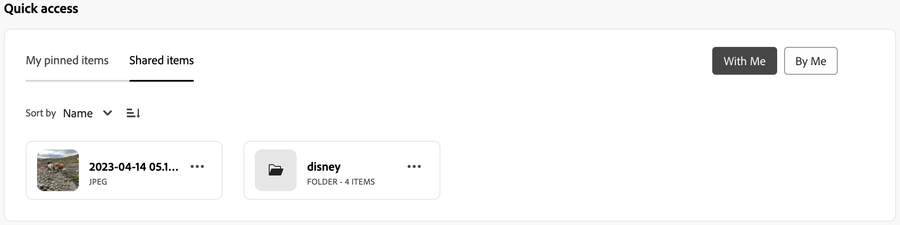

# Area di lavoro personale per Assets {#my-workspace}

>[!CONTEXTUALHELP]
>id="assets_my_workspace"
>title="Area di lavoro personale"
>abstract="Assets ora include un’area di lavoro personalizzabile che fornisce widget per l’accesso semplificato alle aree chiave dell’interfaccia utente di Assets e alle informazioni più pertinenti per l’utente. Questa pagina funge da soluzione unica per fornire una panoramica degli elementi di lavoro e consentire un accesso rapido ai flussi di lavoro chiave."

Assets ora include un’area di lavoro personalizzabile che fornisce widget per l’accesso semplificato alle aree chiave dell’interfaccia utente di Assets e alle informazioni più pertinenti per l’utente. Questa pagina funge da soluzione unica per fornire una panoramica degli elementi di lavoro e consentire un accesso rapido ai flussi di lavoro chiave. L’accesso più comodo a queste opzioni aumenta l’efficienza e la velocità dei contenuti.

Per accedere all’area di lavoro personale, fai clic su **[!UICONTROL Area di lavoro personale]** dagli elementi disponibili nel riquadro di navigazione a sinistra. L’area di lavoro personale include diversi widget che mostrano accesso rapido, approfondimenti, attività e contenuto. Puoi configurare la modalità di visualizzazione di questi widget nell’area di lavoro in base alle tue preferenze.

>[!NOTE]
>
>Il widget degli approfondimenti è visibile solo agli amministratori.

<!--

**New features coming soon**

Highlights upcoming features for Assets.

-->

**Accesso rapido**

Fissa file, cartelle e raccolte per un accesso più rapido a questi elementi quando ne avrai bisogno in un secondo momento. Tutti gli elementi fissati vengono visualizzati nella sezione **Accesso rapido** dell’area di lavoro personale. È possibile accedervi utilizzando l’area di lavoro personale anziché passare alla posizione in cui sono stati salvati nell’archivio.

Per fissare una risorsa, una cartella o una raccolta:

1. Seleziona l’elemento e fai clic su **[!UICONTROL Fissa in Accesso rapido]**.

1. Seleziona questa opzione per fissare l’elemento solo per l’utente, per l’intera organizzazione o per i gruppi selezionati. Se si seleziona **[!UICONTROL Per gruppi]**, scegliere un nome di gruppo esistente nel campo **[!UICONTROL Pin per gruppi]**.

   
1. Fai clic su **[!UICONTROL Fissa]**.

   Gli elementi selezionati vengono visualizzati nella sezione **[!UICONTROL Accesso rapido]** dell’area di lavoro personale.
   

**Approfondimenti**

Gli amministratori possono visualizzare un riepilogo del numero di download e caricamenti eseguiti nell’ambiente Assets negli ultimi 30 giorni. Puoi fare clic su **[!UICONTROL Visualizza tutto]** per passare rapidamente alla pagina Approfondimenti e visualizzare dashboard più dettagliate.

Puoi anche visualizzare i termini più cercati e il numero di volte in cui tali termini vengono cercati nella tua distribuzione di visualizzazione Assets utilizzando la sezione **Insights** di My Workspace. Puoi anche passare alla sezione Approfondimenti per visualizzare le ricerche principali degli ultimi 30 giorni o 12 mesi.

**Attività**

Visualizza l&#39;elenco delle attività attualmente assegnate all&#39;utente nella scheda **[!UICONTROL Attività personali]**, creata dall&#39;utente nella scheda **[!UICONTROL Attività assegnate]**, e le attività già completate dall&#39;utente nella scheda **[!UICONTROL Attività completate]**. È possibile selezionare un&#39;attività e fare clic su **[!UICONTROL Completa attività]** per approvare o rifiutare un&#39;attività. Puoi anche selezionare un’attività e fare clic su **[!UICONTROL Apri dettagli attività]** per visualizzare l’attività e approvarla, rifiutarla, modificarla o eliminarla.

>[!NOTE]
>
> L’opzione **[!UICONTROL Assegna attività]** per assegnare un’attività su una risorsa a un altro utente è disponibile quando selezioni una risorsa o quando apri la visualizzazione delle informazioni sulla risorsa.

**Contenuto**

Mostra le visualizzazioni assortite delle risorse, compreso l’elenco delle risorse visualizzate di recente. È possibile selezionare per visualizzare le risorse nel widget in una vista a elenco, a griglia, a raccolta o a cascata e ordinare le risorse per nome, dimensione e data modificata. Puoi anche selezionare una risorsa per visualizzarne i dettagli o rimuoverla dall’elenco delle risorse visualizzate di recente.

Nella scheda **[!UICONTROL Download principali]** sono visualizzate le dieci risorse più scaricate disponibili nell&#39;ambiente di visualizzazione Assets. Puoi scegliere di visualizzare le risorse nella Vista a elenco o a griglia. Entrambe le viste presentano il tipo di formato e il numero di download per ciascuna risorsa. Puoi anche selezionare una risorsa e fare clic su **[!UICONTROL Dettagli]** per visualizzarne le proprietà.

## Personalizzare l’area di lavoro personale {#configure-widgets}

Tutti i widget vengono visualizzati per impostazione predefinita, ma è possibile abilitare o disabilitare i widget visualizzati nell’area di lavoro personale. Le preferenze sono specifiche per ogni utente.

1. Fai clic su **[!UICONTROL Area di lavoro personale]** disponibile nel riquadro di navigazione a sinistra e fai clic su **[!UICONTROL Personalizza]**.

1. Disattiva l’interruttore per il widget che non è necessario visualizzare nell’area di lavoro. Puoi anche trascinare un widget in una posizione appropriata per aggiornare l’ordine di visualizzazione nell’area di lavoro.

1. Per salvare le modifiche, fai clic su **[!UICONTROL Completati]**.

   
