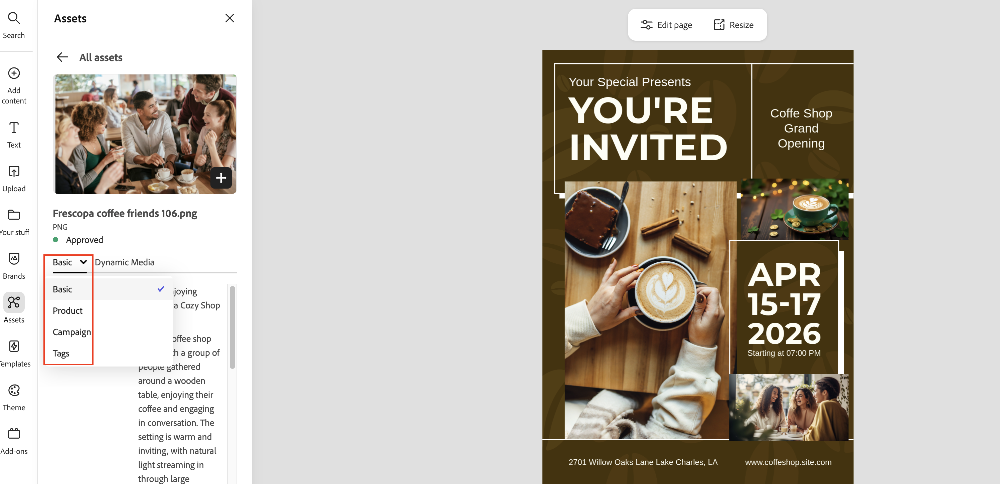
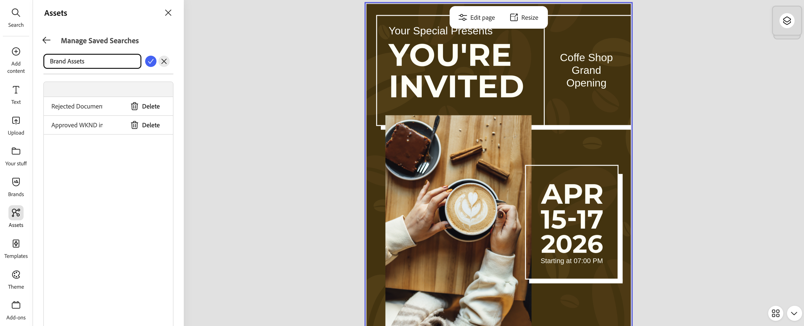
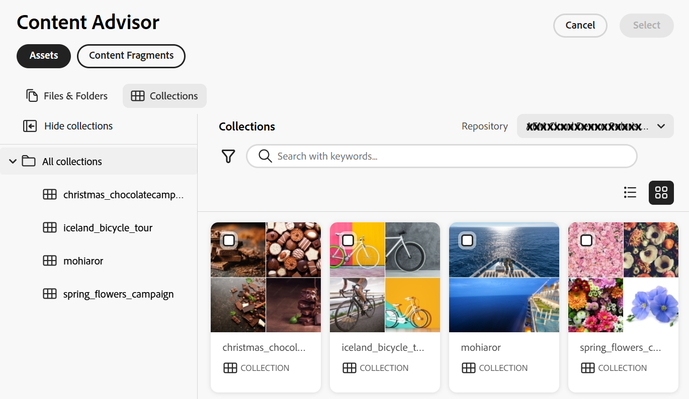
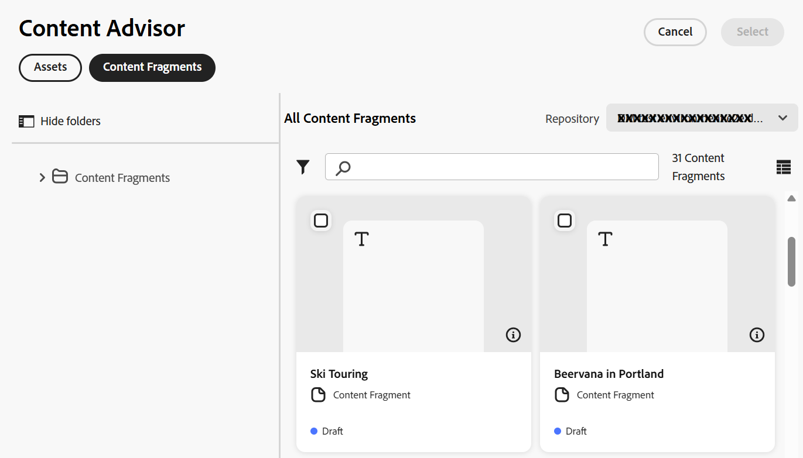

# Utilizzare Contenuto verificato per accedere ad AEM Assets in Adobe Express {#native-integration-adobe-express-using-content-advisor}

Adobe Experience Manager (AEM) Assets si integra in modo nativo con Adobe Express, consentendo di individuare, accedere e utilizzare le risorse da AEM Assets direttamente nell’interfaccia Express tramite Content Advisor.

Content Advisor trasforma il modo in cui le risorse vengono individuate e utilizzate in Adobe Express, introducendo l&#39;individuazione intelligente delle risorse in base al contesto direttamente nel flusso di lavoro creativo. Invece di cercare le risorse digitando le parole chiave, Content Advisor rende rilevanti le risorse approvate in base al contenuto dell&#39;area di lavoro, alla descrizione della campagna e all&#39;intento, consentendo di trovare più rapidamente la risorsa corretta.

Grazie a suggerimenti avanzati, all&#39;accesso alle rappresentazioni Dynamic Media e alla piena visibilità dei metadati delle risorse, Content Advisor consente di individuare, valutare e utilizzare in modo efficiente le risorse di AEM Assets senza uscire da Adobe Express. In questo modo è possibile creare contenuti più rapidamente, riutilizzare meglio le risorse e utilizzare in modo coerente le risorse approvate e conformi al marchio.


Puoi anche inserire le risorse nell’area di lavoro Express e salvare contenuti nuovi o modificati in AEM Assets, garantendo una gestione e una governance centralizzate delle risorse. L’integrazione nativa con Adobe Express offre i seguenti vantaggi chiave:

* Creazione di contenuti accelerata con individuazione delle risorse in base al contesto e consigli.

* È stato aumentato il riutilizzo dei contenuti modificando le risorse esistenti e salvando nuove risorse in AEM Assets.

* Accesso più rapido alle rappresentazioni Dynamic Media approvate e ottimizzate per il canale.

* Riduzione del tempo e dell&#39;impegno necessari per creare nuove risorse o nuove versioni mantenendo al contempo la coerenza del marchio.

## Prerequisiti {#prerequisites}

Diritti di accesso ad Adobe Express e ad almeno un ambiente in AEM Assets. L’ambiente può essere uno qualsiasi degli archivi as a Cloud Service di Assets.

## Utilizzare AEM Assets nell’editor di Adobe Express {#use-aem-assets-in-express}

Per iniziare a utilizzare AEM Assets nell’editor di Adobe Express, effettua le seguenti operazioni:

1. Apri l’applicazione web Adobe Express.

2. Apri una nuova area di lavoro vuota caricando un nuovo modello o progetto oppure creando una risorsa.

3. Fai clic su **[!UICONTROL Assets]** disponibile nel riquadro di navigazione a sinistra. In Adobe Express viene visualizzato [Contenuto verificato](#intelligent-asset-discovery-content-advisor), in cui sono elencati gli archivi a cui si ha diritto di accedere e l&#39;elenco delle risorse e cartelle disponibili a livello principale.

4. Sfogliare o cercare le risorse nel repository utilizzando [Contenuto verificato](#intelligent-asset-discovery-content-advisor), quindi trascinarle e rilasciarle nell&#39;area di lavoro. In alternativa, fai clic sulle risorse per inserirle nell’area di lavoro. Puoi anche filtrare le risorse  in base a vari criteri, ad esempio lo stato di approvazione, il tipo di file, il tipo MIME e le dimensioni.

   >[!NOTE]
   >
   >Il filtro per dimensione non si applica ai video.

   

## Individuazione intelligente delle risorse con Content Advisor {#intelligent-asset-discovery-content-advisor}

Contenuto verificato consente di individuare le risorse rilevanti utilizzando consigli intelligenti e contestuali basati sul contenuto dell&#39;area di lavoro o sul resoconto della campagna. Consente inoltre di selezionare le rappresentazioni Dynamic Media pronte per il canale ottimizzate per il tuo caso d’uso.


Contenuto verificato visualizza l&#39;elenco di file, cartelle e raccolte nelle visualizzazioni Elenco e Griglia. Consente di aggiungere risorse nei formati PNG, JPEG, PSD, MP4, SVG e PDF all’area di lavoro Express. Puoi anche visualizzare in anteprima i file PDF scorrevoli o qualsiasi altro tipo di formato facendo clic sull&#39;icona  nella scheda delle risorse.

Fai clic sull&#39;icona  per visualizzare anche i metadati delle risorse disponibili nella scheda **[!UICONTROL Base]** oppure visualizza le rappresentazioni Dynamic Media disponibili nella scheda [Dynamic Media](#dynamic-media-renditions-content-advisor). Trascina e rilascia il contenuto suggerito nell’area di lavoro. In alternativa, fai clic sulla risorsa per inserirla automaticamente nell’area di lavoro.


>[!IMPORTANT]
> 
>Accertati di selezionare un archivio **author** dall&#39;elenco a discesa **Repository**. Un repository **delivery** non visualizza le funzionalità di Contenuto verificato.
>
> Inoltre, l&#39;archivio **delivery** non dispone di risorse organizzate in cartelle e raccolte. Tutte le risorse vengono visualizzate al livello principale in una struttura piatta.

Contenuto verificato offre le seguenti funzionalità principali:

* [Ricerche IA per un&#39;individuazione più intelligente delle risorse](#content-advisor-ai-search)

* [Suggerimenti avanzati basati su contesto e intento](#smart-suggestions-content-advisor)

* [Documenti informativi sulle campagne per scoprire le risorse rilevanti](#campaign-briefs-content-advisor)

* [Rendering delle risorse Dynamic Media disponibili per l’uso](#dynamic-media-renditions-content-advisor)

* [Accedere ai metadati delle risorse in modo coerente con la vista Assets](#asset-metadata-content-advisor)

* [Filtri di accesso coerenti con la vista Assets](#filters-content-advisor)

* [Accedere e riutilizzare ricerche recenti e salvate](#saved-searches-content-advisor)

* [Cercare risorse tra e all’interno di raccolte](#search-collections-content-advisor)

### Ricerche IA per un&#39;individuazione più intelligente delle risorse {#content-advisor-ai-search}

Contenuto verificato utilizza una funzionalità di ricerca avanzata in grado di comprendere il significato e l&#39;intento alla base della query di un utente, anziché basarsi su corrispondenze esatte tra parole chiave. Utilizza l’intelligenza artificiale (IA) e l’apprendimento automatico per fornire risultati più precisi e in base al contesto.

A differenza della ricerca tradizionale basata su parole chiave, che cerca termini esatti, Ricerca IA interpreta le relazioni tra parole, concetti e intento dell&#39;utente. In questo modo gli utenti possono trovare ciò che stanno cercando, anche se la query è formulata in modo diverso, contiene errori di battitura o è in un’altra lingua.


Alcuni vantaggi, tra cui:

* Supporto multilingue: ricerca in più lingue senza richiedere traduzioni esatte. Gli utenti possono trovare contenuti rilevanti indipendentemente dal linguaggio di query.

* Gestisce gli errori di ortografia: interpreta gli errori di battitura e di ortografia, garantendo risultati accurati anche con input imperfetto.

* Comprende i sinonimi: fornisce risultati per termini e frasi correlati, pertanto gli utenti non devono indovinare la parola chiave giusta.

* Ricerca in base al contesto: riconosce l’intento alla base di una query, non solo le parole esatte.

>[!IMPORTANT]
> 
>* La versione di AEM release minima richiesta per accedere alle Ricerche IA in Contenuto verificato è `21994`.


### Suggerimenti avanzati basati su contesto e intento {#smart-suggestions-content-advisor}

Contenuto verificato visualizza suggerimenti avanzati in base al contesto e all&#39;intento del contenuto nell&#39;area di lavoro di Express. Questo consente di individuare e utilizzare rapidamente le risorse in linea con le esigenze di contenuto senza dover ricorrere a lunghe ricerche manuali.


>[!IMPORTANT]
> 
>* Contenuto verificato visualizza suggerimenti avanzati in base al contesto e all&#39;intento del contenuto disponibile nei livelli di testo o nel titolo dell&#39;area di lavoro Express. Non visualizza i risultati in base alle immagini disponibili nell’area di lavoro.
>* Per accedere a questa funzione in Contenuto verificato, è necessario firmare un Rider GenAI. Per firmare GenAI rider, contatta il tuo rappresentante Adobe.
>* La versione minima richiesta di AEM per accedere a questa funzione è `21994`.
>* I suggerimenti avanzati non vengono aggiornati automaticamente quando si aggiorna l’area di lavoro. Fai clic sull&#39;icona di aggiornamento nel pannello **Contenuto consigliato** per visualizzare l&#39;elenco aggiornato dei suggerimenti,

### Documenti informativi sulle campagne per scoprire le risorse rilevanti {#campaign-briefs-content-advisor}

Contenuto verificato consente di caricare un documento di riepilogo della campagna per individuare le risorse rilevanti senza immettere manualmente le parole chiave di ricerca. Contenuto verificato analizza le informazioni contenute nel documento della campagna per comprenderne le finalità e consiglia le risorse pertinenti disponibili in AEM Assets.


>[!IMPORTANT]
>
>* Contenuto verificato analizza le informazioni disponibili come testo nella descrizione della campagna per consigliare le risorse pertinenti. Non analizza le informazioni disponibili come immagini nel resoconto della campagna.
>* I tipi di file supportati che è possibile caricare come descrizione della campagna includono documenti PDF, DOCX e TXT.
>* Per accedere a questa funzione in Contenuto verificato, è necessario firmare un Rider GenAI. Per firmare GenAI rider, contatta il tuo rappresentante Adobe.
>* La versione minima richiesta di AEM per accedere a questa funzione è `21994`.

### Rendering delle risorse Dynamic Media disponibili per l’uso {#dynamic-media-renditions-content-advisor}

Le rappresentazioni Dynamic Media forniscono versioni pronte per l&#39;uso e ottimizzate per il canale delle risorse, tra cui [predefiniti immagine](/help/assets/dynamic-media/managing-image-presets.md), [ritagli avanzati](/help/assets/dynamic-media/image-profiles.md), tipi di formato e profili colore. Queste rappresentazioni consentono di garantire che la risorsa selezionata soddisfi i requisiti di canale e progettazione senza richiedere la modifica manuale o la duplicazione delle risorse.

Puoi anche applicare i modificatori Dynamic Media alle regolazioni di anteprima in tempo reale prima di inserire il rendering nell’area di lavoro Express, consentendo una selezione più rapida del rendering più appropriato mantenendo al contempo la coerenza e la qualità delle risorse.

Fai clic sull&#39;icona  sulla scheda delle risorse e seleziona la scheda **[!UICONTROL Dynamic Media]** per visualizzare le rappresentazioni disponibili per una risorsa. Puoi scegliere di visualizzare [le rappresentazioni Scene7](/help/assets/dynamic-media/dynamic-media.md) di Dynamic Media o [Dynamic Media con le rappresentazioni OpenAPI](/help/assets/dynamic-media-open-apis-overview.md). Quando selezioni **[!UICONTROL OpenAPI]** per una risorsa, le rappresentazioni disponibili vengono visualizzate solo se la risorsa è approvata e disponibile in Dynamic Media con OpenAPI.

Per visualizzare la scheda Dynamic Media, è necessario disporre di una licenza AEM Dynamic Media valida.


Fai clic sull&#39;icona  per visualizzare l&#39;anteprima della copia trasformata oppure fai clic sul nome della copia trasformata per inserirla automaticamente nell&#39;area di lavoro. Puoi anche visualizzare in anteprima la rappresentazione, quindi trascinarla e rilasciarla per posizionare l’immagine nell’area di lavoro.


Fare clic su **[!UICONTROL Aggiungi modificatori]**, specificare un modificatore nella casella di testo e premere Invio per applicare la trasformazione alle rappresentazioni in tempo reale. Allo stesso modo, potete aggiungere più modificatori a una rappresentazione e visualizzare in anteprima tali trasformazioni. Trascina e rilascia la risorsa dall’anteprima all’area di lavoro. La rappresentazione dopo l’applicazione di tali modificatori non viene salvata. Consulta l&#39;elenco dei modificatori supportati per [Dynamic Media Scene7](https://experienceleague.adobe.com/it/docs/dynamic-media-developer-resources/image-serving-api/image-serving-api/http-protocol-reference/command-reference/c-command-reference) e [Dynamic Media con OpenAPI](https://developer.adobe.com/experience-cloud/experience-manager-apis/api/stable/assets/delivery/#operation/getAssetSeoFormat).

>[!IMPORTANT]
> 
>Dynamic Media consente di superare il limite di 80 MB per la dimensione dei file caricati in Adobe Express (web), fornendo rappresentazioni ottimizzate di risorse di grandi dimensioni. Le rappresentazioni Dynamic Media riducono notevolmente le dimensioni dei file, preservando al contempo la qualità visiva. Ad esempio, è possibile distribuire una risorsa TIFF da 300 MB come rendering da 2,5 MB senza compromettere la qualità, consentendo un utilizzo efficiente delle risorse ad alta risoluzione in Adobe Express.

### Accedere ai metadati delle risorse in modo coerente con la vista Assets {#asset-metadata-content-advisor}

Contenuto verificato consente di accedere alle proprietà delle risorse definite in AEM Assets, inclusi i metadati disponibili nella visualizzazione Assets. Contenuto verificato utilizza la stessa configurazione dei metadati della vista Assets, replicando l&#39;elenco delle schede di metadati e il contenuto nella pagina dei dettagli delle risorse della vista Assets. Questo consente di rivedere i dettagli chiave della risorsa come titolo, descrizione, formato, dimensione e altri metadati prima di selezionare una risorsa. L’accesso alle proprietà delle risorse consente di scegliere la risorsa corretta e approvata per il contenuto.



Fai clic sull&#39;icona  sulla scheda delle risorse e seleziona la scheda **[!UICONTROL Base]** per visualizzare i metadati della risorsa. Puoi anche visualizzare altre schede di metadati delle risorse, come Prodotto, Campagna e Tag, in modo coerente con i metadati delle risorse esistenti nella vista Assets.

Contenuto verificato visualizza le proprietà (metadati) dei file in una visualizzazione di sola lettura. Le proprietà non vengono visualizzate per raccolte e cartelle.

### Filtri di accesso coerenti con la vista Assets {#filters-content-advisor}

Contenuto verificato fornisce in Express le stesse funzionalità di filtro disponibili nella vista Assets, consentendo di perfezionare le risorse utilizzando filtri predefiniti. Le stesse funzionalità di filtro disponibili nella vista Assets si applicano anche ai filtri specifici per i tipi di contenuto, come file, cartelle e raccolte. Questo garantisce un’esperienza di individuazione delle risorse coerente e consente di individuare in modo efficiente le risorse rilevanti all’interno di Adobe Express.

Se non sono stati impostati filtri nella visualizzazione Assets tramite lo schema dei filtri, Content Advisor visualizza i filtri predefiniti, inclusi Tipo file, Formato file, Stato risorsa, Dimensione file, Larghezza immagine, Altezza immagine, Data di modifica e Data di creazione.

### Accedere e riutilizzare ricerche recenti e salvate {#saved-searches-content-advisor}

Sono inoltre disponibili le ricerche salvate create nella vista Assets, che consentono di riutilizzare i criteri di ricerca predefiniti. Le ricerche salvate funzionano in modo coerente tra la vista Assets e Contenuto verificato nei vari browser. Questo consente di individuare in modo efficiente le risorse utilizzando pattern di ricerca coerenti in AEM Assets e Adobe Express.

Per salvare la ricerca utilizzata di frequente utilizzando Contenuto verificato:

1. Specifica un termine di ricerca (facoltativo), fai clic sull’icona dei filtri e seleziona le opzioni in base ai tuoi requisiti per creare una query di ricerca.

1. Fai clic su **[!UICONTROL Applica]** per visualizzare i risultati.

1. Fai clic sull&#39;icona dei filtri > **Gestisci ricerche salvate** > **Crea nuova ricerca salvata**.

1. Specifica il nome della ricerca e fai clic sull&#39;icona  per salvarla. La ricerca viene visualizzata nell’elenco degli elementi.

   

Per applicare uno degli elementi di ricerca salvati, fare clic sull&#39;icona dei filtri, selezionare l&#39;elemento di ricerca dall&#39;elenco a discesa **[!UICONTROL Ricerche salvate]** e fare clic su **[!UICONTROL Applica]**.

Contenuto verificato consente di salvare le ricerche recenti e di salvare quelle utilizzate più di frequente per accedervi rapidamente in un secondo momento. L&#39;elenco delle ricerche recenti non è coerente tra la vista Assets e Contenuto verificato. Lo stesso utente può avere un diverso set di ricerche recenti nella vista Assets e in Contenuto verificato. Se si utilizza la modalità in incognito per accedere a Contenuto verificato, l&#39;elenco delle ricerche recenti non è disponibile. Inoltre, le ricerche recenti non vengono condivise tra browser diversi per lo stesso utente e sono specifiche per l’ambiente di AEM.


La funzione Ricerca salvata predefinita, disponibile nella visualizzazione Assets, non è ancora disponibile in Contenuto verificato.

### Cercare risorse tra e all’interno di raccolte {#search-collections-content-advisor}

Contenuto verificato consente di cercare risorse o raccolte in tutte le raccolte o di limitare la ricerca a una raccolta specifica. Questo consente di individuare e utilizzare rapidamente le risorse delle raccolte curate, preservando al contempo il contesto organizzativo previsto.

## Sostituisci immagine con caricamento AEM {#replace-image-using-aem-upload}

È inoltre possibile sostituire le immagini aggiunte utilizzando **[!UICONTROL Caricamento AEM]**. A questo scopo, esegui i seguenti passaggi:

1. Sfoglia o cerca le risorse e trascinale sull’area di lavoro.

1. Selezionate l&#39;immagine da sostituire. Fai clic su **[!UICONTROL Sostituisci]** e seleziona **[!UICONTROL AEM Assets]** tra le varie altre opzioni.

   

1. [Contenuto verificato](#intelligent-asset-discovery-content-advisor) viene aperto nel riquadro di spostamento a sinistra. Adobe Express mostra l’elenco degli archivi a cui hai diritto di accesso e l’elenco delle risorse e cartelle disponibili a livello principale. Seleziona una risorsa da lì per visualizzare in anteprima la sostituzione nell&#39;area di lavoro, quindi fai clic su **[!UICONTROL Sostituisci]** per confermare.

   >[!NOTE]
   >
   > I tipi di file SVG non sono supportati.

## Salvare progetti Adobe Express in AEM Assets {#save-express-projects-in-assets}

Dopo aver incorporato le modifiche appropriate nell’area di lavoro di Express, puoi salvarla in AEM Assets.

1. Fai clic su **[!UICONTROL Condividi]** per aprire la finestra di dialogo **[!UICONTROL Condividi]**.

   

2. Seleziona **AEM Assets**. Adobe Express visualizza la finestra di dialogo di caricamento.

3. Selezionare **Pagina corrente** o **Tutte le pagine**. Specifica un nome e un formato per le risorse da esportare. Puoi esportare i contenuti dell’area di lavoro nei formati PNG, JPEG, PDF, MP4, MP4+PNG o MP4+JPEG. Il formato viene regolato automaticamente in base alle risorse presenti nelle pagine dell’area di lavoro.
Se selezioni **Pagina corrente**, la risorsa nella pagina corrente verrà salvata nella cartella di destinazione. Se si seleziona **Tutte le pagine** e il formato di esportazione non è PDF, tutte le pagine dell&#39;area di lavoro vengono salvate come file separati in una nuova cartella all&#39;interno della cartella di destinazione. Se il formato di esportazione è PDF, tutte le pagine canvas vengono salvate come un singolo file PDF nella cartella di destinazione.

4. Fai clic sull&#39;icona della cartella in **Cartella di destinazione** per selezionare un percorso e salvare le risorse.

   

5. Facoltativo: puoi aggiungere i metadati della campagna per il caricamento utilizzando il campo **Nome progetto o campagna**. Puoi usare un nome esistente o crearne uno nuovo. Puoi definire più nomi di progetto o campagna per il caricamento. Per registrare il nome, digitalo e premi Invio.
Come best practice, Adobe consiglia di specificare i valori negli altri campi e di creare un’esperienza di ricerca avanzata per le risorse caricate.

6. Allo stesso modo, definisci i valori per i campi **[!UICONTROL Parole chiave]** e **[!UICONTROL Canali]**.

7. Fai clic su **[!UICONTROL Carica]** per caricare le risorse in AEM Assets.

   >[!NOTE]
   >
   > Se salvi le risorse nell’archivio di consegna Content Hub, il nome del progetto o della campagna è un campo obbligatorio. In questo caso, inoltre, non è necessario selezionare una cartella di destinazione, in quanto viene derivata automaticamente dai metadati.

## Formati di file supportati {#supported-file-formats-import-assets}

Adobe Express supporta in modo nativo i formati disponibili in [Verifica i requisiti minimi per l&#39;immagine](https://helpx.adobe.com/it/express/web/image-creation-and-editing/change-file-formats/image-requirements.html). Tuttavia, AEM Assets supporta i seguenti tipi di formato:

| Formato supportato | Dimensioni massime/risoluzione | Dimensione massima file |
|------------------|---------------------------------------------|---------------|
| JPEG | 65 MP (ad esempio, 8K × 8K o 16K × 4K) | Desktop da 80 MB, mobile da 40 MB |
| PNG | 65 MP (ad esempio, 8K × 8K o 16K × 4K) | Desktop da 80 MB, mobile da 40 MB |
| SVG | - | 250 KB |
| MP4 | 3840 × 3840 pixel | 200 MB |
| PSD | 65 MP (ad esempio, 8K × 8K o 16K × 4K) | Desktop da 80 MB, mobile da 40 MB |
| PDF | - | - |


## Limitazioni {#limitations}

1. Per l&#39;importazione e l&#39;esportazione, il tipo di file video supportato è MP4.

2. Per **importazione video MP4**, i video con sfondi trasparenti (canale alfa) non sono supportati.
   <!--
   1. The maximum file size supported is 200 MB. If this limit exceeds, an alert message displays.
   2. The maximum supported resolution is 3840 X 3840 pixels.
   3. Videos with transparent backgrounds (alpha channel) are not supported.
   -->

3. Per l&#39;esportazione di **MP4 video**, la dimensione massima del file supportata è 200 MB. Se questo limite viene superato, un avviso consiglia di tagliare il video a 200 MB o meno, oppure di caricarlo manualmente nella cartella di destinazione di AEM Assets dopo averlo scaricato.

<!--
## Content Advisor Properties {#content-advisor-props}

You can configure following properties for the content advisor:

* `featureSet` : This property enables the Content Advisor MFE.

    ```
    featureSet: [
        ...defaultFeatures, /* to include all default features */
        'advisor', /* enables Content Advisor features */
        'content-fragments', /* enables Content Fragments */
    ],
    ```

* `rail:true/false` : If marked true, Content Advisor is rendered in a left rail view. If it is marked false, the Content Advisor is rendered in modal view.

## Browse assets using Content Advisor {#browse-assets-content-advisor}

<!--In the Modal View of Content Advisor, you can access both [Assets](#using-assets-tab) and [Content Fragments](#using-content-fragments) within a unified interface.

### Assets tab{#assets-tab}

The **[!UICONTROL Assets]** tab allows you to browse or filter available assets, preview them before selection, and choose appropriate **[!UICONTROL Dynamic Media]** [renditions](renditions.md) or [smart crops](/help/assets/dynamic-media/image-profiles.md#creating-image-profiles) as needed. Assets, folders, and collections are presented together in a single, streamlined experience. The interface also provides contextual recommendations based on the integrated application context, helping you quickly identify relevant content.

Within assets tab, you can access content by browsing [Files and folders](#content-advisor-files-and-folders) or viewing [Collections](#content-advisor-collections).

### Files and Folders tab{#content-advisor-files-and-folders}

Browsing content using Files and Folders allows you navigate your assets in a familiar hierarchical structure, making it easy to locate assets within the repository. To browse assets within files and folders, navigate to the **[!UICONTROL Assets]** tab and select **[!UICONTROL Files & Folders]**. A hierarchical structure is then displayed, allowing you to easily locate and select the desired assets.


### Collections tab{#content-advisor-collections}

Browsing content using Collections allows you to access curated groups of assets within Collections. To browse assets within Collections, navigate to the **[!UICONTROL Assets]** tab and select **[!UICONTROL Collections]**. The interface then displays curated groups of assets, enabling you to browse the content you need.



<!--
### Content Fragments tab{#content-fragments}

The [Content Fragments](/help/assets/content-fragments/content-fragments.md) tab displays structured assets, allowing you to browse, search, and filter fragments efficiently within the same interface. To browse assets using Content Fragments, navigate to the **[!UICONTROL Content Fragments]** tab to access and explore the fragments available in the repository.


-->


