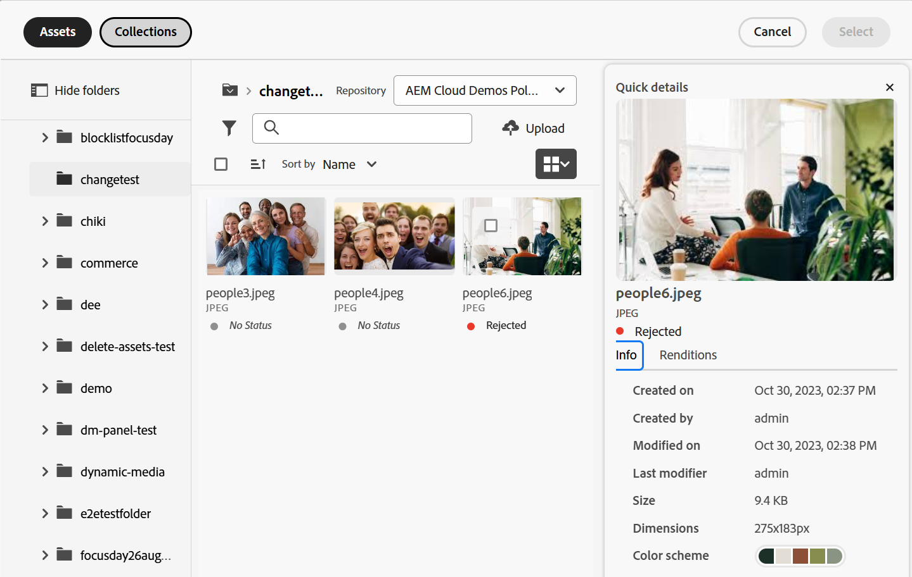

# Selettore risorse micro front-end {#Overview}

Il Selettore risorse micro front-end fornisce un’interfaccia utente che si integra facilmente con l’archivio di [!DNL Experience Manager Assets] in modo da poter sfogliare o cercare le risorse digitali disponibili nell’archivio e utilizzarle nell’esperienza di authoring dell’applicazione.

L’interfaccia utente micro front-end è resa disponibile nell’esperienza dell’applicazione utilizzando il pacchetto Selettore risorse. Eventuali aggiornamenti al pacchetto vengono importati automaticamente e l’ultimo Selettore risorse implementato viene caricato automaticamente all’interno dell’applicazione.


Il Selettore risorse offre molti vantaggi, tra cui:

* Facilità di integrazione con qualsiasi applicazione [Adobe](/help/assets/integrate-asset-selector-adobe-app.md) o [non Adobe](/help/assets/integrate-asset-selector-non-adobe-app.md) utilizzando la libreria JavaScript Vanilla.
* Facile manutenzione poiché gli aggiornamenti al pacchetto Selettore risorse vengono automaticamente distribuiti nel selettore risorse disponibile per l’applicazione. Non sono necessari aggiornamenti all’interno dell’applicazione per caricare le modifiche più recenti.
* Facilità di personalizzazione grazie alle proprietà disponibili che controllano la visualizzazione del Selettore risorse all’interno dell’applicazione.
* Filtri di ricerca full-text, predefiniti e personalizzati per passare rapidamente alle risorse da utilizzare nell’esperienza di authoring.
* Possibilità di cambiare archivi all’interno di un’organizzazione IMS per la selezione delle risorse.
* Possibilità di ordinare le risorse per nome, proporzioni e dimensioni e di visualizzarle nelle viste Elenco, Griglia, Galleria o Cascata.

<!--Perform the following tasks to integrate and use Asset Selector with your [!DNL Experience Manager Assets] repository:

1. [Install Asset Selector](#installation)
2. [Integrate Asset Selector using Vanilla JS](#integration-using-vanilla-js)
3. [Use Asset Selector](#using-asset-selector)
-->

<!--
## Setting up Asset Selector {#asset-selector-setup}


-->

## Prerequisiti{#prereqs}

Devi accertarti di utilizzare i seguenti metodi di comunicazione:

* L’applicazione host è in esecuzione su HTTPS.
* Non è possibile eseguire l’applicazione su `localhost`. Se desideri integrare il Selettore risorse nel computer locale, è necessario creare un dominio personalizzato, ad esempio `[https://<your_campany>.localhost.com:<port_number>]`, e aggiungere tale dominio nell’`redirectUrl list`.
* Puoi configurare e aggiungere clientID nella variabile di ambiente di AEM Cloud Services con il rispettivo `imsClientId`.
<!--* You can configure and add `ADOBE_PROVIDED_CLIENT_ID` into the AEM Cloud Service environment variable with the respective `imsClientId`.
-->
* L’elenco degli ambiti IMS deve essere definito nella configurazione dell’ambiente.
* L’URL dell’applicazione si trova nell’elenco Consentiti degli URL di reindirizzamento del client IMS.
* Il flusso di accesso IMS viene configurato e renderizzato utilizzando un pop-up sul browser web. Pertanto, i popup devono essere abilitati o consentiti nel browser di destinazione.

Se hai bisogno del flusso di lavoro di autenticazione IMS del Selettore risorse, utilizza i prerequisiti di cui sopra. In alternativa, se hai già effettuato l’autenticazione con il flusso di lavoro IMS, puoi aggiungere le informazioni IMS.

**Ulteriori informazioni**

* [Integrare il Selettore risorse con un’applicazione Adobe](/help/assets/integrate-asset-selector-adobe-app.md)
* [Integrare il Selettore risorse con un’applicazione non Adobe](/help/assets/integrate-asset-selector-non-adobe-app.md)
* [Integrare le Open API Dynamic Media del Selettore risorse](/help/assets/integrate-asset-selector-dynamic-media-open-api.md)


>[!IMPORTANT]
>
> Questo archivio funge da documentazione aggiuntiva sulle API disponibili e fornisce alcuni esempi di utilizzo per l’integrazione del Selettore risorse. Prima di installare o utilizzare il Selettore risorse, assicurati che all’organizzazione sia stato fornito l’accesso al Selettore risorse come parte del profilo Experience Manager Assets as a Cloud Service. Se non è stato fornito l’accesso, non è possibile integrare o utilizzare questi componenti. Per richiedere l’accesso, l’amministratore del programma deve generare un ticket di supporto contrassegnato come P2 da Admin Console e includere le seguenti informazioni:
>
>* Nomi di dominio in cui è ospitata l’applicazione di integrazione.
>* Dopo la fornitura dell’accesso, all’organizzazione verranno forniti i dati di `imsClientId`, `imsScope` e un `redirectUrl` corrispondenti agli ambienti richiesti, dati essenziali per la configurazione del Selettore risorse. Senza tali proprietà valide, non è possibile eseguire i passaggi di installazione.

## Installazione {#installation}

Il Selettore risorse è disponibile tramite entrambe le versioni ESM CDN (ad esempio, [esm.sh](https://esm.sh/)/[skypack](https://www.skypack.dev/)) e [UMD](https://github.com/umdjs/umd).

Nei browser che utilizzano la **versione UMD** (scelta consigliata):

```
<script src="https://experience.adobe.com/solutions/CQ-assets-selectors/static-assets/resources/assets-selectors.js"></script>

<script>
  const { renderAssetSelector } = PureJSSelectors;
</script>
```

Nei browser con supporto di `import maps` che utilizzano la **versione ESM CDN**:

```
<script type="module">
  import { AssetSelector } from 'https://experience.adobe.com/solutions/CQ-assets-selectors/static-assets/resources/@assets/selectors/index.js'
</script>
```

Nella federazione di moduli Deno/Webpack utilizzando la **versione ESM CDN**:

```
import { AssetSelector } from 'https://experience.adobe.com/solutions/CQ-assets-selectors/static-assets/resources/@assets/selectors/index.js'
```

## Utilizzo del Selettore risorse {#using-asset-selector}

Dopo aver configurato il Selettore risorse ed aver effettuato l’autenticazione per utilizzarlo con l’applicazione [!DNL Adobe Experience Manager] as a [!DNL Cloud Service], puoi selezionare le risorse o eseguire varie altre operazioni per cercare le risorse all’interno dell’archivio.


* **A**: [Nascondi/Mostra pannello](#hide-show-panel)
* **B**: [Selettore archivio](#repository-switcher)
* **C**: [Risorse](#repository)
* **D**: [Filtri](#filters)
* **E**: [Barra di ricerca](#search-bar)
* **F**: [Ordinamento](#sorting)
* **G**: [Ordinamento crescente o decrescente](#sorting)
* **H**: [Visualizzazione](#types-of-view)

### Nascondi/Mostra pannello {#hide-show-panel}

Per nascondere le cartelle nel menu di navigazione a sinistra, fai clic sull’icona **[!UICONTROL Nascondi cartelle]**. Per annullare le modifiche, fai di nuovo clic sull’icona **[!UICONTROL Nascondi cartelle]**.

### Selettore archivio {#repository-switcher}

Il Selettore risorse consente inoltre di cambiare archivio per la selezione delle risorse. Puoi selezionare l’archivio desiderato dal menu a discesa disponibile nel pannello a sinistra. Le opzioni dell’archivio disponibili nell’elenco a discesa si basano sulla proprietà `repositoryId` definita nel file `index.html`. Si basa sugli ambienti dell’organizzazione IMS selezionata a cui accede l’utente che ha eseguito l’accesso. I consumatori possono trasmettere un `repositoryID` preferito e, in tal caso, il Selettore risorse interrompe il rendering del selettore archivio ed esegue il rendering solo delle risorse dall’archivio specificato.

### Archivio risorse

Si tratta di una raccolta di cartelle di risorse che puoi utilizzare per eseguire le operazioni.

### Filtri predefiniti {#filters}

Il Selettore risorse fornisce anche opzioni di filtro predefinite per perfezionare i risultati della ricerca. Sono disponibili i seguenti filtri:

* **[!UICONTROL Stato]:** include lo stato corrente della risorsa tra `all`, `approved`, `rejected` o `no status`.
* **[!UICONTROL Tipo di file]:** include `folder`, `file`, `images`, `documents` o `video`.
* **[!UICONTROL Stato di scadenza]:** fa riferimento alle risorse in base alla relativa durata di scadenza. È possibile selezionare la casella di controllo `[!UICONTROL Expired]` per filtrare le risorse scadute oppure impostare `[!UICONTROL Expiration Duration]` per visualizzare le risorse in base alla durata della scadenza. Quando una risorsa è già scaduta o sta per scadere, viene visualizzato un badge che ne illustra la situazione. Inoltre, puoi controllare se consentire l’utilizzo (o il trascinamento) di una risorsa scaduta. Ulteriori informazioni su [personalizzare le risorse scadute](/help/assets/asset-selector-customization.md#customize-expired-assets). Per impostazione predefinita, il badge **In scadenza** viene visualizzato per le risorse che scadono nei successivi 30 giorni. È tuttavia possibile configurare la scadenza utilizzando la proprietà `expirationDate`.

  >[!TIP]
  >
  > Se desideri visualizzare o filtrare le risorse in base alla relativa data di scadenza futura, indica l’intervallo di date futuro nel campo `[!UICONTROL Expiration Duration]`. Le risorse verranno visualizzate con accanto il badge **In scadenza**.

* **[!UICONTROL Tipo MIME]:** include `JPG`, `GIF`, `PPTX`, `PNG`, `MP4`, `DOCX`, `TIFF`, `PDF`, `XLSX`.
* **[!UICONTROL Dimensioni immagine]:** include larghezza minima/massima, altezza minima/massima dell’immagine.

  

### Ricerca personalizzata

Oltre alla ricerca full-text, il Selettore risorse consente di cercare le risorse all’interno dei file utilizzando la ricerca personalizzata. Puoi utilizzare filtri di ricerca personalizzati sia nella vista modale che nella vista della barra.


Puoi anche creare un filtro di ricerca predefinito per salvare i campi che cerchi frequentemente e utilizzarli in un secondo momento. Per creare una ricerca personalizzata delle risorse, puoi utilizzare la proprietà `filterSchema`.

### Barra di ricerca {#search-bar}

Il Selettore risorse consente di eseguire una ricerca full-text delle risorse all’interno dell’archivio selezionato. Ad esempio, se digiti la parola chiave `wave` nella barra di ricerca, vengono mostrate tutte le risorse con la parola chiave `wave` menzionata in una qualsiasi delle proprietà dei metadati.

### Ordinamento {#sorting}

Puoi ordinare le risorse all’interno selettore risorse per nome, dimensione o dimensione di una risorsa. Puoi anche ordinare le risorse in ordine crescente o decrescente.

### Tipi di visualizzazione {#types-of-view}

Il selettore risorse consente di visualizzare la risorsa in quattro diversi modi:

*  [!UICONTROL **Vista a elenco**]: la vista a elenco mostra i file e le cartelle in una singola colonna scorrevole.
*  [!UICONTROL **Vista griglia**]: con la vista griglia i file e le cartelle scorrono in una griglia di righe e colonne.
*  [!UICONTROL **Vista galleria**]: la vista galleria mostra i file o le cartelle in un elenco orizzontale bloccato al centro.
*  [!UICONTROL **Vista a cascata** ]: la vista a cascata mostra file o cartelle sotto forma di un Bridge.

### Metadati e dettagli della risorsa {#asset-details-and-metadata}

La pagina Dettagli risorsa offre una visualizzazione completa di una risorsa specifica, accorpando tutte le informazioni chiave in un’unica posizione. Include una panoramica con il nome, il formato del file, lo stato e una breve descrizione, insieme a un’anteprima o a una miniatura per una facile identificazione visiva. Include anche i metadati di una risorsa come la data di creazione, l’autore, le dimensioni, lo schema di colore e così via. Questi attributi consentono di cercare, filtrare e classificare una risorsa in modo efficiente. Il pannello dei dettagli della risorsa è disponibile sia nella visualizzazione a barra sia in quella modale del Selettore risorse. Nella visualizzazione a barra è necessario abilitare e configurare la proprietà `onDrop` per restituire una risorsa. In alternativa, nella visualizzazione modale, la proprietà `handleSelection` restituisce una risorsa. Consulta [proprietà del Selettore risorse](asset-selector-properties.md).

Per visualizzare i dettagli di una risorsa e i metadati, esegui i passaggi seguenti:

1. Apri Selettore risorse MFE e passa a una risorsa.
1. Passa il cursore del mouse sulla risorsa e fai clic sull’.
1. Passa alla scheda **[!UICONTROL Informazioni]** per visualizzare i dettagli della risorsa. <!--Otherwise, go to the **[Renditions](#asset-renditions)** tab to see renditions of an asset.-->

Per personalizzare il pannello di visualizzazione dei dettagli di una risorsa, consulta [Personalizzare le informazioni nella visualizzazione modale](asset-selector-customization.md#customize-info-in-modal-view).



<!--

#### Asset renditions {#asset-renditions}

Renditions in Adobe Experience Manager (AEM) are customized versions of digital assets, such as images, designed for different devices and platforms to ensure optimal performance. See [Dynamic Media renditions](/help/assets/renditions.md#dynamic-media-renditions).

>[!NOTE]
>
>* Prerequisites to [Dynamic Media with OpenAPI Capabilities renditions](/help/assets/renditions.md##prereqs-dm-with-openapi-renditions).
>* Renditions tab in the details panel of an asset shows up if `featureSet`  props is set to `['detail-panel', 'dm-renditions']`.
>* An asset should be approved to see Dynamic Media with OpenAPI renditions and/or ensure processing/publishing of the asset to Dynamic Media is complete (for images only).


For assets that are approved and have renditions enabled, you see the **Dynamic Media with Open API** badge. 


Additionally, see [Asset Selector user interface for Dynamic Media with OpenAPI capabilities](integrate-asset-selector-dynamic-media-open-api.md##interface-dynamic-media-open-api).

##### Add modifiers {#modifiers-dm-media-renditions}

Beyond the common image settings available in the UI, Dynamic Media supports numerous advanced image modifications that you can specify in the Image Modifiers field. See [Defining image preset options with Image Modifiers](https://experienceleague.adobe.com/it/docs/experience-manager-65/content/assets/dynamic/managing-image-presets#defining-image-preset-options-with-image-modifiers).

-->

## Ulteriori informazioni sulle funzionalità chiave {#key-capabilities-asset-selector}

<table>
<tr>
    <td>
        <br/>
        <a href="integrate-asset-selector.md">Integrare il Selettore risorse</a>
        <p>
        <em>Scopri diverse funzionalità per integrare il Selettore risorse con più applicazioni.
        </p>
     </td>
    <td>
        <br/>
        <a href="integrate-asset-selector-adobe-app.md">Integrare il Selettore risorse con applicazioni Adobe</a>
        <p>
        <em>Scopri come integrare il Selettore risorse con varie applicazioni Adobe.</em>
        </p>
    </td>
    <td>
        <br/>
        <a href="integrate-asset-selector-non-adobe-app.md">Integrare i Selettore risorse con applicazioni di terze parti</a>
        <p>
        <em>Approfondisci le funzionalità per integrare il Selettore risorse con applicazioni non Adobe.</em>
        </p>
    </td>   
    <td>
        <br/>
        <a href="integrate-asset-selector-dynamic-media-open-api.md">Integrare il Selettore risorse con Open API di Dynamic Media</a>
        <p>
        <em>Informazioni su come integrare il Selettore risorse con Open API di Dynamic Media.</em>
        </p>
     </td>
     <td>
        <br/>
        <a href="asset-selector-properties.md">Proprietà del Selettore risorse</a>
        <p>
        <em>Informazioni sull’utilizzo delle proprietà in modo pratico. </em>
        </p>
    </td>
</tr>
<tr>
    <td>
        <br/>
        <a href="asset-selector-examples.md">Esempi del Selettore risorse</a>
        <p>
        <em>Scopri le nozioni di base per personalizzare vari componenti del Selettore risorse, ad esempio filtri, selezione di risorse, risorse scadute e molto altro. </em>
        </p>
    </td>
    <td>
        <br/>
        <a href="asset-selector-customization.md">Personalizzazioni del Selettore risorse</a>
        <p>
        <em>Configura e personalizza vari componenti del Selettore risorse in base alla tua modalità di utilizzo. </em>
        </p>
    </td>
    <td>
        <br/>
        <a href="asset-selector-upload.md">Caricamento del Selettore risorse</a>
        <p>
        <em>Scopri come caricare file o cartelle in Selettore risorse dal file system locale o di terze parti. </em>
        </p>
    </td>
     <td>
        <br/>
        <a href="asset-selector-collections.md">Raccolte del Selettore risorse</a>
        <p>
        <em>Scopri come utilizzare le raccolte all’interno del Selettore risorse utilizzando l’archivio Experience Manager. </em>
        </p>
    </td>
    <td>
    </td>
</tr>
</table>

>[!MORELIKETHIS]
>
>* [Personalizzazioni del Selettore risorse](/help/assets/asset-selector-customization.md)
>* [Integrare il Selettore risorse con varie applicazioni](/help/assets/integrate-asset-selector.md)
>* [Proprietà del Selettore risorse](/help/assets/asset-selector-properties.md)
>* [Integrare il Selettore risorse con Dynamic Media con funzionalità OpenAPI](/help/assets/integrate-asset-selector-dynamic-media-open-api.md)
>* [Elementi visivi di prodotto basate su AEM Assets Integration for Commerce](https://experienceleague.adobe.com/it/docs/commerce/product-visuals/overview)
