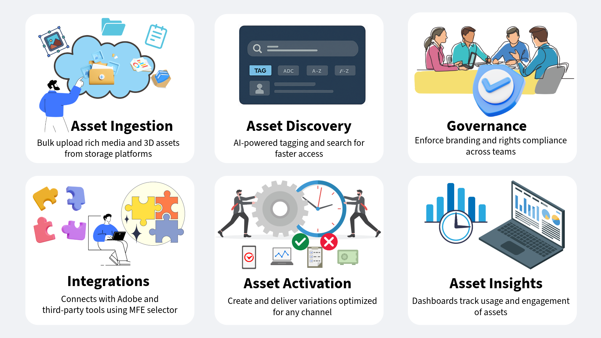

# Assets as a Cloud Service per la gestione delle risorse digitali in AEM {#assets-as-cloud-service-digital-asset-management-aem}

Adobe Experience Manager Assets as a Cloud Service offre una soluzione PaaS nativa per il cloud, che consente alle aziende di eseguire le operazioni di gestione delle risorse digitali e Dynamic Media in modo rapido ed efficace, ma anche di utilizzare funzionalità avanzate di nuova generazione, come AI/ML, dall’interno di un sistema sempre attuale, disponibile e in grado di apprendere.

Adobe offre una solida soluzione di gestione delle risorse digitali (DAM) che consente di ottenere il massimo dalle risorse digitali. Adobe Experience Manager Assets dispone di due esperienze separate che utilizzano lo stesso archivio Cloud Services per soddisfare le tue esigenze. Per informazioni sulle esperienze basate su utenti tipo per AEM Assets, consulta [Esperienze disponibili basate su utenti tipo per Digital Asset Management](#persona-based-experiences).

Per informazioni sulle offerte AEM Assets Ultimate e AEM Assets Prime, vedi [Assets as a Cloud Service Ultimate](/help/assets/assets-ultimate-overview.md) e [Assets as a Cloud Service Prime](/help/assets/assets-prime.md).

Alcune delle funzioni chiave di Gestione delle risorse digitali di Adobe includono:

>[!BEGINTABS]

>[!TAB Acquisizione risorse]

## Acquisizione delle risorse {#asset-ingestion}

Utilizza la funzione di importazione in blocco per importare un numero elevato di risorse direttamente da un’origine dati, ad esempio Azure, AWS, Google Cloud, Dropbox e OneDrive, in Assets as a Cloud Service.

È possibile eseguire l&#39;operazione di importazione in blocco utilizzando la vista Amministrazione o la vista Assets. La vista Assets offre più opzioni di origine dati rispetto alla vista Amministratore.

Oltre all’interfaccia utente del browser web, Experience Manager supporta altri client desktop. Inoltre, forniscono un’esperienza di caricamento senza dover passare al browser web.

* Adobe Asset Link consente di accedere alle risorse da Experience Manager nelle applicazioni desktop Adobe Photoshop, Adobe Illustrator e Adobe InDesign. Puoi caricare il documento attualmente aperto in Experience Manager direttamente dall’interfaccia utente di Adobe Asset Link, direttamente da queste applicazioni desktop.

* L’app desktop Experience Manager semplifica l’utilizzo delle risorse sul desktop, indipendentemente dal tipo di file o dall’applicazione nativa che le gestisce. È utile caricare i file nelle gerarchie di cartelle nidificate dal file system locale, in quanto il caricamento del browser supporta solo il caricamento di elenchi di file sequenziali.

Utilizza questi collegamenti per accedere alla documentazione dettagliata sui seguenti strumenti di inserimento risorse:

<table>
<td>
   
   

      <a href="/help/assets/bulk-import-assets-view.md">
      <strong>Usare lo strumento Importazione in blocco</strong>
      </a>
   

   

      <em>Scopri come importare numerose risorse direttamente da un'origine dati</em>
   

</td>

<td>
   
   

      <a href="https://experienceleague.adobe.com/it/docs/experience-manager-desktop-app/using/using">
      <strong>Utilizza l'app desktop AEM</strong>
      </a>
   

   

      <em>Scopri come utilizzare l'app desktop AEM per caricare file nelle gerarchie di cartelle nidificate dal file system locale.</em>
   

</td>
<td>
   
   

      <a href="https://helpx.adobe.com/it/enterprise/using/adobe-asset-link.html">
      <strong>Utilizza Adobe Asset Link</strong>
      </a>
   

   

      <em>Scopri come caricare le risorse in Experience Manager utilizzando le applicazioni Creative Cloud.</em>
   

</td>
</table>

>[!TAB Funzionalità basate sull&#39;intelligenza artificiale]

**Tag avanzati**: i tag avanzati utilizzano il framework artificialmente intelligente di Adobe Sensei per addestrare il relativo algoritmo di riconoscimento delle immagini in base alla struttura dei tag e alla tassonomia aziendale. Questa content intelligence viene quindi utilizzata per applicare tag rilevanti a un diverso set di risorse. Per impostazione predefinita, AEM applica automaticamente i tag avanzati alle risorse caricate.

**Assegnazione tag intelligente basata su colori e ricerca**: AEM Assets utilizza le funzionalità di intelligenza artificiale di Adobe Sensei per distinguere i colori in un&#39;immagine e applicarli automaticamente come tag al momento dell&#39;acquisizione. Questi tag consentono un’esperienza di ricerca avanzata, in base alla composizione cromatica dell’immagine.

**Metadati generati dall&#39;intelligenza artificiale**: AEM Assets utilizza l&#39;intelligenza artificiale per generare automaticamente i metadati, inclusi Titolo, Descrizione e Parole chiave. Questi campi generati dall’IA migliorano la precisione dei metadati, rendendo le risorse più facili da ricercare, classificare e consigliare. Questo approccio non solo migliora l’efficienza eliminando l’assegnazione tag manuale, ma garantisce anche coerenza e scalabilità su grandi volumi di contenuto digitale.

**Ridenominazione in blocco di risorse basate sull&#39;intelligenza artificiale**: [La visualizzazione Assets consente di rinominare più risorse contemporaneamente utilizzando l&#39;intelligenza artificiale](/help/assets/bulk-rename-assets-view.md). È possibile selezionare più file contemporaneamente e rinominarli tutti insieme. Alcuni dei prompt di ridenominazione di conversazione di esempio includono *Cambia tutti i file in &#39;my-file&#39; e aggiungi un numero incrementale* e *Aggiungi ai file il prefisso 001, 002, ecc. e tradurre in inglese*.

<table>
<td>
   
   

      <a href="/help/assets/smart-tags.md">
      <strong>Aggiungere tag avanzati di IA alle risorse</strong>
      </a>
   

   

      <em>Scopri come applicare automaticamente i tag avanzati alle risorse caricate.</em>
   

</td>

<td>
   
   

      <a href="/help/assets/manage-notifications-assets-view.md">
      <strong>Aggiungi tag intelligenti basati su colori</strong>
      </a>
   

   

      <em>Scopri come applicare automaticamente i tag basati su colori al momento dell’acquisizione.</em>
   

</td>
<td>
   
   

      <a href="/help/assets/metadata-assets-view.md">
      <strong>Metadati generati da IA</strong>
      </a>
   

   

      <em>Utilizza l'intelligenza artificiale per generare i metadati delle risorse, ad esempio Titolo e Descrizione. </em>
   

</td>
</table>

**Ricerca contestuale**: AEM Assets consente di cercare le risorse disponibili nell&#39;archivio definendo i prompt di testo. Experience Manager Assets trasforma automaticamente i prompt di testo in filtri di ricerca e visualizza i risultati della ricerca. È possibile visualizzare e modificare i filtri automatici utilizzando il riquadro Filtri per limitare ulteriormente i risultati della ricerca. Alcuni degli esempi di prompt di testo di conversazione includono *Immagini alte almeno 200 px e larghe almeno 100 px con spiaggia e cielo limpido* e *Ho bisogno di immagini di cielo blu che sono alte 1500 e 2500 pixel e create nel mese scorso che non sono scadute e sono approvate*.

**Genera risorse con Adobe Firefly in AEM**: AEM Assets ti consente di generare una risorsa se la query di ricerca non restituisce alcun risultato, utilizzando Adobe Firefly in tempo reale. AEM Assets consente inoltre di caricare l’immagine generata nell’archivio di AEM Assets dall’interfaccia utente di AEM Assets.

**Integrazione con Adobe Express**: AEM Assets si integra in modo nativo con Adobe Express, consentendo di accedere direttamente alle risorse memorizzate in AEM Assets dall&#39;interfaccia utente di Adobe Express. È inoltre possibile utilizzare l&#39;intelligenza artificiale di Adobe Firefly in Express per generare immagini utilizzando semplici prompt di testo e inserirle nell&#39;area di lavoro di Express. Puoi quindi salvare il contenuto nuovo o modificato in un archivio AEM Assets.

<table>
<td>
   
   

      <a href="/help/assets/search-assets-view.md#contextual-search">
      <strong>Ricerca contestuale</strong>
      </a>
   

   

      <em>Scopri come cercare le risorse utilizzando semplici prompt di testo.</em>
   

</td>

<td>
   
   

      <a href="/help/assets/search-assets-view.md#search-firefly">
      <strong>Genera risorse tramite Adobe Firefly</strong>
      </a>
   

   

      <em>Genera risorse in tempo reale utilizzando Adobe Firefly.</em>
   

</td>
<td>
   
   

      <a href="/help/assets/native-integration-adobe-express.md">
      <strong>Integrazione con Adobe Express</strong>
      </a>
   

   

      <em>Utilizza le funzionalità di intelligenza artificiale di Adobe Express nell'interfaccia utente di AEM Assets.</em>
   

</td>
</table>

**Smart Imaging**: Smart Imaging fornisce prestazioni di consegna delle risorse di immagine ancora migliori ottimizzando automaticamente il formato e le dimensioni del file di un&#39;immagine in base alla funzionalità del browser del cliente. Funziona con i predefiniti delle immagini esistenti e utilizza l&#39;intelligenza nella distribuzione. Questa tecnologia riduce ulteriormente le dimensioni dei file di immagine in base alla velocità del browser e della connessione di rete.

**Ritaglio avanzato**: funzionalità di intelligenza artificiale di Adobe Sensei per rilevare automaticamente il punto focale in qualsiasi immagine o video e ritagliarlo per mantenerlo. Acquisisce il punto di interesse desiderato indipendentemente dalle dimensioni dello schermo, eliminando così le attività manuali noiose e distribuendo immagini e video di alta qualità con caricamento rapido che risultano di ottima qualità su qualsiasi dispositivo o schermo.

**Sottotitoli video generati dall&#39;intelligenza artificiale**: i sottotitoli video generati dall&#39;intelligenza artificiale in Adobe Dynamic Media utilizzano l&#39;intelligenza artificiale per generare automaticamente i sottotitoli per i contenuti video. Questa funzione è stata progettata per migliorare l’accessibilità e l’esperienza utente fornendo didascalie accurate. I sottotitoli vengono generati dall&#39;audio originale, eventuali tracce audio aggiuntive o sottotitoli aggiuntivi vengono forniti nella scheda `Captions and Audio` della pagina delle proprietà video. Grazie al supporto di più di 60 lingue, le didascalie possono essere riviste e visualizzate in anteprima prima della pubblicazione del video.
<table>
<td>
   
   

      <a href="/help/assets/dynamic-media/imaging-faq.md">
      <strong>Imaging avanzato</strong>
      </a>
   

   

      <em>Ottimizzare il formato e le dimensioni del file di un'immagine in base alla capacità del browser e alla velocità di rete dell'utente.</em>
   

</td>

<td>
   
   

      <a href="https://experienceleague.adobe.com/en/docs/experience-manager-learn/assets/dynamic-media/images/smart-crop-feature-video-use.html">
      <strong>Ritaglio avanzato</strong>
      </a>
   

   

      <em>Utilizza l'intelligenza artificiale per rilevare automaticamente il punto focale in qualsiasi immagine o video e ritagliarlo per mantenerlo</em>
   

</td>
<td>
   
   

      <a href="/help/assets/dynamic-media/video.md">
      <strong>Sottotitoli video generati da IA</strong>
      </a>
   

   

      <em>Utilizza l'intelligenza artificiale per generare automaticamente i sottotitoli per i contenuti video. </em>
   

</td>
</table>

>[!TAB Individuazione risorse]

## Individuazione risorse {#asset-discovery}

Dopo aver importato le risorse in AEM Assets, è difficile trovare rapidamente quelle giuste da una raccolta così vasta.

AEM Assets offre funzioni che ti consentono di trovare la risorsa giusta in qualsiasi momento, ad esempio tag generati dall’intelligenza artificiale (smart tag), metadati personalizzati e funzionalità che migliorano l’esperienza di ricerca.

**Gestione metadati**: i metadati sono l&#39;aspetto più critico all&#39;avvio del percorso di gestione risorse. La gestione dei metadati sfugge completamente al controllo degli amministratori dopo che le risorse sono state distribuite agli utenti. I metadati delle risorse efficaci garantiscono una ricerca migliore, che è la destinazione finale di qualsiasi strumento DAM.

**Metadata Forms**: Assets as a Cloud Service fornisce molti campi di metadati standard per impostazione predefinita. Se hai esigenze di metadati aggiuntive e hai bisogno di più campi di metadati per aggiungere metadati specifici per l’azienda. I moduli di metadati consentono alle aziende di aggiungere campi di metadati personalizzati alla pagina Dettagli di una risorsa. I metadati specifici per l’azienda migliorano la governance e l’individuazione delle risorse. Puoi creare nuovi moduli o riutilizzare quelli esistenti.

<table>
<td>
   
   

      <a href="/help/assets/metadata-assets-view.md">
      <strong>Gestire i metadati nella visualizzazione Assets</strong>
      </a>
   

   

      <em>Scopri come gestire i metadati e i moduli di metadati utilizzando la visualizzazione Assets.</em>
   

</td>

<td>
   
   

      <a href="https://experienceleaguecommunities.adobe.com/t5/adobe-experience-manager-blogs/how-to-manage-metadata-before-and-after-migrating-to-aem-assets/ba-p/744298">
      <strong>Best practice per la gestione dei metadati</strong>
      </a>
   

   

      <em>Scopri come gestire i metadati prima e dopo la migrazione delle risorse in AEM.</em>
   

</td>
<td>
   
   

      <a href="/help/assets/manage-metadata.md">
      <strong>Gestione metadati in visualizzazione Amministratore</strong>
      </a>
   

   

      <em>Scopri come gestire i metadati e i moduli di metadati utilizzando la visualizzazione Amministratore.</em>
   

</td>
</table>

**Tag avanzati**: i tag avanzati utilizzano il framework artificialmente intelligente di Adobe Sensei per addestrare il relativo algoritmo di riconoscimento delle immagini in base alla struttura dei tag e alla tassonomia aziendale. Questa content intelligence viene quindi utilizzata per applicare tag rilevanti a un diverso set di risorse. Per impostazione predefinita, AEM applica automaticamente i tag avanzati alle risorse caricate.

**Cerca risorse**: una volta che hai i metadati corretti, AEM Assets ti consente di eseguire ricerche utilizzando vari operatori, caratteri jolly, query avanzate e filtri personalizzati.

**Ricerca contestuale**: AEM Assets fornisce anche la funzionalità di ricerca contestuale, che consente di cercare le risorse disponibili nell&#39;archivio definendo i prompt di testo. Experience Manager Assets trasforma automaticamente i prompt di testo in filtri di ricerca e visualizza i risultati della ricerca. È possibile visualizzare e modificare i filtri automatici utilizzando il riquadro Filtri per limitare ulteriormente i risultati della ricerca.

<table>
<td>
   
   

      <a href="/help/assets/smart-tags.md">
      <strong>Aggiungi tag avanzati alle risorse</strong>
      </a>
   

   

      <em>Scopri come applicare automaticamente i tag avanzati alle risorse caricate.</em>
   

</td>

<td>
   
   

      <a href="/help/assets/search-assets-view.md">
      <strong>Cercare risorse nella visualizzazione Assets</strong>
      </a>
   

   

      <em>Scopri come utilizzare in modo efficace la ricerca contestuale e altre funzionalità di ricerca nella visualizzazione Assets.</em>
   

</td>
<td>
   
   

      <a href="/help/assets/search-best-practices.md">
      <strong>Best practice per la ricerca</strong>
      </a>
   

   

      <em>Descrive vari scenari per aiutare gli utenti di AEM a eseguire ricerche di livello da semplice a avanzato.</em>
   

</td>
</table>

>[!TAB Governance delle risorse]

## Gestione e governance degli asset {#asset-management-governance}

Dopo aver caricato le risorse in AEM Assets e averne impostato i metadati per una migliore individuabilità, puoi eseguire varie attività di gestione delle risorse digitali utilizzando l’interfaccia intuitiva di Assets view.

**Attività di gestione risorse**: alcune delle attività di base includono operazioni di ricerca, download, spostamento, copia, ridenominazione, eliminazione, aggiornamento e modifica.

Puoi anche gestire le versioni delle risorse, impostare lo stato e impostare la scadenza delle risorse.

**Il mio Workspace**: la vista Assets include anche un&#39;area di lavoro personalizzabile che fornisce widget per accedere agevolmente ad aree chiave dell&#39;interfaccia utente di Assets e alle informazioni più rilevanti per l&#39;utente. Questa pagina funge da soluzione unica per fornire una panoramica degli elementi di lavoro e consentire un accesso rapido ai flussi di lavoro chiave.

**Content Credentials**: un&#39;altra potente funzionalità supportata da AEM Assets è Content Credentials. I brand si preoccupano più che mai della trasparenza dei contenuti, della divulgazione dell’intelligenza artificiale e della prevenzione della manomissione delle risorse. Content Authenticity Initiative (CAI) di Adobe crea strumenti conformi allo standard tecnico Coalition for Content Provenance and Authenticity (C2PA). Content Credentials, un nuovo tipo di metadati crittografati e in grado di evidenziare eventuali manomissioni, consente agli utenti di comprendere la linea di contenuti e garantire l&#39;integrità delle risorse del marchio. Possono includere un’ampia gamma di dati sulla provenienza che offrono ad insight la storia di una risorsa digitale.

<table>
<td>
   
   

      <a href="/help/assets/manage-organize-assets-view.md">
      <strong>Attività di gestione risorse</strong>
      </a>
   

   

      <em>Scopri come eseguire alcune attività di gestione risorse di base e avanzate.</em>
   

</td>

<td>
   
   

      <a href="/help/assets/my-workspace-assets-view.md">
      <strong>Il mio Workspace</strong>
      </a>
   

   

      <em>Scopri come utilizzare My Workspace per accedere rapidamente alle aree chiave dell'interfaccia utente di Assets.</em>
   

</td>
<td>
   
   

      <a href="/help/assets/content-credentials.md">
      <strong>Content Credentials</strong>
      </a>
   

   

      <em>Ottieni informazioni sulla cronologia di una risorsa digitale utilizzando Content Credentials.</em>
   

</td>
</table>

**Raccolte**: AEM Assets consente inoltre di organizzare le risorse in raccolte. Una raccolta è un insieme di risorse, cartelle o altre raccolte nella vista Adobe Experience Manager Assets. Puoi utilizzare le raccolte per condividere le risorse tra i vari utenti. A differenza delle cartelle, una raccolta può includere risorse da posizioni diverse. Puoi condividere più raccolte con un utente. Ogni raccolta contiene riferimenti alle risorse. L’integrità dei riferimenti alle risorse viene mantenuta tra le varie raccolte.

**Notifiche**: le notifiche di visualizzazione di Assets consentono di monitorare le operazioni eseguite sulle risorse, cartelle o raccolte disponibili nell&#39;archivio. Devi selezionare e iscriverti al contenuto per il quale ti vengono inviate le notifiche. Puoi anche configurare le categorie per le quali vengono inviate le notifiche.

**Rileva risorse duplicate**: AEM Assets supporta anche il rilevamento di risorse duplicate. Se un utente DAM carica una o più risorse già esistenti nell’archivio, Experience Manager rileva la duplicazione e ne informa l’utente.

<table>
<td>
   
   

      <a href="/help/assets/manage-collections-assets-view.md">
      <strong>Gestisci raccolte</strong>
      </a>
   

   

      <em>Scopri come organizzare le risorse in raccolte per condividerle in modo efficiente.</em>
   

</td>

<td>
   
   

      <a href="/help/assets/manage-notifications-assets-view.md">
      <strong>Imposta notifiche</strong>
      </a>
   

   

      <em>Scopri come impostare le notifiche per monitorare le operazioni eseguite su risorse, cartelle o raccolte.</em>
   

</td>
<td>
   
   

      <a href="/help/assets/detect-duplicate-assets.md">
      <strong>Rileva risorse duplicate</strong>
      </a>
   

   

      <em>Rileva risorse duplicate caricate in AEM Assets e invia una notifica agli utenti.</em>
   

</td>
</table>

>[!TAB Integrazioni]

## Integrazione con applicazioni Adobe e non Adobe {#integration-adobe-non-adode-apps}

AEM Assets può integrarsi perfettamente con varie applicazioni Adobe e non Adobe. Di seguito è riportata una visualizzazione riepilogativa delle integrazioni disponibili:

+++**Integrazione con applicazioni Adobe e non Adobe**

* **Dynamic Media con funzionalità OpenAPI**: [Dynamic Media con funzionalità OpenAPI](/help/assets/dynamic-media-open-apis-overview.md) offre un set completo di API [search](/help/assets/search-assets-api.md) e [delivery](/help/assets/deliver-assets-apis.md). Consente agli sviluppatori di integrare facilmente la distribuzione delle risorse con le loro applicazioni. Le applicazioni includono sia quelle di Adobe che quelle di terze parti. Fornisce un’interfaccia utente per il selettore delle risorse Micro Frontend per cercare e selezionare le risorse approvate. Il selettore può essere integrato facilmente con qualsiasi applicazione basata su framework JavaScript come React JS, Angular JS e Vanilla JS.

* **Selettore risorse micro-front-end**: il selettore risorse micro-front-end fornisce un&#39;interfaccia utente che si integra facilmente con l&#39;archivio di Experience Manager Assets in modo che sia possibile sfogliare o cercare le risorse digitali disponibili nell&#39;archivio e utilizzarle nell&#39;esperienza di authoring dell&#39;applicazione.
È possibile integrare Asset Selector con un’applicazione Adobe o non Adobe.

<table>
<td>
   
   

      <a href="/help/assets/dynamic-media-open-apis-overview.md">
      <strong>Panoramica delle funzionalità di Dynamic Media con OpenAPI</strong>
      </a>
   

   

      <em>Scopri i vantaggi principali e come abilitarli. </em>
   

</td>

<td>
   
   

      <a href="/help/assets/restrict-assets-delivery.md"> <strong>Limitare l’accesso alle risorse in Experience Manager</strong> </a>
   

   

      <em> Configura i ruoli per limitare l'accesso alle risorse approvate.</em>
   

</td>
<td>
   
   

      <a href="/help/assets/overview-asset-selector.md">
      <strong>Selettore risorse micro-front-end</strong>
      </a>
   

   

      <em>Scopri come integrare Micro-Frontend Asset Selector con un'applicazione Adobe o non Adobe.</em>
   

</td>
</table>

+++

+++**Integrazione nativa con le applicazioni Adobe**

* **Integrazione con Adobe Workfront**: [!DNL Adobe Workfront] è un&#39;applicazione per la gestione dell&#39;intero ciclo di vita del lavoro in un&#39;unica posizione. L&#39;integrazione tra [!DNL Workfront] e [!DNL Adobe Experience Manager Assets] consente alle organizzazioni di velocizzare le attività relative ai contenuti e il time-to-market, grazie a un collegamento intrinseco tra il lavoro e la gestione delle risorse digitali. Nel contesto della gestione del proprio lavoro in Workfront, gli utenti possono accedere ai documenti e alle immagini richiesti.

  Le offerte Adobe per [integrare [!DNL Workfront] e [!DNL Adobe Experience Manager Assets] in modo nativo](https://experienceleague.adobe.com/docs/workfront/using/documents/wf-aem-integrations/wf-aem-essentials/aem-asset-integrations.html?lang=it).

* **Integrazione con Figma**: AEM Assets si integra in modo nativo con Figma, consentendo ai designer di accedere direttamente alle risorse memorizzate in AEM Assets dall&#39;interfaccia utente Figma. Puoi posizionare il contenuto gestito in AEM Assets nell’area di lavoro di Figma e quindi salvare il nuovo o quello modificato in un archivio AEM Assets. Per accedere al connettore AEM Assets disponibile nella pagina della community di Figma, fai clic [qui](https://www.figma.com/community/plugin/1512561378275712210/adobe-experience-manager-aem-assets-connector).

* **Integrazione nativa con Adobe Express**: AEM Assets si integra in modo nativo con Adobe Express, che consente di accedere direttamente alle risorse memorizzate in AEM Assets dall&#39;interfaccia utente di Adobe Express. Il contenuto gestito in AEM Assets può essere inserito nell’area di lavoro di Express e il contenuto nuovo o modificato salvato in un archivio AEM Assets.

* **Connetti AEM Assets a Creative Cloud**: Experience Manager Assets può connettersi a un diritto Creative Cloud fornito a un&#39;altra organizzazione IMS per utilizzare facilmente le più recenti integrazioni Creative Cloud in AEM Assets, inclusi Express e Creative Cloud Libraries. Se per i prodotti Creative Cloud e AEM Assets è stato eseguito il provisioning per organizzazioni IMS separate, è possibile connettersi a un’organizzazione Creative Cloud diversa per eseguire flussi di lavoro integrati tra le due soluzioni.

<table>
<td>
   
   

      <a href="/help/assets/workfront-integrations.md">
      <strong>Integrazione con Adobe Workfront</strong>
      </a>
   

   

      <em>Integrare con Adobe Workfront per gestire l'intero ciclo di vita del lavoro in un'unica posizione.</em>
   

</td>
<td>
   
   

      <a href="/help/assets/manage-collections-assets-view.md">
      <strong>Integrazione con Figma</strong>
      </a>
   

   

      <em>Accedi alle risorse archiviate in AEM Assets dall'interfaccia utente Figma</em>
   

</td>
<td>
   
   

      <a href="/help/assets/native-integration-adobe-express.md">
      <strong>Integrazione nativa con Adobe Express</strong>
      </a>
   

   

      <em>Posiziona le risorse disponibili in AEM Assets nell'area di lavoro di Express e salva le risorse aggiornate in AEM. </em>
   

</td>

</table>

* **Integrazione con Adobe Journey Optimizer**: unisci flussi di lavoro di marketing e creativi tramite Adobe Experience Manager Assets. Integrato in modalità nativa con Adobe Journey Optimizer, accedi ad Assets as a Cloud Service per archiviare, gestire, individuare e distribuire risorse digitali. Fornisce un archivio di risorse unico e centralizzato da utilizzare per compilare i messaggi.

* **Integrazione con Commerce**: l&#39;integrazione di Adobe Experience Manager (AEM) Assets per Commerce combina le solide funzionalità di AEM as a Digital Asset Management (DAM) con Adobe Commerce per migliorare le esperienze di eCommerce. Queste funzionalità vengono fornite collegando i progetti Commerce al potente ambiente di gestione delle risorse di AEM per fornire un modo semplice, scalabile ed efficiente di gestire e distribuire le risorse tra i vari store commerce.
* **Integrazione di AEM Assets con i flussi di authoring basati su documenti per Edge Delivery Services**: quando [!DNL AEM Assets] si integra con gli strumenti di authoring basati su documenti, ad esempio [!DNL Microsoft Word] o [!DNL Google Docs], fornisce un selettore di risorse nello strumento di authoring. Utilizza questo selettore risorse per accedere a [!DNL AEM Assets] e inserire nel contenuto le risorse approvate.
Se disponi già di un sito Web [!DNL Edge Delivery Services], consulta la documentazione del [[!DNL AEM Assets] plugin](https://github.com/adobe-rnd/aem-assets-plugin/blob/main/README.md) per scoprire come integrare [!DNL AEM Assets] con il progetto [!DNL AEM] esistente.

* **Integrazione di [!DNL AEM Assets] con flussi di authoring basati su [!DNL Universal Editor] per[!DNL Edge Delivery Services]**: configurare [!DNL Universal Editor] per l&#39;integrazione con [!DNL AEM Assets]. Questa integrazione consente di utilizzare [!DNL Dynamic Media with OpenAPI capabilities] per distribuire le risorse.

   * Consulta [Configurazione in [!DNL Edge Delivery] Sito](https://developer.adobe.com/uix/docs/extension-manager/extension-developed-by-adobe/configurable-asset-picker/#configuration-in-edge-delivery-site) per scoprire come aggiungere una funzione di selezione risorse personalizzata in [!DNL Universal Editor]. Il selettore risorse personalizzato consente di inserire direttamente le risorse nel contenuto di [!DNL Universal Editor].
   * Per informazioni su come accedere a [ e inserire le risorse durante la creazione in ](https://developer.adobe.com/uix/docs/extension-manager/extension-developed-by-adobe/configurable-asset-picker/#extension-overview), consulta la [!DNL AEM Assets]Panoramica dell&#39;estensione[!DNL Universal Editor].

<table>
<td>
   
   

      <a href="https://experienceleague.adobe.com/it/docs/journey-optimizer/using/content-management/combine/assets">
      <strong>Integrazione con Adobe Journey Optimizer</strong>
      </a>
   

   

      <em>Unisci flussi di lavoro di marketing e creativi tramite l'integrazione con AJO</em>
   

</td>
<td>
   
   

      <a href="https://experienceleague.adobe.com/it/docs/commerce-admin/content-design/aem-asset-management/aem-assets-integration">
      <strong>Integrazione con Commerce</strong>
      </a>
   

   

      <em>Integra AEM Assets con Commerce per migliorare le esperienze di eCommerce.</em>
   

</td>
<td>
   
   

      <a href="/help/assets/integrate-aem-assets-edge-delivery-services.md">
      <strong>Integrare AEM Assets con EDS</strong>
      </a>
   

   

      <em>Integrare AEM Assets con flussi di authoring basati su documenti e su Universal Editor.</em>
   

</td>
</table>

+++

>[!TAB Attivazione risorsa]

## Attivazione risorsa {#asset-activation}

Sfrutta appieno il potenziale delle risorse digitali con AEM Assets utilizzando Content Hub per Dynamic Media, incluse le potenti funzionalità OpenAPI. AEM Assets offre una suite completa di soluzioni progettate per semplificare la trasformazione delle risorse e ottimizzare la distribuzione su vari canali.

+++**Hub di contenuti**

Content Hub è disponibile come parte di Experience Manager Assets as a Cloud Service per rendere i contenuti in linea con il brand accessibili nella propria organizzazione e ai rispettivi partner commerciali. Si concentra sulla distribuzione delle risorse per l’attivazione su larga scala e la creazione di varianti di contenuti fedeli alle linee guida del brand, per una maggiore marketing agility.

Content Hub offre i seguenti vantaggi principali:

* **Trova e condividi tutte le risorse approvate dal marchio disponibili in un portale intuitivo**: AEM Assets funge da unica fonte di verità e tutte le risorse approvate sono automaticamente disponibili in Content Hub in una gerarchia semplice per migliorare l&#39;esperienza di ricerca.

* **Interfaccia utente configurabile**: le proprietà più comuni in Content Hub, ad esempio i filtri per la ricerca, i campi disponibili durante l&#39;aggiunta o l&#39;importazione di risorse, le proprietà delle risorse, il contenuto del banner per il branding, sono configurabili e un amministratore può facilmente configurare l&#39;interfaccia utente di Content Hub in base alle proprie esigenze.

* **Consenti agli utenti non creativi di modificare e mixare i contenuti restando nel brand**: Content Hub ti consente di creare nuovi contenuti con Adobe Express (se disponi di adesioni Adobe Express). Puoi modificare i contenuti esistenti con strumenti facili da usare, produrre varianti on-brand con modelli ed elementi del brand e creare nuovi contenuti con le più recenti funzionalità GenAI di Adobe Firefly.

* **Ottieni informazioni sull&#39;utilizzo dei contenuti tra i team**: [!DNL Content Hub] fornisce informazioni utili sulle risorse, affrontando una sfida comune che spesso interessa le parti interessate del marketing: le statistiche sull&#39;utilizzo delle risorse utilizzate nelle campagne di marketing, nei canali e in diverse aree geografiche. Acquisendo dati che consentono di comprendere chiaramente le prestazioni e la popolarità delle risorse, fornisce informazioni fruibili essenziali per migliorare l’esperienza utente.

<table>
<td>
   
   

      <a href="/help/assets/product-overview.md">
      <strong>Panoramica di Content Hub</strong>
      </a>
   

   

      <em>Ulteriori informazioni su Content Hub, sui suoi vantaggi chiave e su come accedervi. </em>
   

</td>

<td>
   
   

      <a href="/help/assets/configure-content-hub-ui-options.md">
      <strong>Configura interfaccia utente di Content Hub</strong>
      </a>
   

   

      <em>Scopri come configurare le opzioni disponibili nell'interfaccia utente di Content Hub .</em>
   

</td>
<td>
   
   

      <a href="/help/assets/edit-images-content-hub.md">
      <strong>Modifica con Adobe Express</strong>
      </a>
   

   

      <em>Scopri come modificare le immagini in Content Hub utilizzando Adobe Express.</em>
   

</td>
</table>

+++

+++**Dynamic Media**

Dynamic Media ti consente di fornire risorse visive avanzate di merchandising e marketing on-demand. Consente inoltre di creare e distribuire esperienze di visualizzazione interattive, tra cui zoom, 360 gradi in rotazione e video. Le risorse vengono scalate in modo dinamico per l’utilizzo su siti web, mobili e social network. Utilizzando un set di risorse di origine primarie, come immagini, video e 3D, Dynamic Media genera e distribuisce più varianti di questo rich content in tempo reale attraverso la sua rete CDN (Content Delivery Network) globale, scalabile e ottimizzata per le prestazioni.

Dynamic Media offre le seguenti funzionalità principali:

* **Smart Imaging**: Smart Imaging fornisce prestazioni di consegna delle risorse di immagine ancora migliori ottimizzando automaticamente il formato e le dimensioni del file di un&#39;immagine in base alla funzionalità del browser del cliente. Funziona con i predefiniti delle immagini esistenti e utilizza l&#39;intelligenza nella distribuzione. Questa tecnologia riduce ulteriormente le dimensioni dei file di immagine in base alla velocità del browser e della connessione di rete.

* **Set di video adattivi**: un set di video adattivi raggruppa le versioni dello stesso video che sono codificate in velocità bit e formati diversi. Inizia con il tuo video originale principale, che carichi nel sistema. Dynamic Media ridimensiona automaticamente, o transcodifica, tale video in più video. Quindi, al momento della consegna, determina in modo intelligente quale schermo video, quale qualità e quale formato utilizzare e lo distribuisce al telefono, al tablet o al computer desktop.

* **Ritaglio avanzato**: funzionalità di intelligenza artificiale di Adobe Sensei per rilevare automaticamente il punto focale in qualsiasi immagine o video e ritagliarlo per mantenerlo. Acquisisce il punto di interesse desiderato indipendentemente dalle dimensioni dello schermo, eliminando così le attività manuali noiose e distribuendo immagini e video di alta qualità con caricamento rapido che risultano di ottima qualità su qualsiasi dispositivo o schermo.

* **Modelli Dynamic Media**: crea modelli personalizzabili in tempo reale per i banner e i volantini utilizzando i modelli Dynamic Media, un editor di modelli WYSIWYG. Pubblica il modello Dynamic Media e utilizzalo nelle applicazioni a valle. Un modello Dynamic Media include livelli di immagine e testo. Aggiungi parametri ai livelli immagine e testo del modello e utilizza gli URL Dynamic Media per riposizionare e ridimensionare il livello e aggiornarne il contenuto in tempo reale.

* **Audio multiplo e didascalia**: aggiungi più didascalie e tracce audio a un video principale. Grazie a questa funzionalità, i video sono accessibili a un pubblico globale. È possibile personalizzare un singolo video principale pubblicato per un pubblico globale in più lingue e rispettare le linee guida sull’accessibilità per diverse aree geografiche. Gli autori possono gestire anche le didascalie e le tracce audio da una singola scheda nell’interfaccia utente.

* **Supporto di Dynamic Adaptive Streaming over HTTP (DASH)**: Dynamic Media supporta lo streaming adattivo nella distribuzione di video Dynamic Media (con CMAF abilitato), che garantisce una migliore esperienza di visualizzazione degli utenti per i video. DASH è il protocollo standard internazionale per lo streaming video adattivo ed è ampiamente adottato nel settore.

* **Sottotitoli video generati dall&#39;intelligenza artificiale**: i sottotitoli video generati dall&#39;intelligenza artificiale in Adobe Dynamic Media utilizzano l&#39;intelligenza artificiale per generare automaticamente i sottotitoli per i contenuti video. Grazie al supporto di più di 60 lingue, le didascalie possono essere riviste e visualizzate in anteprima prima della pubblicazione del video.

Per informazioni sulle offerte Dynamic Media disponibili, vedi [Dynamic Media Prime e Ultimate](/help/assets/dynamic-media/dm-prime-ultimate.md).

<table>
<td>
   
   

      <a href="/help/assets/dynamic-media/dynamic-media.md">
      <strong>Utilizzare Dynamic Media</strong>
      </a>
   

   

      <em>Scopri come distribuire risorse da utilizzare su siti Web, mobili e social network. </em>
   

</td>

<td>
   
   

      <a href="/help/assets/dynamic-media/dm-journey-part1.md">
      <strong>Percorso Dynamic Media</strong>
      </a>
   

   

      <em>Scopri in che modo Dynamic Media apporta valore al tuo lavoro.</em>
   

</td>
<td>
   
   

      <a href="/help/assets/dynamic-media/dm-best-practices.md">
      <strong>Best practice per Dynamic Media</strong>
      </a>
   

   

      <em>Best practice per immagini, video e visualizzatori.</em>
   

</td>
</table>

+++

+++**Dynamic Media con funzionalità OpenAPI**

Nel mondo digitale odierno in rapida evoluzione, è fondamentale sfruttare appieno il potenziale delle risorse digitali del tuo brand per battere la concorrenza. Una soluzione DAM (Digital Assets Management) olistica facilita la governance delle risorse, promuove la coerenza del brand e accelera la distribuzione dei contenuti, garantendo al contempo l’integrità del brand ed esperienze cliente eccezionali.

Dynamic Media con funzionalità OpenAPI pone DAM al centro di un ecosistema agile ed efficiente della catena di fornitura dei contenuti per garantire la governance e la distribuzione delle risorse.

Dynamic Media con funzionalità OpenAPI offre i seguenti vantaggi chiave:

* **Integrazioni dirette**: Dynamic Media con funzionalità OpenAPI offre un set completo di API di ricerca e consegna. Consente agli sviluppatori di [integrare facilmente la consegna delle risorse con le applicazioni](/help/assets/integrate-dynamic-media-open-apis.md). Le applicazioni includono sia quelle di Adobe che quelle di terze parti. Fornisce un’[interfaccia utente del selettore delle risorse di micro front-end](/help/assets/overview-asset-selector.md) per cercare e selezionare le risorse approvate. Il selettore può essere integrato facilmente con qualsiasi applicazione basata su framework JavaScript come React JS, Angular JS e Vanilla JS.

* **Gestione centralizzata delle risorse digitali**: DAM è l’unica fonte di verità per tutte le risorse digitali. Le risorse digitali vengono gestite centralmente in AEM Assets e distribuite alle applicazioni di consumo mediante riferimento utilizzando gli URL di consegna, senza copiare i file binari delle risorse.

* **Aggiornamenti in tempo reale**: qualsiasi modifica apportata alle risorse approvate in DAM, inclusi gli aggiornamenti della versione e le modifiche ai metadati, viene automaticamente riportata negli URL di consegna. Con un valore TTL (Time-to-Live) breve di 10 minuti configurato per Dynamic Media con funzionalità OpenAPI tramite CDN, gli aggiornamenti diventano visibili in meno di 10 minuti su tutte le interfacce di authoring e pubblicazione.

* **Coerenza del brand**: solo le [risorse approvate dal brand](/help/assets/approve-assets.md) sono esposte alle applicazioni a valle. [I responsabili del brand e i marketer mantengono uno stretto controllo sulle risorse del brand](/help/assets/restrict-assets-delivery.md). È disponibile per l’uso solo la versione approvata e più recente della risorsa, che garantisce la coerenza del brand su tutti i canali e le applicazioni.

* **Consegna ottimizzata per il web**: le risorse digitali vengono consegnate in formati ottimizzati per il web in modo da migliorare i web vitals di base delle esperienze digitali. Ciò include il supporto per le rappresentazioni WebP per le immagini, lo streaming adattivo tramite protocolli HLS o DASH per i video e le rappresentazioni originali per i documenti.

* **Trasformazione dinamica delle risorse**: il sistema consente la trasformazione immediata delle immagini utilizzando i parametri URL noti come modificatori di immagini. [Ad esempio, larghezza, altezza, rotazione, capovolgimento, qualità, ritaglio, formato e ritaglio avanzato](/help/assets/deliver-assets-apis.md). Le rappresentazioni trasformate vengono generate dinamicamente e consegnate senza problemi tramite la rete CDN.

* **Consegna sicura delle risorse**: Dynamic Media con funzionalità OpenAPI offre un meccanismo per controllare l’accesso alle risorse digitali. Puoi specificare ruoli o gruppi di utenti come metadati per le risorse da proteggere e impostare un intervallo di tempo predefinito durante il quale [solo gli utenti autorizzati possono accedere a tali risorse](/help/assets/restrict-assets-delivery.md). Gli URL di consegna per le risorse protette non vengono risolti per gli utenti non autorizzati durante il periodo limitato.

Per informazioni sulle offerte Dynamic Media disponibili, vedi [Dynamic Media Prime e Ultimate](/help/assets/dynamic-media/dm-prime-ultimate.md).

<table>
<td>
   
   

      <a href="/help/assets/dynamic-media-open-apis-overview.md">
      <strong>Panoramica delle funzionalità di Dynamic Media con OpenAPI</strong>
      </a>
   

   

      <em>Scopri i vantaggi principali e come abilitarli. </em>
   

</td>

<td>
   
   

      <a href="/help/assets/restrict-assets-delivery.md"> <strong>Limitare l’accesso alle risorse in Experience Manager</strong> </a>
   

   

      <em> Configura i ruoli per limitare l'accesso alle risorse approvate.</em>
   

</td>
<td>
   
   

      <a href="/help/assets/integrate-remote-approved-assets-with-sites.md"> <strong>Integrare AEM Assets remoto con AEM Sites</strong> </a>
   

   

      <em>Integrare AEM Assets remoto con l'ambiente AEM Sites. </em>
   

</td>
</table>

+++

>[!TAB Insight]

## Informazioni sulla risorsa {#asset-insights}

Il reporting delle risorse offre agli amministratori visibilità sulle attività dell’ambiente Adobe Experience Manager Assets View. Questi dati forniscono informazioni utili su come gli utenti interagiscono con i contenuti e il prodotto. Tutti gli utenti possono accedere alla dashboard Insight e quelli assegnati al profilo di prodotto Amministratori possono creare rapporti definiti dall’utente.

Puoi generare vari tipi di rapporti, ad esempio Caricamento, Download e Consegna Dynamic Media.

* **Informazioni nella visualizzazione Assets**: la visualizzazione Assets consente di visualizzare i dati in tempo reale per l&#39;ambiente di visualizzazione Assets con la dashboard Approfondimenti. Puoi visualizzare le metriche degli eventi in tempo reale negli ultimi 30 giorni o 12 mesi. Gli eventi includono Download, Caricamenti, Utilizzo archiviazione, Ricerche principali, Numero di risorse per dimensione e Numero di risorse per tipo di risorsa.

* **Integrazione di Adobe Analytics in Admin View**: la funzionalità Assets Insights consente di monitorare le valutazioni degli utenti e le statistiche di utilizzo delle immagini utilizzate nei siti web di terze parti, nelle campagne di marketing e nelle soluzioni creative di Adobe. Consente di fornire informazioni approfondite sulle prestazioni e sulla popolarità delle immagini. Assets Insights acquisisce i dettagli dell’attività dell’utente, ad esempio il numero di volte in cui un’immagine viene valutata, cliccata e impression (numero di volte in cui un’immagine viene caricata sul sito web). Assegna punteggi alle immagini in base a queste statistiche. Puoi utilizzare i punteggi e le statistiche sulle prestazioni per selezionare le immagini più comuni da includere in cataloghi, campagne di marketing e così via. È inoltre possibile formulare criteri di archiviazione e rinnovo delle licenze in base a tali statistiche. Per consentire a Assets Insights di visualizzare le statistiche di utilizzo delle risorse, configura innanzitutto la funzione per recuperare i dati di reporting da Adobe Analytics.

* **Informazioni su Content Hub**: Content Hub fornisce informazioni utili sulle risorse, affrontando una sfida comune che spesso interessa le parti interessate al marketing: le statistiche di utilizzo delle risorse utilizzate nelle campagne di marketing, nei canali e in diverse aree geografiche. Acquisendo dati che consentono di comprendere chiaramente le prestazioni e la popolarità delle risorse, fornisce informazioni fruibili essenziali per migliorare l’esperienza utente.

<table>
<td>
   
   

      <a href="/help/assets/manage-reports-assets-view.md">
      <strong>Gestire i report nella visualizzazione Assets</strong>
      </a>
   

   

      <em>Deriva informazioni approfondite sulle metriche di successo chiave utilizzando la vista Assets. </em>
   

</td>

<td>
   
   

      <a href="/help/assets/asset-reports.md">
      <strong>Gestire i report nella visualizzazione Amministratore</strong>
      </a>
   

   

      <em>Scopri come gestire i report integrati di Adobe Analytics in Admin View.</em>
   

</td>
<td>
   
   

      <a href="/help/assets/insights-content-hub.md">
      <strong>Informazioni su Assets in Content Hub</strong>
      </a>
   

   

      <em>Scopri come visualizzare informazioni approfondite sulle risorse in Content Hub.</em>
   

</td>
</table>

>[!ENDTABS]

## Esperienze disponibili basate su utenti tipo per Digital Asset Management {#persona-based-experiences}

Adobe offre una solida soluzione di gestione delle risorse digitali (DAM) che consente di ottenere il massimo dalle risorse digitali. Adobe Experience Manager Assets dispone di due esperienze separate che utilizzano lo stesso archivio Cloud Services:

* **Vista Amministratore**: l’interfaccia utente esistente di Assets as a Cloud Service. Utilizza la vista Amministratore per tutte le funzionalità avanzate di Digital Assset Management, tra cui integrazioni, flussi di lavoro, automazione dei contenuti, pubblicazione e altro ancora.

* **Vista Risorse**: esperienza Adobe leggera di gestione delle risorse per archiviare, gestire, scoprire e utilizzare le risorse digitali. Interfaccia utente semplificata con funzionalità essenziali per Digital Asset Management. Progettata per gli utenti di DAM leggeri con particolare attenzione al caricamento, alla gestione dei metadati, alla ricerca, al download e alla condivisione.

Gli utenti con accesso alla vista Amministratore possono accedere anche alla vista Risorse. L’interfaccia utente semplificata di vista Risorse agevola la gestione, l’individuazione e la distribuzione delle risorse digitali. Un ampio insieme di utenti con diverse funzioni, compresi i team creativi, di marketing e line-of-business, possono collaborare alle risorse e accedere alle risorse approvate, quando e dove ne hanno bisogno. Molti utenti di DAM occasionali preferiscono la vista Risorse perché contiene solo un sottoinsieme di funzioni. L’esperienza è destinata ai creativi, a chi utilizza le risorse di sola lettura e agli utenti di DAM più leggeri.

Librerie, sviluppatori e utenti con privilegi avanzati DAM possono continuare a utilizzare la vista Amministratore o passare da un’interfaccia utente all’altra, in base alle esigenze. Puoi selezionare l’esperienza che funziona meglio per il tuo ruolo.

Per informazioni su come accedere alla vista Risorse e su alcune delle semplificazioni offerte rispetto alla vista Amministratore, consulta [Introduzione alla vista Risorse](/help/assets/assets-view-introduction.md).
