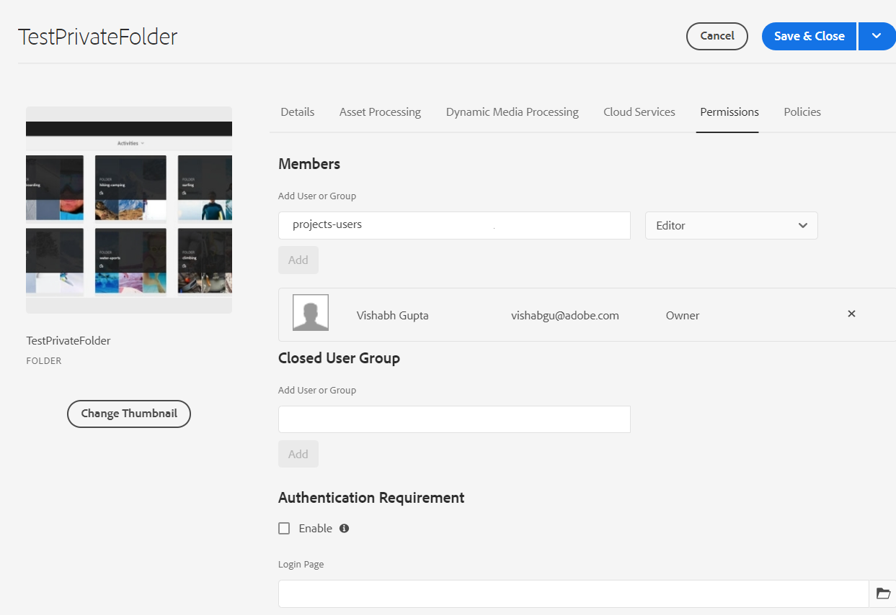

# Cartella privata in [!DNL Adobe Experience Manager Assets] {#private-folder}

| Versione | Collegamento articolo |
| -------- | ---------------------------- |
| AEM 6.5 | [Fai clic qui](https://experienceleague.adobe.com/docs/experience-manager-65/assets/managing/private-folder.html?lang=en) |
| AEM as a Cloud Service | Questo articolo |

Nell&#39;interfaccia utente di [!DNL Adobe Experience Manager Assets] è possibile creare una cartella privata disponibile esclusivamente per l&#39;utente. Puoi condividere questa cartella privata con altri utenti e assegnare loro vari privilegi. In base al livello di privilegio assegnato, gli utenti possono eseguire varie attività sulla cartella, ad esempio visualizzare le risorse all’interno della cartella o modificarle.

>[!NOTE]
>
>La cartella privata ha almeno un membro con il ruolo Proprietario.
>
>Per creare una cartella privata, sono necessarie le autorizzazioni `Read` e `Modify` per la cartella principale in cui si crea una cartella privata. Se non si è un amministratore, queste autorizzazioni non sono abilitate per impostazione predefinita su `/content/dam`. In questo caso, prima di creare cartelle private, è necessario ottenere queste autorizzazioni per l&#39;ID utente o il gruppo.

## Creare e condividere una cartella privata  {#create-share-private-folder}

Per creare e condividere una cartella privata:

1. Nella console [!DNL Assets] fare clic sul pulsante **[!UICONTROL Crea]** nella barra degli strumenti e quindi selezionare **[!UICONTROL Cartella]** dal menu.

   

1. Nella finestra di dialogo **[!UICONTROL Crea cartella]**, immettere `Title` e `Name` (facoltativo) per la cartella.

   Selezionare la casella di controllo **[!UICONTROL Privato]** e fare clic su **[!UICONTROL Crea]**.

   

   Viene creata una cartella privata. Ora puoi [aggiungere risorse](add-assets.md#upload-assets) alla cartella e condividerla con altri utenti o gruppi. La cartella non è visibile a nessun altro utente finché non la condividi e non gli assegni i privilegi necessari.

1. Per condividere la cartella, selezionarla e fare clic su **[!UICONTROL Proprietà]** nella barra degli strumenti.

1. Nella pagina **[!UICONTROL Proprietà cartella]**, seleziona un utente o un gruppo dall&#39;elenco **[!UICONTROL Aggiungi utente]**, assegna una mansione (`Viewer`, `Editor` o `Owner`) nella tua cartella privata e fai clic su **[!UICONTROL Aggiungi]**.

   

   È possibile assegnare vari ruoli, ad esempio `Editor`, `Owner` o `Viewer` all&#39;utente con cui si condivide la cartella. Se si assegna un ruolo `Owner` all&#39;utente, quest&#39;ultimo dispone di privilegi `Editor` sulla cartella. Inoltre, l’utente può condividere la cartella con altri utenti. Se assegni un ruolo `Editor`, l&#39;utente può modificare le risorse nella tua cartella privata. Se assegni un ruolo di visualizzatore, l’utente può visualizzare solo le risorse presenti nella cartella privata.

   >[!NOTE]
   >
   >La cartella privata ha almeno un membro con la mansione `Owner`. Pertanto, l&#39;amministratore non può rimuovere tutti i membri del proprietario da una cartella privata. Tuttavia, per rimuovere i proprietari esistenti (e l’amministratore stesso) dalla cartella privata, l’amministratore deve aggiungere un altro utente come proprietario.

1. Fai clic su **[!UICONTROL Salva e chiudi]**. A seconda del ruolo assegnato, all&#39;utente viene assegnato un set di privilegi sulla cartella privata quando accede a [!DNL Assets].
1. Fare clic su **[!UICONTROL Ok]** per chiudere il messaggio di conferma.
1. L’utente con cui condividi la cartella riceve una notifica di condivisione nell’interfaccia utente.

1. Fai clic su [!UICONTROL Notifiche] per aprire un elenco di notifiche.

   

1. Fare clic sulla voce relativa alla cartella privata condivisa dall&#39;amministratore per aprire la cartella.

## Eliminazione cartella privata {#delete-private-folder}

Per eliminare una cartella, selezionala e seleziona l&#39;opzione [!UICONTROL Elimina] dal menu principale oppure usa il tasto Backspace.

>[!CAUTION]
>
>Se elimini una cartella privata da CRXDE Lite, i gruppi di utenti ridondanti vengono lasciati nell’archivio.

>[!NOTE]
>
>Se elimini una cartella utilizzando il metodo descritto sopra dall’interfaccia utente, vengono eliminati anche i gruppi di utenti associati.
>
>Tuttavia, i gruppi di utenti ridondanti, inutilizzati e generati automaticamente possono essere rimossi dall&#39;archivio utilizzando il metodo `clean` in JMX nell&#39;istanza di authoring (`http://[server]:[port]/system/console/jmx/com.day.cq.dam.core.impl.team%3Atype%3DClean+redundant+groups+for+Assets`).

**Consulta anche**

* [Traduci risorse](translate-assets.md)
* [API HTTP di Assets](mac-api-assets.md)
* [Formati di file supportati dalle risorse](file-format-support.md)
* [Cerca risorse](search-assets.md)
* [Risorse collegate](use-assets-across-connected-assets-instances.md)
* [Rapporti sulle risorse](asset-reports.md)
* [Schemi metadati](metadata-schemas.md)
* [Scaricare le risorse](download-assets-from-aem.md)
* [Gestire i metadati](manage-metadata.md)
* [Facet di ricerca](search-facets.md)
* [Gestire le raccolte](manage-collections.md)
* [Importazione in blocco dei metadati](metadata-import-export.md)
* [Pubblicare risorse in AEM e Dynamic Media](/help/assets/publish-assets-to-aem-and-dm.md)
