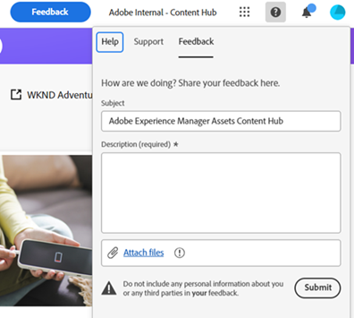

# Panoramica di Content Hub {#overview-content-hub}

L’hub di contenuti è disponibile come parte di Experience Manager Assets as a Cloud Service per rendere accessibili i contenuti in linea con il marchio alle organizzazioni e ai loro partner commerciali. Si concentra sulla distribuzione delle risorse per l’attivazione su larga scala e la creazione di varianti di contenuti sul brand per una maggiore agilità di marketing.

## Perché Content Hub?

Content Hub offre i seguenti vantaggi principali:

**Trova e condividi tutte le risorse approvate dal marchio disponibili in un portale intuitivo**

AEM Assets funge da unica fonte di verità e tutte le risorse approvate sono automaticamente disponibili su Content Hub in una gerarchia piatta per migliorare l’esperienza di ricerca.

**Interfaccia utente configurabile**

Le proprietà più comuni all’interno di Content Hub, come i filtri di ricerca, i campi disponibili durante l’aggiunta o l’importazione di risorse, le proprietà delle risorse e il contenuto del banner per il branding, sono configurabili e un amministratore può configurare facilmente l’interfaccia utente di Content Hub in base alle proprie esigenze.

**Possibilità per gli utenti non creativi di modificare e mixare i contenuti mantenendo il marchio**

Content Hub consente di creare nuovi contenuti con Adobe Express (se disponi di diritti Adobi Express). Puoi modificare i contenuti esistenti con strumenti facili da usare, produrre varianti on-brand con modelli ed elementi del brand e creare nuovi contenuti con le funzionalità GenAI più recenti di Adobe Firefly.

**Ottieni informazioni approfondite sull’utilizzo dei contenuti tra i team**

[!DNL Content Hub] fornisce informazioni utili sulle risorse, affrontando una sfida comune che spesso interessa il marketing: le statistiche sull’utilizzo delle risorse utilizzate nelle campagne di marketing, nei canali e in diverse aree geografiche. Acquisendo una chiara comprensione delle prestazioni e della popolarità delle risorse, fornisce informazioni fruibili essenziali per migliorare l’esperienza utente.

## Prerequisiti {#prerequisites-content-hub}

Content Hub richiede un ambiente di authoring di produzione di Experience Manager as a Cloud Service, versione 2024.6 o successiva (la versione minima è 2024.6.16799).

## Come accedere a Content Hub? {#access-content-hub}

[Dopo la configurazione di Content Hub](/help/assets/deploy-content-hub.md) e aggiungendo un utente al [Profilo prodotto Content Hub](/help/assets/deploy-content-hub.md#content-hub-instance-product-profile), è possibile accedere a Content Hub utilizzando i seguenti modi:

* Accedi a Content Hub utilizzando il seguente collegamento:

  `https://experience.adobe.com/#/assets/contenthub`

* Accedi a experience.adobe com e fai clic su **[!UICONTROL Experience Manager Assets Content Hub]** disponibile in **[!UICONTROL Accesso rapido]** sezione:
  

* Accedi a experience.adobe com e fai clic su **[!UICONTROL Experience Manager Assets Content Hub]** disponibile nel commutatore del prodotto:
  

## Fornire feedback a Content Hub {#provide-content-hub-feedback}

Per consigliare miglioramenti relativi ai prodotti, fai clic su **[!UICONTROL Feedback]** accanto al nome dell’organizzazione nella parte superiore dell’interfaccia utente di Content Hub.

Specifica un oggetto, una descrizione del consiglio e, se necessario, allega i file. Clic **[!UICONTROL Invia]** per inviare il feedback ad Adobe.

## Configurare Content Hub per il team {#setup-content-hub}

Per configurare Content Hub per il team, segui la procedura riportata di seguito.

1. [Abilitare Content Hub per Experience Manager Assets tramite Cloud Manager](deploy-content-hub.md#enable-content-hub).

1. [Amministratore Content Hub integrato](deploy-content-hub.md#onboard-content-hub-administrator).

1. [Aggiungere utenti chiave di Content Hub](deploy-content-hub.md#onboard-content-hub-consumer-users).

1. [Autori o amministratori DAM che devono approvare le risorse utilizzando le risorse Experience Manager](approve-assets.md).

1. [Gli amministratori possono configurare l’interfaccia utente di Content Hub per altri utenti](configure-content-hub-ui-options.md).

1. [Concedi l’accesso a Content Hub a più utenti del team](deploy-content-hub.md#onboard-content-hub-consumer-users).

1. [Accedere al portale Content Hub](#access-content-hub).

1. [Fornire feedback a Content Hub](#provide-content-hub-feedback).

## Ulteriori informazioni sulle funzionalità chiave {#key-capabilities-content-module}

<table>
<td>
   
   

      <a href="/help/assets/configure-content-hub-ui-options.md">
      <strong>Configurare l’interfaccia utente di Content Hub</strong>
      </a>
   

   

      <em>Scopri come gli amministratori possono configurare l’interfaccia utente di Content Hub. </em>
   

</td>

<td>
   
   

      <a href="/help/assets/search-assets-content-hub.md">
      <strong>Cercare le risorse disponibili in Content Hub</strong>
      </a>
   

   

      <em>Scopri come utilizzare diverse funzionalità per limitare i risultati della ricerca.</em>
   

</td>
<td>
   
   

      <a href="/help/assets/edit-images-content-hub.md">
      <strong>Modifica immagini con Adobe Express</strong>
      </a>
   

   

      <em>Scopri come creare varianti di immagini in Content Hub utilizzando Adobe Express</em>
   

</td>
</table>
<table>
<td>
   
   

      <a href="/help/assets/share-assets-content-hub.md">
      <strong>Condividere le risorse disponibili in Content Hub</strong>
      </a>
   

   

      <em>Scopri come condividere una o più risorse come collegamento e quindi accedervi.</em>
   

</td>
<td>
   
   

      <a href="/help/assets/collections-content-hub.md">
      <strong>Gestire le raccolte in Content Hub</strong>
      </a>
   

   

      <em>Scopri come creare e gestire le raccolte utilizzando le risorse.</em>
   

</td>
<td>
   
   

      <a href="/help/assets/insights-content-hub.md">
      <strong>Visualizzare informazioni approfondite sulle risorse in Content Hub</strong>
      </a>
   

   

      <em> Il modulo dei contenuti fornisce informazioni preziose sulle risorse, affrontando una sfida comune che spesso interessa le parti interessate del marketing</em>
   

</td>
</table>
