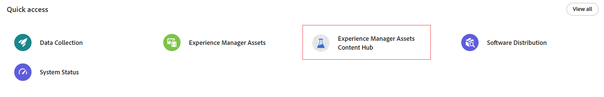

# Panoramica di Content Hub {#overview-content-hub}

| [Best practice per la ricerca](/help/assets/search-best-practices.md) | [Best practice per i metadati](/help/assets/metadata-best-practices.md) | [Dynamic Media con funzionalità OpenAPI](/help/assets/dynamic-media-open-apis-overview.md) | [Documentazione di AEM Assets per sviluppatori](https://developer.adobe.com/experience-cloud/experience-manager-apis/) |
| ------------- | --------------------------- |----|-----|

>[!AVAILABILITY]
>
>La guida di Content Hub è ora disponibile in formato PDF. Scarica l’intera guida e utilizza Adobe Acrobat AI Assistant per rispondere alle tue domande.
>
>[!BADGE Guida di Content Hub PDF]{type=Informative url="https://helpx.adobe.com/content/dam/help/en/experience-manager/aem-assets/content-hub.pdf"}

Content Hub è disponibile come parte di Experience Manager Assets as a Cloud Service per rendere i contenuti in linea con il brand accessibili nella propria organizzazione e ai rispettivi partner commerciali. Si concentra sulla distribuzione delle risorse per l’attivazione su larga scala e la creazione di varianti di contenuti fedeli alle linee guida del brand, per una maggiore marketing agility.

## Perché Content Hub?

Content Hub offre i seguenti vantaggi principali:

**Trova e condividi tutte le risorse approvate dal brand, disponibili in un portale intuitivo**

AEM Assets funge da unica fonte di verità e tutte le risorse approvate sono automaticamente disponibili in Content Hub in una gerarchia piatta, per un’esperienza di ricerca migliore.

**Interfaccia utente configurabile**

Le proprietà più comuni disponibili in Content Hub, come i filtri di ricerca, i campi disponibili durante l’aggiunta o l’importazione di risorse, le proprietà delle risorse e il contenuto del banner per il branding, sono configurabili e un amministratore può personalizzare facilmente l’interfaccia utente di Content Hub in base alle proprie esigenze.

**Consenti agli utenti non creativi di modificare e remixare i contenuti mantenendoli fedeli al brand**

Content Hub consente di creare nuovi contenuti con Adobe Express (se disponi di diritti per l’utilizzo di Adobe Express). Puoi modificare i contenuti esistenti con strumenti facili da usare, produrre varianti on-brand con modelli ed elementi del brand e creare nuovi contenuti con le più recenti funzionalità GenAI di Adobe Firefly.

**Ottieni insight su come i contenuti vengono utilizzati dai vari team**

[!DNL Content Hub] fornisce informazioni utili sulle risorse, per rispondere ad esigenze spesso riscontrate da chi lavora nel marketing: dati statistici sull’utilizzo delle risorse usate nelle campagne di marketing, nei canali e nelle diverse aree geografiche. Acquisendo dati che consentono di comprendere chiaramente le prestazioni e la popolarità delle risorse, fornisce informazioni fruibili essenziali per migliorare l’esperienza utente.

## Prerequisiti {#prerequisites-content-hub}

Content Hub richiede un ambiente di authoring per produzione di Experience Manager as a Cloud Service, versione 2024.6 o successiva (la versione minima è 2024.6.16799).

## Come accedere a Content Hub? {#access-content-hub}

[Dopo aver configurato Content Hub](/help/assets/deploy-content-hub.md) e aggiunto un utente al [profilo di prodotto di Content Hub](/help/assets/deploy-content-hub.md#content-hub-instance-product-profile), è possibile accedervi nei modi seguenti:

* Accedi a Content Hub utilizzando il seguente collegamento:

  `https://experience.adobe.com/#/assets/contenthub`

* Accedi a experience.adobe.com e fai clic su **[!UICONTROL Experience Manager Assets Content Hub]**, nella sezione **[!UICONTROL Accesso rapido]**:
  

* Accedi a experience.adobe.com e fai clic su **[!UICONTROL Experience Manager Assets Content Hub]** dall’opzione per cambiare prodotto:
  

## Fornire feedback su Content Hub {#provide-content-hub-feedback}

Per consigliare miglioramenti relativi al prodotto, fai clic su **[!UICONTROL Feedback]** accanto al nome della tua organizzazione nella parte superiore dell’interfaccia utente di Content Hub.

Specifica un oggetto, una descrizione del suggerimento e, se necessario, allega dei file. Fai clic su **[!UICONTROL Invia]** per far avere il feedback ad Adobe.

## Configurare Content Hub per il team {#setup-content-hub}

Per configurare Content Hub per il team, effettua le seguenti operazioni.

1. [Abilita Content Hub per Experience Manager Assets tramite Cloud Manager](deploy-content-hub.md#enable-content-hub).

1. [Esegui l’onboarding dell’amministratore di Content Hub](deploy-content-hub.md#onboard-content-hub-administrator).

1. [Aggiungi gli utenti chiave di Content Hub](deploy-content-hub.md#onboard-content-hub-consumer-users).

1. [Autori o amministratori DAM che devono approvare le risorse utilizzando Experience Manager Assets](approve-assets.md).

1. [Gli amministratori possono configurare l’interfaccia utente di Content Hub per altri utenti](configure-content-hub-ui-options.md).

1. [Concedi l’accesso a Content Hub a più utenti del team](deploy-content-hub.md#onboard-content-hub-consumer-users).

1. [Accedi al portale Content Hub](#access-content-hub).

1. [Fornisci feedback su Content Hub](#provide-content-hub-feedback).

## Ulteriori informazioni sulle funzionalità chiave {#key-capabilities-content-module}

<table>
<td>
   
   

      <a href="/help/assets/configure-content-hub-ui-options.md">
      <strong>Configurare l’interfaccia utente di Content Hub</strong>
      </a>
   

   

      <em>Scopri come gli amministratori possono configurare l’interfaccia utente di Content Hub.</em>
   

</td>

<td>
   
   

      <a href="/help/assets/search-assets-content-hub.md">
      <strong>Cercare risorse in Content Hub</strong>
      </a>
   

   

      <em>Scopri come utilizzare diverse funzionalità per limitare i risultati della ricerca.</em>
   

</td>
<td>
   
   

      <a href="/help/assets/edit-images-content-hub.md">
      <strong>Modificare le immagini con Adobe Express</strong>
      </a>
   

   

      <em>Scopri come creare varianti di immagini in Content Hub utilizzando Adobe Express</em>
   

</td>
</table>
<table>
<td>
   
   

      <a href="/help/assets/share-assets-content-hub.md">
      <strong>Condividere le risorse disponibili in Content Hub</strong>
      </a>
   

   

      <em>Scopri come condividere una o più risorse come collegamento e quindi accedervi.</em>
   

</td>
<td>
   
   

      <a href="/help/assets/collections-content-hub.md">
      <strong>Gestire le raccolte in Content Hub</strong>
      </a>
   

   

      <em>Scopri come creare raccolte utilizzando le risorse e quindi gestirle.</em>
   

</td>
<td>
   
   

      <a href="/help/assets/insights-content-hub.md">
      <strong>Visualizzare informazioni sulle risorse in Content Hub</strong>
      </a>
   

   

      <em> Il modulo dei contenuti fornisce informazioni utili sulle risorse, per rispondere alle esigenze spesso riscontrate dagli stakeholder del marketing</em>
   

</td>
</table>
