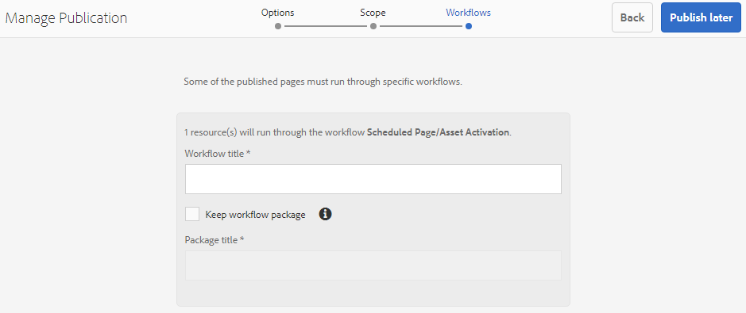

# Pubblicare risorse su Brand Portal {#publish-assets-to-brand-portal}

In qualità di amministratore di Adobe Experience Manager (AEM) Assets, puoi pubblicare risorse, cartelle e raccolte nell’istanza di Brand Portal di AEM Assets. Puoi anche pianificare il flusso di lavoro di una risorsa o di una cartella in modo che venga pubblicata in una data o in un’ora successiva. Dopo la pubblicazione, gli utenti di Brand Portal possono accedere e distribuire ulteriormente risorse, cartelle e raccolte ad altri utenti.

Devi però prima configurare AEM Assets con Brand Portal. Per ulteriori dettagli, consulta [Configurare AEM Assets con Brand Portal](configure-aem-assets-with-brand-portal.md).

Le eventuali modifiche apportate successivamente alla risorsa, alla cartella o alla raccolta originale in AEM Assets non verranno applicate in Brand Portal finché non vengono ripubblicate da AEM Assets. Questa funzione garantisce che le modifiche in corso d’opera non siano disponibili in Brand Portal. Solo le modifiche approvate pubblicate da un amministratore sono infatti disponibili in Brand Portal.

* [Pubblicare risorse su Brand Portal](#publish-assets-to-bp)
* [Pubblicare cartelle su Brand Portal](#publish-folders-to-brand-portal)
* [Pubblicare raccolte su Brand Portal](#publish-collections-to-brand-portal)

>[!NOTE]
>
>Adobe consiglia di scaglionare la pubblicazione, eseguendola preferibilmente nelle ore non di picco, in modo che AEM Author non utilizzi troppe risorse.

## Pubblicare risorse su Brand Portal {#publish-assets-to-bp}

Di seguito è descritta la procedura per pubblicare risorse su Brand Portal da AEM Assets:

1. Dalla console di Assets, apri la cartella principale e seleziona tutte le risorse da pubblicare, quindi fai clic su **[!UICONTROL Pubblicazione rapida]** nella barra degli strumenti.

   

1. Di seguito sono descritte le due opzioni per la pubblicazione di risorse:
   * [Pubblica ora](#publish-to-bp-now) (pubblica subito le risorse)
   * [Pubblica più tardi](#publish-to-bp-later) (pianifica la pubblicazione delle risorse)

### Pubblicare subito le risorse {#publish-to-bp-now}

Per pubblicare le risorse selezionate su Brand Portal, effettua una delle seguenti operazioni:

* Dalla barra degli strumenti, seleziona **[!UICONTROL Pubblicazione rapida]**. Dal menu, fai clic su **[!UICONTROL Pubblica su Brand Portal]**.

* Dalla barra degli strumenti, seleziona **[!UICONTROL Gestisci pubblicazione]**.

   1. In **[!UICONTROL Azione]**, seleziona **[!UICONTROL Pubblica su Brand Portal]**.

      In **[!UICONTROL Pianificazione]**, seleziona **[!UICONTROL Ora]**.

      Fai clic su **[!UICONTROL Avanti]**.

   2. Conferma la selezione in **[!UICONTROL Ambito]** e fai clic su **[!UICONTROL Pubblica su Brand Portal]**.

Viene visualizzato un messaggio per informare che le risorse sono state accodate per la pubblicazione su Brand Portal. Per visualizzare le risorse pubblicate, accedi all’interfaccia di Brand Portal.

### Pubblicare le risorse in un secondo momento {#publish-to-bp-later}

Per pianificare la pubblicazione delle risorse su Brand Portal in una data o un’ora successiva:

1. Seleziona le risorse di cui vuoi pianificare la pubblicazione e fai clic su **[!UICONTROL Gestisci pubblicazione]** nella barra degli strumenti in alto.

1. Nella pagina **[!UICONTROL Gestisci pubblicazione]**, seleziona **[!UICONTROL Pubblica su Brand Portal]** in **[!UICONTROL Azione]**.

   Seleziona **[!UICONTROL Più tardi]** in **[!UICONTROL Pianificazione]**.

   

1. Seleziona un valore per **[!UICONTROL Data di attivazione]** e specifica l’ora. Fai clic su **[!UICONTROL Avanti]**.

1. Seleziona un valore per **Data di attivazione** e specifica l’ora. Fai clic su **Avanti**.

1. Specifica un valore per **[!UICONTROL Titolo flusso di lavoro]** in **[!UICONTROL Flussi di lavoro]**. Fai clic su **[!UICONTROL Pubblica più tardi]**.

   

Accedi all’interfaccia di Brand Portal per visualizzare le risorse pubblicate (a seconda della data o dell’ora pianificata).

## Pubblicare cartelle su Brand Portal {#publish-folders-to-brand-portal}

Puoi pubblicare o annullare subito la pubblicazione delle cartelle di risorse oppure pianificare la pubblicazione in una data o un’ora successiva.

### Pubblicare cartelle su Brand Portal {#publish-folders-to-bp}

1. Dalla console di Assets, seleziona le cartelle da pubblicare e fai clic su **[!UICONTROL Pubblicazione rapida]** nella barra degli strumenti.

   

1. **Pubblicare subito le cartelle**

   Per pubblicare le cartelle selezionate su Brand Portal, effettua una delle seguenti operazioni:

   * Dalla barra degli strumenti, seleziona **[!UICONTROL Pubblicazione rapida]**.

      Dal menu, seleziona **[!UICONTROL Pubblica su Brand Portal]**.

   * Dalla barra degli strumenti, seleziona **[!UICONTROL Gestisci pubblicazione]**.

      1. In **[!UICONTROL Azione]**, seleziona **[!UICONTROL Pubblica su Brand Portal]**.

         In **[!UICONTROL Pianificazione]**, seleziona **[!UICONTROL Ora]**.

         Fai clic su **Avanti**.

      1. Conferma la selezione in **[!UICONTROL Ambito]** e fai clic su **[!UICONTROL Pubblica su Brand Portal]**.

   Viene visualizzato un messaggio per informare che la cartella è stata accodata per la pubblicazione su Brand Portal. Per visualizzare la cartella pubblicata, accedi all’interfaccia di Brand Portal.

1. **Pubblicare le cartelle in un secondo momento**

   Per pianificare la pubblicazione delle cartelle di risorse in una data o in un’ora successiva:

   1. Seleziona le cartelle di cui vuoi pianificare la pubblicazione e fai clic su **[!UICONTROL Gestisci pubblicazione]** nella barra degli strumenti in alto.
   1. In **[!UICONTROL Azione]**, seleziona **[!UICONTROL Pubblica su Brand Portal]**.

      In **[!UICONTROL Pianificazione]**, seleziona **[!UICONTROL Più tardi]**.

   1. Seleziona un valore per **[!UICONTROL Data di attivazione]** e specifica l’ora. Fai clic su **[!UICONTROL Avanti]**.

      

   1. Conferma la selezione in **[!UICONTROL Ambito]**. Fai clic su **[!UICONTROL Avanti]**.

   1. Specifica un titolo del flusso di lavoro in **[!UICONTROL Flussi di lavoro]**. Fai clic su **[!UICONTROL Pubblica più tardi]**.

      

### Annullare la pubblicazione di cartelle su Brand Portal {#unpublish-folders-from-brand-portal}

Per rimuovere una cartella di risorse pubblicata su Brand Portal, annullane la pubblicazione dall’istanza di AEM Assets. Dopo l’annullamento della pubblicazione della cartella originale, la relativa copia non sarà più disponibile per gli utenti di Brand Portal.

Puoi annullare subito la pubblicazione delle cartelle di risorse su Brand Portal oppure pianificare l’operazione per una data e un’ora successive.

Per annullare la pubblicazione delle cartelle di risorse su Brand Portal:

1. Dalla console di Assets, seleziona le cartelle di risorse di cui vuoi annullare la pubblicazione e fai clic su **[!UICONTROL Gestisci pubblicazione]** nella barra degli strumenti.

   

1. **Annullare subito la pubblicazione delle cartelle di risorse**

   Per annullare immediatamente la pubblicazione della cartella di risorse selezionata su Brand Portal:

   1. Dalla barra degli strumenti, seleziona **[!UICONTROL Gestisci pubblicazione]**.

   1. In **[!UICONTROL Azione]**, seleziona **[!UICONTROL Annulla pubblicazione su Brand Portal]**.

      In **[!UICONTROL Pianificazione]**, seleziona **[!UICONTROL Ora]**.

      Fai clic su **[!UICONTROL Avanti]**.

   1. Conferma la selezione in **[!UICONTROL Ambito]** e fai clic su **[!UICONTROL Annulla pubblicazione su Brand Portal]**.

      

1. **Annullare la pubblicazione delle cartelle di risorse in un secondo momento**

   Per pianificare l’annullamento della pubblicazione di una cartella di risorse in una data e un’ora successive:

   1. Dalla barra degli strumenti, seleziona **[!UICONTROL Gestisci pubblicazione]**.

   1. In **[!UICONTROL Azione]**, seleziona **[!UICONTROL Annulla pubblicazione su Brand Portal]**.

      In **[!UICONTROL Pianificazione]**, seleziona **[!UICONTROL Più tardi]**.

   1. Seleziona un valore per **[!UICONTROL Data di attivazione]** e specifica l’ora. Fai clic su **[!UICONTROL Avanti]**.

   1. Conferma la selezione in **[!UICONTROL Ambito]** e fai clic su **[!UICONTROL Avanti]**.

   1. Specifica un valore per **[!UICONTROL Titolo flusso di lavoro]** in **[!UICONTROL Flussi di lavoro]**. Fai clic su **[!UICONTROL Annulla pubblicazione più tardi]**.

      

## Pubblicare raccolte su Brand Portal {#publish-collections-to-brand-portal}

Puoi pubblicare o annullare la pubblicazione delle raccolte dall’istanza cloud di AEM Assets.

>[!NOTE]
>
>I frammenti di contenuto non possono essere pubblicati su Brand Portal. Pertanto, se selezioni frammenti di contenuto in AEM Assets, l’azione **[!UICONTROL Pubblica su Brand Portal]** non è disponibile.
>
>Se le raccolte contenenti frammenti di contenuto vengono pubblicate da AEM Assets su Brand Portal, nell’interfaccia di Brand Portal viene replicato tutto il contenuto della cartella, tranne i frammenti di contenuto.

### Pubblicare le raccolte {#publish-collections}

Di seguito è descritta la procedura per pubblicare raccolte su Brand Portal da AEM Assets:

1. Nell’interfaccia utente di AEM Assets, fai clic sul logo AEM.

1. Dalla pagina **Navigazione**, passa a **[!UICONTROL Risorse]** > **[!UICONTROL Raccolte]**.

1. Dalla console **Raccolte**, seleziona le raccolte che vuoi pubblicare su Brand Portal.

   

1. Dalla barra degli strumenti, fai clic su **[!UICONTROL Pubblica su Brand Portal]**.

1. Nella finestra di dialogo di conferma, fai clic su **[!UICONTROL Pubblica]**.

1. Chiudi il messaggio di conferma.

   Accedi a Brand Portal come amministratore. La raccolta pubblicata è disponibile nella console Raccolte.

   

### Annullare la pubblicazione delle raccolte {#unpublish-collections}

Per rimuovere una raccolta pubblicata su Brand Portal, annullane la pubblicazione dall’istanza di AEM Assets. Dopo l’annullamento della pubblicazione della raccolta originale, la relativa copia non sarà più disponibile per gli utenti di Brand Portal.

Di seguito è descritta la procedura per annullare la pubblicazione di una raccolta:

1. Dalla console **Raccolte** dell’istanza di AEM Assets, seleziona la raccolta di cui vuoi annullare la pubblicazione.

   

1. Dalla barra degli strumenti, fai clic sull’icona **[!UICONTROL Rimuovi da Brand Portal]**.
1. Nella finestra di dialogo, fai clic su **[!UICONTROL Annulla pubblicazione]**.
1. Chiudi il messaggio di conferma. La raccolta viene rimossa dall’interfaccia di Brand Portal.

Oltre a quanto sopra, è possibile pubblicare anche schemi di metadati, predefiniti per immagini, facet di ricerca e tag da AEM Assets a Brand Portal.

* [Pubblicare predefiniti, schemi e facet in Brand Portal](https://docs.adobe.com/content/help/it-IT/experience-manager-brand-portal/using/publish/publish-schema-search-facets-presets.html)
* [Pubblicare tag in Brand Portal](https://docs.adobe.com/content/help/it-IT/experience-manager-brand-portal/using/publish/brand-portal-publish-tags.html)

Per ulteriori informazioni, consulta la [documentazione di Brand Portal](https://docs.adobe.com/content/help/it-IT/experience-manager-brand-portal/using/home.html).

<!--
   Comment Type: draft

   <li> </li>
   -->

<!--
   Comment Type: draft

   <li>Step text</li>
   -->
