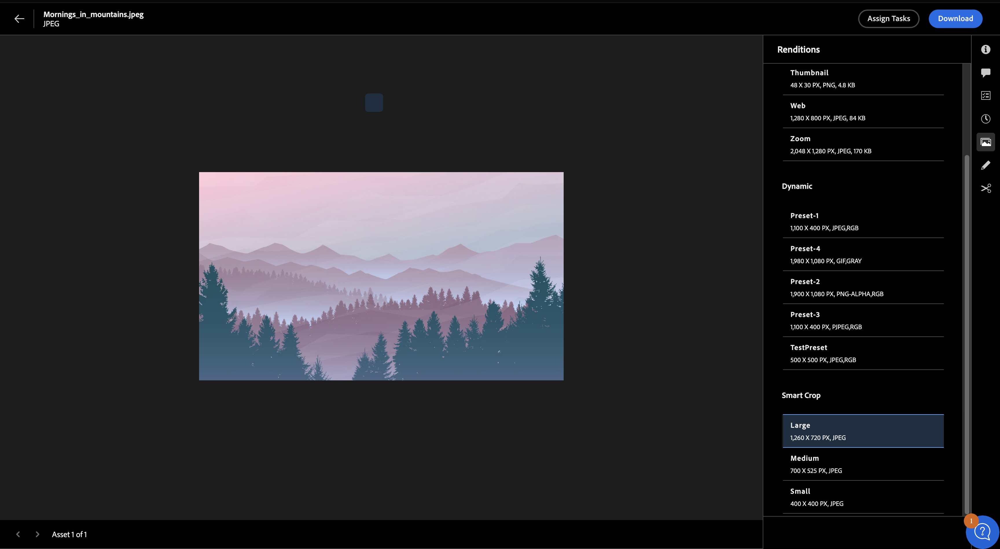

# Visualizzare e gestire le rappresentazioni in Experience Manager Assets{#renditions}

<table>
    <tr>
        <td>
            <i>Novità</i> <a href="/help/assets/dynamic-media/dm-prime-ultimate.md"><b>Dynamic Media Prime e Ultimate</b></a>
        </td>
        <td>
            <i>Novità</i> <a href="/help/assets/assets-ultimate-overview.md"><b>AEM Assets Ultimate</b></a>
        </td>
        <td>
            <i>Novità</i> <a href="/help/assets/integrate-aem-assets-edge-delivery-services.md"><b>Integrazione di AEM Assets con Edge Delivery Services</b></a>
        </td>
        <td>
            <i>Novità</i> <a href="/help/assets/aem-assets-view-ui-extensibility.md"><b>Estensibilità dell’interfaccia utente</b></a>
        </td>
          <td>
            <i>Novità</i> <a href="/help/assets/dynamic-media/enable-dynamic-media-prime-and-ultimate.md"><b>Abilitare Dynamic Media Prime e Ultimate</b></a>
        </td>
    </tr>
    <tr>
        <td>
            <a href="/help/assets/search-best-practices.md"><b>Best practice per la ricerca</b></a>
        </td>
        <td>
            <a href="/help/assets/metadata-best-practices.md"><b>Best practice per i metadati</b></a>
        </td>
        <td>
            <a href="/help/assets/product-overview.md"><b>Content Hub</b></a>
        </td>
        <td>
            <a href="/help/assets/dynamic-media-open-apis-overview.md"><b>Dynamic Media con funzionalità OpenAPI</b></a>
        </td>
        <td>
            <a href="https://developer.adobe.com/experience-cloud/experience-manager-apis/"><b>Documentazione di AEM Assets per sviluppatori</b></a>
        </td>
    </tr>
</table>

Le rappresentazioni in Adobe Experience Manager (AEM) sono versioni personalizzate delle risorse digitali, come le immagini, progettate per diversi dispositivi e piattaforme per garantire prestazioni ottimali. AEM semplifica la creazione e la gestione di questi rendering, migliorando l’esperienza utente. Puoi creare miniature, ottimizzare immagini per il web o per dispositivi mobili, aggiungere filigrane, visualizzare e scaricare rappresentazioni dinamiche o ritaglio avanzato e fare molto di più.

I predefiniti per le immagini Dynamic Media e le rappresentazioni Smart Crop promuovono una gestione sistematica delle immagini in linea con gli standard del marchio, massimizzando la coesione del marchio. Questo semplifica il processo di individuazione e utilizzo rapido delle rappresentazioni dinamiche delle immagini in base alle esigenze, senza alcun accesso da parte dell’amministratore.

Le rappresentazioni sono classificate come statiche e dinamiche e ogni tipo presenta caratteristiche e funzionalità univoche che vengono discusse più dettagliatamente.

## Rappresentazioni statiche {#static-renditions}

Le rappresentazioni statiche sono versioni pregenerate delle risorse digitali, in genere create durante l’inserimento o la modifica delle risorse. Questi rendering sono ottimizzati per scopi e piattaforme specifici, come le miniature web, i formati facili da usare sui dispositivi mobili per la progettazione reattiva o le versioni ad alta risoluzione per la stampa, garantendo un’esperienza efficiente e coerente.
Scopri come [visualizzare e scaricare le rappresentazioni statiche](#view-and-download-static-renditions) in Experience Manager Assets.

### Visualizzare e scaricare le rappresentazioni statiche{#view-and-download-static-renditions}

Per visualizzare le rappresentazioni delle risorse e scaricarle, effettua le seguenti operazioni:

1. Nella visualizzazione Assets, fai clic su **Assets**, accedi a una cartella, seleziona una risorsa e fai clic su **Dettagli**.
1. Fai clic sull’icona della rappresentazione disponibile nel riquadro a destra.
1. Seleziona una copia trasformata per visualizzarne l&#39;anteprima e fai clic sull&#39;icona  per scaricarla.

   

## Rappresentazioni dinamiche {#dynamic-renditions}

Le rappresentazioni dinamiche sono versioni personalizzate delle risorse create in tempo reale per soddisfare esigenze specifiche, ad esempio per ridimensionare le immagini in base alla risoluzione del dispositivo o per adattarle a proporzioni diverse.
Questi rendering consentono alle organizzazioni di fornire esperienze personalizzate e ottimizzate per soddisfare diverse esigenze di pubblico. Puoi visualizzare e scaricare le rappresentazioni dinamiche in Experience Manager Assets.

## Rappresentazioni Dynamic Media {#dynamic-media-renditions}

### Prima di iniziare

* Devi essere un utente di AEM Dynamic Media con licenza.
* Utilizza la [!UICONTROL visualizzazione Amministratore] per configurare:
   * [Profili immagine ritaglio avanzato](/help/assets/dynamic-media/image-profiles.md#creating-image-profiles)
   * [Predefiniti immagine](/help/assets/dynamic-media/managing-image-presets.md)

  È possibile [cambiare la visualizzazione](/help/assets/assets-view-introduction.md#how-to-access-assets-view) in un secondo momento per visualizzare in anteprima le rappresentazioni dinamiche nella visualizzazione Assets.
* Pubblica le risorse in Dynamic Media per rendere disponibili le rappresentazioni Dynamic Media nella vista Assets. Per ulteriori informazioni, consulta [Pubblicare Assets in AEM e Dynamic Media](https://experienceleague.adobe.com/it/docs/experience-manager-cloud-service/content/assets/assets-view/publish-assets-to-aem-and-dm).

### Visualizzare e scaricare le rappresentazioni Dynamic Media {#view-download-dm-renditions}

Per visualizzare o scaricare le rappresentazioni dinamiche delle immagini in Experience Manager Assets, effettua le seguenti operazioni:

1. Vai a **[!UICONTROL Gestione Assets]** > **[!UICONTROL Assets]**.

1. Passa alla cartella delle risorse applicabile.

1. Fai clic sulla risorsa da visualizzare e fai clic su **[!UICONTROL Dettagli]**.

1. Nel menu di destra, fai clic sull&#39;icona **[!UICONTROL Dynamic Media]**. Il pannello **[!UICONTROL Dynamic Media]** visualizza le rappresentazioni Dynamic Media e Smart Crop.

   
   <!--  -->

1. Seleziona la rappresentazione da visualizzare in anteprima e fai clic su **Copia URL** per copiare l&#39;URL della rappresentazione selezionata. Fai clic su **Scarica rappresentazione** per scaricare le rappresentazioni delle risorse immagine.
1. Seleziona la rappresentazione con ritaglio avanzato da visualizzare in anteprima e fai clic su **Copia URL** per copiare l&#39;URL della rappresentazione selezionata.
1. Fai clic sull&#39; per scaricare tutte le rappresentazioni di ritaglio avanzato disponibili come un unico file zip.
   

   >[!NOTE]
   >
   >Queste rappresentazioni sono disponibili solo per le risorse immagine.

## Copie trasformate di elementi multimediali dinamici con funzionalità OpenAPI {#dm-with-openapi-renditions}

### Prima di iniziare {#prereqs-dm-with-openapi-renditions}

* Devi essere un utente di AEM Dynamic Media con licenza.
* Per visualizzare i rendering di Dynamic Media con funzionalità OpenAPI, è necessario approvare Assets. Per ulteriori informazioni, consulta [Approvare le risorse in Experience Manager](/help/assets/approve-assets.md#copy-delivery-url-approved-assets)
* Dynamic Media con funzionalità OpenAPI deve essere abilitato nell’istanza AEM as a Cloud Service.

### Visualizza rappresentazioni Dynamic Media con funzionalità OpenAPI {#view-download-dm-with-openapi-renditions}

1. Seleziona la risorsa e fai clic su **Dettagli**.
1. Fai clic sull’icona di Dynamic Media disponibile nel riquadro a destra. Il pannello Dynamic Media visualizza il rendering Dynamic Media con funzionalità OpenAPI per tutti i tipi di risorse.
   
1. Seleziona l&#39;opzione **Dynamic Media con OpenAPI**, quindi fai clic su **Copia URL** per copiare l&#39;URL di consegna della risorsa.

