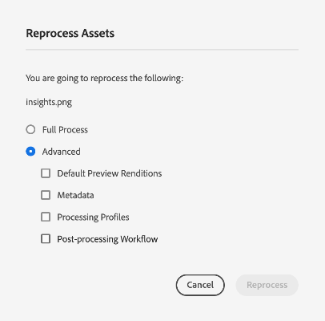

# Rielaborazione di risorse digitali {#reprocessing-digital-assets}

È possibile rielaborare le risorse in una cartella che dispone già di un profilo di metadati esistente che è stato successivamente modificato. Se desiderate che il predefinito appena modificato venga riapplicato alle risorse esistenti nella cartella, dovete rielaborare la cartella. Puoi rielaborare tutte le risorse necessarie.

Rielabora le risorse in una cartella se si verifica uno dei due scenari seguenti:

* Desideri eseguire un predefinito per set di batch in una cartella di risorse esistente in cui sono già caricate risorse.
* In seguito puoi modificare un predefinito per set di batch esistente precedentemente applicato a una cartella di risorse.

## Rielabora risorse {#reprocessing-steps}

Per rielaborare le risorse in una cartella:

1. In entrata [!DNL Experience Manager], dalla pagina Risorse, seleziona le risorse appena aggiunte o quelle che desideri rielaborare.
Se selezioni una cartella:

   * Il flusso di lavoro considera tutti i file nella cartella selezionata in modo ricorsivo.
   * Se nella cartella principale selezionata sono presenti una o più sottocartelle con risorse, il flusso di lavoro rielabora ogni risorsa nella gerarchia delle cartelle.
   * Come best practice, evita di eseguire questo flusso di lavoro su una gerarchia di cartelle con più di 1000 risorse.

1. Seleziona **[!UICONTROL Rielabora risorse]**. Scegli tra le due opzioni:

   

   * **[!UICONTROL Processo completo]:** Seleziona questa opzione quando desideri eseguire il processo complessivo, inclusi il profilo predefinito, il profilo personalizzato, l’elaborazione dinamica (se configurata) e i flussi di lavoro di post-elaborazione.
   * **[!UICONTROL Avanzate]:** Selezionare questa opzione per scegliere la rielaborazione avanzata.

     

     Seleziona tra le seguenti opzioni avanzate:

      * **[!UICONTROL Rappresentazioni di anteprima predefinite]:** Scegliere questa opzione per rielaborare le copie trasformate visualizzate in anteprima per impostazione predefinita.

      * **[!UICONTROL Metadati]:** Scegli questa opzione per estrarre le informazioni sui metadati e i tag avanzati per le risorse selezionate.

      * **[!UICONTROL Profili elaborazione]:** Scegliere questa opzione per rielaborare un profilo selezionato. Puoi scegliere **[!UICONTROL Processo completo]** per includere l’elaborazione predefinita e il profilo personalizzato assegnato a livello di cartella.
        <!--When assets are uploaded to a folder, [!DNL Experience Manager] checks the containing folder's properties for a processing profile. If none is applied, a parent folder in the hierarchy is checked for a processing profile to apply.-->

      * **[!UICONTROL Flusso di lavoro di post-elaborazione]:** Scegli questa opzione se è necessaria un’elaborazione aggiuntiva delle risorse che non può essere ottenuta utilizzando i profili di elaborazione. È possibile aggiungere alla configurazione ulteriori flussi di lavoro di post-elaborazione. La post-elaborazione consente di aggiungere un’elaborazione completamente personalizzata oltre a quella configurabile utilizzando i microservizi per le risorse.

Consulta [utilizzare i microservizi delle risorse e i profili di elaborazione](https://experienceleague.adobe.com/docs/experience-manager-cloud-service/content/assets/manage/asset-microservices-configure-and-use.html?lang=en) per ulteriori informazioni sui profili di elaborazione e sul flusso di lavoro di post-elaborazione.

Dopo aver selezionato le opzioni appropriate, fai clic su **[!UICONTROL Rielabora]**. Viene visualizzato il messaggio di operazione riuscita.

## Scenari per la rielaborazione delle risorse digitali {#scenarios-reprocessing}

[!DNL Experience Manager] consente la rielaborazione delle risorse digitali per i seguenti componenti.

### Tag avanzati {#reprocessing-smart-tags}

Le organizzazioni che si occupano di risorse digitali utilizzano sempre più spesso il vocabolario controllato dalla tassonomia nei metadati delle risorse. In sostanza, include un elenco di parole chiave utilizzate comunemente da dipendenti, partner e clienti per fare riferimento e cercare risorse digitali di una particolare classe. L’assegnazione dei tag alle risorse tramite un vocabolario controllato dalla tassonomia consente di identificarle e recuperarle facilmente.

Rispetto ai vocabolari del linguaggio naturale, assegnare tag alle risorse digitali in base alla tassonomia aziendale consente di allinearle alle attività aziendali e assicura che le risorse più rilevanti vengano visualizzate nelle ricerche.

Ulteriori informazioni su [Tag avanzati per risorse video](https://experienceleague.adobe.com/docs/experience-manager-cloud-service/content/assets/manage/smart-tags-video-assets.html?lang=en).

Ulteriori informazioni su [Rielabora i tag colore per le immagini esistenti in DAM](https://experienceleague.adobe.com/docs/experience-manager-cloud-service/content/assets/manage/color-tag-images.html?lang=en#color-tags-existing-images).

### Ritaglio avanzato {#reprocessing-smart-crop}

Ulteriori informazioni su [Ritaglio avanzato Dynamic Medie](https://experienceleague.adobe.com/docs/experience-manager-cloud-service/content/assets/dynamicmedia/image-profiles.html?lang=en) che consente di applicare specifiche funzioni di ritaglio (**[!UICONTROL Ritaglio avanzato]** e il ritaglio di pixel) e la configurazione della nitidezza delle risorse caricate.

### Metadati {#reprocessing-metadata}

[!DNL Adobe Experience Manager Assets] conserva i metadati per ogni risorsa. Consente di categorizzare e organizzare più facilmente le risorse e aiuta le persone alla ricerca di una risorsa specifica. Grazie alla possibilità di estrarre i metadati dai file caricati in Experience Manager Assets, la gestione dei metadati si integra con il flusso di lavoro creativo. Grazie alla possibilità di conservare e gestire i metadati con le risorse, è possibile organizzare ed elaborare automaticamente le risorse in base ai relativi metadati.

Ulteriori informazioni su [Rielaborazione dei profili di metadati](https://experienceleague.adobe.com/docs/experience-manager-cloud-service/content/assets/manage/metadata-profiles.html?lang=en).

### Rielaborare le risorse Dynamic Medie in una cartella {#reprocessing-dynamic-media}

È possibile rielaborare le risorse in una cartella che dispone già di un profilo immagine Dynamic Medie esistente o di un profilo video Dynamic Medie modificato successivamente. Per ulteriori informazioni, visita [rielabora le risorse Dynamic Medie in una cartella.](https://experienceleague.adobe.com/docs/experience-manager-cloud-service/content/assets/admin/about-image-video-profiles.html?lang=en)

>[!NOTE]
>
>Devi configurare [!DNL Dynamic Media] nell&#39;ambiente per abilitare la finestra di dialogo Dynamic Medie.
>

### Flussi di lavoro

Ulteriori informazioni su [profili di elaborazione e flussi di lavoro di post-elaborazione](https://experienceleague.adobe.com/docs/experience-manager-cloud-service/content/assets/manage/asset-microservices-configure-and-use.html?lang=en).
