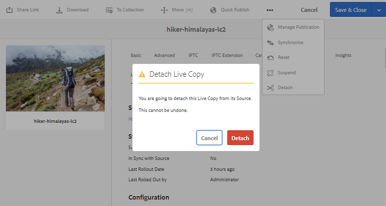

# Riutilizzare le risorse tramite MSM per [!DNL Assets] {#reuse-assets-using-msm-for-assets}

| Versione | Collegamento articolo |
| -------- | ---------------------------- |
| AEM 6.5 | [Fai clic qui](https://experienceleague.adobe.com/docs/experience-manager-65/assets/using/reuse-assets-using-msm.html?lang=it) |
| AEM as a Cloud Service | Questo articolo |

La funzionalità Multi Site Manager (MSM) in [!DNL Adobe Experience Manager] consente agli utenti di riutilizzare i contenuti creati una sola volta e riutilizzati in più percorsi Web. La stessa funzionalità è disponibile per le risorse digitali con il nome MSM per [!DNL Assets]. Utilizzando MSM per [!DNL Assets], è possibile:

* Crea una volta le risorse, quindi copiale per riutilizzarle in altre aree del sito.
* Mantieni più copie sincronizzate e aggiorna la copia principale originale una sola volta per inviare le modifiche alle copie secondarie.
* Apporta modifiche locali sospendendo temporaneamente o definitivamente il collegamento tra le risorse principali e secondarie.

>[!NOTE]
>
>La funzionalità MSM per [!DNL Assets] include frammenti di contenuto, archiviati come [!DNL Assets] (anche se considerati una funzionalità Sites).

>[!CAUTION]
>
>MSM per frammenti di contenuto è disponibile solo quando si utilizzano frammenti di contenuto tramite la console **[!UICONTROL Assets]**.
>
>La funzionalità MSM è *non* disponibile quando si utilizza la console **[!UICONTROL Frammenti di contenuto]**.

## Comprendere i vantaggi e i concetti di MSM {#concepts}

### Come funziona e i vantaggi {#how-it-works-and-the-benefits}

Per informazioni sugli scenari di utilizzo per il riutilizzo dello stesso contenuto (testo e risorse) in più percorsi Web, consulta [possibili scenari MSM](/help/sites-cloud/administering/msm/overview.md). [!DNL Experience Manager] mantiene un collegamento tra la risorsa originale e le relative copie collegate, denominate Live Copy (LC). Il collegamento mantenuto consente di inviare le modifiche centralizzate a molte Live Copy. In questo modo è possibile eseguire aggiornamenti più rapidi eliminando le limitazioni della gestione delle copie duplicate. La propagazione delle modifiche è senza errori e centralizzata. Questa funzionalità consente di eseguire aggiornamenti limitati alle Live Copy selezionate. Gli utenti possono scollegare il collegamento, ovvero interrompere l’ereditarietà, e apportare modifiche locali che non vengono sovrascritte la prossima volta che la copia primaria viene aggiornata e le modifiche vengono implementate. Lo scollegamento può essere eseguito per alcuni campi di metadati selezionati o per un’intera risorsa. Offre flessibilità per l’aggiornamento locale delle risorse originariamente ereditate da una copia principale.

MSM mantiene una relazione live tra la risorsa sorgente e le relative Live Copy in modo che:

* Le modifiche alle risorse sorgente vengono applicate (implementate) anche alle Live Copy, ovvero le Live Copy vengono sincronizzate con la sorgente.
* Puoi aggiornare le Live Copy sospendendo la relazione live o rimuovendo l’ereditarietà per alcuni campi limitati. Le modifiche all’origine non vengono più applicate alla Live Copy.

### Glossario di MSM per [!DNL Assets] termini {#glossary}

**Source:** le risorse o cartelle originali. Copia primaria da cui derivano le Live Copy.

**Live Copy:** la copia delle risorse/cartelle di origine sincronizzata con la relativa origine. Le Live Copy possono essere una fonte di ulteriori Live Copy. Scopri come creare LC.

**Ereditarietà:** collegamento/riferimento tra una risorsa/cartella Live Copy e la relativa origine utilizzato dal sistema per ricordare dove inviare gli aggiornamenti. L’ereditarietà esiste a un livello granulare per i campi di metadati, ma anche per le varianti e i campi di frammenti di contenuto. È possibile rimuovere l’ereditarietà per gli elementi selezionati mantenendo la relazione live tra l’origine e la relativa Live Copy.

**Rollout:** azione che invia le modifiche apportate all&#39;origine a valle alle relative Live Copy. È possibile aggiornare una o più Live Copy in una sola volta utilizzando l’azione di rollout. Consulta Rollout.

**Configurazione rollout:** regole che determinano quali proprietà vengono sincronizzate, come e quando. Queste configurazioni vengono applicate durante la creazione di Live Copy; possono essere modificate in un secondo momento; e un figlio può ereditare la configurazione di rollout dalla risorsa principale. Per MSM per [!DNL Assets], utilizza solo la configurazione di rollout standard. Le altre configurazioni di rollout non sono disponibili per MSM per [!DNL Assets].

**Sincronizza:** un&#39;altra azione, oltre al rollout, che porta parità tra l&#39;origine e la relativa Live Copy inviando gli aggiornamenti dall&#39;origine alle Live Copy. Viene avviata una sincronizzazione per una particolare Live Copy e l’azione richiama le modifiche dall’origine. Utilizzando questa azione, è possibile aggiornare solo una delle Live Copy. Consulta azione di sincronizzazione.

**Sospendi:** rimuovi temporaneamente la relazione live tra una Live Copy e la relativa risorsa/cartella di origine. È possibile riprendere la relazione. Consulta Azione di sospensione.

**Riprendi:** Riprendi la relazione live in modo che una Live Copy riceva nuovamente gli aggiornamenti dall&#39;origine. Consulta Riprendere l’azione.

**Reimposta:** L&#39;azione Reimposta rende nuovamente la Live Copy una replica dell&#39;origine sovrascrivendo eventuali modifiche locali. Rimuove inoltre le cancellazioni di ereditarietà e ripristina l’ereditarietà su tutti i campi di metadati. Per apportare modifiche locali in futuro, è necessario annullare nuovamente l’ereditarietà di campi specifici. Vedere modifiche locali di LC.

**Scollega:** rimuovi in modo irrevocabile la relazione live di una risorsa/cartella Live Copy. Dopo l’azione di scollegamento, le Live Copy non possono mai ricevere aggiornamenti dall’origine e cessano di essere Live Copy. Consulta rimuovere la relazione.

## Creare una Live Copy di una risorsa {#create-livecopy}

Per creare una Live Copy da una o più risorse o cartelle di origine, effettua una delle seguenti operazioni:

* Metodo 1: seleziona le risorse di origine e fai clic su **[!UICONTROL Crea]** > **[!UICONTROL Live Copy]** nella barra degli strumenti nella parte superiore.
* Metodo 2: nell&#39;interfaccia utente di [!DNL Experience Manager], fare clic su **[!UICONTROL Crea]** > **[!UICONTROL Live Copy]** dall&#39;angolo superiore destro dell&#39;interfaccia.

Puoi creare live copy di una risorsa o cartella una alla volta. Puoi creare Live Copy derivate da una risorsa o da una cartella che è essa stessa una Live Copy.

Per creare Live Copy utilizzando il primo metodo, effettua le seguenti operazioni:

1. Seleziona le risorse o le cartelle di origine. Dalla barra degli strumenti, fai clic su **[!UICONTROL Crea]** > **[!UICONTROL Live Copy]**.

   ![Crea Live Copy dall&#39;interfaccia [!DNL Experience Manager]](assets/create_lc1.png)

   *Figura: crea Live Copy dall&#39;interfaccia [!DNL Experience Manager].*

1. Seleziona una cartella di destinazione. Fai clic su **[!UICONTROL Avanti]**.
1. Immetti titolo e nome. Assets non ha figli. Quando crei una Live Copy delle cartelle, puoi scegliere di includerne o escluderne altre secondarie.
1. Seleziona una configurazione di rollout. Fai clic su **[!UICONTROL Crea]**.

Per creare Live Copy utilizzando il secondo metodo, segui questi passaggi:

1. Nell&#39;interfaccia [!DNL Experience Manager], dall&#39;angolo superiore destro, fare clic su **[!UICONTROL Crea]** > **[!UICONTROL Live Copy]**.

   ![Crea Live Copy dall&#39;interfaccia [!DNL Experience Manager]](assets/create_lc2.png)

   *Figura: crea Live Copy dall&#39;interfaccia [!DNL Experience Manager].*

1. Seleziona la risorsa o la cartella di origine. Fai clic su **[!UICONTROL Avanti]**.
1. Seleziona la cartella di destinazione. Fai clic su **[!UICONTROL Avanti]**.
1. Immetti titolo e nome. Assets non ha figli. Quando crei una Live Copy delle cartelle, puoi scegliere di includerne o escluderne altre secondarie.
1. Seleziona una configurazione di rollout. Fai clic su **[!UICONTROL Crea]**.

>[!NOTE]
>
>Quando un’origine o una Live Copy viene spostata, le relazioni vengono mantenute. Quando una Live Copy viene eliminata, le relazioni vengono rimosse.

## Visualizzare varie proprietà e stati di sorgente e Live Copy {#properties}

È possibile visualizzare le informazioni e gli stati relativi a MSM di Live Copy, ad esempio relazione, sincronizzazione, rollout e altro ancora, dalle varie aree dell&#39;interfaccia utente di [!DNL Experience Manager].

I due metodi seguenti funzionano per le risorse e le cartelle:

* Seleziona la risorsa Live Copy e trova le informazioni nella relativa pagina Proprietà.
* Seleziona la cartella di origine e trova le informazioni dettagliate di ogni Live Copy dalla [!UICONTROL console Live Copy].

>[!TIP]
>
>Per verificare lo stato di alcune Live Copy separate, utilizza il primo metodo per controllare la pagina **[!UICONTROL Proprietà]**. Per verificare lo stato di molte Live Copy, utilizza il secondo metodo per controllare la pagina **[!UICONTROL Stato di relazione]**.

### Informazioni e stato di una Live Copy {#status-lc-asset}

Per verificare le informazioni e gli stati di una risorsa Live Copy o di una cartella, segui la procedura riportata di seguito.

1. Seleziona una risorsa Live Copy o una cartella. Fare clic su **[!UICONTROL Proprietà]** nella barra degli strumenti. In alternativa, utilizzare la scelta rapida da tastiera `p`.
1. Fai clic su **[!UICONTROL Live Copy]**. Puoi controllare il percorso dell’origine, lo stato della sospensione, lo stato della sincronizzazione, la data dell’ultimo rollout e l’utente che ha eseguito l’ultimo rollout.

   

   *Figura: informazioni e stati della Live Copy.*

1. Puoi abilitare o disabilitare se le risorse figlie prendono in prestito la configurazione Live Copy.

1. Puoi scegliere l’opzione per la Live Copy per ereditare la configurazione di rollout dall’elemento padre o modificare la configurazione.

### Informazioni e stati di tutte le Live Copy di una cartella {#status-lc-folder}

[!DNL Experience Manager] fornisce una console per controllare le statistiche di tutte le Live Copy di una cartella di origine. Questa console visualizza lo stato di tutte le risorse figlie.

1. Selezionare una cartella di origine. Fare clic su **[!UICONTROL Proprietà]** nella barra degli strumenti. In alternativa, utilizzare la scelta rapida da tastiera `p`.
1. Fai clic su **[!UICONTROL Origine Live Copy]**. Per aprire la console, fai clic su **[!UICONTROL Panoramica Live Copy]**. Questo dashboard offre uno stato di primo livello per tutte le risorse secondarie.

   

   *Figura: visualizzazione degli stati delle Live Copy nella [!UICONTROL console Live Copy] dell&#39;origine.*

1. Per visualizzare informazioni dettagliate su ciascuna risorsa della cartella Live Copy, seleziona la risorsa in questione, quindi dalla barra degli strumenti fai clic su **[!UICONTROL Stato di relazione]**.

   

   Informazioni dettagliate e stato di una risorsa figlia Live Copy in una cartella

>[!TIP]
>
>Puoi visualizzare rapidamente gli stati delle Live Copy di altre cartelle senza dover sfogliare troppo. Cambia la cartella dalla parte superiore centrale dell&#39;interfaccia **[!UICONTROL Panoramica Live Copy]**.

### Azioni rapide dalla barra Riferimenti per l’origine {#ref-rail-source}

Per una risorsa o una cartella di origine, puoi visualizzare le seguenti informazioni ed eseguire le azioni seguenti direttamente dalla barra Riferimenti:

* Visualizza i percorsi delle Live Copy.
* Aprire o visualizzare una Live Copy specifica nell&#39;interfaccia utente di [!DNL Experience Manager].
* Sincronizza gli aggiornamenti a una Live Copy specifica.
* Sospendi la relazione o modifica la configurazione di rollout per una Live Copy specifica.
* Accedi alla console Panoramica Live Copy.

Seleziona la risorsa o la cartella di origine, apri la barra a sinistra e fai clic su **[!UICONTROL Riferimenti]**. In alternativa, seleziona una risorsa o una cartella e utilizza la scelta rapida da tastiera `Alt + 4`.

*Figura: azioni e informazioni disponibili nella barra Riferimenti per l&#39;origine selezionata.*

Per una Live Copy specifica, fai clic su **[!UICONTROL Modifica Live Copy]** per sospendere la relazione o modificare la configurazione di rollout.

*Figura: sospendi la relazione o modifica la configurazione di rollout di una Live Copy specifica.*

### Azioni rapide dalla barra Riferimenti per Live Copy {#ref-rail-lc}

Per una risorsa o una cartella Live Copy, puoi visualizzare le seguenti informazioni ed eseguire le azioni seguenti direttamente dalla barra Riferimenti:

* Visualizzare il percorso della relativa origine.
* Aprire o visualizzare una Live Copy specifica nell&#39;interfaccia utente di [!DNL Experience Manager].
* Eseguire il rollout degli aggiornamenti.

Seleziona una risorsa o una cartella Live Copy, apri la barra a sinistra e fai clic su **[!UICONTROL Riferimenti]**. In alternativa, seleziona una risorsa o una cartella e utilizza la scelta rapida da tastiera `Alt + 4`.

*Figura: azioni disponibili nella barra Riferimenti per la Live Copy selezionata.*

## Propagare le modifiche dall’origine alle Live Copy {#rollout-sync}

Dopo la modifica di un’origine, le modifiche possono essere propagate alle Live Copy utilizzando un’azione di sincronizzazione o un’azione di rollout. Per comprendere la differenza tra le due azioni, vedere [glossario](#glossary).

### Rollout, azione {#rollout}

Puoi avviare un’azione di rollout dalla risorsa sorgente e aggiornare tutte o alcune Live Copy selezionate.

1. Seleziona una risorsa Live Copy o una cartella. Fare clic su **[!UICONTROL Proprietà]** nella barra degli strumenti. In alternativa, utilizzare la scelta rapida da tastiera `p`.
1. Fai clic su **[!UICONTROL Origine Live Copy]**. Fai clic su **[!UICONTROL Rollout]** nella barra degli strumenti.
1. Seleziona le Live Copy da aggiornare. Fai clic su **[!UICONTROL Rollout]**.
1. Per eseguire il rollout degli aggiornamenti apportati alle risorse figlio, seleziona **[!UICONTROL Rollout Source e tutti gli elementi figlio]**.

   

   *Figura: esegui il rollout delle modifiche dell&#39;origine in alcune o tutte le Live Copy.*

>[!NOTE]
>
>Le modifiche apportate in una risorsa sorgente vengono implementate solo nelle Live Copy direttamente correlate. Se una Live Copy è derivata da un’altra Live Copy, le modifiche non vengono implementate nella Live Copy derivata.

In alternativa, puoi avviare un’azione di rollout dalla barra Riferimenti dopo aver selezionato una Live Copy specifica. Per ulteriori informazioni, consulta [Azioni rapide dalla barra Riferimenti per Live Copy](#ref-rail-lc). In questo metodo di rollout, vengono aggiornate solo la Live Copy selezionata e, facoltativamente, i relativi elementi secondari.

*Figura: esegui il rollout delle modifiche dell&#39;origine nella Live Copy selezionata.*

### Informazioni sull’azione di sincronizzazione {#about-sync}

Un’azione di sincronizzazione richiama le modifiche da un’origine solo alla Live Copy selezionata. L’azione di sincronizzazione rispetta e mantiene le modifiche locali apportate dopo l’annullamento dell’ereditarietà. Le modifiche locali non vengono sovrascritte e l’ereditarietà annullata non viene ristabilita. È possibile avviare un&#39;azione di sincronizzazione in tre modi.

| Dove nell&#39;interfaccia [!DNL Experience Manager] | Quando e perché utilizzare | Procedura di utilizzo |
|---|---|---|
| [!UICONTROL Riferimenti] barra | Sincronizzazione rapida quando l&#39;origine è già selezionata. | Vedi [Azioni rapide dalla barra Riferimenti per l&#39;origine](#ref-rail-source) |
| Barra degli strumenti nella pagina [!UICONTROL Proprietà] | Avvia una sincronizzazione quando le proprietà Live Copy sono già aperte. | Vedi [Sincronizzare una Live Copy](#sync-lc) |
| Console [!UICONTROL Panoramica Live Copy] | Sincronizza rapidamente più risorse (non necessariamente tutte) quando la cartella di origine è selezionata o la console [!UICONTROL Panoramica Live Copy] è già aperta. L’azione di sincronizzazione viene avviata per una risorsa alla volta, ma consente una sincronizzazione più rapida per più risorse in un’unica operazione. | Vedi [Azioni su molte risorse in una cartella Live Copy](#bulk-actions) |

### Sincronizzare una Live Copy {#sync-lc}

Per avviare un’azione di sincronizzazione, apri la pagina **[!UICONTROL Proprietà]** di una Live Copy, fai clic su **[!UICONTROL Live Copy]** e nella barra degli strumenti seleziona l’azione desiderata.

Per visualizzare gli stati e le informazioni relativi a un’azione di sincronizzazione, consulta le sezioni [Informazioni e stato di una Live Copy](#status-lc-asset) e [Informazioni e stati di tutte le Live Copy di una cartella](#status-lc-folder).

*Figura: l&#39;azione Sincronizza richiama le modifiche apportate all&#39;origine.*

>[!NOTE]
>
>Se la relazione è sospesa, l’azione di sincronizzazione non è disponibile nella barra degli strumenti. Anche se l’azione di sincronizzazione è disponibile nella barra Riferimenti, le modifiche non vengono propagate anche in caso di rollout riuscito.

## Annullamento e riattivazione dell&#39;ereditarietà per singoli elementi {#canceling-reenabling-inheritance-individual-items}

Puoi annullare l’ereditarietà della Live Copy per:

* campo metadati
* [Variante del frammento di contenuto](/help/assets/content-fragments/content-fragments-variations.md#inheritance)
* [Campo dati Frammento di contenuto](/help/assets/content-fragments/content-fragments-variations.md#inheritance)

Ciò significa che l’elemento non è più sincronizzato con il componente di origine. Se necessario, puoi abilitare l’ereditarietà in un momento successivo.

### Annulla ereditarietà {#cancel-inheritance}

Per annullare l&#39;ereditarietà:

1. Seleziona l&#39;icona **Annulla ereditarietà** accanto all&#39;elemento richiesto:

   

1. Nella finestra di dialogo Annulla ereditarietà, conferma l’azione con Sì.

### Abilita di nuovo ereditarietà {#reenable-inheritance}

Per riabilitare l&#39;ereditarietà:

1. Per abilitare l&#39;ereditarietà per un elemento, seleziona l&#39;icona **Riabilita ereditarietà** accanto all&#39;elemento richiesto:

   

   >[!NOTE]
   >
   >Quando riattivi l’ereditarietà, l’elemento non viene sincronizzato automaticamente con l’origine. Se necessario, è possibile richiedere manualmente una sincronizzazione.

## Sospendi e riprendi relazione {#suspend-resume}

Puoi sospendere temporaneamente la relazione per impedire a una Live Copy di ricevere le modifiche apportate alla risorsa o alla cartella di origine. È inoltre possibile riprendere la relazione affinché la Live Copy inizi a ricevere le modifiche dall’origine.

Per sospendere o riprendere, apri la pagina **[!UICONTROL Proprietà]** di una Live Copy, fai clic su **[!UICONTROL Live Copy]** e nella barra degli strumenti fai clic sull’azione desiderata.

In alternativa, puoi sospendere o riprendere rapidamente le relazioni tra più risorse in una cartella Live Copy della console **[!UICONTROL Panoramica Live Copy]**. Consulta la sezione [Azioni su numerose risorse presenti nelle cartelle Live Copy](#bulk-actions).

## Apportare modifiche locali a una Live Copy {#local-mods}

Una Live Copy è una replica dell’origine originale al momento della creazione. I valori dei metadati di una Live Copy vengono ereditati dal sorgente. I campi di metadati mantengono singolarmente l’ereditarietà con i rispettivi campi della risorsa sorgente.

Tuttavia, puoi apportare modifiche locali a una Live Copy per cambiare alcune proprietà selezionate. Per eseguire modifiche locali, annulla l’ereditarietà della proprietà desiderata. Quando l’ereditarietà di uno o più campi di metadati viene annullata, si mantiene la relazione live della risorsa e l’ereditarietà degli altri campi di metadati. Qualsiasi sincronizzazione o rollout non sovrascrive le modifiche locali. Per farlo, apri la pagina **[!UICONTROL Proprietà]** di una risorsa Live Copy e fai clic sull&#39;opzione **[!UICONTROL annulla ereditarietà]** accanto a un campo di metadati.

Puoi annullare tutte le modifiche locali e ripristinare lo stato della risorsa corrispondente all’origine. L’azione Reimposta esegue l’override irrevocabile e istantaneo di tutte le modifiche locali e ristabilisce l’ereditarietà di tutti i campi di metadati. Per ripristinare, dalla pagina **[!UICONTROL Proprietà]** di una risorsa Live Copy, fai clic su **[!UICONTROL Reimposta]** nella barra degli strumenti.

*Figura: l&#39;azione Reimposta sovrascrive le modifiche locali e inserisce la Live Copy nella parte con la relativa origine.*

## Rimuovi relazione live {#detach}

Puoi rimuovere completamente la relazione tra un’origine e una Live Copy utilizzando l’azione Stacca. La Live Copy diventa una risorsa o una cartella autonoma dopo essere stata scollegata. Viene visualizzato come nuova risorsa nell&#39;interfaccia [!DNL Experience Manager], subito dopo lo scollegamento. Per scollegare una Live Copy dalla sua origine, segui la procedura riportata di seguito.

1. Seleziona una risorsa o una cartella Live Copy. Fare clic su **[!UICONTROL Proprietà]** nella barra degli strumenti. In alternativa, utilizzare la scelta rapida da tastiera `p`.

1. Fai clic su **[!UICONTROL Live Copy]**. Fare clic su **[!UICONTROL Scollega]** nella barra degli strumenti. Fai clic su **[!UICONTROL Stacca]** dalla finestra di dialogo visualizzata.

   

   *Figura: l&#39;azione Scollega rimuove completamente la relazione tra origine e Live Copy.*

   >[!CAUTION]
   >
   >La relazione viene rimossa immediatamente quando si fa clic su **[!UICONTROL Stacca]** dalla finestra di dialogo. Non è possibile annullarla facendo clic su **[!UICONTROL Annulla]** nella pagina Proprietà.

In alternativa, è possibile scollegare rapidamente più risorse in una cartella Live Copy dalla console **[!UICONTROL Panoramica Live Copy]**. Consulta la sezione [Azioni su numerose risorse presenti nelle cartelle Live Copy](#bulk-actions).

## Azioni collettive in una cartella Live Copy {#bulk-actions}

Se in una cartella Live Copy sono presenti più risorse, l’avvio di azioni su ciascuna risorsa può essere laborioso. Puoi avviare rapidamente le azioni di base su molte risorse dalla [!UICONTROL console Live Copy]. I metodi di cui sopra continuano a funzionare per le singole risorse.

1. Selezionare una cartella di origine. Fare clic su **[!UICONTROL Proprietà]** nella barra degli strumenti. In alternativa, utilizzare la scelta rapida da tastiera `p`.
1. Fai clic su **[!UICONTROL Origine Live Copy]**. Per aprire la console, fai clic su **[!UICONTROL Panoramica Live Copy]**.
1. In questo dashboard, seleziona una risorsa Live Copy da una cartella Live Copy. Nella barra degli strumenti, fai clic sulle azioni desiderate. Le azioni disponibili sono **[!UICONTROL Sincronizza]**, **[!UICONTROL Reimposta]**, **[!UICONTROL Sospendi]** e **[!UICONTROL Scollega]**. Puoi avviare rapidamente queste azioni su qualsiasi risorsa in un numero qualsiasi di cartelle Live Copy che si trovano in una relazione live con la cartella di origine selezionata.

   

   *Figura: aggiorna facilmente molte risorse nelle cartelle Live Copy dalla console [!UICONTROL Panoramica Live Copy].*

<!-- TBD: Can MSM be extended using Java APIs in CS?

## Extend MSM for [!DNL Assets] {#extend-api}

[!DNL Experience Manager] lets you extend the functionality using the MSM Java APIs. For [!DNL Assets], the extending works just the same as it works with MSM for [!DNL Sites]. For details, see [Extending the MSM](/help/sites-developing/extending-msm.md) and the following for information about specific tasks:

* [Overview of APIs](/help/sites-developing/extending-msm.md#overview-of-the-java-api)
* [Create a synchronization action](/help/sites-developing/extending-msm.md#creating-a-new-synchronization-action)
* [Create a rollout configuration](/help/sites-developing/extending-msm.md#creating-a-new-rollout-configuration)
* [Create and use a simple LiveActionFactory class](/help/sites-developing/extending-msm.md#creating-and-using-a-simple-liveactionfactory-class)

-->

## Impatto delle attività di gestione risorse sulle Live Copy {#manage-assets}

Le Live Copy e le origini sono risorse o cartelle che possono essere gestite, in una certa misura, come risorse digitali. Alcune attività di gestione risorse in [!DNL Experience Manager] hanno un impatto specifico sulle Live Copy.

* Quando copi una Live Copy, crea una risorsa Live Copy con la stessa origine della prima Live Copy.
* Quando sposti un’origine o la relativa Live Copy, la relazione live viene mantenuta.
* L&#39;azione di modifica non funziona per le risorse Live Copy. Se l’origine di una Live Copy è una Live Copy in sé, l’azione di modifica non funziona per essa.
* L&#39;azione Check-Out non è disponibile per le risorse Live Copy.
* Per la cartella di origine, è disponibile l’opzione per creare attività di revisione.
* Quando visualizzi l’elenco delle risorse nella vista a elenco e nella vista a colonne, una risorsa o cartella Live Copy mostra una Live Copy insieme a essa. Consente di identificare facilmente le Live Copy in una cartella.

## Confronta MSM per [!DNL Assets] e [!DNL Sites] {#comparison}

In altri scenari, MSM per [!DNL Assets] corrisponde al comportamento di MSM per la funzionalità Sites. Alcune differenze chiave da notare sono:

* La blueprint in MSM per [!DNL Sites] è chiamata origine Live Copy in MSM per [!DNL Assets].
* In Sites puoi confrontare una blueprint e la relativa Live Copy, ma non è possibile in [!DNL Assets] confrontare un&#39;origine con la relativa Live Copy.
* Impossibile modificare una Live Copy in [!DNL Assets].
* I siti hanno in genere elementi figlio, ma [!DNL Assets] no. L’opzione per includere o escludere elementi secondari non è presente durante la creazione di Live Copy di singole risorse.
* La rimozione del passaggio Capitoli nella procedura guidata di creazione del sito non è supportata in MSM per [!DNL Assets].
* La configurazione dei blocchi MSM nelle proprietà della pagina non è supportata in MSM per [!DNL Assets].
* Per MSM per [!DNL Assets], utilizzare solo la **[!UICONTROL configurazione rollout standard]**. Le altre configurazioni di rollout non sono disponibili per MSM per [!DNL Assets].

>[!NOTE]
>
>Ricorda che MSM per frammenti di contenuto (a cui si accede tramite la console **[!UICONTROL Assets]**) utilizza la funzionalità Assets, perché è memorizzato come Assets (anche se è considerata una funzionalità Sites).

## Limitazioni e problemi noti di MSM per [!DNL Assets] {#limitations}

Di seguito sono riportate le limitazioni di MSM per [!DNL Assets].

* MSM non funziona con il writeback dei metadati abilitato. Al writeback, l&#39;ereditarietà si interrompe.

**Consulta anche**

* [Traduci risorse](translate-assets.md)
* [API HTTP di Assets](mac-api-assets.md)
* [Formati di file supportati dalle risorse](file-format-support.md)
* [Cerca risorse](search-assets.md)
* [Risorse collegate](use-assets-across-connected-assets-instances.md)
* [Rapporti sulle risorse](asset-reports.md)
* [Schemi di metadati](metadata-schemas.md)
* [Scaricare le risorse](download-assets-from-aem.md)
* [Gestire i metadati](manage-metadata.md)
* [Facet di ricerca](search-facets.md)
* [Gestire le raccolte](manage-collections.md)
* [Importazione in blocco dei metadati](metadata-import-export.md)
* [Utilizzo di frammenti di contenuto](/help/assets/content-fragments/content-fragments.md)
* [Pubblicare risorse in AEM e Dynamic Media](/help/assets/publish-assets-to-aem-and-dm.md)