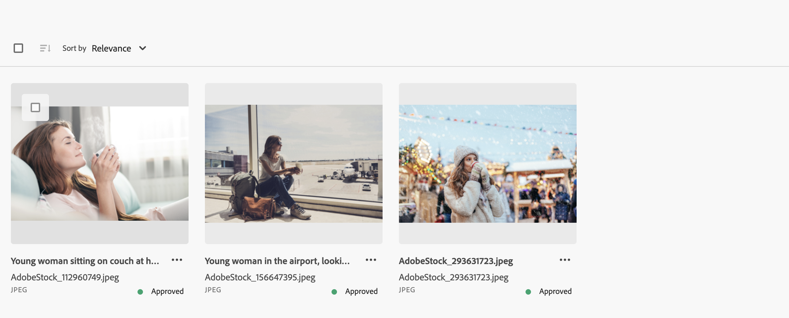

# Cercare risorse in [!DNL Assets view] {#search-assets}

>[!CONTEXTUALHELP]
>id="assets_search"
>title="Cerca risorse"
>abstract="Per cercare le risorse, puoi specificare una parola chiave nella barra di ricerca o filtrare le risorse in base al loro stato, al tipo di file, al tipo MIME, alla dimensione e alle date di creazione, modifica e scadenza. Oltre ai filtri standard, puoi anche applicare filtri personalizzati. Puoi salvare i risultati filtrati come Ricerca salvata o Raccolta avanzata."
>additional-url="https://experienceleague.adobe.com/docs/experience-manager-assets-essentials/help/manage-collections.html?lang=it#manage-smart-collection" text="Creare Raccolte avanzate"

[!DNL Assets view] fornisce una funzione di ricerca efficace e attiva per impostazione predefinita. Si tratta di una ricerca full-text completa. La potente funzionalità di ricerca consente di trovare rapidamente la risorsa appropriata e velocizza le attività relative ai contenuti. [!DNL Assets view] consente di effettuare ricerche full-text, anche nei metadati, quali tag avanzati, titolo, data di creazione e copyright.

Per cercare le risorse:

* Fai clic nella casella di ricerca nella parte superiore della pagina. Per impostazione predefinita, la ricerca viene eseguita all’interno della cartella attuale. Effettua una delle operazioni seguenti:

  

   * Cerca utilizzando una parola chiave e, se necessario, cambia la cartella. Premi Invio.

   * Per iniziare a lavorare su una risorsa visualizzata di recente, fai clic nella casella di ricerca e seleziona una delle risorse visualizzate di recente che vengono proposte.

## Filtrare i risultati della ricerca {#refine-search-results}

Puoi perfezionare i risultati della ricerca per trovare le risorse rilevanti applicando più filtri. Questi filtri, configurati da un amministratore, si basano su file, cartelle e raccolte. Vedere [Personalizzare i filtri di ricerca](custom-search-filters.md).

Puoi filtrare i risultati della ricerca in base ai seguenti parametri.

* Stato risorsa: filtra i risultati della ricerca in base allo stato delle risorse, scegliendo tra `Approved`, `Rejected` o `No Status`.
* Tipo file: filtra i risultati della ricerca in base ai tipi di file supportati come `Images`, `Documents` e `Videos`.
* Tipo MIME: filtra uno o più formati di file supportati. <!-- TBD:  [supported file formats](/help/using/supported-file-formats.md). -->
* Dimensioni immagine: fornisci una o più dimensioni minima e massima per filtrare le immagini. Le dimensioni vengono fornite in pixel e non corrispondono alle dimensioni del file delle immagini.
* Data di creazione: la data di creazione della risorsa, specificata nei metadati. Il formato di data standard è `yyyy-mm-dd`.
* Data di modifica: data dell’ultima modifica delle risorse. Il formato di data standard è `yyyy-mm-dd`.
* Data di scadenza: filtra i risultati della ricerca in base allo stato `Expired` delle risorse. Inoltre, è possibile specificare un intervallo di date di scadenza per le risorse per filtrare ulteriormente i risultati della ricerca.
* Filtri personalizzati: [Aggiungi filtri personalizzati](#custom-filters) all&#39;interfaccia utente di visualizzazione di Assets. Per perfezionare i risultati della ricerca, applica i filtri personalizzati in aggiunta a quelli standard.

Puoi ordinare le risorse trovate in ordine crescente o decrescente per `Name`, `Relevance`, `Size`, `Modified` e `Created`. Per impostazione predefinita, le risorse trovate sono ordinate per `Relevance`.

## Gestire i filtri personalizzati {#custom-filters}

**Autorizzazioni richieste:** `Can Edit`, `Owner` o Amministratore.

La vista Assets consente inoltre di aggiungere filtri personalizzati all’interfaccia utente. Puoi applicare i filtri personalizzati in aggiunta ai [filtri standard](#refine-search-results), per perfezionare i risultati della ricerca.

La vista Assets fornisce i seguenti filtri personalizzati:

<table>
    <tbody>
     <tr>
      <th><strong>Nome filtro personalizzato</strong></th>
      <th><strong>Descrizione</strong></th>
     </tr>
     <tr>
      <td>Titolo</td>
      <td>Filtra le risorse utilizzando il titolo della risorsa. Il titolo specificato nei criteri di ricerca con distinzione tra maiuscole e minuscole deve corrispondere esattamente al titolo della risorsa da visualizzare nei risultati.</td>
     </tr>
     <tr>
      <td>Nome</td>
      <td>Filtra le risorse utilizzando il nome del file della risorsa. Il nome specificato nei criteri di ricerca con distinzione tra maiuscole e minuscole deve corrispondere esattamente al nome file della risorsa da visualizzare nei risultati.</td>
     </tr>
     <tr>
      <td>Dimensione risorsa</td>
      <td>Filtra le risorse definendo un intervallo di dimensioni, in byte, nei criteri di ricerca per visualizzare la risorsa nei risultati.</td>
     </tr>
     <tr>
      <td>Tag previsti</td>
      <td>Filtra le risorse utilizzando i tag avanzati della risorsa. Il nome del tag avanzato specificato nei criteri di ricerca con distinzione tra maiuscole e minuscole deve corrispondere esattamente al nome di quello della risorsa da visualizzare nei risultati. Non è possibile specificare più tag avanzati nei criteri di ricerca.</td>
     </tr>    
    </tbody>
   </table>

<!--
   You can use a wildcard operator (*) to enable Assets view to display assets in the results that partially match the search criteria. For example, if you define <b>ma*</b> as the search criteria, Assets view displays assets with title, such as, market, marketing, man, manchester, and so on in the results.

   You can use a wildcard operator (*) to enable Assets view to display assets in the results that partially match the search criteria.

   You can use a wildcard operator (*) to enable Assets view to display assets in the results that partially match the search criteria. You can specify multiple smart tags separated by a comma in the search criteria.

   -->

### Aggiungere filtri personalizzati {#add-custom-filters}

Per aggiungere filtri personalizzati:

1. Fai clic su **[!UICONTROL Filtri]**.

1. Nella sezione **[!UICONTROL Filtri personalizzati]**, fai clic su **[!UICONTROL Modifica]** o **[!UICONTROL Aggiungere filtri]**.

   

1. Nella finestra di dialogo **[!UICONTROL Gestione filtri personalizzati]** seleziona i filtri da aggiungere all’elenco di filtri esistente. Seleziona **[!UICONTROL Filtri personalizzati]** per selezionare tutti i filtri.

1. Fai clic su **[!UICONTROL Conferma]** per aggiungere i filtri all’interfaccia utente.

### Rimuovere i filtri personalizzati {#remove-custom-filters}

Per rimuovere i filtri personalizzati:

1. Fai clic su **[!UICONTROL Filtri]**.

1. Nella sezione **[!UICONTROL Filtri personalizzati]**, fai clic su **[!UICONTROL Modifica]**.

1. Nella finestra di dialogo **[!UICONTROL Gestione filtri personalizzati]** deseleziona i filtri da rimuovere dall’elenco di filtri esistente.

1. Fai clic su **[!UICONTROL Conferma]** per rimuovere i filtri dall’interfaccia utente.

## Ricerca IA {#ai-search}

La ricerca basata su IA è una funzionalità di ricerca avanzata che comprende il significato e l’intento alla base della query di un utente, anziché fare affidamento sulle corrispondenze esatte tra parole chiave. Utilizza l’intelligenza artificiale (IA) e l’apprendimento automatico per fornire risultati più precisi e in base al contesto.

A differenza della ricerca tradizionale basata su parole chiave, che cerca termini esatti, la ricerca basata su IA interpreta le relazioni tra parole, concetti e intento dell’utente. In questo modo gli utenti possono trovare ciò che stanno cercando, anche se la query è formulata in modo diverso, contiene errori di battitura o è in un’altra lingua.

Alcuni vantaggi, tra cui:

* **Supporto multilingue**: eseguire ricerche in più lingue senza richiedere traduzioni esatte. Gli utenti possono trovare contenuti rilevanti indipendentemente dal linguaggio di query.

* **Gestisce gli errori di ortografia**: interpreta gli errori di battitura e di ortografia, garantendo risultati accurati anche con input imperfetto.

* **Comprende i sinonimi**: fornisce risultati per termini e frasi correlati, pertanto gli utenti non devono indovinare la parola chiave corretta.

* **Ricerca in base al contesto**: riconosce l&#39;intento di una query, non solo le parole esatte.

### Esempi di ricerca basata su IA {#examples-ai-search}

**Prompt di esempio**: *Donna che beve caffè*

La ricerca tradizionale basata su parole chiave cerca corrispondenze esatte tra i metadati delle risorse, ad esempio `Woman`, `drinking`, `Coffee`, e restituisce risorse che includono tutti questi termini nei metadati.

Tuttavia, la ricerca basata su IA corrisponde a parole simili come `Girl`, `Lady` nel caso di `Woman` e `Cappuccino` e `Latte` nel caso di `Coffee`.

Analogamente, è possibile specificare questa richiesta in spagnolo o inserire erroneamente `Woman` come `Wman` e ottenere comunque gli stessi risultati.

## Cercare risorse utilizzando [!DNL Adobe Firefly] {#search-firefly}

Puoi cercare una risorsa non disponibile in qualsiasi cartella di risorse utilizzando la funzione di ricerca risorse [!DNL Adobe Firefly] in [!DNL Experience Manager Assets]. Questa consente di generare in modo efficiente e in tempo reale le risorse che non sono memorizzate nelle cartelle risorse.

### Prima di iniziare {#search-assets-firefly-prereqs}

È necessario disporre di un abbonamento attivo a [!DNL Adobe Express].

### Generare risorse {#generate-assets-firefly}

Per generare nuove risorse tramite [!DNL Adobe Firefly]:

1. accedi all’area di lavoro di [!DNL AEM Assets].

1. Immetti il nome della risorsa nella barra di ricerca. Ad esempio, supponiamo di cercare una risorsa utilizzando la parola chiave `Bugatti Type 57`. Durante la ricerca della risorsa, non viene trovato alcun risultato, perché la risorsa non è presente in nessuna cartella delle risorse. Per generare le risorse tramite IA, fai clic su **[!UICONTROL Genera con Firefly]**. Viene visualizzata la schermata [!DNL Adobe Firefly].

   

   Le nuove risorse sono state generate correttamente. È, inoltre, possibile modificare la descrizione dell’immagine immettendo il nuovo prompt di testo nella casella Descrizione. [Scopri come scrivere un buon prompt di intelligenza artificiale per generare contenuti straordinari e rilevanti](https://helpx.adobe.com/it/firefly/using/tips-and-tricks.html). In alternativa, è possibile [modificare l&#39;immagine con varie altre funzionalità, come la modifica dello stile, delle dimensioni dell&#39;immagine e altro ancora](https://helpx.adobe.com/it/firefly/using/text-to-image.html).

   

1. Seleziona un’immagine da salvare. Fai clic su **[!UICONTROL Salva]** per salvare le risorse nella cartella preferita e accedervi facilmente.

1. Viene visualizzato il modulo Salva risorsa. Specifica i campi seguenti:

   * Immetti un nome per il file nel campo **Salva con nome**.
   * Seleziona una cartella di destinazione.
   * Fornisci dettagli quali nome del progetto o della campagna, parole chiave, canali, arco temporale e area geografica.

   

1. Fai clic su **Salva come nuova risorsa** per salvare le risorse.

### Caricare le risorse {#upload-assets-firefly}

Per caricare la risorsa generata nell’archivio delle risorse:

1. Fai clic su **[!UICONTROL Carica]**.
1. Seleziona la cartella risorse in cui devi caricare la risorsa e fai clic su **[!UICONTROL Seleziona cartella]**.
   

## Ricerche salvate {#saved-search}

La funzionalità di ricerca di [!DNL Assets view] è semplice. Nella casella di ricerca, non puoi solo immettere una parola chiave e premere Invio per visualizzare i risultati, puoi effettuare rapidamente una nuova ricerca con un solo clic, richiamando parole chiave già utilizzate di recente.

Puoi anche filtrare i risultati della ricerca in base a criteri specifici, secondo i metadati e il tipo di risorse. [!DNL Assets view] consente di salvare i parametri dei filtri utilizzati di frequente, per migliorare l’esperienza di ricerca. Puoi quindi selezionare una ricerca salvata per eseguirla di nuovo applicandone il filtro con un solo clic.

Per salvare una ricerca, cerca le risorse, applica uno o più filtri e fai clic su **[!UICONTROL Salva come]** > **[!UICONTROL Ricerca salvata]** nel pannello [!UICONTROL Filtri.] Puoi anche fare clic su **[!UICONTROL Salva come]** e selezionare **[!UICONTROL Raccolta avanzata]** per salvare i risultati come Raccolta avanzata. Per ulteriori dettagli, consulta [Creare una raccolta avanzata](manage-collections.md#create-a-smart-collection).

<!-- TBD: Search behavior. Full-text search. Ranking and rank boosts. Hidden assets.
Report poor UX that users can only save a filtered search and not a simple search.
.
Are other supported files fully indexed and support full-text search? Eg. audio/videos files can at best have metadata indexed.
Anything about ranking of assets displayed in search results?

What about temporarily hiding an asset (suspending search on it) from the search results? If an asset is undergoing review collaboration, should it be used by others? Should it be hidden in search?

When userA is searching and userB add an asset that matches search results, will the asset display in search as soon as userA refreshes the page? Assuming indexing is near real-time. May not be so for bulk uploads.
-->

## Utilizzare i risultati della ricerca {#work-with-search-results}

Puoi selezionare le risorse da visualizzare nei risultati della ricerca ed effettuare le seguenti operazioni:

* **Trova immagine simile**: trova una risorsa immagine simile nell’interfaccia utente di Assets in base ai metadati e ai tag avanzati.

* **Dettagli**: visualizza e modifica le proprietà della risorsa.

* **Scarica**: scarica una risorsa.

* **Aggiungi a raccolta**: aggiungi la risorsa selezionata a una raccolta.

* **Fissa in Accesso rapido**: [fissa una risorsa](my-workspace-assets-view.md) per un accesso più rapido quando necessario in un secondo momento. Tutti gli elementi fissati vengono visualizzati nella sezione **Accesso rapido** dell’area di lavoro personale.

* **Apri in Adobe Express**: modifica un’immagine nell’editor Adobe Express integrato, dalla schermata di Adobe Experience Manager Assets.

* **Modifica**: modifica l’immagine utilizzando Adobe Express.

* **Condividi collegamento**: [condividi collegamenti](share-links-for-assets-view.md) per una risorsa con altri utenti in modo che possano accedervi e scaricarla.

* **Elimina**: elimina una risorsa.

* **Copia**: copia una risorsa in un percorso cartella diverso.

* **Sposta**: sposta una risorsa in un percorso cartella diverso.

* **Rinomina**: rinomina una risorsa.

* **Copia in librerie**: aggiungi una risorsa alla libreria.

* **Assegna attività**: assegna attività agli utenti per una risorsa.

* **Osserva**: [monitora le operazioni](https://experienceleague.adobe.com/it/docs/experience-manager-cloud-service/content/assets/manage/search-assets) eseguite su una risorsa.

## Configurare la pagina Home Cerca prima {#configuring-search-first-homepage}

La vista Assets consente di selezionare la pagina di destinazione predefinita per la tua organizzazione. Quando si utilizza la pagina Home Cerca prima, è possibile personalizzare il marchio della pagina configurando le immagini dello sfondo e del logo in base al proprio marchio.

Per configurare la pagina Home Cerca prima, esegui i passaggi seguenti:

1. Passa a **[!UICONTROL Impostazioni]** > **[!UICONTROL Impostazioni generali]**.
1. Seleziona **[!UICONTROL Cerca prima]**. Viene aperta la configurazione correlata Cerca prima. È possibile impostare l’[allineamento](#setting-alignment-search-bar) o [impostare l’immagine di sfondo e il logo](#setting-background-image-and-logo) della pagina Home.

### Impostazione dell’allineamento della barra di ricerca {#setting-alignment-search-bar}

[!DNL Assets view] consente di modificare l’allineamento della barra di ricerca. È possibile fare in modo che la barra di ricerca venga visualizzata al centro o in alto. Seleziona l’allineamento appropriato e fai clic su **[!UICONTROL Salva]**.

### Impostazione dell’immagine di sfondo e del logo nella pagina Home {#setting-background-image-and-logo}

È possibile aggiungere il logo del brand e l’immagine di sfondo alla pagina Home “Cerca prima”. Esegui i passaggi seguenti:

1. Accedi alla sezione **[!UICONTROL Immagine di sfondo e logo]** nella **[!UICONTROL pagina Home]**.
1. Fai clic su **[!UICONTROL Sostituisci]** per sfogliare le immagini dell’archivio delle risorse esistenti.
1. Fai clic su **[!UICONTROL Salva]**. Visualizza l’[anteprima](#preview-configured-homepage) delle modifiche per esaminarle.

### Visualizzare l’anteprima della pagina Home configurata {#preview-configured-homepage}

È possibile visualizzare un’anteprima per controllare il layout e la formattazione della pagina Home Cerca prima. Utilizzando **[!UICONTROL Anteprima]**, è possibile correggere il layout o apportare modifiche in base alle necessità. Per visualizzare in anteprima la pagina Home configurata, esegui i passaggi seguenti:

1. Fai clic su **[!UICONTROL Impostazioni generali]** e seleziona **[!UICONTROL Cerca prima]**.
1. Accedi a **[!UICONTROL Personalizza la pagina Home Cerca prima]** e fai clic su **[!UICONTROL Anteprima]**. Attiva o disattiva **[!UICONTROL Tema scuro]** per visualizzare l’anteprima della pagina Home con tema scuro o chiaro.
1. Fai clic su **[!UICONTROL Chiudi]** per chiudere la schermata di anteprima.

   

<!--

## Contextual Search {#contextual-search}

You can also search assets available in the repository by defining text prompts. Experience Manager Assets automatically transforms those text prompts to search filters and displays the search results. You can view and modify automatic filters using the Filters Pane to further narrow down the search results.

### Access Contextual Search {#access-contextual-search}

To access Contextual Search in Experience Manager Assets:

1. Click **[!UICONTROL Search]** in the left pane.

   

1. Define the text prompt in the Search text box and click **[!UICONTROL Contextual Search]**.

   

   [!DNL Experience Manager Assets] displays the search results.

### Supported filters {#supported-filters}

Contextual Search supports the following filters out-of-the-box. Base your text prompts on these filters to view appropriate search results.

* Image height

* Image width

* File type: image, document, video, or folder.

* MIME type: JPG, PNG, TIFF, GIF, MP4, PDF, PPTX, DOCX or XLSX

* Created date

* Modified date

* Expiration date

* Asset status: Approved, Rejected, or all

* Expired assets

### Examples for the text prompts {#text-prompts-examples}

**Example 1**

**Text Prompt**: Images created this month.

[!DNL Experience Manager Assets] applies the following filters automatically and displays the search results:

**Example 2**

**Text prompt**: Images at least 200px tall and 100px wide with beach and clear sky.

[!DNL Experience Manager Assets] applies the following filters automatically and displays the search results:

**Example 3**

**Text prompt**: I need images of blue sky that are 1500 and 2500 pixel height and created in the past month that is not expired and approved.

[!DNL Experience Manager Assets] applies the following filters automatically and displays the search results:

The following video illustrates the end-to-end process from accessing the Contextual Search User Interface to defining text prompts, and viewing the search results.

>[!VIDEO](https://video.tv.adobe.com/v/3428407)

### Disable Contextual Search {#disable-contextual-search}

Administrators also have the option to disable Contextual Search for users in your organization. To do so, execute the following steps:

1. Navigate to **[!UICONTROL Settings]** > **[!UICONTROL General Settings]**.

1. In the [!UICONTROL Contextual Search] section, turn off the **[!UICONTROL Enable Contextual Search for your organization]** toggle to disable the Contextual Search feature for all users in your organization.  

### Contextual Search feedback {#contextual-search-feedback}

If you need to provide feedback on the Contextual Search feature, click   and click the Feedback icon. Select the feedback type, specify the subject and description, and click **[!UICONTROL Submit]**.

-->

## Passaggi successivi {#next-steps}

* [Guarda un video per cercare le risorse nella visualizzazione Assets](https://experienceleague.adobe.com/docs/experience-manager-learn/assets-essentials/basics/using.html?lang=it)

* Fornisci feedback sui prodotti utilizzando l’opzione [!UICONTROL Feedback] disponibile nell’interfaccia utente della vista Risorse

* Fornisci feedback sulla documentazione utilizzando [!UICONTROL Modifica questa pagina],  o [!UICONTROL Segnala un problema],  disponibili sulla barra laterale a destra.

* Contatta il [Servizio clienti](https://experienceleague.adobe.com/it?support-solution=General&lang=it#support)

