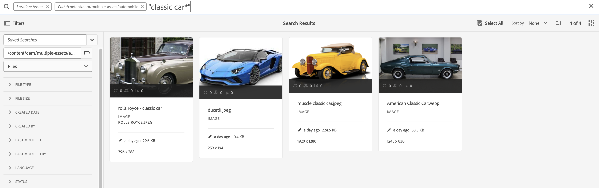

# Best practice per la ricerca AEM

[!DNL Adobe Experience Manager Assets] fornisce solidi metodi di ricerca delle risorse che consentono di velocizzare i contenuti. Talvolta, trovare la risorsa giusta può essere difficile e richiedere tempo. Pertanto, cerca le risorse in [!DNL Adobe Experience Manager Assets] è fondamentale per l’utilizzo di un sistema di gestione delle risorse digitali, che sia destinato all’ulteriore utilizzo da parte dei creativi, alla gestione affidabile delle risorse da parte degli utenti aziendali e dei professionisti del marketing o all’amministrazione da parte degli amministratori DAM.

Questo documento della Guida contiene le best practice per la ricerca AEM con l’aiuto di vari scenari per aiutare gli utenti AEM a eseguire ricerche di livello base o avanzato.

## Ricerca Experienci Manager di accesso {#access-experience-manager-search}

Di seguito sono riportati i passaggi di base da eseguire in Experience Manager prima di iniziare la ricerca:

* In **Visualizzazione amministratore**, vai a Risorse > File in Experience Manager e fai clic sull’icona di ricerca nella barra superiore. In alternativa, utilizza una barra (/) per aprire il campo Ricerca Omni.
In **Visualizzazione risorse**, la barra di ricerca è visibile nella parte superiore e accessibile direttamente.
* `Location:Assets` e `Path:/content/dam` sono preselezionati per limitare l’ambito di ricerca all’archivio Experience Manager Assets. Se passi a un’altra cartella, `Path:/content/dam/<folder name>` viene visualizzato nel campo Ricerca Omni per limitare l’ambito di ricerca alla cartella corrente.

## Ricerca di base {#basic-search}

**Scenario 1: eseguire una ricerca di base utilizzando `classic car` come parola chiave di ricerca.**

La ricerca per parola chiave non fa distinzione tra maiuscole e minuscole ed è una ricerca full-text nei campi di metadati inclusi nella risorsa *ricerca full-text* index (configurabile nella definizione dell’indice). Se si utilizzano più parole chiave, **AND è l&#39;operatore predefinito tra le parole chiave, quindi, considera una ricerca per &#39;auto classica&#39; come &#39;auto e classica&#39;**.

I risultati della ricerca che corrispondono a tutti i termini di ricerca nei campi di metadati vengono visualizzati per primi, seguiti dai risultati della ricerca che corrispondono a qualsiasi termine di ricerca nei tag avanzati. L’ordine approssimativo di visualizzazione dei risultati della ricerca è:

1. Corrisponde a `Classic Car` nei vari campi di metadati.
2. Corrisponde a `Classic Car` negli smart tag.
3. Corrisponde a `Classic` o di `Car` negli smart tag.

Specifica `classic car` come parola chiave di ricerca e fare clic su Cerca. È possibile visualizzare i suggerimenti di ricerca in un elenco a discesa durante la digitazione della parola chiave. I suggerimenti di ricerca si basano sul contenuto dell’indice di ricerca della distribuzione dell’Experience Manager. Se non riesci a visualizzare le risorse appropriate nel menu a discesa, premi Invio per visualizzare l’elenco dei risultati. I risultati sono ordinati in base alla rilevanza, a partire dalle corrispondenze più vicine.

<!---->

È possibile rendere la ricerca più specifica aggiungendo la parola chiave di ricerca tra virgolette doppie (&quot;&quot;). Questa ricerca include solo le risorse che contengono insieme i termini specificati. I criteri di ricerca hanno l’aspetto di - `"classic car"`. Pertanto, i risultati della ricerca con entrambi i termini `classic` e `car` vengono visualizzati.

<!---->

La ricerca mostra risultati simili se si lavora nel **[!UICONTROL Visualizzazione risorse]** anche.

>[!VIDEO](https://video.tv.adobe.com/v/3425489)

## File e cartelle {#files-folders}

**Scenario 2: cercare tutti i file utilizzando `classic car` parola chiave all&#39;interno di `automobile` cartella.**

Il filtro File e cartelle consente di limitare la ricerca. Utilizza le opzioni File, Cartelle o File e cartelle disponibili nell’elenco a discesa in base alle tue esigenze. L’opzione per scegliere tra File, Cartelle o File e Cartelle è accessibile nella sezione **[!UICONTROL Visualizzazione amministratore]** solo. In **[!UICONTROL Visualizzazione risorse]**, vai a [!UICONTROL Percorso] e sfogliare la cartella in cui si desidera eseguire una ricerca.

* Utilizza il **[!UICONTROL File]** quando è necessario cercare in modo specifico i file in un percorso specifico all’interno dell’archivio. Non è necessario cercare le cartelle all’interno del percorso definito.
* Utilizza il **[!UICONTROL Cartelle]** quando è necessario limitare la ricerca alle cartelle in un percorso specifico.
* Utilizza il **[!UICONTROL File e cartelle]** se devi cercare tutte le risorse disponibili nel percorso specificato all’interno dell’archivio.

Per ottenere questo scenario, esegui i passaggi seguenti:

1. Specifica `classic car` come parola chiave di ricerca e fare clic su Cerca.
2. Fai clic su Filtri e definisci il percorso della cartella per `automobile` cartella. Ad esempio: `/content/dam/multiple-assets/automobile`
Seleziona la cartella dal percorso e passa alla cartella richiesta se desideri eseguire ricerche all’interno della cartella specifica.
3. Selezionare File dall&#39;elenco a discesa per visualizzare tutti i file con la parola chiave `classic car`.

<!---->

>[!VIDEO](https://video.tv.adobe.com/v/3425487)

## Operatori {#operators}

**Scenario 3: cercare `Classic Car` o `Car` parole chiave che utilizzano varie combinazioni di operatori per limitare la ricerca.**

Per eseguire lo scenario precedente in **[!UICONTROL Visualizzazione amministratore]**, puoi utilizzare una combinazione di vari operatori per migliorare la tua esperienza di ricerca. Gli operatori supportati sono:

### Operatore AND {#and-operator}

L’operatore AND è l’operatore predefinito tra due parole chiave in Omni Search. Ad esempio, quando si digita `classic car` nella barra di ricerca, i risultati con `classic` e `car` le parole chiave vengono visualizzate nei risultati della ricerca per impostazione predefinita.

### Operatore OR {#or-operator}

Se desideri essere specifico con i risultati della ricerca e desideri un’opzione nei risultati della ricerca, puoi utilizzare l’operatore OR. Ad esempio, il `classic OR car` parola chiave fornisce i risultati della ricerca con una delle parole chiave nei relativi metadati.

### Operatore NOT {#not-operator}

Per recuperare i risultati escludendo alcune parole chiave, è possibile utilizzare l&#39;operatore NOT. L’operatore NOT utilizza il simbolo del trattino (-) per indirizzare la ricerca AEM a ciò che si desidera escludere dai risultati della ricerca. Ad esempio, il `car - classic` query di ricerca che specifica i metadati contenenti `car` ma non `classic`.

Allo stesso modo, è possibile cercare tutte le auto ma non jeep. La query si presenta come segue: `car - jeep`. Visualizza tutte le risorse con metadati `car` ma esclude le risorse con metadati `jeep`.

**[!UICONTROL Visualizzazione risorse]** non supporta l’utilizzo di Operatori.

## Caratteri jolly {#wildcards}

I caratteri jolly vengono utilizzati per sostituire uno o più caratteri nella ricerca. Per eseguire lo scenario precedente in **[!UICONTROL Visualizzazione amministratore]**, è possibile utilizzare una combinazione di vari caratteri jolly per migliorare l&#39;esperienza di ricerca. Per eseguire la ricerca sono disponibili due caratteri jolly: punto interrogativo (?) e Asterisco (*) Il simbolo del punto interrogativo viene utilizzato per cercare un singolo carattere, mentre il simbolo asterisco viene utilizzato per cercare più caratteri.

### Punto interrogativo (?) {#question-mark}

Il simbolo del punto interrogativo può essere utilizzato come operatore condizionale per semplificare la ricerca in Experience Manager.

* `car?` query corrisponde alla parola con un carattere dopo car. Ad esempio, il carrello.
* `?car` query fa corrispondere la parola con un carattere prima di car. Ad esempio, cicatrice.
* `car????` query corrisponde alla parola con quattro caratteri dopo car. Ad esempio, un lavaggio di auto.

### Asterisco (*) {#asterisk}

L&#39;asterisco è un operatore jolly utilizzato per ampliare la ricerca digitando un numero inferiore di caratteri. Quando conosci i caratteri iniziali della risorsa che stai cercando, ma non conosci il resto, puoi utilizzare l’operatore asterisco nella ricerca. Ad esempio, il `*car` la query restituisce tutte le risorse con l’auto postfix disponibile nei relativi metadati. I risultati potrebbero essere auto classiche, auto sportive, auto classiche e sportive, e così via. Di seguito sono riportati alcuni esempi di utilizzo dell’operatore asterisco in vari modi:

* `*car*` restituisce tutte le combinazioni possibili.
* `car*` restituisce i cespiti con il lavaggio, il vettore, il trasporto e così via.
* `*car` restituisce risorse con auto moderne, auto sportive e così via.

>[!VIDEO](https://video.tv.adobe.com/v/3425488)

**[!UICONTROL Visualizzazione risorse]** non supporta l&#39;utilizzo di caratteri jolly.

## Filtri {#filters}

In Adobe Experience Manager sono disponibili vari filtri di ricerca che è possibile utilizzare per perfezionare e segmentare la ricerca utilizzando una query con ambito. Quando non sei sicuro del titolo o della metadescrizione di una risorsa, puoi utilizzare vari filtri di ricerca per rendere la ricerca più rilevante. È possibile utilizzare i filtri di ricerca con o senza digitare una parola chiave. Per aprire il pannello dei filtri in **[!UICONTROL Visualizzazione amministratore]**, fare clic su **GlobalNav** e seleziona **[!UICONTROL Filtri]**. Per aprire il pannello dei filtri in **[!UICONTROL Visualizzazione risorse]**, fai clic su [!UICONTROL Filtri] accanto alla barra di ricerca.

Puoi selezionare uno o più filtri per perfezionare la ricerca in Adobe Experience Manager.
<!--The following filters are available out of the box for all the users of Experience Manager:

* File Type Search Filters  
* File Size Search Filters 
* Date of Creation 
* Created by 
* Last Modified date 
* Last Modified by 
* Search by Language 
* Search by Status 
* Search based on Orientation 
* Search by Style 
* Search based on insights 
* Search by Adobe Stock 
* Color specific Asset search 
* Content fragment model 
 -->

<!--**Scenario 5: Search for an Asset named 'classic car' in Black color which has either meta description or a similar asset in Japanese language.**  
 
To perform a search on such a requirement, type 'classic car' in the search bar.  Navigate to the filters panel and expand the language search filter drop-down. Type "ja-jp", which represents the Japanese language. Expand the 'Asset Color' filter and select black color or add the hexadecimal code for the black color (#000000).

-->

**Scenario 4: cercare i documenti di tipo file PDF non pubblicati con `classic car` parola chiave.**

Esegui i seguenti passaggi in **[!UICONTROL Visualizzazione amministratore]**:

1. Tipo `classic car` nella barra di ricerca.
1. Vai a Filtri. Sotto [!UICONTROL Tipo di file], espandi [!UICONTROL Documenti], espandi ulteriormente [!UICONTROL Elaborazione testi].
1. Seleziona [!UICONTROL PDF].
1. Vai a [!UICONTROL Stato] > [!UICONTROL Pubblica] > [!UICONTROL Non pubblicato].

<!---->

Esegui i seguenti passaggi in **[!UICONTROL Visualizzazione risorse]**:

1. Tipo `classic car` nella barra di ricerca.
1. Vai a Filtri. Sotto [!UICONTROL Tipo MIME], seleziona [!UICONTROL PDF].
1. Vai a [!UICONTROL Stato risorsa], seleziona [!UICONTROL Tutti] per includere tutte le risorse pubblicate e non pubblicate.

**Scenario 5: cercare tutte le immagini tranne PNG**

Quando non sei sicuro del titolo o della metadescrizione di una risorsa, puoi utilizzare vari filtri di ricerca per rendere la ricerca più rilevante. Ad esempio, per cercare le risorse in **[!UICONTROL Visualizzazione amministratore]**, effettua le seguenti operazioni:

1. Vai ai filtri di ricerca.
1. Vai a Filtri. Sotto [!UICONTROL Tipo di file], espandi [!UICONTROL Immagini] e seleziona [!UICONTROL Abilitato per il Web]
1. Deselezionare PNG.

<!---->

Per cercare le risorse utilizzando lo scenario menzionato in **[!UICONTROL Visualizzazione risorse]**, effettua le seguenti operazioni:

1. Vai ai filtri di ricerca.
1. Vai a Filtri. Sotto [!UICONTROL Tipo MIME], seleziona tutti i tipi MIME specificati, ma deseleziona PNG.

>[!VIDEO](https://video.tv.adobe.com/v/3425486)

## Ricerca avanzata {#advanced-search}

La ricerca AEM consente di creare query di ricerca complesse con meno sforzo. Di seguito sono riportati vari esempi per facilitare la creazione di query di ricerca complesse:

**Scenario 6: cercare tutti i documenti nel repository di Experience Manager con `classic car` nei loro metadati. Il contenuto del documento deve `classic car` parola chiave.**

Adobe Experience Manager consente di aggiungere più criteri alla ricerca. È possibile utilizzare una combinazione di parole chiave, operatori e filtri per limitare i risultati della ricerca.

Per eseguire una ricerca per lo scenario 6:

1. Digita il `classic car` nella barra di ricerca.
2. Passa al pannello dei filtri e seleziona Documenti in Tipo file.
3. Ottimizzare la ricerca utilizzando il carattere jolly asterisco. Tipo `"classic car"` per cercare tutte le risorse che contengono `classic car` parola chiave.

<!---->

Impossibile eseguire lo scenario 6 in **[!UICONTROL Visualizzazione risorse]** in quanto non supporta l&#39;utilizzo di caratteri jolly.

**Scenario 7: cercare tutti i documenti nel repository di Experienci Manager in cui il contenuto del documento deve includere `car` ma escludi `classic`. La stessa condizione si applica ai metadati di una risorsa.**

Per eseguire una ricerca per lo scenario 7:

Digita il `car - classic` nella barra di ricerca. Passa al pannello dei filtri e seleziona Documenti in Tipo file. L’ordine di priorità della ricerca si basa sui seguenti elementi: Priorità 1: Priorità metadati 2: Tag avanzati

<!---->

Impossibile eseguire lo scenario 7 in **[!UICONTROL Visualizzazione risorse]** in quanto non supporta l&#39;utilizzo di caratteri jolly.

<!--
**Scenario 9: Search for all images except PNG**

When you are unsure about the title or meta description of an asset, you can use various search filters to make your search more relevant. Follow the steps below:

1. Go to search filters. 
1. Under [!UICONTROL File Type], expand [!UICONTROL Images] and select [!UICONTROL Web enabled]
1. Deselect PNG.

**Method 1:** Go to search bar and type `images - PNG`. All the images appear excluding PNG.

**Method 2:** Go to search filters. Under [!UICONTROL File Type], expand [!UICONTROL Images] > select [!UICONTROL Web enabled] > deselect PNG.

-->

**Scenario 8: cercare i tag di metadati con la jeep dei metadati**

Puoi acquisire un criterio specifico utilizzando vari filtri di ricerca. Tag è una parola chiave assegnata a una risorsa per renderla identificabile in un numero elevato di risorse. Ad esempio, in questo scenario, cerca le risorse con *jeep* tag in esso contenuti. A questo scopo, digita `tags:jeep` nella barra di ricerca. Solo le risorse che soddisfano questi criteri sono elencate nei risultati della ricerca.

<!---->

La ricerca mostra risultati simili se si lavora nel **[!UICONTROL Visualizzazione risorse]** anche.

>[!VIDEO](https://video.tv.adobe.com/v/3425490)

**Scenario 9: trovare una corrispondenza simile per un&#39;auto di colore rosso**

Durante la ricerca in base all’AEM, puoi filtrare i risultati mostrando risorse simili a quelle selezionate. È possibile utilizzare **Trova simile** per limitare la ricerca alla corrispondenza esatta o simile della risorsa cercata. In questo modo è possibile trovare risorse con tag avanzati simili a quelli della risorsa selezionata. Ad esempio, per cercare risorse simili, effettua le seguenti operazioni:

1. Cerca la risorsa in base alle tue esigenze.
1. Passa il puntatore del mouse sulla risorsa > fai clic sui puntini di sospensione > seleziona [!UICONTROL Trova simile].
o Seleziona la risorsa > passa ai puntini di sospensione in alto a destra > seleziona [!UICONTROL Trova simile].

   

1. Osserva la barra di ricerca. La miniatura della risorsa selezionata viene visualizzata sulla barra di ricerca per indicare i requisiti di ricerca. Di conseguenza, restituisce risorse con tag avanzati simili.

**[!UICONTROL Visualizzazione risorse]** non supporta [!UICONTROL Trova simile] opzione.

## Facet di ricerca personalizzati {#custom-search-facets}

I facet di ricerca in Adobe Experience Manager consentono di cercare le risorse in più modi anziché in un unico ordine tassonomico o predeterminato. Puoi personalizzare i facet di ricerca e aggiungere predicati in base alle tue esigenze. Letto [Facet di ricerca](https://experienceleague.adobe.com/docs/experience-manager-cloud-service/content/assets/admin/search-facets.html?lang=en#) per la guida dettagliata sull’aggiunta di un predicato personalizzato.

<!--**Scenario 10: Search assets based on Sku ID**
to be added later
-->

**Scenario 10: cercare risorse specifiche in base alla data dell’ultima modifica o scadenza**

I vincoli di data consentono di limitare la ricerca personalizzata a un determinato periodo, ad esempio utilizzando i filtri di ricerca per periodo di tempo. Per cercare il requisito precedente, digitare `classic car` nella barra di ricerca. Seleziona l’intervallo di date nel [!UICONTROL Data di creazione] e [!UICONTROL Ultima modifica] filtri per data.

La ricerca mostra risultati simili se si lavora nel [!UICONTROL Visualizzazione risorse] anche.

## Aumentare la rilevanza delle parole chiave {#boosting-keywords}

Puoi migliorare la pertinenza delle parole chiave per determinate risorse in modo da aumentare le ricerche basate sulle parole chiave. In altre parole, le immagini per le quali vengono promosse parole chiave specifiche vengono visualizzate nella parte superiore dei risultati di ricerca quando si esegue una ricerca basata su queste parole chiave.

1. Dall’interfaccia utente Assets, apri la pagina delle proprietà della risorsa. Clic [!UICONTROL Avanzate] e fai clic su [!UICONTROL Aggiungi] in [!UICONTROL Privilegi elevati per parole chiave di ricerca].
2. Nella casella Promozione ricerca specificare una parola chiave per la quale si desidera aumentare la ricerca dell&#39;immagine e quindi fare clic su [!UICONTROL Aggiungi]. È possibile specificare più parole chiave nello stesso modo.
3. Fai clic su [!UICONTROL Salva e chiudi]. La risorsa promossa per questa parola chiave viene visualizzata tra i risultati di ricerca principali.

## Elementi di rilievo durante l’esecuzione di una ricerca in Experience Manager {#notable-things}

* Fornisci informazioni sui metadati della risorsa per preparare la risorsa per la ricerca tramite l’algoritmo di ricerca Omni. Assicurati che le informazioni sui metadati della risorsa siano aggiornate.
* Utilizza le virgolette doppie (&quot;&quot;) per effettuare la ricerca esattamente e fino al punto.
* Effettua un controllo incrociato del percorso che stai esaminando. Selezionare l&#39;opzione appropriata tra cartella, file o file e cartella per eseguire la query di ricerca nella posizione appropriata.
* Puoi controllare i filtri che stai applicando alla ricerca nella barra di ricerca Omni.
* Nel caso in cui non si ottengano risultati, eseguire un controllo incrociato sul percorso che si sta esaminando. Inoltre, controllare la cartella da cui si sta eseguendo la ricerca. Ad esempio, se si esegue una ricerca all&#39;interno della cartella &quot;Automobile&quot; ma la parola chiave utilizzata è correlata a &quot;Abbigliamento&quot;, i risultati della ricerca non sono appropriati.
* Archivia se hai aggiunto uno spazio prima della parola chiave che stai cercando.
* L’utilizzo di una combinazione di parole chiave, operatori e filtri può facilitare e migliorare l’esperienza di ricerca.

<!--
* Use stemming search approach while searching for the asset. It means using an exact keyword that you are looking for.
* Specify Smart tags to the asset properties to boost the ranking of the search results.
The newly added assets are not indexed.
-->

## Differenze tra [!UICONTROL Visualizzazione amministratore] e [!UICONTROL Visualizzazione risorse] Ricerca {#differences-asset-and-admin-view}

<table>
    <tr>
        <th> Parametri </th>
        <th> Visualizzazione amministratore </th>
        <th> Vista risorse </th>
    </tr>
    <tr>
        <td> Facet personalizzati </td>
        <td> Puoi aggiungere <a href="https://experienceleague.adobe.com/docs/experience-manager-cloud-service/content/assets/admin/search-facets.html?lang=en">facet di ricerca personalizzati in base al requisito.</td>
        <td> I facet personalizzati sono parzialmente supportati nella vista Risorse. I facet supportati sono:
            <ul>
            <li> Tag previsti
            <li> Nome
            <li> Affidabilità prevista dei tag
            <li> Dimensione risorsa
            <li> Titolo
            </ul>
        </td>
    </tr>
    <tr>
        <td> Operatori </td>
        <td> Supporta AND, OR e NOT </td>
        <td> Non supportato </td>
    </tr>
    <tr>
        <td> Caratteri jolly </td>
        <td> Supporta il punto interrogativo (?) e asterisco (*).</td>
        <td> Non supportato </td>
    </tr>
    <tr>
        <td> Miglioramento dei risultati di ricerca </td>
        <td> Funzione supportata </td>
        <td> Non supportato </td>
    </tr>
     <tr>
        <td> Cancella tutti i filtri contemporaneamente </td>
        <td> Non supportato </td>
        <td> Funzione supportata</td>
    </tr>
     <tr>
        <td> File/Cartelle/File e cartelle </td>
        <td> Funzione supportata </td>
        <td> Un'opzione per selezionare una cartella è disponibile in "Tipo di file" </td>
    </tr>
     <tr>
        <td> Stato risorsa </td>
        <td> 
            Le opzioni supportate sono:
            <ul>
            <li> Pubblicazione
            <li> Data pubblicazione
            <li> Ultima pubblicazione di
            <li> Approvazione 
            <li> Pagamento
            <li> Scadenza
            <li> Dynamic Media
            </ul>
        </td>
        <td>
        Le opzioni supportate sono:
            <ul>
            <li> Tutti
            <li> Approvato
            <li> Rifiutato
            <li> Nessuno stato
            </ul> 
        </td>
    </tr>
     <tr>
        <td> Tipo di file </td>
        <td>
        Le opzioni supportate sono:
            <ul>
            <li> Immagini
            <li> Documenti
            <li> File multimediali
            <li> Archivi 
            </ul>
            Questi hanno ulteriori opzioni gerarchiche.
        </td>
        <td>
        Le opzioni supportate sono:
            <ul>
            <li> Immagini
            <li> Documenti
            <li> Video
            <li> Cartella 
            </ul> 
        Altre opzioni sono elencate in Tipo MIME.
        </td>
    </tr>
     <tr>
        <td> Dimensione file </td>
        <td>
        Le opzioni supportate sono:
            <ul>
            <li> Da - A
            <li> Dimensioni (byte, KB, MB, GB)
            </ul> 
        </td>
        <td> Non supportato </td>
    </tr>
     <tr>
        <td> Altri filtri </td>
        <td>
            <ul>
            <li> Lingua
            <li> Stato
            <li> Orientamento
            <li> Stile 
            <li> Approfondimenti
            <li> Magazzino
            <li> Colore risorsa
            <li> Modello per frammenti di contenuto
            </ul> 
        </td>
        <td> Non supportato </td>
    </tr>
     <tr>
        <td> Trova simile </td>
        <td> Funzione supportata </td>
        <td> Non supportato </td>
    </tr>
</table>

>[!MORELIKETHIS]
>
>* [Cercare risorse](https://experienceleague.adobe.com/docs/experience-manager-cloud-service/content/assets/manage/search-assets.html?lang=en)
>* [Facet di ricerca](https://experienceleague.adobe.com/docs/experience-manager-cloud-service/content/assets/admin/search-facets.html?lang=en)
