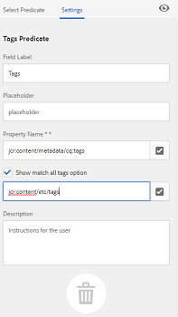

# Facet di ricerca {#search-facets}

Un’implementazione a livello aziendale di Adobe Experience Manager Assets consente di memorizzare molte risorse. A volte, trovare la risorsa giusta può essere difficile e richiede molto tempo se utilizzi solo le funzionalità di ricerca generiche di Experience Manager.

Utilizza i facet di ricerca nel pannello Filtri per aggiungere maggiore granularità alla tua esperienza di ricerca e rendere la funzionalità di ricerca più efficiente e versatile. I facet di ricerca aggiungono più dimensioni (predicati) che consentono di eseguire ricerche più complesse. Il pannello Filtri include alcuni facet standard. Puoi anche aggiungere facet di ricerca personalizzati.

In sintesi, i facet di ricerca consentono di cercare le risorse in più modi anziché in un unico ordine tassonomico predefinito. È possibile espandere facilmente il livello di dettaglio desiderato per una ricerca più mirata.

Ad esempio, se si cerca un&#39;immagine, è possibile scegliere se si desidera una bitmap o un&#39;immagine vettoriale. Puoi ridurre ulteriormente l’ambito della ricerca specificando il tipo MIME per l’immagine. Allo stesso modo, durante la ricerca di documenti, è possibile specificare il formato, ad esempio PDF o MS Word.

## Aggiungere un predicato {#adding-a-predicate}

I facet di ricerca visualizzati nel pannello Filtri sono definiti nel modulo di ricerca sottostante utilizzando i predicati. Per visualizzare più facet o diversi, aggiungere predicati al modulo predefinito o utilizzare un modulo personalizzato che includa facet selezionati.

Per le ricerche full-text, aggiungi la `Fulltext` eseguire il predicato sul modulo. Utilizza il predicato Proprietà per cercare le risorse che corrispondono a una singola proprietà specificata. Utilizza il predicato Opzioni per cercare le risorse che corrispondono a uno o più valori per una particolare proprietà. Aggiungi il predicato Intervallo date per cercare le risorse create all’interno di un intervallo di date specificato.

1. Fai clic sul logo dell’Experience Manager, quindi vai a **[!UICONTROL Strumenti]** > **[!UICONTROL Generale]** > **[!UICONTROL Ricerca Forms]**.
1. Dalla pagina Ricerca in Forms, seleziona **[!UICONTROL Barra di ricerca amministrazione risorse]**, quindi tocca  **Modifica** .

   

1. Nella pagina Modifica Forms di ricerca , trascina un predicato dal **[!UICONTROL Seleziona predicato]** nel riquadro principale. Ad esempio, trascina **[!UICONTROL Predicato proprietà]**.

   

   *Figura: Seleziona e sposta un predicato per personalizzare i filtri di ricerca.*

1. Nella scheda Impostazioni , immetti un’etichetta di campo, un testo segnaposto e una descrizione per il predicato. Specifica un nome valido per la proprietà di metadati che desideri associare al predicato. L’etichetta dell’intestazione nella scheda Impostazioni identifica il tipo di predicato selezionato.

   

   *Figura: Utilizza la scheda Impostazioni per fornire le opzioni richieste per un predicato.*

1. Nel campo **[!UICONTROL Nome proprietà]**, specifica un nome valido per la proprietà di metadati che vuoi associare al predicato. È il nome in base al quale viene eseguita la ricerca. Ad esempio, inserisci `jcr:content/metadata/dc:description` o `./jcr:content/metadata/dc:description`. Puoi anche selezionare un nodo esistente dalla finestra di dialogo di selezione.

   

   *Figura: Associa una proprietà metadati a un predicato nel campo Nome proprietà .*

1. Fai clic sul pulsante **[!UICONTROL Anteprima]**  per generare un’anteprima del pannello Filtri così come viene visualizzato dopo l’aggiunta del predicato.
1. Esamina il layout del predicato in modalità Anteprima.

   

   Anteprima del modulo di ricerca prima di inviare le modifiche

1. Per chiudere l’anteprima, fai clic sul pulsante **[!UICONTROL Chiudi]**  nell’angolo in alto a destra dell’anteprima.
1. Tocca **[!UICONTROL Fine]** per salvare le impostazioni.
1. Passa al pannello Ricerca nell’interfaccia utente Assets. Il predicato Proprietà viene aggiunto al pannello .
1. Immetti una descrizione della risorsa alla quale cercare nella casella di testo. Ad esempio, immetti &quot;Adobe&quot;. Quando esegui una ricerca, nei risultati della ricerca vengono elencate le risorse con la descrizione corrispondente a &quot;Adobe&quot;.

## Aggiungere un predicato Opzioni {#adding-an-options-predicate}

Il predicato Opzioni consente di aggiungere più opzioni di ricerca nel pannello Filtri . Per cercare le risorse, seleziona una o più di queste opzioni nel pannello Filtri . Ad esempio, per cercare le risorse in base al tipo di file, configura nel modulo di ricerca opzioni quali Immagini, Multimedia, Documenti e Archivi. Dopo aver configurato queste opzioni, la ricerca viene eseguita sulle risorse di tipo GIF, JPEG, PNG e così via, quando selezioni l’opzione Immagini nel pannello Filtri .

Per mappare le opzioni alla relativa proprietà, crea una struttura di nodo per le opzioni e fornisci il percorso del nodo principale nella proprietà Nome proprietà del predicato Opzioni. Il nodo padre deve essere di tipo `sling`: `OrderedFolder`. Le opzioni devono essere di tipo `nt:unstructured`. I nodi di opzione devono avere le proprietà `jcr:title` e `value` configurato.

La `jcr:title` è un nome descrittivo per l&#39;opzione visualizzata nel pannello Filtri . La `value` viene utilizzato nella query per trovare una corrispondenza con la proprietà specificata.

Quando selezioni un’opzione, la ricerca viene eseguita in base alla `value` del nodo dell&#39;opzione e dei relativi nodi figlio, se presenti. L’intero albero sotto il nodo dell’opzione viene attraversato e il `value` la proprietà di ogni nodo figlio viene combinata utilizzando un&#39;operazione OR per formare la query di ricerca.

Ad esempio, se selezioni “Immagini” per i tipi di file, la query di ricerca per le risorse viene creata combinando la proprietà `value` utilizzando un’operazione OR. Ad esempio, la query di ricerca per le immagini è realizzata unendo i risultati di corrispondenza per *image/jpeg*, *image/gif*, *image/png*, *image/pjpeg* e *image/tiff* per la proprietà `jcr:content/metadata/dc:format` tramite un’operazione OR.

La proprietà Value di un tipo di file, come visto in CRXDE, viene utilizzata per il funzionamento delle query di ricerca

Invece di creare manualmente una struttura di nodi per le opzioni nell’archivio CRX, puoi definire le opzioni in un file JSON, specificando le coppie corrispondenti di chiave-valore. Nel campo **[!UICONTROL Nome proprietà]**, specifica il percorso del file JSON. Ad esempio, puoi definire le coppie chiave-valore, `image/bmp`, `image/gif`, `image/jpeg`, `image/png` e specificarne i valori, come mostrato nel seguente file JSON di esempio. Nel campo **[!UICONTROL Nome proprietà]** puoi indicare il percorso CRX per il file.

```json
{
    "options" :
 [
          {"value" : "image/bmp","text" : "BMP"},
          {"value" : "image/gif","text" : "GIF"},
          {"value" : "image/jpeg","text" : "JPEG"},
          {"value" : "image/png","text" : "PNG"}
 ]
}
```

Se si desidera utilizzare un nodo esistente, specificarlo utilizzando la finestra di dialogo di selezione.

>[!NOTE]
>
>Il predicato Opzioni è un wrapper personalizzato che include predicati di proprietà per dimostrare il comportamento descritto. Al momento, non è disponibile alcun endpoint REST per supportare la funzionalità in modo nativo.

1. Tocca il logo dell’Experience Manager, quindi vai a **[!UICONTROL Strumenti > Generale > Cerca in Forms]**.
1. Dalla pagina **[!UICONTROL Moduli di ricerca]**, seleziona **[!UICONTROL Barra di ricerca amministrazione risorse]**, quindi tocca l’icona Modifica.
1. Nella pagina **[!UICONTROL Modifica modulo di ricerca]**, trascina **[!UICONTROL Predicato opzioni]** dalla scheda **[!UICONTROL Seleziona predicato]** al riquadro principale.
1. Nella scheda **[!UICONTROL Impostazioni]**, inserisci un’etichetta e un nome per la proprietà. Ad esempio, per cercare le risorse in base al loro formato, specifica un nome descrittivo per l’etichetta, ad esempio **[!UICONTROL Tipo file]**. Specifica la proprietà in base alla quale eseguire la ricerca nel campo apposito, ad esempio `jcr:content/metadata/dc:format.`
1. Effettua una delle operazioni seguenti:

   * In **[!UICONTROL Nome proprietà]** , indica il percorso del file JSON in cui si definiscono i nodi per le opzioni e specifica le coppie chiave-valore corrispondenti.
   * Tocca  accanto al campo Opzioni per specificare il testo e il valore da visualizzare per le opzioni che si desidera specificare nel pannello Filtri. Per aggiungere un’altra opzione, tocca o fai clic su  e ripeti il passaggio.

1. Assicurati che l’opzione **[!UICONTROL Selezione singola]** sia deselezionata per consentire all’utente di scegliere più opzioni per volta per i tipi di file (ad esempio, Immagini, Documenti, Multimedia e Archivi). Se scegli **[!UICONTROL Selezione singola]**, l’utente può scegliere una sola opzione alla volta per i tipi di file.

   

   Campi disponibili nel predicato Opzioni

1. In **Descrizione** immettere una descrizione facoltativa, quindi fare clic su **[!UICONTROL Fine]**.
1. Passa al pannello Ricerca . Il predicato Opzioni viene aggiunto al **Ricerca** pannello. Le opzioni per **[!UICONTROL Tipo di file]** vengono visualizzate come caselle di controllo.

## Aggiungere un predicato Proprietà con più valori {#adding-a-multi-value-property-predicate}

La `Multi Value Property` predicate consente di cercare le risorse per più valori. Considera uno scenario in cui sono presenti immagini di più prodotti in [!DNL Assets] e i metadati per ogni immagine includono un numero SKU associato al prodotto. Puoi utilizzare questo predicato per cercare immagini di prodotto basate su più numeri SKU.

1. Fai clic sul logo dell’Experience Manager, quindi vai a **[!UICONTROL Strumenti]** > **[!UICONTROL Generale]** > **[!UICONTROL Ricerca Forms]**.
1. Nella pagina Ricerca in Forms, seleziona **[!UICONTROL Barra di ricerca amministrazione risorse]**, il tocco **Modifica** .
1. Nella pagina Modifica modulo di ricerca, trascina il predicato **[!UICONTROL Proprietà con più valori]** dalla scheda **[!UICONTROL Seleziona predicato]** al riquadro principale.
1. In **[!UICONTROL Impostazioni]** , immetti un’etichetta e un testo segnaposto per il predicato. Specifica il nome della proprietà in base al quale eseguire la ricerca nel campo della proprietà, ad esempio `jcr:content/metadata/dc:value`. È inoltre possibile utilizzare la finestra di dialogo di selezione per selezionare un nodo.
1. Assicurati di aver selezionato **[!UICONTROL Supporto delimitatore]**. Specifica i delimitatori per separare i singoli valori nel campo **[!UICONTROL Delimitatori di input]**. Per impostazione predefinita, la virgola è indicata come delimitatore. È possibile specificare un delimitatore diverso.
1. In **Descrizione** campo , immetti una descrizione facoltativa e tocca **[!UICONTROL Fine]**.
1. Nell’interfaccia utente Assets, vai al pannello Filtri. Al pannello viene aggiunto il predicato **[!UICONTROL Proprietà con più valori]**.
1. Specifica più valori nel campo Valore multiplo separato dai delimitatori ed esegui la ricerca. Il predicato recupera una corrispondenza esatta del testo per i valori specificati.

## Aggiungere un predicato Tag {#adding-a-tags-predicate}

La `Tags` Il predicato consente di eseguire ricerche basate su tag per le risorse. Per impostazione predefinita, [!DNL Assets] cerca nelle risorse le corrispondenze di uno o più tag in base ai tag specificati. In altre parole, la query di ricerca esegue un’operazione OR utilizzando i tag specificati. Tuttavia, puoi utilizzare l’opzione di corrispondenza con tutti i tag per cercare le risorse che includono tutti i tag specificati.

1. Fai clic sul logo dell’Experience Manager, quindi vai a **[!UICONTROL Strumenti]** > **[!UICONTROL Generale]** > **[!UICONTROL Ricerca Forms]**.
1. Dalla pagina Ricerca in Forms, seleziona **[!UICONTROL Barra di ricerca amministrazione risorse]** quindi tocca **Modifica** .
1. Nella pagina Modifica modulo di ricerca, trascina **[!UICONTROL Predicato tag]** dalla scheda Seleziona predicato al riquadro principale.
1. Nella scheda Impostazioni , immetti un testo segnaposto per il predicato. Specifica il nome della proprietà in base al quale eseguire la ricerca nel campo della proprietà, ad esempio `jcr:content/metadata/cq:tags`. In alternativa, puoi selezionare un nodo in CRXDE dalla finestra di dialogo di selezione.
1. Configura la proprietà del percorso dei tag radice di questo predicato per popolare vari tag nell’elenco Tag.
1. Seleziona **[!UICONTROL Mostra opzione di corrispondenza con tutti i tag]** per cercare le risorse che includono tutti i tag specificati.

   

1. In **[!UICONTROL Descrizione]** immetti una descrizione facoltativa, quindi fai clic o tocca **[!UICONTROL Fine]**.
1. Passa al pannello Ricerca . La **[!UICONTROL Tag]** viene aggiunto al pannello Ricerca .
1. Specifica i tag in base ai quali desideri cercare le risorse o selezionali dall’elenco di suggerimenti.
1. Seleziona **[!UICONTROL Corrispondenza con tutti]** per cercare corrispondenze che includono tutti i tag specificati.

Puoi ordinare la struttura dei tag in ordine crescente o decrescente in base a **[!UICONTROL Nome]** (ordine alfabetico), **[!UICONTROL Creato]** data, oppure **[!UICONTROL Modificato]** data. Nell’illustrazione seguente, la struttura dei tag viene ordinata in ordine alfabetico in base alla variabile **[!UICONTROL Nome]**.


## Aggiunta di altri predicati {#adding-other-predicates}

Simile al modo in cui aggiungi un predicato Proprietà o un predicato Opzioni, puoi aggiungere i seguenti predicati aggiuntivi al pannello Ricerca:

<table>
 <tbody>
  <tr>
   <td><p><strong>Nome predicato</strong></p> </td>
   <td><p><strong>Descrizione</strong></p> </td>
   <td><p><strong>Proprietà</strong></p> </td>
  </tr>
  <tr>
   <td><p>Testo completo</p> </td>
   <td>predicato di ricerca per eseguire la ricerca full text su un intero nodo di risorsa. È mappato con <code>jcr</code>:<code>contains</code> operatore. Puoi specificare un percorso relativo se desideri eseguire una ricerca full text su una parte specifica del nodo della risorsa.</td>
   <td>
    <ul>
     <li>Etichetta</li>
     <li>Segnaposto</li>
     <li>Nome proprietà</li>
     <li>Descrizione</li>
    </ul> </td>
  </tr>
  <tr>
   <td>Browser Percorsi</td>
   <td>Cerca predicato per cercare risorse in cartelle e sottocartelle in un percorso radice preconfigurato</td>
   <td>
    <ul>
     <li>Segnaposto</li>
     <li>Percorso directory principale</li>
     <li>Descrizione</li>
    </ul> </td>
  </tr>
  <tr>
   <td><p>Percorso</p> </td>
   <td><p>Utilizzalo per filtrare i risultati in base alla posizione. Puoi specificare percorsi diversi come opzioni.</p> </td>
   <td>
    <ul>
     <li>Etichetta</li>
     <li>Percorso</li>
     <li>Descrizione</li>
    </ul> </td>
  </tr>
  <tr>
   <td><p>Stato pubblicazione</p> </td>
   <td><p>Cerca predicato per cercare le risorse in base al loro stato di pubblicazione</p> </td>
   <td>
    <ul>
     <li>Etichetta</li>
     <li>Nome proprietà</li>
     <li>Descrizione</li>
    </ul> </td>
  </tr>
  <tr>
   <td><p>Data relativa</p> </td>
   <td><p>Cerca un predicato per cercare le risorse in base alla data relativa della loro creazione. Ad esempio, puoi configurare opzioni quali 2 mesi fa, 3 settimane fa e così via. </p> </td>
   <td>
    <ul>
     <li>Etichetta</li>
     <li>Nome proprietà</li>
     <li>Data relativa</li>
    </ul> </td>
  </tr>
  <tr>
   <td><p>Intervallo</p> </td>
   <td><p>Cerca un predicato per cercare risorse che si trovano all’interno di un intervallo specificato. Nel pannello Ricerca puoi specificare i valori minimo e massimo per l’intervallo.</p> </td>
   <td>
    <ul>
     <li>Etichetta</li>
     <li>Nome proprietà</li>
     <li>Descrizione</li>
    </ul> </td>
  </tr>
  <tr>
   <td><p>Intervallo date</p> </td>
   <td><p>Cerca predicato per cercare le risorse create all’interno di un intervallo specificato per una proprietà data. Nel pannello Ricerca, puoi specificare le date di inizio e fine utilizzando i selettori di date.</p> </td>
   <td>
    <ul>
     <li>Etichetta</li>
     <li>Segnaposto</li>
     <li>Nome proprietà</li>
     <li>Testo intervallo (Da)</li>
     <li>Testo intervallo (A)</li>
     <li>Descrizione</li>
    </ul> </td>
  </tr>
  <tr>
   <td><p>Data</p> </td>
   <td><p>Cerca un predicato per una ricerca basata su cursore delle risorse basata su una proprietà data.</p> </td>
   <td>
    <ul>
     <li>Etichetta</li>
     <li>Nome proprietà</li>
     <li>Descrizione</li>
    </ul> </td>
  </tr>
  <tr>
   <td><p>Dimensione file</p> </td>
   <td><p>Cerca un predicato per cercare le risorse in base alle loro dimensioni. Si tratta di un predicato basato su cartelle in cui si selezionano le opzioni del cursore da un nodo configurabile. Le opzioni predefinite sono definite in /libs/dam/options/predicates/filesize nell'archivio CRX. La dimensione del file è espressa in byte.</p> </td>
   <td>
    <ul>
     <li>Etichetta</li>
     <li>Nome proprietà</li>
     <li>Percorso</li>
     <li>Descrizione</li>
    </ul> </td>
  </tr>
  <tr>
   <td>Ultima modifica risorsa</td>
   <td>Cerca nel predicato per cercare le risorse modificate di recente </td>
   <td>
    <ul>
     <li>Nome proprietà</li>
     <li>Valore proprietà</li>
     <li>Descrizione</li>
    </ul> </td>
  </tr>
  <tr>
   <td>Stato pubblicazione</td>
   <td>Cerca predicato per cercare le risorse in base al loro stato di pubblicazione </td>
   <td>
    <ul>
     <li>Etichetta</li>
     <li>Nome proprietà</li>
     <li>Descrizione</li>
    </ul> </td>
  </tr>
  <tr>
   <td>Stato scadenza</td>
   <td>Ricerca predicato per cercare le risorse in base al loro stato di scadenza </td>
   <td>
    <ul>
     <li>Etichetta</li>
     <li>Nome proprietà</li>
     <li>Descrizione</li>
    </ul> </td>
  </tr>
  <tr>
   <td>Nascosto</td>
   <td>predicato di ricerca che definisce una proprietà di campo nascosta per cercare le risorse</td>
   <td>
    <ul>
     <li>Nome proprietà</li>
     <li>Valore proprietà</li>
     <li>Descrizione</li>
    </ul> </td>
  </tr>
 </tbody>
</table>

## Ripristina facet di ricerca {#restoring-default-search-facets}

Per impostazione predefinita, prima di **[!UICONTROL Barra di ricerca amministrazione risorse]** in **[!UICONTROL Ricerca Forms]** pagina. Se si aggiungono facet di ricerca al modulo che indicano che il modulo predefinito è stato modificato, l’icona Blocca scompare.

Icona a forma di lucchetto rispetto a un’opzione nella pagina Ricerca Forms indica che le impostazioni predefinite sono intatte e non sono personalizzate.

Per ripristinare il facet di ricerca predefinito, esegui questi passaggi:

1. Seleziona **[!UICONTROL Barra di ricerca amministrazione risorse]** in **[!UICONTROL Ricerca Forms]** pagina.
1. Tocca **[!UICONTROL Elimina]**  nella barra degli strumenti.
1. Nella finestra di dialogo di conferma, tocca **[!UICONTROL Elimina]** per rimuovere le modifiche personalizzate.

   Dopo aver eliminato le modifiche personalizzate ai facet di ricerca, l’icona Blocca viene visualizzata nuovamente prima della **[!UICONTROL Barra di ricerca amministrazione risorse]** nella pagina **[!UICONTROL Moduli di ricerca]**.

## Autorizzazioni utente {#user-permissions}

Se non ti viene assegnato un ruolo di amministratore, compare un elenco di autorizzazioni necessarie per eseguire azioni di modifica, eliminazione e anteprima che coinvolgono i facet di ricerca.

| Azione | Autorizzazione |
|---|---|
| Modifica | Autorizzazioni di lettura e scrittura per `/apps` in CRX. |
| Eliminare | Autorizzazioni di lettura, scrittura ed eliminazione per `/apps` in CRX. |
| Anteprima | Autorizzazioni di lettura, scrittura ed eliminazione per `/var/dam/content` in CRX. Inoltre, le autorizzazioni di lettura e scrittura su `/apps` nodo. |

**Consulta anche**

* [Traduci risorse](translate-assets.md)
* [API HTTP di Assets](mac-api-assets.md)
* [Formati di file supportati dalle risorse](file-format-support.md)
* [Cercare risorse](search-assets.md)
* [Risorse collegate](use-assets-across-connected-assets-instances.md)
* [Rapporti sulle risorse](asset-reports.md)
* [Schemi di metadati](metadata-schemas.md)
* [Scaricare le risorse](download-assets-from-aem.md)
* [Gestire i metadati](manage-metadata.md)
* [Gestire le raccolte](manage-collections.md)
* [Importazione in blocco di metadati](metadata-import-export.md)

>[!MORELIKETHIS]
>
>* [Cercare risorse digitali](search-assets.md).

