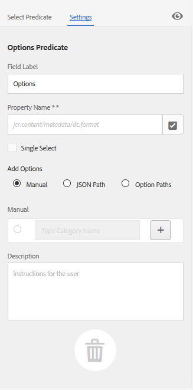

# Facet di ricerca {#search-facets}

| Versione | Collegamento articolo |
| -------- | ---------------------------- |
| AEM 6.5 | [Fai clic qui](https://experienceleague.adobe.com/docs/experience-manager-65/assets/administer/search-facets.html) |
| AEM as a Cloud Service | Questo articolo |

Una distribuzione a livello aziendale di Adobe Experience Manager Assets consente di memorizzare molte risorse. Talvolta, trovare la risorsa giusta può essere difficile e richiedere tempo se utilizzi solo le funzionalità di ricerca generiche di Experience Manager.

Utilizza i facet di ricerca nel pannello Filtri per aggiungere maggiore granularità all’esperienza di ricerca e rendere la funzionalità di ricerca più efficiente e versatile. I facet di ricerca aggiungono più dimensioni (predicati) che consentono di eseguire ricerche più complesse. Il pannello Filtri include alcuni facet standard. Puoi anche aggiungere facet di ricerca personalizzati.

In sintesi, i facet di ricerca consentono di cercare le risorse in più modi anziché in un unico ordine tassonomico predeterminato. Per una ricerca più mirata, è possibile eseguire facilmente un drill-down al livello di dettaglio desiderato.

Ad esempio, se si sta cercando un&#39;immagine, è possibile scegliere se si desidera una bitmap o un&#39;immagine vettoriale. Puoi ridurre ulteriormente l’ambito della ricerca specificando il tipo MIME per l’immagine. Analogamente, durante la ricerca di documenti, è possibile specificare il formato, ad esempio PDF o MS Word.

## Aggiungi un predicato {#adding-a-predicate}

I facet di ricerca visualizzati nel pannello Filtri sono definiti nel modulo di ricerca sottostante utilizzando i predicati. Per visualizzare più facet o facet diversi, è possibile aggiungere predicati al modulo predefinito o utilizzare un modulo personalizzato che includa facet di propria scelta.

Per le ricerche full-text, aggiungi `Fulltext` predicato al modulo. Utilizza il predicato Proprietà per cercare le risorse che corrispondono a una singola proprietà specificata. Utilizza il predicato Options per cercare le risorse che corrispondono a uno o più valori per una particolare proprietà. Aggiungi il predicato Intervallo date per cercare le risorse create all’interno di un intervallo di date specificato.

1. Fai clic sul logo dell’Experience Manager, quindi vai a **[!UICONTROL Strumenti]** > **[!UICONTROL Generale]** > **[!UICONTROL Cerca in Forms]**.
1. Dalla pagina Forms di ricerca, seleziona **[!UICONTROL Barra di ricerca amministrazione risorse]**, quindi tocca  **Modifica** .

   

1. Nella pagina Modifica Forms di ricerca, trascina un predicato da **[!UICONTROL Seleziona predicato]** al riquadro principale. Ad esempio, trascina **[!UICONTROL Predicato proprietà]**.

   

   *Figura: Selezionare e spostare un predicato per personalizzare i filtri di ricerca.*

1. Nella scheda Impostazioni, immettere un&#39;etichetta di campo, un testo segnaposto e una descrizione per il predicato. Specificare un nome valido per la proprietà di metadati che si desidera associare al predicato. L’etichetta dell’intestazione nella scheda Impostazioni identifica il tipo di predicato selezionato.

   

   *Figura: Utilizzare la scheda Impostazioni per fornire le opzioni richieste di un predicato.*

1. Nel campo **[!UICONTROL Nome proprietà]**, specifica un nome valido per la proprietà di metadati che vuoi associare al predicato. È il nome in base al quale viene eseguita la ricerca. Ad esempio, inserisci `jcr:content/metadata/dc:description` o `./jcr:content/metadata/dc:description`. Puoi anche selezionare un nodo esistente dalla finestra di dialogo di selezione.

   

   *Figura: Associare una proprietà di metadati a un predicato nel campo Nome proprietà.*

1. Fai clic su **[!UICONTROL Anteprima]**  per generare un’anteprima del pannello Filtri così come viene visualizzata dopo l’aggiunta del predicato.
1. Rivedi il layout del predicato nella modalità Anteprima.

   

   Visualizza l&#39;anteprima del modulo di ricerca prima di inviare le modifiche

1. Per chiudere l&#39;anteprima, fare clic su **[!UICONTROL Chiudi]**  nell’angolo superiore destro dell’anteprima.
1. Tocca **[!UICONTROL Fine]** per salvare le impostazioni.
1. Passa al pannello Ricerca nell’interfaccia utente di Assets. Il predicato Proprietà viene aggiunto al pannello.
1. Immetti una descrizione della risorsa da cercare nella casella di testo. Ad esempio, immetti &quot;Adobe&quot;. Quando esegui una ricerca, nei risultati vengono elencate le risorse la cui descrizione corrisponde a &quot;Adobe&quot;.

## Aggiungere un predicato Opzioni {#adding-an-options-predicate}

Il predicato Opzioni consente di aggiungere più opzioni di ricerca nel pannello Filtri. Per cercare le risorse, puoi selezionare una o più di queste opzioni nel pannello Filtri. Ad esempio, per cercare le risorse in base al tipo di file, configura opzioni quali Immagini, Multimedia, Documenti e Archivi nel modulo di ricerca. Dopo aver configurato queste opzioni, la ricerca viene eseguita sulle risorse di tipo GIF, JPEG, PNG e così via, quando selezioni l’opzione Immagini nel pannello Filtri.

Per mappare le opzioni alla rispettiva proprietà, crea una struttura di nodi per le opzioni e fornisci il percorso del nodo principale nella proprietà Nome proprietà del predicato Opzioni. Il nodo principale deve essere di tipo `sling`: `OrderedFolder`. Le opzioni devono essere di tipo `nt:unstructured`. I nodi delle opzioni devono avere le proprietà `jcr:title` e `value` configurato.

Il `jcr:title` La proprietà è un nome descrittivo per l’opzione visualizzata nel pannello Filtri. Il `value` viene utilizzato nella query per corrispondere alla proprietà specificata.

Quando selezioni un’opzione, la ricerca viene eseguita in base al `value` proprietà del nodo di opzione e dei relativi nodi figlio, se presenti. L&#39;intera struttura sotto il nodo di opzione viene attraversata e `value` viene combinata utilizzando un&#39;operazione OR per creare la query di ricerca.

Ad esempio, se selezioni “Immagini” per i tipi di file, la query di ricerca per le risorse viene creata combinando la proprietà `value` utilizzando un’operazione OR. Ad esempio, la query di ricerca per le immagini è realizzata unendo i risultati di corrispondenza per *image/jpeg*, *image/gif*, *image/png*, *image/pjpeg* e *image/tiff* per la proprietà `jcr:content/metadata/dc:format` tramite un’operazione OR.

La proprietà Value di un tipo di file, come mostrato in CRXDE, viene utilizzata per il funzionamento delle query di ricerca

Invece di creare manualmente una struttura di nodi per le opzioni nell’archivio CRX, puoi definire le opzioni in un file JSON, specificando le coppie corrispondenti di chiave-valore. Nel campo **[!UICONTROL Nome proprietà]**, specifica il percorso del file JSON. Ad esempio, puoi definire le coppie chiave-valore, `image/bmp`, `image/gif`, `image/jpeg`, `image/png` e specificarne i valori, come mostrato nel seguente file JSON di esempio. Nel campo **[!UICONTROL Nome proprietà]** puoi indicare il percorso CRX per il file.

```json
{
    "options" :
 [
          {"value" : "image/bmp","text" : "BMP"},
          {"value" : "image/gif","text" : "GIF"},
          {"value" : "image/jpeg","text" : "JPEG"},
          {"value" : "image/png","text" : "PNG"}
 ]
}
```

Se si desidera utilizzare un nodo esistente, specificarlo utilizzando la finestra di dialogo di selezione.

>[!NOTE]
>
>Il predicato Options è un wrapper personalizzato che include predicati di proprietà per dimostrare il comportamento descritto. Attualmente, non è disponibile alcun endpoint REST per supportare la funzionalità in modo nativo.

1. Tocca il logo di Experience Manager, quindi vai a **[!UICONTROL Strumenti > Generale > Cerca in Forms]**.
1. Dalla pagina **[!UICONTROL Moduli di ricerca]**, seleziona **[!UICONTROL Barra di ricerca amministrazione risorse]**, quindi tocca l’icona Modifica.
1. Nella pagina **[!UICONTROL Modifica modulo di ricerca]**, trascina **[!UICONTROL Predicato opzioni]** dalla scheda **[!UICONTROL Seleziona predicato]** al riquadro principale.
1. Nella scheda **[!UICONTROL Impostazioni]**, inserisci un’etichetta e un nome per la proprietà. Ad esempio, per cercare le risorse in base al loro formato, specifica un nome descrittivo per l’etichetta, ad esempio **[!UICONTROL Tipo file]**. Specifica la proprietà in base alla quale eseguire la ricerca nel campo apposito, ad esempio `jcr:content/metadata/dc:format.`
1. Effettua una delle operazioni seguenti:

   * In **[!UICONTROL Nome proprietà]** , indica il percorso del file JSON in cui si definiscono i nodi per le opzioni e specifica le coppie chiave-valore corrispondenti.
   * Tocca  accanto al campo Opzioni per specificare il testo e il valore da visualizzare per le opzioni che si desidera specificare nel pannello Filtri. Per aggiungere un’altra opzione, tocca o fai clic su  e ripetere il passaggio.

1. Assicurati che l’opzione **[!UICONTROL Selezione singola]** sia deselezionata per consentire all’utente di scegliere più opzioni per volta per i tipi di file (ad esempio, Immagini, Documenti, Multimedia e Archivi). Se scegli **[!UICONTROL Selezione singola]**, l’utente può scegliere una sola opzione alla volta per i tipi di file.

   

   Campi disponibili nel predicato Opzioni

1. In **Descrizione** , immettere una descrizione facoltativa e quindi fare clic su **[!UICONTROL Fine]**.
1. Passa al pannello Ricerca. Il predicato Options viene aggiunto al **Ricerca** pannello. Le opzioni per **[!UICONTROL Tipo di file]** vengono visualizzati come caselle di controllo.

## Aggiungere un predicato Proprietà con più valori {#adding-a-multi-value-property-predicate}

Il `Multi Value Property` predicato consente di cercare risorse per più valori. Considera uno scenario in cui sono presenti immagini di più prodotti in [!DNL Assets] e i metadati di ogni immagine includono un numero SKU associato al prodotto. Puoi utilizzare questo predicato per cercare immagini di prodotto in base a più numeri SKU.

1. Fai clic sul logo dell’Experience Manager, quindi vai a **[!UICONTROL Strumenti]** > **[!UICONTROL Generale]** > **[!UICONTROL Cerca in Forms]**.
1. Nella pagina Forms di ricerca, seleziona **[!UICONTROL Barra di ricerca amministrazione risorse]**, il tocco **Modifica** .
1. Nella pagina Modifica modulo di ricerca, trascina il predicato **[!UICONTROL Proprietà con più valori]** dalla scheda **[!UICONTROL Seleziona predicato]** al riquadro principale.
1. In **[!UICONTROL Impostazioni]** , immettere un&#39;etichetta e un testo segnaposto per il predicato. Specifica il nome della proprietà in base alla quale eseguire la ricerca nel campo proprietà, ad esempio `jcr:content/metadata/dc:value`. È inoltre possibile utilizzare la finestra di dialogo di selezione per selezionare un nodo.
1. Assicurati di aver selezionato **[!UICONTROL Supporto delimitatore]**. Specifica i delimitatori per separare i singoli valori nel campo **[!UICONTROL Delimitatori di input]**. Per impostazione predefinita, la virgola è indicata come delimitatore. È possibile specificare un delimitatore diverso.
1. In **Descrizione** , immetti una descrizione facoltativa e tocca **[!UICONTROL Fine]**.
1. Nell’interfaccia utente Assets, vai al pannello Filtri. Al pannello viene aggiunto il predicato **[!UICONTROL Proprietà con più valori]**.
1. Specificare più valori nel campo Multivalore separati dai delimitatori ed eseguire la ricerca. Il predicato recupera una corrispondenza di testo esatta per i valori specificati.

## Aggiungere un predicato Tag {#adding-a-tags-predicate}

Il `Tags` predicato consente di eseguire ricerche di risorse basate su tag. Per impostazione predefinita, [!DNL Assets] cerca le risorse per trovare una o più corrispondenze di tag in base ai tag specificati. In altre parole, la query di ricerca esegue un&#39;operazione OR utilizzando i tag specificati. Tuttavia, puoi utilizzare l’opzione abbina tutti i tag per cercare le risorse che includono tutti i tag specificati.

1. Fai clic sul logo dell’Experience Manager, quindi vai a **[!UICONTROL Strumenti]** > **[!UICONTROL Generale]** > **[!UICONTROL Cerca in Forms]**.
1. Dalla pagina Forms di ricerca, seleziona **[!UICONTROL Barra di ricerca amministrazione risorse]** e quindi tocca **Modifica** .
1. Nella pagina Modifica modulo di ricerca trascinare **[!UICONTROL Predicato tag]** dalla scheda Seleziona predicato al riquadro principale.
1. Nella scheda Impostazioni, immettere un testo segnaposto per il predicato. Specifica il nome della proprietà in base alla quale eseguire la ricerca nel campo proprietà, ad esempio `jcr:content/metadata/cq:tags`. In alternativa, potete selezionare un nodo in CRXDE dalla finestra di dialogo di selezione.
1. Configurare la proprietà Percorso tag radice di questo predicato per popolare vari tag nell’elenco Tag.
1. Seleziona **[!UICONTROL Mostra opzione di corrispondenza con tutti i tag]** per cercare le risorse che includono tutti i tag specificati.

   

1. In **[!UICONTROL Descrizione]** , immetti una descrizione facoltativa e quindi fai clic o tocca **[!UICONTROL Fine]**.
1. Passa al pannello Ricerca. Il **[!UICONTROL Tag]** Il predicato viene aggiunto al pannello Ricerca.
1. Specifica i tag in base ai quali desideri cercare le risorse o selezionarli dall’elenco dei suggerimenti.
1. Seleziona **[!UICONTROL Corrispondenza con tutti]** per cercare corrispondenze che includono tutti i tag specificati.

Puoi ordinare la struttura dei tag in ordine crescente o decrescente in base al **[!UICONTROL Nome]** (ordine alfabetico), **[!UICONTROL Creato]** data, oppure **[!UICONTROL Modificato]** data. Nell’illustrazione seguente, la struttura dei tag è ordinata alfabeticamente in base al **[!UICONTROL Nome]**.


## Aggiunta di altri predicati {#adding-other-predicates}

Analogamente al modo in cui si aggiunge un predicato Proprietà o Opzioni, è possibile aggiungere i seguenti predicati aggiuntivi al pannello Ricerca:

<table>
 <tbody>
  <tr>
   <td><p><strong>Nome predicato</strong></p> </td>
   <td><p><strong>Descrizione</strong></p> </td>
   <td><p><strong>Proprietà</strong></p> </td>
  </tr>
  <tr>
   <td><p>Testo completo</p> </td>
   <td>Predicato di ricerca per eseguire ricerche full-text su un intero nodo di risorsa. È mappato con <code>jcr</code>:<code>contains</code> operatore. Puoi specificare un percorso relativo se desideri eseguire una ricerca full-text su una parte specifica del nodo della risorsa.</td>
   <td>
    <ul>
     <li>Etichetta</li>
     <li>Segnaposto</li>
     <li>Nome proprietà</li>
     <li>Descrizione</li>
    </ul> </td>
  </tr>
  <tr>
   <td>Browser Percorsi</td>
   <td>Cerca predicato per cercare le risorse in cartelle e sottocartelle in un percorso principale preconfigurato</td>
   <td>
    <ul>
     <li>Segnaposto</li>
     <li>Percorso directory principale</li>
     <li>Descrizione</li>
    </ul> </td>
  </tr>
  <tr>
   <td><p>Percorso</p> </td>
   <td><p>Utilizzala per filtrare i risultati in base alla posizione. È possibile specificare percorsi diversi come opzioni.</p> </td>
   <td>
    <ul>
     <li>Etichetta</li>
     <li>Percorso</li>
     <li>Descrizione</li>
    </ul> </td>
  </tr>
  <tr>
   <td><p>Stato pubblicazione</p> </td>
   <td><p>Cerca predicato per cercare le risorse in base al loro stato di pubblicazione</p> </td>
   <td>
    <ul>
     <li>Etichetta</li>
     <li>Nome proprietà</li>
     <li>Descrizione</li>
    </ul> </td>
  </tr>
  <tr>
   <td><p>Data relativa</p> </td>
   <td><p>Cerca predicato per cercare le risorse in base alla data relativa di creazione. Ad esempio, puoi configurare diverse opzioni, come 2 mesi fa, 3 settimane fa e così via. </p> </td>
   <td>
    <ul>
     <li>Etichetta</li>
     <li>Nome proprietà</li>
     <li>Data relativa</li>
    </ul> </td>
  </tr>
  <tr>
   <td><p>Intervallo</p> </td>
   <td><p>Predicato di ricerca per cercare le risorse che si trovano all’interno di un intervallo specificato. Nel pannello Ricerca, potete specificare i valori minimo e massimo per l'intervallo.</p> </td>
   <td>
    <ul>
     <li>Etichetta</li>
     <li>Nome proprietà</li>
     <li>Descrizione</li>
    </ul> </td>
  </tr>
  <tr>
   <td><p>Intervallo date</p> </td>
   <td><p>Cerca predicato per cercare le risorse create all’interno di un intervallo specificato per una proprietà di data. Nel pannello Ricerca, potete specificare le date di inizio e di fine utilizzando gli strumenti di selezione delle date.</p> </td>
   <td>
    <ul>
     <li>Etichetta</li>
     <li>Segnaposto</li>
     <li>Nome proprietà</li>
     <li>Testo intervallo (Da)</li>
     <li>Testo intervallo (A)</li>
     <li>Descrizione</li>
    </ul> </td>
  </tr>
  <tr>
   <td><p>Data</p> </td>
   <td><p>Predicato di ricerca per una ricerca di risorse basata su cursore e basata su una proprietà data.</p> </td>
   <td>
    <ul>
     <li>Etichetta</li>
     <li>Nome proprietà</li>
     <li>Descrizione</li>
    </ul> </td>
  </tr>
  <tr>
   <td><p>Dimensione file</p> </td>
   <td><p>Cerca predicato per cercare le risorse in base alle loro dimensioni. Si tratta di un predicato basato su silder in cui è possibile selezionare le opzioni del cursore da un nodo configurabile. Le opzioni predefinite sono definite in /libs/dam/options/predicates/filesize nell’archivio CRX. La dimensione del file è indicata in byte.</p> </td>
   <td>
    <ul>
     <li>Etichetta</li>
     <li>Nome proprietà</li>
     <li>Percorso</li>
     <li>Descrizione</li>
    </ul> </td>
  </tr>
  <tr>
   <td>Ultima modifica risorsa</td>
   <td>Cerca predicato per cercare le risorse modificate di recente </td>
   <td>
    <ul>
     <li>Nome proprietà</li>
     <li>Valore proprietà</li>
     <li>Descrizione</li>
    </ul> </td>
  </tr>
  <tr>
   <td>Stato pubblicazione</td>
   <td>Cerca predicato per cercare le risorse in base al loro stato di pubblicazione </td>
   <td>
    <ul>
     <li>Etichetta</li>
     <li>Nome proprietà</li>
     <li>Descrizione</li>
    </ul> </td>
  </tr>
  <tr>
   <td>Stato scadenza</td>
   <td>Cerca predicato per cercare le risorse in base al loro stato di scadenza </td>
   <td>
    <ul>
     <li>Etichetta</li>
     <li>Nome proprietà</li>
     <li>Descrizione</li>
    </ul> </td>
  </tr>
  <tr>
   <td>Nascosto</td>
   <td>Predicato di ricerca che definisce una proprietà di campo nascosto per la ricerca di risorse</td>
   <td>
    <ul>
     <li>Nome proprietà</li>
     <li>Valore proprietà</li>
     <li>Descrizione</li>
    </ul> </td>
  </tr>
 </tbody>
</table>

## Rimuovi facet di ricerca predefiniti {#removing-default-search-facets}

L’Adobe consiglia di prestare attenzione durante la rimozione dei facet di ricerca predefiniti per evitare problemi di prestazioni. La rimozione dei facet di ricerca predefiniti potrebbe influire anche sul comportamento della funzionalità predefinita.

Non rimuovere i seguenti campi nascosti poiché causano un problema di prestazioni delle query con OmniSearch e le raccolte avanzate:

* group.2_group.type=dam:Asset

* group.1_group.type=nt:folder

* group.p.or=true

## Ripristina facet di ricerca {#restoring-default-search-facets}

Per impostazione predefinita, prima di viene visualizzata un&#39;icona Blocca **[!UICONTROL Barra di ricerca amministrazione risorse]** nel **[!UICONTROL Cerca in Forms]** pagina. L&#39;icona Blocca scompare se al modulo vengono aggiunti facet di ricerca che indicano che il modulo predefinito è stato modificato.

Blocca l’icona rispetto a un’opzione nella pagina Forms di ricerca indica che le impostazioni predefinite sono intatte e non personalizzate.

Per ripristinare il facet di ricerca predefinito, effettuare le seguenti operazioni:

1. Seleziona **[!UICONTROL Barra di ricerca amministrazione risorse]** nel **[!UICONTROL Cerca in Forms]** pagina.
1. Tocca **[!UICONTROL Elimina]**  nella barra degli strumenti.
1. Nella finestra di dialogo di conferma, tocca **[!UICONTROL Elimina]** per rimuovere le modifiche personalizzate.

   Dopo aver eliminato le modifiche personalizzate ai facet di ricerca, l’icona Blocca viene visualizzata nuovamente prima della **[!UICONTROL Barra di ricerca amministrazione risorse]** nella pagina **[!UICONTROL Moduli di ricerca]**.

## Autorizzazioni utente {#user-permissions}

Se non ti è stato assegnato un ruolo di amministratore, ecco un elenco di autorizzazioni necessarie per eseguire le azioni di modifica, eliminazione e anteprima che coinvolgono i facet di ricerca.

| Azione | Autorizzazione |
|---|---|
| Modifica | Autorizzazioni di lettura e scrittura su `/apps` in CRX. |
| Eliminare | Autorizzazioni di lettura, scrittura ed eliminazione per `/apps` in CRX. |
| Anteprima | Autorizzazioni di lettura, scrittura ed eliminazione per `/var/dam/content` in CRX. Inoltre, le autorizzazioni di lettura e scrittura su `/apps` nodo. |

**Consulta anche**

* [Traduci risorse](translate-assets.md)
* [API HTTP di Assets](mac-api-assets.md)
* [Formati di file supportati dalle risorse](file-format-support.md)
* [Cerca risorse](search-assets.md)
* [Risorse collegate](use-assets-across-connected-assets-instances.md)
* [Rapporti sulle risorse](asset-reports.md)
* [Schemi metadati](metadata-schemas.md)
* [Scaricare le risorse](download-assets-from-aem.md)
* [Gestire i metadati](manage-metadata.md)
* [Gestire le raccolte](manage-collections.md)
* [Importazione in blocco dei metadati](metadata-import-export.md)

>[!MORELIKETHIS]
>
>* [Cercare risorse digitali](search-assets.md).
