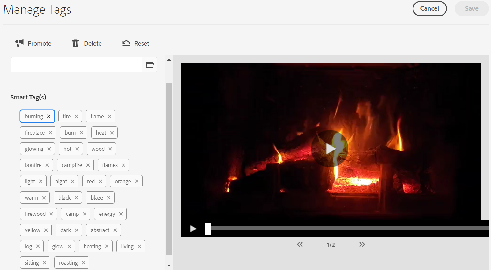

# Assegnare tag avanzati alle risorse video {#video-smart-tags}

La crescente necessità di nuovi contenuti richiede uno sforzo manuale ridotto per offrire esperienze digitali coinvolgenti in tempi brevi. [!DNL Adobe Experience Manager] as a [!DNL Cloud Service] supporta l’assegnazione tag automatica delle risorse video tramite l’intelligenza artificiale. Assegnare tag ai video manualmente può richiedere tempo. Tuttavia, [!DNL Adobe Sensei] la funzione di assegnazione tag avanzati video avanzata utilizza modelli di intelligenza artificiale per analizzare i contenuti video e aggiungere tag alle risorse video. In questo modo gli utenti DAM hanno meno tempo per fornire esperienze avanzate ai propri clienti. Il servizio di apprendimento automatico di Adobe genera due set di tag per un video. Mentre, un set corrisponde a oggetti, scene e attributi in quel video; l&#39;altro set è relativo ad azioni come bere, correre e fare jogging.

L’assegnazione tag video è attivata per impostazione predefinita in [!DNL Adobe Experience Manager] as a [!DNL Cloud Service]. Tuttavia, è possibile [rinuncia all’assegnazione di tag avanzati video](#opt-out-video-smart-tagging) in una cartella. I video vengono contrassegnati automaticamente quando carichi nuovi video o li rielabora. [!DNL Experience Manager] crea anche le miniature ed estrae i metadati dei file video. I tag avanzati vengono visualizzati in ordine decrescente rispetto ai [punteggio di affidabilità](#confidence-score-video-tag) nella risorsa [!UICONTROL Proprietà].

## Applicazione di tag avanzati ai video al caricamento {#smart-tag-assets-on-ingestion}

Quando [caricare risorse video](add-assets.md#upload-assets) a [!DNL Adobe Experience Manager] as a [!DNL Cloud Service], i video vengono elaborati. Una volta completata l’elaborazione, consulta la sezione [!UICONTROL Base] scheda della risorsa [!UICONTROL Proprietà] pagina. Gli smart tag vengono aggiunti automaticamente al video in [!UICONTROL Tag avanzati]. I microservizi per le risorse sfruttano [!DNL Adobe Sensei] per creare questi tag avanzati.


Gli smart tag applicati vengono ordinati in ordine decrescente di [punteggio di affidabilità](#confidence-score-video-tag), combinato per tag di oggetto e azione, in [!UICONTROL Tag avanzati].

>[!IMPORTANT]
>
>Ti consigliamo di rivedere questi tag generati automaticamente per assicurarti che siano conformi al tuo marchio e ai suoi valori.

## Applicazione di tag avanzati ai video esistenti in DAM {#smart-tag-existing-videos}

Le risorse video esistenti in DAM non vengono contrassegnate automaticamente con tag avanzati. È necessario [!UICONTROL Rielabora risorse] manualmente per generare tag avanzati.

Per assegnare tag avanzati alle risorse video o alle cartelle (comprese le sottocartelle) di risorse già esistenti nell’archivio delle risorse, effettua le seguenti operazioni:

1. Seleziona la [!DNL Adobe Experience Manager] e quindi selezionare le risorse dal [!UICONTROL Navigazione] pagina.

1. Seleziona [!UICONTROL File] per visualizzare l’interfaccia Assets.

1. Passare alla cartella alla quale si desidera applicare gli smart tag.

1. Seleziona l’intera cartella o specifiche risorse video.

1. Seleziona  [!UICONTROL Rielabora risorse] e seleziona la [!UICONTROL Processo completo] opzione.

<!-- TBD: Limit size -->


Al termine del processo, passare alla [!UICONTROL Proprietà] di qualsiasi risorsa video all’interno della cartella. I tag aggiunti automaticamente sono visualizzati in [!UICONTROL Tag avanzati] sezione in [!UICONTROL Base] scheda. Questi tag avanzati applicati sono ordinati in ordine decrescente di [punteggio di affidabilità](#confidence-score-video-tag).

## Cerca video con tag {#search-smart-tagged-videos}

Per cercare le risorse video in base agli smart tag generati automaticamente, utilizza [Omnisearch](search-assets.md#search-assets-in-aem):

1. Seleziona l’icona di ricerca  per visualizzare il campo Omnisearch.

1. Specifica un tag, nel campo Omnisearch, che non è stato aggiunto in modo esplicito a un video.

1. Cerca in base al tag.

I risultati della ricerca mostrano le risorse video in base al tag specificato.

I risultati della ricerca sono una combinazione di risorse video con parole chiave cercate nei metadati e risorse video con tag avanzati con le parole chiave cercate. Tuttavia, i risultati della ricerca che corrispondono a tutti i termini di ricerca nei campi di metadati vengono visualizzati per primi, seguiti dai risultati della ricerca che corrispondono a qualsiasi termine di ricerca nei tag avanzati. Per ulteriori informazioni, consulta [Comprendere [!DNL Experience Manager] risultati di ricerca con tag avanzati](smart-tags.md#understand-search).

## Modera tag avanzati video {#moderate-video-smart-tags}

[!DNL Adobe Experience Manager] consente di curare gli smart tag per:

* rimuovi i tag inesatti assegnati ai video del tuo marchio.

* perfeziona le ricerche di video basate su tag garantendo che il video venga visualizzato nei risultati di ricerca dei tag più rilevanti. Di conseguenza, elimina la possibilità che video non correlati vengano visualizzati nei risultati di ricerca.

* assegna una classificazione più alta a un tag per aumentarne la rilevanza rispetto a un video. La promozione di un tag per un video aumenta le possibilità che il video appaia nei risultati di ricerca quando viene eseguita una ricerca in base a tale tag.

Per ulteriori informazioni su come moderare i tag avanzati per le risorse, consulta [Gestire i tag avanzati](smart-tags.md#manage-smart-tags-and-searches).



>[!NOTE]
>
>Qualsiasi tag moderato utilizzando i passaggi descritti in [Gestire i tag avanzati](smart-tags.md#manage-smart-tags-and-searches) non vengono ricordati al momento della rielaborazione della risorsa. Il set originale di tag viene nuovamente visualizzato.

## Rinuncia all’assegnazione tag avanzati video {#opt-out-video-smart-tagging}

Poiché l’assegnazione tag automatica dei video viene eseguita in parallelo ad altre attività di elaborazione delle risorse, come la creazione di miniature e l’estrazione di metadati, può richiedere tempo. Per accelerare l’elaborazione delle risorse, puoi rinunciare all’applicazione di tag avanzati video al caricamento a livello di cartella.

Per rinunciare alla generazione automatizzata di tag video avanzati per le risorse caricate in una cartella specifica:

1. Apri [!UICONTROL Elaborazione risorse] scheda nella cartella [!UICONTROL Proprietà].

1. In entrata [!UICONTROL Tag avanzati per video] menu, [!UICONTROL Ereditato] l&#39;opzione è selezionata per impostazione predefinita e lo smart tag video è attivato.

   Quando [!UICONTROL Ereditato] è selezionata, è visibile anche il percorso della cartella ereditata e indica se è impostato su [!UICONTROL Abilita] o [!UICONTROL Disattiva].

   

1. Seleziona [!UICONTROL Disattiva] per rinunciare all’assegnazione tag avanzati ai video caricati nella cartella.

>[!IMPORTANT]
>
>Se hai rinunciato a assegnare tag ai video in una cartella al momento del caricamento e desideri assegnarvi tag avanzati dopo il caricamento, **[!UICONTROL Abilita tag avanzati per video]** da [!UICONTROL Elaborazione risorse] scheda della cartella [!UICONTROL Proprietà] e utilizzare [[!UICONTROL Rielabora risorsa] opzione](#smart-tag-existing-videos) per aggiungere tag avanzati al video.

## Punteggio di affidabilità {#confidence-score-video-tag}

[!DNL Adobe Experience Manager] applica una soglia minima di affidabilità per i tag avanzati di oggetti e azioni per evitare di avere troppi tag per ogni risorsa video, rallentando l’indicizzazione. I risultati della ricerca delle risorse vengono classificati in base ai punteggi di affidabilità, che in genere migliorano i risultati della ricerca oltre a quanto suggerisce un’ispezione dei tag assegnati a qualsiasi risorsa video. I tag imprecisi hanno spesso punteggi di affidabilità bassi, pertanto raramente vengono visualizzati nella parte superiore dell’elenco Tag avanzati per le risorse.

Soglia predefinita per i tag di azione e di oggetto in [!DNL Adobe Experience Manager] è 0,7 (deve essere un valore compreso tra 0 e 1). Se alcune risorse video non sono taggate da un tag specifico, ciò indica che l’algoritmo ha un’affidabilità inferiore al 70% nei tag previsti. La soglia predefinita potrebbe non essere sempre ottimale per tutti gli utenti. Puoi quindi modificare il valore del punteggio di affidabilità nella configurazione OSGI.

Aggiungere la configurazione OSGI del punteggio di affidabilità al progetto distribuito in [!DNL Adobe Experience Manager] as a [!DNL Cloud Service] da a [!DNL Cloud Manager]:

* In [!DNL Adobe Experience Manager] progetto (`ui.config` a partire da Archetipo 24, o in precedenza `ui.apps`) il `config.author` Configurazione OSGi, includi un file di configurazione denominato `com.adobe.cq.assetcompute.impl.senseisdk.SenseiSdkImpl.cfg.json` con il seguente contenuto:

```json
{
  "minVideoActionConfidenceScore":0.5,
  "minVideoObjectConfidenceScore":0.5,
}
```

>[!NOTE]
>
>Ai tag manuali viene assegnata un’affidabilità del 100% (affidabilità massima). Pertanto, se esistono risorse video con tag manuali che corrispondono alla query di ricerca, vengono visualizzate prima dei tag avanzati che corrispondono alla query di ricerca.

## Limitazioni {#video-smart-tagging-limitations}

* Non puoi addestrare il servizio che applica Tag avanzati ai video utilizzando video specifici. Funziona con il valore predefinito [!DNL Adobe Sensei] impostazioni.

* L’avanzamento dell’assegnazione tag non viene visualizzato.

* Solo i video di dimensioni inferiori a 300 MB vengono etichettati automaticamente. Il [!DNL Adobe Sensei] Il servizio ignora i file video di dimensioni maggiori.

* Solo i video nei formati di file e i codec supportati menzionati in [Tag avanzati](/help/assets/smart-tags.md#smart-tags-supported-file-formats) sono taggati.

**Consulta anche**

* [Traduci risorse](translate-assets.md)
* [API HTTP di Assets](mac-api-assets.md)
* [Formati di file supportati da Assets](file-format-support.md)
* [Cercare risorse](search-assets.md)
* [Risorse collegate](use-assets-across-connected-assets-instances.md)
* [Rapporti sulle risorse](asset-reports.md)
* [Schemi di metadati](metadata-schemas.md)
* [Scaricare le risorse](download-assets-from-aem.md)
* [Gestire i metadati](manage-metadata.md)
* [Facet di ricerca](search-facets.md)
* [Gestire le raccolte](manage-collections.md)
* [Importazione in blocco di metadati](metadata-import-export.md)

>[!MORELIKETHIS]
>
>* [Gestire tag avanzati e ricerche di risorse](smart-tags.md#manage-smart-tags-and-searches)
>* [Addestra il servizio di tag avanzati e assegna tag alle immagini](smart-tags.md)

