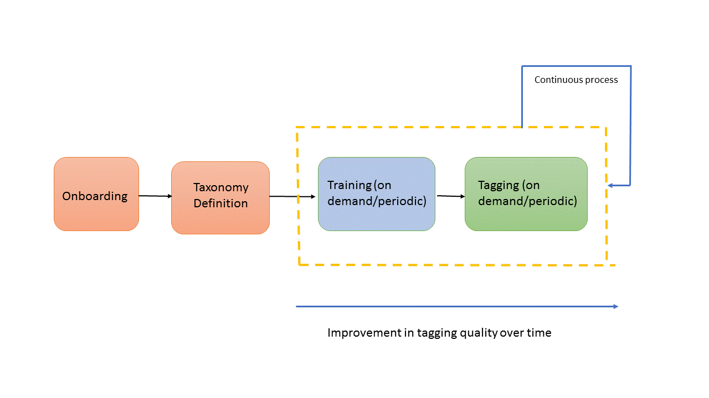

# Training Smart Content Service e assegnazione automatica di tag alle immagini {#train-service-tag-assets}

Le organizzazioni che si occupano di risorse digitali utilizzano sempre di più il vocabolario controllato dalla tassonomia nei metadati delle risorse. Comprende in sostanza un elenco di parole chiave utilizzate comunemente da dipendenti, partner e clienti per fare riferimento e cercare le risorse digitali. L’assegnazione dei tag alle risorse mediante un vocabolario controllato dalla tassonomia consente di individuare e recuperare facilmente le risorse tramite ricerche basate sui tag.

Rispetto ai vocabolari di lingua naturale, l’assegnazione di tag in base alla tassonomia aziendale consente di allineare le risorse all’attività aziendale e garantisce che le risorse più rilevanti vengano visualizzate nelle ricerche. Ad esempio, un produttore di auto può assegnare tag alle immagini di un&#39;auto con nomi di modelli in modo che vengano visualizzate solo le immagini rilevanti quando viene effettuata una ricerca per progettare una campagna promozionale.

In the background, the Smart Tags uses an artificial intelligence framework of [Adobe Sensei](https://www.adobe.com/it/sensei/experience-cloud-artificial-intelligence.html) to train its image recognition algorithm on your tag structure and business taxonomy. Questa funzione di content intelligence viene quindi utilizzata per applicare tag rilevanti a un altro set di risorse.

<!-- TBD: Create a flowchart for how training works in CS.
 
-->

Per utilizzare i tag avanzati, effettuate le seguenti operazioni:

* [Integrare  Experience Manager con  Adobe Developer Console](#integrate-aem-with-aio).
* [Informazioni sui modelli e sulle linee guida](#understand-tag-models-guidelines)dei tag.
* [Formare il modello](#train-model).
* [Assegnare tag alle risorse](#tag-assets)digitali.
* [Gestire tag e ricerche](#manage-smart-tags-and-searches).

I tag avanzati sono applicabili solo ai [!DNL Adobe Experience Manager Assets] clienti. The Smart Tags is available for purchase as an add-on to [!DNL Experience Manager].

<!-- TBD: Is there a link to buy SCS or initiate a sales call. How are AIO services sold? Provide a CTA here to buy or contacts Sales team. -->

## Integrate [!DNL Experience Manager] with Adobe Developer Console {#integrate-aem-with-aio}

>[!IMPORTANT]
>
>Le nuove [!DNL Experience Manager Assets] implementazioni sono integrate con [!DNL Adobe Developer Console] per impostazione predefinita. Consente di configurare più rapidamente la funzionalità smart tag. Nelle precedenti distribuzioni, gli amministratori possono [configurare manualmente l&#39;integrazione](/help/assets/smart-tags-configuration.md#aio-integration)degli smart tag.

È possibile integrarsi [!DNL Adobe Experience Manager] con gli Smart Tags utilizzando [!DNL Adobe Developer Console]. Utilizzate questa configurazione per accedere al servizio Smart Tags dall&#39;interno [!DNL Experience Manager]. Consultate [Configurare  Experience Manager per l’assegnazione di tag avanzati alle risorse](smart-tags-configuration.md) per la configurazione dei tag avanzati. At the back end, the [!DNL Experience Manager] server authenticates your service credentials with the Adobe Developer Console gateway before forwarding your request to the Smart Tags service.

## Informazioni sui modelli e sulle linee guida dei tag {#understand-tag-models-guidelines}

Un modello di tag è un gruppo di tag correlati che si trovano per aspetto visivo dell’immagine. Ad esempio, una raccolta di scarpe può avere tag diversi, ma tutti i tag sono correlati a scarpe e possono appartenere allo stesso modello di tag. I tag possono essere correlati solo con gli aspetti visivi delle immagini chiaramente diversi. Per comprendere la rappresentazione del contenuto di un modello di formazione in [!DNL Experience Manager], visualizzate un modello di formazione come entità di livello principale composta da un gruppo di tag aggiunti manualmente e immagini di esempio per ciascun tag. Ogni tag può essere applicato esclusivamente a un’immagine.

I tag che non possono essere gestiti in modo realistico si riferiscono a:

* Aspetti non visivi e astratti come l&#39;anno o la stagione di rilascio di un prodotto, l&#39;umore o le emozioni evocate da un&#39;immagine.
* Riduzioni visive di prodotti quali camicie con e senza collari o loghi di prodotti di piccole dimensioni incorporati nei prodotti.

Prima di creare un modello di tag e di formare il servizio, identificate un set di tag univoci che meglio descrivano gli oggetti contenuti nelle immagini nel contesto della vostra attività. Assicurati che le risorse del set selezionato siano conformi alle linee guida di formazione.

### Linee guida per la formazione {#training-guidelines}

Le immagini nel set di formazione devono essere conformi alle seguenti linee guida:

**Quantità e dimensioni:** Almeno 10 immagini e massimo 50 immagini per tag.

**Coerenza**: Le immagini di un tag devono essere visivamente simili. È consigliabile unire i tag relativi agli stessi aspetti visivi (come lo stesso tipo di oggetti in un’immagine) in un singolo modello di tag. Ad esempio, non è consigliabile assegnare a tutte queste immagini il tag `my-party` (per la formazione) perché non sono visivamente simili.

**Copertura**: Dovrebbe esserci una varietà sufficiente nelle immagini della formazione. L&#39;idea è quella di fornire alcuni esempi, ma ragionevolmente diversi, in modo che AEM imparare a concentrarsi sulle cose giuste. Se applicate lo stesso tag a immagini visivamente diverse, includete almeno cinque esempi di ciascun tipo. Ad esempio, per il tag *model-down-pose*, includete più immagini di formazione simili all’immagine evidenziata di seguito per il servizio, in modo da identificare immagini simili con maggiore precisione durante l’assegnazione dei tag.

**Distrazione/ostruzione**: Il servizio si allena meglio sulle immagini con meno distrazioni (sfondi visibili, accompagnamento indipendenti, come oggetti/persone con il soggetto principale). Ad esempio, per il tag *casual-shoe*, la seconda immagine non è un buon candidato per l&#39;addestramento.

**Completeness (Completezza):** se un’immagine è idonea per più tag, aggiungi tutti i tag applicabili prima di includere l’immagine nella formazione. Ad esempio, per tag quali *raincoat* e *model-side-view*, aggiungi entrambi i tag alla risorsa idonea prima di includerla nella formazione.

**Numero di tag**:  Adobe consiglia di formare un modello utilizzando almeno due tag distinti e almeno 10 immagini diverse per ciascun tag. In un singolo modello di tag, non aggiungete più di 50 tag.

**Numero di esempi**: Per ciascun tag, aggiungete almeno 10 esempi. Tuttavia,  Adobe raccomanda circa 30 esempi. È supportato un massimo di 50 esempi per tag.

**Prevenire falsi positivi e conflitti**:  Adobe consiglia di creare un singolo modello di tag per un singolo aspetto visivo. Strutturate i modelli di tag in modo da evitare la sovrapposizione di tag tra i modelli. Ad esempio, non utilizzate tag comuni come `sneakers` in due diversi nomi di modelli di tag `shoes` e `footwear`. Il processo di formazione sovrascrive un modello di tag formattato con l’altro per una parola chiave comune.

**Esempi**: Altri esempi sono:

* Create un modello di tag che includa:
   * solo i tag relativi ai modelli di auto.
   * solo i tag relativi ai colori delle camicie.
   * solo i tag relativi alle giacche per donne e uomini.
* Non creare,
   * un modello di tag che include modelli di auto rilasciati nel 2019 e 2020.
   * modelli di tag multipli che includono gli stessi pochi modelli di auto.

**Immagini utilizzate per la formazione**: Potete usare le stesse immagini per formare diversi modelli di tag. Tuttavia, non associano un’immagine a più tag in un modello di tag. È quindi possibile assegnare alla stessa immagine tag diversi appartenenti a diversi modelli di tag.

Non potete annullare la formazione. Le linee guida di cui sopra dovrebbero aiutarvi a scegliere buone immagini da formare.

## Formazione del modello per i tag personalizzati {#train-model}

Per creare e formare un modello per i tag aziendali specifici, procedere come segue:

1. Create i tag necessari e la struttura di tag appropriata. Caricate le immagini rilevanti nell&#39;archivio DAM.
1. Nell’interfaccia [!DNL Experience Manager] utente, accedi a **[!UICONTROL Risorse]** > Formazione **** smart tag.
1. Fai clic su **[!UICONTROL Crea]**. Specificate un **[!UICONTROL Titolo]**, una **[!UICONTROL Descrizione]**.
1. Sfogliare e selezionare i tag presenti nei tag esistenti per `cq:tags` cui si desidera formare il modello. Fai clic su **[!UICONTROL Avanti]**.
1. Nella finestra di dialogo **[!UICONTROL Seleziona risorse]** , fate clic su **[!UICONTROL Aggiungi risorse]** per ciascun tag. Cercate nell&#39;archivio DAM o sfogliate l&#39;archivio per selezionare almeno 10 e al massimo 50 immagini. Selezionate le risorse e non la cartella. Dopo aver selezionato le immagini, fate clic su **[!UICONTROL Seleziona]**.
1. Per visualizzare in anteprima le miniature delle immagini selezionate, fate clic sulla struttura di navigazione davanti a un tag. Per modificare la selezione, fai clic su **[!UICONTROL Aggiungi risorse]**. Una volta completata la selezione, fate clic su **[!UICONTROL Invia]**. L’interfaccia utente visualizza una notifica nella parte inferiore della pagina per indicare che la formazione è avviata.
1. Controllate lo stato della formazione nella colonna **[!UICONTROL Stato]** per ciascun modello di tag. Gli stati possibili sono [!UICONTROL In attesa], [!UICONTROL Formazione]e [!UICONTROL Non riuscito].

*Figura: Passaggi del flusso di lavoro di formazione per formare il modello di tag.*

### Visualizzazione dello stato e del rapporto della formazione {#training-status}

Per verificare se il servizio Smart Tags è addestrato sui tag nel set di risorse di formazione, controllate il rapporto sul flusso di lavoro di formazione dalla console Rapporti.

1. Nell&#39; [!DNL Experience Manager] interfaccia, accedi a **[!UICONTROL Strumenti > Risorse > Rapporti]**.
1. In the **[!UICONTROL Asset Reports]** page, click **[!UICONTROL Create]**.
1. Select the **[!UICONTROL Smart Tags Training]** report, and then click **[!UICONTROL Next]** from the toolbar.
1. Specifica un titolo e una descrizione per il rapporto. In **[!UICONTROL Pianifica rapporto]**, lascia selezionata l’opzione **[!UICONTROL Now (Ora)]**. Se vuoi pianificare il rapporto per un momento successivo, seleziona **[!UICONTROL Later (Più tardi)]** e specifica una data e un’ora. Then, click **[!UICONTROL Create]** from the toolbar.
1. Nella pagina **[!UICONTROL Rapporti su risorse]**, seleziona il rapporto generato. To view the report, click **[!UICONTROL View]** from the toolbar.
1. Rivedete i dettagli del rapporto. Il rapporto mostra lo stato di formazione per i tag che hai appreso. The green color in the **[!UICONTROL Training Status]** column indicates that the Smart Tags service is trained for the tag. Se invece del verde è presente il colore giallo, il training del servizio di contenuti avanzati non è stato completato per un tag specifico. In questo caso, aggiungi altre immagini che contengono il tag in questione ed esegui il flusso di lavoro di formazione per completare il training del servizio per quel tag. Se i tag non vengono visualizzati in questo rapporto, eseguite di nuovo il flusso di lavoro di formazione per questi tag.Tags
1. Per scaricare il rapporto, selezionatelo dall’elenco e fate clic su **[!UICONTROL Scarica]** dalla barra degli strumenti. Il rapporto viene scaricato come foglio di calcolo di Microsoft Excel.

## Assegnare tag alle risorse {#tag-assets}

Dopo aver preparato il servizio Smart Tags, potete attivare il flusso di lavoro dei tag per applicare automaticamente i tag appropriati a un altro set di risorse simili. Potete applicare il flusso di lavoro dei tag periodicamente o ogni volta che lo desiderate. Il flusso di lavoro dei tag si applica a risorse e cartelle.

### Assegnare tag alle risorse dalla console del flusso di lavoro {#tagging-assets-from-the-workflow-console}

1. Nell&#39;interfaccia  Experience Manager, passare a **[!UICONTROL Strumenti > Flusso di lavoro > Modelli]**.
1. From the **[!UICONTROL Workflow Models]** page, select the **[!UICONTROL DAM Smart Tags Assets]** workflow and then click **[!UICONTROL Start Workflow]** from the toolbar.

   

1. Nella finestra di dialogo **[!UICONTROL Esegui flusso di lavoro]** , individuate la cartella payload contenente le risorse per le quali desiderate applicare automaticamente i tag.
1. Specificate un titolo per il flusso di lavoro e un commento facoltativo. Fate clic su **[!UICONTROL Esegui]**.

   

   Andate alla cartella delle risorse e controllate i tag per verificare se i tag delle risorse sono correttamente associati. Per informazioni dettagliate, consultate [Gestione di smart tag](#manage-smart-tags-and-searches).

### Applicare tag alle risorse dalla timeline {#tagging-assets-from-the-timeline}

1. Dall’interfaccia utente di Risorse, selezionate la cartella contenente le risorse o risorse specifiche a cui desiderate applicare gli smart tag.
1. Dall&#39;angolo superiore sinistro, aprite la **[!UICONTROL timeline]**.
1. Aprite le azioni nella parte inferiore della barra laterale sinistra e fate clic su **[!UICONTROL Avvia flusso di lavoro]**.

   

1. Selezionate il flusso di lavoro **[!UICONTROL DAM Smart Tag Assets]** e specificate un titolo per il flusso di lavoro.
1. Fate clic su **[!UICONTROL Avvia]**. Il flusso di lavoro applica i tag alle risorse. Andate alla cartella delle risorse e verificate i tag necessari per verificare se i tag delle risorse sono stati impostati correttamente. Per informazioni dettagliate, consultate [Gestione di smart tag](#manage-smart-tags-and-searches).

>[!NOTE]

>Nei cicli di assegnazione dei tag successivi, solo le risorse modificate dispongono di tag di nuova formazione. Tuttavia, vengono assegnati tag anche alle risorse inalterate se lo spazio tra l’ultimo ciclo di tag e quello corrente per il flusso di lavoro dei tag supera le 24 ore. Per i flussi di lavoro con tag periodici, le risorse inalterate vengono contrassegnate con tag quando l’intervallo di tempo supera i 6 mesi.

### Assegnare tag alle risorse caricate {#tag-uploaded-assets}

 Experience Manager può assegnare automaticamente i tag alle risorse che gli utenti caricano in DAM. A questo scopo, gli amministratori configurano un flusso di lavoro per aggiungere un passaggio disponibile alle risorse degli smart tag. Scoprite [come abilitare i tag avanzati per le risorse](/help/assets/smart-tags-configuration.md#enable-smart-tagging-for-uploaded-assets)caricate.

## Gestione di smart tag e ricerche di risorse {#manage-smart-tags-and-searches}

Potete curare gli smart tag per rimuovere eventuali tag non accurati eventualmente assegnati alle risorse del vostro marchio, in modo da visualizzare solo i tag più rilevanti.

La moderazione degli smart tag consente inoltre di limitare le ricerche di risorse basate su tag, assicurando che le risorse vengano visualizzate nei risultati della ricerca per i tag più rilevanti. In sostanza, elimina le possibilità che risorse non collegate vengano visualizzate nei risultati della ricerca.

Potete anche assegnare un rango più alto a un tag per aumentarne la rilevanza rispetto a una risorsa. La promozione di un tag per una risorsa aumenta le probabilità che la risorsa venga visualizzata nei risultati della ricerca quando viene eseguita una ricerca in base al tag specifico.

Per moderare gli smart tag delle risorse:

1. Nel campo di ricerca Omnico, cercate le risorse in base a un tag.

1.  Inspect i risultati della ricerca per identificare le risorse che non sono pertinenti alla ricerca.

1. Selezionate la risorsa, quindi selezionate l’icona  Gestisci tag dalla barra degli strumenti.

1. Dalla pagina **[!UICONTROL Gestisci tag]** , ispezionate i tag. Se non desiderate che la risorsa venga cercata in base a un tag specifico, selezionate il tag e l’icona  Elimina dalla barra degli strumenti. In alternativa, selezionare `X` il simbolo accanto all&#39;etichetta.

1. Per assegnare un rango più alto a un tag, selezionate il tag e l’icona  Promuovi dalla barra degli strumenti. Il tag promosso viene spostato nella sezione **[!UICONTROL Tag]** .

1. Selezionate **[!UICONTROL Salva]** , quindi selezionate **[!UICONTROL OK]** per chiudere la finestra di dialogo [!UICONTROL Successo] .

1. Andate alla pagina [!UICONTROL Proprietà] della risorsa. Osservate che al tag promosso è stata assegnata un’elevata rilevanza e, di conseguenza, appare più alta nei risultati della ricerca.

### Comprendere AEM risultati di ricerca con gli smart tag {#understandsearch}

Per impostazione predefinita, AEM ricerca combina i termini di ricerca con una `AND` clausola. L&#39;utilizzo di smart tag non modifica questo comportamento predefinito. L&#39;utilizzo di smart tag aggiunge una `OR` clausola aggiuntiva per individuare qualsiasi termine di ricerca negli smart tag applicati. For example, consider searching for `woman running`. Per impostazione predefinita, le risorse con una sola parola chiave `woman` o una sola `running` parola chiave nei metadati non vengono visualizzate nei risultati della ricerca. Tuttavia, in una query di ricerca di questo tipo viene visualizzata una risorsa con `woman` o `running` tramite smart tag. Quindi i risultati della ricerca sono una combinazione di:

* risorse con `woman` e `running` parole chiave nei metadati.

* assets smart tag con una delle parole chiave.

I risultati della ricerca che corrispondono a tutti i termini di ricerca nei campi di metadati vengono visualizzati per primi, seguiti dai risultati della ricerca che corrispondono a uno qualsiasi dei termini di ricerca negli smart tag. Nell&#39;esempio precedente, l&#39;ordine approssimativo di visualizzazione dei risultati della ricerca è:

1. corrispondenze di `woman running` nei vari campi di metadati.
1. corrispondenze di `woman running` in smart tag.
1. corrispondenze di `woman` o di `running` in smart tag.

### Limiti per i tag {#limitations}

Gli smart tag avanzati si basano su modelli di apprendimento delle immagini del marchio e dei relativi tag. Questi modelli non sempre sono perfetti per identificare i tag. La versione corrente dei tag avanzati presenta le seguenti limitazioni:

* Incapacità di riconoscere sottili differenze nelle immagini. Ad esempio, camicie sottili o regolari.
* Impossibile identificare i tag in base a piccoli pattern/parti di un’immagine. Ad esempio, i logo delle T-shirt.
* I tag sono supportati nelle lingue supportate  Experience Manager. Per un elenco delle lingue, consultate Note [sulla versione di](https://experienceleague.adobe.com/docs/experience-manager-64/release-notes/smart-content-service-release-notes.html#languages)Smart Content Service.

Per cercare le risorse con gli smart tag (regolari o avanzati), usate la ricerca Omnisearch delle risorse (ricerca full-text). Non esiste un predicato di ricerca separato per gli smart tag.

>[!NOTE]
>
>La capacità dei tag avanzati di formare i tag e applicarli ad altre immagini dipende dalla qualità delle immagini utilizzate per la formazione.
>Per risultati ottimali,  Adobe consiglia di usare immagini visivamente simili per formare il servizio per ciascun tag.

>[!MORELIKETHIS]
>
>* [Configurare  Experience Manager per smart tag](smart-tags-configuration.md)
>* [Come gli smart tag consentono di gestire le risorse](https://medium.com/adobetech/efficient-asset-management-with-enhanced-smart-tags-887bd47dbb3f)
>* [Assegnazione tag avanzati alle risorse video](smart-tags-video-assets.md)

