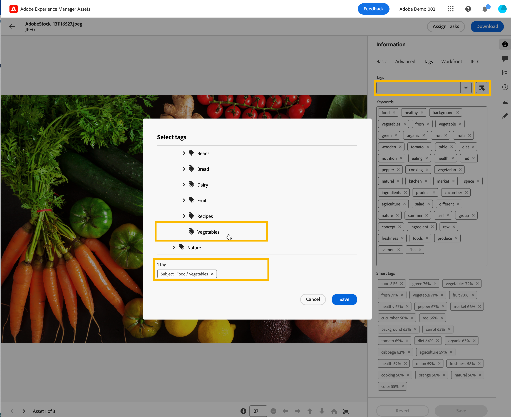

# Gestire i tag nella Vista risorse {#view-assets-and-details}

>[!CONTEXTUALHELP]
>id="assets_taxonomy_management"
>title="Gestisci tag"
>abstract="I tag consentono di categorizzare le risorse così da poter essere sfogliate e cercate in modo più efficiente. Gli amministratori possono utilizzare la struttura gerarchica dell’assegnazione di tag, che facilita l’applicazione di metadati rilevanti, la classificazione delle risorse, il supporto della ricerca, il riutilizzo dei tag, il miglioramento della reperibilità e così via."

I tag consentono di categorizzare le risorse così da poter essere sfogliate e cercate in modo più efficiente. L’assegnazione tag consente di estendere la tassonomia appropriata ad altri utenti e flussi di lavoro.

Gli elenchi semplici di vocabolari controllati possono diventare ingestibili nel tempo. Gli amministratori possono utilizzare la struttura gerarchica dell’assegnazione di tag, che facilita l’applicazione di metadati rilevanti, la classificazione delle risorse, il supporto della ricerca, il riutilizzo dei tag, il miglioramento della reperibilità e così via.

Puoi creare uno spazio dei nomi a livello di radice e creare al suo interno una struttura gerarchica di sottotag. Ad esempio, puoi creare uno spazio dei nomi `Activities` a livello di radice e assegnare i tag `Cycling`, `Hiking` e `Running` al suo interno. Puoi assegnare ulteriori sottotag `Clothing` e `Shoes` all’interno di `Running`.

L’assegnazione tag offre molti vantaggi, ad esempio:

* l’assegnazione tag consente agli autori di organizzare facilmente risorse differenti tramite una tassonomia comune. Gli autori possono cercare e organizzare rapidamente le risorse in base a tag comuni.

* I tag gerarchici sono estremamente flessibili e costituiscono un modo eccellente di organizzare i termini in modo logico. È possibile rappresentare interi sistemi tassonomici tramite spazi dei nomi, tag e sottotag.

* I tag possono evolvere nel tempo in funzione dei cambiamenti del vocabolario organizzativo.

* I tag gestiti nella Vista amministrazione rimangono sincronizzati con i tag gestiti nella Vista risorse garantendo la governance e l’integrità dei metadati.

Per poter applicare tag alle risorse, è necessario prima creare uno spazio dei nomi, quindi creare e aggiungervi i tag. È possibile anche creare dei tag e aggiungerli a uno spazio dei nomi esistente. Tutti i tag creati a livello di radice vengono aggiunti automaticamente allo spazio dei nomi Tag standard. È possibilie quindi aggiungere il campo Tag al modulo dei metadati in modo che venga visualizzato nella pagina dei dettagli della risorsa. Dopo aver configurato queste impostazioni, puoi iniziare ad applicare i tag alle risorse.

>[!NOTE]
>
>È necessario aggiungere il campo Tag al modulo dei metadati solo se non si utilizza il modulo dei metadati predefinito.

Nella Vista amministrazione, sono disponibili ulteriori funzionalità oltre a quelle indicate in questo articolo, tra cui unione, ridenominazione, localizzazione e pubblicazione di tag.

## Creazione di uno spazio dei nomi {#creating-a-namespace}

Uno spazio dei nomi è un contenitore per i tag che può esistere solo a livello di radice. È possibile iniziare a impostare la struttura gerarchica dei tag definendo per prima cosa un nome logico per lo spazio dei nomi. Se non aggiungi un tag a nessuno degli spazi dei nomi esistenti, il tag si sposta automaticamente nei Tag standard.

Per creare uno spazio dei nomi, esegui le seguenti operazioni:

1. Passa a `Taxonomy Management` in `Settings` per visualizzare l’elenco degli spazi dei nomi esistenti. È anche possibile visualizzare la data dell’ultima modifica, l’utente che ha modificato lo spazio dei nomi o i tag al suo interno e il numero di volte in cui il tag viene utilizzato in una risorsa.
1. Fai clic su `Create Namespace`.
1. Aggiungi `Title`, `Name` e `Description` per lo spazio dei nomi. L’input specificato nel campo `Title` viene visualizzato nella parte superiore della gerarchia. Ad esempio, nell’immagine seguente, **Attività** fa riferimento al titolo dello spazio dei nomi.

   

   <!--
    >[!NOTE]
    >
    >You can use `Name` as a primary key if you are using any other metadata management tool is the source of truth for taxonomy values, you can use the name as a primary key.
    >
    -->

1. Fai clic su `Save`.

## Aggiunta di tag a uno spazio dei nomi {#adding-tags-to-namespace}

Per aggiungere tag a uno spazio dei nomi, esegui le seguenti operazioni:

1. Passa a `Taxonomy Management`.
1. Seleziona lo spazio dei nomi e fai clic su `Create` per creare il tag al livello superiore nello spazio dei nomi. Se devi creare un sottotag in un tag esistente in uno spazio dei nomi, seleziona il tag e fai clic su `Create`.
   

   In questo esempio, l’immagine a sinistra rappresenta il tag direttamente nello spazio dei nomi `automobile-four-wheeler` visualizzato nel campo `Path`. L’immagine a destra è un esempio di sottotag aggiunti all’interno di un tag in quanto, oltre allo spazio dei nomi, sono presenti più nomi di tag `jeep` e `jeep-meridian` visualizzati nel campo `Path`.
1. Specifica il titolo, il nome e la descrizione del tag, quindi fai clic su `Save`.

   >[!NOTE]
   >
   >* I campi `Title` e `Name` sono obbligatori, mentre il campo `Description` è facoltativo.
   >* Per impostazione predefinita, lo strumento copia il testo digitato nel campo Titolo rimuove gli spazi vuoti o i caratteri speciali (. &amp; / \ : * ? [ ] | &quot; %) e lo memorizza come Nome.
   >* È possibile aggiornare il campo `Title` in un secondo momento ma il campo `Name` è di sola lettura.

## Aggiunta di tag ai tag standard {#adding-tags-to-standard-tags}

I tag non strutturati o i tag privi di gerarchia sono memorizzati sotto spazio dei nomi `Standard Tags`. Inoltre, se desideri aggiungere altri termini descrittivi senza influire sulla tassonomia gestita, puoi memorizzare tale valore in `Standard Tags`. È possibile spostare questi valori in spazi dei nomi strutturati nel tempo. Inoltre, è possibile utilizzare lo spazio dei nomi `Standard Tags` come voce in formato libero per le parole chiave.

Per creare un tag standard, fai clic su `Create Tag` a livello di radice. Specifica titolo, nome e descrizione, quindi fai clic su `Save`.

>[!NOTE]
>
>Se elimini lo spazio dei nomi `Standard Tags` utilizzando la vista Amministratore, i tag creati a livello di radice non vengono visualizzati nell’elenco dei tag disponibili.

## Spostamento dei tag {#moving-tags}

Se i tag vengono memorizzati in una gerarchia errata o se la tassonomia cambia nel tempo, è possibile spostare i tag selezionati per mantenere l’integrità dei dati. Durante lo spostamento dei tag è necessario tenere presenti le seguenti condizioni:

* I tag possono essere spostati solo al di sotto degli spazi dei nomi esistenti o all’interno di una gerarchia di tag esistente.
* Non è possibile spostare i tag nella directory principale per diventare uno spazio dei nomi.
* Lo spostamento di un tag principale comporta anche lo spostamento di tutti i tag secondari memorizzati nella gerarchia.

Per spostare i tag da una posizione a un’altra, effettua le seguenti operazioni:

1. Seleziona il tag o l’intera gerarchia di tag nello spazio dei nomi appropriato e fai clic su `Move`.
1. Nella finestra di dialogo Sposta, seleziona il nuovo tag di destinazione o spazio dei nomi utilizzando la sezione `Select Tag`.
1. Fai clic su `Save`. Il tag viene visualizzato nella nuova posizione.

## Modifica dei tag {#editing-tags}

Per modificare il titolo del tag, selezionalo e fai clic su `Edit`. Specifica il nuovo titolo e fai clic su `Save`.

>[!NOTE]
>
>* Il `Name` di un tag non può essere aggiornato. Anche il percorso principale di un tag è basato sul nome del tag. Il percorso rimane invariato anche se si aggiorna il campo `Title`.
>* Ulteriori operazioni, quali unione, localizzazione e pubblicazione, sono disponibili nella vista Amministratore.

## Eliminazione dei tag {#deleting-tags}

È possibile eliminare più spazi dei nomi o tag contemporaneamente. L’operazione di eliminazione non può essere annullata.

Per eliminare i tag, effettua le seguenti operazioni:

1. Seleziona lo spazio dei nomi o il tag e fai clic su `Delete`.
1. Fai clic su `Confirm`.

>[!NOTE]
>
>* Se si elimina il tag principale o lo spazio dei nomi, vengono eliminati anche i tag secondari memorizzati nella gerarchia. Per eliminare o aggiornare lo spazio dei nomi principale, si consiglia di [spostare i tag](#moving-tags) nella nuova destinazione prima di eliminare la gerarchia principale.
>* L’eliminazione di un tag comporta anche l’eliminazione di tutti i relativi riferimenti dalle risorse.
>* Non puoi eliminare i tag standard esistenti a livello principale.

## Aggiunta del componente Tag al modulo Metadati {#adding-tags-to-metadata-form}

Il componente Tag viene aggiunto al modulo metadati `default` automaticamente. Puoi progettare un [modulo metadati](https://experienceleague.adobe.com/docs/experience-manager-assets-essentials/help/metadata.html?lang=it#metadata-forms) utilizzando un modello o da zero. Se non utilizzi un modello di modulo Metadati esistente, puoi modificare il modulo Metadati e aggiungere il componente Tag. La mappatura della proprietà dei metadati viene compilata automaticamente e non può essere modificata in questo momento. Gli utenti nella vista Amministratore possono aggiornare la mappatura per memorizzare i valori dei tag utilizzando spazi dei nomi personalizzati ed esporre solo sottoinsiemi di gerarchie utilizzando percorsi principali.

Guarda questo video rapido per vedere come aggiungere il componente Tag al modulo di metadati:

>[!VIDEO](https://video.tv.adobe.com/v/3420452)

### Aggiunta di tag alle risorse {#adding-tags-to-assets}

1. Vai alla pagina dei dettagli della risorsa e passa alla sezione `Tags` del modulo Metadati.
1. Seleziona l’icona del selettore tag posta accanto al campo Tag oppure inizia a digitare il nome di un tag per visualizzare i risultati suggeriti.

   

1. Seleziona uno o più tag. Il tag secondario viene selezionato automaticamente insieme al tag principale o allo spazio dei nomi.
I tag modificati nella vista Risorse vengono applicati anche nella vista Amministratore.

## Limitazioni {#limitations}

Le seguenti funzionalità avanzate di tassonomia non sono al momento disponibili in Visualizza Risorse e sono accessibili solo in Visualizza Amministratore:

* **Localizzazione:** qualsiasi localizzazione deve essere eseguita nella vista Amministratore.
* **Percorso principale:** i percorsi principali non sono configurabili. Tutti gli spazi dei nomi memorizzati in Gestione tassonomia sono esposti nella proprietà Tag in Visualizza Risorse.
* **Tag standard:** i tag Standard applicati in Visualizza Amministrazione sono visibili in Visualizza Risorse. Non è possibile aggiungere nuovi tag standard in Visualizza Risorse della pagina Dettagli risorse. I valori esistenti memorizzati nei tag standard vengono applicati alla pagina Dettagli risorse.
* **Spazi dei nomi personalizzati:** i tag non possono essere mappati su spazi dei nomi personalizzati.
* **Visualizzazione dei riferimenti:** gli amministratori possono visualizzare l’utilizzo dei tag in Visualizza Risorse. Ciò vale per tutte le risorse che utilizzano attivamente un tag. Tuttavia, gli amministratori non possono visualizzare risorse singole utilizzando il tag nei riferimenti.

<!--
*   Overview
*   Benefits
*   Prerequisites and Permissions
*   Configuration
*   Managing Tags
    *   Creating a Namespace
    *   Adding Tags to a Namespace
    *   Adding Tags to Standard Tags
    *   Moving Tags
    *   Editing Tags
    *   Deleting Tags
*   Applying Tags
    *   Adding Tags to the Metadata form
    *   Adding Tags to Assets
*   Limitations
-->
