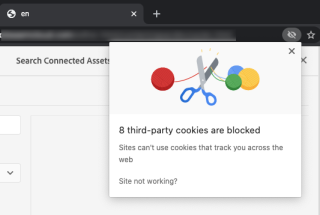

# Utilizzare la funzione Risorse collegate per condividere risorse DAM in [!DNL Experience Manager Sites] {#use-connected-assets-to-share-dam-assets-in-aem-sites}

Nelle grandi aziende l’infrastruttura necessaria per la creazione di siti web può essere dislocata in luoghi diversi. A volte, le funzionalità per la creazione di siti web e le risorse digitali utilizzate per creare i siti possono trovarsi in implementazioni diverse. Un motivo può essere rappresentato dalla distribuzione geografica delle implementazioni esistenti necessarie per lavorare insieme. Un altro motivo può essere rappresentato dalle acquisizioni che portano a infrastrutture eterogenee, tra cui [!DNL Experience Manager] versioni, che l&#39;azienda madre desidera utilizzare insieme.

La funzionalità Risorse collegate supporta i casi d’uso precedenti mediante l’integrazione di [!DNL Experience Manager Sites] e [!DNL Experience Manager Assets]. Gli utenti possono creare pagine web in [!DNL Sites] che utilizzano le risorse digitali da un [!DNL Assets] distribuzioni.

>[!NOTE]
>
>Configurare le risorse collegate solo quando è necessario utilizzare le risorse disponibili in una distribuzione DAM remota su una distribuzione Sites separata per la creazione di pagine web.

## Panoramica della funzione Risorse collegate {#overview-of-connected-assets}

Durante la modifica di pagine in [!UICONTROL Editor pagina] come destinazione, gli autori possono cercare, sfogliare e incorporare facilmente le risorse di un’altra [!DNL Assets] implementazione che funge da origine di risorse. Gli amministratori creano un’integrazione unica di una distribuzione di [!DNL Experience Manager] con [!DNL Sites] capacità con un&#39;altra implementazione di [!DNL Experience Manager] con [!DNL Assets] funzionalità. Puoi anche utilizzare le immagini Dynamic Media nelle pagine web del sito tramite Risorse collegate e sfruttare le funzionalità di Dynamic Media, ad esempio ritaglio avanzato e predefiniti per immagini.

Per [!DNL Sites] autori, le risorse remote sono disponibili come risorse locali di sola lettura. Questa funzionalità supporta la ricerca e l’accesso diretti alle risorse remote nell’Editor sito. Per tutti gli altri casi d’uso che possono richiedere che l’intero asset-corpus sia disponibile su Sites, considera la migrazione delle risorse in blocco invece di utilizzare le risorse collegate.

### Prerequisiti e implementazioni supportate {#prerequisites}

Prima di utilizzare o configurare questa funzionalità, verifica questi aspetti:

* Gli utenti fanno parte dei gruppi di utenti appropriati per ciascuna distribuzione.
* Per [!DNL Adobe Experience Manager] tipi di distribuzione, uno dei criteri supportati è soddisfatto. [!DNL Experience Manager] as a Cloud Service [!DNL Assets] funziona con [!DNL Experience Manager] 6.5. Per ulteriori informazioni su come funziona questa funzionalità in [!DNL Experience Manager] 6.5, cfr. [Risorse collegate in [!DNL Experience Manager] 6,5 [!DNL Assets]](https://experienceleague.adobe.com/docs/experience-manager-65/assets/using/use-assets-across-connected-assets-instances.html).

   |  | [!DNL Sites] as a [!DNL Cloud Service] | [!DNL Experience Manager] 6,5 [!DNL Sites] in AMS | [!DNL Experience Manager] 6,5 [!DNL Sites] on-premise |
   |---|---|---|---|
   | **[!DNL Experience Manager Assets]as a[!DNL Cloud Service]** | Supportato | Supportato | Supportato |
   | **[!DNL Experience Manager]6,5 [!DNL Assets] in AMS** | Supportato | Supportato | Supportato |
   | **[!DNL Experience Manager]6,5 [!DNL Assets] on-premise** | Non supportato | Non supportato | Non supportato |

### Formati di file supportati {#mimetypes}

Gli autori ricercano le immagini e i seguenti tipi di documenti in Content Finder e trascinano le risorse ricercate nell’Editor pagina. I documenti vengono aggiunti al `Download` componenti e immagini `Image` componente. Gli autori possono anche aggiungere le risorse remote in qualsiasi [!DNL Experience Manager] componente che estende il valore predefinito `Download` o `Image` componenti. I formati supportati sono:

* **Formati immagine**: I formati che [Componente immagine](file-format-support.md#image-formats) supporta.
* **Formati documento**: Consulta la sezione [formati di documento supportati](file-format-support.md#document-formats).

### Utenti e gruppi interessati {#users-and-groups-involved}

Di seguito sono descritti i vari ruoli coinvolti nella configurazione e la funzionalità e i relativi gruppi di utenti. L’ambito locale viene utilizzato per il caso d’uso in cui un autore crea una pagina web. L’ambito remoto viene utilizzato per l’implementazione DAM in cui sono ospitate le risorse necessarie. La [!DNL Sites] le risorse remote vengono recuperate dall’autore.

| Ruolo | Ambito | Gruppo di utenti | Descrizioni |
|------|--------|-----------|----------|
| [!DNL Sites] administrator | Locale | [!DNL Experience Manager] `administrators` | Configurazione [!DNL Experience Manager] e configura l&#39;integrazione con il telecomando [!DNL Assets] distribuzione. |
| Utente DAM | Locale | `Authors` | Utilizzato per visualizzare e duplicare le risorse recuperate in `/content/DAM/connectedassets/`. |
| [!DNL Sites] creazione | Locale | <ul><li>`Authors` (con accesso in lettura sul DAM remoto e accesso all’authoring sul locale) [!DNL Sites]) </li> <li>`dam-users` locale [!DNL Sites]</li></ul> | Gli utenti finali [!DNL Sites] autori che utilizzano questa integrazione per velocizzare i contenuti. Gli autori possono cercare e sfogliare le risorse in DAM remoto utilizzando [!UICONTROL Content Finder] e utilizzando le immagini richieste nelle pagine web locali. |
| [!DNL Assets] administrator | Remoto | [!DNL Experience Manager] `administrators` | Configurare la condivisione risorse tra le origini (CORS, Cross-Origin Resource Sharing). |
| Utente DAM | Remoto | `Authors` | Autore ruolo sul telecomando [!DNL Experience Manager] distribuzione. Cercare e sfogliare le risorse in Risorse collegate mediante l’ [!UICONTROL Content Finder]. |
| Distributore DAM (utente tecnico) | Remoto | <ul> <li> [!DNL Sites] `Authors`</li> <li> `connectedassets-assets-techaccts` </li> </ul> | Questo utente presente nell&#39;implementazione remota viene utilizzato da [!DNL Experience Manager] server locale (non il [!DNL Sites] ruolo autore) per recuperare le risorse remote, per conto di [!DNL Sites] autore. |
| [!DNL Sites] utente tecnico | Locale | `connectedassets-sites-techaccts` | Permette [!DNL Assets] distribuzione per cercare riferimenti a risorse nel [!DNL Sites] pagine web. |

### Architettura delle risorse collegate {#connected-assets-architecture}

L’Experience Manager consente di collegare un’implementazione DAM remota come origine a più Experienci Manager [!DNL Sites] distribuzioni. Tuttavia, è possibile collegare un [!DNL Sites] distribuzione con una sola implementazione DAM remota.

Valuta il numero ottimale di istanze Sites per connettersi a una distribuzione DAM remota. Adobe consiglia di collegare in modo incrementale le istanze Sites alla distribuzione e di verificare che non vi sia alcun impatto sulle prestazioni nel DAM remoto, in quanto ogni istanza di Sites connessa contribuisce al traffico dati sul DAM remoto.

I seguenti diagrammi illustrano gli scenari supportati:

Il diagramma seguente illustra uno scenario non supportato:

## Configura una connessione tra [!DNL Sites] e [!DNL Assets] distribuzioni {#configure-a-connection-between-sites-and-assets-deployments}

Un [!DNL Experience Manager] l’amministratore può creare questa integrazione. Una volta create, le autorizzazioni necessarie per utilizzarle vengono stabilite tramite gruppi di utenti. I gruppi di utenti sono definiti nella [!DNL Sites] e sull’implementazione DAM.

Per configurare le risorse collegate e locali [!DNL Sites] connettività, segui questi passaggi:

1. Accedere a un [!DNL Sites] distribuzione. Questo [!DNL Sites] la distribuzione viene utilizzata per l’authoring delle pagine web, ad esempio in `https://<sites_server_fqdn>:[port]`. Come avviene l’authoring delle pagine [!DNL Sites] distribuzione, chiamiamo il [!DNL Sites] distribuzione locale dal punto di vista dell’authoring delle pagine.

1. Accedere a un [!DNL Assets] distribuzione. Questo [!DNL Assets] l’implementazione viene utilizzata per gestire le risorse digitali, ad esempio in `https://[assets_servername]:port`.

1. Assicurati che gli utenti e i ruoli con l&#39;ambito appropriato esistano nel [!DNL Sites] e sul [!DNL Assets] distribuzione in AMS. Crea un utente tecnico il [!DNL Assets] distribuzione e aggiunta al gruppo di utenti menzionato in [utenti e gruppi interessati](/help/assets/use-assets-across-connected-assets-instances.md#users-and-groups-involved).

1. Accedere al locale [!DNL Sites] implementazione in `https://[sites_servername]:port`. Fai clic su **[!UICONTROL Strumenti]** > **[!UICONTROL Risorse]** > **[!UICONTROL Configurazione risorse collegate]** e fornisci i seguenti valori:

   1. A **[!UICONTROL Titolo]** della configurazione.
   1. **[!UICONTROL URL DAM remoto]** è l&#39;URL del [!DNL Assets] posizione nel formato `https://[assets_servername]:[port]`.
   1. Credenziali di un distributore DAM (utente tecnico).
   1. In **[!UICONTROL Punto di montaggio]** campo , immettere il [!DNL Experience Manager] percorso [!DNL Experience Manager] recupera le risorse. Ad esempio, la cartella `connectedassets`. Le risorse recuperate da DAM vengono memorizzate in questa cartella nella cartella [!DNL Sites] distribuzione.
   1. **[!UICONTROL URL siti locali]** è la posizione del [!DNL Sites] distribuzione. [!DNL Assets] la distribuzione utilizza questo valore per mantenere i riferimenti alle risorse digitali recuperate da questo [!DNL Sites] distribuzione.
   1. Credenziali di [!DNL Sites] utente tecnico.
   1. Il valore di **[!UICONTROL Soglia ottimizzazione trasferimento binario originale]** specifica se le risorse originali (comprese le rappresentazioni) vengono trasferite in modo sincrono o meno. Le risorse con file di dimensioni minori possono essere recuperate rapidamente, mentre le risorse con file di dimensioni relativamente maggiori sono sincronizzate in modo asincrono. Il valore dipende dalle funzionalità di rete.
   1. Seleziona **[!UICONTROL Archivio dati condiviso con risorse collegate]**, se utilizzi un datastore per memorizzare le risorse e l’archivio dati viene condiviso tra entrambe le implementazioni. In questo caso, il limite di soglia non ha importanza in quanto i binari effettivi delle attività sono disponibili nell’archivio dati e non vengono trasferiti.

   

   *Figura: Configurazione tipica per la funzionalità Risorse collegate.*

1. Le risorse digitali esistenti su [!DNL Assets] la distribuzione è già stata elaborata e i rendering vengono generati. Queste rappresentazioni vengono recuperate utilizzando questa funzionalità per cui non è necessario rigenerare le rappresentazioni. Disattiva i moduli di avvio del flusso di lavoro per impedire la rigenerazione dei rendering. Regola le configurazioni del modulo di avvio in ([!DNL Sites]) distribuzione per escludere `connectedassets` (le risorse vengono recuperate in questa cartella).

   1. On [!DNL Sites] distribuzione, fai clic su **[!UICONTROL Strumenti]** > **[!UICONTROL Flusso di lavoro]** > **[!UICONTROL Lanci]**.

   1. Individua i moduli di avvio con flussi di lavoro come **[!UICONTROL Aggiorna risorsa DAM]** e **[!UICONTROL Writeback di metadati DAM]**.

   1. Seleziona il modulo di avvio del flusso di lavoro e fai clic su **[!UICONTROL Proprietà]** nella barra delle azioni.

   1. In [!UICONTROL Proprietà] procedura guidata, modificare **[!UICONTROL Percorso]** campi come le mappature seguenti per aggiornare le espressioni regolari per escludere il punto di montaggio **[!UICONTROL connectedassets]**.

   | Prima | Dopo |
   | ------ | ------------ |
   | `/content/dam(/((?!/subassets).)*/)renditions/original` | `/content/dam(/((?!/subassets)(?!connectedassets).)*/)renditions/original` |
   | `/content/dam(/.*/)renditions/original` | `/content/dam(/((?!connectedassets).)*/)renditions/original` |
   | `/content/dam(/.*)/jcr:content/metadata` | `/content/dam(/((?!connectedassets).)*/)jcr:content/metadata` |

   >[!NOTE]
   >
   >Quando gli autori recuperano una risorsa, vengono recuperati tutti i rendering disponibili nell’implementazione remota. Se desideri creare più rendering per una risorsa recuperata, ignora questo passaggio di configurazione. La [!UICONTROL Risorsa di aggiornamento DAM] viene attivato il flusso di lavoro e crea più rappresentazioni. Queste rappresentazioni sono disponibili solo nella versione locale [!DNL Sites] e non nell’implementazione remota di DAM.

1. Aggiungi il [!DNL Sites] distribuzione come origine consentita nella configurazione CORS nel [!DNL Assets] distribuzione. Per ulteriori informazioni, consulta [comprendere CORS](https://experienceleague.adobe.com/docs/experience-manager-learn/foundation/security/understand-cross-origin-resource-sharing.html).

1. Configura [supporto per cookie dello stesso sito](/help/security/same-site-cookie-support.md).

Puoi controllare la connettività tra i [!DNL Sites] implementazioni e [!DNL Assets] distribuzione.

![Test di connessione delle risorse collegate configurate [!DNL Sites]](assets/connected-assets-multiple-config.png)
*Figura: Test di connessione delle risorse collegate configurate [!DNL Sites].*

<!-- TBD: Check if Launchers are to be disabled on CS instances. Is this option even available to the users on CS? -->

## Utilizzare le risorse Dynamic Media {#dynamic-media-assets}

Con Risorse collegate puoi utilizzare le risorse di immagini elaborate da [!DNL Dynamic Media] dall’implementazione remota di DAM nelle pagine Sites e sfrutta le funzionalità di Dynamic Media, ad esempio ritaglio avanzato e predefiniti immagine.

Per utilizzare [!DNL Dynamic Media] con risorse collegate:

1. Configura [!DNL Dynamic Media] nella distribuzione remota di DAM con modalità di sincronizzazione abilitata.
1. Configura [Risorse collegate](#configure-a-connection-between-sites-and-assets-deployments).
1. Configura [!DNL Dynamic Media] nell’istanza Sites con lo stesso nome società configurato nel DAM remoto. L’implementazione Sites deve disporre dell’accesso in sola lettura all’account Dynamic Media per lavorare con le risorse connesse. Pertanto, assicurati di disabilitare la modalità di sincronizzazione nella configurazione di Dynamic Media sull’istanza di Sites.

>[!CAUTION]
>
>Con risorse collegate e [!DNL Dynamic Media] configurazione, non puoi utilizzare [!DNL Dynamic Media] per elaborare le risorse locali disponibili nel [!DNL Sites] distribuzione.

## Configurare [!DNL Dynamic Media] {#configure-dynamic-media}

Per configurare [!DNL Dynamic Media] su [!DNL Assets] e [!DNL Sites] distribuzioni:

1. Crea la configurazione delle risorse collegate come descritto in precedenza, tranne per la configurazione della funzionalità, seleziona **[!UICONTROL Recupero del rendering originale per le risorse collegate a Dynamic Media]** opzione .

1. Configura [!DNL Dynamic Media] locale [!DNL Sites] e remoto [!DNL Assets] distribuzioni. Segui le istruzioni per [configurare [!DNL Dynamic Media]](/help/assets/dynamic-media/config-dm.md#configuring-dynamic-media-cloud-services).

   * Usa lo stesso nome società in tutte le configurazioni.
   * In locale [!DNL Sites], in [!UICONTROL Modalità di sincronizzazione Dynamic Media], seleziona **[!UICONTROL Disabilitata per impostazione predefinita]**. La [!DNL Sites] l&#39;implementazione deve disporre dell&#39;accesso in sola lettura al [!DNL Dynamic Media] conto.
   * In locale [!DNL Sites], nella **[!UICONTROL Pubblicare le risorse]** seleziona **[!UICONTROL Pubblicazione selettiva]**. Non selezionare **[!UICONTROL Sincronizza tutto il contenuto]**.
   * In remoto [!DNL Assets] installazione, [!UICONTROL Modalità di sincronizzazione Dynamic Media], seleziona **[!UICONTROL Abilitato per impostazione predefinita]**.

1. Abilita [[!DNL Dynamic Media] supporto per il componente core immagine](https://experienceleague.adobe.com/docs/experience-manager-core-components/using/components/image.html#dynamic-media). Questa funzione abilita il valore predefinito [Componente immagine](https://www.aemcomponents.dev/content/core-components-examples/library/core-content/image.html) per visualizzare [!DNL Dynamic Media] immagini quando [!DNL Dynamic Media] le immagini vengono utilizzate dagli autori nelle pagine web del locale [!DNL Sites] distribuzione.

## Utilizzare le risorse remote {#use-remote-assets}

Gli autori del sito web utilizzano Content Finder per connettersi alla distribuzione DAM. Gli autori possono sfogliare, cercare e trascinare le risorse remote in un componente. Per eseguire l’autenticazione nel DAM remoto, mantieni a portata di mano le credenziali fornite dall’amministratore (se presenti).

Gli autori possono utilizzare le risorse disponibili nell’implementazione DAM locale e DAM remota, in un’unica pagina web. Utilizza Content Finder per passare dalla ricerca nel DAM locale alla ricerca nel DAM remoto.

Vengono recuperati solo i tag delle risorse remote con un tag corrispondente esatto insieme alla stessa gerarchia di tassonomia, disponibile nella posizione locale [!DNL Sites] distribuzione. Tutti gli altri tag vengono eliminati. Gli autori possono cercare le risorse remote utilizzando tutti i tag presenti nel telecomando [!DNL Experience Manager] , poiché offre una ricerca full-text.

### Procedura dettagliata per l’utilizzo {#walk-through-of-usage}

Utilizza la configurazione precedente per provare l’esperienza di authoring e comprendere il funzionamento di questa caratteristica. Utilizza documenti o immagini di tua scelta nell’implementazione remota di DAM.

1. Passa a [!DNL Assets] interfaccia nell&#39;implementazione remota tramite l&#39;accesso **[!UICONTROL Risorse]** > **[!UICONTROL File]** da [!DNL Experience Manager] workspace. In alternativa, puoi accedere a `https://[assets_servername_ams]:[port]/assets.html/content/dam` in un browser. Carica le risorse che hai scelto.

1. Sulla [!DNL Sites] distribuzione, nell’attivatore del profilo in alto a destra, fai clic su **[!UICONTROL Impersona come]**. Specifica il nome utente, seleziona l’opzione fornita e fai clic su **[!UICONTROL OK]**.

1. Apri un [!DNL Sites] e modificare la pagina.

   Fai clic su **[!UICONTROL Attiva/Disattiva pannello laterale]** nell’angolo in alto a sinistra della pagina.

1. Apri [!UICONTROL Risorse] scheda (Ricerca contenuti remoti) e fai clic su **[!UICONTROL Accedere alle risorse collegate]**.

1. Specifica le credenziali per accedere alle risorse collegate. Questo utente dispone delle autorizzazioni di authoring per entrambi i [!DNL Experience Manager] distribuzioni.

1. Cerca la risorsa aggiunta a DAM. Le risorse remote vengono visualizzate nel pannello a sinistra. Filtra immagini o documenti e filtra ulteriormente i tipi di documenti supportati. Trascina le immagini su un componente `Image`, e i documenti su un componente `Download`.

   Le risorse recuperate sono di sola lettura nel locale [!DNL Sites] distribuzione. È comunque possibile utilizzare le opzioni fornite dal [!DNL Sites] componenti per modificare la risorsa recuperata. La modifica per componenti non è distruttiva.

   

   *Figura: opzioni di filtro per tipi di documenti e immagini nella ricerca di risorse in DAM remoto.*

1. Un autore del sito riceve una notifica se l’originale di una risorsa viene recuperato in modo asincrono e se un’attività di recupero ha esito negativo. Durante l’authoring o anche dopo l’authoring, gli autori possono visualizzare informazioni dettagliate sulle attività di recupero e sugli errori nella sezione [processi asincroni](/help/operations/asynchronous-jobs.md) interfaccia utente.

   

   *Figura: notifica relativa al recupero asincrono delle risorse in background.*

1. Quando si pubblica una pagina, [!DNL Experience Manager] visualizza un elenco completo delle risorse utilizzate nella pagina. Assicurati che le risorse remote vengano recuperate correttamente al momento della pubblicazione. Per controllare lo stato di ciascuna risorsa recuperata, consulta [processi asincroni](/help/operations/asynchronous-jobs.md) interfaccia utente.

   >[!NOTE]
   >
   >Anche se una o più risorse remote non vengono recuperate completamente, la pagina viene pubblicata. La [!DNL Experience Manager] nell’area di notifica viene visualizzata una notifica per gli errori visualizzati nella pagina processi asincroni.

>[!CAUTION]
>
>Una volta utilizzate in una pagina web, le risorse remote recuperate possono essere cercate e utilizzate da chiunque disponga delle autorizzazioni per accedere alla cartella locale. Le risorse recuperate vengono memorizzate nella cartella locale (`connectedassets` nel passaggio precedente). Le risorse possono inoltre essere cercate e visualizzate nell’archivio locale tramite [!UICONTROL Content Finder].

Le risorse recuperate possono essere utilizzate come qualsiasi altra risorsa locale, ad eccezione del fatto che i metadati associati non possono essere modificati.

### Controllare l&#39;utilizzo di una risorsa in più pagine web {#asset-usage-references}

[!DNL Experience Manager] consente agli utenti DAM di controllare tutti i riferimenti a una risorsa. Consente di comprendere e gestire l’utilizzo di una risorsa in remoto [!DNL Sites] e in attività composte. Molti autori di pagine web su [!DNL Experience Manager Sites] La distribuzione può utilizzare una risorsa su un DAM remoto in pagine web diverse. Per semplificare la gestione delle risorse e non portare a riferimenti interrotti, è importante che gli utenti DAM verifichino l’utilizzo di una risorsa nelle pagine web locali e remote. La [!UICONTROL Riferimenti] scheda in una risorsa [!UICONTROL Proprietà] In questa pagina sono elencati i riferimenti locali e remoti della risorsa.

Per visualizzare e gestire i riferimenti nel [!DNL Assets] implementazione, segui questi passaggi:

1. Seleziona una risorsa in [!DNL Assets] Console e fai clic su **[!UICONTROL Proprietà]** dalla barra degli strumenti.
1. Fai clic su **[!UICONTROL Riferimenti]** scheda . Vedi **[!UICONTROL Riferimenti locali]** per l’utilizzo della risorsa nel [!DNL Assets] distribuzione. Vedere **[!UICONTROL Riferimenti remoti] per l’utilizzo della risorsa su [!DNL Sites] distribuzione in cui la risorsa è stata recuperata utilizzando la funzionalità Risorse collegate.

   

1. I riferimenti per [!DNL Sites] le pagine visualizzano il conteggio totale dei riferimenti per ogni locale [!DNL Sites]. Potrebbe essere necessario un po&#39; di tempo per trovare tutti i riferimenti e visualizzare il numero totale di riferimenti.
1. L’elenco dei riferimenti è interattivo e gli utenti DAM possono fare clic su un riferimento per aprire la pagina di riferimento. Se non è possibile recuperare i riferimenti remoti per qualche motivo, viene visualizzata una notifica che informa l’utente dell’errore.
1. Gli utenti possono spostare o eliminare la risorsa. Quando si sposta o si elimina una risorsa, il numero totale di riferimenti a tutte le risorse o cartelle selezionate viene visualizzato in una finestra di avviso. Quando si elimina una risorsa per la quale i riferimenti non sono ancora stati recuperati, viene visualizzata una finestra di dialogo di avviso.

   

### Gestire gli aggiornamenti alle risorse in DAM remoto {#handling-updates-to-remote-assets}

Dopo [configurazione di una connessione](#configure-a-connection-between-sites-and-assets-deployments) tra le implementazioni remote di DAM e Sites, le risorse in DAM remoto sono rese disponibili nell’implementazione di Sites. Puoi quindi eseguire le operazioni di aggiornamento, eliminazione, ridenominazione e spostamento sulle risorse o cartelle DAM remote. Gli aggiornamenti, con un certo ritardo, sono disponibili automaticamente nell’implementazione di Sites. Inoltre, se una risorsa in DAM remoto viene utilizzata in una pagina Experience Manager Sites locale, gli aggiornamenti alla risorsa in DAM remoto vengono visualizzati nella pagina Sites .

Durante lo spostamento di una risorsa da una posizione a un&#39;altra, assicurati di [regolare i riferimenti](manage-digital-assets.md) in modo che la risorsa venga visualizzata nella pagina Sites . Se sposti una risorsa in una posizione non accessibile dall’implementazione Sites locale, la risorsa non viene visualizzata nell’implementazione Sites.

Puoi anche aggiornare le proprietà dei metadati di una risorsa in DAM remoto e le modifiche sono disponibili nell’implementazione locale di Sites.

Gli autori di Sites possono visualizzare in anteprima gli aggiornamenti disponibili nell’implementazione di Sites e quindi ripubblicare le modifiche per renderle disponibili nell’istanza di pubblicazione AEM.

Experience Manager visualizza un `expired` indicatore visivo sullo stato delle risorse in Ricerca contenuti risorse remote per impedire agli autori del sito di utilizzare la risorsa in una pagina Sites. Se utilizzi una risorsa con un `expired` in una pagina Sites, la risorsa non viene visualizzata nell’istanza di pubblicazione di Experience Manager.

## Domande frequenti {#frequently-asked-questions}

+++**Configurare le risorse collegate se è necessario utilizzare le risorse disponibili nel [!DNL Sites] distribuzione?**

In questo caso non è necessario configurare le risorse collegate. Puoi utilizzare le risorse disponibili nella sezione [!DNL Sites] distribuzione.

+++

+++**Quando è necessario configurare la funzione Risorse collegate?**

Configurare la funzione Risorse collegate solo quando è necessario utilizzare le risorse disponibili in un’implementazione DAM remota su un [!DNL Sites] distribuzione.

+++

+++**È possibile collegare più [!DNL Sites] implementazioni in un’implementazione DAM remota dopo la configurazione di Risorse collegate?**

Sì, è possibile collegare più [!DNL Sites] implementazioni in un’implementazione DAM remota dopo la configurazione di Risorse collegate. Per ulteriori informazioni, consulta [Architettura delle risorse collegate](#connected-assets-architecture).

+++

+++**Quante distribuzioni DAM remote è possibile connettersi a un [!DNL Sites] distribuzione dopo la configurazione delle risorse collegate?**

Puoi collegare una distribuzione DAM remota a un [!DNL Sites] distribuzione dopo la configurazione delle risorse collegate. Per ulteriori informazioni, consulta [Architettura delle risorse collegate](#connected-assets-architecture).

+++

+++**È possibile utilizzare le risorse Dynamic Media dalla [!DNL Sites] distribuzione dopo la configurazione delle risorse collegate?**

Dopo aver configurato le risorse collegate, [!DNL Dynamic Media] le risorse sono disponibili su [!DNL Sites] distribuzione in modalità di sola lettura. Di conseguenza, non puoi utilizzare [!DNL Dynamic Media] per elaborare le risorse in [!DNL Sites] distribuzione. Per ulteriori informazioni, consulta [Configurare una connessione tra le implementazioni di Sites e Dynamic Media](#dynamic-media-assets).

+++

+++**È possibile utilizzare le risorse dei tipi di formato Immagine e Documento dalla distribuzione remota di DAM in [!DNL Sites] distribuzione dopo la configurazione delle risorse collegate?**

Sì, è possibile utilizzare le risorse dei tipi di formato immagine e documento dalla distribuzione remota di DAM nella [!DNL Sites] distribuzione dopo la configurazione delle risorse collegate.

+++

+++**È possibile utilizzare frammenti di contenuto e risorse video dall’implementazione remota di DAM in [!DNL Sites] distribuzione dopo la configurazione delle risorse collegate?**

No, non è possibile utilizzare frammenti di contenuto e risorse video dall’implementazione remota di DAM nel [!DNL Sites] distribuzione dopo la configurazione delle risorse collegate.

+++

+++**È possibile utilizzare le risorse Dynamic Media dall’implementazione remota di DAM nel [!DNL Sites] distribuzione dopo la configurazione delle risorse collegate?**

Sì, è possibile configurare e utilizzare le risorse immagini Dynamic Media dalla distribuzione remota di DAM in [!DNL Sites] distribuzione dopo la configurazione delle risorse collegate. Per ulteriori informazioni, consulta [Configurare una connessione tra le implementazioni di Sites e Dynamic Media](#dynamic-media-assets).

+++

+++**Dopo aver configurato le risorse collegate, puoi eseguire le operazioni di aggiornamento, eliminazione, ridenominazione e spostamento sulle risorse o cartelle DAM remote?**

Sì, dopo aver configurato le risorse collegate, puoi eseguire le operazioni di aggiornamento, eliminazione, ridenominazione e spostamento sulle risorse o cartelle DAM remote. Gli aggiornamenti, con un certo ritardo, sono disponibili automaticamente nell’implementazione di Sites. Per ulteriori informazioni, consulta [Gestire gli aggiornamenti alle risorse in DAM remoto](#handling-updates-to-remote-assets).

+++

+++**Dopo aver configurato le risorse collegate, puoi aggiungere o modificare le risorse sul tuo [!DNL Sites] e renderli disponibili nell’implementazione remota di DAM?**

Puoi aggiungere risorse al [!DNL Sites] tuttavia, tali risorse non possono essere rese disponibili per l’implementazione remota di DAM.

+++

## Limitazioni e best practice {#tip-and-limitations}

* Per ottenere informazioni sull’utilizzo delle risorse, configura la [Approfondimenti risorse](/help/assets/assets-insights.md) funzionalità [!DNL Sites] istanza.

### Gestione di autorizzazioni e risorse {#permissions-and-managing-assets}

* Le risorse locali sono copie in sola lettura. [!DNL Experience Manager]I componenti apportano modifiche non distruttive alle risorse. Non sono consentite altre modifiche.
* Le risorse recuperate localmente sono disponibili solo a scopo di authoring. I flussi di lavoro di aggiornamento delle risorse non possono essere applicati e i metadati non possono essere modificati.
* Quando utilizzi [!DNL Dynamic Media] in [!DNL Sites] pagine in cui la risorsa originale non viene recuperata e memorizzata nell’implementazione locale. La `dam:Asset` nodo, metadati e rendering generati da [!DNL Assets] tutte le distribuzioni vengono recuperate in [!DNL Sites] distribuzione.
* Sono supportati solo le immagini e i formati di documento elencati. [!DNL Content Fragments] e [!DNL Experience Fragments] non sono supportati.
* [!DNL Experience Manager] non recupera gli schemi di metadati. Ciò significa che potrebbero non essere visualizzati tutti i metadati recuperati. Se lo schema viene aggiornato separatamente nel [!DNL Sites] vengono quindi visualizzate tutte le proprietà dei metadati.
* Tutto [!DNL Sites] gli autori dispongono di autorizzazioni di lettura per le copie recuperate, anche se gli autori non possono accedere alla distribuzione remota di DAM.
* Nessun supporto API per personalizzare l’integrazione.
* Questa funzionalità supporta la ricerca e l’utilizzo diretti delle risorse remote. Per rendere disponibili molte risorse remote nell’implementazione locale con un’unica operazione, è consigliabile eseguire la migrazione delle risorse.
* Non è possibile utilizzare una risorsa remota come miniatura di pagina in [!UICONTROL Proprietà pagina] interfaccia utente. Puoi impostare una miniatura di una pagina web in [!UICONTROL Proprietà pagina] interfaccia utente [!UICONTROL Miniatura] facendo clic su [!UICONTROL Seleziona immagine].

### Configurazione e licenze {#setup-licensing}

* [!DNL Assets] distribuzione [!DNL Adobe Managed Services] è supportato.
* [!DNL Sites] può connettersi a un singolo [!DNL Assets] distribuzione alla volta.
* Una licenza di [!DNL Assets] è necessario utilizzare come archivio remoto.
* Una o più licenze di [!DNL Sites] è necessario utilizzare come implementazione di authoring locale.

### Utilizzo {#usage}

* Gli utenti possono cercare le risorse remote e trascinarle sulla pagina locale durante l’authoring. Non sono supportate altre funzionalità.
* L’operazione di recupero si interrompe per timeout dopo 5 secondi. Gli autori possono rilevare dei problemi durante il recupero delle risorse, ad esempio in caso di problemi di rete. Gli autori possono riprovare trascinando la risorsa remota da [!UICONTROL Content Finder] a [!UICONTROL Editor pagina].
* Le risorse recuperate possono essere sottoposte a semplici modifiche non distruttive e alle modifiche supportate tramite il componente `Image` di Le risorse sono di sola lettura.
* L’unico metodo per recuperare nuovamente la risorsa è trascinarla su una pagina. Non esiste alcun supporto API o altri metodi per recuperare nuovamente una risorsa per aggiornarla.
* Se le risorse vengono ritirate dal DAM, continuano a essere utilizzate in [!DNL Sites] pagine.
* Le voci di riferimento remote di una risorsa vengono recuperate in modo asincrono. I riferimenti e il conteggio totale non sono in tempo reale e ci può essere qualche differenza se un [!DNL Sites] l’autore utilizza la risorsa mentre un utente DAM visualizza il riferimento. Gli utenti DAM possono aggiornare la pagina e riprovare tra qualche minuto per ottenere il conteggio totale.

## Risoluzione dei problemi {#troubleshoot}

Per risolvere eventuali errori comuni, procedi come segue:

* Se non riesci a cercare risorse remote da [!UICONTROL Content Finder], quindi assicurati che siano presenti i ruoli e le autorizzazioni richiesti.

* Una risorsa recuperata da DAM remoto potrebbe non essere pubblicata su una pagina web per uno o più motivi. Non esiste sul server remoto, mancano le autorizzazioni appropriate per recuperarlo o può essere causata da un errore di rete. Assicurati che la risorsa non venga rimossa dal DAM remoto. Assicurati che siano presenti le autorizzazioni appropriate e che siano soddisfatti i prerequisiti. Riprova ad aggiungere la risorsa alla pagina e ripubblica. Controlla l’[elenco dei processi asincroni](/help/operations/asynchronous-jobs.md) per verificare la presenza di errori nel recupero delle risorse.

* Se non riesci ad accedere all’implementazione remota di DAM dal locale [!DNL Sites] , assicurati che siano consentiti i cookie intersito e [supporto per cookie dello stesso sito](/help/security/same-site-cookie-support.md) è configurato. Se i cookie intersito vengono bloccati, le distribuzioni di [!DNL Experience Manager] impossibile eseguire l&#39;autenticazione. Ad esempio: [!DNL Google Chrome] in modalità in incognito possono bloccare i cookie di terze parti. Per consentire i cookie in [!DNL Chrome] browser, fai clic sull&#39;icona &quot;occhio&quot; nella barra degli indirizzi, vai a **Sito non funzionante** > **Bloccato**, seleziona l’URL DAM remoto e consenti il cookie login-token. In alternativa, vedere [come abilitare i cookie di terze parti](https://support.google.com/chrome/answer/95647).

   

* Se i riferimenti remoti non vengono recuperati e si verifica un messaggio di errore, controlla se [!DNL Sites] la distribuzione è disponibile e verifica la presenza di problemi di connettività di rete. Riprova più tardi per controllare. [!DNL Assets] la distribuzione tenta due volte di stabilire una connessione con [!DNL Sites] e quindi segnala un errore.

   

**Consulta anche**

* [Traduci risorse](translate-assets.md)
* [API HTTP di Assets](mac-api-assets.md)
* [Formati di file supportati dalle risorse](file-format-support.md)
* [Cercare risorse](search-assets.md)
* [Rapporti sulle risorse](asset-reports.md)
* [Schemi di metadati](metadata-schemas.md)
* [Scaricare le risorse](download-assets-from-aem.md)
* [Gestire i metadati](manage-metadata.md)
* [Facet di ricerca](search-facets.md)
* [Gestire le raccolte](manage-collections.md)
* [Importazione in blocco di metadati](metadata-import-export.md)
