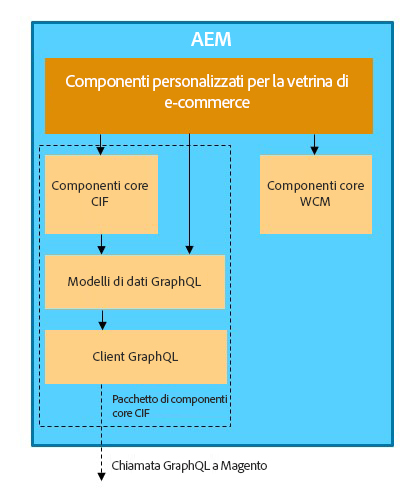

# AEM and Magento Integration using Commerce Integration Framework {#aem-magento-framework}

AEM e Magento sono integrati senza soluzione di continuità utilizzando Commerce Integration Framework (CIF). CIF consente AEM accedere a un&#39;istanza di Magento e comunicare con Magento tramite GraphQL. Consente inoltre agli AEM Author di utilizzare i selettori Prodotto e Categoria e la console Prodotto per sfogliare i dati di prodotto e categoria recuperati on-demand dal Magento. Inoltre, CIF fornisce una vetrina pronta all&#39;uso che può accelerare i progetti commerciali.

## Panoramica dell&#39;architettura {#overview}

L&#39;architettura generale è la seguente:

CIF si basa sul supporto GraphQL. Il canale di comunicazione principale tra AEM e Magento è Magenti API API  GraphQL . Esistono diversi modi per configurare la comunicazione tra AEM come Cloud Service e Magenti. Per informazioni dettagliate, consultate la pagina [Guida introduttiva](../getting-started.md) .

All&#39;interno di CIF è supportato il modello di comunicazione lato server e lato client.
Le chiamate API lato server vengono implementate utilizzando il client  GraphQL generico e predefinito [, in combinazione con un](https://github.com/adobe/commerce-cif-magento-graphql) set di modellidi dati generati per lo schema GraphQL del Magento. Inoltre, è possibile utilizzare qualsiasi query GraphQL o mutazione in formato GQL.

Per i componenti lato client, creati con [React](https://reactjs.org/), viene utilizzato il client  Apollo.

## AEM CIF Core Component Architecture {#cif-core-components}

[AEM componenti](https://github.com/adobe/aem-core-cif-components) di base CIF seguono modelli di progettazione e procedure ottimali molto simili a quelli dei componenti [di base](https://github.com/adobe/aem-core-wcm-components)AEM WCM.

La logica di business e la comunicazione back-end con Magento per i componenti core CIF AEM è implementata nei modelli Sling. Nel caso sia necessario personalizzare questa logica per soddisfare i requisiti specifici del progetto, è possibile utilizzare il Pattern di delega per i modelli Sling.

>[!TIP]
>
>La pagina [Personalizzazione dei componenti](../customizing/customize-cif-components.md) di base CIFoffre un esempio dettagliato e procedure ottimali per la personalizzazione dei componenti di base CIF.

All&#39;interno dei progetti, AEM componenti CIF di base e componenti di progetto personalizzati possono facilmente recuperare il client configurato per uno store di Magenti associato a una pagina AEM tramite la configurazione Sling Context-Aware.
