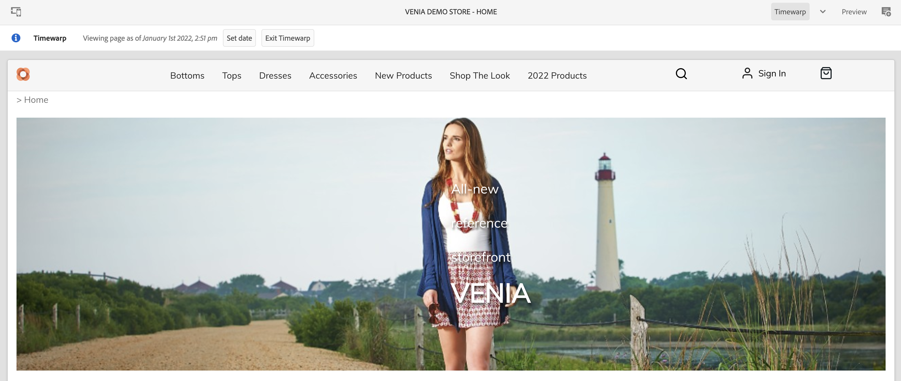

# Creazione di esperienze Commerce {#authoring-commerce-experiences}

## Panoramica {#overview}

Il componente aggiuntivo CIF estende l’authoring AEM con funzionalità specifiche per l’e-commerce. In questo modo gli autori possono creare e gestire in modo efficiente esperienze relative all’e-commerce ottenendo l’accesso ai dati e ai contenuti dei prodotti senza lasciare il contesto.

## Pickers {#pickers}

I selettori di prodotti e categorie sono finestre di dialogo dell’interfaccia utente modali che offrono agli autori AEM un modo semplice per trovare e selezionare prodotti o categorie quando necessario. I componenti core, le associazioni di contenuti e i modelli di prodotto sono le aree tipiche con configurazioni che richiedono i dati del catalogo dei prodotti. I selettori supportano varie opzioni di configurazione, ad esempio selezione multipla, selezione di varianti e preselezione dei valori.

### Selettore prodotti {#product-picker}

Questo selettore offre la navigazione nella struttura del catalogo o la ricerca full-text per trovare il prodotto. I prodotti con variante offrono un’icona di cartella nella colonna &quot;Tipo&quot;. Fai clic sull’icona della cartella per aprire le varianti del prodotto selezionato.

Facendo clic sulla categoria padre, l’autore ritorna al livello di prodotto.

**Esempio di teaser prodotto**

La finestra di dialogo di configurazione di questo componente richiede un prodotto. CIF utilizza lo SKU come identificatore del prodotto. Gli autori possono inserire lo SKU manualmente oppure fare clic sull’icona della cartella per aprire il selettore dei prodotti. Dopo aver selezionato e chiuso il selettore, nella finestra di dialogo del componente viene visualizzato il nome del prodotto selezionato

### Selettore categoria {#category-picker}

Questo selettore offre una navigazione nella struttura del catalogo per trovare la categoria.

**Carosello categoria di esempio**

La finestra di dialogo di configurazione di questo componente richiede 1 : n categorie. CIF utilizza l’UID / ID come identificatore della categoria. Gli autori possono inserire l’UID manualmente o fare clic sull’icona della cartella per aprire il selettore delle categorie. Dopo aver selezionato e chiuso il selettore, nella finestra di dialogo del componente viene visualizzato il nome della categoria selezionata.

## Editor universale {#universal-editor}

L’editor universale è stato esteso con funzionalità per accedere ai dati dei prodotti in tempo reale e ai contenuti dei prodotti associati.

### Accesso ai dati di prodotto {#access-product-data}

La scheda &quot;Risorse&quot; nel pannello laterale dell’editor consente di accedere ai dati di prodotto selezionando il tipo &quot;Prodotti&quot;. I dati vengono recuperati in tempo reale dall’endpoint di e-commerce configurato. Il filtro è una ricerca full-text sull’endpoint e-commerce per trovare prodotti specifici.

Analogamente alle risorse, i prodotti possono essere eliminati su una pagina (che crea per impostazione predefinita un componente teaser di prodotto) o su componenti (attualmente supportati sono product teaser e product carosello).

### Aggiunta di collegamenti nei campi di testo tramite l’editor Rich Text {#rte}

Le pagine di catalogo dei prodotti CIF sono pagine virtuali di cui viene eseguito il rendering al volo. Pertanto, non è possibile incorporare collegamenti ipertestuali come per le normali pagine di AEM. CIF aggiunge una nuova azione &quot;Collegamenti commerciali&quot; all’editor Rich Text. Questa azione funziona esattamente come la normale azione &quot;Collegamento ipertestuale&quot;, ma consente agli autori di selezionare un prodotto o una categoria utilizzando i selettori.

    >[!NOTE]
    >
    > Se vengono selezionati sia la categoria che il prodotto, il prodotto verrà preso.

Questo crea un collegamento segnaposto che viene sostituito con un collegamento reale quando la pagina viene sottoposta a rendering.

### Accesso al contenuto del prodotto associato {#associated-content}

Se l’Editor universale riconosce i prodotti 1:n in una pagina, il pannello laterale mostra automaticamente la scheda &quot;Contenuto Commerce associato&quot;. Questa scheda consente agli autori di accedere rapidamente AEM contenuti ai quali è stato applicato un tag nel prodotto (consulta [arricchire i dati dei prodotti con il contenuto AEM associato](./enrich-product-associated-content.md) per ulteriori informazioni). Questa scheda offre elenchi a discesa per filtrare il tipo di contenuto e i prodotti specifici se sulla pagina sono presenti più prodotti. L’utilizzo del contenuto funziona esattamente come l’utilizzo del contenuto della scheda &quot;Risorse&quot;.

### Anteprima dei dati di prodotto in fase di staging {#staged-data}

La modalità Timewarp nell’editor consente agli autori di visualizzare in anteprima e sfogliare un’esperienza AEM con dati di catalogo di prodotti in staging in base alla data di Timewarp.

I componenti visualizzano un indicatore visivo se la data utilizzata è in fase di staging.

## Omnisearch {#omnisearch}

L’utilizzo di Omnisearch è un modo semplice per i professionisti di trovare AEM contenuti e dati di catalogo dei prodotti utilizzando la ricerca full-text. Omnisearch eseguirà la ricerca full-text in AEM e nel backend commerce per trovare oggetti catalogo prodotti nel backend e AEM contenuto commerce. I risultati di AEM includono anche il contenuto a cui sono stati assegnati tag con dati di prodotto/categoria.

Il risultato è raggruppato per tipo.

    >[!NOTE]
    >
    > La ricerca full-text in Omnisearch non supporta i frammenti di contenuto associati. Utilizza SKU o UID per trovare i frammenti di contenuto associati.
