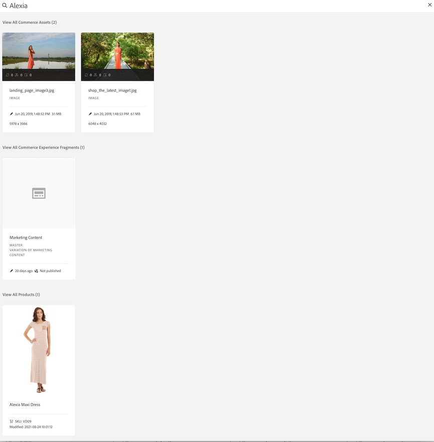

# Creazione di esperienze Commerce {#authoring-commerce-experiences}

## Panoramica {#overview}

Il componente aggiuntivo CIF estende l’authoring di AEM con funzionalità specifiche per l’e-commerce. Questo consente agli autori di creare e gestire in modo efficiente esperienze relative al commercio, accedendo ai dati e ai contenuti dei prodotti senza uscire dal contesto.

## Pickers {#pickers}

I selettori di prodotti e categorie sono finestre di dialogo modali dell’interfaccia utente che offrono agli autori di AEM un modo comodo per trovare e selezionare prodotti o categorie quando necessario. I Componenti core, le associazioni di contenuti e i modelli di prodotto sono le aree tipiche con configurazioni che richiedono i dati del catalogo dei prodotti. I selettori supportano varie opzioni di configurazione, come la selezione multipla, la selezione delle varianti e la preselezione dei valori.

### Selettore prodotti {#product-picker}

Questo selettore consente di sfogliare la struttura del catalogo o di eseguire ricerche full-text per trovare il prodotto. I prodotti con variante offrono un’icona di cartella nella colonna &quot;Tipo&quot;. Fai clic sull’icona della cartella per aprire le varianti del prodotto selezionato.

Facendo clic sulla categoria principale, l’autore ritorna al livello del prodotto.

#### Esempio di Product Teaser {#example-product-teaser}

La finestra di dialogo per la configurazione di questo componente richiede un prodotto. CIF utilizza lo SKU come identificatore del prodotto. Gli autori possono immettere manualmente lo SKU oppure fare clic sull’icona della cartella per aprire il selettore prodotti. Dopo aver selezionato e chiuso il selettore, nella finestra di dialogo del componente viene visualizzato il nome del prodotto selezionato

### Selettore categorie {#category-picker}

Questo selettore consente di sfogliare la struttura del catalogo per trovare la categoria.

#### Esempio di carosello categorie {#example-carousel}

La finestra di dialogo per configurazione di questo componente richiede le categorie 1: n. CIF utilizza UID/ID come identificatore della categoria. Gli autori possono accedere manualmente a UID oppure fare clic sull’icona della cartella per aprire il selettore delle categorie. Dopo aver selezionato e chiuso il selettore, nella finestra di dialogo del componente viene visualizzato il nome della categoria selezionata.

## Editor pagina {#page-editor}

L’Editor pagina in AEM è stato esteso con funzionalità che consentono di accedere in tempo reale ai dati di prodotto e ai contenuti di prodotto associati.

### Accesso ai dati di prodotto {#access-product-data}

La scheda &quot;Assets&quot; nel pannello laterale dell’editor consente di accedere ai dati dei prodotti selezionando il tipo &quot;Prodotti&quot;. I dati vengono recuperati in tempo reale dall’endpoint commerce configurato. Il filtro è una ricerca full-text sull’endpoint commerce per trovare prodotti specifici.

Analogamente alle risorse, i prodotti possono essere aggiunti a una pagina (creando un componente Product Teaser per impostazione predefinita) o a componenti (attualmente supportati sono Product Teaser e Product Carousel).

### Aggiunta di collegamenti nei campi di testo mediante l’editor Rich Text {#rte}

Le pagine del catalogo dei prodotti CIF sono pagine virtuali di cui viene eseguito il rendering immediato. Pertanto, non è possibile incorporare collegamenti ipertestuali come per le normali pagine di AEM. CIF aggiunge una nuova azione &quot;Collegamenti Commerce&quot; all’editor Rich Text. Questa azione funziona esattamente come la normale azione &quot;Collegamento ipertestuale&quot;, ma consente agli autori di selezionare un prodotto o una categoria utilizzando i selettori.

>[!NOTE]
>
> Se vengono selezionati sia la categoria che il prodotto, viene utilizzato il prodotto.

Questo crea un collegamento segnaposto che viene sostituito da un collegamento reale quando viene eseguito il rendering della pagina.

### Accesso al contenuto prodotto associato {#associated-content}

Se l&#39;editor riconosce 1:n prodotti in una pagina, il pannello laterale mostra automaticamente la scheda &quot;Contenuto Commerce associato&quot;. Questa scheda consente agli autori di accedere rapidamente al contenuto AEM con tag del prodotto. Per ulteriori informazioni, vedere [arricchire i dati del prodotto con il contenuto AEM associato](/help/commerce-cloud/cif-storefront/authoring/enrich-product-associated-content.md). Questa scheda offre elenchi a discesa per filtrare in base al tipo di contenuto e a prodotti specifici se sulla pagina sono presenti più prodotti. L’utilizzo del contenuto funziona esattamente come l’utilizzo del contenuto della scheda &quot;Assets&quot;.

### Anteprima dati prodotto in staging {#staged-data}

La modalità Timewarp nell’editor consente agli autori di visualizzare in anteprima e sfogliare un’esperienza AEM con i dati del catalogo dei prodotti in staging in base alla data Timewarp.

I componenti visualizzano un indicatore visivo se la data utilizzata è pubblicata nell’area intermedia.

## Omnisearch {#omnisearch}

L’utilizzo di Omnisearch è un modo semplice per i professionisti di trovare i contenuti e i dati del catalogo dei prodotti di AEM utilizzando la ricerca full-text. Omnisearch eseguirà una ricerca full-text in AEM e nel backend di Commerce per trovare gli oggetti del catalogo dei prodotti nel backend di Commerce e nel contenuto di AEM. I risultati di AEM includono anche i contenuti a cui sono stati assegnati tag con dati di prodotto/categoria.

Il risultato è raggruppato per tipo.

>[!NOTE]
>
> La ricerca full-text in Omnisearch non supporta i frammenti di contenuto associati. Utilizza SKU o UID per trovare i frammenti di contenuto associati.
