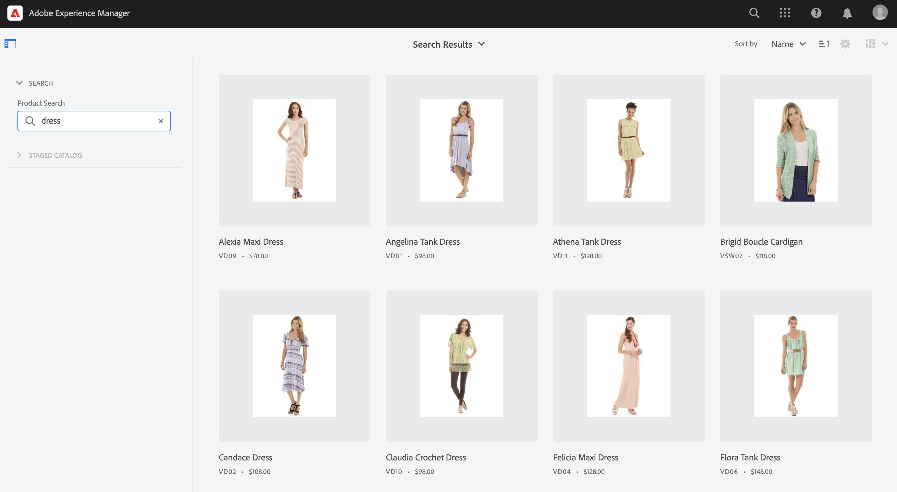

# Cockpit prodotto {#product-cockpit}

Scopri come utilizzare il pannello di comando del prodotto, che fornisce una panoramica unificata dei cataloghi di prodotti collegati e dei contenuti associati.

## Panoramica {#overview}

Il pannello di controllo prodotto fornisce una panoramica unificata dei cataloghi di prodotti collegati e dei contenuti associati. Tutto il contenuto associato dispone di collegamenti per accedervi rapidamente dalla cabina di pilotaggio.

I dati dei prodotti in staging includono qualsiasi mutazione futura, ad esempio nuove categorie, prodotti o proprietà aggiornate.

>[!NOTE]
>
>Il termine catalogo prodotti è intercambiabile con il punto vendita, la vista store e espressioni simili.

## Configurazione {#configuration}

I cataloghi di prodotti devono essere configurati in AEM. Per ulteriori informazioni, vedere [configurazione di archivio e cataloghi](/help/commerce-cloud/cif-storefront/getting-started.md#catalog).

L’abilitazione delle funzioni di catalogo in staging richiede l’autenticazione. Per ulteriori informazioni, vedere [Guida introduttiva](/help/commerce-cloud/cif-storefront/getting-started.md).

>[!NOTE]
>
>Le funzioni del catalogo in staging sono disponibili solo con Adobe Commerce e connettori di terze parti che supportano l’autenticazione basata su token.

## Apertura della cabina di comando del prodotto {#opening-product-cockpit}

Il modo più semplice per accedere al pannello di comando del prodotto è tramite il menu &quot;Commerce&quot; nel menu principale di AEM. È inoltre possibile utilizzare Omnisearch (cerca Commerce) o aprire `https://<yourAEMInstance>/commerce.html`.

## Esplorazione dei cataloghi di prodotti {#browsing-product-catalogs}

Il pannello di controllo Prodotto è organizzato in modo gerarchico seguendo la struttura del catalogo dei prodotti. Il primo livello mostra il livello principale del catalogo di tutti i cataloghi di prodotti configurati, comprese le metainformazioni del backend di e-commerce.

Facendo clic su una categoria vengono caricati gli elementi secondari della categoria selezionata.

Facendo clic su un prodotto vengono caricate le varianti di prodotto, se disponibili.

>[!NOTE]
>
>I dati del catalogo dei prodotti in AEM sono dati recuperati in tempo reale tramite l’endpoint commerce configurato. In AEM non viene memorizzato alcun dato del catalogo dei prodotti.

## Ricerca nei cataloghi di prodotti {#searching-product-catalog}

Nella scheda del filtro a sinistra è disponibile una ricerca full-text sull’intero catalogo dei prodotti per trovare rapidamente i prodotti.

## Esplorazione del catalogo prodotti di staging {#staged-product-catalogs}

Per impostazione predefinita, la cabina di comando del prodotto mostra i dati live del catalogo dei prodotti. L’utilizzo del &quot;CATALOGO STAGNATO&quot; nella scheda del filtro a sinistra carica il catalogo dei prodotti per qualsiasi data selezionata.

## Proprietà catalogo prodotti {#catalog-properties}

Facendo clic sull&#39;icona delle proprietà di un prodotto o di una categoria si apre la visualizzazione delle proprietà dell&#39;oggetto selezionato. Le proprietà aperte di una variante di prodotto sono uguali alle proprietà del prodotto principale.

### Schede Commerce {#tabs}

Le schede Generale e Variante mostrano le proprietà commerce predefinite provenienti dal backend di e-commerce. Questi dati (inclusi variants) è un dato di sola lettura in AEM, in quanto il sistema di registrazione è il back-end per l’e-commerce. La scheda Variante viene visualizzata solo per i prodotti con varianti e mostra un elenco di tutte le varianti.

### Schede contenuto AEM {#content-tabs}

In queste schede, raggruppate per tipi di contenuto AEM (Frammenti di esperienza, Frammenti di contenuto, Assets associato), viene visualizzato il contenuto AEM associato all’oggetto commerce. L&#39;azione &#39;Visualizza dettagli&#39; apre una nuova scheda del browser con il contenuto selezionato.

