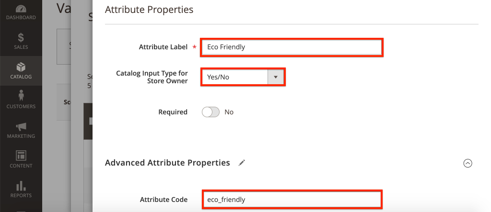
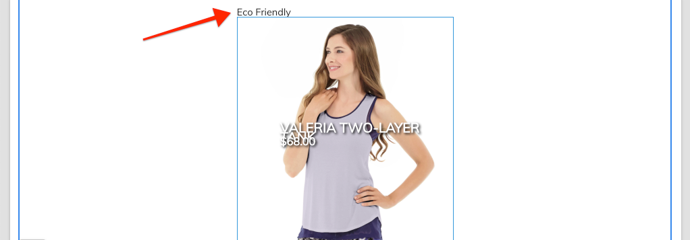
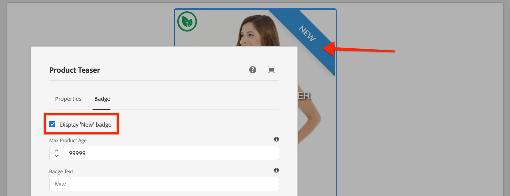

# Personalizzare i componenti core di AEM CIF {#customize-cif-components}

Il [progetto CIF Venia](https://github.com/adobe/aem-cif-guides-venia) è una base di codice di riferimento per l&#39;utilizzo di [componenti core CIF.](https://github.com/adobe/aem-core-cif-components) In questa esercitazione, estendi ulteriormente il componente [Product Teaser](https://github.com/adobe/aem-core-cif-components/tree/master/ui.apps/src/main/content/jcr_root/apps/core/cif/components/commerce/productteaser/v1/productteaser) per visualizzare un attributo personalizzato da Adobe Commerce. Scopri anche l’integrazione di GraphQL tra AEM e Adobe Commerce e gli hook di estensione forniti dai componenti core di CIF.

>[!TIP]
>
> Utilizza [Archetipo progetto AEM](https://github.com/adobe/aem-project-archetype) quando avvii l&#39;implementazione di e-commerce.

## Cosa verrà creato

Il marchio Venia ha recentemente iniziato a produrre alcuni prodotti utilizzando materiali sostenibili e l&#39;azienda desidera mostrare un distintivo **eco-friendly** come parte del Product Teaser. In Adobe Commerce viene creato un nuovo attributo personalizzato per indicare se un prodotto utilizza il materiale **Eco friendly**. Questo attributo personalizzato viene aggiunto come parte della query GraphQL e visualizzato nel Product Teaser per i prodotti specificati.


## Prerequisiti {#prerequisites}

Per completare questa esercitazione è necessario un ambiente di sviluppo locale. Questo ambiente include un’istanza in esecuzione di AEM configurata e connessa a un’istanza di Adobe Commerce. Rivedi i requisiti e i passaggi per [ la configurazione di uno sviluppo locale con AEM as a Cloud Service SDK.](/help/commerce-cloud/cif-storefront/develop.md) Per seguire completamente l&#39;esercitazione, è necessario disporre dell&#39;autorizzazione per aggiungere [Attributi a un prodotto](https://docs.magento.com/user-guide/catalog/product-attributes-add.html) in Adobe Commerce.

Per eseguire gli esempi di codice e i tutorial è inoltre necessario GraphQL IDE, ad esempio [GraphiQL](https://github.com/graphql/graphiql) o un&#39;estensione del browser. Se installi un’estensione del browser, accertati che possa impostare le intestazioni della richiesta. In Google Chrome, _Altair GraphQL Client_ è un&#39;estensione in grado di eseguire il processo.

## Clonare il progetto Venia {#clone-venia-project}

Clona il [progetto Venia,](https://github.com/adobe/aem-cif-guides-venia) e quindi sostituisci gli stili predefiniti.

>[!NOTE]
>
> **Puoi utilizzare un progetto esistente** (basato sull&#39;archetipo di progetto AEM con CIF incluso) e saltare questa sezione.

1. Esegui il seguente comando Git per clonare il progetto:

   ```shell
   $ git clone git@github.com:adobe/aem-cif-guides-venia.git
   ```

1. Crea e implementa il progetto in un’istanza locale di AEM:

   ```shell
   $ cd aem-cif-guides-venia/
   $ mvn clean install -PautoInstallSinglePackage,cloud
   ```

1. Aggiungi le configurazioni OSGi necessarie per connettere l’istanza AEM a un’istanza Adobe Commerce o aggiungi le configurazioni al progetto creato.

1. A questo punto, devi disporre di una versione funzionante di una vetrina connessa a un’istanza di Adobe Commerce. Passare alla pagina `US` > `Home` all&#39;indirizzo: [http://localhost:4502/editor.html/content/venia/us/en.html](http://localhost:4502/editor.html/content/venia/us/en.html).

   Dovresti vedere che la vetrina si basa al momento sul tema Venia. Espandendo il menu principale della vetrina, dovresti vedere diverse categorie, a indicare che la connessione ad Adobe Commerce funziona.

   

## Creare il Product Teaser {#author-product-teaser}

Il componente Product Teaser viene esteso in tutta questa esercitazione. Come primo passo, aggiungi un’istanza del Product Teaser alla home page per comprenderne le funzionalità della linea di base.

1. Passa alla **home page** del sito: [http://localhost:4502/editor.html/content/acme/us/en.html](http://localhost:4502/editor.html/content/acme/us/en.html)

1. Inserisci un nuovo componente **Product Teaser** nel contenitore di layout principale della pagina.

   

1. Espandi il pannello laterale (se non è già attivato) e imposta l&#39;elenco a discesa di ricerca risorse su **Prodotti**. In questo elenco dovrebbe essere visualizzato un elenco dei prodotti disponibili da un’istanza di Adobe Commerce connessa. Seleziona un prodotto e **trascinalo** sul componente **Product Teaser** nella pagina.

   

   >[!NOTE]
   >
   > Puoi anche configurare il prodotto visualizzato impostando il componente tramite la finestra di dialogo (clic sull’icona a forma di _chiave inglese_).

1. Ora puoi vedere un prodotto visualizzato dal Product Teaser. Il nome del prodotto e il prezzo del prodotto sono attributi predefiniti visualizzati.

   

## Aggiungere un attributo personalizzato in Adobe Commerce {#add-custom-attribute}

I prodotti e i dati dei prodotti visualizzati in AEM sono memorizzati in Adobe Commerce. Quindi aggiungi un attributo per **Eco Friendly** come parte dell&#39;attributo del prodotto impostato utilizzando l&#39;interfaccia utente di Adobe Commerce.

>[!TIP]
>
> Hai già un attributo personalizzato **Sì/No** come parte del tuo set di attributi di prodotto? Puoi utilizzarlo e saltare questa sezione.

1. Accedi all’istanza di Adobe Commerce.
1. Passa a **Catalogo** > **Prodotti**.
1. Aggiorna il filtro di ricerca in modo da trovare il **prodotto configurabile** utilizzato quando aggiunto al componente Teaser nell&#39;esercizio precedente. Apri il prodotto in modalità di modifica.

   

1. Dalla visualizzazione del prodotto, fare clic su **Aggiungi attributo** > **Crea nuovo attributo**.
1. Compila il modulo **Nuovo attributo** con i seguenti valori (lascia le impostazioni predefinite per gli altri valori)

   | Set di campi | Etichetta campo | Valore |
   | ----------------------------- | ------------------ | ---------------- |
   | Proprietà attributo | Etichetta attributo | **Rispettoso Dell&#39;Ambiente** |
   | Proprietà attributo | Tipo di input catalogo | **Sì/No** |
   | Proprietà attributi avanzate | Codice attributo | **ecologico** |

   

   Al termine, fai clic su **Salva attributo**.

1. Scorri fino alla parte inferiore del prodotto ed espandi l&#39;intestazione **Attributi**. Dovresti visualizzare il nuovo campo **Eco-friendly**. Passa a **Sì**.

   

   **Salva** le modifiche apportate al prodotto.

   >[!TIP]
   >
   > Ulteriori dettagli sulla gestione di [Attributi del prodotto sono disponibili nella guida utente di Adobe Commerce.](https://docs.magento.com/user-guide/catalog/attribute-best-practices.html)

1. Passa a **Sistema** > **Strumenti** > **Gestione cache**. Poiché è stato effettuato un aggiornamento allo schema dati, è necessario invalidare alcuni dei tipi di cache in Adobe Commerce.
1. Seleziona la casella accanto a **Configurazione** e invia il tipo di cache per **Aggiornamento**

   

   >[!TIP]
   >
   > Ulteriori dettagli sulla gestione della cache di [sono disponibili nella guida utente di Adobe Commerce.](https://docs.magento.com/user-guide/system/cache-management.html)

## Utilizzare un IDE GraphQL per verificare l&#39;attributo {#use-graphql-ide}

Prima di passare al codice AEM, è utile esplorare la [Panoramica di GraphQL](https://devdocs.magento.com/guides/v2.4/graphql/) utilizzando un IDE GraphQL. L’integrazione di Adobe Commerce con AEM viene eseguita principalmente tramite una serie di query GraphQL. Comprendere e modificare le query di GraphQL è uno dei modi principali per estendere i Componenti core di CIF.

Utilizzare quindi un IDE di GraphQL per verificare che l&#39;attributo `eco_friendly` sia stato aggiunto al set di attributi del prodotto. Le schermate di questo tutorial utilizzano l&#39;estensione _Altair GraphQL Client_ Google Chrome.

1. Aprire GraphQL IDE e immettere l&#39;URL `http://<commerce-server>/graphql` nella barra dell&#39;URL dell&#39;IDE o dell&#39;estensione.
1. Aggiungi la seguente [query prodotti](https://devdocs.magento.com/guides/v2.4/graphql/queries/products.html) dove `YOUR_SKU` è il **SKU** del prodotto utilizzato nell&#39;esercizio precedente:

   ```json
     {
       products(
       filter: { sku: { eq: "YOUR_SKU" } }
       ) {
           items {
           name
           sku
           eco_friendly
           }
       }
   }
   ```

1. Esegui la query e dovresti ricevere una risposta simile alla seguente:

   ```json
   {
     "data": {
       "products": {
         "items": [
           {
             "name": "Valeria Two-Layer Tank",
             "sku": "VT11",
             "eco_friendly": 1
           }
         ]
       }
     }
   }
   ```

   

   Il valore di **Yes** è un numero intero di **1**. Questo valore è utile quando scrivi la query GraphQL in Java™.

   >[!TIP]
   >
   > Per ulteriori informazioni, vedere [Adobe Commerce GraphQL.](https://devdocs.magento.com/guides/v2.4/graphql/index.html)

## Aggiornare il modello Sling per Product Teaser {#updating-sling-model-product-teaser}

Ora puoi estendere la logica di business del Product Teaser implementando un modello Sling. I [modelli Sling](https://sling.apache.org/documentation/bundles/models.html) sono &quot;POJO&quot; (Plain Old Java™ Objects) basati su annotazioni che implementano la logica di business necessaria per il componente. I modelli Sling vengono utilizzati con gli script HTL come parte del componente. Segui il pattern di delega [per modelli Sling](https://github.com/adobe/aem-core-wcm-components/wiki/Delegation-Pattern-for-Sling-Models) in modo da estendere parti del modello esistente di Product Teaser.

I modelli Sling sono implementati come Java™ e si trovano nel modulo **core** del progetto generato.

Utilizza [l&#39;IDE che preferisci](https://experienceleague.adobe.com/docs/experience-manager-learn/cloud-service/local-development-environment-set-up/development-tools.html?lang=it#set-up-the-development-ide) per importare il progetto Venia. Le schermate utilizzate provengono dall&#39;IDE [Codice Visual Studio.](https://experienceleague.adobe.com/docs/experience-manager-learn/cloud-service/local-development-environment-set-up/development-tools.html?lang=it#microsoft-visual-studio-code)

1. Nell&#39;IDE, passa al modulo **core** fino a: `core/src/main/java/com/venia/core/models/commerce/MyProductTeaser.java`.

   

   `MyProductTeaser.java` è un&#39;interfaccia Java™ che estende l&#39;interfaccia CIF [ProductTeaser](https://github.com/adobe/aem-core-cif-components/blob/master/bundles/core/src/main/java/com/adobe/cq/commerce/core/components/models/productteaser/ProductTeaser.java).

   È già stato aggiunto un nuovo metodo denominato `isShowBadge()` per visualizzare un badge se il prodotto è considerato &quot;Nuovo&quot;.

1. Aggiungi `isEcoFriendly()` all&#39;interfaccia:

   ```java
   @ProviderType
   public interface MyProductTeaser extends ProductTeaser {
       // Extend the existing interface with the additional properties which you
       // want to expose to the HTL template.
       public Boolean isShowBadge();
   
       public Boolean isEcoFriendly();
   }
   ```

   Questo nuovo metodo viene introdotto per incapsulare la logica per indicare se l&#39;attributo `eco_friendly` del prodotto è impostato su **Yes** o **No**.

1. Quindi, controllare `MyProductTeaserImpl.java` alle `core/src/main/java/com/venia/core/models/commerce/MyProductTeaserImpl.java`.

   Il pattern di delega [ per modelli Sling](https://github.com/adobe/aem-core-wcm-components/wiki/Delegation-Pattern-for-Sling-Models) consente a `MyProductTeaserImpl` di fare riferimento al modello `ProductTeaser` tramite la proprietà `sling:resourceSuperType`:

   ```java
   @Self
   @Via(type = ResourceSuperType.class)
   private ProductTeaser productTeaser;
   ```

   Per i metodi che non si desidera ignorare o modificare, è possibile restituire il valore restituito da `ProductTeaser`. Ad esempio:

   ```java
   @Override
   public String getImage() {
       return productTeaser.getImage();
   }
   ```

   Questo metodo riduce al minimo la quantità di codice Java™ che un’implementazione deve scrivere.

1. Uno dei punti di estensione aggiuntivi forniti dai componenti core di AEM CIF è `AbstractProductRetriever`, che fornisce accesso ad attributi di prodotto specifici. Ispezionare il metodo `initModel()`:

   ```java
   import javax.annotation.PostConstruct;
   ...
   @Model(adaptables = SlingHttpServletRequest.class, adapters = MyProductTeaser.class, resourceType = MyProductTeaserImpl.RESOURCE_TYPE)
   public class MyProductTeaserImpl implements MyProductTeaser {
       ...
       private AbstractProductRetriever productRetriever;
   
       /* add this method to initialize the productRetriever */
       @PostConstruct
       public void initModel() {
           productRetriever = productTeaser.getProductRetriever();
   
           if (productRetriever != null) {
               productRetriever.extendProductQueryWith(p -> p.createdAt());
           }
   
       }
   ...
   ```

   L&#39;annotazione `@PostConstruct` assicura che questo metodo venga chiamato quando il modello Sling viene inizializzato.

   La query GraphQL del prodotto è già stata estesa utilizzando il metodo `extendProductQueryWith` per recuperare l&#39;attributo aggiuntivo `created_at`. Questo attributo viene successivamente utilizzato come parte del metodo `isShowBadge()`.

1. Aggiornare la query GraphQL per includere l&#39;attributo `eco_friendly` nella query parziale:

   ```java
   //MyProductTeaserImpl.java
   
   private static final String ECO_FRIENDLY_ATTRIBUTE = "eco_friendly";
   
   @PostConstruct
   public void initModel() {
       productRetriever = productTeaser.getProductRetriever();
   
       if (productRetriever != null) {
           productRetriever.extendProductQueryWith(p -> p
               .createdAt()
               .addCustomSimpleField(ECO_FRIENDLY_ATTRIBUTE)
           );
       }
   }
   ```

   L&#39;aggiunta al metodo `extendProductQueryWith` è un modo potente per garantire che gli attributi di prodotto aggiuntivi siano disponibili per il resto del modello. Inoltre si riduce la quantità di query eseguite.

   Nel codice precedente, `addCustomSimpleField` viene utilizzato per recuperare l&#39;attributo `eco_friendly`. Questo attributo illustra come eseguire una query per gli attributi personalizzati che fanno parte dello schema di Adobe Commerce.

   >[!NOTE]
   >
   > Il metodo `createdAt()` è stato implementato come parte dell&#39;interfaccia del prodotto [.](https://github.com/adobe/commerce-cif-magento-graphql/blob/master/src/main/java/com/adobe/cq/commerce/magento/graphql/ProductInterface.java) La maggior parte degli attributi dello schema comunemente trovati è stata implementata, quindi utilizza solo `addCustomSimpleField` per gli attributi realmente personalizzati.

1. Aggiungi un logger per eseguire il debug del codice Java™:

   ```java
   import org.slf4j.Logger;
   import org.slf4j.LoggerFactory;
   ...
   @Model(adaptables = SlingHttpServletRequest.class, adapters = MyProductTeaser.class, resourceType = MyProductTeaserImpl.RESOURCE_TYPE)
   public class MyProductTeaserImpl implements MyProductTeaser {
   
   private static final Logger LOGGER = LoggerFactory.getLogger(MyProductTeaserImpl.class);
   ```

1. Quindi, implementare il metodo `isEcoFriendly()`:

   ```java
   @Override
   public Boolean isEcoFriendly() {
   
       Integer ecoFriendlyValue;
       try {
           ecoFriendlyValue = productRetriever.fetchProduct().getAsInteger(ECO_FRIENDLY_ATTRIBUTE);
           if(ecoFriendlyValue != null && ecoFriendlyValue.equals(Integer.valueOf(1))) {
               LOGGER.info("*** Product is Eco Friendly**");
               return true;
           }
       } catch (SchemaViolationError e) {
           LOGGER.error("Error retrieving eco friendly attribute");
       }
       LOGGER.info("*** Product is not Eco Friendly**");
       return false;
   }
   ```

   Nel metodo precedente, viene utilizzato `productRetriever` per recuperare il prodotto e il metodo `getAsInteger()` per ottenere il valore dell&#39;attributo `eco_friendly`. In base alle query GraphQL eseguite in precedenza, si sa che il valore previsto quando l&#39;attributo `eco_friendly` è impostato su &quot;**Yes**&quot; è in realtà un numero intero di **1**.

   Ora che il modello Sling è stato aggiornato, è necessario aggiornare il markup del componente per visualizzare effettivamente un indicatore di **Rispettoso dell&#39;ambiente** basato sul modello Sling.

## Personalizzazione del markup del Product Teaser {#customize-markup-product-teaser}

I componenti AEM vengono spesso estesi per modificare il markup generato dal componente. Questa modifica viene eseguita eseguendo l&#39;override dello [script HTL](https://experienceleague.adobe.com/docs/experience-manager-htl/content/overview.html?lang=it) utilizzato dal componente per eseguire il rendering del relativo markup. HTML Template Language (HTL) è un linguaggio per modelli leggero utilizzato dai componenti di AEM per eseguire il rendering dinamico del markup in base al contenuto creato, in modo che sia possibile riutilizzare i componenti. Il Product Teaser, ad esempio, può essere riutilizzato più volte per visualizzare prodotti diversi.

In questo caso, desideri applicare un banner sopra il teaser per indicare che il prodotto è &quot;eco-compatibile&quot; in base a un attributo personalizzato. Il modello di progettazione per [personalizzare il markup](https://experienceleague.adobe.com/docs/experience-manager-core-components/using/developing/customizing.html?lang=it#customizing-the-markup) di un componente è standard per tutti i componenti di AEM, non solo per i componenti core di AEM CIF.

>[!NOTE]
>
> Se personalizzi un componente utilizzando i selettori di prodotti e categorie di CIF, come questo Product Teaser o il componente pagina di CIF, assicurati di includere la libreria client `cif.shell.picker` richiesta per le finestre di dialogo del componente. Per informazioni dettagliate, consulta [Utilizzo del selettore prodotti e categorie di CIF](use-cif-pickers.md).

1. Nell&#39;IDE, spostarsi ed espandere il modulo `ui.apps`, espandere la gerarchia delle cartelle in `ui.apps/src/main/content/jcr_root/apps/venia/components/commerce/productteaser` e controllare il file `.content.xml`.

   

   ```xml
   <?xml version="1.0" encoding="UTF-8"?>
   <jcr:root xmlns:sling="http://sling.apache.org/jcr/sling/1.0" xmlns:cq="http://www.day.com/jcr/cq/1.0" xmlns:jcr="http://www.jcp.org/jcr/1.0"
       jcr:description="Product Teaser Component"
       jcr:primaryType="cq:Component"
       jcr:title="Product Teaser"
       sling:resourceSuperType="core/cif/components/commerce/productteaser/v1/productteaser"
       componentGroup="Venia - Commerce"/>
   ```

   La definizione del componente precedente si riferisce al componente Product Teaser nel progetto. Osserva la proprietà `sling:resourceSuperType="core/cif/components/commerce/productteaser/v1/productteaser"`. Questa proprietà è un esempio di creazione di un [componente proxy](https://experienceleague.adobe.com/docs/experience-manager-core-components/using/get-started/using.html?lang=it#create-proxy-components). Invece di copiare e incollare gli script HTL di Product Teaser dai componenti core di AEM CIF, puoi utilizzare `sling:resourceSuperType` per ereditare tutte le funzionalità.

1. Aprire il file `productteaser.html`. Questo file è una copia del file `productteaser.html` dal [Product Teaser di CIF.](https://github.com/adobe/aem-core-cif-components/blob/master/ui.apps/src/main/content/jcr_root/apps/core/cif/components/commerce/productteaser/v1/productteaser/productteaser.html)

   ```html
   <!--/* productteaser.html */-->
   <sly
     data-sly-use.product="com.venia.core.models.commerce.MyProductTeaser"
     data-sly-use.templates="core/wcm/components/commons/v1/templates.html"
     data-sly-use.actionsTpl="actions.html"
     data-sly-test.isConfigured="${properties.selection}"
     data-sly-test.hasProduct="${product.url}"
   ></sly>
   ```

   Il modello Sling per `MyProductTeaser` è utilizzato e assegnato alla variabile `product`.

1. Modificare `productteaser.html` in modo da poter chiamare il metodo `isEcoFriendly` implementato nell&#39;esercizio precedente:

   ```html
   ...
   <div
     data-sly-test="${isConfigured && hasProduct}"
     class="item__root"
     data-cmp-is="productteaser"
     data-virtual="${product.virtualProduct}"
   >
     <div data-sly-test="${product.showBadge}" class="item__badge">
       <span>${properties.text || 'New'}</span>
     </div>
     <!--/* Insert call to Eco Friendly here */-->
     <div data-sly-test="${product.ecoFriendly}" class="item__eco">
       <span>Eco Friendly</span>
     </div>
     ...
   </div>
   ```

   Quando si chiama un metodo Sling Model in HTL, la parte `get` e `is` del metodo viene eliminata e la prima lettera viene convertita in minuscolo. `isShowBadge()` diventa `.showBadge` e `isEcoFriendly` diventa `.ecoFriendly`. In base al valore booleano restituito da `.isEcoFriendly()` determina se `<span>Eco Friendly</span>` è visualizzato.

   Ulteriori informazioni su `data-sly-test` e altre istruzioni di blocco HTL sono disponibili in [Specifica HTL.](https://experienceleague.adobe.com/docs/experience-manager-htl/content/specification.html?lang=it)

1. Salva le modifiche e distribuisci gli aggiornamenti in AEM utilizzando le abilità Maven, da un terminale della riga di comando:

   ```shell
   $ cd aem-cif-guides-venia/
   $ mvn clean install -PautoInstallSinglePackage,cloud
   ```

1. Apri una nuova finestra del browser e passa a AEM e alla **console OSGi** > **Stato** > **Modelli Sling**: [http://localhost:4502/system/console/status-slingmodels](http://localhost:4502/system/console/status-slingmodels)

1. Cerca `MyProductTeaserImpl` e dovresti vedere una riga come la seguente:

   ```plain
   com.venia.core.models.commerce.MyProductTeaserImpl - venia/components/commerce/productteaser
   ```

   Questa riga indica che il modello Sling è correttamente distribuito e mappato al componente corretto.

1. Aggiorna alla **home page di Venia** all&#39;indirizzo [http://localhost:4502/editor.html/content/venia/us/en.html](http://localhost:4502/editor.html/content/venia/us/en.html) in cui è stato aggiunto il Product Teaser.

   

   Se l&#39;attributo `eco_friendly` del prodotto è impostato su **Yes**, nella pagina dovrebbe essere visualizzato il testo &quot;Eco-friendly&quot;. Prova a passare a prodotti diversi per vedere come cambia il comportamento.

1. Aprire quindi AEM `error.log` per visualizzare le istruzioni di registro aggiunte. `error.log` è in `<AEM SDK Install Location>/crx-quickstart/logs/error.log`.

   Cerca nei registri di AEM per visualizzare le istruzioni di registro aggiunte nel modello Sling:

   ```plain
   2020-08-28 12:57:03.114 INFO [com.venia.core.models.commerce.MyProductTeaserImpl] *** Product is Eco Friendly**
   ...
   2020-08-28 13:01:00.271 INFO [com.venia.core.models.commerce.MyProductTeaserImpl] *** Product is not Eco Friendly**
   ...
   ```

   >[!CAUTION]
   >
   > È inoltre possibile che vengano visualizzate alcune tracce dello stack se il prodotto utilizzato nel teaser non include l&#39;attributo `eco_friendly` come parte del relativo set di attributi.

## Aggiungi stili per il badge eco-compatibile {#add-styles}

A questo punto, la logica per la visualizzazione del badge **Rispettoso dell&#39;ambiente** funziona, ma il testo normale potrebbe utilizzare alcuni stili. Aggiungere quindi un&#39;icona e gli stili al modulo `ui.frontend` per completare l&#39;implementazione.

1. Scarica il file [eco_friendly.svg](../assets/customize-cif-components/eco_friendly.svg). Questo file viene utilizzato come badge **Rispettoso dell&#39;ambiente**.
1. Tornare all&#39;IDE e passare alla cartella `ui.frontend`.
1. Aggiungere il file `eco_friendly.svg` alla cartella `ui.frontend/src/main/resources/images`:

   

1. Aprire il file `productteaser.scss` in `ui.frontend/src/main/styles/commerce/_productteaser.scss`.
1. Aggiungere le regole Sass seguenti nella classe `.productteaser`:

   ```scss
   .productteaser {
       ...
       .item__eco {
           width: 60px;
           height: 60px;
           left: 0px;
           overflow: hidden;
           position: absolute;
           padding: 5px;
   
       span {
           display: block;
           position: absolute;
           width: 45px;
           height: 45px;
           text-indent: -9999px;
           background: no-repeat center center url('../resources/images/eco_friendly.svg');
           }
       }
   ...
   }
   ```

   >[!NOTE]
   >
   > Per ulteriori dettagli sui flussi di lavoro front-end, vedi [Personalizzazione dei componenti core di CIF](./style-cif-component.md).

1. Salva le modifiche e distribuisci gli aggiornamenti in AEM utilizzando le abilità Maven, da un terminale della riga di comando:

   ```shell
   $ cd aem-cif-guides-venia/
   $ mvn clean install -PautoInstallSinglePackage,cloud
   ```

1. Aggiorna alla **home page di Venia** all&#39;indirizzo [http://localhost:4502/editor.html/content/venia/us/en.html](http://localhost:4502/editor.html/content/venia/us/en.html) in cui è stato aggiunto il Product Teaser.

   

## Complimenti {#congratulations}

Hai personalizzato il tuo primo componente AEM CIF. È possibile [scaricare i file della soluzione qui.](../assets/customize-cif-components/customize-cif-component-SOLUTION_FILES.zip)

## Sfida bonus {#bonus-challenge}

Esamina la funzionalità del badge **Nuovo** che è già stato implementato nel Product Teaser. Prova ad aggiungere una casella di controllo aggiuntiva per consentire agli autori di controllare quando deve essere visualizzato il badge **Rispettoso dell&#39;ambiente**. Aggiorna la finestra di dialogo del componente in `ui.apps/src/main/content/jcr_root/apps/venia/components/commerce/productteaser/_cq_dialog/.content.xml`.



## Risorse aggiuntive {#additional-resources}

- [AEM Archetype](https://experienceleague.adobe.com/docs/experience-manager-core-components/using/developing/archetype/overview.html?lang=it)
- [Componenti core CIF di AEM](https://github.com/adobe/aem-core-cif-components)
- [Personalizzazione dei componenti core](https://experienceleague.adobe.com/docs/experience-manager-core-components/using/developing/customizing.html?lang=it)
- [Guida introduttiva ad AEM Sites](https://experienceleague.adobe.com/it/docs/experience-manager-learn/getting-started-wknd-tutorial-develop/overview)
- [Utilizzo del selettore prodotti e categorie di CIF](use-cif-pickers.md)
